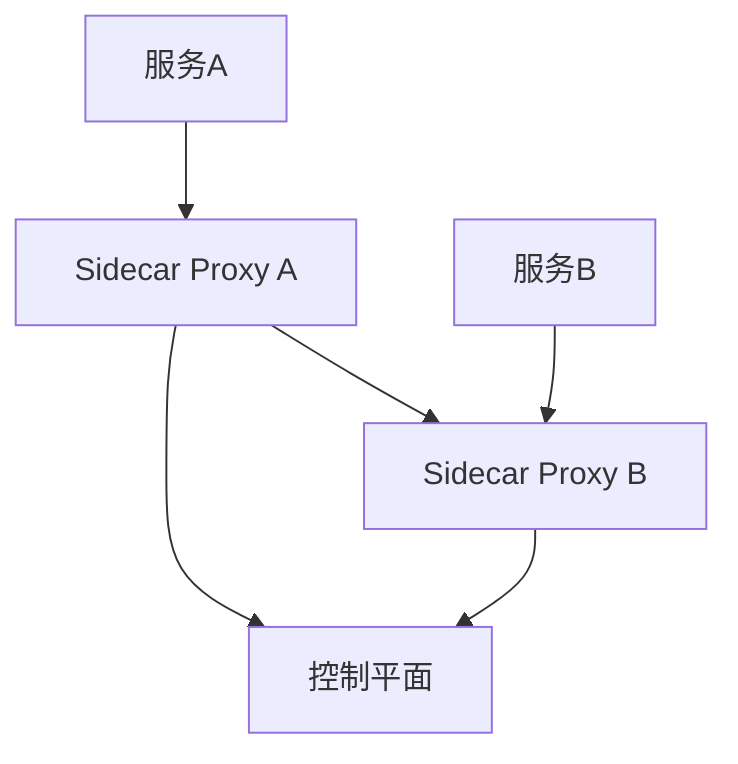
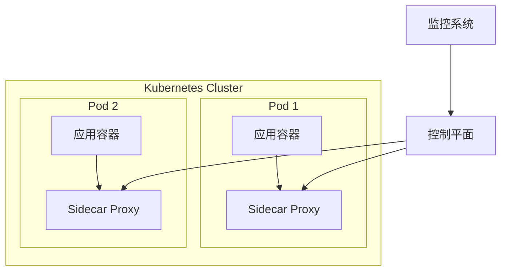

# 云原生分析（Cloud Native Analysis）

---

## 目录

1. 云原生基础理论
2. 容器化与编排技术
3. 微服务与服务网格
4. Golang云原生实践
5. 多表征内容
6. 交叉引用与目录导航

---

## 1. 云原生基础理论

### 1.1 定义

> 云原生是一种构建和运行应用程序的方法，充分利用云计算模型的优势。

### 1.2 核心原则

- **可扩展性**: 水平扩展能力
- **弹性**: 故障恢复能力
- **可观测性**: 监控和调试能力
- **自动化**: 部署和运维自动化

### 1.3 技术栈

- 容器化: Docker, containerd
- 编排: Kubernetes, Docker Swarm
- 服务网格: Istio, Linkerd
- 监控: Prometheus, Grafana

---

## 2. 容器化与编排技术

### 2.1 容器化基础

```latex
\textbf{定义 2.1} (容器): 容器是一个轻量级、可移植的软件包，包含运行应用程序所需的所有依赖项。

\textbf{容器特性}:
\begin{itemize}
  \item 隔离性: 进程、文件系统、网络隔离
  \item 可移植性: 跨平台运行
  \item 轻量级: 共享主机内核
  \item 快速启动: 秒级启动时间
\end{itemize}
```

### 2.2 Kubernetes编排

```yaml
# 典型的Kubernetes部署配置
apiVersion: apps/v1
kind: Deployment
metadata:
  name: golang-app
spec:
  replicas: 3
  selector:
    matchLabels:
      app: golang-app
  template:
    metadata:
      labels:
        app: golang-app
    spec:
      containers:
      - name: golang-app
        image: golang-app:latest
        ports:
        - containerPort: 8080
```

### 2.3 Golang容器化实践

```go
// Dockerfile示例
FROM golang:1.21-alpine AS builder
WORKDIR /app
COPY go.mod go.sum ./
RUN go mod download
COPY . .
RUN CGO_ENABLED=0 GOOS=linux go build -a -installsuffix cgo -o main .

FROM alpine:latest
RUN apk --no-cache add ca-certificates
WORKDIR /root/
COPY --from=builder /app/main .
CMD ["./main"]
```

---

## 3. 微服务与服务网格

### 3.1 微服务架构

```latex
\textbf{定义 3.1} (微服务): 微服务是一种将应用程序构建为一组小型自治服务的架构风格。

\textbf{微服务特性}:
\begin{itemize}
  \item 单一职责: 每个服务专注于特定业务功能
  \item 独立部署: 服务可以独立开发和部署
  \item 技术多样性: 不同服务可以使用不同技术栈
  \item 数据自治: 每个服务管理自己的数据
\end{itemize}
```

### 3.2 服务网格



### 3.3 Golang微服务实现

```go
// 微服务示例
package main

import (
    "github.com/gin-gonic/gin"
    "github.com/go-micro/plugins/v4/registry/kubernetes"
    "go-micro.dev/v4"
    "go-micro.dev/v4/registry"
)

func main() {
    // 创建微服务
    service := micro.NewService(
        micro.Name("user-service"),
        micro.Registry(kubernetes.NewRegistry()),
    )
    
    // 初始化服务
    service.Init()
    
    // 启动HTTP服务器
    r := gin.Default()
    r.GET("/users", func(c *gin.Context) {
        c.JSON(200, gin.H{"message": "User service"})
    })
    
    // 运行服务
    service.Run()
}
```

---

## 4. Golang云原生实践

### 4.1 健康检查

```go
// 健康检查处理器
func healthCheck(c *gin.Context) {
    c.JSON(200, gin.H{
        "status": "healthy",
        "timestamp": time.Now().Unix(),
        "version": "1.0.0",
    })
}

// 就绪检查
func readinessCheck(c *gin.Context) {
    // 检查数据库连接
    if err := db.Ping(); err != nil {
        c.JSON(503, gin.H{"status": "not ready"})
        return
    }
    
    c.JSON(200, gin.H{"status": "ready"})
}
```

### 4.2 配置管理

```go
// 使用环境变量配置
type Config struct {
    Port     string `env:"PORT" envDefault:"8080"`
    Database string `env:"DATABASE_URL" envDefault:"localhost:5432"`
    Redis    string `env:"REDIS_URL" envDefault:"localhost:6379"`
}

func loadConfig() (*Config, error) {
    var cfg Config
    if err := env.Parse(&cfg); err != nil {
        return nil, err
    }
    return &cfg, nil
}
```

### 4.3 日志和监控

```go
// 结构化日志
import (
    "go.uber.org/zap"
    "github.com/prometheus/client_golang/prometheus"
)

var (
    requestCounter = prometheus.NewCounterVec(
        prometheus.CounterOpts{
            Name: "http_requests_total",
            Help: "Total number of HTTP requests",
        },
        []string{"method", "endpoint", "status"},
    )
)

func setupLogging() *zap.Logger {
    logger, _ := zap.NewProduction()
    defer logger.Sync()
    return logger
}
```

---

## 5. 多表征内容

### 5.1 云原生架构图



### 5.2 性能模型

```latex
\textbf{定理 5.1} (容器性能): 
对于容器化应用，性能模型为：
P(container) = P(app) + P(container_runtime) + P(overhead)

其中：
\begin{itemize}
  \item P(app): 应用程序性能
  \item P(container_runtime): 容器运行时开销
  \item P(overhead): 容器化额外开销
\end{itemize}
```

### 5.3 扩展性分析

```latex
\textbf{定义 5.2} (水平扩展): 
水平扩展能力定义为：
Scalability(S) = \frac{Throughput(S_n)}{Throughput(S_1)} \times \frac{1}{n}

其中n是实例数量，S_n是n个实例的系统。
```

---

## 6. 交叉引用与目录导航

- [架构分析](../01-Architecture-Design/README.md)
- [微服务分析](../13-Microservice-Analysis/README.md)
- [性能优化](../06-Performance-Optimization/README.md)
- [DevOps运维](../09-DevOps-Operations/README.md)

---

> 本文档持续完善，欢迎补充与修订。
