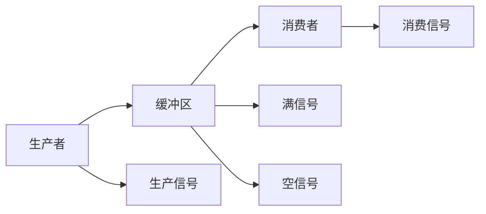
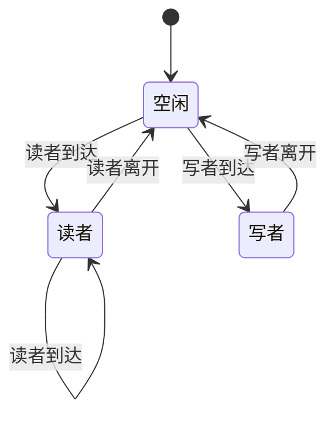
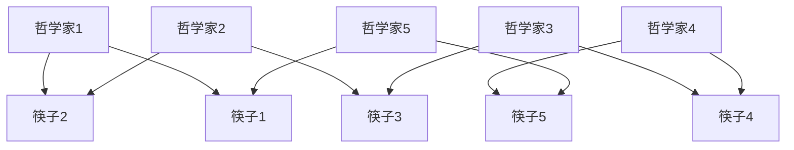
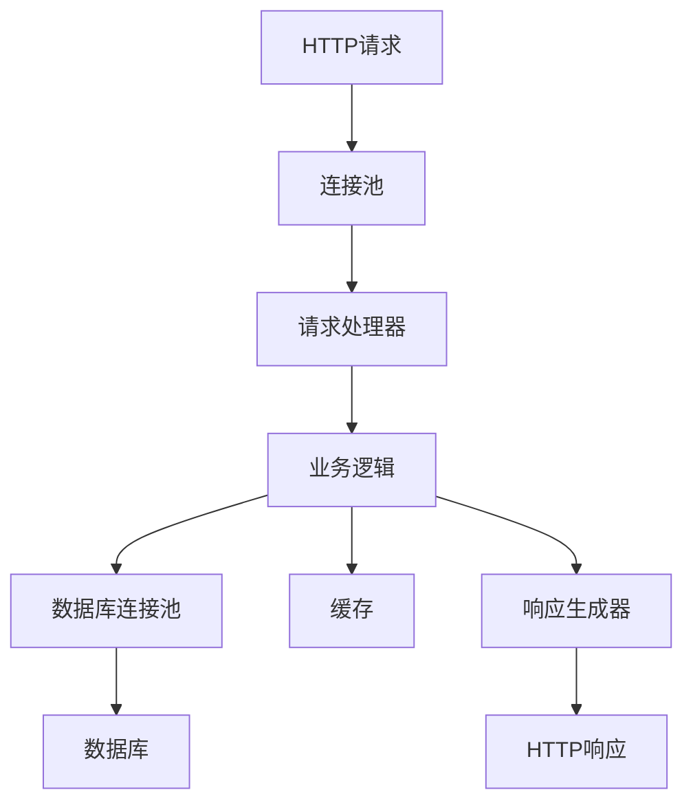
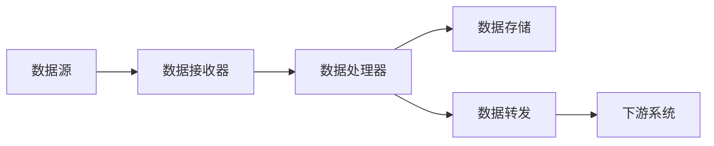

# 并发算法分析

## 概述

本文档基于 `/model` 目录中的并发相关内容，对并发算法进行深入的形式化分析和Golang实现。并发算法是处理多线程、多进程环境下资源共享和同步的核心算法，在Golang中通过goroutine和channel实现。

## 目录

1. [理论基础](#理论基础)
2. [形式化定义](#形式化定义)
3. [核心算法](#核心算法)
4. [Golang实现](#golang实现)
5. [性能分析](#性能分析)
6. [最佳实践](#最佳实践)
7. [案例分析](#案例分析)

## 理论基础

### 1. 并发计算模型

#### 1.1 CSP模型

通信顺序进程(Communicating Sequential Processes, CSP)是Golang并发的基础模型：

- **进程**: 独立的计算单元
- **通道**: 进程间通信的媒介
- **通信**: 通过通道进行消息传递
- **同步**: 通过通道实现同步

#### 1.2 并发原语

- **Goroutine**: 轻量级线程
- **Channel**: 类型安全的通信机制
- **Mutex**: 互斥锁
- **WaitGroup**: 等待组
- **Once**: 一次性执行

### 2. 并发问题分类

#### 2.1 同步问题

- **竞态条件**: 多个goroutine同时访问共享资源
- **死锁**: 多个goroutine相互等待
- **活锁**: goroutine不断重试但无法前进
- **饥饿**: 某些goroutine无法获得资源

#### 2.2 通信问题

- **消息传递**: 通过channel传递消息
- **信号量**: 控制并发访问数量
- **屏障**: 等待多个goroutine到达同步点
- **条件变量**: 等待特定条件满足

## 形式化定义

### 1. 并发系统定义

```latex
\textbf{定义 1.1} (并发系统): 并发系统是一个六元组 $\mathcal{CS} = (P, C, S, E, T, R)$，其中：

\begin{itemize}
    \item $P = \{p_1, p_2, \ldots, p_n\}$ 是进程集合
    \item $C = \{c_1, c_2, \ldots, c_m\}$ 是通道集合
    \item $S = \{s_1, s_2, \ldots, s_k\}$ 是状态集合
    \item $E = \{e_1, e_2, \ldots, e_l\}$ 是事件集合
    \item $T = \{t_1, t_2, \ldots, t_p\}$ 是时间戳集合
    \item $R = \{r_1, r_2, \ldots, r_q\}$ 是资源集合
\end{itemize}
```

### 2. 进程定义

```latex
\textbf{定义 1.2} (进程): 进程是一个四元组 $p = (id, state, behavior, resources)$，其中：

\begin{itemize}
    \item $id$ 是进程的唯一标识符
    \item $state \in S$ 是进程的当前状态
    \item $behavior: S \times E \rightarrow S$ 是进程的行为函数
    \item $resources \subseteq R$ 是进程占用的资源
\end{itemize}
```

### 3. 通道定义

```latex
\textbf{定义 1.3} (通道): 通道是一个五元组 $c = (id, type, buffer, send, receive)$，其中：

\begin{itemize}
    \item $id$ 是通道的唯一标识符
    \item $type$ 是通道的数据类型
    \item $buffer$ 是通道的缓冲区大小
    \item $send: P \times type \rightarrow bool$ 是发送操作
    \item $receive: P \rightarrow (type, bool)$ 是接收操作
\end{itemize}
```

### 4. 死锁检测定理

```latex
\textbf{定理 1.1} (死锁检测): 并发系统 $\mathcal{CS}$ 存在死锁，当且仅当存在资源分配图 $G = (V, E)$ 中存在环，其中：

\begin{itemize}
    \item $V = P \cup R$ 是顶点集合（进程和资源）
    \item $E$ 是边集合，表示进程请求资源或资源分配给进程
\end{itemize}
```

**证明**: 通过图论中的环检测算法可以检测死锁。

## 核心算法

### 1. 生产者-消费者算法



**形式化定义**:

```latex
\textbf{定义 1.4} (生产者-消费者): 生产者-消费者系统是一个四元组 $PC = (producer, consumer, buffer, semaphore)$，其中：

\begin{itemize}
    \item $producer: \mathbb{N} \rightarrow item$ 是生产者函数
    \item $consumer: item \rightarrow \mathbb{N}$ 是消费者函数
    \item $buffer: [item]$ 是缓冲区
    \item $semaphore: (full, empty)$ 是信号量对
\end{itemize}
```

### 2. 读者-写者算法



**形式化定义**:

```latex
\textbf{定义 1.5} (读者-写者): 读者-写者系统是一个五元组 $RW = (readers, writers, mutex, wrt, readcount)$，其中：

\begin{itemize}
    \item $readers$ 是读者集合
    \item $writers$ 是写者集合
    \item $mutex$ 是互斥锁
    \item $wrt$ 是写者信号量
    \item $readcount$ 是读者计数器
\end{itemize}
```

### 3. 哲学家进餐算法



**形式化定义**:

```latex
\textbf{定义 1.6} (哲学家进餐): 哲学家进餐系统是一个三元组 $DP = (philosophers, chopsticks, states)$，其中：

\begin{itemize}
    \item $philosophers = \{p_1, p_2, \ldots, p_n\}$ 是哲学家集合
    \item $chopsticks = \{c_1, c_2, \ldots, c_n\}$ 是筷子集合
    \item $states: philosophers \rightarrow \{thinking, hungry, eating\}$ 是状态函数
\end{itemize}
```

## Golang实现

### 1. 生产者-消费者实现

```go
package concurrent

import (
    "context"
    "fmt"
    "sync"
    "time"
)

// Item 数据项
type Item struct {
    ID   int
    Data string
}

// ProducerConsumer 生产者-消费者系统
type ProducerConsumer struct {
    buffer    chan Item
    wg        sync.WaitGroup
    ctx       context.Context
    cancel    context.CancelFunc
    maxItems  int
}

// NewProducerConsumer 创建生产者-消费者系统
func NewProducerConsumer(bufferSize, maxItems int) *ProducerConsumer {
    ctx, cancel := context.WithCancel(context.Background())
    return &ProducerConsumer{
        buffer:   make(chan Item, bufferSize),
        ctx:      ctx,
        cancel:   cancel,
        maxItems: maxItems,
    }
}

// Producer 生产者
func (pc *ProducerConsumer) Producer(id int) {
    defer pc.wg.Done()
    
    for i := 0; i < pc.maxItems; i++ {
        select {
        case <-pc.ctx.Done():
            fmt.Printf("Producer %d: stopping\n", id)
            return
        case pc.buffer <- Item{ID: i, Data: fmt.Sprintf("data-%d", i)}:
            fmt.Printf("Producer %d: produced item %d\n", id, i)
            time.Sleep(100 * time.Millisecond)
        }
    }
    
    fmt.Printf("Producer %d: finished\n", id)
}

// Consumer 消费者
func (pc *ProducerConsumer) Consumer(id int) {
    defer pc.wg.Done()
    
    for {
        select {
        case <-pc.ctx.Done():
            fmt.Printf("Consumer %d: stopping\n", id)
            return
        case item, ok := <-pc.buffer:
            if !ok {
                fmt.Printf("Consumer %d: channel closed\n", id)
                return
            }
            fmt.Printf("Consumer %d: consumed item %d\n", id, item.ID)
            time.Sleep(200 * time.Millisecond)
        }
    }
}

// Start 启动系统
func (pc *ProducerConsumer) Start(producerCount, consumerCount int) {
    // 启动生产者
    for i := 0; i < producerCount; i++ {
        pc.wg.Add(1)
        go pc.Producer(i)
    }
    
    // 启动消费者
    for i := 0; i < consumerCount; i++ {
        pc.wg.Add(1)
        go pc.Consumer(i)
    }
}

// Stop 停止系统
func (pc *ProducerConsumer) Stop() {
    pc.cancel()
    close(pc.buffer)
    pc.wg.Wait()
    fmt.Println("Producer-Consumer system stopped")
}

// RunExample 运行示例
func RunProducerConsumerExample() {
    pc := NewProducerConsumer(5, 10)
    pc.Start(2, 3)
    
    // 运行一段时间后停止
    time.Sleep(5 * time.Second)
    pc.Stop()
}
```

### 2. 读者-写者实现

```go
package concurrent

import (
    "fmt"
    "sync"
    "time"
)

// ReaderWriter 读者-写者系统
type ReaderWriter struct {
    data      map[string]string
    mutex     sync.RWMutex
    readCount int
    readMutex sync.Mutex
}

// NewReaderWriter 创建读者-写者系统
func NewReaderWriter() *ReaderWriter {
    return &ReaderWriter{
        data: make(map[string]string),
    }
}

// Reader 读者
func (rw *ReaderWriter) Reader(id int) {
    for i := 0; i < 5; i++ {
        // 获取读锁
        rw.mutex.RLock()
        
        // 读取数据
        fmt.Printf("Reader %d: reading data\n", id)
        for key, value := range rw.data {
            fmt.Printf("Reader %d: %s = %s\n", id, key, value)
        }
        
        // 释放读锁
        rw.mutex.RUnlock()
        
        time.Sleep(100 * time.Millisecond)
    }
}

// Writer 写者
func (rw *ReaderWriter) Writer(id int) {
    for i := 0; i < 3; i++ {
        // 获取写锁
        rw.mutex.Lock()
        
        // 写入数据
        key := fmt.Sprintf("key-%d", i)
        value := fmt.Sprintf("value-%d-%d", id, i)
        rw.data[key] = value
        fmt.Printf("Writer %d: wrote %s = %s\n", id, key, value)
        
        // 释放写锁
        rw.mutex.Unlock()
        
        time.Sleep(200 * time.Millisecond)
    }
}

// RunReaderWriterExample 运行读者-写者示例
func RunReaderWriterExample() {
    rw := NewReaderWriter()
    
    // 启动多个读者
    for i := 0; i < 3; i++ {
        go rw.Reader(i)
    }
    
    // 启动多个写者
    for i := 0; i < 2; i++ {
        go rw.Writer(i)
    }
    
    // 等待一段时间
    time.Sleep(3 * time.Second)
    fmt.Println("Reader-Writer example completed")
}
```

### 3. 哲学家进餐实现

```go
package concurrent

import (
    "fmt"
    "sync"
    "time"
)

// Philosopher 哲学家
type Philosopher struct {
    id        int
    leftChop  *sync.Mutex
    rightChop *sync.Mutex
    state     string
    mutex     sync.Mutex
}

// NewPhilosopher 创建哲学家
func NewPhilosopher(id int, leftChop, rightChop *sync.Mutex) *Philosopher {
    return &Philosopher{
        id:        id,
        leftChop:  leftChop,
        rightChop: rightChop,
        state:     "thinking",
    }
}

// Think 思考
func (p *Philosopher) Think() {
    p.mutex.Lock()
    p.state = "thinking"
    p.mutex.Unlock()
    
    fmt.Printf("Philosopher %d: thinking\n", p.id)
    time.Sleep(time.Duration(100+p.id*50) * time.Millisecond)
}

// Eat 进餐
func (p *Philosopher) Eat() {
    // 尝试获取筷子
    p.leftChop.Lock()
    fmt.Printf("Philosopher %d: picked up left chopstick\n", p.id)
    
    p.rightChop.Lock()
    fmt.Printf("Philosopher %d: picked up right chopstick\n", p.id)
    
    // 进餐
    p.mutex.Lock()
    p.state = "eating"
    p.mutex.Unlock()
    
    fmt.Printf("Philosopher %d: eating\n", p.id)
    time.Sleep(time.Duration(200+p.id*50) * time.Millisecond)
    
    // 放下筷子
    p.rightChop.Unlock()
    fmt.Printf("Philosopher %d: put down right chopstick\n", p.id)
    
    p.leftChop.Unlock()
    fmt.Printf("Philosopher %d: put down left chopstick\n", p.id)
}

// Run 运行哲学家
func (p *Philosopher) Run(rounds int) {
    for i := 0; i < rounds; i++ {
        p.Think()
        p.Eat()
    }
}

// DiningPhilosophers 哲学家进餐系统
type DiningPhilosophers struct {
    philosophers []*Philosopher
    chopsticks   []*sync.Mutex
}

// NewDiningPhilosophers 创建哲学家进餐系统
func NewDiningPhilosophers(count int) *DiningPhilosophers {
    // 创建筷子
    chopsticks := make([]*sync.Mutex, count)
    for i := 0; i < count; i++ {
        chopsticks[i] = &sync.Mutex{}
    }
    
    // 创建哲学家
    philosophers := make([]*Philosopher, count)
    for i := 0; i < count; i++ {
        leftChop := chopsticks[i]
        rightChop := chopsticks[(i+1)%count]
        philosophers[i] = NewPhilosopher(i, leftChop, rightChop)
    }
    
    return &DiningPhilosophers{
        philosophers: philosophers,
        chopsticks:   chopsticks,
    }
}

// Start 启动系统
func (dp *DiningPhilosophers) Start(rounds int) {
    var wg sync.WaitGroup
    
    for i, philosopher := range dp.philosophers {
        wg.Add(1)
        go func(p *Philosopher) {
            defer wg.Done()
            p.Run(rounds)
        }(philosopher)
    }
    
    wg.Wait()
    fmt.Println("Dining philosophers completed")
}

// RunDiningPhilosophersExample 运行哲学家进餐示例
func RunDiningPhilosophersExample() {
    dp := NewDiningPhilosophers(5)
    dp.Start(3)
}
```

### 4. 无锁算法实现

```go
package concurrent

import (
    "fmt"
    "sync/atomic"
    "time"
)

// LockFreeStack 无锁栈
type LockFreeStack struct {
    head *Node
}

// Node 栈节点
type Node struct {
    value interface{}
    next  *Node
}

// NewLockFreeStack 创建无锁栈
func NewLockFreeStack() *LockFreeStack {
    return &LockFreeStack{}
}

// Push 入栈
func (s *LockFreeStack) Push(value interface{}) {
    newNode := &Node{value: value}
    
    for {
        oldHead := s.head
        newNode.next = oldHead
        
        if atomic.CompareAndSwapPointer(
            (*unsafe.Pointer)(unsafe.Pointer(&s.head)),
            unsafe.Pointer(oldHead),
            unsafe.Pointer(newNode)) {
            return
        }
    }
}

// Pop 出栈
func (s *LockFreeStack) Pop() (interface{}, bool) {
    for {
        oldHead := s.head
        if oldHead == nil {
            return nil, false
        }
        
        newHead := oldHead.next
        
        if atomic.CompareAndSwapPointer(
            (*unsafe.Pointer)(unsafe.Pointer(&s.head)),
            unsafe.Pointer(oldHead),
            unsafe.Pointer(newHead)) {
            return oldHead.value, true
        }
    }
}

// LockFreeQueue 无锁队列
type LockFreeQueue struct {
    head *QueueNode
    tail *QueueNode
}

// QueueNode 队列节点
type QueueNode struct {
    value interface{}
    next  *QueueNode
}

// NewLockFreeQueue 创建无锁队列
func NewLockFreeQueue() *LockFreeQueue {
    dummy := &QueueNode{}
    return &LockFreeQueue{
        head: dummy,
        tail: dummy,
    }
}

// Enqueue 入队
func (q *LockFreeQueue) Enqueue(value interface{}) {
    newNode := &QueueNode{value: value}
    
    for {
        tail := q.tail
        next := tail.next
        
        if tail == q.tail {
            if next == nil {
                if atomic.CompareAndSwapPointer(
                    (*unsafe.Pointer)(unsafe.Pointer(&tail.next)),
                    unsafe.Pointer(nil),
                    unsafe.Pointer(newNode)) {
                    atomic.CompareAndSwapPointer(
                        (*unsafe.Pointer)(unsafe.Pointer(&q.tail)),
                        unsafe.Pointer(tail),
                        unsafe.Pointer(newNode))
                    return
                }
            } else {
                atomic.CompareAndSwapPointer(
                    (*unsafe.Pointer)(unsafe.Pointer(&q.tail)),
                    unsafe.Pointer(tail),
                    unsafe.Pointer(next))
            }
        }
    }
}

// Dequeue 出队
func (q *LockFreeQueue) Dequeue() (interface{}, bool) {
    for {
        head := q.head
        tail := q.tail
        next := head.next
        
        if head == q.head {
            if head == tail {
                if next == nil {
                    return nil, false
                }
                atomic.CompareAndSwapPointer(
                    (*unsafe.Pointer)(unsafe.Pointer(&q.tail)),
                    unsafe.Pointer(tail),
                    unsafe.Pointer(next))
            } else {
                value := next.value
                if atomic.CompareAndSwapPointer(
                    (*unsafe.Pointer)(unsafe.Pointer(&q.head)),
                    unsafe.Pointer(head),
                    unsafe.Pointer(next)) {
                    return value, true
                }
            }
        }
    }
}

// RunLockFreeExample 运行无锁算法示例
func RunLockFreeExample() {
    // 测试无锁栈
    stack := NewLockFreeStack()
    
    // 并发入栈
    for i := 0; i < 10; i++ {
        go func(id int) {
            for j := 0; j < 5; j++ {
                stack.Push(fmt.Sprintf("value-%d-%d", id, j))
                time.Sleep(10 * time.Millisecond)
            }
        }(i)
    }
    
    // 并发出栈
    for i := 0; i < 5; i++ {
        go func(id int) {
            for j := 0; j < 10; j++ {
                if value, ok := stack.Pop(); ok {
                    fmt.Printf("Consumer %d: popped %v\n", id, value)
                }
                time.Sleep(20 * time.Millisecond)
            }
        }(i)
    }
    
    time.Sleep(2 * time.Second)
    fmt.Println("Lock-free example completed")
}
```

## 性能分析

### 1. 时间复杂度分析

#### 1.1 生产者-消费者

- **入队**: $O(1)$ - 通道操作
- **出队**: $O(1)$ - 通道操作
- **同步**: $O(1)$ - 信号量操作

#### 1.2 读者-写者

- **读操作**: $O(1)$ - 读锁获取
- **写操作**: $O(1)$ - 写锁获取
- **状态切换**: $O(1)$ - 锁状态切换

#### 1.3 哲学家进餐

- **思考**: $O(1)$ - 状态更新
- **进餐**: $O(1)$ - 筷子获取
- **死锁检测**: $O(n)$ - n个哲学家

### 2. 空间复杂度分析

#### 2.1 生产者-消费者

- **缓冲区**: $O(n)$ - n个数据项
- **goroutine**: $O(m)$ - m个goroutine

#### 2.2 读者-写者

- **锁**: $O(1)$ - 固定数量的锁
- **状态**: $O(1)$ - 状态变量

#### 2.3 无锁算法

- **节点**: $O(n)$ - n个数据节点
- **原子操作**: $O(1)$ - 原子变量

### 3. 并发性能分析

#### 3.1 锁竞争分析

```go
// 锁竞争检测
type LockContentionAnalyzer struct {
    lockCount    int64
    waitTime     time.Duration
    contention   float64
}

func (lca *LockContentionAnalyzer) AnalyzeLockContention() {
    start := time.Now()
    
    // 获取锁
    atomic.AddInt64(&lca.lockCount, 1)
    
    // 计算等待时间
    lca.waitTime = time.Since(start)
    
    // 计算竞争率
    lca.contention = float64(lca.waitTime) / float64(time.Millisecond)
}
```

#### 3.2 内存分配分析

```go
// 内存分配监控
type MemoryAllocator struct {
    allocated int64
    freed     int64
    peak      int64
}

func (ma *MemoryAllocator) TrackAllocation(size int64) {
    atomic.AddInt64(&ma.allocated, size)
    
    current := atomic.LoadInt64(&ma.allocated) - atomic.LoadInt64(&ma.freed)
    for {
        peak := atomic.LoadInt64(&ma.peak)
        if current <= peak {
            break
        }
        if atomic.CompareAndSwapInt64(&ma.peak, peak, current) {
            break
        }
    }
}
```

## 最佳实践

### 1. 设计原则

#### 1.1 最小化锁范围

- 只在必要时使用锁
- 尽快释放锁
- 避免在持有锁时进行耗时操作

#### 1.2 避免死锁

- 使用固定的锁获取顺序
- 使用超时机制
- 实现死锁检测

#### 1.3 优先使用channel

- 使用channel进行通信
- 避免共享内存
- 利用Golang的CSP模型

### 2. 性能优化

#### 2.1 减少锁竞争

- 使用读写锁
- 使用无锁数据结构
- 使用原子操作

#### 2.2 优化goroutine数量

- 根据CPU核心数调整
- 使用工作池模式
- 避免goroutine泄漏

#### 2.3 内存优化

- 复用对象
- 使用对象池
- 减少内存分配

### 3. 调试和监控

#### 3.1 并发调试

- 使用race detector
- 使用pprof分析
- 使用trace工具

#### 3.2 性能监控

- 监控goroutine数量
- 监控锁竞争
- 监控内存使用

## 案例分析

### 1. 高并发Web服务器



#### 1.1 架构设计

- **连接池**: 复用HTTP连接
- **goroutine池**: 限制并发数量
- **数据库连接池**: 复用数据库连接
- **缓存**: 减少数据库访问

#### 1.2 性能优化

- 使用epoll/kqueue
- 实现连接复用
- 使用内存池
- 实现负载均衡

### 2. 实时数据处理系统



#### 2.1 并发设计

- **生产者**: 数据接收和预处理
- **消费者**: 数据分析和存储
- **缓冲区**: 平衡生产和消费速度
- **监控**: 实时性能监控

#### 2.2 容错机制

- 实现重试机制
- 使用熔断器
- 实现降级策略
- 监控系统健康

---

*本文档将持续更新，确保并发算法分析的完整性和准确性。*
