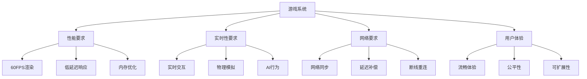
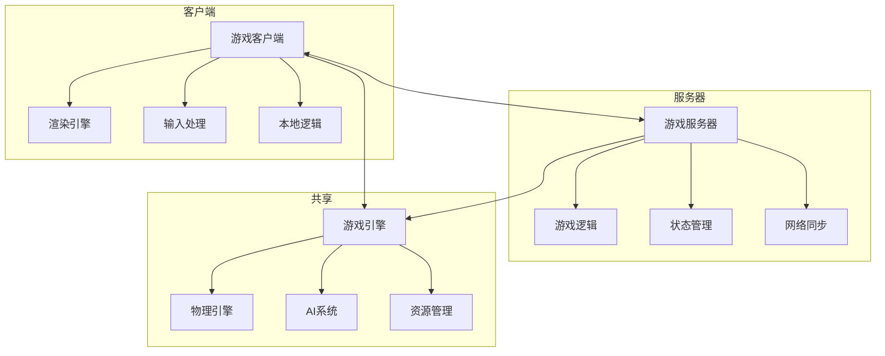
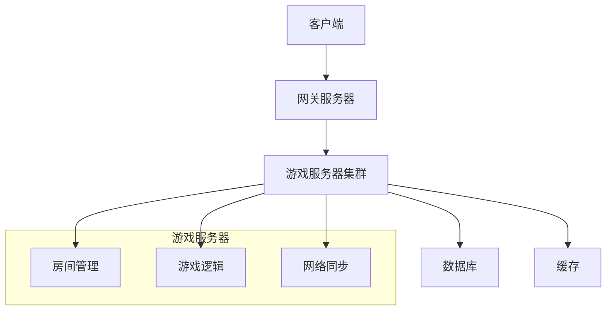

# 游戏开发领域深度分析

## 目录

- [游戏开发领域深度分析](#游戏开发领域深度分析)
  - [目录](#目录)
  - [1. 概述](#1-概述)
    - [1.1 游戏系统定义](#11-游戏系统定义)
    - [1.2 核心挑战](#12-核心挑战)
  - [2. 形式化定义](#2-形式化定义)
    - [2.1 游戏状态模型](#21-游戏状态模型)
  - [3. 核心概念模型](#3-核心概念模型)
    - [3.1 游戏架构模式](#31-游戏架构模式)
    - [3.2 组件系统](#32-组件系统)
  - [4. 架构设计](#4-架构设计)
    - [4.1 客户端-服务器架构](#41-客户端-服务器架构)
    - [4.2 服务实现](#42-服务实现)
  - [5. 算法实现](#5-算法实现)
    - [5.1 物理引擎](#51-物理引擎)
    - [5.2 AI系统](#52-ai系统)
  - [6. Golang实现](#6-golang实现)
    - [6.1 项目结构](#61-项目结构)
    - [6.2 核心实现](#62-核心实现)
  - [7. 性能优化](#7-性能优化)
    - [7.1 渲染优化](#71-渲染优化)
    - [7.2 内存优化](#72-内存优化)
  - [8. 最佳实践](#8-最佳实践)
    - [8.1 网络同步](#81-网络同步)
    - [8.2 错误处理](#82-错误处理)
  - [总结](#总结)

---

## 1. 概述

### 1.1 游戏系统定义

游戏开发系统是一个复杂的实时交互系统，需要处理高并发玩家、实时渲染、物理模拟、网络同步等。在Golang生态中，我们将其定义为：

**定义 1.1** (游戏系统)
游戏系统是一个六元组 $\mathcal{G} = (P, W, R, N, \mathcal{A}, \mathcal{E})$，其中：

- $P$ 是玩家集合 $P = \{p_1, p_2, ..., p_n\}$
- $W$ 是世界状态 $W = (W_{physics}, W_{logic}, W_{render})$
- $R$ 是渲染系统 $R = (R_{graphics}, R_{audio}, R_{ui})$
- $N$ 是网络系统 $N = (N_{sync}, N_{protocol}, N_{latency})$
- $\mathcal{A}$ 是算法集合 $\mathcal{A} = \{\alpha_1, \alpha_2, ..., \alpha_m\}$
- $\mathcal{E}$ 是事件系统 $\mathcal{E} = \{e_1, e_2, ..., e_k\}$

### 1.2 核心挑战



---

## 2. 形式化定义

### 2.1 游戏状态模型

**定义 2.1** (游戏状态)
游戏状态是一个四元组 $s = (t, w, p, e)$，其中：

- $t \in \mathbb{R}$ 是时间戳
- $w \in W$ 是世界状态
- $p \in P^n$ 是玩家状态向量
- $e \in \mathcal{E}^*$ 是事件序列

**定义 2.2** (游戏状态机)
游戏状态机是一个有限状态自动机 $\mathcal{M}_g = (Q, \Sigma, \delta, q_0, F)$，其中：

- $Q = \{lobby, playing, paused, ended\}$
- $\Sigma = \{start, pause, resume, end\}$
- $q_0 = lobby$
- $F = \{ended\}$

**定理 2.1** (游戏状态一致性)
对于任意游戏状态序列 $S = [s_1, s_2, ..., s_n]$，如果满足：

1. 时间单调递增：$\forall i < j, t_i < t_j$
2. 状态转换有效：$\forall i, \delta(s_i, e_i) = s_{i+1}$
3. 玩家状态一致：$\forall i, j, p_i \cap p_j \neq \emptyset$

则游戏状态保持一致性。

---

## 3. 核心概念模型

### 3.1 游戏架构模式



### 3.2 组件系统

```go
// 游戏对象组件系统
type GameObject struct {
    ID       string
    Position Vector3
    Rotation Quaternion
    Scale    Vector3
    Components map[string]Component
}

type Component interface {
    Update(deltaTime float64)
    OnAttach(gameObject *GameObject)
    OnDetach()
}

// 具体组件实现
type TransformComponent struct {
    gameObject *GameObject
    position   Vector3
    rotation   Quaternion
    scale      Vector3
}

func (t *TransformComponent) Update(deltaTime float64) {
    // 更新变换
}

type RenderComponent struct {
    gameObject *GameObject
    mesh       *Mesh
    material   *Material
}

func (r *RenderComponent) Update(deltaTime float64) {
    // 渲染更新
}
```

---

## 4. 架构设计

### 4.1 客户端-服务器架构



### 4.2 服务实现

```go
// 游戏服务器
type GameServer struct {
    rooms      map[string]*GameRoom
    players    map[string]*Player
    eventBus   *EventBus
    logger     Logger
}

type GameRoom struct {
    ID       string
    Players  map[string]*Player
    State    GameState
    Physics  *PhysicsEngine
    AI       *AISystem
}

func (gs *GameServer) CreateRoom(roomID string) *GameRoom {
    room := &GameRoom{
        ID:      roomID,
        Players: make(map[string]*Player),
        State:   GameStateWaiting,
        Physics: NewPhysicsEngine(),
        AI:      NewAISystem(),
    }
    
    gs.rooms[roomID] = room
    return room
}

func (gs *GameServer) JoinRoom(playerID, roomID string) error {
    room, exists := gs.rooms[roomID]
    if !exists {
        return ErrRoomNotFound
    }
    
    player, exists := gs.players[playerID]
    if !exists {
        return ErrPlayerNotFound
    }
    
    room.Players[playerID] = player
    gs.eventBus.Publish(PlayerJoinedEvent{
        PlayerID: playerID,
        RoomID:   roomID,
    })
    
    return nil
}
```

---

## 5. 算法实现

### 5.1 物理引擎

```go
// 物理引擎
type PhysicsEngine struct {
    bodies    []*RigidBody
    gravity   Vector3
    timeStep  float64
}

type RigidBody struct {
    Position    Vector3
    Velocity    Vector3
    Mass        float64
    Collider    Collider
}

func (pe *PhysicsEngine) Update(deltaTime float64) {
    // 应用重力
    for _, body := range pe.bodies {
        body.Velocity = body.Velocity.Add(pe.gravity.Multiply(deltaTime))
    }
    
    // 更新位置
    for _, body := range pe.bodies {
        body.Position = body.Position.Add(body.Velocity.Multiply(deltaTime))
    }
    
    // 碰撞检测
    pe.detectCollisions()
}

func (pe *PhysicsEngine) detectCollisions() {
    for i := 0; i < len(pe.bodies); i++ {
        for j := i + 1; j < len(pe.bodies); j++ {
            if pe.bodies[i].Collider.Intersects(pe.bodies[j].Collider) {
                pe.resolveCollision(pe.bodies[i], pe.bodies[j])
            }
        }
    }
}
```

### 5.2 AI系统

```go
// AI系统
type AISystem struct {
    agents    map[string]*AIAgent
    behaviors map[string]Behavior
}

type AIAgent struct {
    ID       string
    Position Vector3
    Behavior Behavior
    State    AIState
}

type Behavior interface {
    Update(agent *AIAgent, deltaTime float64)
}

// 寻路行为
type PathfindingBehavior struct {
    target     Vector3
    path       []Vector3
    pathIndex  int
}

func (pb *PathfindingBehavior) Update(agent *AIAgent, deltaTime float64) {
    if pb.pathIndex >= len(pb.path) {
        return
    }
    
    target := pb.path[pb.pathIndex]
    direction := target.Subtract(agent.Position).Normalize()
    agent.Position = agent.Position.Add(direction.Multiply(5.0 * deltaTime))
    
    if agent.Position.Distance(target) < 0.1 {
        pb.pathIndex++
    }
}
```

---

## 6. Golang实现

### 6.1 项目结构

```text
game-engine/
├── cmd/
│   ├── server/
│   │   └── main.go
│   └── client/
│       └── main.go
├── internal/
│   ├── engine/
│   │   ├── game_object.go
│   │   ├── component.go
│   │   ├── physics.go
│   │   └── ai.go
│   ├── network/
│   │   ├── server.go
│   │   ├── client.go
│   │   └── protocol.go
│   ├── render/
│   │   ├── renderer.go
│   │   ├── mesh.go
│   │   └── material.go
│   └── game/
│       ├── room.go
│       ├── player.go
│       └── state.go
├── pkg/
│   ├── math/
│   ├── utils/
│   └── config/
└── assets/
```

### 6.2 核心实现

```go
// 游戏引擎
type GameEngine struct {
    gameObjects map[string]*GameObject
    systems     []System
    eventBus    *EventBus
    deltaTime   float64
}

type System interface {
    Update(deltaTime float64)
}

func (ge *GameEngine) Update() {
    // 更新所有系统
    for _, system := range ge.systems {
        system.Update(ge.deltaTime)
    }
    
    // 更新所有游戏对象
    for _, obj := range ge.gameObjects {
        for _, component := range obj.Components {
            component.Update(ge.deltaTime)
        }
    }
}

// 网络同步
type NetworkSync struct {
    server     *GameServer
    clients    map[string]*Client
    syncRate   float64
    lastSync   time.Time
}

func (ns *NetworkSync) Update(deltaTime float64) {
    if time.Since(ns.lastSync).Seconds() >= 1.0/ns.syncRate {
        ns.broadcastGameState()
        ns.lastSync = time.Now()
    }
}

func (ns *NetworkSync) broadcastGameState() {
    state := ns.server.GetGameState()
    for _, client := range ns.clients {
        client.SendGameState(state)
    }
}
```

---

## 7. 性能优化

### 7.1 渲染优化

```go
// 渲染优化策略
type RenderOptimizer struct {
    frustumCulling bool
    LODSystem      *LODSystem
    occlusionCulling bool
}

func (ro *RenderOptimizer) OptimizeRenderList(objects []*GameObject, camera *Camera) []*GameObject {
    var visibleObjects []*GameObject
    
    for _, obj := range objects {
        // 视锥体剔除
        if ro.frustumCulling && !camera.IsInFrustum(obj.Position) {
            continue
        }
        
        // 遮挡剔除
        if ro.occlusionCulling && !ro.isVisible(obj, camera) {
            continue
        }
        
        // LOD选择
        if ro.LODSystem != nil {
            obj.LODLevel = ro.LODSystem.SelectLOD(obj, camera)
        }
        
        visibleObjects = append(visibleObjects, obj)
    }
    
    return visibleObjects
}
```

### 7.2 内存优化

```go
// 对象池
type GameObjectPool struct {
    pools map[string]*sync.Pool
}

func NewGameObjectPool() *GameObjectPool {
    return &GameObjectPool{
        pools: make(map[string]*sync.Pool),
    }
}

func (gop *GameObjectPool) Get(objectType string) *GameObject {
    pool, exists := gop.pools[objectType]
    if !exists {
        pool = &sync.Pool{
            New: func() interface{} {
                return NewGameObject(objectType)
            },
        }
        gop.pools[objectType] = pool
    }
    
    return pool.Get().(*GameObject)
}

func (gop *GameObjectPool) Put(obj *GameObject) {
    pool, exists := gop.pools[obj.Type]
    if exists {
        obj.Reset()
        pool.Put(obj)
    }
}
```

---

## 8. 最佳实践

### 8.1 网络同步

```go
// 客户端预测
type ClientPrediction struct {
    inputBuffer []PlayerInput
    prediction  *GameState
}

func (cp *ClientPrediction) Predict(input PlayerInput) {
    // 保存输入
    cp.inputBuffer = append(cp.inputBuffer, input)
    
    // 本地预测
    cp.prediction = cp.simulateInput(input)
    
    // 发送到服务器
    cp.sendToServer(input)
}

func (cp *ClientPrediction) Reconcile(serverState GameState) {
    // 服务器状态与预测状态比较
    if !cp.prediction.Equals(serverState) {
        // 回滚到服务器状态
        cp.rollback(serverState)
        
        // 重新应用输入
        for _, input := range cp.inputBuffer {
            cp.simulateInput(input)
        }
    }
}
```

### 8.2 错误处理

```go
// 游戏错误处理
type GameError struct {
    Code    string
    Message string
    Fatal   bool
}

func (ge *GameError) Error() string {
    return fmt.Sprintf("[%s] %s", ge.Code, ge.Message)
}

// 错误恢复
func (gs *GameServer) handleError(err error) {
    if gameErr, ok := err.(*GameError); ok {
        if gameErr.Fatal {
            gs.logger.Error("Fatal game error", "error", gameErr)
            gs.shutdown()
        } else {
            gs.logger.Warn("Non-fatal game error", "error", gameErr)
            gs.recoverFromError(gameErr)
        }
    }
}
```

---

## 总结

本文档提供了游戏开发领域的全面分析，包括：

1. **形式化定义**：游戏状态模型和状态机
2. **架构设计**：客户端-服务器架构和组件系统
3. **算法实现**：物理引擎和AI系统
4. **Golang实现**：完整的游戏引擎实现
5. **性能优化**：渲染优化和内存管理
6. **最佳实践**：网络同步和错误处理

这些内容为构建高性能、可扩展的游戏系统提供了全面的指导。

---

**参考文献**：

1. [Go官方文档](https://golang.org/doc/)
2. [游戏开发最佳实践](https://gamedev.net/)
3. [网络游戏架构](https://en.wikipedia.org/wiki/Network_game)
4. [实时系统设计](https://en.wikipedia.org/wiki/Real-time_computing)
