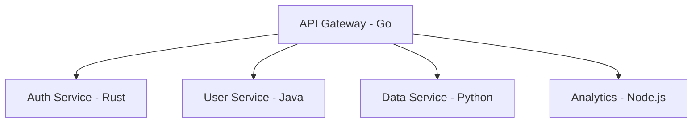

# 03 编程语言比较与集成分析

## 1. 概述

本文件系统性分析主流编程语言的核心特性、适用场景、性能特征与架构影响，建立形式化比较框架，为技术选型与系统设计提供理论基础。

---

## 2. 语言比较形式化框架

### 2.1 比较维度定义

**定义** (语言比较空间):

$\mathcal{L}_{comp} = (P, S, A, E, I)$

- $P$：性能维度（执行效率、内存使用、启动时间）
- $S$：安全维度（类型安全、内存安全、并发安全）
- $A$：抽象维度（抽象能力、表达能力、简洁性）
- $E$：生态维度（库支持、工具链、社区活跃度）
- $I$：集成维度（互操作性、FFI、容器化支持）

### 2.2 评估函数

**定义** (语言评估函数):

$E(L, D) = \sum_{i=1}^{n} w_i \cdot f_i(L, D)$

其中：

- $L$：编程语言
- $D$：应用领域
- $w_i$：权重系数
- $f_i$：各维度评估函数

---

## 3. 核心语言特性对比

### 3.1 系统级语言对比

| 特性         | Rust          | Go            | C++           | C             |
|--------------|---------------|---------------|---------------|---------------|
| 内存管理     | 所有权/借用   | GC            | 手动/智能指针 | 手动          |
| 并发模型     | Send/Sync     | goroutine     | std::thread   | pthread       |
| 类型安全     | 编译期保证    | 运行时检查    | 部分保证      | 无保证        |
| 学习曲线     | 陡峭          | 平缓          | 中等          | 基础          |
| 性能         | 极致优化      | 较高          | 高            | 最高          |
| 开发效率     | 中等          | 高            | 中等          | 低            |

### 3.2 应用级语言对比

| 特性         | Java          | Python        | JavaScript    | TypeScript    |
|--------------|---------------|---------------|---------------|---------------|
| 内存管理     | GC            | GC            | GC            | GC            |
| 类型系统     | 静态强类型    | 动态类型      | 动态类型      | 静态类型      |
| 并发模型     | 线程/并发包   | GIL/异步      | 事件循环      | 事件循环      |
| 性能         | 较高          | 中等          | 中等          | 中等          |
| 开发效率     | 高            | 很高          | 高            | 高            |
| 生态成熟度   | 成熟          | 成熟          | 成熟          | 成熟          |

---

## 4. 数学形式化分析

### 4.1 性能模型

**定义** (性能评估模型):

$P(L, W) = \alpha \cdot T(L, W) + \beta \cdot M(L, W) + \gamma \cdot C(L, W)$

其中：

- $T(L, W)$：执行时间
- $M(L, W)$：内存使用
- $C(L, W)$：CPU使用
- $\alpha, \beta, \gamma$：权重系数

### 4.2 安全性模型

**定义** (安全性评估模型):

$S(L) = \sum_{i=1}^{k} s_i \cdot w_i$

其中：

- $s_i$：各安全维度得分
- $w_i$：安全维度权重

### 4.3 生产力模型

**定义** (生产力评估模型):

$P(L, T) = \frac{LOC(T)}{Time(T)} \cdot Quality(T) \cdot Maintainability(T)$

其中：

- $LOC(T)$：代码行数
- $Time(T)$：开发时间
- $Quality(T)$：代码质量
- $Maintainability(T)$：可维护性

---

## 5. 架构决策矩阵

### 5.1 微服务架构语言选择

| 维度         | Rust | Go | Java | Python | Node.js |
|--------------|------|----|----|--------|---------|
| 性能要求     | 5    | 4  | 3  | 2      | 3       |
| 开发速度     | 2    | 4  | 4  | 5      | 4       |
| 内存效率     | 5    | 4  | 3  | 2      | 3       |
| 并发处理     | 5    | 5  | 4  | 3      | 4       |
| 生态支持     | 3    | 4  | 5  | 5      | 5       |
| 学习成本     | 2    | 4  | 3  | 5      | 4       |

### 5.2 系统编程语言选择

| 维度         | Rust | Go | C++ | C |
|--------------|------|----|----|---|
| 性能要求     | 5    | 4  | 5  | 5 |
| 内存安全     | 5    | 4  | 2  | 1 |
| 并发安全     | 5    | 4  | 3  | 2 |
| 开发效率     | 3    | 4  | 2  | 1 |
| 工具链支持   | 4    | 4  | 4  | 3 |
| 社区活跃度   | 4    | 5  | 4  | 3 |

---

## 6. 语言集成模式

### 6.1 FFI (Foreign Function Interface) 模式

**定义** (FFI 集成模型):

$\mathcal{F}_{FFI} = (L_1, L_2, B, T)$

- $L_1, L_2$：源语言和目标语言
- $B$：边界接口定义
- $T$：类型转换规则

**Rust FFI 示例**：

```rust
#[no_mangle]
pub extern "C" fn add(a: i32, b: i32) -> i32 {
    a + b
}
```

**Go FFI 示例**：

```go
// #cgo CFLAGS: -g -Wall
// #include <stdlib.h>
// int add(int a, int b) { return a + b; }
import "C"
import "unsafe"

func Add(a, b int) int {
    return int(C.add(C.int(a), C.int(b)))
}
```

### 6.2 微服务多语言架构

**定义** (多语言微服务架构):

$\mathcal{M}_{multi} = (S, L, P, C)$

- $S$：服务集合
- $L$：语言映射 $S \rightarrow L$
- $P$：协议集合
- $C$：通信模式

**架构示例**：



### 6.3 容器化多语言部署

**Dockerfile 示例**：

```dockerfile
# Multi-stage build for Rust service
FROM rust:1.70 as builder
WORKDIR /app
COPY . .
RUN cargo build --release

FROM debian:bullseye-slim
COPY --from=builder /app/target/release/service /usr/local/bin/
CMD ["service"]
```

---

## 7. 行业应用分析

### 7.1 金融科技 (FinTech)

**语言选择策略**：

- 高频交易：Rust/C++
- 风险计算：Python/Java
- 前端界面：TypeScript/JavaScript
- 数据管道：Go/Python

**关键考虑**：

- 性能要求：毫秒级延迟
- 安全要求：资金安全
- 合规要求：审计追踪
- 可维护性：长期支持

### 7.2 物联网 (IoT)

**语言选择策略**：

- 嵌入式设备：C/Rust
- 网关设备：Go/Rust
- 云端服务：Go/Java/Python
- 数据分析：Python/Java

**关键考虑**：

- 资源限制：内存/CPU约束
- 实时性：响应时间要求
- 安全性：设备安全
- 可更新性：OTA更新

### 7.3 游戏开发

**语言选择策略**：

- 游戏引擎：C++/Rust
- 游戏逻辑：C#/Lua
- 服务器：Go/Java
- 工具链：Python/C#

**关键考虑**：

- 性能要求：60FPS渲染
- 跨平台：多平台支持
- 开发效率：快速迭代
- 社区支持：引擎生态

---

## 8. 最佳实践与建议

### 8.1 语言选择原则

1. **问题驱动**：根据具体问题选择最适合的语言
2. **团队能力**：考虑团队的技术栈和学习成本
3. **生态支持**：评估库、工具、社区支持
4. **长期维护**：考虑代码的可维护性和演进
5. **性能要求**：根据性能需求选择合适语言

### 8.2 多语言集成策略

1. **清晰边界**：定义明确的服务边界和接口
2. **统一协议**：使用标准化的通信协议
3. **类型安全**：确保跨语言调用的类型安全
4. **错误处理**：统一错误处理和异常机制
5. **监控调试**：建立统一的监控和调试体系

### 8.3 技术债务管理

1. **定期评估**：定期评估技术栈的适用性
2. **渐进迁移**：采用渐进式迁移策略
3. **文档维护**：保持技术文档的更新
4. **培训计划**：制定团队技能提升计划
5. **风险控制**：识别和管理技术风险

---

## 9. 发展趋势与预测

### 9.1 新兴语言趋势

1. **Zig**：C的现代替代品，内存安全
2. **V**：Go的替代品，更简洁的语法
3. **Carbon**：C++的继任者，Google开发
4. **Mojo**：Python的超集，高性能

### 9.2 语言融合趋势

1. **类型系统融合**：静态类型与动态类型的结合
2. **内存管理融合**：GC与手动管理的混合
3. **并发模型融合**：不同并发模型的统一
4. **工具链融合**：跨语言的统一开发工具

### 9.3 架构演进趋势

1. **多语言微服务**：服务级别的语言选择
2. **边缘计算**：资源受限环境下的语言选择
3. **AI集成**：AI/ML场景下的语言选择
4. **量子计算**：量子编程语言的发展

---

## 10. 参考与交叉引用

- 详见《Rust语言分析》《Golang语言分析》相关章节
- 交叉参考：《分布式模式分析》《并发模式分析》《微服务架构分析》
- 行业参考：《金融科技分析》《物联网分析》《游戏开发分析》

---

*本文件持续更新，确保与工程最佳实践和学术规范一致。*
