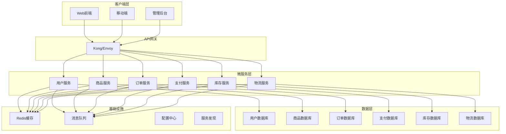

# Go语言微服务架构设计指南

<!-- TOC START -->
- [Go语言微服务架构设计指南](#go语言微服务架构设计指南)
  - [1. 概述](#1-概述)
    - [1.1 微服务定义](#11-微服务定义)
    - [1.2 核心特性](#12-核心特性)
    - [1.3 适用场景](#13-适用场景)
  - [2. 架构设计](#2-架构设计)
    - [2.1 服务拆分原则](#21-服务拆分原则)
      - [2.1.1 业务领域拆分](#211-业务领域拆分)
      - [2.1.2 数据一致性模式](#212-数据一致性模式)
    - [2.2 通信模式](#22-通信模式)
      - [2.2.1 同步通信](#221-同步通信)
      - [2.2.2 异步通信](#222-异步通信)
    - [2.3 数据管理](#23-数据管理)
      - [2.3.1 数据库设计](#231-数据库设计)
      - [2.3.2 缓存策略](#232-缓存策略)
  - [3. 技术实现](#3-技术实现)
    - [3.1 服务框架](#31-服务框架)
      - [3.1.1 HTTP服务](#311-http服务)
      - [3.1.2 gRPC服务](#312-grpc服务)
    - [3.2 服务发现](#32-服务发现)
      - [3.2.1 Consul服务发现](#321-consul服务发现)
    - [3.3 配置管理](#33-配置管理)
      - [3.3.1 配置结构](#331-配置结构)
  - [4. 最佳实践](#4-最佳实践)
    - [4.1 设计原则](#41-设计原则)
      - [4.1.1 单一职责原则](#411-单一职责原则)
      - [4.1.2 数据自治原则](#412-数据自治原则)
      - [4.1.3 故障隔离原则](#413-故障隔离原则)
    - [4.2 性能优化](#42-性能优化)
      - [4.2.1 连接池管理](#421-连接池管理)
      - [4.2.2 缓存策略](#422-缓存策略)
    - [4.3 监控告警](#43-监控告警)
      - [4.3.1 指标收集](#431-指标收集)
      - [4.3.2 健康检查](#432-健康检查)
  - [5. 案例分析](#5-案例分析)
    - [5.1 电商系统](#51-电商系统)
      - [5.1.1 系统架构](#511-系统架构)
      - [5.1.2 核心业务流程](#512-核心业务流程)
    - [5.2 支付系统](#52-支付系统)
      - [5.2.1 支付流程](#521-支付流程)
  - [6. 总结](#6-总结)
    - [6.1 关键要点](#61-关键要点)
    - [6.2 学习建议](#62-学习建议)
    - [6.3 扩展阅读](#63-扩展阅读)
<!-- TOC END -->

## 1. 概述

### 1.1 微服务定义

**定义 1.1** (微服务): 微服务是一种将单一应用程序开发为一组小型服务的方法，每个服务运行在自己的进程中，并通过轻量级机制（通常是HTTP API）进行通信。

**形式化定义**:
$$Microservice = (S, C, D, I)$$

其中：

- $S$ 是服务集合 (Services)
- $C$ 是通信机制 (Communication)
- $D$ 是数据存储 (Data Storage)
- $I$ 是接口定义 (Interfaces)

### 1.2 核心特性

- **单一职责**: 每个服务专注于特定的业务功能
- **独立部署**: 服务可以独立开发、测试和部署
- **技术多样性**: 不同服务可以使用不同的技术栈
- **数据自治**: 每个服务管理自己的数据存储
- **故障隔离**: 单个服务的故障不会影响整个系统

### 1.3 适用场景

- 大型复杂应用程序
- 需要快速迭代和部署的系统
- 团队规模较大，需要并行开发
- 对可扩展性有高要求的系统

## 2. 架构设计

### 2.1 服务拆分原则

#### 2.1.1 业务领域拆分

```go
// 用户服务
type UserService struct {
    userRepo UserRepository
    authService AuthService
}

func (s *UserService) CreateUser(ctx context.Context, req *CreateUserRequest) (*User, error) {
    // 用户创建逻辑
    user := &User{
        ID:       generateID(),
        Username: req.Username,
        Email:    req.Email,
        CreatedAt: time.Now(),
    }
    
    if err := s.userRepo.Save(ctx, user); err != nil {
        return nil, fmt.Errorf("failed to save user: %w", err)
    }
    
    return user, nil
}

// 订单服务
type OrderService struct {
    orderRepo OrderRepository
    paymentService PaymentService
    inventoryService InventoryService
}

func (s *OrderService) CreateOrder(ctx context.Context, req *CreateOrderRequest) (*Order, error) {
    // 订单创建逻辑
    order := &Order{
        ID:        generateID(),
        UserID:    req.UserID,
        Items:     req.Items,
        Status:    OrderStatusPending,
        CreatedAt: time.Now(),
    }
    
    // 验证库存
    if err := s.inventoryService.ReserveItems(ctx, req.Items); err != nil {
        return nil, fmt.Errorf("insufficient inventory: %w", err)
    }
    
    // 处理支付
    payment, err := s.paymentService.ProcessPayment(ctx, &PaymentRequest{
        OrderID: order.ID,
        Amount:  order.TotalAmount(),
    })
    if err != nil {
        return nil, fmt.Errorf("payment failed: %w", err)
    }
    
    order.PaymentID = payment.ID
    order.Status = OrderStatusConfirmed
    
    if err := s.orderRepo.Save(ctx, order); err != nil {
        return nil, fmt.Errorf("failed to save order: %w", err)
    }
    
    return order, nil
}
```

#### 2.1.2 数据一致性模式

```go
// 事件驱动架构
type EventStore struct {
    events []Event
    mu     sync.RWMutex
}

type Event struct {
    ID        string
    Type      string
    Data      []byte
    Timestamp time.Time
    Version   int
}

// 事件发布
type EventPublisher interface {
    Publish(ctx context.Context, event Event) error
}

// 事件处理
type EventHandler interface {
    Handle(ctx context.Context, event Event) error
}

// 用户创建事件处理
type UserCreatedHandler struct {
    orderService OrderService
    emailService EmailService
}

func (h *UserCreatedHandler) Handle(ctx context.Context, event Event) error {
    var userCreated UserCreatedEvent
    if err := json.Unmarshal(event.Data, &userCreated); err != nil {
        return fmt.Errorf("failed to unmarshal event: %w", err)
    }
    
    // 发送欢迎邮件
    if err := h.emailService.SendWelcomeEmail(ctx, userCreated.UserID); err != nil {
        log.Printf("failed to send welcome email: %v", err)
    }
    
    return nil
}
```

### 2.2 通信模式

#### 2.2.1 同步通信

```go
// HTTP客户端
type HTTPClient struct {
    client *http.Client
    baseURL string
}

func (c *HTTPClient) GetUser(ctx context.Context, userID string) (*User, error) {
    url := fmt.Sprintf("%s/users/%s", c.baseURL, userID)
    
    req, err := http.NewRequestWithContext(ctx, "GET", url, nil)
    if err != nil {
        return nil, fmt.Errorf("failed to create request: %w", err)
    }
    
    resp, err := c.client.Do(req)
    if err != nil {
        return nil, fmt.Errorf("failed to make request: %w", err)
    }
    defer resp.Body.Close()
    
    if resp.StatusCode != http.StatusOK {
        return nil, fmt.Errorf("unexpected status code: %d", resp.StatusCode)
    }
    
    var user User
    if err := json.NewDecoder(resp.Body).Decode(&user); err != nil {
        return nil, fmt.Errorf("failed to decode response: %w", err)
    }
    
    return &user, nil
}

// gRPC客户端
type UserServiceClient struct {
    conn   *grpc.ClientConn
    client pb.UserServiceClient
}

func (c *UserServiceClient) GetUser(ctx context.Context, userID string) (*User, error) {
    req := &pb.GetUserRequest{UserId: userID}
    
    resp, err := c.client.GetUser(ctx, req)
    if err != nil {
        return nil, fmt.Errorf("failed to get user: %w", err)
    }
    
    return &User{
        ID:       resp.User.Id,
        Username: resp.User.Username,
        Email:    resp.User.Email,
    }, nil
}
```

#### 2.2.2 异步通信

```go
// 消息队列
type MessageQueue struct {
    conn *amqp.Connection
    ch   *amqp.Channel
}

func (mq *MessageQueue) Publish(ctx context.Context, exchange, routingKey string, message []byte) error {
    return mq.ch.PublishWithContext(ctx,
        exchange,   // exchange
        routingKey, // routing key
        false,      // mandatory
        false,      // immediate
        amqp.Publishing{
            ContentType: "application/json",
            Body:        message,
        },
    )
}

func (mq *MessageQueue) Consume(ctx context.Context, queue string, handler func([]byte) error) error {
    msgs, err := mq.ch.Consume(
        queue, // queue
        "",    // consumer
        true,  // auto-ack
        false, // exclusive
        false, // no-local
        false, // no-wait
        nil,   // args
    )
    if err != nil {
        return fmt.Errorf("failed to register consumer: %w", err)
    }
    
    for {
        select {
        case msg := <-msgs:
            if err := handler(msg.Body); err != nil {
                log.Printf("failed to process message: %v", err)
            }
        case <-ctx.Done():
            return ctx.Err()
        }
    }
}
```

### 2.3 数据管理

#### 2.3.1 数据库设计

```go
// 用户服务数据库
type UserRepository struct {
    db *sql.DB
}

func (r *UserRepository) Save(ctx context.Context, user *User) error {
    query := `
        INSERT INTO users (id, username, email, created_at, updated_at)
        VALUES ($1, $2, $3, $4, $5)
        ON CONFLICT (id) DO UPDATE SET
            username = EXCLUDED.username,
            email = EXCLUDED.email,
            updated_at = EXCLUDED.updated_at
    `
    
    _, err := r.db.ExecContext(ctx, query,
        user.ID, user.Username, user.Email, user.CreatedAt, time.Now())
    
    return err
}

func (r *UserRepository) FindByID(ctx context.Context, id string) (*User, error) {
    query := `SELECT id, username, email, created_at, updated_at FROM users WHERE id = $1`
    
    row := r.db.QueryRowContext(ctx, query, id)
    
    var user User
    err := row.Scan(&user.ID, &user.Username, &user.Email, &user.CreatedAt, &user.UpdatedAt)
    if err != nil {
        if err == sql.ErrNoRows {
            return nil, ErrUserNotFound
        }
        return nil, fmt.Errorf("failed to scan user: %w", err)
    }
    
    return &user, nil
}

// 订单服务数据库
type OrderRepository struct {
    db *sql.DB
}

func (r *OrderRepository) Save(ctx context.Context, order *Order) error {
    tx, err := r.db.BeginTx(ctx, nil)
    if err != nil {
        return fmt.Errorf("failed to begin transaction: %w", err)
    }
    defer tx.Rollback()
    
    // 保存订单
    orderQuery := `
        INSERT INTO orders (id, user_id, status, total_amount, created_at, updated_at)
        VALUES ($1, $2, $3, $4, $5, $6)
        ON CONFLICT (id) DO UPDATE SET
            status = EXCLUDED.status,
            updated_at = EXCLUDED.updated_at
    `
    
    _, err = tx.ExecContext(ctx, orderQuery,
        order.ID, order.UserID, order.Status, order.TotalAmount(), order.CreatedAt, time.Now())
    if err != nil {
        return fmt.Errorf("failed to save order: %w", err)
    }
    
    // 保存订单项
    itemQuery := `
        INSERT INTO order_items (id, order_id, product_id, quantity, price)
        VALUES ($1, $2, $3, $4, $5)
        ON CONFLICT (id) DO UPDATE SET
            quantity = EXCLUDED.quantity,
            price = EXCLUDED.price
    `
    
    for _, item := range order.Items {
        _, err = tx.ExecContext(ctx, itemQuery,
            item.ID, order.ID, item.ProductID, item.Quantity, item.Price)
        if err != nil {
            return fmt.Errorf("failed to save order item: %w", err)
        }
    }
    
    return tx.Commit()
}
```

#### 2.3.2 缓存策略

```go
// Redis缓存
type CacheService struct {
    client *redis.Client
}

func (c *CacheService) Set(ctx context.Context, key string, value interface{}, expiration time.Duration) error {
    data, err := json.Marshal(value)
    if err != nil {
        return fmt.Errorf("failed to marshal value: %w", err)
    }
    
    return c.client.Set(ctx, key, data, expiration).Err()
}

func (c *CacheService) Get(ctx context.Context, key string, dest interface{}) error {
    data, err := c.client.Get(ctx, key).Result()
    if err != nil {
        if err == redis.Nil {
            return ErrCacheMiss
        }
        return fmt.Errorf("failed to get from cache: %w", err)
    }
    
    return json.Unmarshal([]byte(data), dest)
}

// 缓存装饰器
type CachedUserService struct {
    userService UserService
    cache       CacheService
}

func (s *CachedUserService) GetUser(ctx context.Context, userID string) (*User, error) {
    cacheKey := fmt.Sprintf("user:%s", userID)
    
    // 尝试从缓存获取
    var user User
    if err := s.cache.Get(ctx, cacheKey, &user); err == nil {
        return &user, nil
    }
    
    // 缓存未命中，从数据库获取
    user, err := s.userService.GetUser(ctx, userID)
    if err != nil {
        return nil, err
    }
    
    // 写入缓存
    if err := s.cache.Set(ctx, cacheKey, user, 5*time.Minute); err != nil {
        log.Printf("failed to cache user: %v", err)
    }
    
    return user, nil
}
```

## 3. 技术实现

### 3.1 服务框架

#### 3.1.1 HTTP服务

```go
// Gin框架实现
func setupHTTPServer() *gin.Engine {
    r := gin.Default()
    
    // 中间件
    r.Use(gin.Logger())
    r.Use(gin.Recovery())
    r.Use(cors.Default())
    
    // 路由组
    v1 := r.Group("/api/v1")
    {
        users := v1.Group("/users")
        {
            users.POST("", createUser)
            users.GET("/:id", getUser)
            users.PUT("/:id", updateUser)
            users.DELETE("/:id", deleteUser)
        }
        
        orders := v1.Group("/orders")
        {
            orders.POST("", createOrder)
            orders.GET("/:id", getOrder)
            orders.PUT("/:id", updateOrder)
        }
    }
    
    return r
}

func createUser(c *gin.Context) {
    var req CreateUserRequest
    if err := c.ShouldBindJSON(&req); err != nil {
        c.JSON(http.StatusBadRequest, gin.H{"error": err.Error()})
        return
    }
    
    user, err := userService.CreateUser(c.Request.Context(), &req)
    if err != nil {
        c.JSON(http.StatusInternalServerError, gin.H{"error": err.Error()})
        return
    }
    
    c.JSON(http.StatusCreated, user)
}

func getUser(c *gin.Context) {
    userID := c.Param("id")
    
    user, err := userService.GetUser(c.Request.Context(), userID)
    if err != nil {
        if err == ErrUserNotFound {
            c.JSON(http.StatusNotFound, gin.H{"error": "user not found"})
            return
        }
        c.JSON(http.StatusInternalServerError, gin.H{"error": err.Error()})
        return
    }
    
    c.JSON(http.StatusOK, user)
}
```

#### 3.1.2 gRPC服务

```go
// gRPC服务实现
type UserServiceServer struct {
    pb.UnimplementedUserServiceServer
    userService UserService
}

func (s *UserServiceServer) CreateUser(ctx context.Context, req *pb.CreateUserRequest) (*pb.CreateUserResponse, error) {
    user, err := s.userService.CreateUser(ctx, &CreateUserRequest{
        Username: req.Username,
        Email:    req.Email,
    })
    if err != nil {
        return nil, status.Errorf(codes.Internal, "failed to create user: %v", err)
    }
    
    return &pb.CreateUserResponse{
        User: &pb.User{
            Id:       user.ID,
            Username: user.Username,
            Email:    user.Email,
        },
    }, nil
}

func (s *UserServiceServer) GetUser(ctx context.Context, req *pb.GetUserRequest) (*pb.GetUserResponse, error) {
    user, err := s.userService.GetUser(ctx, req.UserId)
    if err != nil {
        if err == ErrUserNotFound {
            return nil, status.Errorf(codes.NotFound, "user not found")
        }
        return nil, status.Errorf(codes.Internal, "failed to get user: %v", err)
    }
    
    return &pb.GetUserResponse{
        User: &pb.User{
            Id:       user.ID,
            Username: user.Username,
            Email:    user.Email,
        },
    }, nil
}

func startGRPCServer() error {
    lis, err := net.Listen("tcp", ":50051")
    if err != nil {
        return fmt.Errorf("failed to listen: %w", err)
    }
    
    s := grpc.NewServer()
    pb.RegisterUserServiceServer(s, &UserServiceServer{})
    
    log.Printf("gRPC server listening at %v", lis.Addr())
    return s.Serve(lis)
}
```

### 3.2 服务发现

#### 3.2.1 Consul服务发现

```go
// Consul客户端
type ConsulClient struct {
    client *consul.Client
}

func (c *ConsulClient) RegisterService(serviceID, serviceName, address string, port int) error {
    registration := &consul.AgentServiceRegistration{
        ID:      serviceID,
        Name:    serviceName,
        Address: address,
        Port:    port,
        Check: &consul.AgentServiceCheck{
            HTTP:     fmt.Sprintf("http://%s:%d/health", address, port),
            Interval: "10s",
            Timeout:  "5s",
        },
    }
    
    return c.client.Agent().ServiceRegister(registration)
}

func (c *ConsulClient) DiscoverService(serviceName string) ([]*consul.ServiceEntry, error) {
    entries, _, err := c.client.Health().Service(serviceName, "", true, nil)
    if err != nil {
        return nil, fmt.Errorf("failed to discover service: %w", err)
    }
    
    return entries, nil
}

// 服务发现装饰器
type ServiceDiscoveryClient struct {
    consulClient ConsulClient
    httpClient   *http.Client
}

func (c *ServiceDiscoveryClient) CallService(ctx context.Context, serviceName, path string) (*http.Response, error) {
    entries, err := c.consulClient.DiscoverService(serviceName)
    if err != nil {
        return nil, fmt.Errorf("failed to discover service: %w", err)
    }
    
    if len(entries) == 0 {
        return nil, fmt.Errorf("no healthy instances found for service: %s", serviceName)
    }
    
    // 简单的负载均衡：随机选择
    entry := entries[rand.Intn(len(entries))]
    url := fmt.Sprintf("http://%s:%d%s", entry.Service.Address, entry.Service.Port, path)
    
    req, err := http.NewRequestWithContext(ctx, "GET", url, nil)
    if err != nil {
        return nil, fmt.Errorf("failed to create request: %w", err)
    }
    
    return c.httpClient.Do(req)
}
```

### 3.3 配置管理

#### 3.3.1 配置结构

```go
// 配置结构
type Config struct {
    Server   ServerConfig   `yaml:"server"`
    Database DatabaseConfig `yaml:"database"`
    Redis    RedisConfig    `yaml:"redis"`
    Consul   ConsulConfig   `yaml:"consul"`
    Logging  LoggingConfig  `yaml:"logging"`
}

type ServerConfig struct {
    Host string `yaml:"host"`
    Port int    `yaml:"port"`
}

type DatabaseConfig struct {
    Host     string `yaml:"host"`
    Port     int    `yaml:"port"`
    Database string `yaml:"database"`
    Username string `yaml:"username"`
    Password string `yaml:"password"`
}

type RedisConfig struct {
    Host     string `yaml:"host"`
    Port     int    `yaml:"port"`
    Password string `yaml:"password"`
    DB       int    `yaml:"db"`
}

type ConsulConfig struct {
    Host string `yaml:"host"`
    Port int    `yaml:"port"`
}

type LoggingConfig struct {
    Level  string `yaml:"level"`
    Format string `yaml:"format"`
}

// 配置加载
func LoadConfig(configPath string) (*Config, error) {
    data, err := os.ReadFile(configPath)
    if err != nil {
        return nil, fmt.Errorf("failed to read config file: %w", err)
    }
    
    var config Config
    if err := yaml.Unmarshal(data, &config); err != nil {
        return nil, fmt.Errorf("failed to unmarshal config: %w", err)
    }
    
    // 环境变量覆盖
    if host := os.Getenv("DB_HOST"); host != "" {
        config.Database.Host = host
    }
    if port := os.Getenv("DB_PORT"); port != "" {
        if p, err := strconv.Atoi(port); err == nil {
            config.Database.Port = p
        }
    }
    
    return &config, nil
}
```

## 4. 最佳实践

### 4.1 设计原则

#### 4.1.1 单一职责原则

- 每个服务只负责一个业务领域
- 服务间通过明确的接口通信
- 避免服务间的紧耦合

#### 4.1.2 数据自治原则

- 每个服务拥有自己的数据库
- 服务间不直接访问其他服务的数据库
- 通过API或事件进行数据同步

#### 4.1.3 故障隔离原则

- 实现熔断器模式
- 使用超时和重试机制
- 提供降级方案

### 4.2 性能优化

#### 4.2.1 连接池管理

```go
// 数据库连接池
func setupDatabase(config DatabaseConfig) (*sql.DB, error) {
    dsn := fmt.Sprintf("postgres://%s:%s@%s:%d/%s?sslmode=disable",
        config.Username, config.Password, config.Host, config.Port, config.Database)
    
    db, err := sql.Open("postgres", dsn)
    if err != nil {
        return nil, fmt.Errorf("failed to open database: %w", err)
    }
    
    // 连接池配置
    db.SetMaxOpenConns(25)
    db.SetMaxIdleConns(5)
    db.SetConnMaxLifetime(5 * time.Minute)
    
    // 测试连接
    if err := db.Ping(); err != nil {
        return nil, fmt.Errorf("failed to ping database: %w", err)
    }
    
    return db, nil
}

// HTTP客户端连接池
func setupHTTPClient() *http.Client {
    return &http.Client{
        Transport: &http.Transport{
            MaxIdleConns:        100,
            MaxIdleConnsPerHost: 10,
            IdleConnTimeout:     90 * time.Second,
            DisableKeepAlives:   false,
        },
        Timeout: 30 * time.Second,
    }
}
```

#### 4.2.2 缓存策略

```go
// 多级缓存
type MultiLevelCache struct {
    l1Cache *sync.Map // 内存缓存
    l2Cache CacheService // Redis缓存
}

func (c *MultiLevelCache) Get(ctx context.Context, key string, dest interface{}) error {
    // L1缓存查找
    if value, ok := c.l1Cache.Load(key); ok {
        return json.Unmarshal(value.([]byte), dest)
    }
    
    // L2缓存查找
    if err := c.l2Cache.Get(ctx, key, dest); err == nil {
        // 写入L1缓存
        if data, err := json.Marshal(dest); err == nil {
            c.l1Cache.Store(key, data)
        }
        return nil
    }
    
    return ErrCacheMiss
}

func (c *MultiLevelCache) Set(ctx context.Context, key string, value interface{}, expiration time.Duration) error {
    // 写入L2缓存
    if err := c.l2Cache.Set(ctx, key, value, expiration); err != nil {
        return err
    }
    
    // 写入L1缓存
    if data, err := json.Marshal(value); err == nil {
        c.l1Cache.Store(key, data)
    }
    
    return nil
}
```

### 4.3 监控告警

#### 4.3.1 指标收集

```go
// Prometheus指标
var (
    httpRequestsTotal = prometheus.NewCounterVec(
        prometheus.CounterOpts{
            Name: "http_requests_total",
            Help: "Total number of HTTP requests",
        },
        []string{"method", "endpoint", "status"},
    )
    
    httpRequestDuration = prometheus.NewHistogramVec(
        prometheus.HistogramOpts{
            Name: "http_request_duration_seconds",
            Help: "HTTP request duration in seconds",
        },
        []string{"method", "endpoint"},
    )
    
    databaseConnections = prometheus.NewGaugeVec(
        prometheus.GaugeOpts{
            Name: "database_connections",
            Help: "Number of database connections",
        },
        []string{"state"},
    )
)

func init() {
    prometheus.MustRegister(httpRequestsTotal)
    prometheus.MustRegister(httpRequestDuration)
    prometheus.MustRegister(databaseConnections)
}

// 指标中间件
func metricsMiddleware() gin.HandlerFunc {
    return func(c *gin.Context) {
        start := time.Now()
        
        c.Next()
        
        duration := time.Since(start).Seconds()
        status := strconv.Itoa(c.Writer.Status())
        
        httpRequestsTotal.WithLabelValues(c.Request.Method, c.FullPath(), status).Inc()
        httpRequestDuration.WithLabelValues(c.Request.Method, c.FullPath()).Observe(duration)
    }
}
```

#### 4.3.2 健康检查

```go
// 健康检查服务
type HealthChecker struct {
    db     *sql.DB
    redis  *redis.Client
    consul *consul.Client
}

func (h *HealthChecker) CheckHealth(ctx context.Context) map[string]string {
    status := make(map[string]string)
    
    // 数据库健康检查
    if err := h.db.PingContext(ctx); err != nil {
        status["database"] = "unhealthy"
    } else {
        status["database"] = "healthy"
    }
    
    // Redis健康检查
    if err := h.redis.Ping(ctx).Err(); err != nil {
        status["redis"] = "unhealthy"
    } else {
        status["redis"] = "healthy"
    }
    
    // Consul健康检查
    if _, _, err := h.consul.Health().State(consul.HealthAny, nil); err != nil {
        status["consul"] = "unhealthy"
    } else {
        status["consul"] = "healthy"
    }
    
    return status
}

func healthCheckHandler(healthChecker *HealthChecker) gin.HandlerFunc {
    return func(c *gin.Context) {
        status := healthChecker.CheckHealth(c.Request.Context())
        
        allHealthy := true
        for _, s := range status {
            if s != "healthy" {
                allHealthy = false
                break
            }
        }
        
        if allHealthy {
            c.JSON(http.StatusOK, status)
        } else {
            c.JSON(http.StatusServiceUnavailable, status)
        }
    }
}
```

## 5. 案例分析

### 5.1 电商系统

#### 5.1.1 系统架构



#### 5.1.2 核心业务流程

```go
// 下单流程
type OrderService struct {
    userService      UserService
    productService   ProductService
    inventoryService InventoryService
    paymentService   PaymentService
    logisticsService LogisticsService
    eventPublisher   EventPublisher
}

func (s *OrderService) CreateOrder(ctx context.Context, req *CreateOrderRequest) (*Order, error) {
    // 1. 验证用户
    user, err := s.userService.GetUser(ctx, req.UserID)
    if err != nil {
        return nil, fmt.Errorf("failed to get user: %w", err)
    }
    
    // 2. 验证商品
    var totalAmount float64
    var orderItems []OrderItem
    
    for _, item := range req.Items {
        product, err := s.productService.GetProduct(ctx, item.ProductID)
        if err != nil {
            return nil, fmt.Errorf("failed to get product: %w", err)
        }
        
        // 3. 检查库存
        if err := s.inventoryService.ReserveInventory(ctx, item.ProductID, item.Quantity); err != nil {
            return nil, fmt.Errorf("insufficient inventory: %w", err)
        }
        
        orderItem := OrderItem{
            ID:        generateID(),
            ProductID: item.ProductID,
            Quantity:  item.Quantity,
            Price:     product.Price,
        }
        orderItems = append(orderItems, orderItem)
        totalAmount += product.Price * float64(item.Quantity)
    }
    
    // 4. 创建订单
    order := &Order{
        ID:        generateID(),
        UserID:    req.UserID,
        Items:     orderItems,
        Status:    OrderStatusPending,
        TotalAmount: totalAmount,
        CreatedAt: time.Now(),
    }
    
    if err := s.orderRepo.Save(ctx, order); err != nil {
        return nil, fmt.Errorf("failed to save order: %w", err)
    }
    
    // 5. 处理支付
    payment, err := s.paymentService.ProcessPayment(ctx, &PaymentRequest{
        OrderID: order.ID,
        Amount:  totalAmount,
        UserID:  req.UserID,
    })
    if err != nil {
        // 释放库存
        s.inventoryService.ReleaseInventory(ctx, req.Items)
        return nil, fmt.Errorf("payment failed: %w", err)
    }
    
    order.PaymentID = payment.ID
    order.Status = OrderStatusPaid
    
    if err := s.orderRepo.Save(ctx, order); err != nil {
        return nil, fmt.Errorf("failed to update order: %w", err)
    }
    
    // 6. 发布订单创建事件
    event := OrderCreatedEvent{
        OrderID: order.ID,
        UserID:  order.UserID,
        Items:   order.Items,
        Amount:  totalAmount,
    }
    
    if err := s.eventPublisher.Publish(ctx, event); err != nil {
        log.Printf("failed to publish order created event: %v", err)
    }
    
    // 7. 创建物流订单
    if err := s.logisticsService.CreateLogisticsOrder(ctx, &LogisticsRequest{
        OrderID: order.ID,
        Items:   order.Items,
        Address: req.Address,
    }); err != nil {
        log.Printf("failed to create logistics order: %v", err)
    }
    
    return order, nil
}
```

### 5.2 支付系统

#### 5.2.1 支付流程

```go
// 支付服务
type PaymentService struct {
    paymentRepo    PaymentRepository
    bankService    BankService
    walletService  WalletService
    eventPublisher EventPublisher
}

func (s *PaymentService) ProcessPayment(ctx context.Context, req *PaymentRequest) (*Payment, error) {
    // 1. 创建支付记录
    payment := &Payment{
        ID:        generateID(),
        OrderID:   req.OrderID,
        UserID:    req.UserID,
        Amount:    req.Amount,
        Status:    PaymentStatusPending,
        CreatedAt: time.Now(),
    }
    
    if err := s.paymentRepo.Save(ctx, payment); err != nil {
        return nil, fmt.Errorf("failed to save payment: %w", err)
    }
    
    // 2. 根据支付方式处理
    switch req.PaymentMethod {
    case PaymentMethodBankCard:
        return s.processBankCardPayment(ctx, payment, req)
    case PaymentMethodWallet:
        return s.processWalletPayment(ctx, payment, req)
    case PaymentMethodAlipay:
        return s.processAlipayPayment(ctx, payment, req)
    default:
        return nil, fmt.Errorf("unsupported payment method: %s", req.PaymentMethod)
    }
}

func (s *PaymentService) processBankCardPayment(ctx context.Context, payment *Payment, req *PaymentRequest) (*Payment, error) {
    // 调用银行接口
    result, err := s.bankService.ProcessPayment(ctx, &BankPaymentRequest{
        CardNumber: req.CardNumber,
        Amount:     req.Amount,
        OrderID:    payment.ID,
    })
    if err != nil {
        payment.Status = PaymentStatusFailed
        payment.FailureReason = err.Error()
        s.paymentRepo.Save(ctx, payment)
        return nil, fmt.Errorf("bank payment failed: %w", err)
    }
    
    payment.Status = PaymentStatusCompleted
    payment.TransactionID = result.TransactionID
    payment.CompletedAt = time.Now()
    
    if err := s.paymentRepo.Save(ctx, payment); err != nil {
        return nil, fmt.Errorf("failed to update payment: %w", err)
    }
    
    // 发布支付成功事件
    event := PaymentCompletedEvent{
        PaymentID: payment.ID,
        OrderID:   payment.OrderID,
        Amount:    payment.Amount,
        Method:    PaymentMethodBankCard,
    }
    
    if err := s.eventPublisher.Publish(ctx, event); err != nil {
        log.Printf("failed to publish payment completed event: %v", err)
    }
    
    return payment, nil
}
```

## 6. 总结

### 6.1 关键要点

1. **服务拆分**: 按照业务领域进行服务拆分，确保每个服务职责单一
2. **数据管理**: 每个服务拥有独立的数据存储，通过API或事件进行数据同步
3. **通信模式**: 合理选择同步和异步通信方式，确保系统的高可用性
4. **监控告警**: 建立完善的监控体系，及时发现和解决问题
5. **配置管理**: 统一配置管理，支持动态配置更新

### 6.2 学习建议

1. **理论学习**: 深入理解微服务架构的设计原则和模式
2. **实践项目**: 通过实际项目练习微服务的开发和部署
3. **工具掌握**: 熟悉相关的开发工具和运维工具
4. **最佳实践**: 学习业界的最佳实践和经验总结

### 6.3 扩展阅读

- [微服务架构设计模式](https://microservices.io/patterns/)
- [Go语言微服务实战](https://github.com/go-kratos/kratos)
- [服务网格实践指南](https://istio.io/latest/docs/)
- [分布式系统设计原理](https://en.wikipedia.org/wiki/Distributed_computing)

---

**最后更新**: 2024-12-19  
**版本**: 1.0  
**作者**: 架构团队
