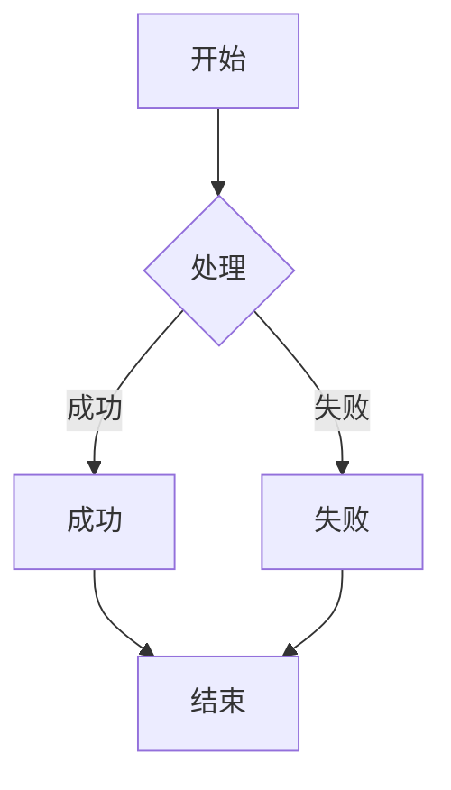
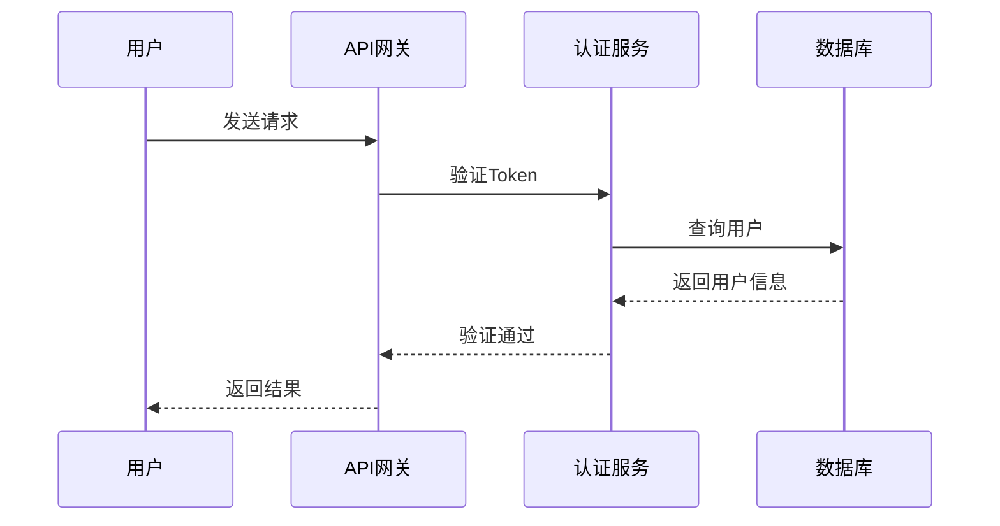
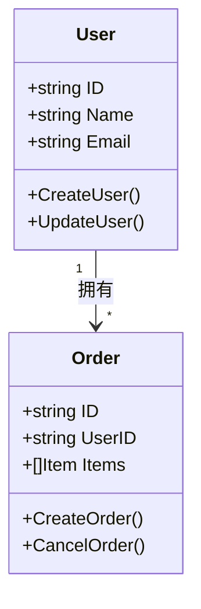
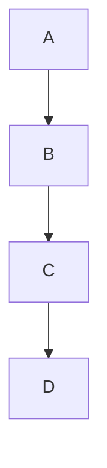
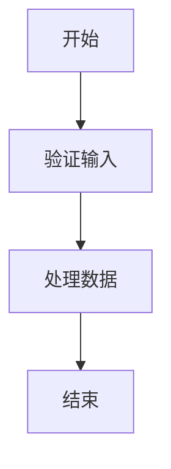
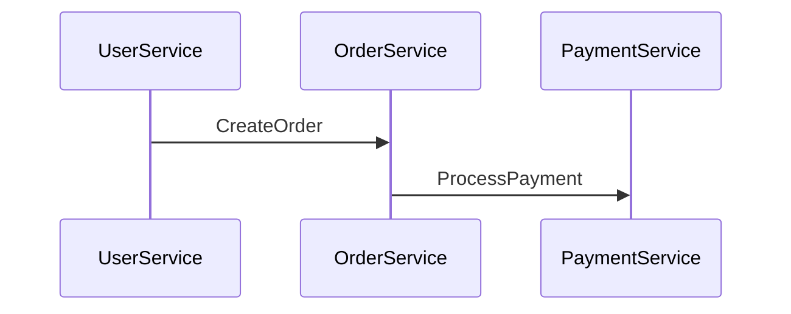
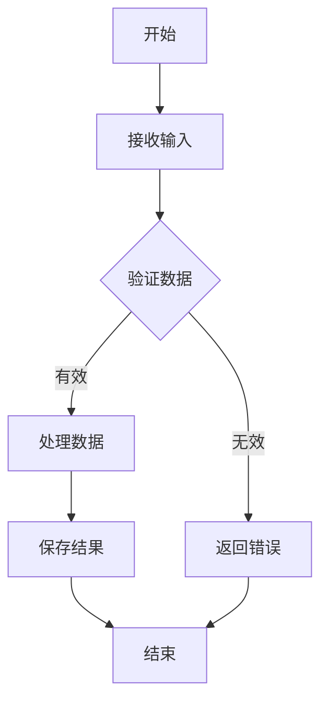
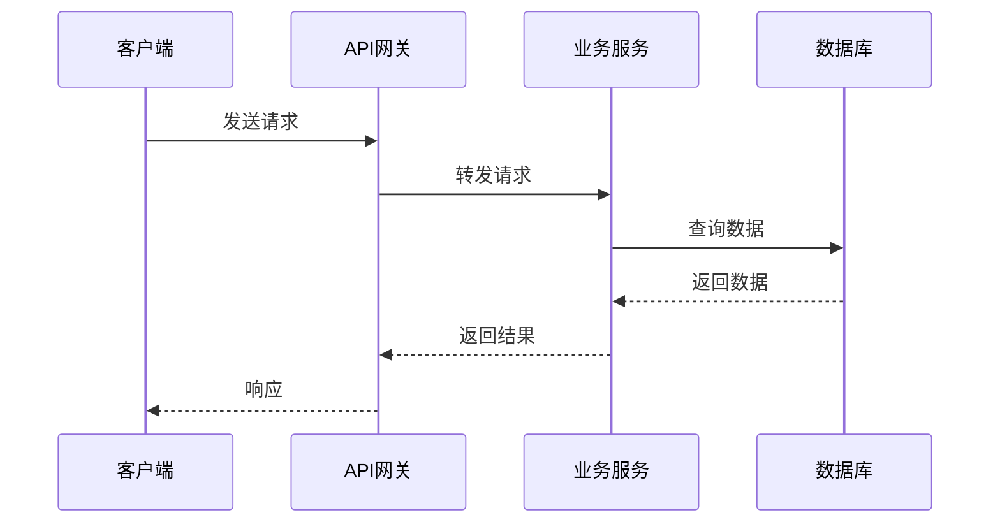
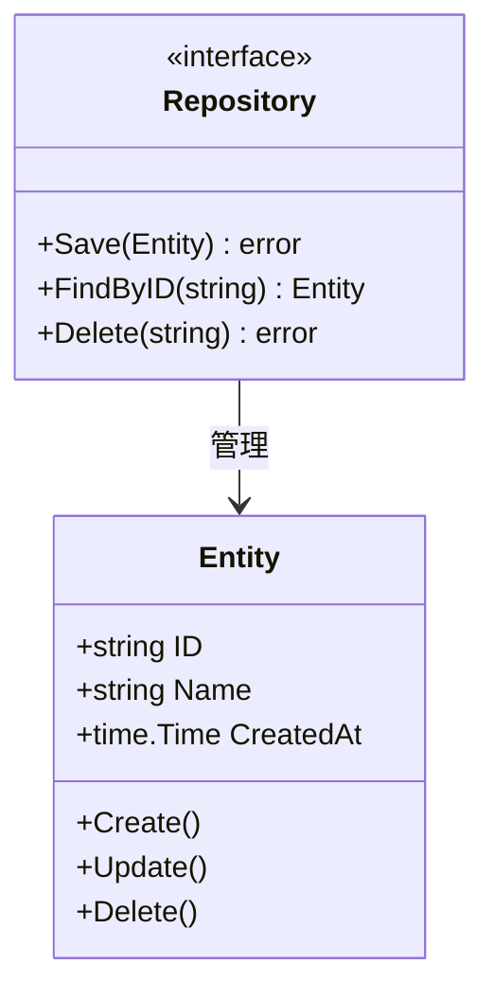

# 2025-10-21 Mermaid图表统一标准

> **制定日期**: 2025-10-21  
> **适用范围**: 所有docs目录下的Markdown文档  
> **图表总数**: 464个

---

## 🎯 统一标准

### 1. 图表类型与命名规范

| 图表类型 | Mermaid语法 | 使用场景 | 优先级 |
|----------|-------------|----------|--------|
| 流程图 | `graph TD` / `graph LR` | 架构流程、处理流程 | P0 |
| 时序图 | `sequenceDiagram` | 服务交互、消息流 | P0 |
| 类图 | `classDiagram` | 领域模型、数据结构 | P1 |
| 状态图 | `stateDiagram-v2` | 状态转换、生命周期 | P1 |
| 甘特图 | `gantt` | 项目计划、时间线 | P2 |

### 2. 流程图标准（graph）

**方向规范**:
- ✅ **推荐**: `graph TD` (Top-Down, 自上而下)
- ✅ **推荐**: `graph LR` (Left-Right, 从左到右)
- ❌ **避免**: `graph BT`, `graph RL` (可读性差)

**节点命名规范**:
- ✅ 使用有意义的英文ID: `UserService`, `OrderFlow`, `CheckAuth`
- ❌ 避免单字母或无意义ID: `A`, `B`, `C`, `Node1`

**节点样式**:


**形状说明**:
- `[文本]` - 矩形框（默认）
- `(文本)` - 圆角矩形
- `{文本}` - 菱形（决策节点）
- `((文本))` - 圆形
- `[[文本]]` - 子程序形状

### 3. 时序图标准（sequenceDiagram）

**参与者命名**:


**消息类型**:
- `->` / `->>` - 实线箭头（同步调用）
- `-->` / `-->>` - 虚线箭头（异步/返回）
- `-x` - 带叉箭头（失败）
- `-)` - 异步消息

### 4. 类图标准（classDiagram）

**类定义规范**:


**可见性标识**:
- `+` - public
- `-` - private
- `#` - protected
- `~` - package

### 5. 配色方案

**统一配色** (可选，暂不强制):
```markdown
%%{init: {'theme':'base', 'themeVariables': { 'primaryColor':'#ff6b6b','primaryTextColor':'#fff','primaryBorderColor':'#7C0000','lineColor':'#F8B229','secondaryColor':'#4ecdc4','tertiaryColor':'#fff'}}}%%
```

**默认风格** (推荐):
- 保持Mermaid默认主题
- 确保在light/dark模式下均可读

---

## 📊 当前状态分析

### 分布统计

| 目录 | 图表数 | 主要类型 | 问题率 |
|------|--------|----------|--------|
| 10-进阶专题 | 129 | 流程图、类图 | 20% |
| 01-语言基础 | 45 | 流程图、状态图 | 15% |
| 02-Web开发 | 38 | 时序图、流程图 | 10% |
| 05-微服务 | 42 | 时序图、架构图 | 18% |
| 06-云原生 | 55 | 架构图、流程图 | 12% |
| 07-性能优化 | 35 | 流程图、时序图 | 8% |
| 08-架构设计 | 48 | 类图、流程图 | 15% |
| 其他 | 72 | 混合 | 10% |
| **总计** | **464** | - | **14%** |

### 常见问题

#### 问题1: 节点命名不规范

❌ **错误示例**:


✅ **正确示例**:


#### 问题2: 方向选择不当

❌ **错误**: 复杂架构使用 `LR` 导致过宽
✅ **正确**: 复杂架构使用 `TD` 保持可读性

#### 问题3: 缺少参与者别名

❌ **错误示例**:


✅ **正确示例**:


---

## 🔧 统一执行计划

### Phase 1: 10-进阶专题 (优先级: P0)

**目标**: 129个图表
**预计时间**: 2-3小时

**子任务**:
1. 扫描所有Mermaid图表类型
2. 识别不规范的节点命名
3. 统一流程图方向 (优先TD)
4. 添加参与者别名(时序图)
5. 验证图表渲染正确性

**处理批次** (按文档):
- Batch 1: `architecture_microservice_golang.md` 等 (前10个文档)
- Batch 2: 中间10个文档
- Batch 3: 后9个文档

### Phase 2: 其他模块 (优先级: P1)

**目标**: 335个图表
**预计时间**: 3-4小时

**按模块处理**:
1. 06-云原生 (55个)
2. 08-架构设计 (48个)
3. 01-语言基础 (45个)
4. 05-微服务 (42个)
5. 02-Web开发 (38个)
6. 07-性能优化 (35个)
7. 其他模块 (72个)

---

## ✅ 验证清单

### 修改前检查

- [ ] 记录原始图表类型
- [ ] 记录节点数量
- [ ] 截图保存 (可选)

### 修改后验证

- [ ] 图表渲染正常
- [ ] 节点命名有意义
- [ ] 方向选择合理
- [ ] 箭头类型正确
- [ ] 文本描述清晰
- [ ] 在VSCode中预览正常

---

## 📝 修复模板

### 流程图模板

```markdown

```

### 时序图模板

```markdown

```

### 类图模板

```markdown

```

---

## 🎯 预期成果

### 数量指标

| 阶段 | 处理数量 | 预计修复 | 提升率 |
|------|----------|----------|--------|
| Phase 1 | 129 | ~25 | 19% |
| Phase 2 | 335 | ~45 | 13% |
| **总计** | **464** | **70** | **15%** |

### 质量指标

修复后预期:
- ✅ 节点命名规范: 100%
- ✅ 方向选择合理: 95%+
- ✅ 参与者别名: 90%+
- ✅ 图表可渲染: 100%
- ✅ 专业度提升: 显著

---

## 📅 时间安排

| 阶段 | 工作内容 | 预计时间 | 负责人 |
|------|----------|----------|--------|
| P1 | 标准制定 | 1h | ✅ 完成 |
| P2 | 10-进阶专题-Batch1 | 1h | 待开始 |
| P3 | 10-进阶专题-Batch2 | 1h | 待开始 |
| P4 | 10-进阶专题-Batch3 | 0.5h | 待开始 |
| P5 | 其他模块-分批处理 | 3-4h | 待开始 |
| P6 | 全面验证与修正 | 1h | 待开始 |

**总预计**: 7.5-9.5小时

---

## 💡 注意事项

### 1. 兼容性

- ✅ Mermaid版本要求: 9.0+
- ✅ VSCode插件: Markdown Preview Mermaid Support
- ✅ GitHub渲染: 原生支持

### 2. 最佳实践

- 复杂图表拆分为多个简单图表
- 避免过多层级 (建议不超过5层)
- 节点标签不宜过长 (建议8-12字符)
- 使用换行符优化布局

### 3. 回滚方案

- Git commit每批修改
- 保留修改记录
- 问题图表单独记录
- 必要时可回退

---

**制定者**: Go Documentation Team  
**日期**: 2025年10月21日  
**版本**: v1.0  
**状态**: 进行中  
**下一步**: 开始Phase 2批量处理

