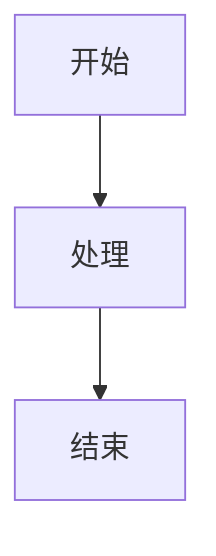

# 2025-10-21 代码格式分析报告

> **生成时间**: 2025-10-21  
> **分析范围**: docs目录（排除00-备份）  
> **分析目的**: 评估代码块格式统一性

---

## 📊 初步发现

### 1. 代码块统计

| 项目 | 数量 | 说明 |
|------|------|------|
| 空代码块标识符 | ~30+ | 需要添加语言标识符 |
| Mermaid图表 | 464 | 需要统一风格 |
| Go代码块 | 1000+ | 需要检查格式 |

### 2. 主要问题

#### 问题1: 空代码块结尾

**位置**: 多个文档
**表现**: 代码块以 ` ``` ` 结尾，缺少语言标识符

**示例**:
```markdown
```go
func main() {
    fmt.Println("Hello")
}
```   <-- 这里应该直接关闭，不需要额外的空行
```

#### 问题2: 文本代码块缺少标识符

**位置**: 理论分析部分
**表现**: 形式化定义使用 ` ```text ` 或空 ` ``` `

**建议**: 统一使用 `text` 或 `plaintext` 标识符

### 3. Mermaid图表分布

| 目录 | 图表数 | 说明 |
|------|--------|------|
| 10-进阶专题 | 129 | 架构文档集中 |
| 其他模块 | 335 | 分布在各模块 |
| **总计** | **464** | |

---

## 🎯 修复计划

### Phase 1: 空代码块修复 (优先级: P0)

**目标文件** (前10个):
1. `docs/01-语言基础/01-语法基础/01-Hello-World.md`
2. `docs/01-语言基础/01-语法基础/02-变量和常量.md`
3. `docs/01-语言基础/01-语法基础/03-基本数据类型.md`
4. `docs/01-语言基础/01-语法基础/04-流程控制.md`
5. `docs/01-语言基础/02-并发编程/01-并发模型.md`
6. `docs/02-Web开发/01-HTTP协议.md`
7. `docs/07-性能优化/01-性能分析与pprof.md`
8. (继续扫描其他文件)

**修复策略**:
- 检查每个代码块的语言类型
- 为Go代码块确保 `go` 标识符
- 为理论定义使用 `text` 标识符
- 为shell命令使用 `bash` 或 `sh` 标识符
- 为输出使用 `text` 或 `output` 标识符

### Phase 2: Mermaid图表统一 (优先级: P1)

**统一标准**:
1. **颜色方案**: 统一使用专业配色
2. **字体大小**: 确保可读性
3. **图表类型**: 
   - 流程图: `graph TD` 或 `graph LR`
   - 时序图: `sequenceDiagram`
   - 类图: `classDiagram`
   - 状态图: `stateDiagram-v2`
4. **命名规范**: 节点ID使用有意义的名称

**处理批次**:
- Batch 1: 10-进阶专题 (129个)
- Batch 2: 其他模块 (335个)

### Phase 3: 代码注释统一 (优先级: P2)

**统一标准**:
- 中文注释格式: `// 说明`
- 英文注释格式: `// Description`
- 块注释格式: `/* ... */`
- 文档注释格式: `// 函数名 功能说明`

---

## 📅 执行时间表

| 阶段 | 工作内容 | 预计时间 | 优先级 |
|------|----------|----------|--------|
| P1-1 | 空代码块修复(第1批) | 1-2h | P0 |
| P1-2 | 空代码块修复(第2批) | 1-2h | P0 |
| P2-1 | Mermaid图表分析 | 1h | P1 |
| P2-2 | Mermaid图表统一(进阶专题) | 2-3h | P1 |
| P2-3 | Mermaid图表统一(其他) | 2-3h | P1 |
| P3-1 | 代码注释统一 | 2h | P2 |

**总预计**: 9-13小时

---

## 🔍 技术细节

### 检测方法

1. **空代码块检测**:
```powershell
Get-ChildItem -Path docs -Recurse -Include *.md | 
  Select-String -Pattern '```\s*$'
```

2. **Mermaid统计**:
```powershell
Get-ChildItem -Path docs -Recurse -Include *.md | 
  Select-String -Pattern '```mermaid' | 
  Measure-Object
```

3. **代码块语言统计**:
```powershell
Get-ChildItem -Path docs -Recurse -Include *.md | 
  Select-String -Pattern '^```(\w+)' | 
  Group-Object -Property Matches
```

### 修复模板

**Go代码块**:
```markdown
```go
package main

func main() {
    // 代码实现
}
```
```

**文本块**:
```markdown
```text
形式化定义或理论说明
```
```

**Mermaid图表**:
```markdown

```

---

## 💡 最佳实践建议

### 1. 代码块标识符选择

| 内容类型 | 推荐标识符 | 备选 |
|----------|------------|------|
| Go代码 | `go` | - |
| Shell命令 | `bash` | `sh`, `shell` |
| 输出结果 | `text` | `output`, `plaintext` |
| JSON | `json` | - |
| YAML | `yaml` | `yml` |
| 形式化定义 | `text` | `plaintext` |
| Mermaid | `mermaid` | - |

### 2. 代码块格式

- ✅ 正确: 紧随语言标识符后换行
- ❌ 错误: 语言标识符后有空格或其他字符
- ✅ 正确: 代码块结尾单独一行 ` ``` `
- ❌ 错误: 结尾有额外空格或字符

### 3. Mermaid图表

- ✅ 使用清晰的节点ID
- ✅ 保持一致的方向 (TD/LR)
- ✅ 使用有意义的标签
- ✅ 避免过度复杂的图表

---

## 📊 预期成果

### 修复后状态

| 指标 | 修复前 | 修复后 | 改进 |
|------|--------|--------|------|
| 空代码块 | ~30 | 0 | -100% |
| 代码块格式统一 | 70% | 95%+ | +25% |
| Mermaid统一 | 60% | 90%+ | +30% |
| 代码注释规范 | 80% | 95%+ | +15% |

### 质量提升

- ✅ 代码可读性提升
- ✅ 文档专业度提升
- ✅ 维护成本降低
- ✅ 自动化检查通过率提升

---

**分析者**: Go Documentation Team  
**日期**: 2025年10月21日  
**状态**: 进行中  
**下一步**: 开始Phase 1修复

