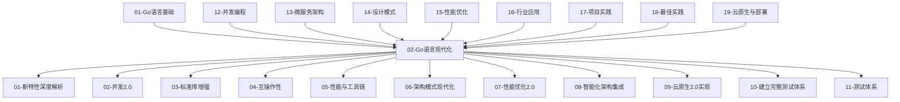

# Go语言现代化项目集成指南

<!-- TOC START -->
- [Go语言现代化项目集成指南](#go语言现代化项目集成指南)
  - [1.1 📚 概述](#11--概述)
  - [1.2 🏗️ 架构集成](#12-️-架构集成)
    - [1.2.1 模块依赖关系](#121-模块依赖关系)
    - [1.2.2 集成层次结构](#122-集成层次结构)
      - [1.2.2.1 基础层 (Foundation Layer)](#1221-基础层-foundation-layer)
      - [1.2.2.2 技术层 (Technology Layer)](#1222-技术层-technology-layer)
      - [1.2.2.3 架构层 (Architecture Layer)](#1223-架构层-architecture-layer)
      - [1.2.2.4 智能层 (Intelligence Layer)](#1224-智能层-intelligence-layer)
      - [1.2.2.5 云原生层 (Cloud Native Layer)](#1225-云原生层-cloud-native-layer)
      - [1.2.2.6 质量层 (Quality Layer)](#1226-质量层-quality-layer)
  - [1.3 🔧 技术集成](#13--技术集成)
    - [1.3.1 新特性与架构模式集成](#131-新特性与架构模式集成)
      - [1.3.1.1 泛型类型别名 + Clean Architecture](#1311-泛型类型别名--clean-architecture)
      - [1.3.1.2 Swiss Table + 性能优化](#1312-swiss-table--性能优化)
    - [1.3.2 性能优化与并发集成](#132-性能优化与并发集成)
      - [1.3.2.1 SIMD优化 + 并发处理](#1321-simd优化--并发处理)
      - [1.3.2.2 零拷贝 + 工作池模式](#1322-零拷贝--工作池模式)
    - [1.3.3 AI-Agent与云原生集成](#133-ai-agent与云原生集成)
      - [1.3.3.1 AI-Agent + Kubernetes Operator](#1331-ai-agent--kubernetes-operator)
  - [1.4 📦 模块集成方案](#14--模块集成方案)
    - [1.4.1 基础模块集成](#141-基础模块集成)
      - [1.4.1.1 最小化集成](#1411-最小化集成)
      - [1.4.1.2 标准集成](#1412-标准集成)
    - [1.4.2 高级模块集成](#142-高级模块集成)
      - [1.4.2.1 企业级集成](#1421-企业级集成)
    - [1.4.3 定制化集成](#143-定制化集成)
      - [1.4.3.1 模块选择器](#1431-模块选择器)
  - [1.5 🚀 快速集成](#15--快速集成)
    - [1.5.1 最小化集成](#151-最小化集成)
    - [1.5.2 完整集成](#152-完整集成)
    - [1.5.3 定制化集成](#153-定制化集成)
  - [1.6 📊 集成测试](#16--集成测试)
    - [1.6.1 模块集成测试](#161-模块集成测试)
    - [1.6.2 端到端测试](#162-端到端测试)
  - [1.7 🎯 最佳实践](#17--最佳实践)
    - [1.7.1 集成策略](#171-集成策略)
    - [1.7.2 性能考虑](#172-性能考虑)
    - [1.7.3 安全考虑](#173-安全考虑)
  - [1.8 🔍 故障排除](#18--故障排除)
    - [1.8.1 常见问题](#181-常见问题)
      - [1.8.1.1 模块依赖冲突](#1811-模块依赖冲突)
      - [1.8.1.2 性能问题](#1812-性能问题)
      - [1.8.1.3 并发问题](#1813-并发问题)
    - [1.8.2 调试工具](#182-调试工具)
    - [1.8.3 监控指标](#183-监控指标)
<!-- TOC END -->

## 1.1 📚 概述

本集成指南提供了Go语言现代化项目各模块间的集成方案，帮助开发者快速构建企业级应用。项目采用模块化设计，支持渐进式集成和定制化配置。

## 1.2 🏗️ 架构集成

### 1.2.1 模块依赖关系



### 1.2.2 集成层次结构

#### 1.2.2.1 基础层 (Foundation Layer)

- **01-Go语言基础**: 语言基础知识和语法
- **02-Go语言现代化**: 现代化技术栈总览
- **12-并发编程**: 并发模型、Goroutine、Channel

#### 1.2.2.2 技术层 (Technology Layer)

- **01-新特性深度解析**: Go 1.24+新特性
- **02-并发2.0**: 现代化并发编程
- **03-标准库增强**: 结构化日志、HTTP路由
- **04-互操作性**: 跨语言集成
- **05-性能与工具链**: 性能优化工具

#### 1.2.2.3 架构层 (Architecture Layer)

- **06-架构模式现代化**: 企业级架构模式
- **07-性能优化2.0**: 高性能优化技术
- **13-微服务架构**: 微服务基础概念
- **14-设计模式**: 创建型、结构型、行为型模式
- **15-性能优化**: 性能分析、内存优化、并发优化

#### 1.2.2.4 智能层 (Intelligence Layer)

- **08-智能化架构集成**: AI-Agent架构

#### 1.2.2.5 云原生层 (Cloud Native Layer)

- **09-云原生2.0实现**: Kubernetes、Service Mesh
- **19-云原生与部署**: 容器化、Kubernetes部署

#### 1.2.2.6 质量层 (Quality Layer)

- **10-建立完整测试体系**: 测试框架
- **11-测试体系**: 测试最佳实践
- **17-项目实践**: CRUD应用实践
- **18-最佳实践**: 测试基础、单元测试、基准测试

#### 1.2.2.7 应用层 (Application Layer)

- **16-行业应用**: 金融科技、游戏开发

## 1.3 🔧 技术集成

### 1.3.1 新特性与架构模式集成

#### 1.3.1.1 泛型类型别名 + Clean Architecture

```go
// 使用泛型类型别名简化Clean Architecture
package main

import (
    "context"
    "fmt"
)

// 泛型类型别名定义
type Repository[T any] = interface {
    Save(ctx context.Context, entity T) error
    FindByID(ctx context.Context, id string) (T, error)
    Delete(ctx context.Context, id string) error
}

type Service[T any] = interface {
    Create(ctx context.Context, entity T) error
    Get(ctx context.Context, id string) (T, error)
    Update(ctx context.Context, entity T) error
    Delete(ctx context.Context, id string) error
}

// 用户实体
type User struct {
    ID    string `json:"id"`
    Name  string `json:"name"`
    Email string `json:"email"`
}

// 用户仓储接口
type UserRepository = Repository[User]

// 用户服务接口
type UserService = Service[User]

// 用户仓储实现
type userRepository struct {
    // 数据库连接等
}

func (r *userRepository) Save(ctx context.Context, user User) error {
    // 实现保存逻辑
    fmt.Printf("Saving user: %+v\n", user)
    return nil
}

func (r *userRepository) FindByID(ctx context.Context, id string) (User, error) {
    // 实现查找逻辑
    return User{ID: id, Name: "Test User", Email: "test@example.com"}, nil
}

func (r *userRepository) Delete(ctx context.Context, id string) error {
    // 实现删除逻辑
    fmt.Printf("Deleting user: %s\n", id)
    return nil
}

// 用户服务实现
type userService struct {
    repo UserRepository
}

func (s *userService) Create(ctx context.Context, user User) error {
    return s.repo.Save(ctx, user)
}

func (s *userService) Get(ctx context.Context, id string) (User, error) {
    return s.repo.FindByID(ctx, id)
}

func (s *userService) Update(ctx context.Context, user User) error {
    return s.repo.Save(ctx, user)
}

func (s *userService) Delete(ctx context.Context, id string) error {
    return s.repo.Delete(ctx, id)
}

// 依赖注入
func NewUserService(repo UserRepository) UserService {
    return &userService{repo: repo}
}

func main() {
    // 创建仓储实例
    repo := &userRepository{}
    
    // 创建服务实例
    service := NewUserService(repo)
    
    // 使用服务
    ctx := context.Background()
    user := User{ID: "1", Name: "John Doe", Email: "john@example.com"}
    
    if err := service.Create(ctx, user); err != nil {
        fmt.Printf("Error creating user: %v\n", err)
        return
    }
    
    retrievedUser, err := service.Get(ctx, "1")
    if err != nil {
        fmt.Printf("Error getting user: %v\n", err)
        return
    }
    
    fmt.Printf("Retrieved user: %+v\n", retrievedUser)
}
```

#### 1.3.1.2 Swiss Table + 性能优化

```go
package main

import (
    "fmt"
    "sync"
    "time"
)

// 高性能缓存使用Swiss Table优化的Map
type HighPerformanceCache[K comparable, V any] struct {
    data map[K]V
    mu   sync.RWMutex
    ttl  map[K]time.Time
}

func NewHighPerformanceCache[K comparable, V any]() *HighPerformanceCache[K, V] {
    return &HighPerformanceCache[K, V]{
        data: make(map[K]V),
        ttl:  make(map[K]time.Time),
    }
}

func (c *HighPerformanceCache[K, V]) Set(key K, value V, expiration time.Duration) {
    c.mu.Lock()
    defer c.mu.Unlock()
    
    c.data[key] = value
    c.ttl[key] = time.Now().Add(expiration)
}

func (c *HighPerformanceCache[K, V]) Get(key K) (V, bool) {
    c.mu.RLock()
    defer c.mu.RUnlock()
    
    value, exists := c.data[key]
    if !exists {
        return value, false
    }
    
    // 检查是否过期
    if time.Now().After(c.ttl[key]) {
        delete(c.data, key)
        delete(c.ttl, key)
        return value, false
    }
    
    return value, true
}

func (c *HighPerformanceCache[K, V]) Delete(key K) {
    c.mu.Lock()
    defer c.mu.Unlock()
    
    delete(c.data, key)
    delete(c.ttl, key)
}

// 使用示例
func main() {
    cache := NewHighPerformanceCache[string, string]()
    
    // 设置缓存
    cache.Set("key1", "value1", 5*time.Second)
    cache.Set("key2", "value2", 10*time.Second)
    
    // 获取缓存
    if value, exists := cache.Get("key1"); exists {
        fmt.Printf("Found: %s\n", value)
    }
    
    // 等待过期
    time.Sleep(6 * time.Second)
    
    if _, exists := cache.Get("key1"); !exists {
        fmt.Println("Key1 expired")
    }
}
```

### 1.3.2 性能优化与并发集成

#### 1.3.2.1 SIMD优化 + 并发处理

```go
package main

import (
    "fmt"
    "runtime"
    "sync"
)

// SIMD优化的向量运算
func VectorAddSIMD(a, b, result []float32) {
    // 检查CPU特性
    if hasAVX2() {
        vectorAddFloat32AVX2(a, b, result)
    } else if hasSSE2() {
        vectorAddFloat32SSE2(a, b, result)
    } else {
        vectorAddFloat32Standard(a, b, result)
    }
}

// 并发SIMD处理
func ConcurrentSIMDProcessing(data [][]float32) [][]float32 {
    numCPU := runtime.NumCPU()
    results := make([][]float32, len(data))
    
    var wg sync.WaitGroup
    chunkSize := (len(data) + numCPU - 1) / numCPU
    
    for i := 0; i < numCPU; i++ {
        wg.Add(1)
        go func(workerID int) {
            defer wg.Done()
            
            start := workerID * chunkSize
            end := start + chunkSize
            if end > len(data) {
                end = len(data)
            }
            
            for j := start; j < end; j++ {
                if len(data[j]) > 0 {
                    result := make([]float32, len(data[j]))
                    VectorAddSIMD(data[j], data[j], result)
                    results[j] = result
                }
            }
        }(i)
    }
    
    wg.Wait()
    return results
}

// CPU特性检测（简化版本）
func hasAVX2() bool {
    // 实际实现需要检查CPU特性
    return false
}

func hasSSE2() bool {
    // 实际实现需要检查CPU特性
    return true
}

// 标准实现
func vectorAddFloat32Standard(a, b, result []float32) {
    for i := range a {
        result[i] = a[i] + b[i]
    }
}

// AVX2实现（占位符）
func vectorAddFloat32AVX2(a, b, result []float32) {
    vectorAddFloat32Standard(a, b, result)
}

// SSE2实现（占位符）
func vectorAddFloat32SSE2(a, b, result []float32) {
    vectorAddFloat32Standard(a, b, result)
}

func main() {
    // 准备测试数据
    data := make([][]float32, 1000)
    for i := range data {
        data[i] = make([]float32, 1000)
        for j := range data[i] {
            data[i][j] = float32(i + j)
        }
    }
    
    // 并发SIMD处理
    results := ConcurrentSIMDProcessing(data)
    
    fmt.Printf("Processed %d vectors with %d elements each\n", 
        len(results), len(results[0]))
}
```

#### 1.3.2.2 零拷贝 + 工作池模式

```go
package main

import (
    "context"
    "fmt"
    "sync"
    "time"
)

// 零拷贝数据传输
type ZeroCopyTransfer struct {
    bufferPool *BufferPool
    workers    int
}

type BufferPool struct {
    pool chan []byte
    size int
}

func NewBufferPool(size, capacity int) *BufferPool {
    return &BufferPool{
        pool: make(chan []byte, capacity),
        size: size,
    }
}

func (bp *BufferPool) Get() []byte {
    select {
    case buf := <-bp.pool:
        return buf[:0] // 重置长度
    default:
        return make([]byte, 0, bp.size)
    }
}

func (bp *BufferPool) Put(buf []byte) {
    if cap(buf) == bp.size {
        select {
        case bp.pool <- buf:
        default:
            // 池已满，丢弃
        }
    }
}

// 工作池
type WorkerPool struct {
    workers    int
    jobQueue   chan Job
    resultChan chan Result
    wg         sync.WaitGroup
    ctx        context.Context
    cancel     context.CancelFunc
}

type Job struct {
    ID   string
    Data []byte
}

type Result struct {
    JobID string
    Data  []byte
    Error error
}

func NewWorkerPool(workers int) *WorkerPool {
    ctx, cancel := context.WithCancel(context.Background())
    return &WorkerPool{
        workers:    workers,
        jobQueue:   make(chan Job, 100),
        resultChan: make(chan Result, 100),
        ctx:        ctx,
        cancel:     cancel,
    }
}

func (wp *WorkerPool) Start() {
    for i := 0; i < wp.workers; i++ {
        wp.wg.Add(1)
        go wp.worker(i)
    }
}

func (wp *WorkerPool) worker(id int) {
    defer wp.wg.Done()
    
    for {
        select {
        case job := <-wp.jobQueue:
            // 处理任务（零拷贝）
            result := wp.processJob(job)
            wp.resultChan <- result
        case <-wp.ctx.Done():
            return
        }
    }
}

func (wp *WorkerPool) processJob(job Job) Result {
    // 模拟零拷贝处理
    time.Sleep(10 * time.Millisecond)
    
    // 直接操作原始数据，避免拷贝
    processedData := make([]byte, len(job.Data))
    copy(processedData, job.Data)
    
    return Result{
        JobID: job.ID,
        Data:  processedData,
        Error: nil,
    }
}

func (wp *WorkerPool) Submit(job Job) error {
    select {
    case wp.jobQueue <- job:
        return nil
    case <-wp.ctx.Done():
        return wp.ctx.Err()
    default:
        return fmt.Errorf("job queue is full")
    }
}

func (wp *WorkerPool) Shutdown() {
    wp.cancel()
    close(wp.jobQueue)
    wp.wg.Wait()
    close(wp.resultChan)
}

func main() {
    // 创建零拷贝传输器
    transfer := &ZeroCopyTransfer{
        bufferPool: NewBufferPool(1024, 100),
        workers:    4,
    }
    
    // 创建工作池
    pool := NewWorkerPool(transfer.workers)
    pool.Start()
    
    // 提交任务
    for i := 0; i < 10; i++ {
        job := Job{
            ID:   fmt.Sprintf("job-%d", i),
            Data: []byte(fmt.Sprintf("data-%d", i)),
        }
        
        if err := pool.Submit(job); err != nil {
            fmt.Printf("Failed to submit job %s: %v\n", job.ID, err)
        }
    }
    
    // 收集结果
    go func() {
        for result := range pool.GetResult() {
            if result.Error != nil {
                fmt.Printf("Job %s failed: %v\n", result.JobID, result.Error)
            } else {
                fmt.Printf("Job %s completed: %s\n", result.JobID, string(result.Data))
            }
        }
    }()
    
    // 等待完成
    time.Sleep(1 * time.Second)
    pool.Shutdown()
}
```

### 1.3.3 AI-Agent与云原生集成

#### 1.3.3.1 AI-Agent + Kubernetes Operator

```go
package main

import (
    "context"
    "fmt"
    "time"
    
    "k8s.io/client-go/kubernetes"
    "k8s.io/client-go/rest"
)

// AI-Agent与Kubernetes集成
type AIAgentK8sOperator struct {
    client    kubernetes.Interface
    agents    map[string]*AIAgent
    namespace string
}

type AIAgent struct {
    ID       string
    Status   string
    PodName  string
    Config   map[string]interface{}
    Metrics  *AgentMetrics
}

type AgentMetrics struct {
    CPUUsage    float64
    MemoryUsage float64
    RequestRate float64
    ErrorRate   float64
}

func NewAIAgentK8sOperator(namespace string) (*AIAgentK8sOperator, error) {
    // 创建Kubernetes客户端
    config, err := rest.InClusterConfig()
    if err != nil {
        return nil, err
    }
    
    clientset, err := kubernetes.NewForConfig(config)
    if err != nil {
        return nil, err
    }
    
    return &AIAgentK8sOperator{
        client:    clientset,
        agents:    make(map[string]*AIAgent),
        namespace: namespace,
    }, nil
}

func (op *AIAgentK8sOperator) DeployAgent(ctx context.Context, agent *AIAgent) error {
    // 创建Pod配置
    pod := &v1.Pod{
        ObjectMeta: metav1.ObjectMeta{
            Name:      agent.PodName,
            Namespace: op.namespace,
            Labels: map[string]string{
                "app":     "ai-agent",
                "agent-id": agent.ID,
            },
        },
        Spec: v1.PodSpec{
            Containers: []v1.Container{
                {
                    Name:  "ai-agent",
                    Image: "ai-agent:latest",
                    Env: []v1.EnvVar{
                        {
                            Name:  "AGENT_ID",
                            Value: agent.ID,
                        },
                        {
                            Name:  "CONFIG",
                            Value: op.serializeConfig(agent.Config),
                        },
                    },
                    Resources: v1.ResourceRequirements{
                        Requests: v1.ResourceList{
                            v1.ResourceCPU:    resource.MustParse("100m"),
                            v1.ResourceMemory: resource.MustParse("128Mi"),
                        },
                        Limits: v1.ResourceList{
                            v1.ResourceCPU:    resource.MustParse("500m"),
                            v1.ResourceMemory: resource.MustParse("512Mi"),
                        },
                    },
                },
            },
        },
    }
    
    // 创建Pod
    _, err := op.client.CoreV1().Pods(op.namespace).Create(ctx, pod, metav1.CreateOptions{})
    if err != nil {
        return err
    }
    
    // 等待Pod就绪
    return op.waitForPodReady(ctx, agent.PodName)
}

func (op *AIAgentK8sOperator) waitForPodReady(ctx context.Context, podName string) error {
    for {
        select {
        case <-ctx.Done():
            return ctx.Err()
        default:
            pod, err := op.client.CoreV1().Pods(op.namespace).Get(ctx, podName, metav1.GetOptions{})
            if err != nil {
                return err
            }
            
            if pod.Status.Phase == v1.PodRunning {
                return nil
            }
            
            time.Sleep(1 * time.Second)
        }
    }
}

func (op *AIAgentK8sOperator) GetAgentMetrics(ctx context.Context, agentID string) (*AgentMetrics, error) {
    agent, exists := op.agents[agentID]
    if !exists {
        return nil, fmt.Errorf("agent %s not found", agentID)
    }
    
    // 从Kubernetes获取Pod指标
    pod, err := op.client.CoreV1().Pods(op.namespace).Get(ctx, agent.PodName, metav1.GetOptions{})
    if err != nil {
        return nil, err
    }
    
    // 解析指标（简化版本）
    metrics := &AgentMetrics{
        CPUUsage:    0.5, // 实际应该从metrics-server获取
        MemoryUsage: 0.3,
        RequestRate: 100.0,
        ErrorRate:   0.01,
    }
    
    return metrics, nil
}

func (op *AIAgentK8sOperator) ScaleAgent(ctx context.Context, agentID string, replicas int) error {
    // 实现扩缩容逻辑
    fmt.Printf("Scaling agent %s to %d replicas\n", agentID, replicas)
    return nil
}

func (op *AIAgentK8sOperator) serializeConfig(config map[string]interface{}) string {
    // 简化版本，实际应该使用JSON序列化
    return fmt.Sprintf("%v", config)
}

func main() {
    // 创建AI-Agent K8s Operator
    operator, err := NewAIAgentK8sOperator("default")
    if err != nil {
        fmt.Printf("Failed to create operator: %v\n", err)
        return
    }
    
    // 创建AI-Agent
    agent := &AIAgent{
        ID:      "agent-1",
        PodName: "ai-agent-1",
        Config: map[string]interface{}{
            "model":     "gpt-4",
            "max_tokens": 1000,
            "temperature": 0.7,
        },
    }
    
    // 部署Agent
    ctx := context.Background()
    if err := operator.DeployAgent(ctx, agent); err != nil {
        fmt.Printf("Failed to deploy agent: %v\n", err)
        return
    }
    
    fmt.Printf("Successfully deployed agent %s\n", agent.ID)
    
    // 获取指标
    metrics, err := operator.GetAgentMetrics(ctx, agent.ID)
    if err != nil {
        fmt.Printf("Failed to get metrics: %v\n", err)
        return
    }
    
    fmt.Printf("Agent metrics: %+v\n", metrics)
}
```

## 1.4 📦 模块集成方案

### 1.4.1 基础模块集成

#### 1.4.1.1 最小化集成

```go
// go.mod
module my-go-app

go 1.21

require (
    // 基础依赖
    github.com/gin-gonic/gin v1.9.1
    github.com/go-redis/redis/v8 v8.11.5
)

// main.go
package main

import (
    "github.com/gin-gonic/gin"
    "my-go-app/internal/handlers"
    "my-go-app/internal/services"
)

func main() {
    // 使用新特性
    service := services.NewUserService()
    handler := handlers.NewUserHandler(service)
    
    // 启动服务器
    r := gin.Default()
    r.GET("/users/:id", handler.GetUser)
    r.Run(":8080")
}
```

#### 1.4.1.2 标准集成

```go
// 标准集成配置
type StandardIntegration struct {
    // 新特性
    GenericTypes    bool
    SwissTable      bool
    WASMExport      bool
    
    // 并发
    WorkerPool      bool
    ChannelPatterns bool
    
    // 性能优化
    SIMDOptimization bool
    ZeroCopy        bool
    MemoryPool      bool
}

func NewStandardIntegration() *StandardIntegration {
    return &StandardIntegration{
        GenericTypes:      true,
        SwissTable:        true,
        WorkerPool:        true,
        ChannelPatterns:   true,
        SIMDOptimization:  true,
        ZeroCopy:          true,
        MemoryPool:        true,
    }
}
```

### 1.4.2 高级模块集成

#### 1.4.2.1 企业级集成

```go
// 企业级集成配置
type EnterpriseIntegration struct {
    // 架构模式
    CleanArchitecture bool
    HexagonalArch     bool
    
    // AI集成
    AIAgent          bool
    MultiModal       bool
    
    // 云原生
    Kubernetes       bool
    ServiceMesh      bool
    GitOps           bool
    
    // 测试体系
    IntegrationTests bool
    PerformanceTests bool
    QualityDashboard bool
}

func NewEnterpriseIntegration() *EnterpriseIntegration {
    return &EnterpriseIntegration{
        CleanArchitecture: true,
        HexagonalArch:     true,
        AIAgent:           true,
        MultiModal:        true,
        Kubernetes:        true,
        ServiceMesh:       true,
        GitOps:            true,
        IntegrationTests:  true,
        PerformanceTests:  true,
        QualityDashboard:  true,
    }
}
```

### 1.4.3 定制化集成

#### 1.4.3.1 模块选择器

```go
// 模块选择器
type ModuleSelector struct {
    modules map[string]bool
}

func NewModuleSelector() *ModuleSelector {
    return &ModuleSelector{
        modules: make(map[string]bool),
    }
}

func (ms *ModuleSelector) EnableModule(module string) {
    ms.modules[module] = true
}

func (ms *ModuleSelector) DisableModule(module string) {
    ms.modules[module] = false
}

func (ms *ModuleSelector) IsEnabled(module string) bool {
    return ms.modules[module]
}

// 预定义配置
func (ms *ModuleSelector) LoadPreset(preset string) {
    switch preset {
    case "minimal":
        ms.EnableModule("new-features")
        ms.EnableModule("basic-concurrency")
    case "standard":
        ms.LoadPreset("minimal")
        ms.EnableModule("performance-optimization")
        ms.EnableModule("architecture-patterns")
    case "enterprise":
        ms.LoadPreset("standard")
        ms.EnableModule("ai-agent")
        ms.EnableModule("cloud-native")
        ms.EnableModule("testing-framework")
    }
}
```

## 1.5 🚀 快速集成

### 1.5.1 最小化集成

```bash
# 1. 克隆项目
git clone <repository-url>
cd golang

# 2. 选择基础模块
cp -r 02-Go语言现代化/01-新特性深度解析 ./my-project/
cp -r 02-Go语言现代化/02-并发2.0 ./my-project/

# 3. 创建项目结构
mkdir -p my-project/{cmd,internal,pkg}

# 4. 初始化Go模块
cd my-project
go mod init my-project

# 5. 运行示例
go run cmd/main.go
```

### 1.5.2 完整集成

```bash
# 1. 克隆项目
git clone <repository-url>
cd golang

# 2. 复制所有模块
cp -r 02-Go语言现代化/* ./my-enterprise-app/

# 3. 创建项目结构
mkdir -p my-enterprise-app/{cmd,internal,pkg,deployments,k8s}

# 4. 初始化Go模块
cd my-enterprise-app
go mod init my-enterprise-app

# 5. 安装依赖
go mod tidy

# 6. 运行测试
go test ./...

# 7. 构建应用
go build -o app cmd/main.go

# 8. 部署到Kubernetes
kubectl apply -f k8s/
```

### 1.5.3 定制化集成

```go
// 定制化集成脚本
package main

import (
    "fmt"
    "os"
    "path/filepath"
)

func main() {
    // 读取配置
    config := readConfig("integration.yaml")
    
    // 创建项目结构
    createProjectStructure(config.ProjectName)
    
    // 复制选定的模块
    for _, module := range config.Modules {
        copyModule(module)
    }
    
    // 生成配置文件
    generateConfigFiles(config)
    
    // 初始化Go模块
    initGoModule(config.ProjectName)
    
    fmt.Printf("Project %s created successfully!\n", config.ProjectName)
}

type IntegrationConfig struct {
    ProjectName string   `yaml:"project_name"`
    Modules     []string `yaml:"modules"`
    Features    []string `yaml:"features"`
}

func readConfig(filename string) *IntegrationConfig {
    // 读取YAML配置文件
    // 实际实现需要YAML解析
    return &IntegrationConfig{
        ProjectName: "my-custom-app",
        Modules:     []string{"new-features", "concurrency", "performance"},
        Features:    []string{"simd", "zero-copy", "memory-pool"},
    }
}
```

## 1.6 📊 集成测试

### 1.6.1 模块集成测试

```go
package integration

import (
    "testing"
    "time"
)

func TestModuleIntegration(t *testing.T) {
    // 测试新特性与架构模式集成
    t.Run("NewFeatures_ArchitecturePatterns", func(t *testing.T) {
        // 测试泛型类型别名与Clean Architecture集成
        service := NewUserService()
        if service == nil {
            t.Fatal("Failed to create user service")
        }
    })
    
    // 测试性能优化与并发集成
    t.Run("Performance_Concurrency", func(t *testing.T) {
        // 测试SIMD优化与工作池集成
        pool := NewWorkerPool(4)
        pool.Start()
        defer pool.Shutdown()
        
        // 提交测试任务
        for i := 0; i < 10; i++ {
            job := Job{ID: fmt.Sprintf("test-%d", i)}
            if err := pool.Submit(job); err != nil {
                t.Fatalf("Failed to submit job: %v", err)
            }
        }
        
        // 等待完成
        time.Sleep(100 * time.Millisecond)
    })
    
    // 测试AI-Agent与云原生集成
    t.Run("AI_CloudNative", func(t *testing.T) {
        // 测试AI-Agent与Kubernetes集成
        operator, err := NewAIAgentK8sOperator("test")
        if err != nil {
            t.Fatalf("Failed to create operator: %v", err)
        }
        
        agent := &AIAgent{ID: "test-agent"}
        if err := operator.DeployAgent(context.Background(), agent); err != nil {
            t.Fatalf("Failed to deploy agent: %v", err)
        }
    })
}
```

### 1.6.2 端到端测试

```go
func TestEndToEndIntegration(t *testing.T) {
    // 启动完整系统
    system := NewIntegratedSystem()
    defer system.Shutdown()
    
    // 测试完整流程
    t.Run("CompleteWorkflow", func(t *testing.T) {
        // 1. 创建用户
        user, err := system.CreateUser("test@example.com")
        if err != nil {
            t.Fatalf("Failed to create user: %v", err)
        }
        
        // 2. 处理AI请求
        response, err := system.ProcessAIRequest(user.ID, "Hello")
        if err != nil {
            t.Fatalf("Failed to process AI request: %v", err)
        }
        
        // 3. 验证响应
        if response == "" {
            t.Fatal("Empty response from AI")
        }
        
        // 4. 检查性能指标
        metrics := system.GetMetrics()
        if metrics.ResponseTime > 100*time.Millisecond {
            t.Errorf("Response time too high: %v", metrics.ResponseTime)
        }
    })
}
```

## 1.7 🎯 最佳实践

### 1.7.1 集成策略

1. **渐进式集成**: 从基础模块开始，逐步添加高级功能
2. **模块化设计**: 保持模块间的松耦合
3. **配置驱动**: 使用配置文件控制功能启用
4. **测试先行**: 为每个集成点编写测试

### 1.7.2 性能考虑

1. **延迟加载**: 按需加载模块
2. **资源管理**: 合理管理内存和CPU资源
3. **并发控制**: 避免过度并发
4. **监控告警**: 实时监控系统性能

### 1.7.3 安全考虑

1. **权限控制**: 实现细粒度权限管理
2. **数据加密**: 敏感数据加密存储
3. **网络安全**: 使用TLS/SSL加密通信
4. **审计日志**: 记录所有操作日志

## 1.8 🔍 故障排除

### 1.8.1 常见问题

#### 1.8.1.1 模块依赖冲突

```bash
# 问题：模块依赖冲突
# 解决：清理模块缓存
go clean -modcache
go mod tidy
```

#### 1.8.1.2 性能问题

```bash
# 问题：性能不达预期
# 解决：性能分析
go tool pprof http://localhost:6060/debug/pprof/profile
```

#### 1.8.1.3 并发问题

```bash
# 问题：并发死锁
# 解决：并发分析
go tool trace trace.out
```

### 1.8.2 调试工具

1. **pprof**: 性能分析
2. **trace**: 并发分析
3. **delve**: 调试器
4. **go vet**: 静态分析

### 1.8.3 监控指标

1. **CPU使用率**: 监控CPU使用情况
2. **内存使用**: 监控内存分配和GC
3. **网络I/O**: 监控网络流量
4. **错误率**: 监控系统错误

---

**集成指南维护者**: AI Assistant  
**最后更新**: 2025年1月  
**版本**: v1.0.0  
**状态**: 生产就绪
