# Go 1.26.1 reflect 包决策树与流程图

本文档提供全面的 Go reflect 包使用决策流程，帮助开发者在不同场景下做出正确的选择。

---

## 目录

- [Go 1.26.1 reflect 包决策树与流程图](#go-1261-reflect-包决策树与流程图)
  - [目录](#目录)
  - [1. 何时使用 reflect 决策树](#1-何时使用-reflect-决策树)
    - [1.1 主决策流程](#11-主决策流程)
    - [1.2 决策说明](#12-决策说明)
  - [2. 类型处理决策树](#2-类型处理决策树)
    - [2.1 类型分类处理流程](#21-类型分类处理流程)
    - [2.2 复杂类型（Struct）详细处理流程](#22-复杂类型struct详细处理流程)
    - [2.3 Map 类型处理流程](#23-map-类型处理流程)
    - [2.4 Slice/Array 处理流程](#24-slicearray-处理流程)
  - [3. Value 操作决策流程](#3-value-操作决策流程)
    - [3.1 可设置性（CanSet）检查流程](#31-可设置性canset检查流程)
    - [3.2 可寻址性（CanAddr）判断流程](#32-可寻址性canaddr判断流程)
    - [3.3 类型转换决策流程](#33-类型转换决策流程)
  - [4. 方法调用决策流程](#4-方法调用决策流程)
    - [4.1 方法选择逻辑](#41-方法选择逻辑)
    - [4.2 参数准备流程](#42-参数准备流程)
    - [4.3 方法调用与返回值处理](#43-方法调用与返回值处理)
  - [5. 最佳实践检查清单](#5-最佳实践检查清单)
    - [5.1 使用 reflect 前的检查项](#51-使用-reflect-前的检查项)
    - [5.2 代码审查检查表](#52-代码审查检查表)
  - [6. 常见陷阱与解决方案](#6-常见陷阱与解决方案)
    - [6.1 陷阱识别流程](#61-陷阱识别流程)
    - [6.2 常见陷阱速查表](#62-常见陷阱速查表)
  - [7. 快速参考决策卡](#7-快速参考决策卡)
    - [7.1 Value 创建决策](#71-value-创建决策)
    - [7.2 修改值决策](#72-修改值决策)
  - [8. 总结](#8-总结)

---

## 1. 何时使用 reflect 决策树

### 1.1 主决策流程

```mermaid
flowchart TD
    A[开始: 需要处理未知类型?] --> B{编译时类型是否已知?}
    B -->|是| C[使用类型断言或类型开关]
    B -->|否| D{需要实现什么功能?}

    D --> E[序列化/反序列化]
    D --> F[通用数据处理]
    D --> G[动态方法调用]
    D --> H[类型检查和验证]
    D --> I[代码生成/元编程]

    E --> J{使用标准库?}
    J -->|encoding/json, encoding/xml| K[使用标准库，无需 reflect]
    J -->|自定义格式| L[可能需要 reflect]

    F --> M{能否用 interface{} + 类型断言?}
    M -->|能| N[优先使用类型断言]
    M -->|不能| O[考虑使用 reflect]

    G --> P{方法名是否动态确定?}
    P -->|是| Q[必须使用 reflect]
    P -->|否| R[考虑接口或函数映射]

    H --> S{仅检查 Kind?}
    S -->|是| T[使用 Type.Kind 足够]
    S -->|否| U[使用完整 reflect]

    I --> V[必须使用 reflect]

    L --> W{性能要求?}
    O --> W
    Q --> W
    U --> W
    V --> W

    W -->|高性能要求| X[寻找替代方案或优化]
    W -->|性能可接受| Y[使用 reflect]

    C --> Z[结束: 无需 reflect]
    K --> Z
    N --> Z
    R --> Z
    T --> Z
    X --> AA[考虑代码生成/泛型]
    Y --> AB[结束: 使用 reflect]
    AA --> AB
```

### 1.2 决策说明

| 决策点 | 条件 | 推荐方案 | 原因 |
|--------|------|----------|------|
| 编译时类型已知 | 类型在编译时确定 | 类型断言/类型开关 | 性能更好，类型安全 |
| 标准库支持 | json/xml 等 | 直接使用标准库 | 已优化，无需重复实现 |
| 动态方法调用 | 方法名运行时确定 | 必须使用 reflect | 无其他替代方案 |
| 高性能要求 | 热点代码路径 | 寻找替代方案 | reflect 有 10-100x 性能开销 |

---

## 2. 类型处理决策树

### 2.1 类型分类处理流程

```mermaid
flowchart TD
    A[获取 reflect.Type] --> B[获取 t.Kind]
    B --> C{Kind 类型?}

    C -->|Bool/Int/Uint/Float/Complex/String| D[基本类型]
    C -->|Array/Slice| E[序列类型]
    C -->|Map| F[映射类型]
    C -->|Struct| G[结构体类型]
    C -->|Ptr| H[指针类型]
    C -->|Interface| I[接口类型]
    C -->|Func| J[函数类型]
    C -->|Chan| K[通道类型]
    C -->|UnsafePointer| L[不安全指针]

    D --> M[使用对应类型方法<br/>t.Bits(), t.Size()]

    E --> N{Array or Slice?}
    N -->|Array| O[t.Len 获取长度]
    N -->|Slice| P[t.Elem 获取元素类型]
    O --> P

    F --> Q[t.Key 获取键类型]
    F --> R[t.Elem 获取值类型]

    G --> S[遍历字段]
    S --> T[for i := 0; i < t.NumField; i++]
    T --> U[获取字段信息]
    U --> U1[t.Field i 获取 StructField]
    U1 --> U2[访问 Name, Type, Tag, Offset]

    H --> V[t.Elem 获取指向类型]
    V --> W{是否需要解引用?}
    W -->|是| X[递归处理 Elem 类型]
    W -->|否| Y[保持指针类型]

    I --> Z{t.NumMethod > 0?}
    Z -->|是| AA[遍历方法集]
    Z -->|否| AB[动态类型检查]

    J --> AC[t.NumIn/NumOut 获取参数和返回值]
    J --> AD[t.IsVariadic 检查可变参数]

    K --> AE[t.ChanDir 获取通道方向]

    L --> AF[谨慎使用，避免 unsafe]

    M --> AG[处理完成]
    P --> AG
    Q --> AG
    R --> AG
    U2 --> AG
    X --> AG
    Y --> AG
    AA --> AG
    AB --> AG
    AC --> AG
    AD --> AG
    AE --> AG
    AF --> AG
```

### 2.2 复杂类型（Struct）详细处理流程

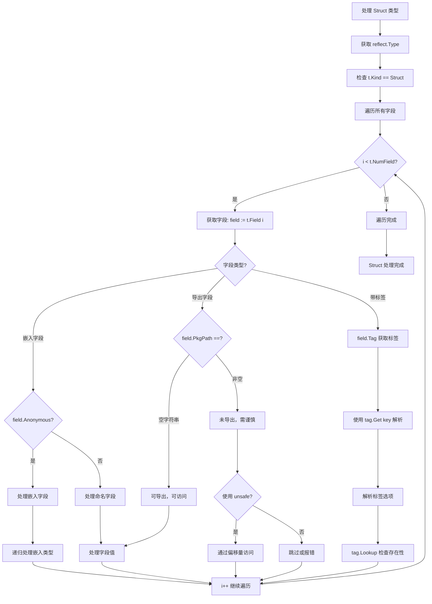

### 2.3 Map 类型处理流程

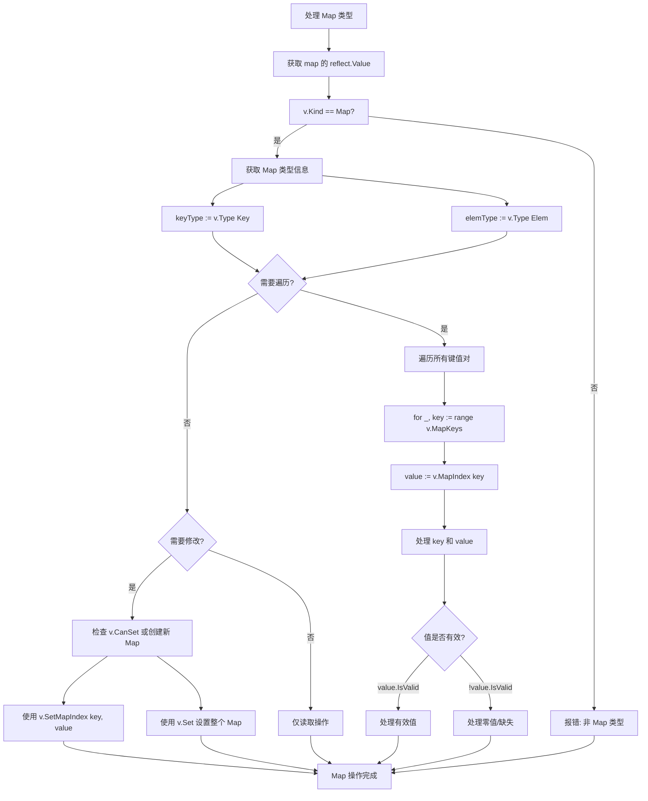

### 2.4 Slice/Array 处理流程

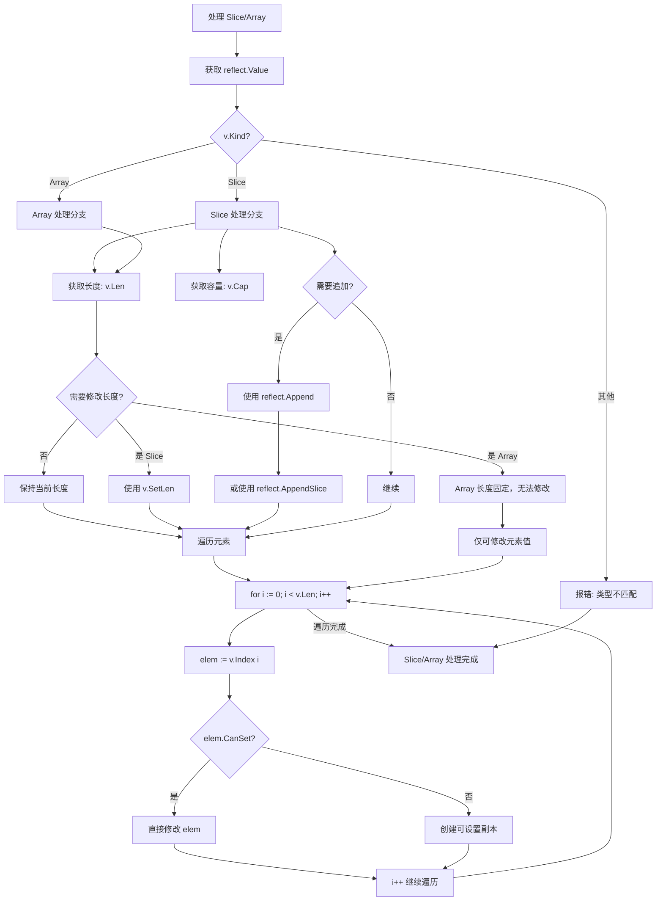

---

## 3. Value 操作决策流程

### 3.1 可设置性（CanSet）检查流程

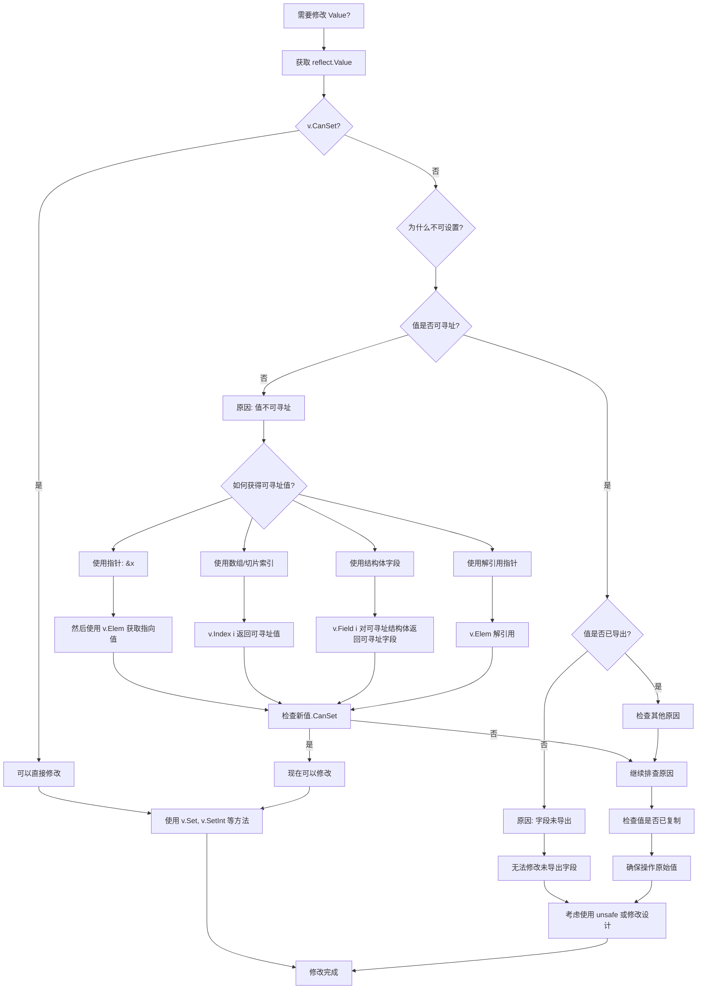

### 3.2 可寻址性（CanAddr）判断流程

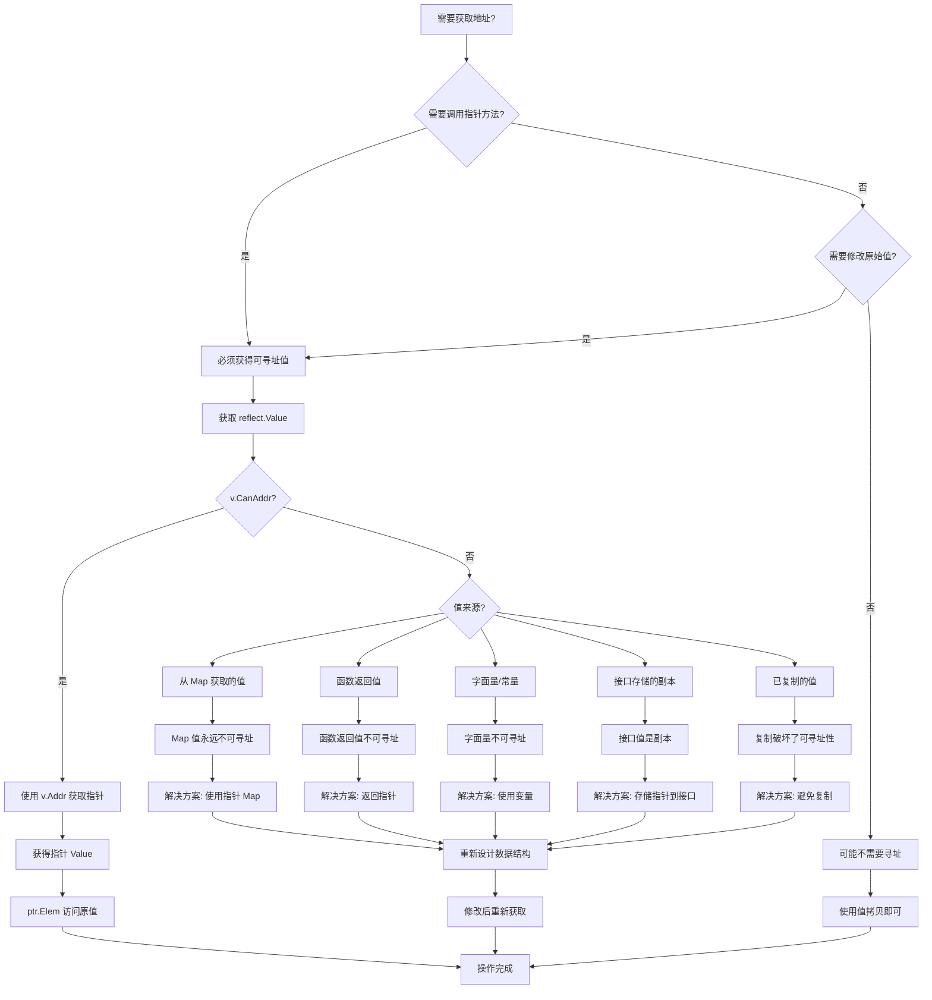

### 3.3 类型转换决策流程

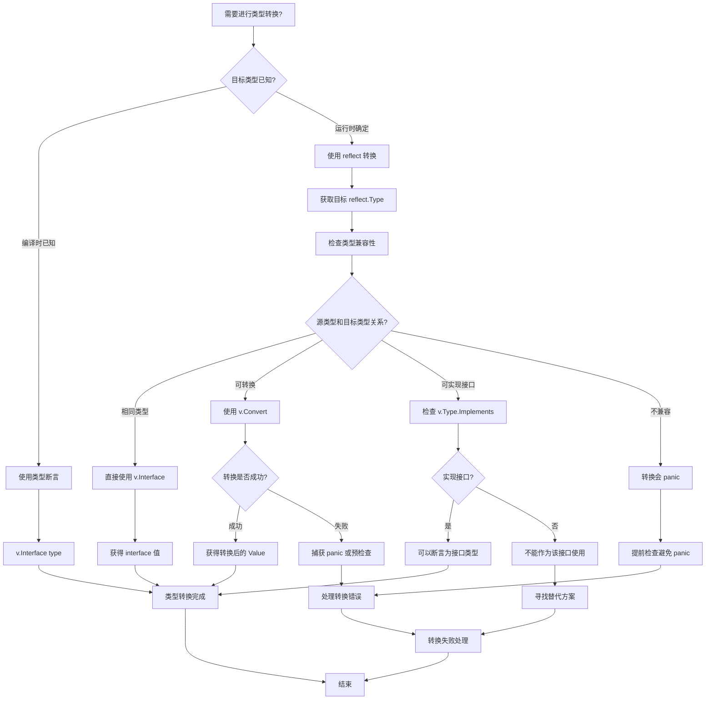

---

## 4. 方法调用决策流程

### 4.1 方法选择逻辑

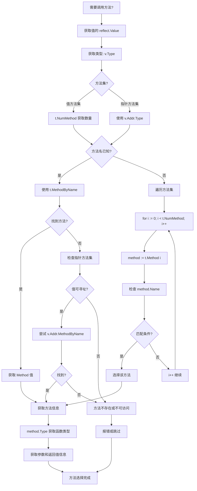

### 4.2 参数准备流程

```mermaid
flowchart TD
    A[准备调用参数] --> B[获取方法类型: method.Type]
    B --> C[mtype.NumIn 获取参数数量]

    C --> D{第一个参数是接收者?}
    D -->|是| E[接收者自动绑定]
    D -->|否| F[所有参数需手动提供]

    E --> G[实际参数数: mtype.NumIn - 1]
    F --> H[实际参数数: mtype.NumIn]

    G --> I[创建参数切片: make []reflect.Value, numArgs]
    H --> I

    I --> J[for i := 0; i < numArgs; i++]
    J --> K[获取参数类型: mtype.In i]

    K --> L{参数来源?}
    L -->|已有 Value| M[直接使用]
    L -->|原始值| N[使用 reflect.ValueOf 包装]
    L -->|需要转换| O[使用 v.Convert 转换类型]

    M --> P{类型匹配?}
    N --> P
    O --> Q{转换成功?}

    P -->|是| R[放入参数切片]
    P -->|否| S[尝试类型转换]
    Q -->|是| R
    Q -->|否| T[参数类型不匹配]

    S --> U{可转换?}
    U -->|是| V[执行转换]
    U -->|否| T

    V --> R
    R --> W[i++ 继续]
    W --> J

    T --> X[报错: 参数准备失败]
    J -->|完成| Y[参数准备完成]

    Y --> Z[检查可变参数]
    Z -->|是| AA[展开切片参数]
    Z -->|否| AB[保持参数列表]

    AA --> AC[参数准备结束]
    AB --> AC
    X --> AC
```

### 4.3 方法调用与返回值处理

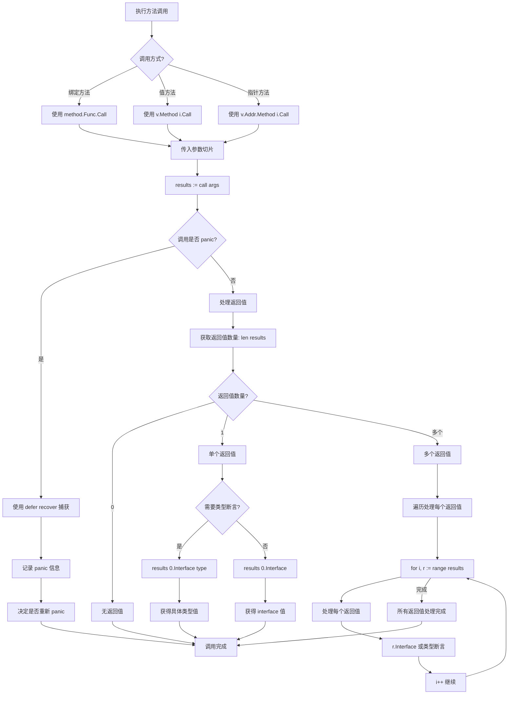

---

## 5. 最佳实践检查清单

### 5.1 使用 reflect 前的检查项

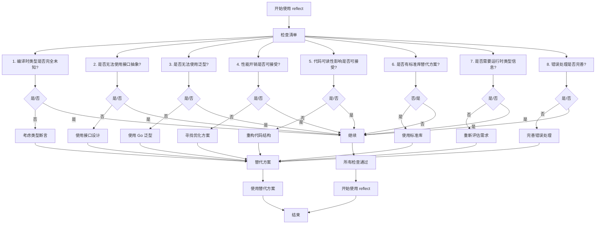

### 5.2 代码审查检查表

| 检查项 | 说明 | 通过标准 |
|--------|------|----------|
| 必要性 | 是否真的需要 reflect | 无更简单的替代方案 |
| 性能 | 是否在热点代码路径 | 已进行基准测试验证 |
| 安全 | 是否处理了所有 panic 情况 | 有 recover 或预检查 |
| 可维护 | 代码是否清晰可读 | 有详细注释说明 |
| 测试 | 是否覆盖所有类型分支 | 单元测试覆盖 > 80% |
| 文档 | 是否说明了使用原因 | 有注释解释为什么用 reflect |

---

## 6. 常见陷阱与解决方案

### 6.1 陷阱识别流程

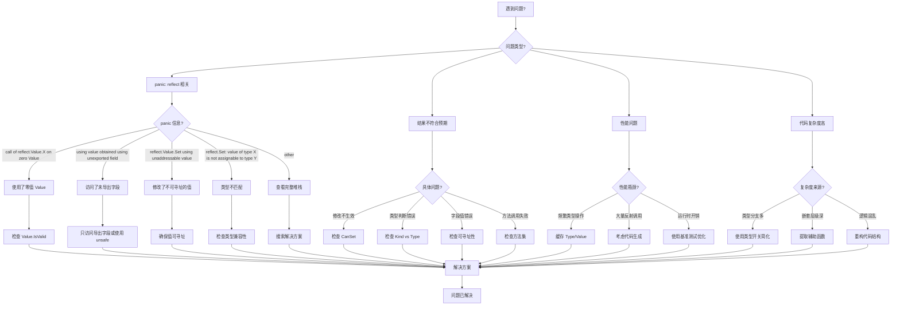

### 6.2 常见陷阱速查表

| 陷阱 | 错误示例 | 正确做法 |
|------|----------|----------|
| 零值 Value 操作 | `var v reflect.Value; v.Kind()` | 先检查 `v.IsValid()` |
| 修改不可设置值 | `v.SetInt(42)` 当 `v.CanSet() == false` | 检查 `v.CanSet()` 或获取指针 |
| 访问未导出字段 | `v.FieldByName("private")` | 只访问导出字段或使用 unsafe |
| 类型转换 panic | `v.Convert(t)` 不兼容类型 | 先检查 `v.Type().ConvertibleTo(t)` |
| 接口 nil 检查 | `v.Interface() == nil` | 使用 `v.IsNil()` 或检查 Kind |
| Map 值寻址 | `v.MapIndex(key).Addr()` | Map 值不可寻址，使用指针 Map |
| 方法集混淆 | 值 vs 指针方法集 | 理解方法集规则，必要时取地址 |

---

## 7. 快速参考决策卡

### 7.1 Value 创建决策

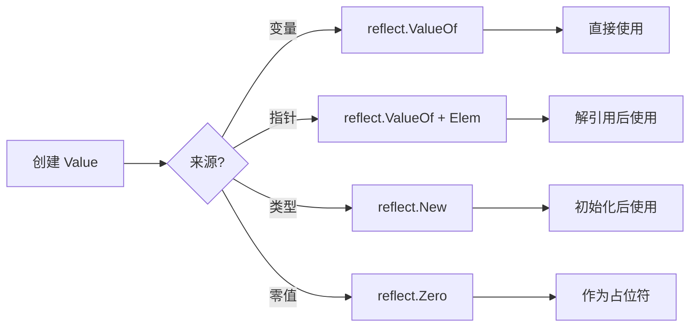

### 7.2 修改值决策

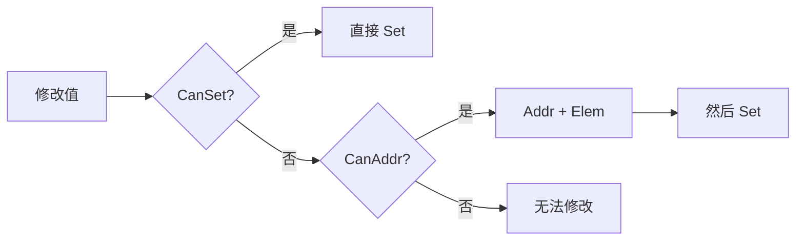

---

## 8. 总结

使用 Go reflect 包时，遵循以下核心原则：

1. **必要性原则**：只有在编译时类型完全未知且无法使用其他方式时才使用 reflect
2. **性能意识**：reflect 有显著性能开销，避免在热点代码路径使用
3. **安全第一**：始终检查 `IsValid`、`CanSet`、`CanAddr` 等前置条件
4. **类型明确**：区分 `Kind` 和 `Type`，理解它们的不同用途
5. **方法集理解**：清楚值方法集和指针方法集的区别
6. **错误处理**：使用 recover 捕获可能的 panic，或进行充分的预检查

---

*文档版本: 1.0*
*适用 Go 版本: 1.26.1*
*最后更新: 2025*
