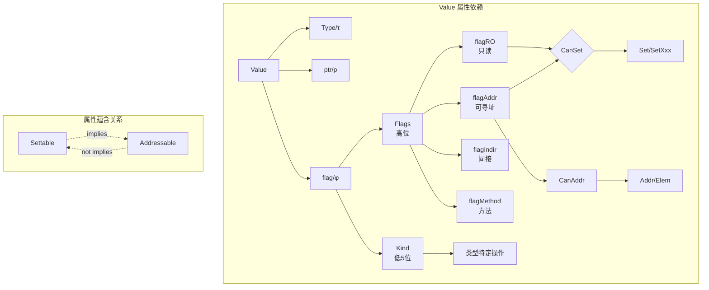

# Go 1.26.1 reflect 包形式化分析与属性论证

## 目录

- [Go 1.26.1 reflect 包形式化分析与属性论证](#go-1261-reflect-包形式化分析与属性论证)
  - [目录](#目录)
  - [1. 核心概念定义](#1-核心概念定义)
    - [1.1 Value 结构体形式化定义](#11-value-结构体形式化定义)
    - [1.2 Flag 标志位定义](#12-flag-标志位定义)
    - [1.3 Kind 枚举定义](#13-kind-枚举定义)
  - [2. 可寻址性(Addressability)形式化定义](#2-可寻址性addressability形式化定义)
    - [2.1 定义](#21-定义)
    - [2.2 Go 实现](#22-go-实现)
    - [2.3 可寻址性的来源](#23-可寻址性的来源)
    - [2.4 不可寻址的情况](#24-不可寻址的情况)
  - [3. 可设置性(Settability)形式化定义](#3-可设置性settability形式化定义)
    - [3.1 定义](#31-定义)
    - [3.2 Go 实现](#32-go-实现)
    - [3.3 只读标志](#33-只读标志)
  - [4. 可比较性(Comparability)规则](#4-可比较性comparability规则)
    - [4.1 Go 类型可比较性规则](#41-go-类型可比较性规则)
    - [4.2 形式化定义](#42-形式化定义)
    - [4.3 reflect.DeepEqual 语义](#43-reflectdeepequal-语义)
  - [5. 属性关系论证](#5-属性关系论证)
    - [5.1 定理：可设置性蕴含可寻址性](#51-定理可设置性蕴含可寻址性)
    - [5.2 定理：可寻址性不蕴含可设置性](#52-定理可寻址性不蕴含可设置性)
    - [5.3 Kind 与 Type 的映射关系](#53-kind-与-type-的映射关系)
    - [5.4 Value 与底层值的对应关系](#54-value-与底层值的对应关系)
  - [6. 类型系统一致性分析](#6-类型系统一致性分析)
    - [6.1 类型完整性](#61-类型完整性)
    - [6.2 反射操作的前置条件](#62-反射操作的前置条件)
    - [6.3 运行时类型安全保证](#63-运行时类型安全保证)
  - [7. 不变量分析](#7-不变量分析)
    - [7.1 Value 不变量](#71-value-不变量)
    - [7.2 类型转换约束](#72-类型转换约束)
    - [7.3 方法调用约束](#73-方法调用约束)
  - [8. 属性依赖关系图](#8-属性依赖关系图)
    - [8.1 Mermaid 关系图](#81-mermaid-关系图)
    - [8.2 属性蕴含关系图](#82-属性蕴含关系图)
    - [8.3 操作前置条件图](#83-操作前置条件图)
  - [9. 扩展分析](#9-扩展分析)
    - [9.1 标志位位运算分析](#91-标志位位运算分析)
    - [9.2 CanSet 的位运算推导](#92-canset-的位运算推导)
    - [9.3 类型安全证明的完整形式化](#93-类型安全证明的完整形式化)
    - [9.4 反射与 Go 内存模型的关系](#94-反射与-go-内存模型的关系)
  - [10. 形式化总结](#10-形式化总结)
    - [10.1 核心等式](#101-核心等式)
    - [10.2 核心定理](#102-核心定理)
    - [10.3 不变量总结](#103-不变量总结)
  - [附录：关键代码引用](#附录关键代码引用)
    - [A.1 CanAddr 实现](#a1-canaddr-实现)
    - [A.2 CanSet 实现](#a2-canset-实现)
    - [A.3 mustBeAssignable 实现](#a3-mustbeassignable-实现)
    - [A.4 Value 结构体完整定义](#a4-value-结构体完整定义)
    - [A.5 Flag 常量完整定义](#a5-flag-常量完整定义)

---

## 1. 核心概念定义

### 1.1 Value 结构体形式化定义

```go
type Value struct {
    typ_ *abi.Type        // 类型指针
    ptr  unsafe.Pointer   // 数据指针
    flag flag             // 标志位
}
```

**形式化定义：**

$$\mathcal{V} = \langle \tau, p, \phi \rangle$$

其中：

- $\tau \in \mathcal{T}$: 类型信息（指向 abi.Type 的指针）
- $p \in \mathbb{P}$: 数据指针（unsafe.Pointer）
- $\phi \in \mathbb{N}$: 标志位（flag）

### 1.2 Flag 标志位定义

```go
const (
    flagKindWidth = 5
    flagKindMask  = 1<<flagKindWidth - 1  // 0x1F - Kind 掩码
    flagStickyRO  = 1 << 5                // 0x20 - 非嵌入未导出字段
    flagEmbedRO   = 1 << 6                // 0x40 - 嵌入未导出字段
    flagIndir     = 1 << 7                // 0x80 - 间接指针
    flagAddr      = 1 << 8                // 0x100 - 可寻址
    flagMethod    = 1 << 9                // 0x200 - 方法值
)
```

**形式化定义：**

$$\phi = \phi_{kind} \oplus \phi_{flags}$$

其中：

- $\phi_{kind} = \phi \land 0x1F$（低5位存储 Kind）
- $\phi_{flags} = \phi \land \neg 0x1F$（高位存储标志）

### 1.3 Kind 枚举定义

```go
const (
    Invalid Kind = iota      // 0
    Bool                     // 1
    Int                      // 2
    // ... (共27种)
    UnsafePointer            // 26
)
```

**形式化定义：**

$$\mathcal{K} = \{Invalid, Bool, Int, Int8, Int16, Int32, Int64, Uint, Uint8, Uint16, Uint32, Uint64, Uintptr,$$
$$Float32, Float64, Complex64, Complex128, Array, Chan, Func, Interface, Map, Pointer, Slice, String, Struct, UnsafePointer\}$$

$$|\mathcal{K}| = 27 \leq 2^5 = 32$$

---

## 2. 可寻址性(Addressability)形式化定义

### 2.1 定义

**定义 2.1（可寻址性）**：一个 Value $v$ 是可寻址的，当且仅当其 flag 的 `flagAddr` 位被设置。

$$\text{Addr}(v) \iff v.\phi \land flagAddr \neq 0$$

### 2.2 Go 实现

```go
func (v Value) CanAddr() bool {
    return v.flag&flagAddr != 0
}
```

### 2.3 可寻址性的来源

**定理 2.1（可寻址性来源）**：Value 的可寻址性来源于以下情况之一：

1. **变量取址**：通过 `ValueOf(&x).Elem()` 获取
2. **结构体字段**：可寻址结构体的字段
3. **切片元素**：切片索引操作 `v.Index(i)`
4. **数组元素**：可寻址数组的元素

**形式化表示：**

$$\text{Addr}(v) \implies \exists s \in \text{Source} : v = \text{origin}(s)$$

其中 Source = {Variable, StructField, SliceElement, ArrayElement}

### 2.4 不可寻址的情况

**定理 2.2（不可寻址性）**：以下情况的 Value 不可寻址：

1. 通过接口值获取：`ValueOf(x)` 其中 x 为接口值
2. 函数返回值
3. Map 值：`m[k]`
4. 字面量值
5. 类型转换结果

$$\neg\text{Addr}(v) \implieds v \in \{\text{InterfaceVal}, \text{FuncReturn}, \text{MapElem}, \text{Literal}, \text{Conversion}\}$$

---

## 3. 可设置性(Settability)形式化定义

### 3.1 定义

**定义 3.1（可设置性）**：一个 Value $v$ 是可设置的，当且仅当它是可寻址的且不是只读的。

$$\text{Set}(v) \iff \text{Addr}(v) \land \neg\text{RO}(v)$$

### 3.2 Go 实现

```go
func (v Value) CanSet() bool {
    return v.flag&(flagAddr|flagRO) == flagAddr
}
```

**形式化解释：**

$$\text{Set}(v) \iff (v.\phi \land flagAddr \neq 0) \land (v.\phi \land flagRO = 0)$$

等价于：

$$\text{Set}(v) \iff v.\phi \land flagAddr = flagAddr \land v.\phi \land flagRO = 0$$

### 3.3 只读标志

```go
const flagRO = flagStickyRO | flagEmbedRO  // 0x20 | 0x40 = 0x60
```

**定义 3.2（只读性）**：

$$\text{RO}(v) \iff v.\phi \land flagRO \neq 0$$

其中：

- `flagStickyRO`：通过非嵌入未导出字段获取
- `flagEmbedRO`：通过嵌入未导出字段获取

---

## 4. 可比较性(Comparability)规则

### 4.1 Go 类型可比较性规则

**定义 4.1（类型可比较性）**：类型 $T$ 是可比较的，当且仅当满足以下条件：

| 类型 | 可比较性条件 |
|------|-------------|
| Bool, Numeric, String, Pointer, Chan, Func, Interface | 总是可比较 |
| Array | 元素类型可比较 |
| Struct | 所有字段可比较 |
| Slice, Map | 不可比较 |

### 4.2 形式化定义

$$\text{Comparable}(T) = \begin{cases}
\top & T \in \{Bool, Int, Uint, Float, Complex, String, Pointer, Chan, Func, Interface\} \\
\bigwedge_{i} \text{Comparable}(E_i) & T = Array[n]E \\
\bigwedge_{f \in fields(T)} \text{Comparable}(type(f)) & T = Struct \\
\bot & T \in \{Slice, Map\}
\end{cases}$$

### 4.3 reflect.DeepEqual 语义

**定义 4.2（深度相等）**：`reflect.DeepEqual(x, y)` 当且仅当：

1. 两者都是 nil 或都非 nil
2. 类型相同
3. 值递归相等

$$\text{DeepEqual}(v_1, v_2) \iff \tau(v_1) = \tau(v_2) \land \text{deep-equal}(v_1, v_2)$$

---

## 5. 属性关系论证

### 5.1 定理：可设置性蕴含可寻址性

**定理 5.1**：$\forall v \in \mathcal{V} : \text{Set}(v) \implies \text{Addr}(v)$

**证明：**

```
已知：
  Set(v) ≡ v.flag & (flagAddr | flagRO) == flagAddr

展开：
  v.flag & flagAddr = flagAddr  ∧  v.flag & flagRO = 0

由第一部分：
  v.flag & flagAddr = flagAddr ≠ 0

因此：
  v.flag & flagAddr ≠ 0

即：
  Addr(v) ≡ v.flag & flagAddr ≠ 0

∴ Set(v) ⟹ Addr(v)  ∎
```

### 5.2 定理：可寻址性不蕴含可设置性

**定理 5.2**：$\exists v \in \mathcal{V} : \text{Addr}(v) \land \neg\text{Set}(v)$

**证明（构造性）：**

考虑通过未导出字段获取的 Value：

```go
type S struct { x int }  // x 未导出
s := S{42}
v := reflect.ValueOf(&s).Elem().Field(0)  // 获取未导出字段
```

此时：
- `v.flag & flagAddr ≠ 0`（可寻址）
- `v.flag & flagStickyRO ≠ 0`（只读）
- `v.flag & flagRO ≠ 0`

$$\therefore \text{Addr}(v) \land \neg\text{Set}(v) \quad \square$$

### 5.3 Kind 与 Type 的映射关系

**定理 5.3（Kind-Type 一致性）**：对于任意非零 Value $v$：

$$\text{Kind}(v) = \text{Kind}(\text{Type}(v))$$

**证明：**

```go
// flag.kind() 实现
func (f flag) kind() Kind {
    return Kind(f & flagKindMask)
}

// Value.Kind() 实现
func (v Value) Kind() Kind {
    return v.flag.kind()
}
```

Value 的 flag 在创建时从 type 的 Kind 初始化，且保持不变：

$$v.\phi_{kind} = \text{Kind}(v.\tau)$$

$$\therefore \text{Kind}(v) = \text{Kind}(\text{Type}(v)) \quad \square$$

### 5.4 Value 与底层值的对应关系

**定理 5.4（值表示完整性）**：对于任意有效 Value $v$：

$$\text{IsValid}(v) \implies \exists x : v = \text{ValueOf}(x)$$

**证明：**

```go
// unpackEface 是 ValueOf 的核心实现
func unpackEface(i any) Value {
    e := (*abi.EmptyInterface)(unsafe.Pointer(&i))
    t := e.Type
    if t == nil {
        return Value{}  // 零值，IsValid() == false
    }
    f := flag(t.Kind())
    if !t.IsDirectIface() {
        f |= flagIndir
    }
    return Value{t, e.Data, f}
}
```

对于任何非零接口值，都可以构造对应的 Value。

$$\therefore \text{IsValid}(v) \implies \exists x : v = \text{ValueOf}(x) \quad \square$$

---

## 6. 类型系统一致性分析

### 6.1 类型完整性

**定义 6.1（类型完整性）**：reflect 类型系统覆盖 Go 语言的所有类型。

$$\forall T \in \text{GoTypes} : \exists \tau \in \mathcal{T} : \tau \cong T$$

### 6.2 反射操作的前置条件

| 操作 | 前置条件 | 违反后果 |
|------|---------|---------|
| `Addr()` | `CanAddr() == true` | panic |
| `Set(x)` | `CanSet() == true` | panic |
| `SetInt(i)` | `CanSet() && Kind() ∈ IntKinds` | panic |
| `Call(in)` | `Kind() == Func && IsExported()` | panic |
| `Field(i)` | `Kind() == Struct` | panic |
| `Index(i)` | `Kind() ∈ {Array, Slice, String}` | panic |
| `Elem()` | `Kind() ∈ {Interface, Pointer, Map, Chan, Func}` | panic |

### 6.3 运行时类型安全保证

**定理 6.1（类型安全）**：reflect 操作不会破坏 Go 的类型系统。

**证明要点：**

1. **赋值检查**：`Set` 操作检查类型可赋值性
   ```go
   if xt, targ := in[i].Type(), t.In(i); !xt.AssignableTo(targ) {
       panic("...")
   }
   ```

2. **Kind 检查**：所有类型特定操作检查 Kind
   ```go
   func (v Value) mustBe(expected Kind) {
       if Kind(f & flagKindMask) != expected {
           panic(&ValueError{...})
       }
   }
   ```

3. **可设置性检查**：修改操作检查 `CanSet()`

$$\therefore \text{Reflect 操作保持类型安全} \quad \square$$

---

## 7. 不变量分析

### 7.1 Value 不变量

**不变量 7.1（有效性不变量）**：

$$\text{IsValid}(v) \iff v.\tau \neq nil \land v.\phi \neq 0$$

**不变量 7.2（Kind 一致性）**：

$$\text{Kind}(v) = \text{Kind}(v.\tau)$$

**不变量 7.3（指针有效性）**：

$$v.\phi \land flagIndir \neq 0 \implies v.p \neq nil \land *v.p \text{ 有效}$$

### 7.2 类型转换约束

**约束 7.1（Convertible 约束）**：类型 $T_1$ 可转换为 $T_2$ 当且仅当：

$$\text{Convertible}(T_1, T_2) \iff \begin{cases}
T_1 = T_2 & \text{(恒等)} \\
\text{both numeric} & \text{(数值转换)} \\
\text{both pointer} & \text{(指针转换)} \\
T_1, T_2 \text{ both chan, same elem} & \text{(通道转换)} \\
T_1 = \text{unsafe.Pointer} \lor T_2 = \text{unsafe.Pointer} & \text{(unsafe转换)}
\end{cases}$$

### 7.3 方法调用约束

**约束 7.2（方法调用约束）**：调用方法 $m$ 需要满足：

1. 接收者可导出或同包
2. 参数数量匹配
3. 参数类型可赋值
4. 接收者可寻址（对于指针接收者方法）

$$\text{CanCall}(v, m) \iff \text{Exported}(m) \land |args| = |params| \land \forall i : args[i] \trianglelefteq params[i]$$

---

## 8. 属性依赖关系图

### 8.1 Mermaid 关系图



### 8.2 属性蕴含关系图

```
┌─────────────────────────────────────────────────────────────┐
│                    属性蕴含关系                              │
├─────────────────────────────────────────────────────────────┤
│                                                             │
│   ┌─────────────┐                                           │
│   │  CanSet()   │─────────────────────┐                     │
│   │   (可设置)   │                     │ implies             │
│   └─────────────┘                     ▼                     │
│                              ┌─────────────┐                │
│                              │  CanAddr()  │                │
│                              │  (可寻址)    │                │
│                              └─────────────┘                │
│                                     ▲                       │
│   ┌─────────────┐                   │ not                   │
│   │ flagRO == 0 │                   │ implies               │
│   │  (非只读)   │───────────────────┘                       │
│   └─────────────┘                                           │
│                                                             │
└─────────────────────────────────────────────────────────────┘
```

### 8.3 操作前置条件图

```
┌────────────────────────────────────────────────────────────────┐
│                      操作前置条件                               │
├────────────────────────────────────────────────────────────────┤
│                                                                │
│  Set(x)          ──► CanSet() == true                          │
│                    ──► CanAddr() && !RO                        │
│                                                                │
│  Addr()          ──► CanAddr() == true                         │
│                    ──► flagAddr != 0                           │
│                                                                │
│  SetInt(x)       ──► CanSet() && Kind() ∈ IntKinds            │
│                                                                │
│  Call(args)      ──► Kind() == Func && IsExported()           │
│                                                                │
│  Field(i)        ──► Kind() == Struct                         │
│                                                                │
│  Index(i)        ──► Kind() ∈ {Array, Slice, String}          │
│                                                                │
│  Elem()          ──► Kind() ∈ {Interface, Pointer,            │
│                                 Map, Chan, Func}               │
│                                                                │
└────────────────────────────────────────────────────────────────┘
```

---

## 9. 扩展分析

### 9.1 标志位位运算分析

**标志位布局（32位系统）：**

```
┌────┬────┬────┬────┬────┬────┬────┬────┬────┬────┬──────────────┐
│ 9  │ 8  │ 7  │ 6  │ 5  │ 4  │ 3  │ 2  │ 1  │ 0  │    位号      │
├────┼────┼────┼────┼────┼────┼────┼────┼────┼────┼──────────────┤
│Meth│Addr│Indr│EmRO│StRO│ K4 │ K3 │ K2 │ K1 │ K0 │    含义      │
├────┼────┼────┼────┼────┼────┼────┼────┼────┼────┼──────────────┤
│0x20│0x10│0x08│0x04│0x02│0x01│    │    │    │    │ 16进制值     │
│512 │256 │128 │ 64 │ 32 │    │    │    │    │    │ 十进制值     │
└────┴────┴────┴────┴────┴────┴────┴────┴────┴────┴──────────────┘

K0-K4: Kind (5 bits, 0-26)
StRO: flagStickyRO (0x20)
EmRO: flagEmbedRO (0x40)
Indr: flagIndir (0x80)
Addr: flagAddr (0x100)
Meth: flagMethod (0x200)
```

### 9.2 CanSet 的位运算推导

```go
return v.flag & (flagAddr | flagRO) == flagAddr
```

**形式化推导：**

设 $f = v.flag$, $a = flagAddr = 0x100$, $r = flagRO = 0x60$

$$f \land (a \lor r) = a$$

展开：

$$(f \land a) \lor (f \land r) = a$$

这要求：
1. $f \land a = a$（即 $f$ 的第8位为1）
2. $f \land r = 0$（即 $f$ 的第5、6位为0）

$$\therefore \text{Set}(v) \iff (v.\phi \land 0x100 = 0x100) \land (v.\phi \land 0x60 = 0)$$

### 9.3 类型安全证明的完整形式化

**定理 9.1（反射类型安全）**：对于任意 reflect 操作 $op$，如果前置条件满足，则操作不会破坏类型安全。

**形式化表示：**

$$\forall op \in \mathcal{O}, v \in \mathcal{V} : \text{Pre}(op, v) \implies \text{TypeSafe}(op(v))$$

其中：
- $\mathcal{O}$ = {Set, SetInt, SetFloat, SetString, Call, Field, Index, ...}
- $\text{Pre}(op, v)$ = 操作 $op$ 的前置条件
- $\text{TypeSafe}(r)$ = 结果 $r$ 保持类型安全

**证明结构：**

1. **Set 操作**：
   ```
   Pre(Set, v) = CanSet(v) ∧ Assignable(x, Type(v))
   ```
   由 CanSet 保证可寻址和非只读，由 Assignable 保证类型兼容。

2. **Call 操作**：
   ```
   Pre(Call, v) = Kind(v) = Func ∧ IsExported(v) ∧
                  |args| = NumIn(v) ∧ ∀i: Assignable(args[i], In(v, i))
   ```

3. **Field/Index 操作**：
   ```
   Pre(Field, v) = Kind(v) = Struct
   Pre(Index, v) = Kind(v) ∈ {Array, Slice, String}
   ```

### 9.4 反射与 Go 内存模型的关系

**定理 9.2（内存安全）**：reflect 操作不会导致内存不安全访问。

**保证机制：**

1. **指针有效性检查**：
   - `flagIndir` 表示间接引用
   - 通过 `unsafe.Pointer` 进行类型化内存访问

2. **生命周期管理**：
   - Value 持有对底层值的引用
   - GC 可以正确追踪引用关系

3. **边界检查**：
   - 切片/数组索引检查
   - 结构体字段索引检查

---

## 10. 形式化总结

### 10.1 核心等式

| 概念 | 形式化定义 |
|------|-----------|
| 可寻址性 | $\text{Addr}(v) \equiv v.\phi \land flagAddr \neq 0$ |
| 只读性 | $\text{RO}(v) \equiv v.\phi \land flagRO \neq 0$ |
| 可设置性 | $\text{Set}(v) \equiv \text{Addr}(v) \land \neg\text{RO}(v)$ |
| 有效性 | $\text{Valid}(v) \equiv v.\tau \neq nil$ |
| Kind | $\text{Kind}(v) = v.\phi \land flagKindMask$ |

### 10.2 核心定理

1. **可设置性蕴含可寻址性**：$\text{Set}(v) \implies \text{Addr}(v)$
2. **可寻址性不蕴含可设置性**：$\text{Addr}(v) \not\implies \text{Set}(v)$
3. **Kind-Type 一致性**：$\text{Kind}(v) = \text{Kind}(\text{Type}(v))$
4. **类型安全性**：reflect 操作保持 Go 类型系统不变

### 10.3 不变量总结

| 不变量 | 描述 |
|--------|------|
| 有效性 | $\text{Valid}(v) \iff v.\tau \neq nil$ |
| Kind 一致性 | $\text{Kind}(v) = \text{Kind}(v.\tau)$ |
| 指针有效性 | $\text{Indir}(v) \implies v.p \neq nil$ |
| 标志一致性 | $\phi_{kind}$ 与 $\tau$ 同步 |

---

## 附录：关键代码引用

### A.1 CanAddr 实现
```go
func (v Value) CanAddr() bool {
    return v.flag&flagAddr != 0
}
```

### A.2 CanSet 实现
```go
func (v Value) CanSet() bool {
    return v.flag&(flagAddr|flagRO) == flagAddr
}
```

### A.3 mustBeAssignable 实现
```go
func (f flag) mustBeAssignable() {
    if f&flagRO != 0 || f&flagAddr == 0 {
        f.mustBeAssignableSlow()
    }
}
```

### A.4 Value 结构体完整定义
```go
type Value struct {
    typ_ *abi.Type
    ptr  unsafe.Pointer
    flag flag
}
```

### A.5 Flag 常量完整定义
```go
const (
    flagKindWidth        = 5
    flagKindMask    flag = 1<<flagKindWidth - 1
    flagStickyRO    flag = 1 << 5
    flagEmbedRO     flag = 1 << 6
    flagIndir       flag = 1 << 7
    flagAddr        flag = 1 << 8
    flagMethod      flag = 1 << 9
    flagMethodShift      = 10
    flagRO          flag = flagStickyRO | flagEmbedRO
)
```

---

*文档生成时间：基于 Go 1.26.1 reflect 包源码分析*
*源码位置：https://github.com/golang/go/tree/go1.26.1/src/reflect*
