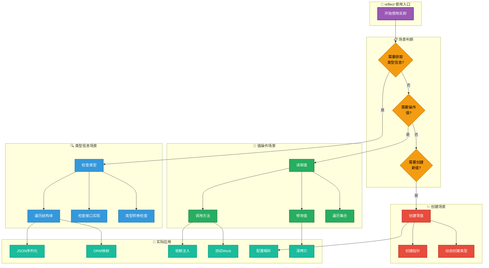
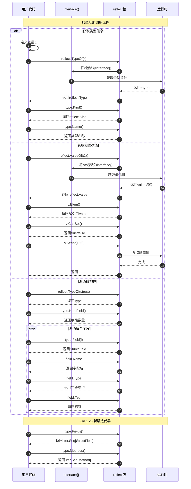
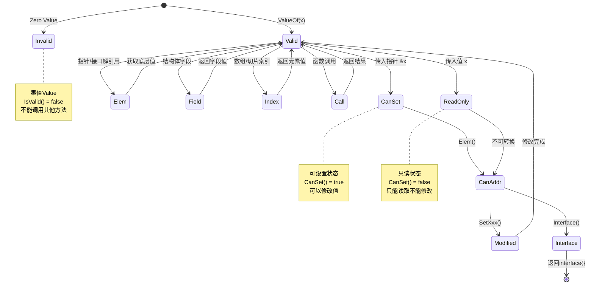
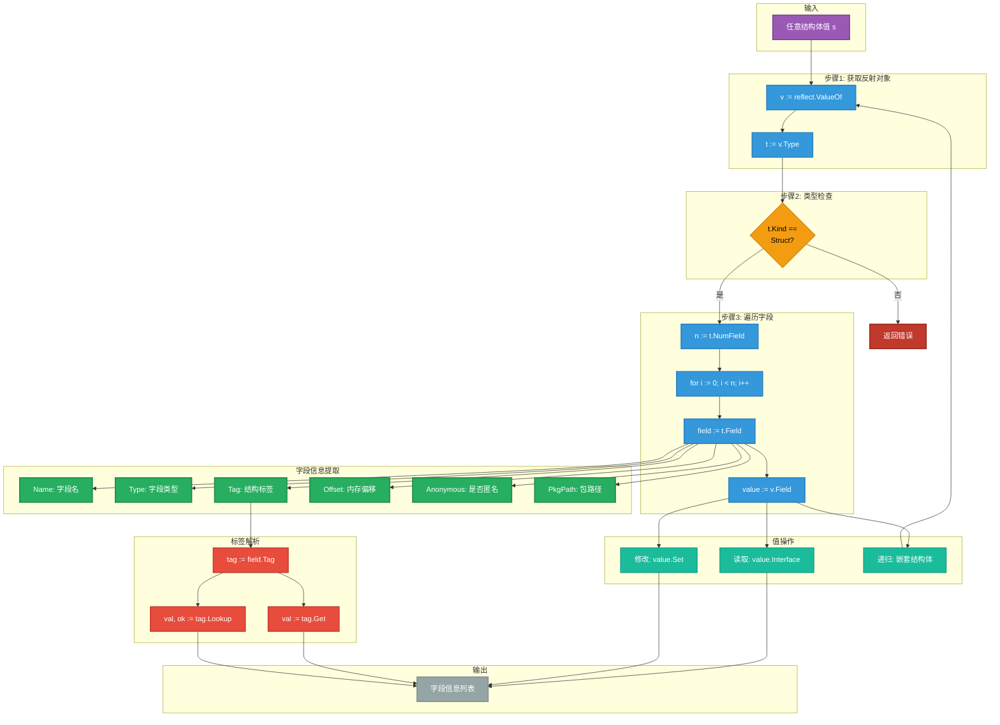
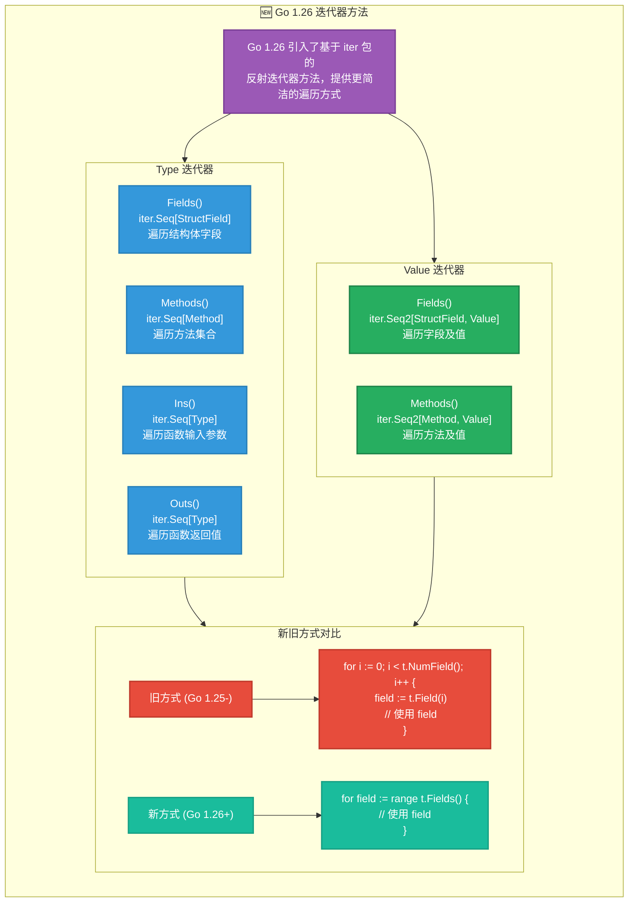

# Go 1.26.1 reflect 包全面可视化指南

> 本文档使用 Mermaid 语法创建，详细展示了 Go reflect 包的核心概念、类型系统和使用场景。

---

## 📊 图表阅读指南

### 图例说明

- **实线箭头 (→)**：表示依赖关系或调用方向
- **虚线箭头 (- -→)**：表示转换关系
- **双向箭头 (↔)**：表示双向关联
- **包含关系**：使用嵌套结构表示
- **颜色编码**：
  - 🔵 蓝色：核心类型/接口
  - 🟢 绿色：函数/方法
  - 🟡 黄色：类型分类
  - 🟠 橙色：使用场景

---

## 1. reflect 包整体思维导图

```mermaid
mindmap
  root((reflect 包))
    核心类型
      Type接口
        类型信息获取
        Name() string
        Kind() Kind
        Size() uintptr
        String() string
        Implements(Type) bool
        AssignableTo(Type) bool
        ConvertibleTo(Type) bool
        Comparable() bool
        复合类型方法
        NumField() int
        Field(int) StructField
        FieldByName(string) StructField
        NumMethod() int
        Method(int) Method
        MethodByName(string) Method
        Elem() Type
        Key() Type
        Len() int
        新增Go1.26迭代器
        Fields() iter.Seq[StructField]
        Methods() iter.Seq[Method]
        Ins() iter.Seq[Type]
        Outs() iter.Seq[Type]
      Value结构体
        值操作
        Type() Type
        Kind() Kind
        IsValid() bool
        IsZero() bool
        CanSet() bool
        IsNil() bool
        Interface() interface{}
        String() string
        基本类型获取
        Bool() bool
        Int() int64
        Uint() uint64
        Float() float64
        Complex() complex128
        String() string
        Bytes() []byte
        Pointer() uintptr
        基本类型设置
        Set(Value)
        SetBool(bool)
        SetInt(int64)
        SetUint(uint64)
        SetFloat(float64)
        SetString(string)
        复合类型操作
        Len() int
        Cap() int
        Index(int) Value
        MapIndex(Value) Value
        MapKeys() []Value
        Field(int) Value
        FieldByName(string) Value
        Elem() Value
        调用操作
        Call([]Value) []Value
        CallSlice([]Value) []Value
        新增Go1.26迭代器
        Fields() iter.Seq2[StructField, Value]
        Methods() iter.Seq2[Method, Value]
      Kind枚举
        基础类型
        Invalid
        Bool
        Int系列
        Uint系列
        Float系列
        Complex系列
        String
        Uintptr
        复合类型
        Array
        Slice
        Map
        Chan
        Func
        Ptr
        Struct
        Interface
        UnsafePointer
    核心函数
      类型相关
        TypeOf(interface{}) Type
        TypeFor[T]() Type
        PtrTo(Type) Type
        SliceOf(Type) Type
        MapOf(Type, Type) Type
        ChanOf(ChanDir, Type) Type
        FuncOf([]Type, []Type, bool) Type
        StructOf([]StructField) Type
        ArrayOf(int, Type) Type
      值相关
        ValueOf(interface{}) Value
        Zero(Type) Value
        New(Type) Value
        NewAt(Type, unsafe.Pointer) Value
        Indirect(Value) Value
        Append(Value, ...Value) Value
        AppendSlice(Value, Value) Value
        Copy(dst, src Value) int
        DeepEqual(interface{}, interface{}) bool
    辅助类型
      StructField
        Name string
        Type Type
        Tag StructTag
        Offset uintptr
        Index []int
        Anonymous bool
      StructTag
        Get(key string) string
        Lookup(key string) (string, bool)
      Method
        Name string
        Type Type
        Func Value
        Index int
      ChanDir
        SendDir
        RecvDir
        BothDir
    使用场景
      序列化/反序列化
        JSON处理
        XML处理
        YAML处理
        数据库ORM
      依赖注入
        自动装配
        接口绑定
        生命周期管理
      测试框架
        Mock生成
        断言库
        测试数据生成
      配置解析
        配置文件映射
        环境变量绑定
        命令行参数
      通用工具
        深拷贝
        对象比较
        类型转换
        动态调用
```

---

## 2. 核心概念关系图

```mermaid
graph TB
    subgraph 接口层["🎯 接口层 (Interface)"]
        I[interface{}<br/>空接口存储<br/>类型+值+方法集]
    end

    subgraph 反射核心["🔵 反射核心类型"]
        T[reflect.Type<br/>接口类型<br/>描述类型信息]
        V[reflect.Value<br/>结构体类型<br/>描述值信息]
        K[reflect.Kind<br/>枚举类型<br/>类型分类]
    end

    subgraph 创建函数["🟢 创建函数"]
        TF[TypeOf<br/>从interface{}<br/>获取Type]
        VF[ValueOf<br/>从interface{}<br/>获取Value]
        TFOR[TypeFor[T]<br/>泛型获取Type<br/>Go 1.22+]
        ZE[Zero<br/>创建零值]
        NE[New<br/>创建指针值]
    end

    subgraph 类型操作["📋 Type 操作方法"]
        TM1[Name/Kind/Size<br/>基础信息]
        TM2[NumField/Field<br/>结构体操作]
        TM3[NumMethod/Method<br/>方法操作]
        TM4[Elem/Key/Len<br/>复合类型操作]
        TM5[Implements<br/>AssignableTo<br/>类型关系]
    end

    subgraph 值操作["💎 Value 操作方法"]
        VM1[Type/Kind/IsValid<br/>基础信息]
        VM2[Bool/Int/Float<br/>基本类型获取]
        VM3[Set/SetInt/SetFloat<br/>基本类型设置]
        VM4[Field/Index/MapIndex<br/>复合类型访问]
        VM5[Call/CallSlice<br/>函数调用]
        VM6[Elem/Addr/Interface<br/>指针转换]
    end

    subgraph 辅助类型["🔧 辅助类型"]
        SF[StructField<br/>结构体字段]
        ST[StructTag<br/>标签解析]
        ME[Method<br/>方法信息]
        CD[ChanDir<br/>通道方向]
    end

    %% 关系连接
    I -->|TypeOf| TF
    I -->|ValueOf| VF
    TF -->|返回| T
    VF -->|返回| V
    TFOR -->|返回| T
    ZE -->|返回| V
    NE -->|返回| V

    T -->|Kind()| K
    V -->|Type()| T
    V -->|Kind()| K

    T -.->|使用| TM1
    T -.->|使用| TM2
    T -.->|使用| TM3
    T -.->|使用| TM4
    T -.->|使用| TM5

    V -.->|使用| VM1
    V -.->|使用| VM2
    V -.->|使用| VM3
    V -.->|使用| VM4
    V -.->|使用| VM5
    V -.->|使用| VM6

    T -.->|返回| SF
    T -.->|返回| ME
    SF -.->|包含| ST
    T -.->|使用| CD

    %% 样式
    classDef core fill:#4A90D9,stroke:#2E5A8C,stroke-width:2px,color:#fff
    classDef func fill:#5CB85C,stroke:#3D7A3D,stroke-width:2px,color:#fff
    classDef kind fill:#F0AD4E,stroke:#C48A3B,stroke-width:2px,color:#000
    classDef helper fill:#D9534F,stroke:#A73A33,stroke-width:2px,color:#fff
    classDef interface fill:#9B59B6,stroke:#7B3F96,stroke-width:2px,color:#fff

    class T,V core
    class TF,VF,TFOR,ZE,NE func
    class K kind
    class SF,ST,ME,CD helper
    class I interface
```

---

## 3. Type-Value-Kind 三角关系图

```mermaid
graph LR
    subgraph 三角关系["🔺 Type-Value-Kind 核心三角"]
        direction TB

        T["🔵 reflect.Type<br/><br/>• 描述类型的元数据<br/>• 接口定义<br/>• 不可变<br/><br/>方法示例:<br/>- Name()<br/>- Kind()<br/>- Size()<br/>- String()"]

        V["💎 reflect.Value<br/><br/>• 描述具体的值<br/>• 结构体实现<br/>• 可修改(CanSet)<br/><br/>方法示例:<br/>- Type()<br/>- Kind()<br/>- Interface()<br/>- SetXxx()"]

        K["🟡 reflect.Kind<br/><br/>• 类型的底层分类<br/>• uint 枚举<br/>• 29种常量<br/><br/>示例:<br/>- Int, String<br/>- Struct, Slice<br/>- Map, Func"]
    end

    T <-->|"Type.Kind()<br/>获取分类"| K
    V <-->|"Value.Type()<br/>获取类型"| T
    V <-->|"Value.Kind()<br/>获取分类"| K

    subgraph 创建路径["创建路径"]
        I[interface{}] -->|TypeOf| T
        I -->|ValueOf| V
        TG[泛型T] -->|TypeFor[T]| T
    end

    subgraph 转换路径["转换路径"]
        V -->|Interface()| I2[interface{}]
        V -->|Elem()| V2[解引用值]
        T -->|Elem()| T2[元素类型]
    end

    classDef typeClass fill:#4A90D9,stroke:#2E5A8C,stroke-width:3px,color:#fff
    classDef valueClass fill:#5CB85C,stroke:#3D7A3D,stroke-width:3px,color:#fff
    classDef kindClass fill:#F0AD4E,stroke:#C48A3B,stroke-width:3px,color:#000
    classDef pathClass fill:#95A5A6,stroke:#7F8C8D,stroke-width:1px,color:#fff

    class T typeClass
    class V valueClass
    class K kindClass
    class I,I2,TG,V2,T2 pathClass
```

---

## 4. 类型系统层次图

```mermaid
graph TD
    subgraph Kind分类体系["🟡 reflect.Kind 分类体系"]
        K[Kind<br/>uint枚举]

        K --> INVALID[Invalid<br/>无效值]

        K --> BASIC[基础类型<br/>Basic Types]
        K --> COMP[复合类型<br/>Composite Types]
        K --> ADV[高级类型<br/>Advanced Types]

        BASIC --> BOOL[Bool<br/>布尔型]
        BASIC --> INT[Int家族<br/>有符号整数]
        BASIC --> UINT[Uint家族<br/>无符号整数]
        BASIC --> FLOAT[Float家族<br/>浮点数]
        BASIC --> COMPLEX[Complex家族<br/>复数]
        BASIC --> STRING[String<br/>字符串]
        BASIC --> UINTPTR[Uintptr<br/>指针整数]

        INT --> INT8[Int8]
        INT --> INT16[Int16]
        INT --> INT32[Int32]
        INT --> INT64[Int64]
        INT --> INTV[Int<br/>平台相关]

        UINT --> UINT8[Uint8]
        UINT --> UINT16[Uint16]
        UINT --> UINT32[Uint32]
        UINT --> UINT64[Uint64]
        UINT --> UINTV[Uint<br/>平台相关]

        FLOAT --> FLOAT32[Float32]
        FLOAT --> FLOAT64[Float64]

        COMPLEX --> COMPLEX64[Complex64]
        COMPLEX --> COMPLEX128[Complex128]

        COMP --> ARRAY[Array<br/>数组]
        COMP --> SLICE[Slice<br/>切片]
        COMP --> MAP[Map<br/>映射]
        COMP --> CHAN[Chan<br/>通道]
        COMP --> FUNC[Func<br/>函数]
        COMP --> STRUCT[Struct<br/>结构体]

        ADV --> PTR[Ptr<br/>指针]
        ADV --> INTERFACE[Interface<br/>接口]
        ADV --> UNSAFE[UnsafePointer<br/>不安全指针]
    end

    subgraph Type实现层次["🔵 Type 实现层次"]
        TI[Type<br/>接口]

        TI --> RT[rtype<br/>运行时类型<br/>内部实现]

        RT --> BT[基础类型实现<br/>bool, int, string...]
        RT --> AT[Array类型<br/>arrayType]
        RT --> ST[Slice类型<br/>sliceType]
        RT --> MT[Map类型<br/>mapType]
        RT --> CT[Chan类型<br/>chanType]
        RT --> FT[Func类型<br/>funcType]
        RT --> SCT[Struct类型<br/>structType]
        RT --> PT[Ptr类型<br/>ptrType]
        RT --> IT[Interface类型<br/>interfaceType]
    end

    subgraph 类型关系["类型与Kind关系"]
        direction LR

        T1[自定义类型<br/>type MyInt int] -->|Kind| K1[Int]
        T1 -->|Type.Name| N1[MyInt]

        T2[内置类型<br/>int] -->|Kind| K2[Int]
        T2 -->|Type.Name| N2[int]

        T3[结构体<br/>type S struct{}] -->|Kind| K3[Struct]
        T3 -->|Type.Name| N3[S]
    end

    classDef root fill:#8E44AD,stroke:#6C3483,stroke-width:3px,color:#fff
    classDef basic fill:#3498DB,stroke:#2980B9,stroke-width:2px,color:#fff
    classDef comp fill:#27AE60,stroke:#1E8449,stroke-width:2px,color:#fff
    classDef adv fill:#E67E22,stroke:#D35400,stroke-width:2px,color:#fff
    classDef typeInt fill:#C0392B,stroke:#922B21,stroke-width:2px,color:#fff
    classDef impl fill:#95A5A6,stroke:#7F8C8D,stroke-width:1px,color:#fff

    class K,TI root
    class BASIC,BOOL,INT,UINT,FLOAT,COMPLEX,STRING,UINTPTR,INT8,INT16,INT32,INT64,INTV,UINT8,UINT16,UINT32,UINT64,UINTV,FLOAT32,FLOAT64,COMPLEX64,COMPLEX128 basic
    class COMP,ARRAY,SLICE,MAP,CHAN,FUNC,STRUCT comp
    class ADV,PTR,INTERFACE,UNSAFE adv
    class RT,BT,AT,ST,MT,CT,FT,SCT,PT,IT typeInt
```

---

## 5. 完整类型系统详细层次图

```mermaid
flowchart TB
    subgraph 顶层["Go类型系统顶层"]
        ANY[any / interface{}<br/>所有类型的顶层]
    end

    subgraph 第一层分类["第一层: 基础分类"]
        direction LR
        PRE[预声明类型<br/>Predeclared]
        COMP1[复合类型<br/>Composite]
        SPEC[特殊类型<br/>Special]
    end

    subgraph 预声明类型["预声明类型 (Predeclared)"]
        direction TB
        PRE_BOOL[bool]
        PRE_INT["整数家族"]
        PRE_UINT["无符号整数"]
        PRE_FLOAT["浮点数"]
        PRE_COMPLEX["复数"]
        PRE_STRING[string]

        PRE_INT --> PI1[int8]
        PRE_INT --> PI2[int16]
        PRE_INT --> PI3[int32]
        PRE_INT --> PI4[int64]
        PRE_INT --> PI5[int]

        PRE_UINT --> PU1[uint8/byte]
        PRE_UINT --> PU2[uint16]
        PRE_UINT --> PU3[uint32/rune]
        PRE_UINT --> PU4[uint64]
        PRE_UINT --> PU5[uint]
        PRE_UINT --> PU6[uintptr]

        PRE_FLOAT --> PF1[float32]
        PRE_FLOAT --> PF2[float64]

        PRE_COMPLEX --> PC1[complex64]
        PRE_COMPLEX --> PC2[complex128]
    end

    subgraph 复合类型详细["复合类型 (Composite)"]
        direction TB
        COMP_ARRAY[Array<br/>固定长度]
        COMP_SLICE[Slice<br/>动态数组]
        COMP_STRUCT[Struct<br/>结构体]
        COMP_MAP[Map<br/>键值映射]
        COMP_CHAN[Chan<br/>通道]
        COMP_FUNC[Func<br/>函数]
        COMP_INTERFACE[Interface<br/>接口]
        COMP_PTR[Pointer<br/>指针]
    end

    subgraph 反射Kind映射["reflect.Kind 映射"]
        direction TB
        K_INVALID[Invalid = 0]
        K_BOOL[Bool = 1]
        K_INT[Int = 2]
        K_INT8[Int8 = 3]
        K_INT16[Int16 = 4]
        K_INT32[Int32 = 5]
        K_INT64[Int64 = 6]
        K_UINT[Uint = 7]
        K_UINT8[Uint8 = 8]
        K_UINT16[Uint16 = 9]
        K_UINT32[Uint32 = 10]
        K_UINT64[Uint64 = 11]
        K_UINTPTR[Uintptr = 12]
        K_FLOAT32[Float32 = 13]
        K_FLOAT64[Float64 = 14]
        K_COMPLEX64[Complex64 = 15]
        K_COMPLEX128[Complex128 = 16]
        K_ARRAY[Array = 17]
        K_CHAN[Chan = 18]
        K_FUNC[Func = 19]
        K_INTERFACE[Interface = 20]
        K_MAP[Map = 21]
        K_PTR[Ptr = 22]
        K_SLICE[Slice = 23]
        K_STRING[String = 24]
        K_STRUCT[Struct = 25]
        K_UNSAFE[UnsafePointer = 26]
    end

    ANY --> PRE
    ANY --> COMP1
    ANY --> SPEC

    PRE --> PRE_BOOL
    PRE --> PRE_INT
    PRE --> PRE_UINT
    PRE --> PRE_FLOAT
    PRE --> PRE_COMPLEX
    PRE --> PRE_STRING

    COMP1 --> COMP_ARRAY
    COMP1 --> COMP_SLICE
    COMP1 --> COMP_STRUCT
    COMP1 --> COMP_MAP
    COMP1 --> COMP_CHAN
    COMP1 --> COMP_FUNC
    COMP1 --> COMP_INTERFACE
    COMP1 --> COMP_PTR

    %% Kind映射关系
    PRE_BOOL -.->|Kind| K_BOOL
    PI1 -.->|Kind| K_INT8
    PI2 -.->|Kind| K_INT16
    PI3 -.->|Kind| K_INT32
    PI4 -.->|Kind| K_INT64
    PI5 -.->|Kind| K_INT
    PU1 -.->|Kind| K_UINT8
    PU2 -.->|Kind| K_UINT16
    PU3 -.->|Kind| K_UINT32
    PU4 -.->|Kind| K_UINT64
    PU5 -.->|Kind| K_UINT
    PU6 -.->|Kind| K_UINTPTR
    PF1 -.->|Kind| K_FLOAT32
    PF2 -.->|Kind| K_FLOAT64
    PC1 -.->|Kind| K_COMPLEX64
    PC2 -.->|Kind| K_COMPLEX128
    PRE_STRING -.->|Kind| K_STRING
    COMP_ARRAY -.->|Kind| K_ARRAY
    COMP_SLICE -.->|Kind| K_SLICE
    COMP_STRUCT -.->|Kind| K_STRUCT
    COMP_MAP -.->|Kind| K_MAP
    COMP_CHAN -.->|Kind| K_CHAN
    COMP_FUNC -.->|Kind| K_FUNC
    COMP_INTERFACE -.->|Kind| K_INTERFACE
    COMP_PTR -.->|Kind| K_PTR

    classDef anyClass fill:#9B59B6,stroke:#7B3F96,stroke-width:3px,color:#fff
    classDef preClass fill:#3498DB,stroke:#2980B9,stroke-width:2px,color:#fff
    classDef compClass fill:#27AE60,stroke:#1E8449,stroke-width:2px,color:#fff
    classDef specClass fill:#E67E22,stroke:#D35400,stroke-width:2px,color:#fff
    classDef kindClass fill:#F1C40F,stroke:#D4AC0D,stroke-width:1px,color:#000

    class ANY anyClass
    class PRE,PRE_BOOL,PRE_INT,PRE_UINT,PRE_FLOAT,PRE_COMPLEX,PRE_STRING,PI1,PI2,PI3,PI4,PI5,PU1,PU2,PU3,PU4,PU5,PU6,PF1,PF2,PC1,PC2 preClass
    class COMP1,COMP_ARRAY,COMP_SLICE,COMP_STRUCT,COMP_MAP,COMP_CHAN,COMP_FUNC,COMP_INTERFACE,COMP_PTR compClass
    class SPEC specClass
    class K_INVALID,K_BOOL,K_INT,K_INT8,K_INT16,K_INT32,K_INT64,K_UINT,K_UINT8,K_UINT16,K_UINT32,K_UINT64,K_UINTPTR,K_FLOAT32,K_FLOAT64,K_COMPLEX64,K_COMPLEX128,K_ARRAY,K_CHAN,K_FUNC,K_INTERFACE,K_MAP,K_PTR,K_SLICE,K_STRING,K_STRUCT,K_UNSAFE kindClass
```

---

## 6. 使用场景流程图



---

## 7. 核心调用链路图



---

## 8. Value 状态转换图



---

## 9. 结构体反射详细流程图



---

## 10. Go 1.26 新特性：迭代器方法



---

## 11. 综合使用示例代码图

```mermaid
graph TB
    subgraph 示例1["示例1: 基本类型反射"]
        E1_CODE["```go
// 基本类型反射
x := 42
v := reflect.ValueOf
kind := v.Kind
fmt.Println
// 输出: int

// 修改值
px := &x
pv := reflect.ValueOf
pv.Elem
pv.CanSet
pv.Elem
fmt.Println
// 输出: 100
```"]
    end

    subgraph 示例2["示例2: 结构体反射"]
        E2_CODE["```go
type Person struct {
    Name string `json:\"name\"`
    Age  int    `json:\"age\"`
}

p := Person{Name: \"Alice\", Age: 30}
t := reflect.TypeOf

// Go 1.26 迭代器方式
for f := range t.Fields {
    tag := f.Tag.Get
    fmt.Println
}

// 修改字段值
v := reflect.ValueOf
v.Elem
nameField := v.Elem
nameField.SetString
```"]
    end

    subgraph 示例3["示例3: 函数反射调用"]
        E3_CODE["```go
func Add(a, b int) int {
    return a + b
}

fn := reflect.ValueOf
fn.Kind

// 获取参数和返回值类型
t := fn.Type
for in := range t.Ins {
    fmt.Println
}
for out := range t.Outs {
    fmt.Println
}

// 调用函数
args := []reflect.Value{
    reflect.ValueOf,
    reflect.ValueOf,
}
result := fn.Call
fmt.Println
// 输出: 42
```"]
    end

    subgraph 示例4["示例4: 通用序列化"]
        E4_CODE["```go
func ToMap(obj interface{}) map[string]interface{} {
    result := make
    v := reflect.ValueOf
    t := v.Type

    if t.Kind != reflect.Struct {
        return result
    }

    for i := 0; i < t.NumField; i++ {
        field := t.Field
        value := v.Field

        tag := field.Tag.Get
        if tag == \"\" {
            tag = field.Name
        }

        result[tag] = value.Interface
    }

    return result
}
```"]
    end

    E1_CODE --> E2_CODE
    E2_CODE --> E3_CODE
    E3_CODE --> E4_CODE

    classDef ex1 fill:#3498DB,stroke:#2980B9,stroke-width:2px,color:#fff
    classDef ex2 fill:#27AE60,stroke:#1E8449,stroke-width:2px,color:#fff
    classDef ex3 fill:#E74C3C,stroke:#C0392B,stroke-width:2px,color:#fff
    classDef ex4 fill:#9B59B6,stroke:#7B3F96,stroke-width:2px,color:#fff

    class E1_CODE ex1
    class E2_CODE ex2
    class E3_CODE ex3
    class E4_CODE ex4
```

---

## 📖 详细概念说明

### 1. reflect.Type 详解

`reflect.Type` 是一个接口类型，用于描述 Go 类型的元数据信息。

**主要方法分类：**

| 分类 | 方法 | 说明 |
|------|------|------|
| 基础信息 | `Name()`, `PkgPath()` | 类型名称和包路径 |
| 类型分类 | `Kind()` | 返回 Kind 枚举值 |
| 内存信息 | `Size()`, `Align()` | 内存大小和对齐 |
| 类型关系 | `Implements()`, `AssignableTo()`, `ConvertibleTo()` | 类型间关系 |
| 结构体操作 | `NumField()`, `Field()`, `FieldByName()` | 字段访问 |
| 方法操作 | `NumMethod()`, `Method()`, `MethodByName()` | 方法访问 |
| 复合类型 | `Elem()`, `Key()`, `Len()` | 元素/键/长度 |
| Go 1.26 新增 | `Fields()`, `Methods()`, `Ins()`, `Outs()` | 迭代器方法 |

### 2. reflect.Value 详解

`reflect.Value` 是一个结构体类型，用于表示和操作具体的值。

**状态说明：**

```
┌─────────────────────────────────────────────────────┐
│                 reflect.Value 状态                   │
├─────────────────────────────────────────────────────┤
│ Invalid    │ 零值，IsValid() = false                │
│ Valid      │ 有效值，可以读取信息                   │
│ CanSet     │ 可设置，传入指针且可寻址               │
│ CanAddr    │ 可寻址，可以获取地址                   │
└─────────────────────────────────────────────────────┘
```

**主要方法分类：**

| 分类 | 方法 | 说明 |
|------|------|------|
| 类型信息 | `Type()`, `Kind()`, `IsValid()` | 基础信息 |
| 基本类型获取 | `Bool()`, `Int()`, `Float()`, `String()` | 获取具体值 |
| 基本类型设置 | `SetBool()`, `SetInt()`, `SetFloat()` | 设置具体值 |
| 复合类型访问 | `Field()`, `Index()`, `MapIndex()` | 访问元素 |
| 指针操作 | `Elem()`, `Addr()`, `CanAddr()` | 指针相关 |
| 函数调用 | `Call()`, `CallSlice()` | 调用函数 |
| Go 1.26 新增 | `Fields()`, `Methods()` | 迭代器方法 |

### 3. reflect.Kind 详解

`reflect.Kind` 是一个 `uint` 类型的枚举，表示类型的底层分类。

**完整 Kind 列表：**

```go
const (
    Invalid Kind = iota  // 0 - 无效值
    Bool                 // 1 - 布尔型
    Int                  // 2 - 有符号整数
    Int8                 // 3
    Int16                // 4
    Int32                // 5
    Int64                // 6
    Uint                 // 7 - 无符号整数
    Uint8                // 8
    Uint16               // 9
    Uint32               // 10
    Uint64               // 11
    Uintptr              // 12 - 指针整数
    Float32              // 13 - 浮点数
    Float64              // 14
    Complex64            // 15 - 复数
    Complex128           // 16
    Array                // 17 - 数组
    Chan                 // 18 - 通道
    Func                 // 19 - 函数
    Interface            // 20 - 接口
    Map                  // 21 - 映射
    Ptr                  // 22 - 指针
    Slice                // 23 - 切片
    String               // 24 - 字符串
    Struct               // 25 - 结构体
    UnsafePointer        // 26 - 不安全指针
)
```

### 4. Type vs Kind 的区别

```
┌────────────────────────────────────────────────────────────┐
│                    Type vs Kind 区别                        │
├────────────────────────────────────────────────────────────┤
│  代码: type MyInt int                                      │
│                                                            │
│  Type.Name()  =>  "MyInt"    (自定义类型名称)              │
│  Kind()      =>  Int         (底层分类)                    │
│                                                            │
│  代码: var x int                                           │
│                                                            │
│  Type.Name()  =>  "int"      (内置类型名称)                │
│  Kind()      =>  Int         (底层分类)                    │
├────────────────────────────────────────────────────────────┤
│  总结: Type 是具体类型，Kind 是底层分类                     │
│       自定义类型 Type 和 Kind 可能不同                      │
│       内置类型 Type 和 Kind 相同                            │
└────────────────────────────────────────────────────────────┘
```

---

## 🎯 使用场景详解

### 场景1: JSON 序列化/反序列化

```go
// 遍历结构体字段，根据 tag 进行字段映射
func marshal(v interface{}) ([]byte, error) {
    rv := reflect.ValueOf(v)
    rt := rv.Type()

    result := make(map[string]interface{})
    for i := 0; i < rt.NumField(); i++ {
        field := rt.Field(i)
        jsonTag := field.Tag.Get("json")
        if jsonTag == "-" {
            continue
        }
        result[jsonTag] = rv.Field(i).Interface()
    }
    return json.Marshal(result)
}
```

### 场景2: ORM 数据库映射

```go
// 解析结构体标签，生成 SQL 语句
func parseModel(model interface{}) (*TableInfo, error) {
    t := reflect.TypeOf(model)
    if t.Kind() != reflect.Struct {
        return nil, errors.New("model must be a struct")
    }

    table := &TableInfo{Name: t.Name()}
    for f := range t.Fields() {  // Go 1.26 迭代器
        column := &Column{
            Name: f.Tag.Get("db"),
            Type: f.Type,
        }
        table.Columns = append(table.Columns, column)
    }
    return table, nil
}
```

### 场景3: 依赖注入

```go
// 自动解析接口依赖
func inject(target interface{}) error {
    v := reflect.ValueOf(target).Elem()
    t := v.Type()

    for i := 0; i < t.NumField(); i++ {
        field := t.Field(i)
        injectTag := field.Tag.Get("inject")
        if injectTag != "" {
            // 根据类型从容器获取实例
            instance := container.Get(field.Type)
            v.Field(i).Set(reflect.ValueOf(instance))
        }
    }
    return nil
}
```

### 场景4: 深拷贝

```go
// 递归复制任意类型
func deepCopy(src interface{}) interface{} {
    v := reflect.ValueOf(src)
    switch v.Kind() {
    case reflect.Ptr:
        if v.IsNil() {
            return nil
        }
        copy := reflect.New(v.Elem().Type())
        copy.Elem().Set(reflect.ValueOf(deepCopy(v.Elem().Interface())))
        return copy.Interface()
    case reflect.Slice:
        copy := reflect.MakeSlice(v.Type(), v.Len(), v.Cap())
        for i := 0; i < v.Len(); i++ {
            copy.Index(i).Set(reflect.ValueOf(deepCopy(v.Index(i).Interface())))
        }
        return copy.Interface()
    case reflect.Struct:
        copy := reflect.New(v.Type()).Elem()
        for i := 0; i < v.NumField(); i++ {
            copy.Field(i).Set(reflect.ValueOf(deepCopy(v.Field(i).Interface())))
        }
        return copy.Interface()
    default:
        return src
    }
}
```

---

## ⚠️ 注意事项

### 性能考虑

```
┌─────────────────────────────────────────────────────────────┐
│                      反射性能提示                            │
├─────────────────────────────────────────────────────────────┤
│ 1. 反射比直接调用慢 10-100 倍                                │
│ 2. 避免在热路径中频繁使用反射                                │
│ 3. 可以缓存 Type 信息减少重复计算                            │
│ 4. 使用 sync.Map 缓存反射结果                                │
└─────────────────────────────────────────────────────────────┘
```

### 安全考虑

```
┌─────────────────────────────────────────────────────────────┐
│                      反射安全提示                            │
├─────────────────────────────────────────────────────────────┤
│ 1. 未导出字段无法通过反射访问                                │
│ 2. CanSet() 为 false 时调用 SetXxx() 会 panic               │
│ 3. 类型不匹配会 panic                                        │
│ 4. nil 指针解引用会 panic                                    │
│ 5. 始终检查 IsValid() 和 CanSet()                           │
└─────────────────────────────────────────────────────────────┘
```

---

## 📚 参考资源

- [Go 官方 reflect 文档](https://pkg.go.dev/reflect)
- [Go 1.26 Release Notes](https://go.dev/doc/go1.26)
- [The Go Programming Language - Chapter 12](https://www.gopl.io/)
- [Go 101 - Reflections in Go](https://go101.org/article/reflection.html)

---

*本文档由 AI 生成，基于 Go 1.26.1 reflect 包官方文档*
*最后更新: 2025年*
