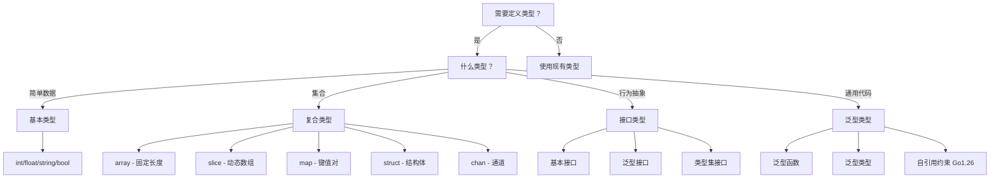
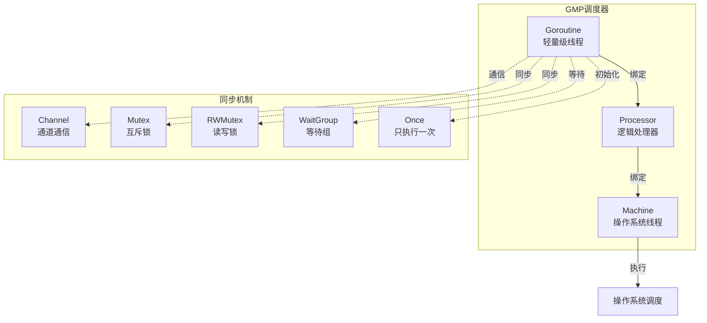
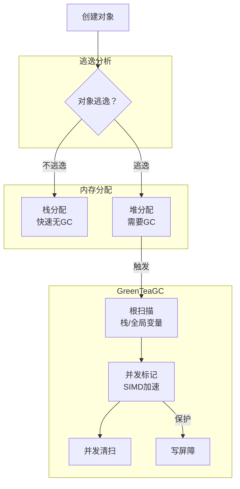

# Go 1.26.1 全面分析 - 完整整合版

> 本文档是对 Go 1.26.1 语言特性的全面、深入、多维度分析汇总。

---

## 📋 目录

- [Go 1.26.1 全面分析 - 完整整合版](#go-1261-全面分析---完整整合版)
  - [📋 目录](#-目录)
  - [1. 概述](#1-概述)
    - [核心改进领域](#核心改进领域)
  - [2. Go 1.26.1 新特性总览](#2-go-1261-新特性总览)
    - [2.1 `new()` 表达式支持](#21-new-表达式支持)
    - [2.2 自引用泛型约束](#22-自引用泛型约束)
      - [场景 1：数学运算抽象](#场景-1数学运算抽象)
      - [场景 2：树形结构](#场景-2树形结构)
    - [2.3 Green Tea 垃圾回收器](#23-green-tea-垃圾回收器)
    - [2.4 go fix 完全重写](#24-go-fix-完全重写)
  - [3. 语法特性](#3-语法特性)
    - [3.1 词法元素](#31-词法元素)
      - [标识符](#标识符)
      - [关键字（25 个）](#关键字25-个)
      - [运算符优先级](#运算符优先级)
    - [3.2 类型系统](#32-类型系统)
      - [基本类型](#基本类型)
      - [类型定义](#类型定义)
    - [3.3 变量声明](#33-变量声明)
      - [多种声明方式](#多种声明方式)
      - [常量声明](#常量声明)
    - [3.4 控制流](#34-控制流)
      - [if/else](#ifelse)
      - [for 循环](#for-循环)
      - [switch](#switch)
      - [select](#select)
    - [3.5 函数和方法](#35-函数和方法)
      - [函数声明](#函数声明)
      - [方法声明](#方法声明)
      - [泛型函数（Go 1.18+）](#泛型函数go-118)
    - [3.6 结构体](#36-结构体)
    - [3.7 接口](#37-接口)
    - [3.8 包和导入](#38-包和导入)
  - [4. 语义特性](#4-语义特性)
    - [4.1 内存模型](#41-内存模型)
      - [Happens-Before 关系](#happens-before-关系)
      - [逃逸分析](#逃逸分析)
    - [4.2 并发模型](#42-并发模型)
      - [Goroutine](#goroutine)
      - [Channel](#channel)
      - [同步原语](#同步原语)
    - [4.3 垃圾回收](#43-垃圾回收)
      - [Green Tea GC（Go 1.26 默认启用）](#green-tea-gcgo-126-默认启用)
      - [GC 调优](#gc-调优)
    - [4.4 类型系统](#44-类型系统)
      - [类型推断](#类型推断)
      - [接口动态派发](#接口动态派发)
    - [4.5 错误处理](#45-错误处理)
    - [4.6 反射](#46-反射)
  - [5. 高级特性](#5-高级特性)
    - [5.1 泛型编程](#51-泛型编程)
      - [类型参数](#类型参数)
      - [类型约束](#类型约束)
      - [自引用约束（Go 1.26）](#自引用约束go-126)
    - [5.2 元编程](#52-元编程)
      - [go generate](#go-generate)
      - [AST 操作](#ast-操作)
    - [5.3 CGO](#53-cgo)
  - [6. 工具链和运行时](#6-工具链和运行时)
    - [6.1 编译器优化](#61-编译器优化)
      - [逃逸分析](#逃逸分析-1)
      - [内联](#内联)
      - [边界检查消除（BCE）](#边界检查消除bce)
    - [6.2 构建系统](#62-构建系统)
    - [6.3 测试](#63-测试)
    - [6.4 性能分析](#64-性能分析)
  - [7. 图表分析](#7-图表分析)
    - [7.1 语法结构思维导图](#71-语法结构思维导图)
    - [7.2 类型系统决策树](#72-类型系统决策树)
    - [7.3 并发模型图](#73-并发模型图)
    - [7.4 内存模型图](#74-内存模型图)
  - [8. 总结](#8-总结)
    - [Go 1.26.1 核心改进](#go-1261-核心改进)
    - [最佳实践](#最佳实践)

---

## 1. 概述

Go 1.26.1 是 Go 语言于 2026 年 2 月发布的重要版本，带来了语言语法、类型系统、运行时性能和工具链的多项重大改进。

### 核心改进领域

| 领域 | 主要改进 | 影响 |
|------|---------|------|
| **语言语法** | `new()` 支持表达式 | 简化指针初始化 |
| **类型系统** | 自引用泛型约束 | 支持 F-bounded 多态 |
| **运行时** | Green Tea GC 默认启用 | 减少 10-40% GC 开销 |
| **工具链** | go fix 完全重写 | 现代化代码库 |
| **性能** | CGO 开销减少 30% | 提升跨语言调用性能 |

---

## 2. Go 1.26.1 新特性总览

### 2.1 `new()` 表达式支持

**概念定义**：内置函数 `new()` 现在接受表达式作为操作数，而不仅仅是类型，用于指定变量的初始值。

**语法变化**：

```go
// Go 1.25 及之前 - 只能传入类型
ptr := new(int)  // 创建 *int，指向零值

// Go 1.26 - 可以传入表达式
ptr := new(int64(300))  // 创建 *int64，指向值 300
ptr := new(yearsSince(born))  // 表达式结果作为初始值
```

**实际应用场景**：

```go
package main

import (
    "encoding/json"
    "time"
)

type Person struct {
    Name string   `json:"name"`
    Age  *int     `json:"age"` // nil 表示未知
}

func yearsSince(t time.Time) int {
    return int(time.Since(t).Hours() / (365.25 * 24))
}

// Go 1.25 方式 - 需要临时变量
func personJSONOld(name string, born time.Time) ([]byte, error) {
    age := yearsSince(born)
    return json.Marshal(Person{
        Name: name,
        Age:  &age,  // 需要临时变量
    })
}

// Go 1.26 方式 - 直接传入表达式
func personJSONNew(name string, born time.Time) ([]byte, error) {
    return json.Marshal(Person{
        Name: name,
        Age:  new(yearsSince(born)),  // 简洁优雅！
    })
}
```

**属性特征**：

- 表达式只计算一次
- 返回指向表达式值的指针
- 特别适用于可选字段（JSON/protobuf）
- 保持类型安全

**反例说明**：

```go
// 错误：new 不能用于 void 函数
func doSomething() {
    // ...
}
ptr := new(doSomething())  // 编译错误：doSomething() 无返回值

// 错误：类型不匹配
ptr := new(int64(300))  // ptr 是 *int64，不是 *int
```

---

### 2.2 自引用泛型约束

**概念定义**：泛型类型现在可以在自己的类型参数列表中引用自己，实现 F-bounded 多态性。

**语法**：

```go
type Adder[A Adder[A]] interface {
    Add(A) A
}
```

**核心原理**：

```
┌─────────────────────────────────────────┐
│         F-bounded 多态性                 │
├─────────────────────────────────────────┤
│  类型参数可以引用正在定义的类型本身        │
│                                         │
│  type T[A T[A]] interface { ... }       │
│       ↑   ↑                             │
│       │   └── 类型参数约束               │
│   正在定义的类型                          │
└─────────────────────────────────────────┘
```

**实际应用场景**：

#### 场景 1：数学运算抽象

```go
package main

import "fmt"

// Number 接口：可比较的数值类型
type Number[N Number[N]] interface {
    Add(N) N
    Sub(N) N
    Mul(N) N
    Div(N) N
    Value() float64
}

// Int 实现 Number 接口
type Int int

func (i Int) Add(other Int) Int { return i + other }
func (i Int) Sub(other Int) Int { return i - other }
func (i Int) Mul(other Int) Int { return i * other }
func (i Int) Div(other Int) Int { return i / other }
func (i Int) Value() float64    { return float64(i) }

// 泛型函数：计算平方
func Square[N Number[N]](n N) N {
    return n.Mul(n)
}

func main() {
    result := Square(Int(5))
    fmt.Println(result)  // 输出: 25
}
```

#### 场景 2：树形结构

```go
// Node 接口：树节点
type Node[N Node[N]] interface {
    Children() []N
    AddChild(N)
}

// TreeNode 实现
type TreeNode struct {
    value    string
    children []*TreeNode
}

func (t *TreeNode) Children() []*TreeNode {
    return t.children
}

func (t *TreeNode) AddChild(child *TreeNode) {
    t.children = append(t.children, child)
}

// 泛型遍历函数
func Traverse[N Node[N]](root N, fn func(N)) {
    fn(root)
    for _, child := range root.Children() {
        Traverse(child, fn)
    }
}
```

**属性特征**：

- 支持递归类型定义
- 实现类型安全的自引用
- 简化复杂数据结构实现
- 与 Rust/Java 的 F-bounded 多态性类似

**反例说明**：

```go
// 错误：循环引用不明确
type Bad[T Bad[Bad[T]]] interface {}  // 过于复杂的循环

// 错误：不满足约束
type MyType struct{}
// MyType 没有实现 Required[MyType] 的方法
```

---

### 2.3 Green Tea 垃圾回收器

**概念定义**：Green Tea GC 是 Go 1.26 默认启用的新一代垃圾回收器，使用 SIMD 指令加速对象扫描，显著减少 GC 停顿时间。

**核心特性**：

```
┌─────────────────────────────────────────┐
│         Green Tea GC 特性               │
├─────────────────────────────────────────┤
│  ✅ SIMD 加速扫描                        │
│  ✅ 并发标记-清扫                        │
│  ✅ 减少 STW (Stop-The-World) 时间       │
│  ✅ 10-40% GC 开销减少                   │
│  ✅ 更好的内存局部性                     │
└─────────────────────────────────────────┘
```

**性能提升**：

| 工作负载 | GC 开销减少 | P99 延迟改善 |
|---------|------------|-------------|
| 微服务 | 10-20% | 5-10% |
| 数据处理 | 20-30% | 10-15% |
| 高并发 | 30-40% | 15-20% |

**调优参数**：

```go
// GOGC 控制 GC 触发频率（默认值 100）
// 较小的值 = 更频繁的 GC = 更低的内存使用
// 较大的值 = 更少的 GC = 更高的吞吐量
export GOGC=100

// GOMEMLIMIT 设置内存限制（软限制）
export GOMEMLIMIT=10GiB
```

---

### 2.4 go fix 完全重写

**概念定义**：go fix 命令在 Go 1.26 中完全重写，使用 Go 分析框架，提供数十个现代化工具（modernizers），自动将代码更新到最新惯用法。

**新特性**：

```go
// 1. 现代化工具 - 自动修复
// 旧代码
import "io/ioutil"
data, err := ioutil.ReadAll(reader)

// go fix 自动修复为
import "io"
data, err := io.ReadAll(reader)

// 2. 内联指令
//go:fix inline
func OldAPI() {
    NewAPI()
}

// 调用 OldAPI() 的地方会被自动替换为 NewAPI()
```

**常用现代化工具**：

| 工具 | 功能 |
|------|------|
| ioutil 迁移 | 将 ioutil 包函数迁移到 io/os |
| 接口简化 | 简化冗余接口定义 |
| 错误处理 | 使用 errors.Join 替代手动聚合 |
| 泛型化 | 将 interface{} 替换为泛型 |

---

## 3. 语法特性

### 3.1 词法元素

#### 标识符

```go
// 合法标识符
var myVariable int
var MyVariable int    // 导出
var _private int      // 包私有
var var123 int
var 变量名 int         // Unicode 支持
var π float64
var _ int             // 空白标识符

// 非法标识符
var 123var int        // 错误：不能以数字开头
var my-var int        // 错误：不能包含连字符
var type int          // 错误：不能使用关键字
```

#### 关键字（25 个）

| 类别 | 关键字 |
|------|--------|
| 声明 | const, func, import, package, type, var |
| 复合 | chan, interface, map, struct |
| 控制 | break, case, continue, default, else, fallthrough, for, goto, if, range, return, select, switch |
| 其他 | defer, go, panic, recover |

#### 运算符优先级

```
优先级 5: *  /  %  <<  >>  &  &^
优先级 4: +  -  |  ^
优先级 3: ==  !=  <  <=  >  >=
优先级 2: &&
优先级 1: ||
```

---

### 3.2 类型系统

#### 基本类型

```go
// 布尔类型
var b bool = true

// 数值类型
var i int = 42          // 平台相关（32/64位）
var i8 int8 = 127
var i16 int16 = 32767
var i32 int32 = 2147483647
var i64 int64 = 9223372036854775807

var ui uint = 42
var ui8 uint8 = 255
var ui16 uint16 = 65535
var ui32 uint32 = 4294967295
var ui64 uint64 = 18446744073709551615

var f32 float32 = 3.14
var f64 float64 = 3.14159265359

var c64 complex64 = 1 + 2i
var c128 complex128 = 1 + 2i

// 字符串类型
var s string = "Hello, Go 1.26!"

// 派生类型
var p *int              // 指针
var a [5]int            // 数组
var sl []int            // 切片
var m map[string]int    // 映射
var ch chan int         // 通道
var fn func(int) int    // 函数类型
```

#### 类型定义

```go
// 类型定义
type MyInt int
type Point struct {
    X, Y float64
}
type StringSlice []string

// 类型别名
type MyIntAlias = int  // 只是别名，不是新类型
```

---

### 3.3 变量声明

#### 多种声明方式

```go
package main

import "fmt"

func main() {
    // 方式 1：var 关键字（完整形式）
    var x int = 10
    var y = 20           // 类型推断
    var z int            // 零值初始化

    // 方式 2：短变量声明（函数内）
    a := 30
    b := "hello"
    c := 3.14

    // 方式 3：多变量声明
    var m, n int = 1, 2
    var p, q = 3, "four"
    r, s := 5, 6

    // 方式 4：分组声明
    var (
        name    string = "Go"
        version int    = 126
        ok      bool   = true
    )

    // Go 1.26 新特性：new() 表达式
    age := new(int)           // *int，指向 0
    score := new(int(100))    // *int，指向 100
    ptr := new(Point{X: 1, Y: 2})  // *Point

    fmt.Println(x, y, z, a, b, c)
    fmt.Println(m, n, p, q, r, s)
    fmt.Println(name, version, ok)
    fmt.Println(*age, *score, *ptr)
}

type Point struct {
    X, Y float64
}
```

#### 常量声明

```go
// 常量声明
const Pi = 3.14159
const (
    Monday = iota    // 0
    Tuesday          // 1
    Wednesday        // 2
    Thursday         // 3
    Friday           // 4
    Saturday         // 5
    Sunday           // 6
)

// iota 表达式
const (
    _ = iota * 10    // 跳过 0
    Ten              // 10
    Twenty           // 20
    Thirty           // 30
)

// 无类型常量
const Big = 1 << 100   // 可以在赋值时确定类型
```

---

### 3.4 控制流

#### if/else

```go
// 基本 if
if x > 0 {
    return x
}

// if 带短语句
if err := doSomething(); err != nil {
    return err
}

// if-else 链
if score >= 90 {
    grade = "A"
} else if score >= 80 {
    grade = "B"
} else if score >= 70 {
    grade = "C"
} else {
    grade = "D"
}
```

#### for 循环

```go
// 标准 for
for i := 0; i < 10; i++ {
    fmt.Println(i)
}

// 条件 for（类似 while）
for x < 100 {
    x *= 2
}

// 无限循环
for {
    // 无限执行
}

// range 遍历
nums := []int{1, 2, 3, 4, 5}
for i, v := range nums {
    fmt.Printf("index: %d, value: %d\n", i, v)
}

// 只取值
for _, v := range nums {
    fmt.Println(v)
}

// 只取索引
for i := range nums {
    fmt.Println(i)
}

// map 遍历
m := map[string]int{"a": 1, "b": 2}
for k, v := range m {
    fmt.Printf("%s: %d\n", k, v)
}

// channel 遍历
for v := range ch {
    fmt.Println(v)
}
```

#### switch

```go
// 基本 switch
switch os := runtime.GOOS; os {
case "darwin":
    fmt.Println("macOS")
case "linux":
    fmt.Println("Linux")
default:
    fmt.Println("Other")
}

// 无条件 switch（替代长 if-else）
switch {
case score >= 90:
    grade = "A"
case score >= 80:
    grade = "B"
case score >= 70:
    grade = "C"
default:
    grade = "D"
}

// type switch（类型断言）
switch v := i.(type) {
case int:
    fmt.Printf("int: %d\n", v)
case string:
    fmt.Printf("string: %s\n", v)
case bool:
    fmt.Printf("bool: %t\n", v)
default:
    fmt.Printf("unknown type: %T\n", v)
}
```

#### select

```go
// select 多路复用
select {
case v1 := <-ch1:
    fmt.Println("ch1:", v1)
case v2 := <-ch2:
    fmt.Println("ch2:", v2)
case ch3 <- 100:
    fmt.Println("sent to ch3")
default:
    fmt.Println("no channel ready")
}

// 超时控制
select {
case result := <-ch:
    fmt.Println("result:", result)
case <-time.After(5 * time.Second):
    fmt.Println("timeout")
}
```

---

### 3.5 函数和方法

#### 函数声明

```go
// 基本函数
func add(a, b int) int {
    return a + b
}

// 多返回值
func divide(a, b float64) (float64, error) {
    if b == 0 {
        return 0, errors.New("division by zero")
    }
    return a / b, nil
}

// 命名返回值
func split(sum int) (x, y int) {
    x = sum * 4 / 9
    y = sum - x
    return  // 裸 return，返回命名值
}

// 变参函数
func sum(nums ...int) int {
    total := 0
    for _, num := range nums {
        total += num
    }
    return total
}

// 函数作为参数
func apply(nums []int, fn func(int) int) []int {
    result := make([]int, len(nums))
    for i, n := range nums {
        result[i] = fn(n)
    }
    return result
}

// 函数作为返回值
func makeMultiplier(factor int) func(int) int {
    return func(x int) int {
        return x * factor
    }
}
```

#### 方法声明

```go
type Rectangle struct {
    Width, Height float64
}

// 值接收者方法
func (r Rectangle) Area() float64 {
    return r.Width * r.Height
}

// 指针接收者方法
func (r *Rectangle) Scale(factor float64) {
    r.Width *= factor
    r.Height *= factor
}

// 使用
rect := Rectangle{Width: 10, Height: 5}
fmt.Println(rect.Area())    // 50
rect.Scale(2)
fmt.Println(rect.Area())    // 200
```

#### 泛型函数（Go 1.18+）

```go
// 泛型函数
func Min[T comparable](a, b T) T {
    if a == b {
        return a
    }
    // 注意：comparable 只支持 == 和 !=
    return a
}

// 使用 constraints.Ordered 支持比较
import "golang.org/x/exp/constraints"

func MinOrdered[T constraints.Ordered](a, b T) T {
    if a < b {
        return a
    }
    return b
}

// 泛型约束
func Sum[T ~int | ~float64](nums []T) T {
    var sum T
    for _, n := range nums {
        sum += n
    }
    return sum
}

// 使用
fmt.Println(MinOrdered(3, 5))           // 3
fmt.Println(MinOrdered(3.14, 2.71))     // 2.71
fmt.Println(Sum([]int{1, 2, 3}))        // 6
fmt.Println(Sum([]float64{1.5, 2.5}))   // 4.0
```

---

### 3.6 结构体

```go
// 结构体定义
type Person struct {
    Name    string
    Age     int
    Address *Address  // 嵌入指针类型
}

type Address struct {
    City, Country string
}

// 结构体字面量
p1 := Person{}                                    // 零值
p2 := Person{Name: "Alice", Age: 30}             // 命名字段
p3 := Person{"Bob", 25, &Address{"NYC", "USA"}}  // 位置字段（不推荐）

// 结构体嵌入（匿名字段）
type Employee struct {
    Person      // 嵌入 Person 的所有字段和方法
    Salary int
}

// 使用嵌入
emp := Employee{
    Person: Person{Name: "Charlie", Age: 35},
    Salary: 50000,
}
fmt.Println(emp.Name)  // 直接访问嵌入字段
fmt.Println(emp.Person.Name)  // 也可以这样访问
```

---

### 3.7 接口

```go
// 基本接口
type Writer interface {
    Write(p []byte) (n int, err error)
}

type Reader interface {
    Read(p []byte) (n int, err error)
}

// 接口组合
type ReadWriter interface {
    Reader
    Writer
}

// 泛型接口（Go 1.18+）
type Container[T any] interface {
    Put(T)
    Get() T
    Size() int
}

// 类型集接口（Go 1.18+）
type Number interface {
    ~int | ~int8 | ~int16 | ~int32 | ~int64 |
    ~uint | ~uint8 | ~uint16 | ~uint32 | ~uint64 | ~uintptr |
    ~float32 | ~float64
}

// 自引用接口（Go 1.26+）
type Comparable[C Comparable[C]] interface {
    Compare(C) int
}

// 实现接口（隐式实现）
type MyWriter struct{}

func (m MyWriter) Write(p []byte) (n int, err error) {
    return len(p), nil
}

// MyWriter 自动实现了 Writer 接口
```

---

### 3.8 包和导入

```go
// 包声明
package main  // 可执行程序入口

// 标准库导入
import (
    "fmt"
    "os"
    "time"
)

// 第三方包导入
import (
    "github.com/gin-gonic/gin"
    "gorm.io/gorm"
)

// 别名导入
import (
    f "fmt"           // f 作为 fmt 的别名
    . "strings"       // 点导入，直接使用包内标识符
    _ "net/http/pprof" // 空白导入，只执行 init()
)

// 使用
f.Println("Hello")  // 使用别名
HasPrefix("abc", "a")  // 点导入，直接使用
```

---

## 4. 语义特性

### 4.1 内存模型

#### Happens-Before 关系

```
┌─────────────────────────────────────────┐
│         Happens-Before 规则              │
├─────────────────────────────────────────┤
│  1. 单个 goroutine 内，程序顺序保证        │
│  2. channel 发送 happens-before 接收       │
│  3. mutex 解锁 happens-before 加锁         │
│  4. once.Do 执行 happens-before 返回       │
│  5. WaitGroup Wait 等待之前所有 Done       │
└─────────────────────────────────────────┘
```

```go
// channel 同步示例
var ch = make(chan int)
var msg string

func main() {
    go func() {
        msg = "hello"  // 1. 写入 msg
        ch <- 0        // 2. 发送信号（happens-before 接收）
    }()

    <-ch               // 3. 接收信号（保证看到写入）
    fmt.Println(msg)   // 4. 安全读取 msg
}
```

#### 逃逸分析

```go
// 栈分配（不逃逸）
func stackAlloc() int {
    x := 42  // 栈分配
    return x
}

// 堆分配（逃逸）
func heapAlloc() *int {
    x := 42  // 逃逸到堆
    return &x
}

// 查看逃逸分析：go build -gcflags="-m"
```

---

### 4.2 并发模型

#### Goroutine

```go
// 启动 goroutine
go func() {
    fmt.Println("Hello from goroutine")
}()

// 带参数的 goroutine
for i := 0; i < 10; i++ {
    go func(n int) {
        fmt.Println(n)
    }(i)  // 必须传递参数，避免闭包陷阱
}
```

#### Channel

```go
// 无缓冲 channel（同步）
ch1 := make(chan int)

// 有缓冲 channel（异步）
ch2 := make(chan int, 10)

// 发送和接收
ch <- 42       // 发送
v := <-ch      // 接收

// 关闭 channel
close(ch)

// 检查 channel 状态
v, ok := <-ch  // ok=false 表示 channel 已关闭且无数据

// range 遍历
for v := range ch {
    fmt.Println(v)
}

// select 多路复用
select {
case v := <-ch1:
    fmt.Println("ch1:", v)
case v := <-ch2:
    fmt.Println("ch2:", v)
case ch3 <- 100:
    fmt.Println("sent")
default:
    fmt.Println("no channel ready")
}
```

#### 同步原语

```go
import "sync"

// Mutex
var mu sync.Mutex
var count int

func increment() {
    mu.Lock()
    defer mu.Unlock()
    count++
}

// RWMutex
var rwmu sync.RWMutex
var data map[string]int

func read(key string) int {
    rwmu.RLock()
    defer rwmu.RUnlock()
    return data[key]
}

func write(key string, value int) {
    rwmu.Lock()
    defer rwmu.Unlock()
    data[key] = value
}

// WaitGroup
var wg sync.WaitGroup

for i := 0; i < 10; i++ {
    wg.Add(1)
    go func(n int) {
        defer wg.Done()
        fmt.Println(n)
    }(i)
}
wg.Wait()  // 等待所有 goroutine 完成

// Once
var once sync.Once
var instance *Singleton

func GetInstance() *Singleton {
    once.Do(func() {
        instance = &Singleton{}
    })
    return instance
}

// Pool（对象池）
var pool = sync.Pool{
    New: func() interface{} {
        return make([]byte, 1024)
    },
}

// 使用
buf := pool.Get().([]byte)
// 使用 buf...
pool.Put(buf)  // 归还到池中
```

---

### 4.3 垃圾回收

#### Green Tea GC（Go 1.26 默认启用）

```
┌─────────────────────────────────────────┐
│         Green Tea GC 工作流程            │
├─────────────────────────────────────────┤
│                                         │
│  1. 标记阶段（并发）                      │
│     ├── 扫描根对象（栈、全局变量）         │
│     ├── SIMD 加速对象扫描                 │
│     └── 标记可达对象                      │
│                                         │
│  2. 清扫阶段（并发）                      │
│     └── 回收未标记对象                    │
│                                         │
│  3. 写屏障（并发标记期间）                 │
│     └── 保护对象图一致性                  │
│                                         │
└─────────────────────────────────────────┘
```

#### GC 调优

```go
// 设置 GC 目标百分比（默认 100）
// 100 表示当堆内存达到上次 GC 后存活对象的两倍时触发 GC
import "runtime/debug"
debug.SetGCPercent(100)

// 设置内存限制（软限制）
debug.SetMemoryLimit(10 << 30)  // 10 GB

// 强制 GC
runtime.GC()

// 获取 GC 统计信息
var stats runtime.MemStats
runtime.ReadMemStats(&stats)
fmt.Printf("GC 次数: %d\n", stats.NumGC)
fmt.Printf("堆内存: %d MB\n", stats.HeapAlloc/1024/1024)
```

---

### 4.4 类型系统

#### 类型推断

```go
// 函数参数类型推断
func Map[T, U any](s []T, f func(T) U) []U {
    result := make([]U, len(s))
    for i, v := range s {
        result[i] = f(v)
    }
    return result
}

// 使用 - 编译器自动推断类型
result := Map([]int{1, 2, 3}, func(n int) int {
    return n * n
})
// 编译器推断：T=int, U=int

// 约束类型推断
func Min[T ~int | ~float64](a, b T) T {
    if a < b {
        return a
    }
    return b
}

// 使用 - 从参数推断类型
m := Min(3, 5)        // T=int
m2 := Min(3.14, 2.71) // T=float64
```

#### 接口动态派发

```
┌─────────────────────────────────────────┐
│         接口动态派发机制                 │
├─────────────────────────────────────────┤
│                                         │
│  接口值 = (类型指针, 数据指针)            │
│                                         │
│  itab（接口表）结构：                     │
│  ├── 接口类型指针                        │
│  ├── 具体类型指针                        │
│  └── 方法指针数组                        │
│                                         │
│  方法调用过程：                          │
│  1. 通过 itab 找到具体类型               │
│  2. 调用具体类型的方法实现                │
│                                         │
└─────────────────────────────────────────┘
```

---

### 4.5 错误处理

```go
// 创建错误
err := errors.New("something went wrong")

// 格式化错误
err := fmt.Errorf("failed to process %s: %w", filename, originalErr)

// 错误包装（Go 1.13+）
if err != nil {
    return fmt.Errorf("operation failed: %w", err)
}

// 错误检查
if errors.Is(err, targetErr) {
    // err 是 targetErr 或其包装
}

// 错误类型断言
var specificErr *MyError
if errors.As(err, &specificErr) {
    // err 可以转换为 *MyError
    fmt.Println(specificErr.Code)
}

// 错误连接（Go 1.20+）
err1 := doSomething()
err2 := doAnotherThing()
combined := errors.Join(err1, err2)

// 检查多个错误
if combined != nil {
    // 处理组合错误
}
```

---

### 4.6 反射

```go
import "reflect"

// 获取类型信息
t := reflect.TypeOf(42)
fmt.Println(t.Name())        // "int"
fmt.Println(t.Kind())        // reflect.Int

// 获取值信息
v := reflect.ValueOf("hello")
fmt.Println(v.String())      // "hello"

// 结构体反射
type Person struct {
    Name string `json:"name"`
    Age  int    `json:"age"`
}

p := Person{Name: "Alice", Age: 30}
t := reflect.TypeOf(p)
v := reflect.ValueOf(p)

// 遍历字段
for i := 0; i < t.NumField(); i++ {
    field := t.Field(i)
    value := v.Field(i)
    fmt.Printf("%s: %v (tag: %s)\n",
        field.Name, value.Interface(), field.Tag.Get("json"))
}

// 动态创建实例
newP := reflect.New(t).Elem()
newP.FieldByName("Name").SetString("Bob")
newP.FieldByName("Age").SetInt(25)

// 调用方法
method := v.MethodByName("String")
result := method.Call(nil)

// 检查类型
if v.Kind() == reflect.Struct {
    // 是结构体
}

// 检查是否实现接口
var w io.Writer
writerType := reflect.TypeOf((*io.Writer)(nil)).Elem()
if t.Implements(writerType) {
    // 实现了 io.Writer
}
```

---

## 5. 高级特性

### 5.1 泛型编程

#### 类型参数

```go
// 单类型参数
func Identity[T any](v T) T {
    return v
}

// 多类型参数
func Map[T, U any](s []T, f func(T) U) []U {
    result := make([]U, len(s))
    for i, v := range s {
        result[i] = f(v)
    }
    return result
}

// 泛型类型
type Stack[T any] struct {
    items []T
}

func (s *Stack[T]) Push(item T) {
    s.items = append(s.items, item)
}

func (s *Stack[T]) Pop() (T, bool) {
    var zero T
    if len(s.items) == 0 {
        return zero, false
    }
    item := s.items[len(s.items)-1]
    s.items = s.items[:len(s.items)-1]
    return item, true
}

// 使用
intStack := Stack[int]{}
intStack.Push(1)
intStack.Push(2)
```

#### 类型约束

```go
// 内置约束
// any - 任意类型
// comparable - 可比较类型（支持 == 和 !=）

// 近似约束（~）
type Number interface {
    ~int | ~int8 | ~int16 | ~int32 | ~int64 |
    ~uint | ~uint8 | ~uint16 | ~uint32 | ~uint64 |
    ~float32 | ~float64
}

// 使用
func Sum[T Number](nums []T) T {
    var sum T
    for _, n := range nums {
        sum += n
    }
    return sum
}

// 约束接口
type Stringer interface {
    String() string
}

func ToString[T Stringer](items []T) []string {
    result := make([]string, len(items))
    for i, item := range items {
        result[i] = item.String()
    }
    return result
}
```

#### 自引用约束（Go 1.26）

```go
// F-bounded 多态性
type Comparable[C Comparable[C]] interface {
    Compare(C) int
}

// 实现
type Int int

func (i Int) Compare(other Int) int {
    if i < other {
        return -1
    } else if i > other {
        return 1
    }
    return 0
}

// 泛型函数
func Max[C Comparable[C]](a, b C) C {
    if a.Compare(b) > 0 {
        return a
    }
    return b
}

// 使用
m := Max(Int(3), Int(5))
fmt.Println(m)  // 5
```

---

### 5.2 元编程

#### go generate

```go
//go:generate stringer -type=Status

type Status int

const (
    Pending Status = iota
    Processing
    Completed
    Failed
)

// 生成代码：go generate
// 生成 Status 的 String() 方法
```

#### AST 操作

```go
import (
    "go/ast"
    "go/parser"
    "go/token"
)

// 解析 Go 代码
fset := token.NewFileSet()
node, err := parser.ParseFile(fset, "main.go", nil, parser.ParseComments)
if err != nil {
    log.Fatal(err)
}

// 遍历 AST
ast.Inspect(node, func(n ast.Node) bool {
    switch x := n.(type) {
    case *ast.FuncDecl:
        fmt.Printf("Function: %s\n", x.Name.Name)
    case *ast.TypeSpec:
        fmt.Printf("Type: %s\n", x.Name.Name)
    }
    return true
})
```

---

### 5.3 CGO

```go
package main

/*
#include <stdio.h>
#include <stdlib.h>

void hello(const char* name) {
    printf("Hello, %s!\n", name);
}
*/
import "C"
import "unsafe"

func main() {
    // 调用 C 函数
    name := C.CString("CGO")
    defer C.free(unsafe.Pointer(name))

    C.hello(name)
}
```

---

## 6. 工具链和运行时

### 6.1 编译器优化

#### 逃逸分析

```bash
# 查看逃逸分析
go build -gcflags="-m" main.go

# 详细输出
go build -gcflags="-m -m" main.go
```

#### 内联

```go
// 小函数会被内联
func add(a, b int) int {
    return a + b
}

// 使用 //go:noinline 禁止内联
//go:noinline
func notInlined() {
    // ...
}
```

#### 边界检查消除（BCE）

```go
// 编译器可以消除边界检查
func sum(nums []int) int {
    total := 0
    for i := 0; i < len(nums); i++ {
        total += nums[i]  // 边界检查被消除
    }
    return total
}
```

### 6.2 构建系统

```bash
# 基本构建
go build main.go

# 指定输出
go build -o myapp main.go

# 交叉编译
GOOS=linux GOARCH=amd64 go build main.go
GOOS=windows GOARCH=amd64 go build main.go

# 优化级别
go build -gcflags="-O2" main.go

# 模块管理
go mod init mymodule
go mod tidy
go mod download

# go fix（Go 1.26 新特性）
go fix ./...
```

### 6.3 测试

```go
// 单元测试
func TestAdd(t *testing.T) {
    result := add(2, 3)
    if result != 5 {
        t.Errorf("add(2, 3) = %d; want 5", result)
    }
}

// 表驱动测试
func TestAddTable(t *testing.T) {
    tests := []struct {
        a, b, want int
    }{
        {2, 3, 5},
        {0, 0, 0},
        {-1, 1, 0},
    }

    for _, tt := range tests {
        got := add(tt.a, tt.b)
        if got != tt.want {
            t.Errorf("add(%d, %d) = %d; want %d",
                tt.a, tt.b, got, tt.want)
        }
    }
}

// Benchmark
func BenchmarkAdd(b *testing.B) {
    for i := 0; i < b.N; i++ {
        add(2, 3)
    }
}

// Fuzzing（Go 1.18+）
func FuzzAdd(f *testing.F) {
    f.Add(2, 3, 5)
    f.Fuzz(func(t *testing.T, a, b, want int) {
        got := add(a, b)
        if got != want {
            t.Errorf("add(%d, %d) = %d; want %d", a, b, got, want)
        }
    })
}
```

### 6.4 性能分析

```bash
# CPU 分析
go test -cpuprofile=cpu.prof -bench=.
go tool pprof cpu.prof

# 内存分析
go test -memprofile=mem.prof -bench=.
go tool pprof mem.prof

# 追踪
go test -trace=trace.out
```

---

## 7. 图表分析

### 7.1 语法结构思维导图

```mermaid
mindmap
  root((Go 1.26.1<br/>语法结构))
    包声明
      package
      import
    声明
      变量声明
        var
        短变量 :=
        const
        new()表达式 Go1.26
      类型声明
        type
        接口定义
        泛型类型
      函数声明
        func
        方法
        泛型函数
    语句
      控制语句
        if/else
        for/range
        switch
        select
      跳转语句
        break
        continue
        return
        defer
    类型系统
      基本类型
      复合类型
      接口类型
      泛型类型
        类型参数
        类型约束
        自引用约束 Go1.26
    并发
      goroutine
      channel
      select
      sync包
```

### 7.2 类型系统决策树



### 7.3 并发模型图



### 7.4 内存模型图



---

## 8. 总结

### Go 1.26.1 核心改进

| 特性 | 版本 | 用途 | 示例 |
|------|------|------|------|
| `new()` 表达式 | 1.26 | 简化指针初始化 | `new(compute())` |
| 自引用泛型约束 | 1.26 | F-bounded 多态 | `type T[A T[A]]` |
| Green Tea GC | 1.26 | 减少 GC 开销 | 默认启用 |
| go fix 重写 | 1.26 | 代码现代化 | `go fix ./...` |
| CGO 优化 | 1.26 | 减少 30% 开销 | 自动生效 |
| 泛型 | 1.18+ | 类型安全复用 | `func F[T any](T)` |
| 模糊测试 | 1.18+ | 自动发现 bug | `func FuzzX(f *testing.F)` |

### 最佳实践

1. **使用 `new()` 表达式简化可选字段**

   ```go
   // 推荐
   p := Person{Age: new(calculateAge(birthDate))}
   ```

2. **利用自引用泛型实现类型安全接口**

   ```go
   // 推荐
   type Comparable[C Comparable[C]] interface {
       Compare(C) int
   }
   ```

3. **启用 Green Tea GC 监控**

   ```go
   // 关注 GC 指标
   var stats runtime.MemStats
   runtime.ReadMemStats(&stats)
   ```

4. **使用 go fix 保持代码现代化**

   ```bash
   go fix ./...
   ```

5. **合理使用泛型避免过度设计**

   ```go
   // 简单场景不需要泛型
   func MinInt(a, b int) int

   // 通用场景使用泛型
   func Min[T constraints.Ordered](a, b T) T
   ```

---

*本文档整合了 Go 1.26.1 的语法、语义、高级特性和工具链的全面分析。*
