# Go 1.26.1 语言特性图表分析

本文档全面分析 Go 1.26.1 语言特性，包含8个核心图表，涵盖语法结构、类型系统、控制流程、变量生命周期、执行流、并发模型、内存模型和泛型约束。

---

## 1. 语法结构思维导图

Go 1.26.1 语言的整体语法结构，包含新特性支持。

```mermaid
mindmap
  root((Go 1.26.1<br/>语法结构))
    包声明
      package
      import
      模块系统
    声明
      变量声明
        var
        短变量 :=
        const
      类型声明
        type
        类型别名
        接口定义
      函数声明
        func
        方法
        泛型函数
    语句
      简单语句
        赋值
        自增/自减
        函数调用
      控制语句
        if/else
        for/range
        switch
        select
      跳转语句
        break
        continue
        goto
        return
        defer
    表达式
      基本表达式
        字面量
        标识符
        选择器
        索引
        切片
        类型断言
        类型转换
      调用表达式
        函数调用
        方法调用
        new()表达式 Go1.26
        make()
      复合表达式
        二元运算
        一元运算
        接收操作
    类型系统
      基本类型
        数值类型
        字符串
        布尔
      复合类型
        数组
        切片
        映射
        结构体
        通道
      接口类型
        空接口
        泛型接口
      泛型类型
        类型参数
        类型约束
        自引用约束 Go1.26
    并发
      goroutine
      channel
      select
      sync包
    特殊构造
      init函数
      内建函数
      空白标识符
```

### 说明

此思维导图展示了 Go 1.26.1 的完整语法结构：

- **包声明**：Go 程序的入口点，包含包名和导入声明
- **声明**：变量、类型、函数的声明方式
- **语句**：控制程序执行的各类语句
- **表达式**：Go 1.26 新增 `new()` 接受表达式作为参数，不再仅限于类型字面量
- **类型系统**：包含泛型和自引用约束的新特性
- **并发**：goroutine 和 channel 的核心并发原语

---

## 2. 类型系统决策树

Go 类型系统的分类和选择决策路径。

```mermaid
flowchart TD
    A[开始类型选择] --> B{需要存储什么?}

    B -->|单一值| C{值类型?}
    B -->|多个值| D{集合类型?}
    B -->|行为抽象| E[接口类型]
    B -->|类型参数化| F[泛型类型]

    C -->|整数| G[选择数值类型]
    C -->|小数| H[float32/float64]
    C -->|文本| I{长度固定?}
    C -->|真假| J[bool]

    G -->|有符号| K[int/int8/int16/int32/int64]
    G -->|无符号| L[uint/uint8/uint16/uint32/uint64/uintptr]

    I -->|是| M[数组 [N]T]
    I -->|否| N[字符串 string]

    D -->|有序集合| O[切片 []T]
    D -->|键值对| P[映射 map[K]V]
    D -->|自定义结构| Q[结构体 struct]
    D -->|通信| R[通道 chan T]

    E -->|空接口| S[any/interface{}]
    E -->|方法集| T[定义接口]

    F --> U{约束类型?}
    U -->|比较| V[comparable]
    U -->|有序| W[Ordered]
    U -->|自定义| X[定义约束接口]
    U -->|自引用| Y[Go1.26 自引用约束]

    Y --> Z1[类型参数引用自身]
    Y --> Z2[递归类型约束]

    style F fill:#90EE90
    style Y fill:#FFB6C1
    style Z1 fill:#FFB6C1
    style Z2 fill:#FFB6C1
```

### 说明

类型系统决策树帮助开发者选择合适的数据类型：

- **基本类型选择**：根据数据特性选择数值、字符串或布尔类型
- **集合类型**：数组（固定长度）、切片（动态长度）、映射（键值对）、结构体（自定义）
- **接口类型**：用于抽象和多态
- **泛型类型（Go 1.26 新特性）**：
  - 标准约束：`comparable`、`Ordered` 等
  - **自引用约束**：Go 1.26 允许类型参数在约束中引用自身，支持更复杂的递归类型

---

## 3. 控制流程图

Go 控制语句的执行流程，包含新特性影响。

```mermaid
flowchart TD
    subgraph 顺序执行
        S1[语句1] --> S2[语句2] --> S3[语句3]
    end

    subgraph If语句
        I1{条件判断} -->|true| I2[执行if块]
        I1 -->|false| I3{有else?}
        I3 -->|是| I4[执行else块]
        I3 -->|否| I5[继续]
        I2 --> I5
        I4 --> I5
    end

    subgraph For循环
        F1[初始化] --> F2{条件判断}
        F2 -->|true| F3[循环体]
        F3 --> F4[后置语句]
        F4 --> F2
        F2 -->|false| F5[退出循环]

        F6[range遍历] --> F7{获取下一个元素?}
        F7 -->|是| F8[处理元素]
        F8 --> F7
        F7 -->|否| F5
    end

    subgraph Switch语句
        SW1[计算表达式] --> SW2{匹配case?}
        SW2 -->|是| SW3[执行case块]
        SW2 -->|否| SW4{有default?}
        SW4 -->|是| SW5[执行default]
        SW4 -->|否| SW6[继续]
        SW3 -->|fallthrough| SW7[下一个case]
        SW3 -->|break/结束| SW6
        SW5 --> SW6
        SW7 --> SW6
    end

    subgraph Select语句
        SE1[评估所有case] --> SE2{有就绪channel?}
        SE2 -->|是| SE3[随机选择一个]
        SE2 -->|否| SE4{有default?}
        SE4 -->|是| SE5[执行default]
        SE4 -->|否| SE6[阻塞等待]
        SE3 --> SE7[执行选中case]
        SE5 --> SE8[继续]
        SE7 --> SE8
        SE6 -.->|channel就绪| SE2
    end

    subgraph Defer延迟执行
        D1[遇到defer] --> D2[注册延迟函数]
        D2 --> D3[继续执行]
        D3 --> D4[函数返回]
        D4 --> D5[按LIFO执行defer]
        D5 --> D6[真正返回]
    end

    subgraph Go1.26新特性影响
        N1[new()表达式] --> N2[编译时求值]
        N2 --> N3[可用于初始化]
        N3 --> N4[控制流中的动态分配]

        N5[自引用泛型] --> N6[类型检查扩展]
        N6 --> N7[约束求解更复杂]
        N7 --> N8[编译期类型推导]
    end

    style N1 fill:#90EE90
    style N5 fill:#90EE90
```

### 说明

控制流程图展示了 Go 的所有控制结构：

- **if/else**：条件分支执行
- **for**：Go 唯一的循环关键字，支持多种形式
- **switch**：多分支选择，支持类型开关和表达式开关
- **select**：channel 多路复用
- **defer**：延迟执行，LIFO 顺序
- **Go 1.26 新特性影响**：
  - `new()` 表达式允许在控制流中进行更灵活的内存分配
  - 自引用泛型增加了类型检查的复杂性

---

## 4. 变量生命周期图

变量从声明到垃圾回收的完整生命周期。

```mermaid
flowchart TD
    subgraph 声明阶段
        D1[变量声明] --> D2{初始化方式?}
        D2 -->|var| D3[零值初始化]
        D2 -->|:=| D4[推断类型并赋值]
        D2 -->|new()| D5[Go1.26 表达式初始化]
        D2 -->|make()| D6[引用类型初始化]
    end

    subgraph 分配决策
        A1[编译器分析] --> A2{逃逸分析}
        A2 -->|不逃逸| A3[栈分配]
        A2 -->|逃逸| A4[堆分配]

        A5[new()调用] --> A6{参数是表达式?}
        A6 -->|Go1.26 是| A7[运行时求值]
        A6 -->|否| A8[编译时确定]
    end

    subgraph 使用阶段
        U1[变量使用] --> U2{访问方式?}
        U2 -->|读| U3[读取值]
        U2 -->|写| U4[修改值]
        U2 -->|取地址| U5[获取指针]
        U2 -->|传递| U6[参数传递]

        U5 --> U7{地址是否逃逸?}
        U6 --> U7
        U7 -->|是| A4
        U7 -->|否| A3
    end

    subgraph 作用域
        S1[进入作用域] --> S2[变量可见]
        S2 --> S3[使用变量]
        S3 --> S4[离开作用域]
        S4 --> S5{栈变量?}
        S5 -->|是| S6[立即回收]
        S5 -->|否| S7[等待GC]
    end

    subgraph 垃圾回收
        G1[Green Tea GC] --> G2[并发标记]
        G2 --> G3[三色标记]
        G3 --> G4[白色对象]
        G3 --> G5[灰色对象]
        G3 --> G6[黑色对象]

        G4 --> G7{可达?}
        G7 -->|是| G5
        G7 -->|否| G8[回收内存]

        G5 --> G9[扫描引用]
        G9 --> G6
        G6 --> G10[保留对象]

        G8 --> G11[内存归还]
    end

    D3 --> A1
    D4 --> A1
    D5 --> A1
    D6 --> A1
    A3 --> U1
    A4 --> U1
    U4 --> U1
    S6 --> G1
    S7 --> G1

    style G1 fill:#90EE90
    style D5 fill:#90EE90
    style A6 fill:#90EE90
```

### 说明

变量生命周期图展示了从声明到回收的完整过程：

- **声明阶段**：多种初始化方式，Go 1.26 的 `new()` 支持表达式
- **分配决策**：逃逸分析决定栈分配或堆分配
- **使用阶段**：读写、取地址、传递等操作
- **作用域**：变量可见性范围
- **垃圾回收（Go 1.26 Green Tea GC）**：
  - 并发标记-清除
  - 三色标记算法
  - 默认启用，减少停顿时间

---

## 5. 执行流树图

函数调用和方法派发的执行流程。

```mermaid
flowchart TD
    subgraph 函数调用流程
        F1[调用函数] --> F2{函数类型?}
        F2 -->|普通函数| F3[直接调用]
        F2 -->|泛型函数| F4[类型实例化]
        F2 -->|闭包| F5[捕获环境]

        F4 --> F6[类型推导]
        F6 --> F7[生成特化代码]
        F7 --> F3

        F5 --> F8[创建闭包对象]
        F8 --> F3

        F3 --> F9[参数传递]
        F9 --> F10[创建栈帧]
        F10 --> F11[执行函数体]
        F11 --> F12[返回值]
        F12 --> F13[恢复调用者栈帧]
    end

    subgraph 方法派发
        M1[方法调用] --> M2{接收者类型?}
        M2 -->|值接收者| M3[值拷贝]
        M2 -->|指针接收者| M4[指针传递]

        M3 --> M5[静态派发]
        M4 --> M5

        M5 --> M6[直接调用方法]
    end

    subgraph 接口动态派发
        I1[接口方法调用] --> I2[获取接口值]
        I2 --> I3[读取itab]
        I3 --> I4[itab缓存?]
        I4 -->|命中| I5[快速派发]
        I4 -->|未命中| I6[计算方法地址]
        I6 --> I7[更新itab缓存]
        I7 --> I5

        I5 --> I8[通过函数指针调用]
    end

    subgraph 类型断言
        T1[类型断言] --> T2{编译时确定?}
        T2 -->|是| T3[直接转换]
        T2 -->|否| T4[运行时检查]

        T4 --> T5{类型匹配?}
        T5 -->|是| T6[提取值]
        T5 -->|否| T7[panic或返回ok=false]
    end

    subgraph 泛型特化
        G1[泛型调用] --> G2[解析类型参数]
        G2 --> G3{自引用约束?}
        G3 -->|Go1.26 是| G4[递归约束求解]
        G3 -->|否| G5[标准约束检查]

        G4 --> G6[构建类型图]
        G6 --> G7[验证约束满足]
        G7 --> G8[生成实例化代码]

        G5 --> G8
        G8 --> G9[编译/缓存]
        G9 --> G10[执行特化代码]
    end

    F13 --> M1
    M6 --> I1
    I8 --> T1
    T6 --> G1

    style G3 fill:#90EE90
    style G4 fill:#90EE90
```



### 说明

执行流树图展示了 Go 程序的执行机制：

- **函数调用**：参数传递、栈帧管理、返回值处理
- **方法派发**：值接收者和指针接收者的区别
- **接口动态派发**：通过 itab 实现运行时多态
- **类型断言**：运行时类型检查
- **泛型特化（Go 1.26 新特性）**：
  - 自引用约束需要递归约束求解
  - 构建类型图验证约束

---

## 6. 并发模型图

goroutine、channel、select 的关系和调度器交互。

```mermaid
flowchart TB
    subgraph Go运行时
        RT[Go Runtime]
    end

    subgraph 调度器
        S[Go Scheduler<br/>GMP模型] --> P[Processor P]
        P --> M[Machine M]
        P --> LR[本地运行队列]
        S --> GR[全局运行队列]
    end

    subgraph Goroutine状态
        G1[Goroutine G] --> G2{状态}
        G2 -->|_Grunnable| G3[可运行]
        G2 -->|_Grunning| G4[运行中]
        G2 -->|_Gwaiting| G5[等待中]
        G2 -->|_Gdead| G6[已结束]

        G3 -->|调度| G4
        G4 -->|阻塞| G5
        G4 -->|完成| G6
        G5 -->|就绪| G3
    end

    subgraph Channel操作
        C1[Channel] --> C2{操作类型}
        C2 -->|发送| C3[ch <- v]
        C2 -->|接收| C4[v := <-ch]
        C2 -->|关闭| C5[close(ch)]

        C3 --> C6{有接收者等待?}
        C6 -->|是| C7[直接传递]
        C6 -->|否| C8{有缓冲空间?}
        C8 -->|是| C9[写入缓冲区]
        C8 -->|否| C10[Goroutine阻塞]

        C4 --> C11{有发送者等待?}
        C11 -->|是| C12[直接接收]
        C11 -->|否| C13{缓冲区有数据?}
        C13 -->|是| C14[从缓冲区读取]
        C13 -->|否| C15[Goroutine阻塞]
    end

    subgraph Select多路复用
        SE1[select] --> SE2[评估所有case]
        SE2 --> SE3{多个case就绪?}
        SE3 -->|是| SE4[随机选择一个]
        SE3 -->|否| SE5{有case就绪?}
        SE5 -->|是| SE6[执行该case]
        SE5 -->|否| SE7{有default?}
        SE7 -->|是| SE8[执行default]
        SE7 -->|否| SE9[阻塞所有case]

        SE9 --> SE10{任一case就绪}
        SE10 --> SE6
    end

    subgraph 同步原语
        SY1[sync.Mutex] --> SY2[Lock/Unlock]
        SY1 --> SY3[竞争状态]

        SY4[sync.RWMutex] --> SY5[RLock/RUnlock]
        SY4 --> SY6[Lock/Unlock]

        SY7[sync.WaitGroup] --> SY8[Add/Done/Wait]

        SY9[sync.Cond] --> SY10[Wait/Signal/Broadcast]

        SY11[sync.Map] --> SY12[并发安全映射]

        SY13[sync.Pool] --> SY14[对象复用]
    end

    subgraph Context控制
        CT1[context.Context] --> CT2[WithCancel]
        CT1 --> CT3[WithTimeout]
        CT1 --> CT4[WithDeadline]
        CT1 --> CT5[WithValue]

        CT2 --> CT6[取消信号传播]
        CT3 --> CT7[超时控制]
        CT4 --> CT8[截止时间控制]
        CT5 --> CT9[值传递]
    end

    RT --> S
    G3 --> LR
    G3 --> GR
    C10 --> G5
    C15 --> G5
    C7 --> G3
    C12 --> G3
    SE6 --> C3
    SE6 --> C4
    SE8 --> G4
    SY2 --> G5
    SY5 --> G5
    SY6 --> G5
    CT6 --> G5
    CT7 --> G5
```

### 说明

并发模型图展示了 Go 的并发机制：

- **GMP 调度器**：Goroutine、Processor、Machine 的协作
- **Goroutine 状态**：可运行、运行中、等待、已结束
- **Channel 操作**：发送、接收、关闭的详细流程
- **Select 多路复用**：随机选择就绪 case
- **同步原语**：Mutex、RWMutex、WaitGroup、Cond、Map、Pool
- **Context**：取消信号、超时、截止时间控制

---

## 7. 内存模型图

内存分配和垃圾回收流程，包含 Green Tea GC 架构。

```mermaid
flowchart TB
    subgraph 内存分配
        A1[内存分配请求] --> A2{大小?}
        A2 -->|小对象<br/><32KB| A3[Tiny分配器]
        A2 -->|中对象<br/>32KB-1MB| A4[Span分配]
        A2 -->|大对象<br/>>1MB| A5[直接分配]

        A3 --> A6[mcache]
        A4 --> A6
        A6 --> A7{本地有空闲?}
        A7 -->|是| A8[直接分配]
        A7 -->|否| A9[mcentral]
        A9 --> A10{中心有空闲?}
        A10 -->|是| A11[获取Span]
        A10 -->|否| A12[mheap]
        A12 --> A13[向OS申请]
        A11 --> A8
        A13 --> A8

        A5 --> A14[直接mmap]
    end

    subgraph 内存结构
        M1[内存层级] --> M2[mcache<br/> per-P缓存]
        M1 --> M3[mcentral<br/> 中心缓存]
        M1 --> M4[mheap<br/> 全局堆]
        M1 --> M5[OS内存]

        M2 --> M6[span class 0-67]
        M3 --> M7[每个class两个链表]
        M4 --> M8[arena区域]
        M4 --> M9[span管理]
    end

    subgraph Green Tea GC Go1.26
        G1[GC触发] --> G2{触发条件?}
        G2 -->|内存阈值| G3[堆大小达到GOGC]
        G2 -->|手动触发| G4[runtime.GC()]
        G2 -->|定时触发| G5[后台触发]

        G3 --> G6[并发标记阶段]
        G4 --> G6
        G5 --> G6

        G6 --> G7[STW开始]
        G7 --> G8[扫描根对象]
        G8 --> G9[启动标记 workers]
        G9 --> G10[STW结束]

        G10 --> G11[三色并发标记]
        G11 --> G12[写屏障保护]

        subgraph 三色标记
            T1[白色] -->|发现引用| T2[灰色]
            T2 -->|扫描完成| T3[黑色]
            T2 -->|发现新引用| T1
        end

        G12 --> T1
        T3 --> G13[标记终止]

        G13 --> G14[STW短暂停止]
        G14 --> G15[完成标记]
        G15 --> G16[STW恢复]

        G16 --> G17[并发清扫]
        G17 --> G18[回收白色对象]
        G18 --> G19[归还span到mcentral]
        G19 --> G20[内存压缩可选]
    end

    subgraph 写屏障
        W1[指针写入] --> W2{GC标记中?}
        W2 -->|是| W3[写屏障激活]
        W2 -->|否| W4[直接写入]

        W3 --> W5[标记旧指针]
        W3 --> W6[标记新指针]
        W5 --> W4
        W6 --> W4
    end

    subgraph 弱引用 Go1.24+
        WK1[弱指针] --> WK2[weak.Pointer]
        WK2 --> WK3[不阻止GC]
        WK3 --> WK4[对象可能为nil]
    end

    A8 --> M2
    A14 --> M5
    G20 --> M3
    W4 --> G11

    style G1 fill:#90EE90
    style G6 fill:#90EE90
    style G11 fill:#90EE90
    style G17 fill:#90EE90
```

### 说明

内存模型图展示了 Go 的内存管理机制：

- **内存分配**：
  - Tiny 分配器：小对象优化
  - Span 分配：中对象
  - 直接分配：大对象
- **内存层级**：mcache → mcentral → mheap → OS
- **Green Tea GC（Go 1.26 默认启用）**：
  - 并发标记-清扫
  - 三色标记算法
  - 写屏障保护
  - 减少 STW 时间
- **弱引用**：Go 1.24+ 引入，不阻止垃圾回收

---

## 8. 泛型约束关系图

类型参数和约束的关系，包含自引用约束。

```mermaid
flowchart TB
    subgraph 泛型基础
        G1[泛型类型/函数] --> G2[类型参数列表]
        G2 --> G3[T any]
        G2 --> G4[K comparable, V any]
        G2 --> G5[T Constraint]
    end

    subgraph 约束类型
        C1[约束] --> C2[预定义约束]
        C1 --> C3[接口约束]
        C1 --> C4[类型集约束]
        C1 --> C5[自引用约束 Go1.26]

        C2 --> C6[any]
        C2 --> C7[comparable]
        C2 --> C8[Ordered]

        C3 --> C9[方法集约束]
        C3 --> C10[类型嵌入]

        C4 --> C11[~int | ~string]
        C4 --> C12[int | float64 | string]

        C5 --> C13[类型参数引用自身]
        C5 --> C14[递归类型定义]
    end

    subgraph 自引用约束详解 Go1.26
        S1[自引用约束] --> S2[语法形式]
        S2 --> S3[type T interface {
            Method() T
        }]

        S1 --> S4[使用场景]
        S4 --> S5[链表节点]
        S5 --> S6[type Node[T any] struct {
            value T
            next *Node[T]
        }]

        S4 --> S7[树结构]
        S7 --> S8[type Tree[T any] struct {
            value T
            left, right *Tree[T]
        }]

        S4 --> S9[比较器]
        S9 --> S10[type Comparable[T any] interface {
            Compare(T) int
        }]

        S1 --> S11[约束求解]
        S11 --> S12[构建类型依赖图]
        S12 --> S13[检测循环依赖]
        S13 --> S14[验证约束满足]
    end

    subgraph 类型推导
        I1[类型推导] --> I2[显式指定]
        I2 --> I3[MyType[int, string]{}]

        I1 --> I4[隐式推导]
        I4 --> I5[从参数推导]
        I5 --> I6[f(1, "a") → f[int, string]]

        I4 --> I7[从约束推导]
        I7 --> I8[约束类型集交集]
    end

    subgraph 类型实例化
        T1[类型实例化] --> T2[解析类型参数]
        T2 --> T3[替换类型形参]
        T3 --> T4[生成具体类型]
        T4 --> T5[编译时检查]
        T5 --> T6[代码生成]

        T1 --> T7[自引用实例化]
        T7 --> T8[递归展开]
        T8 --> T9[处理循环引用]
        T9 --> T6
    end

    subgraph 泛型约束示例
        E1[示例] --> E2[约束定义]
        E2 --> E3[type Number interface {
            ~int | ~int8 | ~int16 | ~int32 | ~int64 |
            ~uint | ~uint8 | ~uint16 | ~uint32 | ~uint64 |
            ~float32 | ~float64
        }]

        E1 --> E4[泛型函数]
        E4 --> E5[func Max[T Number](a, b T) T]

        E1 --> E6[自引用接口]
        E6 --> E7[type Container[T any] interface {
            Add(T)
            Get() T
            Size() int
        }]
    end

    G3 --> C1
    G4 --> C1
    G5 --> C1
    C13 --> S1
    C14 --> S1
    S14 --> I1
    I6 --> T1
    I8 --> T1
    T6 --> E1

    style C5 fill:#FFB6C1
    style S1 fill:#FFB6C1
    style S2 fill:#FFB6C1
    style S3 fill:#FFB6C1
    style T7 fill:#FFB6C1
    style T8 fill:#FFB6C1
    style T9 fill:#FFB6C1
```

### 说明

泛型约束关系图展示了 Go 泛型的核心概念：

- **类型参数**：`T any`、`K comparable, V any`
- **约束类型**：
  - 预定义约束：`any`、`comparable`、`Ordered`
  - 接口约束：方法集、类型嵌入
  - 类型集约束：`~int | ~string`
  - **自引用约束（Go 1.26）**：类型参数引用自身
- **自引用约束详解**：
  - 支持递归类型定义
  - 链表、树结构等场景
  - 需要特殊的约束求解
- **类型推导**：显式指定、隐式推导
- **类型实例化**：编译时生成具体类型代码

---

## 总结

Go 1.26.1 的主要新特性在图表中的体现：

| 特性 | 影响范围 | 图表位置 |
|------|----------|----------|
| `new()` 表达式 | 语法结构、变量生命周期 | 图1、图4 |
| 自引用泛型约束 | 类型系统、泛型约束 | 图2、图8 |
| Green Tea GC | 内存管理、垃圾回收 | 图7 |
| go fix 工具 | 代码迁移（未在图表中体现） | - |

这些图表全面展示了 Go 1.26.1 的语言特性，帮助开发者理解其内部机制和新特性影响。
