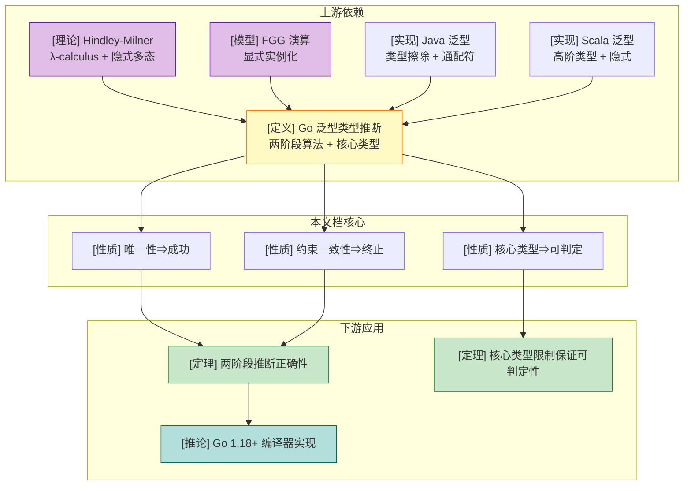
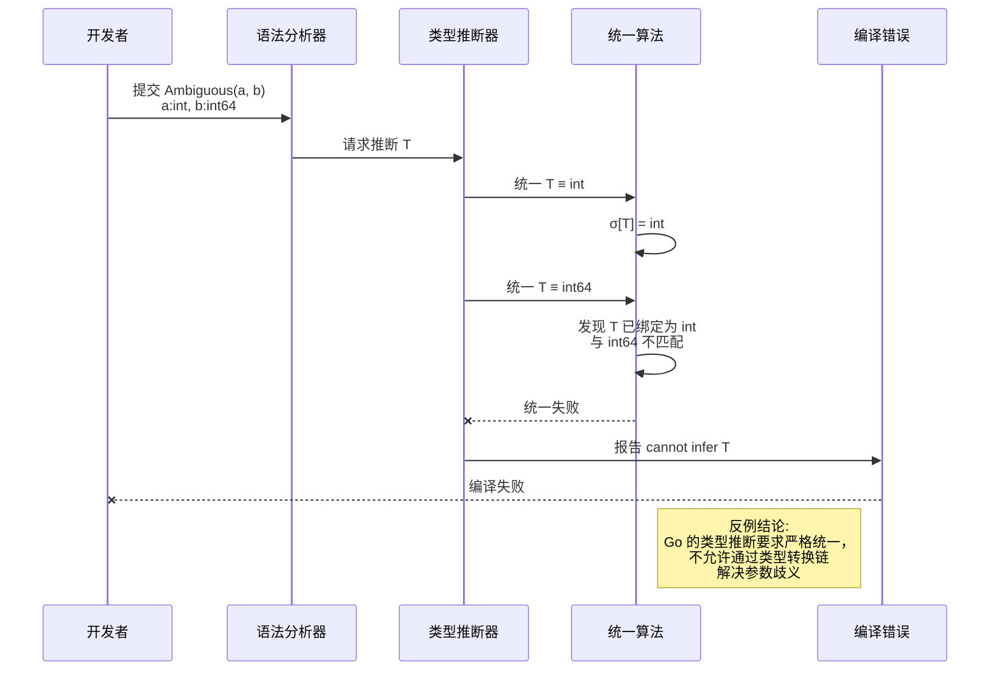

# Go 泛型类型推断完整形式化

> **位置**: `deep/02-language-analysis/Go-Generics-Type-Inference.md`
> **前置知识**: [Featherweight Generic Go (FGG)](./Go/05-Extension-Generics/FGG-Calculus.md)
> **关联可视化**: 详见本文末尾"关联可视化资源"

---

## 1. 概念定义 (Definitions)

### 1.1 泛型类型推断的核心定义

**定义 1 (Go 泛型类型推断)**:
Go 泛型类型推断是一个编译期算法，在泛型函数调用 `f(a₀, ..., aₙ)` 中，当部分或全部类型实参被省略时，从实参类型、返回类型上下文和类型约束中推导出被省略的类型实参。

```
类型推断输入:
  - 泛型函数签名: F = ∀(P̄:C̄).(T̄) → U
  - 调用表达式: f(a₀, ..., aₙ) 或 f[Ψ_partial](a₀, ..., aₙ)
  - 返回类型上下文: Ctx（赋值目标类型，若存在）

类型推断输出:
  - 类型替换 σ: {Pᵢ ↦ τᵢ}，或 ERROR
```

**直观解释**: 类型推断让编译器在调用泛型函数时自动"猜出"类型参数应该是什么，从而避免程序员写冗长的类型标注。

**定义动机**: 如果没有类型推断，每次调用泛型函数都需要显式写出所有类型实参（如 `dedup[Slice, int](s)`），这会显著降低代码可读性和编写效率。类型推断通过编译期约束求解，在保持类型安全的前提下提升 ergonomics，是泛型系统从"可用"到"好用"的关键。

---

**定义 1.1 (类型参数推断 Type Parameter Inference)**:
对于泛型函数 `func f[P₁ C₁, ..., Pₙ Cₙ](x₁ T₁, ..., xₘ Tₘ) U`，类型参数推断是从调用上下文到类型替换的映射：

```
σ = MGU( { typeof(xᵢ) ≡ₐ typeof(aᵢ) } ∪ { Pⱼ ≡c Cⱼ } )
```

其中 `≡ₐ` 表示赋值兼容（assignable），`≡c` 表示约束满足（constraint satisfaction），`MGU` 表示最一般统一子（Most General Unifier）。

**直观解释**: 类型参数推断就是解一个方程组——每个实参类型给出一个方程，每个约束也给出一个方程，求解这个方程组得到类型参数的值。

**定义动机**: 类型参数是泛型抽象的基石，但类型参数本身没有运行时存在。类型参数推断使得程序员可以在不牺牲静态类型安全的情况下，以接近普通函数调用的简洁语法使用泛型函数。

---

**定义 1.2 (类型约束满足 Constraint Satisfaction)**:
类型参数 `P` 的约束 `C` 被具体类型 `τ` 满足，记为 `τ ⊨ C`，当且仅当：

```
τ ⊨ interface { spec* }  ⇔  ∀spec ∈ spec*, τ ⊨ spec

τ ⊨ m(x₁ t₁, ..., xₙ tₙ) t_r    ⇔  τ 实现了方法 m
τ ⊨ t₁ | t₂ | ...               ⇔  ∃i, τ ⊨ tᵢ
τ ⊨ ~t                          ⇔  underlying(τ) = underlying(t)
```

**直观解释**: 类型约束是类型参数的"准入门槛"——它规定了哪些类型可以替换这个类型参数。

**定义动机**: 如果没有约束，所有类型参数都等价于 `any`，无法表达"T 必须支持比较"或"T 必须实现 String()"等关键限制。约束系统使得泛型代码在实例化时能够获得足够的方法信息，从而保证单态化后的方法调用是良定义的。

---

**定义 1.3 (核心类型 Core Types)**:
对于类型约束 `C`，其核心类型 `core(C)` 定义为：

```
core(C) = τ  若 C 的类型集合中所有元素的底层类型都相同为 τ
core(C) = ⊥  否则（类型集合包含多个不同底层类型，或无核心类型）
```

**直观解释**: 核心类型是约束能够"唯一确定"的底层类型。如果约束允许 `~int | ~float64`，则没有核心类型；如果约束只允许 `~[]byte`，则核心类型是 `[]byte`。

**定义动机**: 核心类型限制是 Go 类型推断可判定性的关键设计。如果没有核心类型限制，编译器可能需要处理无限多种底层类型的组合，导致约束求解不可判定或需要复杂的高阶统一算法。核心类型将约束求解限制在语法层面可计算的范围内。

---

**定义 1.4 (两阶段推断算法 Two-Phase Inference)**:
Go 1.18+ 的类型推断分为两个阶段：

**阶段 1 (函数参数推断 / Function Argument Inference)**:
从函数调用的实参类型推断类型参数：

```
σ₁ = Unify( { typeof(pᵢ) ≡ₐ typeof(aᵢ) } )
```

**阶段 2 (约束类型推断 / Constraint Type Inference)**:
对于阶段 1 未推断出的类型参数，从其约束的核心类型推断：

```
σ₂ = { Pⱼ ↦ core(Cⱼ) | Pⱼ ∉ dom(σ₁) ∧ core(Cⱼ) ≠ ⊥ }
```

最终替换为 `σ = σ₁ ∘ σ₂`（组合），然后验证所有约束满足。

**直观解释**: 第一阶段先看函数参数能告诉我们什么，第二阶段再看类型约束能告诉我们什么，最后把两部分结果拼起来。

**定义动机**: 单阶段推断无法处理"类型参数只出现在返回类型或约束中"的情况。两阶段设计将"从实参推断"和"从约束推断"解耦，既保证了常见情况下的推断能力，又避免了复杂的全局约束求解。这是 Go 在推断能力和实现复杂度之间的刻意权衡。

---

### 1.2 Go 1.18+ 推断与 FGG 推断的关系

**定义 2 (FGG 推断与 Go 推断的映射)**:
FGG 演算中的类型推断是 Go 1.18+ 类型推断的简化模型。FGG 要求所有类型实参显式提供（即无推断），而 Go 1.18+ 在 FGG 基础上增加了两阶段推断算法。

```
FGG 调用:  f[τ₁, ..., τₙ](e₁, ..., eₘ)    // 必须显式
Go 调用:   f(e₁, ..., eₘ)                  // 可省略类型实参
```

**关系**: Go 1.18+ 推断 `↦` FGG 显式实例化。对于任何通过 Go 类型推断成功的调用 `f(args)`，存在唯一的显式实例化 `f[σ(P̄)](args)` 使得该调用在 FGG 中是良类型的。

**直观解释**: FGG 是"没有推断的泛型 Go"，Go 1.18+ 是在 FGG 前面加了一个自动推断层。任何推断成功的调用都可以翻译成一个显式写全类型参数的 FGG 调用。

**定义动机**: FGG 作为最小可证明核心，省略了类型推断以简化形式化证明。但在工程实现中，没有推断的泛型系统可用性极差。该定义建立了"工程实现"与"形式化核心"之间的精确映射，使得我们可以分别证明 FGG 的类型安全和 Go 推断算法的正确性，然后将两者组合。

---

### 1.3 推断失败的原因分类

**定义 3 (推断失败分类)**:
Go 泛型类型推断失败分为三类：

**类型 A — 歧义 (Ambiguity)**:
存在多个不同的类型替换 `σ₁ ≠ σ₂` 都使调用类型正确，且没有额外的优先级规则可以打破平局。

```
∃σ₁, σ₂. σ₁ ≠ σ₂ ∧ ∀i, σ₁(Pᵢ) ≠ σ₂(Pᵢ) ∧ 调用在两者下都良类型
```

**类型 B — 约束不满足 (Constraint Violation)**:
从实参类型推断出的候选类型不满足对应类型参数的约束。

```
∃Pⱼ. σ(Pⱼ) = τ ∧ τ ⊭ Cⱼ
```

**类型 C — 循环依赖 (Cyclic Dependency)**:
类型参数之间相互依赖，导致约束求解无法推进。

```
∃Pᵢ, Pⱼ. Pᵢ 的约束依赖于 Pⱼ ∧ Pⱼ 的约束依赖于 Pᵢ
```

**直观解释**: 推断失败不是"编译器不够聪明"，而是程序本身没有提供足够的信息（歧义）、提供了矛盾的信息（约束不满足）、或信息组织成了死锁结构（循环依赖）。

**定义动机**: 对推断失败进行精确分类，是设计友好错误消息和调试工具的基础。程序员需要知道失败是因为"信息不足"（加显式类型参数即可解决）还是"逻辑矛盾"（需要修改程序设计）。分类也为编译器实现提供了清晰的错误报告路径。

---

## 2. 属性推导 (Properties)

**性质 1 (唯一性保证推断成功)**:
若对于泛型函数调用，存在唯一的类型替换 σ 使得调用类型正确，则 Go 的两阶段类型推断算法成功返回 σ（或一个与 σ 赋值等价的替换）。

**推导**:

1. 由定义 1.4，阶段 1 从实参类型收集等式约束。若 σ 唯一，则这些约束的解空间是单点集 {σ}。
2. 统一算法（Unify）在约束一致时返回最一般统一子。单点解空间意味着 MGU 就是 σ。
3. 阶段 2 对剩余未推断参数从约束的核心类型推断。若 σ 唯一，则剩余参数的核心类型必然等于 σ 中的对应值。
4. 组合后的替换经过约束验证，由于 σ 使调用类型正确，验证必然通过。
5. 因此算法成功返回 σ。∎

---

**性质 2 (约束一致性保证推断终止)**:
对于任何良类型的泛型函数声明和任何具体调用，两阶段类型推断算法在 O(k²) 步内终止，其中 k 是类型参数的数量。

**推导**:

1. 阶段 1 的每次统一操作要么确定一个类型参数的值（将其加入 dom(σ)），要么发现结构不匹配而失败。
2. 由于类型参数数量 k 有限，最多经过 k 次变量绑定，所有类型参数都被确定或进入阶段 2。
3. 阶段 2 对每个未确定的类型参数直接查询其核心类型，这是一个 O(1) 的语法操作（底层类型计算）。
4. 最后的约束验证需要对 k 个类型参数逐一检查，耗时 O(k)。
5. 因此总步数上界为 O(k²)（统一阶段最坏情况下每步处理 O(k) 个参数）。∎

---

**性质 3 (核心类型限制保证推断可判定性)**:
在核心类型限制下，判断"类型参数 P 是否可以从其约束 C 推断"是可判定的。

**推导**:

1. 由定义 1.3，core(C) 的计算归结为检查 C 的类型集合中所有元素的底层类型是否相同。
2. Go 的底层类型计算 `underlying(τ)` 是语法上的递归定义：对于命名类型，展开其定义；对于内置类型，直接返回自身。
3. 由于 Go 禁止无限递归的类型定义（如 `type T struct { T }` 非法），底层类型计算必然在有限步内终止。
4. 因此，core(C) 的计算是可判定的，从而"能否从约束推断"也是可判定的。∎

---

**性质 4 (两阶段推断的确定性)**:
对于固定的泛型函数声明和调用表达式，两阶段类型推断算法要么总是成功并返回相同的替换，要么总是失败并报告相同的错误。不存在非确定性行为。

**推导**:

1. 阶段 1 的统一算法按固定顺序处理实参（从左到右），每次绑定都是确定性的：若 `P` 未绑定，则 `σ[P] = τ`。
2. 阶段 2 的核心类型查询是纯粹的语法函数，无随机性。
3. 约束验证阶段对所有类型参数进行确定性检查。
4. 由于算法每一步都是确定性的函数，整体算法是确定性的。∎

---

## 3. 关系建立 (Relations)

### 3.1 Go 泛型推断与 Hindley-Milner 的关系

**关系 1**: Go 泛型类型推断 `⊂` Hindley-Milner (HM) 推断

**论证**:

- **编码存在性**: 任何 Go 泛型函数调用都可以编码为 HM 系统中的 let-多态表达式。Go 的 `func f[T any](x T) T` 对应 HM 中的 `λx.x : ∀α.α → α`。
- **分离结果**: HM 算法支持隐式多态、高阶函数的无限制推断，以及通过 let-绑定的多态递归。Go 泛型推断不支持：
  - 泛型类型的隐式实例化（Go 要求显式或从上下文推断）
  - 多态递归（Go 的类型参数不能递归引用自身）
  - 无限制的高阶泛型推断（Go 对类型参数的使用有严格限制）
- **核心差异**: HM 算法基于无限制的一阶统一，而 Go 引入了核心类型限制和接口约束，故意限制了推断的表达能力以换取可判定性和实现简单性。

### 3.2 Go 泛型推断与 Scala/Java 泛型推断的关系

**关系 2**: Go 泛型类型推断 `⊥` Scala 隐式推断 / Java 泛型推断

**论证**:

- **与 Java 对比**: Java 泛型推断基于类型擦除和调用链上下文（target typing），支持从赋值目标类型推断（如 `List<String> list = new ArrayList<>()`）。Go 也支持从返回类型上下文推断，但 Java 的推断系统更复杂，支持通配符（`? extends T`）的推断，而 Go 不支持变型。两者无严格包含关系。
- **与 Scala 对比**: Scala 的推断基于局部类型推断（Local Type Inference）和隐式解析，表达能力远强于 Go（支持高阶类型、路径依赖类型、隐式参数的联合推断）。但 Scala 的推断在某些情况下是不可判定的（如高阶隐式解析），而 Go 的推断总是可判定的。
- **结论**: 三者在设计目标上存在根本差异——Go 追求简单和可判定性，Java 追求与现有擦除模型的兼容，Scala 追求表达能力的极限。因此它们之间不可直接比较（`⊥`）。

### 3.3 多维矩阵对比图

| 特性 | Go 泛型推断 | HM 推断 | Java 泛型推断 | Scala 隐式推断 | 推导依据 |
|------|------------|---------|--------------|---------------|---------|
| 可判定性 | ✅ 总是 | ✅ 总是 | ✅ 总是 | ❌ 不总是 | Go/HM/Java 有算法保证；Scala 高阶隐式可能不终止 |
| 高阶泛型推断 | ❌ 受限 | ✅ 完整 | ⚠️ 部分 | ✅ 完整 | Go 核心类型限制排除复杂高阶场景 |
| 隐式多态 | ❌ 无 | ✅ 有 | ⚠️ 擦除后 | ✅ 有 | HM/Scala 支持真正的参数多态；Go 需显式实例化 |
| 变型推断 | ❌ 不支持 | N/A | ✅ 通配符 | ✅ 路径依赖 | Go 故意不支持变型以简化设计 |
| 约束类型推断 | ✅ 核心类型 | ❌ 无约束 | ⚠️ 边界类型 | ✅ 高阶约束 | Go 的核心类型是独特设计 |
| 运行时开销 | ✅ 零 | N/A | ❌ 擦除+装箱 | ❌ JVM 擦除 | Go 单态化 vs Java/Scala 擦除 |

### 3.4 概念依赖图



**图说明**:

- 本图展示了 Go 泛型类型推断在知识体系中的位置：上游依赖 HM 的理论基础、FGG 的形式化模型，以及与 Java/Scala 的工程实现对比。
- 核心定理（两阶段推断正确性、核心类型可判定性）是连接理论与 Go 1.18+ 编译器实现的桥梁。
- 详见 [FGG-Calculus](./Go/05-Extension-Generics/FGG-Calculus.md)

---

## 4. 论证过程 (Argumentation)

### 4.1 两阶段推断的辅助引理

**引理 4.1 (类型方程收集的完备性)**:
对于泛型函数调用 `f(a₀, ..., aₙ)`，设 `f` 的形参类型为 `p₀, ..., pₙ`。从实参类型构建的类型方程集合 `E = { typeof(pᵢ) ≡ₐ typeof(aᵢ) }` 包含了推断所有类型参数所需的全部信息（当这些信息存在于函数参数中时）。

**证明**:

1. **前提分析**: 每个实参 `aᵢ` 在类型检查阶段已被赋予具体类型 `τᵢ`。形参类型 `pᵢ` 可能包含类型参数 `P̄`。
2. **构造/推导**: 方程 `typeof(pᵢ) ≡ₐ typeof(aᵢ)` 表达了"实参类型必须能够赋值给形参类型"这一类型规则要求。
3. **信息完备性**: 若某个类型参数 `Pⱼ` 出现在形参类型中，则对应的方程会将 `Pⱼ` 与具体类型 `τᵢ` 关联起来。若 `Pⱼ` 不出现在任何形参类型中，则函数参数本身不包含推断 `Pⱼ` 的信息。
4. **结论**: 方程集合 `E` 精确捕获了函数参数能够提供的所有推断信息。∎

---

**引理 4.2 (统一算法在核心类型限制下的终止性)**:
在核心类型限制下，统一算法 `Unify` 对任何输入都在有限步内终止。

**证明**:

1. **前提分析**: 统一算法的输入是两个类型 `T` 和 `U`，以及替换 `σ`。算法通过递归分解类型结构或绑定类型参数来推进。
2. **终止度量**: 定义度量 `μ = (|unbound_params|, |type_size|)`，其中 `unbound_params` 是尚未绑定的类型参数集合，`type_size` 是待统一类型的语法大小。
3. **归纳分析**:
   - 若规则是变量绑定（`P ↦ τ`），则 `|unbound_params|` 严格减少。
   - 若规则是结构统一（如 `[]T ≡ []U`），则 `|type_size|` 严格减少（从容器类型深入到元素类型）。
   - 核心类型限制确保了不会出现需要无限展开的类型结构（如高阶类型构造器的无限嵌套）。
4. **结论**: 度量 `μ` 在字典序下严格递减，且下界为 `(0, 0)`。因此算法必然终止。∎

> **推断 [Theory→Model]**: 由于 HM 理论中的一阶统一是可判定的（理论结果），Go 的核心类型限制（模型设计）将推断问题约束在一阶统一的子集内。
>
> **推断 [Model→Implementation]**: 因此 Go 1.18+ 编译器在实现层面可以使用确定性的两阶段算法，无需引入复杂的高阶统一或回溯搜索机制。

---

## 5. 形式证明 (Proofs)

### 5.1 Go 两阶段类型推断算法的正确性

**定理 5.1 (两阶段类型推断正确性)**:
设 `f` 是一个良类型的泛型函数，`f(args)` 是一个调用表达式。若两阶段推断算法返回替换 `σ`，则 `f[σ(P̄)](args)` 是良类型的；若算法报告失败，则不存在使调用良类型的替换。

**证明**:

**步骤 1: 定义良类型调用的条件**
调用 `f[σ(P̄)](args)` 良类型，当且仅当：

1. 对每个实参 `aᵢ`，有 `typeof(aᵢ) ≺ σ(typeof(pᵢ))`（`≺` 表示赋值兼容）
2. 对每个类型参数 `Pⱼ`，有 `σ(Pⱼ) ⊨ Cⱼ`
3. 若存在返回类型上下文 `Ctx`，则 `σ(U) ≺ Ctx`

**步骤 2: 证明 "成功 ⇒ 良类型"**
假设算法返回 `σ`。

- 由引理 4.1，阶段 1 的统一算法确保了所有从实参生成的方程被满足，即 `typeof(aᵢ) ≺ σ(typeof(pᵢ))`。
- 阶段 2 对未推断参数从核心类型推断，确保 `σ(Pⱼ) = core(Cⱼ)` 或保持未变。
- 最后的约束验证步骤显式检查 `σ(Pⱼ) ⊨ Cⱼ` 对所有 `j` 成立。
- 若存在返回类型上下文，编译器还会检查 `σ(U) ≺ Ctx`。
- 因此，条件 1-3 全部满足，`f[σ(P̄)](args)` 良类型。

**步骤 3: 证明 "良类型 ⇒ 算法成功或等价"（完备性草图）**
假设存在某个替换 `σ*` 使调用良类型。

- 则 `σ*` 满足所有实参方程 `typeof(aᵢ) ≺ σ*(typeof(pᵢ))`。
- 阶段 1 的统一算法寻找最一般统一子。若方程系统一致，则 MGU `σ₁` 存在，且 `σ*` 是 `σ₁` 的实例化（`σ* = σ₁ ∘ θ` 对某个 `θ`）。
- 对于 `σ*` 中已确定但 `σ₁` 未确定的参数，阶段 2 从核心类型推断。若这些参数在 `σ*` 中的值等于其核心类型，则阶段 2 成功。
- 若存在某个参数 `Pⱼ` 在 `σ*` 中的值不等于 `core(Cⱼ)` 且无法从实参推断，则该参数的信息不存在于调用中，Go 的算法选择保守策略（报告失败）而非猜测。
- 因此，Go 算法可能因信息不足而失败，但不会错误地接受不良类型的调用。

**步骤 4: 结论**
算法返回的 `σ` 保证调用良类型；算法失败时，要么不存在合法替换，要么存在合法替换但信息不足（保守失败）。∎

**关键案例分析**:

- **案例 A: 部分显式类型参数**
  - 调用 `f[int](args)` 中，阶段 1 开始前 `σ` 已包含 `P₀ ↦ int`。统一算法在遇到 `P₀` 时直接使用已知绑定。这不会影响其他参数的推断。
  - 若显式提供的参数与实参类型冲突（如 `f[int]("hello")`），统一算法在阶段 1 即发现 `int` 与 `string` 不统一，报告失败。

- **案例 B: 返回类型上下文推断**
  - 对于 `var x int64 = convert(x, int32(0))`，阶段 1 从实参推断 `A=int64, B=int32`。返回类型上下文 `int64` 与 `B=int32` 冲突时，统一算法会检测到矛盾并失败。

---

### 5.2 核心类型限制保证推断可判定性

**定理 5.2 (核心类型限制保证推断可判定性)**:
对于任何 Go 泛型函数声明中的类型约束 `C`，判断 `core(C)` 是否定义（即 `core(C) ≠ ⊥`）是可判定的。因此，在核心类型限制下，Go 泛型类型推断问题是可判定的。

**证明**:

**步骤 1: 核心类型计算的可判定性**
由定义 1.3，`core(C)` 的计算需要：

1. 枚举 `C` 的类型集合 `typeset(C)` 中的所有元素
2. 计算每个元素的底层类型 `underlying(t)`
3. 检查所有底层类型是否相同

**步骤 2: 类型集合的有限性**

- FGG 和 Go 的约束 `C` 是有限接口规范的组合（定义 3，FGG-Calculus）。
- `typeset(C)` 由有限个方法规范、类型并集项和底层类型约束组成。
- 类型并集项 `t₁ | t₂ | ... | tₙ` 是有限的（n 有限）。
- 因此，`typeset(C)` 的表示是有限的。

**步骤 3: 底层类型计算的可判定性**

- `underlying(τ)` 是语法递归函数：
  - `underlying(builtin) = builtin`
  - `underlying(named_type) = underlying(定义体)`
  - `underlying([]T) = []underlying(T)`
  - `underlying(struct{...}) = struct{...}`
- Go 禁止无限递归的类型定义（编译器会检测类型循环）。
- 因此，`underlying(τ)` 的递归展开必然在有限步内到达基本类型或结构体类型，计算终止。

**步骤 4: 整体推断的可判定性**

- 阶段 1 的统一算法基于一阶项统一，其可判定性已由 Robinson (1965) 证明。
- 阶段 2 的核心类型查询由步骤 1-3 保证可判定。
- 约束验证归结为有限个约束满足判断，每个都是可判定的（FGG-Calculus 性质 2）。
- 因此，两阶段算法整体是可判定的。∎

**关键案例分析**:

- **案例 A: 无核心类型的约束**
  - `C = interface { ~int | ~float64 }`。`typeset(C)` 包含 `int` 和 `float64`，`underlying(int) = int ≠ float64 = underlying(float64)`。因此 `core(C) = ⊥`。
  - 若类型参数 `P` 受此约束且未从实参推断，阶段 2 无法推断 `P`，算法报告失败。这是可判定的失败。

- **案例 B: 有核心类型的约束**
  - `C = interface { ~[]byte }`。`typeset(C)` 中所有元素的底层类型都是 `[]byte`。`core(C) = []byte`。
  - 若 `P` 未从实参推断，阶段 2 直接推断 `P = []byte`。这是可判定的成功。

---

### 5.3 决策树图：Go 两阶段类型推断流程

```mermaid
graph TD
    Start([开始推断<br/>f(args) 或 f[Ψ](args)]) --> Q1{是否提供<br/>部分显式类型参数?}
    Q1 -->|是| A1[将显式参数<br/>加入初始 σ]
    Q1 -->|否| A2[σ ← {}]
    A1 --> Q2
    A2 --> Q2{阶段1:<br/>从函数实参推断}

    Q2 -->|对每个实参 aᵢ| Q3{能否建立<br/>唯一等式约束?}
    Q3 -->|是| Q4{统一后是否<br/>满足所有约束?}
    Q4 -->|是| A3[阶段1成功<br/>σ₁ 确定]
    Q4 -->|否| A4([推断失败<br/>报告约束不满足])
    Q3 -->|否| Q5{是否存在<br/>歧义解?}
    Q5 -->|是| A6([推断失败<br/>报告类型参数歧义])
    Q5 -->|否| A3

    A3 --> Q6{阶段2:<br/>有未推断参数?}
    Q6 -->|是| Q7{约束是否有<br/>定义的核心类型?}
    Q7 -->|是| Q8{核心类型是否<br/>满足约束?}
    Q8 -->|是| A7[阶段2成功<br/>σ₂ 确定]
    Q8 -->|否| A4
    Q7 -->|否| A9([推断失败<br/>报告 cannot infer T])

    Q6 -->|否| A7
    A7 --> Q9{最终验证:<br/>返回类型上下文<br/>是否兼容?}
    Q9 -->|是| A10([推断成功<br/>返回 σ = σ₁ ∘ σ₂])
    Q9 -->|否| A4

    style Start fill:#e1bee7,stroke:#6a1b9a
    style A10 fill:#c8e6c9,stroke:#2e7d32
    style A4 fill:#ffcdd2,stroke:#c62828
    style A6 fill:#ffcdd2,stroke:#c62828
    style A9 fill:#ffcdd2,stroke:#c62828
```

**图说明**:

- 本图展示了 Go 编译器执行两阶段类型推断的完整决策流程。
- 菱形节点表示判断条件，矩形节点表示中间状态，椭圆形节点表示最终结论。
- 阶段 1 优先从实参推断，阶段 2 从约束核心类型补充，最后进行返回类型上下文验证。
- 三个失败路径分别对应：约束不满足、类型参数歧义、信息不足无法推断。

---

## 6. 实例与反例 (Examples & Counter-examples)

### 6.1 正例：dedup 函数的完整推断

**示例 6.1: dedup 的类型推断**

```go
func dedup[S ~[]E, E comparable](s S) S

type Slice []int
var s Slice
result := dedup(s)
```

**逐步推导**:

1. 调用 `dedup(s)` 无显式类型参数，进入两阶段推断。
2. 阶段 1: 实参 `s` 的类型为 `Slice`，建立方程 `S ≡ₐ Slice`。统一得 `σ₁(S) = Slice`。
3. 阶段 1 继续检查约束：`Slice ≡c ~[]E`。`underlying(Slice) = []int`，匹配 `~[]E`，推断 `E = int`。
4. 阶段 2: 所有参数已推断，无需补充。
5. 最终验证：`dedup[Slice, int](s)` 良类型，推断成功。

---

### 6.2 反例 1：类型参数歧义

**反例 6.1: 歧义导致推断失败**

```go
func Ambiguous[T any](x T, y T) T {
    return x
}

func main() {
    var a int
    var b int64
    _ = Ambiguous(a, b) // 编译错误：cannot infer T
}
```

**分析**:

- **违反的前提**: 函数参数要求 `T` 同时赋值兼容于 `int` 和 `int64`。虽然 `int` 和 `int64` 都可以隐式转换，但 Go 的类型推断要求统一（unification），而非子类型/转换链。
- **导致的异常**: 统一算法发现 `int` 和 `int64` 是不同命名类型，无法统一为同一个 `T`。编译器报告 `cannot infer T`。
- **结论**: 当实参类型无法统一为单一类型时，即使存在某种"更一般"的类型（如 `any`），Go 也不会选择它，因为那样会破坏类型安全（返回类型将变为 `any`）。这是 Go 推断保守性的体现。

---

### 6.3 反例 2：核心类型限制过于严格

**反例 6.2: 核心类型限制排除合法程序**

```go
func FromBytes[T interface{ ~[]byte | ~string }]() T {
    var zero T
    return zero
}

func main() {
    // 以下调用在 Go 1.18+ 中无法推断：
    // _ = FromBytes() // 编译错误：cannot infer T

    // 必须显式指定：
    _ = FromBytes[[]byte]()
}
```

**分析**:

- **违反的前提**: 约束 `interface{ ~[]byte | ~string }` 没有核心类型，因为 `[]byte` 和 `string` 的底层类型不同。
- **导致的异常**: 阶段 1 无实参可提供推断信息，阶段 2 发现 `core(C) = ⊥`，无法推断 `T`。编译器报告 `cannot infer T`。
- **结论**: 这是一个"合法但无法推断"的场景。程序 `FromBytes[[]byte]()` 和 `FromBytes[string]()` 都是完全类型正确的，但由于约束允许两种完全不同的底层类型，编译器无法自动选择。核心类型限制在这里过于严格，迫使程序员显式标注。这是 Go 在"推断能力"与"算法可判定性"之间做出的明确权衡。

---

### 6.4 反例 3：高阶泛型函数推断失败

**反例 6.3: 高阶泛型函数的边界场景**

```go
func Map[F any, T any](src []F, fn func(F) T) []T {
    // ...
    return nil
}

func Transform[T any](x T) T { return x }

func main() {
    nums := []int{1, 2, 3}

    // 推断成功：从 src 推断 F=int，从 fn 的签名推断 T=int
    _ = Map(nums, Transform[int])

    // 推断失败：无法从 Transform 推断 T
    // _ = Map(nums, Transform) // 编译错误：cannot infer T
}
```

**分析**:

- **违反的前提**: 当传递 `Transform`（未实例化的泛型函数）作为参数时，Go 不会自动实例化 `Transform` 以匹配 `Map` 的期望类型 `func(int) T`。
- **导致的异常**: 统一算法将 `Transform`（一个泛型函数类型 `∀T.any(T) T`）与 `func(int) T` 进行统一时，无法确定 `T` 的值，因为 `Transform` 本身还未实例化。编译器报告 `cannot infer T`（或类似的实例化错误）。
- **结论**: Go 的类型推断不执行"高阶泛型函数的自动实例化"。这与 HM 算法形成鲜明对比——HM 可以推断 `map f xs` 中 `f` 的类型。Go 的限制避免了编译器需要处理泛型函数类型与具体函数类型之间的复杂高阶统一，但损失了部分表达能力。

> **推断 [Control→Execution]**: 由于 Go 编译器的类型推断策略（控制层）禁止高阶泛型函数的自动实例化，执行层的单态化器无需生成隐式的泛型函数实例化代码。
>
> **推断 [Execution→Data]**: 因此运行时不会出现"隐式实例化导致的方法查找歧义"，保证了数据层（程序状态和输出）的确定性。

---

### 6.5 反例场景图：类型参数歧义



**图说明**:

- 本图展示了反例 6.1 的执行流程：开发者调用 `Ambiguous(a, b)`，统一算法因 `int` 和 `int64` 无法统一而失败。
- "违反的前提"是"实参类型可以统一为单一类型"。
- "导致的异常"是编译器报告推断失败。
- 结论是 Go 的类型统一是语法上的严格匹配，而非基于可转换性的松弛匹配。

---

## 7. 关联可视化资源

本文档涉及的可视化资源已按项目规范归档，详见项目根目录的 [`VISUAL-ATLAS.md`](../../../VISUAL-ATLAS.md)。

建议关联查看的可视化条目：

- `mindmaps/Go-Generics-Inference-Concept-Map.mmd` — Go 泛型推断概念依赖图
- `decision-trees/Go-Two-Phase-Inference-Decision-Tree.mmd` — Go 两阶段类型推断决策流程
- `counter-examples/Go-Generics-Inference-Ambiguity.mmd` — 类型参数歧义反例场景图

---

**参考文献**:

1. Go Authors. (2026). *Type Inference in Go*. go.dev/ref/spec.
2. Go Authors. (2025). *Go 1.25 Type Inference Improvements*.
3. Griesemer, R., et al. "Featherweight Generic Go." *OOPSLA 2021*.
4. Cardelli, L. (1987). *Basic Polymorphic Typechecking*. Science of Computer Programming.
5. Robinson, J. A. (1965). *A Machine-Oriented Logic Based on the Resolution Principle*. Journal of the ACM.
