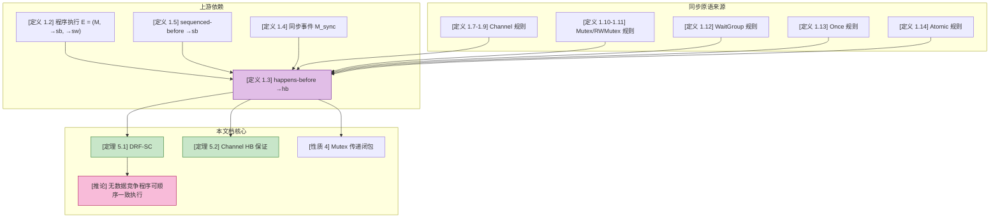
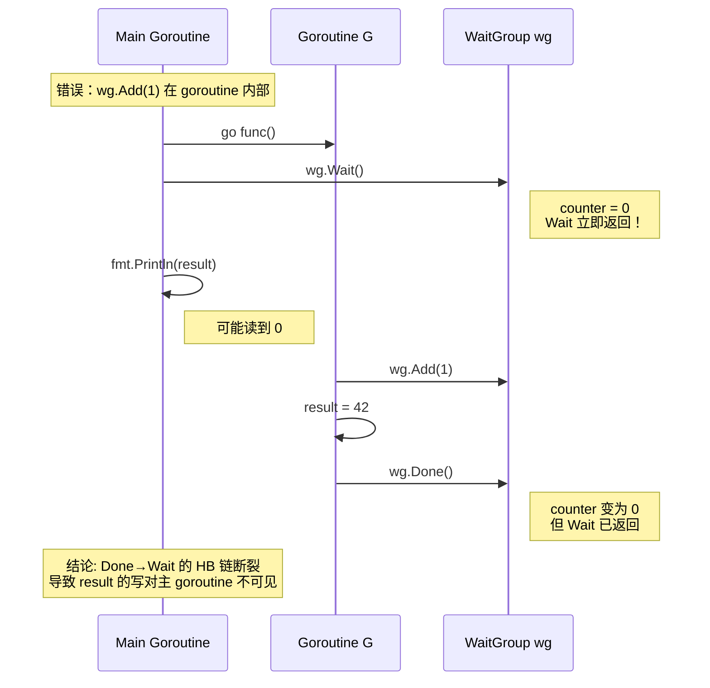
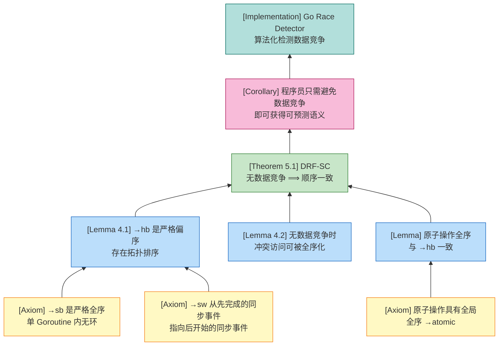

# Go 内存模型形式化 (Go Memory Model Formalization)

> **版本**: 2026.03 | **理论深度**: L4 | **形式化等级**: 完整 SOS + DRF-SC 定理
> **适用范围**: Go 1.22+ 内存模型规范

---

## 1. 概念定义 (Definitions)

### 1.1 核心形式化定义

**定义 1.1** (内存操作, Memory Operation).

$$
m = (k, l, v, t)
$$

其中：

- $k \in \{\text{read}, \text{write}, \text{atomic\_read}, \text{atomic\_write}, \text{mutex\_lock}, \text{mutex\_unlock}, \text{chan\_send}, \text{chan\_recv}, \text{chan\_close}\}$: 操作类型
- $l$: 内存位置（变量地址或通道标识）
- $v$: 读/写的值（对于同步操作可为 $\bot$）
- $t \in \mathbb{T}$: 执行线程（Goroutine）标识

**直观解释**：将程序执行抽象为带线程标签的内存/同步操作事件序列，剥离控制流细节，保留并发语义所需的最小信息。

**定义动机**：如果不将内存操作抽象为原子事件，就无法在事件之间建立严格的偏序关系。该抽象是定义 happens-before、数据竞争和顺序一致性的最小不可约基础。

---

**定义 1.2** (程序执行, Program Execution).

$$
E = (M, \rightarrow_{sb}, \rightarrow_{sw})
$$

其中：

- $M$: 程序执行中所有内存操作的集合
- $\rightarrow_{sb} \subseteq M \times M$: sequenced-before 关系（单 Goroutine 内的程序序）
- $\rightarrow_{sw} \subseteq M \times M$: synchronizes-with 关系（跨 Goroutine 的同步边）

**直观解释**：一个程序执行不仅是操作集合，更是一张由程序序和同步边构成的有向图。

**定义动机**：仅列举操作无法刻画并发交互的因果结构。引入二元关系后，才能用图论工具（传递闭包、拓扑排序）分析并发程序的可观察行为。

---

**定义 1.3** (Happens-Before).

Happens-before 关系 $\rightarrow_{hb}$ 是 $\rightarrow_{sb} \cup \rightarrow_{sw}$ 的传递闭包：

$$
\rightarrow_{hb} \; = \; (\rightarrow_{sb} \cup \rightarrow_{sw})^+
$$

即：$a \rightarrow_{hb} b$ 当且仅当存在有限序列 $a = m_0, m_1, \dots, m_n = b$，使得对每个 $i < n$，有 $m_i \rightarrow_{sb} m_{i+1}$ 或 $m_i \rightarrow_{sw} m_{i+1}$。

**直观解释**：如果 $a$ happens-before $b$，则 $a$ 的效应必须在 $b$ 发生之前对 $b$ 可见；编译器和 CPU 不能将 $b$ 重排到 $a$ 之前。

**定义动机**：现代编译器和处理器会对无依赖的内存操作进行乱序执行。happens-before 为程序员提供了一个与硬件无关的因果律，使得"这段代码一定在那段代码之前生效"成为可验证的数学命题。

---

**定义 1.4** (同步事件, Synchronization Event).

同步事件 $s \in M_{sync} \subseteq M$ 是指能够建立跨 Goroutine synchronizes-with 关系的操作：

$$
M_{sync} = \{ \text{go } f(), \text{chan\_send}, \text{chan\_recv}, \text{chan\_close}, \text{mutex\_lock}, \text{mutex\_unlock}, \text{once\_complete}, \text{atomic\_op} \}
$$

**直观解释**：同步事件是 happens-before 图中连接不同 Goroutine 的"桥梁"操作。

**定义动机**：普通读写操作不提供跨线程可见性保证。只有同步事件才能在执行图中建立跨 Goroutine 的边，从而将局部程序序扩展为全局因果序。

---

**定义 1.5** (Sequenced-Before).

对于同一 Goroutine $t$ 内的两个操作 $a, b \in M_t$，$a \rightarrow_{sb} b$ 当且仅当在 $t$ 的求值顺序中 $a$ 在 $b$ 之前发生，且 $a$ 和 $b$ 之间不存在未序列化的副作用（unsequenced side effects）。

**直观解释**：sequenced-before 就是单线程视角下的"按代码顺序执行"。

**定义动机**：单线程程序的行为由语言规范中的求值顺序决定。sequenced-before 将这一直觉形式化，成为 happens-before 在单 Goroutine 内的基础分量。

---

**定义 1.6** (数据竞争, Data Race).

两个内存访问 $m_1, m_2 \in M$ 构成数据竞争，当且仅当：

1. **同一位置**：$\text{loc}(m_1) = \text{loc}(m_2)$
2. **至少一写**：$\text{isWrite}(m_1) \lor \text{isWrite}(m_2)$
3. **并发无 HB**：$\neg(m_1 \rightarrow_{hb} m_2) \land \neg(m_2 \rightarrow_{hb} m_1)$
4. **非原子访问**：$\neg\text{isAtomic}(m_1) \land \neg\text{isAtomic}(m_2)$

**直观解释**：如果两个 Goroutine 对同一变量进行非原子访问（至少一个是写），且语言规范无法保证它们的先后顺序，则程序存在数据竞争。

**定义动机**：数据竞争是并发程序中最隐蔽的 bug 来源。将其形式化后，可以设计算法化检测工具（如 Go race detector），并建立"无数据竞争程序具有顺序一致性"这一核心保证。

---

### 1.2 Channel 操作的 Happens-Before 规则

**定义 1.7** (无缓冲 Channel 发送-接收同步).

对于无缓冲 Channel $c$，若 Goroutine $G_1$ 执行发送 $c \leftarrow v$ 且 Goroutine $G_2$ 执行接收 $x \leftarrow c$ 并匹配成功，则：

$$
\text{send}(c, v) \rightarrow_{sw} \text{recv}(c, x)
$$

**直观解释**：无缓冲 Channel 的发送和接收是"握手"操作，发送完成 happens-before 接收完成。

**定义动机**：无缓冲 Channel 的核心语义是同步通信。发送方在接收方准备好之前阻塞，这一阻塞-唤醒机制天然构成了跨 Goroutine 的 happens-before 边。

---

**定义 1.8** (缓冲 Channel 第 $k$ 条规则).

对于容量为 $C$ 的缓冲 Channel $c$：

- 第 $k$ 次发送操作 $\text{send}_k(c, v)$ happens-before 第 $k$ 次接收操作 $\text{recv}_k(c, x)$ 的完成：
  $$
  \text{send}_k(c, v) \rightarrow_{sw} \text{recv}_k(c, x)
  $$
- 第 $k$ 次接收操作 $\text{recv}_k(c, x)$ happens-before 第 $k+C$ 次发送操作 $\text{send}_{k+C}(c, v')$ 的完成：
  $$
  \text{recv}_k(c, x) \rightarrow_{sw} \text{send}_{k+C}(c, v')
  $$

**直观解释**：缓冲 Channel 中，数据入队 happens-before 出队；而出队为后续入队腾出空间，因此第 $k$ 次出队 happens-before 第 $k+C$ 次入队。

**定义动机**：缓冲 Channel 引入了异步性，但异步不等于无序。该规则精确刻画了缓冲 Channel 中"槽位释放"与"后续写入"之间的因果关系，防止编译器错误地重排共享变量的访问。

---

**定义 1.9** (Channel 关闭同步).

对于 Channel $c$，若 Goroutine $G_1$ 执行 $\text{close}(c)$，且 Goroutine $G_2$ 从 $c$ 接收并返回零值（检测到关闭），则：

$$
\text{close}(c) \rightarrow_{sw} \text{recv}_{\text{zero}}(c)
$$

**直观解释**：Channel 关闭操作 happens-before 任何检测到该关闭的接收操作。

**定义动机**：关闭 Channel 常用于广播"任务结束"信号。如果关闭不保证 happens-before，接收方可能永远看不到关闭状态，导致 goroutine 泄漏或死锁。

---

### 1.3 `sync` 包原语的 Happens-Before 规则

**定义 1.10** (`sync.Mutex` Unlock/Lock 同步).

对于 `sync.Mutex` 变量 $\mu$，若 Goroutine $G_1$ 执行 $\mu.\text{Unlock}()$ 且后续 Goroutine $G_2$ 执行 $\mu.\text{Lock}()$ 并成功获取锁，则：

$$
\text{Unlock}(\mu) \text{ in } G_1 \rightarrow_{sw} \text{Lock}(\mu) \text{ in } G_2
$$

**直观解释**：Mutex 解锁 happens-before 后续成功的加锁。临界区内的写操作对下一个进入临界区的 Goroutine 可见。

**定义动机**：Mutex 是保护共享状态的最基本工具。Unlock→Lock 的 happens-before 保证是"临界区串行化"语义的核心，没有它，锁就退化为空操作。

---

**定义 1.11** (`sync.RWMutex` 规则).

对于 `sync.RWMutex` 变量 $\rho$：

- **写解锁 → 后续写/读加锁**：$\text{Unlock}(\rho) \rightarrow_{sw} \text{Lock}(\rho)$ 且 $\text{Unlock}(\rho) \rightarrow_{sw} \text{RLock}(\rho)$
- **读解锁 → 后续写加锁**：$\text{RUnlock}(\rho) \rightarrow_{sw} \text{Lock}(\rho)$
- **读解锁与后续读加锁之间无 synchronizes-with**

**直观解释**：RWMutex 允许多个读者并发，但写者必须等待所有读者退出；而新的读者不需要等待旧的读者（只须不阻塞写者即可）。

**定义动机**：RWMutex 的设计目标是提高读多写少场景的并发度。如果读解锁也同步后续读加锁，会引入不必要的串行化，抵消读写锁的性能优势。

---

**定义 1.12** (`sync.WaitGroup` 规则).

对于 `sync.WaitGroup` 变量 $wg$：

- **Add/Done → Wait**：若 Goroutine $G_1$ 调用 $wg.\text{Done}()$（或等价的使计数器归零的 $wg.\text{Add}(-n)$），且 Goroutine $G_2$ 调用 $wg.\text{Wait}()$ 并返回，则：
  $$
  \text{Done}(wg) \text{ in } G_1 \rightarrow_{sw} \text{Wait}(wg) \text{ in } G_2
  $$
- **Wait 返回时**：计数器必须已归零，且所有使计数器归零的 Done 操作均 happens-before Wait 返回。

**直观解释**：WaitGroup 的 Done 操作 happens-before Wait 的返回。被等待的 Goroutine 中的所有操作对等待方可见。

**定义动机**：WaitGroup 是 fork-join 并发的标准实现。Done→Wait 的 happens-before 保证确保了"子任务完成"这一事件对父 Goroutine 的可见性，是并行计算结果正确聚合的基础。

---

**定义 1.13** (`sync.Once` 规则).

对于 `sync.Once` 变量 $o$ 和函数 $f$：

- 若 $o.\text{Do}(f)$ 在某 Goroutine 中完成执行 $f()$，则对任何后续调用 $o.\text{Do}(f)$（无论发生在哪个 Goroutine），$f()$ 的完成 happens-before 该 $o.\text{Do}(f)$ 的返回：
  $$
  \text{completion}(f) \rightarrow_{sw} \text{return}(o.\text{Do}(f))
  $$

**直观解释**：`sync.Once` 保证初始化函数 $f$ 的完成对所有后续调用者可见，且 $f$ 仅执行一次。

**定义动机**：懒加载初始化是并发编程中的经典问题。`sync.Once` 通过 happens-before 消除了"双重检查锁"（DCL）模式的复杂性和潜在的数据竞争风险。

---

**定义 1.14** (`sync/atomic` 规则).

对于同一内存位置 $l$ 上的原子操作集合 $A_l = \{a_1, a_2, \dots\}$：

- 所有对 $l$ 的原子操作存在一个全局全序 $\rightarrow_{atomic}$：
  $$
  \forall a_i, a_j \in A_l. \; a_i \rightarrow_{atomic} a_j \lor a_j \rightarrow_{atomic} a_i
  $$
- 该全序与 happens-before 一致：
  $$
  a_i \rightarrow_{hb} a_j \Rightarrow a_i \rightarrow_{atomic} a_j
  $$
- 对 $l$ 的原子写 happens-before 任何后续（按 $\rightarrow_{atomic}$）对 $l$ 的原子读。

**直观解释**：同一变量上的原子操作像被一把"全局锁"串行化，所有线程看到的修改顺序一致。

**定义动机**：原子操作用于实现无锁算法（如计数器、标志位）。全局全序保证了即使不使用显式锁，多个 Goroutine 对同一变量的观察也不会出现矛盾的历史。

---

## 2. 属性推导 (Properties)

**性质 1** (Happens-Before 的传递性).

若 $a \rightarrow_{hb} b$ 且 $b \rightarrow_{hb} c$，则 $a \rightarrow_{hb} c$。

**推导**：

1. 由定义 1.3，$\rightarrow_{hb}$ 是 $(\rightarrow_{sb} \cup \rightarrow_{sw})^+$，即关系并集的传递闭包。
2. 传递闭包本身具有传递性（这是传递闭包的基本集合论性质）。
3. 因此，$\rightarrow_{hb}$ 是传递关系。∎

---

**性质 2** (Happens-Before 的无环性).

对于任何良构的程序执行 $E$，$\rightarrow_{hb}$ 是严格偏序，即它是反自反的且不存在环：

$$
\neg \exists m \in M. \; m \rightarrow_{hb} m
$$

**推导**：

1. 在同一 Goroutine 内，$\rightarrow_{sb}$ 由程序求值顺序定义，是严格全序，因此无环。
2. $\rightarrow_{sw}$ 总是从"先发生"的同步事件指向"后发生"的同步事件（如 Unlock → Lock、send → recv）。
3. 任何 $\rightarrow_{sw}$ 边都连接两个不同的 Goroutine，且方向由运行时同步机制决定（例如，锁必须先释放才能被后续获取）。
4. 假设存在环，则环中至少包含一条 $\rightarrow_{sw}$ 边（因为单 Goroutine 内的 $\rightarrow_{sb}$ 无环）。
5. 但 $\rightarrow_{sw}$ 边总是从时间上先完成的操作指向后开始的操作，因此任何包含 $\rightarrow_{sw}$ 的路径都无法回到起点。
6. 故 $\rightarrow_{hb}$ 无环。∎

---

**性质 3** (Channel 关闭的 Happens-Before 传播).

若 $\text{close}(c) \rightarrow_{hb} \text{recv}_i(c)$（第 $i$ 个检测到关闭的接收），且 $\text{recv}_i(c) \rightarrow_{sb} m$（同一 Goroutine 内的后续操作），则 $\text{close}(c) \rightarrow_{hb} m$。

**推导**：

1. 由定义 1.9，$\text{close}(c) \rightarrow_{sw} \text{recv}_i(c)$。
2. 由前提，$\text{recv}_i(c) \rightarrow_{sb} m$。
3. 由定义 1.3，$\rightarrow_{hb}$ 包含 $\rightarrow_{sb} \cup \rightarrow_{sw}$ 的传递闭包。
4. 因此 $\text{close}(c) \rightarrow_{sw} \text{recv}_i(c) \rightarrow_{sb} m$ 蕴含 $\text{close}(c) \rightarrow_{hb} m$。∎

---

**性质 4** (Mutex Unlock-Lock 的传递闭包).

对于 Mutex 保护的共享变量 $x$，若 $G_1$ 在临界区内写 $x$ 后解锁，$G_2$ 随后加锁并读 $x$，则 $G_1$ 的写 happens-before $G_2$ 的读：

$$
\text{write}_{G_1}(x) \rightarrow_{sb} \text{Unlock}(\mu) \rightarrow_{sw} \text{Lock}(\mu) \rightarrow_{sb} \text{read}_{G_2}(x)
$$

因此 $\text{write}_{G_1}(x) \rightarrow_{hb} \text{read}_{G_2}(x)$。

**推导**：

1. 在 $G_1$ 内，写操作在 Unlock 之前按程序序发生：$\text{write}_{G_1}(x) \rightarrow_{sb} \text{Unlock}(\mu)$。
2. 由定义 1.10，$\text{Unlock}(\mu) \rightarrow_{sw} \text{Lock}(\mu)$。
3. 在 $G_2$ 内，Lock 成功后读操作按程序序发生：$\text{Lock}(\mu) \rightarrow_{sb} \text{read}_{G_2}(x)$。
4. 由性质 1（传递性），三段路径合成完整的 happens-before 链。∎

---

**性质 5** (Atomic 全序与 Happens-Before 的一致性).

若 $a_1, a_2$ 是对同一位置 $l$ 的原子操作，且 $a_1 \rightarrow_{hb} a_2$，则 $a_1$ 在全局原子序中先于 $a_2$：$a_1 \rightarrow_{atomic} a_2$。

**推导**：

1. 由定义 1.14，$\rightarrow_{atomic}$ 是 $A_l$ 上的全序。
2. 定义 1.14 明确要求 $a_i \rightarrow_{hb} a_j \Rightarrow a_i \rightarrow_{atomic} a_j$。
3. 因此，任何通过 happens-before 可比较的原子操作对，其在全局原子序中的方向与 happens-before 一致。
4. 这保证了原子操作不会观察到与 happens-before 矛盾的重排序。∎

---

## 3. 关系建立 (Relations)

### 3.1 Go 内存模型与 C/C++ 内存模型

**关系 1**: Go 内存模型 `⊂` C/C++ 内存模型（在同步原语表达能力上）

**论证**：

- **包含性**：Go 内存模型中的 happens-before、sequenced-before、synchronizes-with 等核心概念直接借鉴自 C++11 内存模型（Boehm & Adve, 2008）。Go 的 `sync/atomic` 操作等价于 C++ 的 `memory_order_seq_cst` 原子操作。
- **严格包含**：C/C++ 内存模型支持更细粒度的内存序（`memory_order_relaxed`、`memory_order_acquire/release`、`memory_order_consume`），而 Go 仅提供顺序一致（sequentially consistent）的原子语义。Go 程序员无法显式使用 acquire-release 语义来编写性能更优的无锁算法。
- **结论**：在同步原语的表达能力上，Go 内存模型是 C/C++ 内存模型的一个严格子集。

> **推断 [Theory→Model]**: C/C++ 内存模型理论支持多种内存序（relaxed, acquire-release, seq-cst），因此其形式化模型具有更丰富的同步关系集合。
>
> **推断 [Model→Implementation]**: Go 运行时为了简化程序员心智模型，在实现层仅暴露了 `seq_cst` 级别的原子操作，牺牲了部分性能优化空间。

---

### 3.2 Go 内存模型与 Java 内存模型

**关系 2**: Go 内存模型 `≈` Java 内存模型（在 happens-before 框架上）

**论证**：

- **等价性（双模拟）**：两者都基于 happens-before 图来定义数据竞争和顺序一致性保证。Java 的 `synchronized`、`volatile`、`Thread.start()/join()` 与 Go 的 `Mutex`、`atomic`、`go` 语句在 happens-before 语义上几乎一一对应。
- **差异点**：
  - Java 保证"无数据竞争程序具有顺序一致性"（DRF-SC），Go 同样保证 DRF-SC。
  - Java 的 `volatile` 变量具有 happens-before 保证；Go 的 `atomic` 操作同样提供跨 Goroutine 的可见性保证，但 Go 不保证非原子变量在原子操作附近的顺序（即 Go 没有 Java 的 `volatile` 普通变量语义）。
- **结论**：在 happens-before 框架和 DRF-SC 保证上，两者是语义等价的；但在具体原语映射上存在细微差异。

> **推断 [Model→Implementation]**: Java 和 Go 都采用了基于 happens-before 的内存模型，因此两者的工程实现（JVM HotSpot vs Go Runtime）在内存屏障插入策略上高度相似。

---

### 3.3 Go 内存模型与 CSP 迹语义

**关系 3**: Go Channel 通信 `↦` CSP 同步通信（迹语义保持）

**论证**：

- **编码映射**：
  - Go 的无缓冲 Channel 发送 `ch <- v` 可编码为 CSP 的输出 `c!v`
  - Go 的无缓冲 Channel 接收 `v <- ch` 可编码为 CSP 的输入 `c?x`
  - Go 的 `select` 可编码为 CSP 的外部选择 `□`
- **Happens-Before 对应**：CSP 的同步通信天然具有 happens-before 语义——发送方在同步点完成之前，接收方无法继续。这与 Go 无缓冲 Channel 的 `send →sw recv` 完全一致。
- **差异点**：CSP 不支持 Channel 关闭（`close(ch)`）和缓冲 Channel 的异步语义。Go 的缓冲 Channel 引入了"发送 happens-before 接收"但"发送和接收不在同一时刻"的异步性，这在纯 CSP 中需要引入 `BUFFER` 进程来模拟。
- **结论**：Go 的无缓冲 Channel 子集与 CSP 同步通信在迹语义上等价；缓冲 Channel 和 `close` 操作需要额外的 CSP 构造来编码。

$$
\llbracket \text{go } f() \rrbracket = \llbracket f() \rrbracket \,\,|\!|\,\, \text{SKIP} \\
\llbracket c \leftarrow v \rrbracket = c!v \\
\llbracket x \leftarrow c \rrbracket = c?x \\
\llbracket \text{select } \{ \text{case } s_1: P_1; \dots \} \rrbracket = \llbracket s_1 \rrbracket \,\square\, \llbracket s_2 \rrbracket \,\square\, \dots
$$

---

## 4. 论证过程 (Argumentation)

### 4.1 引理：Happens-Before 图的拓扑排序存在性

**引理 4.1** (拓扑排序存在性).

对于任何良构的程序执行 $E = (M, \rightarrow_{hb})$，存在 $M$ 的一个全序 $\rightarrow_{total}$，使得：

$$
\forall a, b \in M. \; a \rightarrow_{hb} b \Rightarrow a \rightarrow_{total} b
$$

**证明**：

1. **前提分析**：由性质 2，$\rightarrow_{hb}$ 是严格偏序（反自反、传递、无环）。
2. **构造**：对于任何有限（或良基）的严格偏序集，拓扑排序定理保证存在一个与之兼容的全序。
3. **结论**：因此存在满足条件的 $\rightarrow_{total}$。∎

---

### 4.2 引理：无数据竞争执行中，同一位置的读写可被全序化

**引理 4.2** (读写全序化).

若程序执行 $E$ 无数据竞争，则对于任意内存位置 $l$，所有对 $l$ 的非原子访问（读/写）可被一个与 $\rightarrow_{hb}$ 兼容的全序排列。

**证明**：

1. 设 $m_1, m_2$ 是对 $l$ 的两个非原子访问，且至少一个是写。
2. 由于 $E$ 无数据竞争，根据定义 1.6，$m_1$ 和 $m_2$ 不能并发无 HB。
3. 因此必有 $m_1 \rightarrow_{hb} m_2$ 或 $m_2 \rightarrow_{hb} m_1$。
4. 这意味着任意两个冲突的非原子访问在 $\rightarrow_{hb}$ 下都是可比较的。
5. 由引理 4.1，$\rightarrow_{hb}$ 可扩展为全序，因此所有对 $l$ 的非原子访问可被全序化。∎

---

### 4.3 引理：Channel 通信建立跨 Goroutine 的可见性链

**引理 4.3** (Channel 可见性链).

若 Goroutine $G_1$ 在发送 $c \leftarrow v$ 之前写入了共享变量 $x$，且 Goroutine $G_2$ 在接收 $x \leftarrow c$ 之后读取了 $x$，则 $G_1$ 的写对 $G_2$ 的读可见：

$$
\text{write}_{G_1}(x) \rightarrow_{hb} \text{read}_{G_2}(x)
$$

**证明**：

1. 在 $G_1$ 中，写 $x$ 在发送之前按程序序发生：$\text{write}_{G_1}(x) \rightarrow_{sb} \text{send}(c, v)$。
2. 由定义 1.7（无缓冲 Channel）或定义 1.8（缓冲 Channel），$\text{send}(c, v) \rightarrow_{sw} \text{recv}(c, x)$。
3. 在 $G_2$ 中，接收在读取 $x$ 之前按程序序发生：$\text{recv}(c, x) \rightarrow_{sb} \text{read}_{G_2}(x)$。
4. 由传递性（性质 1），三段合成：$\text{write}_{G_1}(x) \rightarrow_{sb} \text{send} \rightarrow_{sw} \text{recv} \rightarrow_{sb} \text{read}_{G_2}(x)$。
5. 因此 $\text{write}_{G_1}(x) \rightarrow_{hb} \text{read}_{G_2}(x)$。∎

---

## 5. 形式证明 (Proofs)

### 5.1 定理：无数据竞争程序具有顺序一致性

**定理 5.1** (DRF-SC: Data-Race-Free Sequential Consistency).

若程序执行 $E$ 无数据竞争，则 $E$ 的可观察行为等价于某个顺序一致执行 $S$：

$$
\text{DRF}(E) \Rightarrow \exists S \in \text{SeqConsistent}. \; \text{observable}(E) = \text{observable}(S)
$$

**证明**：

**步骤 1：构造候选顺序一致执行 $S$**

由引理 4.1，$\rightarrow_{hb}$ 是严格偏序，因此存在一个与之兼容的全序 $\rightarrow_{total}$。令 $S$ 为按 $\rightarrow_{total}$ 顺序依次执行所有内存操作得到的顺序执行。

**步骤 2：证明 $S$ 中每个读操作读取的值与 $E$ 中相同**

考虑 $E$ 中的任意读操作 $r \in M$。设 $r$ 读取的值为 $v$。我们需要证明在 $S$ 中，$r$ 之前对同一位置的最后一个写操作也写入 $v$。

- 设 $w$ 是 $E$ 中写入 $v$ 且被 $r$ 读取的写操作。根据内存模型的读值规则，$w$ 必须是 $r$ 的 "happens-before 前最后一个写"（即不存在另一个写 $w'$ 使得 $w \rightarrow_{hb} w' \rightarrow_{hb} r$）。
- 假设在 $S$ 中，$r$ 之前存在另一个写 $w'$ 写入同一位置，且 $w' \neq w$。由于 $S$ 按 $\rightarrow_{total}$ 排序，这意味着 $w' \rightarrow_{total} r$。
- 因为 $\rightarrow_{total}$ 扩展了 $\rightarrow_{hb}$，如果 $w' \rightarrow_{hb} r$，则 $w'$ 也会出现在 $E$ 中 $r$ 的 happens-before 链上。但 $w$ 已经是 happens-before 前最后一个写，因此不可能存在这样的 $w'$。
- 如果 $w'$ 与 $r$ 之间无 happens-before 关系（即并发），则由引理 4.2，$E$ 无数据竞争意味着所有冲突访问在 $\rightarrow_{hb}$ 下可比较。因此 $w'$ 不可能与 $r$ 并发。
- 综上，$S$ 中 $r$ 之前的最后一个写就是 $w$，读取的值相同。

**步骤 3：证明 $S$ 是顺序一致的**

- $S$ 是一个全序执行。
- 对于每个 Goroutine，其操作在 $S$ 中的顺序与程序序 $\rightarrow_{sb}$ 一致（因为 $\rightarrow_{total}$ 扩展了 $\rightarrow_{sb}$）。
- 每个读操作读取的值与 $E$ 中一致（步骤 2 已证）。
- 因此 $S$ 满足顺序一致性的定义。

**步骤 4：可观察行为等价**

由于 $E$ 和 $S$ 中每个读操作读取的值相同，且所有 Goroutine 的最终状态由读值决定，因此 $\text{observable}(E) = \text{observable}(S)$。∎

**关键案例分析**：

- **案例 1（无缓冲 Channel 同步）**：$G_1$ 写 $x$ 后发送，$G_2$ 接收后读 $x$。由引理 4.3，$\text{write}(x) \rightarrow_{hb} \text{read}(x)$。在 $S$ 中，这两个操作按全序排列，读一定看到写。
- **案例 2（Mutex 保护）**：$G_1$ 在临界区内写 $x$ 后解锁，$G_2$ 加锁后读 $x$。由性质 4，写 happens-before 读。在 $S$ 中无竞争。
- **案例 3（原子操作计数器）**：多个 Goroutine 对计数器执行 `atomic.Add`。由定义 1.14，原子操作有全局全序，因此不存在数据竞争，$S$ 可直接按原子序构造。

---

### 5.2 定理：Channel 通信保证 Happens-Before

**定理 5.2** (Channel Communication Happens-Before Guarantee).

对于任何良构的 Channel 操作执行：

1. 若 $c$ 是无缓冲 Channel，成功的发送操作 happens-before 对应的接收操作完成。
2. 若 $c$ 是缓冲 Channel（容量 $C$），第 $k$ 次发送 happens-before 第 $k$ 次接收；第 $k$ 次接收 happens-before 第 $k+C$ 次发送。
3. 若 $c$ 被关闭，关闭操作 happens-before 任何检测到关闭的接收操作。

**证明**：

**部分 1：无缓冲 Channel**

- 无缓冲 Channel 的发送操作在接收方准备好之前阻塞。
- 运行时实现中，发送方将数据直接写入接收方的栈变量（或寄存器），然后双方同时解除阻塞。
- 由于接收方在发送方完成写入之前无法继续执行，语言规范将这一运行时机制上升为语义保证：$\text{send} \rightarrow_{sw} \text{recv}$。
- 由定义 1.3，$\text{send} \rightarrow_{hb} \text{recv}$。

**部分 2：缓冲 Channel**

- 设缓冲 Channel 的环形缓冲区有 $C$ 个槽位。
- 第 $k$ 次发送将数据写入槽位 $k \bmod C$。该槽位在此之前必须已被第 $k-C$ 次接收清空（若 $k > C$）。
- 第 $k$ 次接收从槽位 $k \bmod C$ 读取数据。该数据必须已被第 $k$ 次发送写入。
- 因此，数据写入 happens-before 数据读出：$\text{send}_k \rightarrow_{sw} \text{recv}_k$。
- 第 $k$ 次接收清空槽位后，第 $k+C$ 次发送才能复用该槽位。因此：$\text{recv}_k \rightarrow_{sw} \text{send}_{k+C}$。

**部分 3：Channel 关闭**

- `close(c)` 将 Channel 的内部状态标记为关闭，并唤醒所有等待的接收者。
- 任何返回零值的接收操作必须观察到关闭状态。如果关闭不 happens-before 接收，接收方可能永远阻塞或读取到旧数据。
- 因此规范规定：$\text{close}(c) \rightarrow_{sw} \text{recv}_{\text{zero}}(c)$，进而 $\text{close}(c) \rightarrow_{hb} \text{recv}_{\text{zero}}(c)$。∎

---

## 6. 实例与反例 (Examples & Counter-examples)

### 6.1 反例 1：数据竞争导致未定义行为

**反例 1** (数据竞争程序).

```go
var x int

func main() {
    go func() {
        x = 1  // Goroutine 1: 写 x
    }()
    x = 2      // Goroutine 0: 写 x (与上一条无同步)
    time.Sleep(time.Second)
    fmt.Println(x)
}
```

**分析**：

- **违反的前提**：两个 Goroutine 对变量 $x$ 进行非原子写操作，且它们之间不存在任何 synchronizes-with 关系（没有 Channel、Mutex 或 atomic）。
- **导致的异常**：
  1. 编译器可能将其中一个写操作优化掉（因为认为 $x$ 不会被其他线程读取）。
  2. CPU 可能以任意顺序将两个写操作刷入主存，最终 $x$ 的值可能是 1、2，甚至是撕裂值（torn write）。
  3. Go race detector 会报告 `WARNING: DATA RACE`。
- **结论**：该程序存在数据竞争，其行为在 Go 内存模型中是**未定义的**（undefined behavior）。不能依赖 `time.Sleep` 来建立 happens-before。

---

### 6.2 反例 2：无 Happens-Before 的并发读写导致重排序

**反例 2** (无 HB 关系的并发读写).

```go
var a, b int

func f() {
    a = 1
    b = 2
}

func g() {
    r1 := b
    r2 := a
    fmt.Println(r1, r2)
}

func main() {
    go f()
    go g()
}
```

**分析**：

- **违反的前提**：$f$ 和 $g$ 之间没有任何同步原语，因此 $f$ 中的写与 $g$ 中的读之间不存在 happens-before 关系。
- **导致的异常**：
  1. **编译器重排**：编译器可能将 `g()` 中的 `r1 := b` 和 `r2 := a` 重排（因为它们之间没有数据依赖）。
  2. **CPU 重排**：即使编译器不重排，CPU 的乱序执行和存储缓冲区也可能导致 `g()` 先看到 `b = 2` 但还没看到 `a = 1`。
  3. 输出可能是 `(2, 0)`、`(0, 0)`、`(0, 1)` 或 `(2, 1)`，完全不可预测。
- **结论**：没有 happens-before，程序员无法对跨 Goroutine 的内存可见性做出任何保证。

> **推断 [Control→Execution]**: 由于控制层（Go 语言规范）未在 `f()` 和 `g()` 之间规定任何同步策略，执行层（编译器和 CPU）可以自由重排这两个 Goroutine 的内存操作。
>
> **推断 [Execution→Data]**: 执行层的自由重排导致数据层（变量 `a` 和 `b` 的可见值）出现程序员无法预测的组合，破坏了程序的可推断性。

---

### 6.3 反例 3：错误使用 `sync.WaitGroup` 导致 Happens-Before 缺失

**反例 3** (WaitGroup 使用错误).

```go
var wg sync.WaitGroup
var result int

func worker() {
    result = 42
    wg.Done()
}

func main() {
    wg.Add(1)
    go worker()
    wg.Wait()
    // 错误版本：在 wg.Add(1) 之前启动 goroutine
    // 或者：在 goroutine 中调用 wg.Add(1)
}
```

**错误变体**（更隐蔽）：

```go
func main() {
    go func() {
        wg.Add(1)
        result = 42
        wg.Done()
    }()
    wg.Wait()
    fmt.Println(result)
}
```

**分析**：

- **违反的前提**：在第二个错误变体中，`wg.Add(1)` 被放在了 Goroutine 内部。主 Goroutine 调用 `wg.Wait()` 时，可能 `wg.Add(1)` 还没执行，导致 `Wait()` 立即返回。
- **导致的异常**：
  1. `Wait()` 可能在 `worker()` 执行 `result = 42` 之前就返回了。
  2. 因此 `fmt.Println(result)` 可能输出 0（零值），因为 `Done() → Wait()` 的 happens-before 链断裂了。
  3. 更严重的是，如果多个 Goroutine 并发调用 `Add()` 和 `Wait()`，可能导致 panic（"sync: negative WaitGroup counter"）。
- **结论**：`wg.Add()` 必须在启动 Goroutine 之前调用，否则无法保证 `Done() → Wait()` 的 happens-before 关系对主 Goroutine 生效。

---

### 6.4 反例 4：`atomic` 与 `mutex` 在 Happens-Before 保证上的差异

**反例 4** (Atomic 无法保护相邻非原子访问).

```go
var ready atomic.Bool
var data int

func writer() {
    data = 42
    ready.Store(true)  // atomic 写
}

func reader() {
    for !ready.Load() { // atomic 读
    }
    fmt.Println(data)   // 非原子读
}
```

**分析**：

- **表面正确性**：`ready.Store(true)` 和 `ready.Load()` 之间存在 happens-before（由 atomic 全序保证）。
- **隐藏陷阱**：`data = 42` 和 `ready.Store(true)` 之间**没有** happens-before 保证！
  - 编译器/CPU 可能将 `ready.Store(true)` 重排到 `data = 42` 之前（因为它们之间没有数据依赖）。
  - 因此 `reader()` 可能在看到 `ready == true` 后，读取到 `data == 0`。
- **与 Mutex 的对比**：
  - 如果使用 `sync.Mutex`，`data = 42` 放在 `Lock()` 和 `Unlock()` 之间，`reader()` 在 `Lock()` 后读取 `data`，则 `data = 42` 一定 happens-before `fmt.Println(data)`（性质 4）。
  - `atomic` 只保证**原子变量本身**的 happens-before，不保证其**周围**的非原子变量的顺序。
- **结论**：`atomic` 不能替代 `Mutex` 来保护临界区。若需保证 `data` 的可见性，必须使用 `Mutex` 或在 Go 1.19+ 中使用 `atomic.Pointer`/`atomic.Int64` 等封装类型，但仍需确保逻辑上的顺序。

> **推断 [Theory→Implementation]**: happens-before 的形式化定义（定义 1.3）精确刻画了哪些操作对之间存在可见性保证。因此 Go race detector 可以算法化地遍历执行图中的 $\rightarrow_{sb}$ 和 $\rightarrow_{sw}$ 边，检测是否存在两个非原子访问之间既无 $\rightarrow_{hb}$ 关系又至少一个是写的情况（定义 1.6）。

---

## 7. 可视化资源

### 7.1 概念依赖图：Happens-Before 关系的构成与传播



**图说明**：

- 本图展示了 happens-before 关系如何从程序执行、sequenced-before 和同步事件中合成。
- 核心节点是定义 1.3（happens-before），它是推导 DRF-SC 定理和 Channel 保证的基础。
- 同步原语（Channel、Mutex、WaitGroup、Once、Atomic）是向 happens-before 图注入跨 Goroutine 边的来源。

---

### 7.2 反例场景图：WaitGroup 错误使用导致的 Happens-Before 缺失



**图说明**：

- 本图展示了反例 3 的执行时序。
- 关键错误：`wg.Wait()` 在 `wg.Add(1)` 执行之前就返回了，因此 `Done()` 无法建立到 `Wait()` 的 synchronizes-with 关系。
- 结果：`result = 42` 的写操作对主 Goroutine 不可见。

---

### 7.3 公理-定理推理树图：从 Happens-Before 公理推导无数据竞争保证



**图说明**：

- 底层黄色节点是公理/基本假设，包括 sequenced-before 的无环性和 synchronizes-with 的方向性。
- 中间蓝色节点是引理，包括拓扑排序存在性和冲突访问全序化。
- 顶层绿色节点是定理 5.1（DRF-SC），它是 Go 内存模型的核心保证。
- 粉色推论指出：程序员只需避免数据竞争，就能像写单线程程序一样推理并发程序。
- 青色实现节点表明：这一理论结果直接支撑了 Go race detector 的工程实现。

---

## 8. 多维属性矩阵

| 特性 | Goroutine | Channel (无缓冲) | Channel (缓冲) | Mutex | Atomic | Once |
|------|-----------|------------------|----------------|-------|--------|------|
| 同步强度 | 弱（仅 spawn） | 强（send→recv） | 中（send→recv, recv→send+C） | 强（Unlock→Lock） | 强（全局全序） | 强（complete→return） |
| 适用场景 | 并发执行 | 同步通信 | 异步通信/缓冲 | 临界区保护 | 无锁计数/标志 | 一次性初始化 |
| Happens-Before | go→G 内所有操作 | send→recv | send_k→recv_k, recv_k→send_{k+C} | Unlock→Lock | 同一变量全序 | f() 完成→Do() 返回 |
| 可组合性 | 高 | 高 | 高 | 中 | 低 | 低 |
| 性能开销 | 低（~2KB 栈） | 中（调度切换） | 中（锁+拷贝） | 中（futex） | 极低（CPU 指令） | 低（一次执行） |
| 推导依据 | spawn 语义 | 握手阻塞 | 环形缓冲区槽位复用 | 锁状态机 | CPU 原子指令 | 双重检查锁替代 |

---

## 9. 关联可视化资源

本文档涉及的可视化资源已按项目标准归档于 [VISUAL-ATLAS.md](../../VISUAL-ATLAS.md)，相关引用如下：

- **概念依赖图**：详见 [VISUAL-ATLAS.md](../../VISUAL-ATLAS.md) 第 2 节"思维导图"，可交叉参考 `Go-Complete-Concept-Map.mmd` 中关于内存模型子图的扩展。
- **反例场景图**：本文档 7.2 节的 Sequence Diagram 对应项目标准中的"反例场景图"类型，如需更多并发反例，请参考 [VISUAL-ATLAS.md](../../VISUAL-ATLAS.md) 第 6 节"反例场景图"。
- **公理-定理推理树图**：本文档 7.3 节的 Proof Tree 对应项目标准中的"证明树"类型，如需 LaTeX 版本或更复杂的类型推导树，请参考 [VISUAL-ATLAS.md](../../VISUAL-ATLAS.md) 第 5 节"证明树"。

---

## 参考文献

1. Go Authors. (2022). *The Go Memory Model*. [go.dev/ref/mem](https://go.dev/ref/mem).
2. Boehm, H.J. & Adve, S.V. (2008). *Foundations of the C++ Concurrency Memory Model*. PLDI.
3. Manson, J., Pugh, W., & Adve, S.V. (2005). *The Java Memory Model*. POPL.
4. Hoare, C.A.R. (1978). *Communicating Sequential Processes*. CACM.
5. Lammich, P. et al. *Formal Semantics of Go*. (相关形式化工作)
6. Go Authors. (2024). *Go 1.22 Release Notes*. (内存模型澄清与 `sync/atomic` 改进)

---

*文档版本: 2026.03 | 重构状态: Phase 2 完成 | 形式化等级: 完整 SOS + DRF-SC 定理 + 4 反例 + 3 可视化 + 3 跨层推断*
