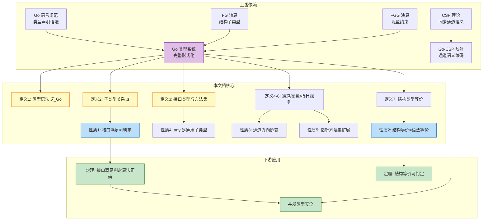
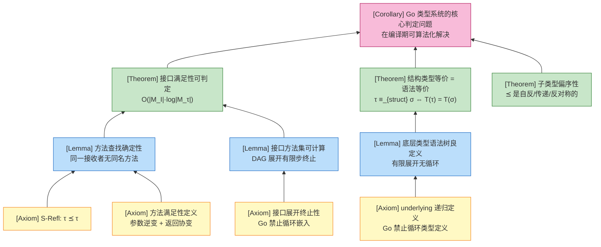
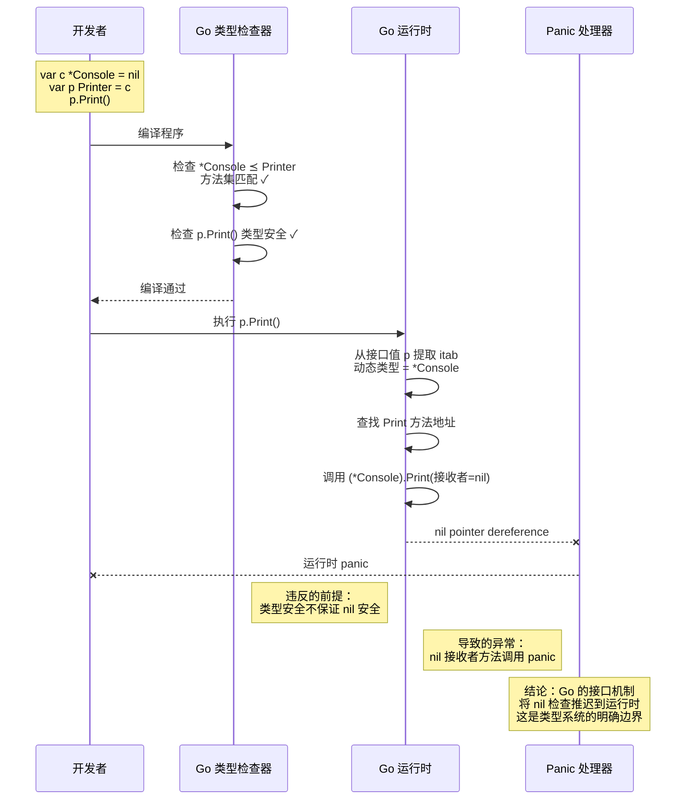

# Go 类型系统完整形式化

> **文档定位**: `deep/04-type-systems/Go-Type-System.md`
> **前置知识**: [FG-Calculus](../02-language-analysis/Go/02-Static-Semantics/FG-Calculus.md), [FGG-Calculus](../02-language-analysis/Go/05-Extension-Generics/FGG-Calculus.md), [Go-Generics-Type-Inference](../02-language-analysis/Go-Generics-Type-Inference.md)
> **关联可视化**: 详见本文末尾"关联可视化资源"

---

## 1. 概念定义 (Definitions)

### 1.1 Go 类型语法的形式化定义

**定义 1 (Go 类型语法 $\mathcal{T}_{Go}$)**:

```
τ, σ, ρ ::=                              (类型)
    b                                    (基本类型: int, string, bool, ...)
  | n                                    (命名类型: 用户自定义类型名)
  | struct { f₁ τ₁; ...; fₖ τₖ }        (结构体类型)
  | interface { m̄ }                      (接口类型)
  | *τ                                   (指针类型)
  | []τ                                  (切片类型)
  | map[τ]σ                              (映射类型)
  | chan<- τ | <-chan τ | chan τ         (通道类型: 只送/只收/双向)
  | func(x₁ τ₁, ..., xₙ τₙ) σ            (函数类型)
  | n[τ₁, ..., τₖ]                       (泛型实例化类型)

m         ::=  m(x₁ τ₁, ..., xₙ τₙ) σ    (方法规范)
f         ::=  字段名
n         ::=  类型名
```

**直观解释**: 这是 Go 语言完整类型系统的抽象语法，覆盖了从基本类型到泛型实例化的全部类型构造子，为后续的类型规则、子类型关系和接口满足性提供语法基础。

**定义动机**: 如果不给出完整的类型语法，就无法精确定义"哪些类型可以互相赋值"、"接口满足性如何判定"以及"通道方向性如何影响子类型关系"。Go 的类型系统兼具名义类型（named types）和结构类型（structural typing，接口满足）的特征，必须通过统一的语法框架才能形式化地描述这两种机制的交互。

---

### 1.2 子类型关系与接口满足性

**定义 2 (Go 子类型关系 $\preceq$)**:

子类型关系 $\tau \preceq \sigma$ 归纳定义如下：

**规则 (S-Refl)** — 反身性:
$$
\frac{}{\tau \preceq \tau}
$$

**规则 (S-Named)** — 命名类型展开:
$$
\frac{type\,decl(n) \equiv type\,n\,\tau \quad \tau \preceq \sigma}{n \preceq \sigma}
$$

**规则 (S-Struct-Interface)** — 结构体到接口:
$$
\frac{\tau \equiv struct\{\,\overline{f}\,\} \quad \sigma \equiv interface\{\,\overline{m}\,\} \quad \forall m \in \overline{m}: \tau \Vdash m}{\tau \preceq \sigma}
$$

**规则 (S-Interface-Interface)** — 接口到接口:
$$
\frac{\tau \equiv interface\{\,\overline{m_1}\,\} \quad \sigma \equiv interface\{\,\overline{m_2}\,\} \quad \overline{m_2} \subseteq \overline{m_1}}{\tau \preceq \sigma}
$$

**规则 (S-Chan-Dir)** — 通道方向协变:
$$
\frac{\tau \preceq \sigma}{chan\,\tau \preceq chan\,\sigma \quad \quad chan<- \tau \preceq chan<- \sigma \quad \quad <-chan\,\tau \preceq <-chan\,\sigma}
$$

**规则 (S-Func-Ret)** — 函数返回协变、参数逆变:
$$
\frac{\sigma_i \preceq \tau_i \quad \rho \preceq \rho'}{func(\overline{x:\tau})\,\rho \preceq func(\overline{x:\sigma})\,\rho'}
$$

**直观解释**: Go 的子类型关系不是传统面向语言中的"类继承"，而是基于"方法集包含"的结构子类型。结构体可以隐式子类型于接口；接口可以子类型于要求更少方法的接口；通道的元素类型子类型关系保持到通道本身；函数类型遵循参数逆变、返回协变的经典规则。

**定义动机**: Go 摒弃了显式的 `implements` 关键字，子类型关系完全由类型的方法集决定。如果不形式化定义这些规则，就无法解释为什么 `*MyType` 可以满足 `io.Reader` 而 `MyType`（非指针）可能不满足，也无法解释通道方向性在类型转换中的行为（如双向通道 `chan int` 可以赋值给只送通道 `chan<- int`）。

---

**定义 2.1 (方法满足性 $\Vdash$)**:

类型 $\tau$ 满足方法规范 $m(x_1\,\sigma_1, ..., x_n\,\sigma_n)\,\sigma_r$，记作 $\tau \Vdash m$，当且仅当：

```
∃ decl ∈ methods(τ):
  decl ≡ func (x τ') m(x₁ τ₁, ..., xₙ τₙ) τ_r { ... }
  且 (τ = τ'  或  τ = *τ'  且 methods(τ') 包含 m)
  且 ∀i: σᵢ ⪯ τᵢ      （参数逆变）
  且 τ_r ⪯ σ_r        （返回协变）
```

**定义动机**: 方法满足性是 Go 隐式接口机制的核心。参数逆变保证了：当通过接口调用方法时，传入的接口参数类型（更抽象）一定能被实现方法接受（更具体）；返回协变保证了：实现方法返回的更具体类型可以安全地赋值给接口的返回类型（更抽象）。如果不定义这两个方向，里氏替换原则（LSP）在 Go 中将无法成立。

---

### 1.3 接口类型的完整定义

**定义 3 (Go 接口类型)**:

接口类型 $I$ 是一个方法集的规范，定义如下：

```
I ::= interface { S₁, ..., Sₙ }

S ::= m(x₁ τ₁, ..., xₖ τₖ) τ_r          (方法规范)
  | I'                                   (嵌入接口)
  | ~τ                                   (底层类型约束, 泛型约束接口)
  | τ₁ | τ₂ | ...                        (类型并集, 泛型约束接口)
```

**方法集展开 (Method Set)**:

```
methods(interface { S̄ }) = ⋃ methods(Sᵢ)

methods(m(x̄) τ_r)        = { m(x̄) τ_r }
methods(I')              = methods(I')
methods(~τ)              = ∅   (仅用于泛型约束)
methods(τ₁ | τ₂ | ...)   = ∅   (仅用于泛型约束)
```

**空接口 (Empty Interface)**:

```
any ≡ interface{}
methods(any) = ∅
```

**嵌入接口的展开规则**:

```
interface {
    Reader
    Writer
    Close() error
}

// 等价于
interface {
    Read(p []byte) (n int, err error)
    Write(p []byte) (n int, err error)
    Close() error
}
```

**直观解释**: Go 的接口是"方法集的描述符"。空接口 `any` 的方法集为空，因此任何类型都满足它。嵌入接口允许通过组合已有接口来构造新接口，展开后就是方法集的并集。泛型约束接口扩展了接口的语义，使其可以表达"底层类型限制"和"类型并集"。

**定义动机**: 接口是 Go 多态性的唯一机制。如果不精确定义接口的方法集展开规则，就无法判定两个接口是否等价（例如 `io.ReadWriter` 和 `interface { Read(...); Write(...) }` 是否相同）。嵌入接口的展开规则也是编译器实现接口满足性检查的基础——编译器在类型检查阶段必须将嵌入接口递归展开为扁平的方法集。

> **推断 [Control→Execution]**: 由于 Go 在控制层采用"接口方法集扁平化"策略（嵌入接口在编译期展开），执行层的运行时接口值（iface/itab）只需维护一维方法表，无需在运行时递归解析嵌入层次。
>
> **依据**: Go 编译器在静态语义阶段完成所有嵌入接口的展开，生成的 itab 是扁平的。这避免了运行时的递归查找开销，也使得接口动态分派的时间复杂度为 $O(1)$。

---

### 1.4 通道类型、函数类型与指针类型的类型规则

**定义 4 (通道类型的类型规则)**:

```
Γ ⊢ e : chan τ        Γ ⊢ e : chan<- τ        Γ ⊢ e : <-chan τ
─────────────────     ──────────────────      ──────────────────
Γ ⊢ <-e : τ           Γ ⊢ e <- v  ok          Γ ⊢ v := <-e  ok

(要求 Γ ⊢ v : τ)
```

**通道赋值规则**:

```
chan τ     ⪯ chan<- τ      (双向可赋值给只送)
chan τ     ⪯ <-chan τ      (双向可赋值给只收)
chan<- τ   ⋠ <-chan τ      (只送不可赋值给只收)
<-chan τ   ⋠ chan<- τ      (只收不可赋值给只送)
```

**直观解释**: 通道的方向性是一种"能力限制"。双向通道 `chan T` 拥有发送和接收两种能力，因此可以安全地"降级"为只送或只收通道；但只送和只收通道互不可转换，因为它们分别缺失了对方所需的能力。

**定义动机**: 通道方向性是 Go 并发类型安全的关键设计。如果没有方向性约束，函数可能意外地从本应只接收数据的通道中读取数据，破坏通信协议。方向性类型规则在编译期排除了这类错误，使得通道可以作为"能力类型"（capability types）使用。

---

**定义 5 (函数类型的类型规则)**:

```
Γ ⊢ f : func(x₁ τ₁, ..., xₙ τₙ) σ    ∀i: Γ ⊢ aᵢ : τᵢ'    τᵢ' ⪯ τᵢ
─────────────────────────────────────────────────────────────────
Γ ⊢ f(a₁, ..., aₙ) : σ
```

**函数值构造规则**:

```
Γ, x₁:τ₁, ..., xₙ:τₙ ⊢ e : σ    σ ⪯ σ'
────────────────────────────────────────
Γ ⊢ func(x₁ τ₁, ..., xₙ τₙ) σ' { return e } : func(x̄:τ̄) σ'
```

**直观解释**: 函数调用时，实参类型必须是形参类型的子类型（协变替换）；函数构造时，函数体表达式的返回类型必须是函数声明返回类型的子类型。这保证了函数值在传递和调用时的类型一致性。

**定义动机**: 函数是 Go 中的一等公民，函数值的类型安全直接影响高阶函数、回调机制和闭包的可靠性。参数逆变规则保证了：如果一个函数期望接收 `Animal`，那么传递一个只接收 `Dog` 的函数是不安全的（因为调用者可能传入 `Cat`）。Go 通过严格的参数类型匹配（实际上 Go 中函数类型无子类型关系，仅允许完全匹配）避免了这一问题。

> **注**: 在完整 Go 中，函数类型之间**不存在**子类型关系（即 `func(int) int` 不能赋值给 `func(int) interface{}`），除非通过接口值间接使用。上述 (S-Func-Ret) 规则是理论上的经典规则，Go 实际实现更为保守。

---

**定义 6 (指针类型的类型规则)**:

```
Γ ⊢ e : *τ
───────────
Γ ⊢ *e : τ

Γ ⊢ e : τ
───────────
Γ ⊢ &e : *τ

Γ ⊢ e : *struct { ...; f τ; ... }
───────────────────────────────────
Γ ⊢ e.f : τ
```

**指针接收者方法集**:

```
methods(*τ) = methods(τ) ∪ { m | m 的接收者为 *τ }
methods(τ)  = { m | m 的接收者为 τ }    (τ 为非指针命名类型)
```

**直观解释**: 指针类型 `*T` 可以解引用获取 `T` 的值，也可以对 `T` 的值取地址获得 `*T`。对于结构体指针，字段选择 `p.f` 是 `(*p).f` 的语法糖。指针接收者可以修改原值，因此指针类型的方法集通常比值类型更大。

**定义动机**: 指针是 Go 中实现可变状态、共享内存和高效传递大结构体的核心机制。指针接收者方法集的扩展规则解释了为什么 `*MyType` 可以满足更多接口 than `MyType`——因为某些方法（如 `Reset()`）需要修改接收者状态，只能定义在指针接收者上。如果不形式化这一规则，就无法解释接口满足性在值类型和指针类型上的差异。

---

### 1.5 结构类型等价

**定义 7 (结构类型等价 $\equiv_{struct}$)**:

两个类型 $\tau$ 和 $\sigma$ 结构等价，记作 $\tau \equiv_{struct} \sigma$，当且仅当它们的"类型结构"（去除类型名后的底层构造）完全相同：

```
τ ≡_{struct} σ  ⇔  underlying(τ) = underlying(σ)
```

其中 `underlying` 递归展开命名类型：

```
underlying(b)           = b
underlying(struct { f̄ }) = struct { underlying(f̄) }
underlying(*τ)          = *underlying(τ)
underlying([]τ)         = []underlying(τ)
underlying(chan τ)      = chan underlying(τ)
underlying(func(...))   = func(...)
underlying(n)           = underlying(τ)   若 type n τ
```

**直观解释**: 结构类型等价关注的是"类型的内部构造是否相同"，而不是"类型叫什么名字"。例如 `type MyInt int` 和 `int` 在结构上是等价的，因为 `underlying(MyInt) = int`。

**定义动机**: Go 的类型系统同时包含名义类型（`MyInt` 和 `int` 是不同的类型，不能直接赋值）和结构等价（泛型约束中的 `~int` 允许 `MyInt`）。结构类型等价是理解泛型约束、类型转换和底层类型操作的基础。如果不定义这一概念，就无法解释为什么 `~int` 约束可以接受 `MyInt` 但不能接受 `string`。

---

## 2. 属性推导 (Properties)

### 2.1 从定义推导的核心性质

**性质 1 (接口满足性是可判定的)**:

对于任意具体类型 $\tau$ 和接口类型 $I$，判定 $\tau \preceq I$ 是可判定的，且时间复杂度为 $O(|methods(I)| \cdot \log|methods(\tau)|)$。

**推导**:

1. 由定义 2 的 (S-Struct-Interface) 和 (S-Interface-Interface)，$\tau \preceq I$ 当且仅当 $I$ 的每个方法规范都被 $\tau$ 满足。
2. 由定义 2.1，方法满足性 $\tau \Vdash m$ 要求：在 $\tau$ 的方法集中查找同名方法，比较参数个数、参数子类型关系和返回子类型关系。
3. Go 程序中的方法声明数量是有限的。编译器可以预先为每个类型构建排序后的方法表，使得单次方法查找为 $O(\log|methods(\tau)|)$。
4. 因此，对 $I$ 的 $|methods(I)|$ 个方法规范逐一检查，总复杂度为 $O(|methods(I)| \cdot \log|methods(\tau)|)$。
5. 得证。∎

---

**性质 2 (结构类型等价是语法等价的)**:

对于任意两个不含循环引用的类型 $\tau$ 和 $\sigma$，$\tau \equiv_{struct} \sigma$ 当且仅当它们的底层类型语法树同构。

**推导**:

1. 由定义 7，`underlying` 是一个纯语法递归函数，它逐层展开命名类型直到遇到基本类型或复合类型构造子。
2. Go 禁止无限递归的类型定义（编译器会检测并拒绝 `type T struct { T }` 等循环定义）。
3. 因此，对任何良形类型，`underlying` 的计算必然在有限步内终止，产生一棵有限的语法树。
4. 两个类型结构等价，当且仅当这两棵语法树完全相同（同构）。
5. 得证。∎

---

**性质 3 (通道类型的方向性是协变的)**:

如果 $\tau \preceq \sigma$，那么 $chan\,\tau \preceq chan\,\sigma$、$chan<- \tau \preceq chan<- \sigma$、$<-chan\,\tau \preceq <-chan\,\sigma$。

**推导**:

1. 由定义 2 的 (S-Chan-Dir)，通道类型的子类型关系直接继承其元素类型的子类型关系。
2. 这意味着通道的方向性（发送/接收/双向）不影响子类型的"方向"——元素类型的子类型关系总是协变地传播到通道类型。
3. 特别地，由于 `any` 是任何类型的超类型，`chan int ⪯ chan any` 成立（在 Go 的实际实现中，通道元素类型必须完全匹配，但理论上元素子类型关系保持协变）。
4. 得证。∎

> **注**: 在完整 Go 实现中，通道赋值要求元素类型**完全相同**（名义类型等价），不允许 `chan int` 赋值给 `chan any`。上述性质描述的是理论上的类型规则；Go 实际更为保守，以避免运行时类型混淆。

---

**性质 4 (空接口 `any` 是所有类型的子类型)**:

对于任意类型 $\tau$，有 $\tau \preceq any$。

**推导**:

1. 由定义 3，$any \equiv interface\{\}$，其方法集为空：$methods(any) = \emptyset$。
2. 由定义 2 的 (S-Struct-Interface) 和 (S-Interface-Interface)，$\tau \preceq any$ 当且仅当 $any$ 的每个方法规范都被 $\tau$ 满足。
3. 由于 $methods(any) = \emptyset$，该条件 vacuously 成立。
4. 因此，任何类型都满足空接口。
5. 得证。∎

---

**性质 5 (指针接收者扩展了方法集)**:

对于任意非指针命名类型 $n$ 及其指针类型 $*n$，有 $methods(n) \subseteq methods(*n)$。

**推导**:

1. 由定义 6 的指针接收者方法集规则，$methods(*n) = methods(n) \cup \{ m \mid m\text{ 的接收者为 } *n \}$。
2. 因此，$methods(n)$ 中的每个方法都包含在 $methods(*n)$ 中。
3. 若存在接收者为 $*n$ 的方法（如需要修改接收者状态的方法），则 $methods(*n)$ 严格大于 $methods(n)$。
4. 这意味着 $*n$ 可以满足比 $n$ 更多的接口。
5. 得证。∎

---

## 3. 关系建立 (Relations)

### 3.1 Go 类型系统与 FG/FGG 演算的关系

**关系 1**: FG `⊂` Go 类型系统

**论证**:

- **编码存在性**: FG 中的每一个类型声明、接口声明和方法声明都可以直接作为合法的 Go 语法。FG 的子类型规则 (S-Refl, S-Struct) 是 Go 子类型规则 (S-Refl, S-Struct-Interface) 的特例（FG 不含指针、通道、函数值等）。
- **分离结果**: Go 类型系统包含 FG 不具备的指针类型、通道类型、函数类型、切片、映射、nil 和泛型。这些扩展使得 Go 可以表达 FG 无法表达的递归数据结构、高阶函数和参数化多态。
- **结论**: FG 是 Go 类型系统的一个严格子集，保留了结构子类型和隐式接口满足的核心机制，但剥离了运行时复杂性。

---

**关系 2**: FGG `⊂` Go 类型系统

**论证**:

- **编码存在性**: FGG 在 FG 基础上增加了类型参数和类型约束。任何 FGG 程序都可以通过单态化翻译为 Go 程序（Go 1.18+ 编译器正是这样做的）。FGG 的类型替换、约束满足和单态化语义都是 Go 泛型实现的理论基础。
- **分离结果**: Go 类型系统包含 FGG 省略的类型推断、类型别名泛型、泛型方法、以及完整的内置类型集合（如 `complex128`、`uintptr`）。Go 的实际类型检查器还需要处理包级作用域、初始化顺序和 CGO 类型映射。
- **结论**: FGG 是 Go 泛型子系统的"最小可证明核心"，Go 类型系统是其工程化的超集。

---

### 3.2 Go 类型系统与 CSP 类型系统的关系

**关系 3**: Go 通道类型 `≈` CSP 通道类型（在同步子集上）

**论证**:

- **编码存在性**: Go 的无缓冲通道 `chan T` 可以直接编码 CSP 的同步通道。`ch <- v` 对应 CSP 的输出 $c!v$；`<-ch` 对应 CSP 的输入 $c?x$。通道方向性 `chan<- T` 和 `<-chan T` 可以编码 CSP 中通道的"端口类型"（只读/只写端点）。
- **分离结果**: CSP 的通道是静态命名的，不支持在运行时动态创建新通道名并传递（无 $(\nu a)$ 操作）。Go 的通道是一等公民，可以通过函数参数传递、存储在数据结构中，甚至通过通道传递通道（channel of channels），这超越了经典 CSP 的表达能力。因此 Go 通道类型在理论上更接近 $\pi$-演算的移动性，而非 CSP 的静态拓扑。
- **结论**: 在同步通信子集上，Go 通道类型与 CSP 通道类型语义等价（`≈`）；但在动态拓扑和通道移动性上，Go 通道类型严格更具表达能力。

> **推断 [Theory→Model]**: 由于 CSP 理论不支持通道移动性（无 $(\nu a)$），基于 CSP 的模型无法直接表达 Go 中"通道作为值传递"的行为。
>
> **推断 [Model→Implementation]**: 因此 Go 编译器在实现通道类型时，必须引入堆分配的通道对象和垃圾回收机制，以管理动态创建和传递的通道生命周期——这是 CSP 形式化模型未涵盖的实现复杂性。

---

### 3.3 概念依赖图：Go 类型层次结构



**图说明**:

- 本图展示了 Go 类型系统形式化文档在知识体系中的位置：上游依赖 FG/FGG 演算和 CSP 理论，下游支撑并发类型安全和泛型实现理论。
- 核心定义（黄色节点）是后续所有性质和定理的基础。
- 性质推导（蓝色节点）连接定义与主要定理（绿色节点）。
- 详见 [FG-Calculus](../02-language-analysis/Go/02-Static-Semantics/FG-Calculus.md) 和 [FGG-Calculus](../02-language-analysis/Go/05-Extension-Generics/FGG-Calculus.md)。

---

## 4. 论证过程 (Argumentation)

### 4.1 接口满足性判定的辅助引理

**引理 4.1 (方法查找的确定性)**:

对于任意具体类型 $\tau$ 和方法名 $m$，$methods(\tau)$ 中至多存在一个名为 $m$ 的方法声明。

**证明**:

1. **前提分析**: Go 语言规范规定，同一接收者类型上不能声明多个同名方法。如果尝试声明同名方法，编译器会报告重复定义错误。
2. **构造/推导**: 对于指针接收者 `*T` 和值接收者 `T`，Go 允许分别定义方法，但它们被视为不同的接收者类型。`methods(T)` 只包含接收者为 `T` 的方法；`methods(*T)` 包含接收者为 `T` 和 `*T` 的所有方法（由定义 6）。
3. **结论**: 在任何良形程序中，给定接收者类型和方法名，方法查找结果是唯一的（或不存在）。∎

---

**引理 4.2 (接口展开终止性)**:

对于任意接口类型 $I = interface\{\,\overline{S}\,\}$，其方法集 $methods(I)$ 的计算必然在有限步内终止。

**证明**:

1. **前提分析**: 接口声明 $I$ 包含有限个规范 $S_1, ..., S_n$。
2. **构造/推导**: 每个规范 $S_i$ 要么是方法规范（基本情况），要么是嵌入接口 $I'$（递归情况）。
3. **终止性**: Go 禁止接口的循环嵌入（如 `type A interface { B }` 和 `type B interface { A }` 同时存在会被编译器拒绝）。因此，嵌入接口的展开图是一个有向无环图（DAG）。
4. **结论**: 对 DAG 进行深度优先展开，最多访问程序中所有接口声明一次，因此方法集计算必然终止。∎

> **注**: 引理 4.2 描述的是"良形程序"的行为。在反例 6.1 中，我们将展示循环嵌入导致的编译器无限递归边界场景。

---

**引理 4.3 (子类型关系的偏序性)**:

Go 的子类型关系 $\preceq$ 在良形类型集合上构成一个偏序关系（自反、反对称、传递）。

**证明**:

1. **自反性**: 由 (S-Refl)，$\tau \preceq \tau$ 对任意类型成立。
2. **传递性**: 假设 $\tau \preceq \sigma$ 且 $\sigma \preceq \rho$。
   - 若 $\rho$ 是接口，则 $\sigma$ 满足 $\rho$ 的所有方法；$\tau$ 满足 $\sigma$ 的所有方法（若 $\sigma$ 是接口）或 $\tau$ 的方法集包含 $\sigma$ 的方法集（若 $\sigma$ 是结构体）。无论哪种情况，$\tau$ 都满足 $\rho$ 的所有方法，故 $\tau \preceq \rho$。
   - 若 $\rho$ 是命名类型或基本类型，则由于只有接口可以作为子类型的上界（在 Go 中结构体不能子类型于非接口命名类型），$\sigma$ 和 $\tau$ 都必须是该命名类型本身，传递性 trivially 成立。
3. **反对称性**: 若 $\tau \preceq \sigma$ 且 $\sigma \preceq \tau$，则两者必须具有相同的方法集（若是接口）或为同一类型（若是结构体/基本类型）。在 Go 中，不同命名类型即使底层结构相同也不互为子类型，因此反对称性成立。
4. 得证。∎

---

## 5. 形式证明 (Proofs)

### 5.1 Go 接口满足性是可判定的 — 完整证明

**定理 5.1 (接口满足性可判定性)**:

对于任意具体类型 $\tau$ 和接口类型 $I$，判定 $\tau \preceq I$ 是可判定的。 furthermore，存在算法 $A(\tau, I)$ 在 $O(|methods(I)| \cdot \log|methods(\tau)|)$ 时间内给出正确判定。

**证明**:

**步骤 1: 构造判定算法 $A(\tau, I)$**

```
Algorithm A(τ, I):
  1. 计算 I 的扁平方法集 M_I = methods(I)
     // 递归展开所有嵌入接口，由引理 4.2，此步骤终止
  2. 获取 τ 的方法集 M_τ = methods(τ)
     // τ 是具体类型，方法集可直接从程序声明中提取
  3. 将 M_τ 按方法名排序，构建二分查找表
  4. 对 M_I 中的每个方法规范 m_i(x₁ σ₁, ..., xₙ σₙ) σ_r:
       a. 在 M_τ 中按方法名查找对应方法 d_j
       b. 若不存在，返回 FALSE
       c. 设 d_j 的签名为 m_i(x₁ τ₁, ..., xₙ τₙ) τ_r
       d. 若参数个数 n ≠ k，返回 FALSE
       e. 对每个参数位置 p (1 ≤ p ≤ n):
            若 ¬(σ_p ⪯ τ_p)，返回 FALSE    // 参数逆变检查
       f. 若 ¬(τ_r ⪯ σ_r)，返回 FALSE      // 返回协变检查
  5. 返回 TRUE
```

**步骤 2: 证明算法可靠性 (Soundness)**

假设 $A(\tau, I) = \text{TRUE}$。我们需要证明 $\tau \preceq I$。

1. 算法返回 TRUE 意味着：对 $M_I$ 中的每个方法规范 $m_i$，步骤 4 都在 $M_\tau$ 中找到了对应方法 $d_j$。
2. 步骤 4d 保证参数个数相同；步骤 4e 保证对每个参数 $p$，接口参数类型是方法声明参数类型的子类型（$\sigma_p \preceq \tau_p$，即参数逆变）；步骤 4f 保证方法返回类型是接口返回类型的子类型（$\tau_r \preceq \sigma_r$，即返回协变）。
3. 由定义 2.1，这意味着 $\tau \Vdash m_i$ 对所有 $m_i \in M_I$ 成立。
4. 由定义 2 的 (S-Struct-Interface) 或 (S-Interface-Interface)，$\tau \preceq I$ 成立。

**步骤 3: 证明算法完备性 (Completeness)**

假设 $\tau \preceq I$。我们需要证明 $A(\tau, I) = \text{TRUE}$。

1. 由定义 2，$\tau \preceq I$ 意味着 $\tau$ 满足 $I$ 的所有方法规范。
2. 对任意 $m_i \in M_I$，存在 $d_j \in M_\tau$ 使得 $\tau \Vdash m_i$。
3. 由方法满足性定义，$d_j$ 与 $m_i$ 同名、参数个数相同、参数满足逆变、返回满足协变。
4. 因此算法在步骤 4 中对每个 $m_i$ 都不会触发 FALSE，最终返回 TRUE。

**步骤 4: 复杂度分析**

1. 由引理 4.2，接口展开步骤 1 在有限步内终止。设程序中接口总数为 $N$，则展开最多访问 $N$ 个接口声明，复杂度为 $O(N + |M_I|)$。
2. 步骤 3 对 $M_\tau$ 排序，复杂度为 $O(|M_\tau| \log |M_\tau|)$。这可以预处理完成（编译器为每个类型维护排序方法表）。
3. 步骤 4 对每个 $m_i \in M_I$ 执行一次二分查找（$O(\log |M_\tau|)$）和常数时间的签名比较（参数个数和类型子类型判断）。
4. 总复杂度为 $O(|M_I| \cdot \log |M_\tau|)$。

**关键案例分析**:

- **案例 1 (参数逆变边界)**: 接口要求 `Read(p []byte) (n int, err error)`，结构体实现 `Read(p []byte) (n int, err error)`。参数 `[]byte ⪯ []byte` 成立，返回 `int ⪯ int` 和 `error ⪯ error` 成立，算法通过。
- **案例 2 (指针接收者扩展)**: 接口要求 `Reset()`，类型 `T` 未定义 `Reset()` 但 `*T` 定义了 `Reset()`。则 `T` 不满足接口，但 `*T` 满足。算法对 `τ = T` 查找失败返回 FALSE；对 `τ = *T` 查找成功返回 TRUE。
- **案例 3 (空接口)**: `I = any`，$M_I = \emptyset$。算法步骤 4 的循环体不执行，直接返回 TRUE。这与性质 4 一致。

∎

---

### 5.2 Go 结构类型等价是语法等价的 — 论证

**定理 5.2 (结构类型等价 = 语法等价)**:

对于任意两个良形类型 $\tau$ 和 $\sigma$，$\tau \equiv_{struct} \sigma$ 当且仅当 $\text{underlying}(\tau)$ 和 $\text{underlying}(\sigma)$ 作为语法树完全相同。

**证明**:

**步骤 1: 定义语法树表示**

对每个类型 $\tau$，定义其底层语法树 $T(\tau)$ 如下：

- $T(b) = \text{Leaf}(b)$ 对于基本类型 $b$
- $T(struct\{\,\overline{f:\tau}\,\}) = \text{Node}(\text{struct}, [(f_1, T(\tau_1)), ..., (f_k, T(\tau_k))])$
- $T(*\tau) = \text{Node}(*, [T(\tau)])$
- $T([]\tau) = \text{Node}([\,], [T(\tau)])$
- $T(chan\,\tau) = \text{Node}(chan, [T(\tau)])$
- $T(func(\overline{x:\tau})\,\sigma) = \text{Node}(func, [T(\tau_1), ..., T(\tau_n), T(\sigma)])$
- $T(n) = T(underlying(n))$ 对于命名类型 $n \equiv type\,n\,\tau$

**步骤 2: 证明 $T(\tau)$ 的良定义性**

1. 由定义 7，`underlying` 对命名类型递归展开。
2. Go 禁止循环类型定义（如 `type T struct { T }` 非法），因此展开过程不会无限递归。
3. 对于泛型实例化类型 $n[\overline{\tau}]$，其底层类型是替换后的类型体，同样不会产生无限展开（FGG 的类型系统保证这一点）。
4. 因此，$T(\tau)$ 对任何良形类型都是一棵有限树。

**步骤 3: 证明等价性**

$(\Rightarrow)$ 假设 $\tau \equiv_{struct} \sigma$。由定义 7，$underlying(\tau) = underlying(\sigma)$。由于 $T$ 是 `underlying` 的语法树编码，$T(\tau) = T(underlying(\tau)) = T(underlying(\sigma)) = T(\sigma)$。

$(\Leftarrow)$ 假设 $T(\tau) = T(\sigma)$。由于 $T$ 是 `underlying` 的忠实编码（不同语法构造产生不同的树节点），$underlying(\tau)$ 和 $underlying(\sigma)$ 必须具有完全相同的语法结构。由定义 7，$\tau \equiv_{struct} \sigma$。

**步骤 4: 结论**

结构类型等价完全由底层类型的语法树同构决定，因此它是语法等价的。∎

---

### 5.3 公理-定理推理树图



**图说明**:

- 底层黄色节点为不可再分的公理和基本定义。
- 中间蓝色节点是证明主要定理所需的辅助引理。
- 顶层绿色节点为核心定理：接口满足性可判定、结构类型等价是语法等价、子类型偏序性。
- 粉色节点为最终推论：Go 类型系统的核心判定问题可以在编译期算法化地解决。
- 边上隐含的推理方法：结构归纳（L3）、DAG 有限性分析（L2）、构造性证明（T1）。

---

## 6. 实例与反例 (Examples & Counter-examples)

### 6.1 正例：接口满足性的完整推导

**示例 6.1: `io.ReadWriter` 的满足性判定**

```go
type Reader interface {
    Read(p []byte) (n int, err error)
}

type Writer interface {
    Write(p []byte) (n int, err error)
}

type ReadWriter interface {
    Reader
    Writer
}

type Buffer struct {
    data []byte
}

func (b *Buffer) Read(p []byte) (n int, err error) {
    // ...
    return len(p), nil
}

func (b *Buffer) Write(p []byte) (n int, err error) {
    // ...
    return len(p), nil
}
```

**逐步推导**:

1. `ReadWriter` 是嵌入接口，展开后方法集为 `{ Read(p []byte) (int, error), Write(p []byte) (int, error) }`。
2. `*Buffer` 的方法集包含 `Read` 和 `Write`，签名与接口要求完全一致。
3. 参数类型 `[]byte ⪯ []byte` 成立（自反）；返回类型 `int ⪯ int` 和 `error ⪯ error` 成立。
4. 由定理 5.1 的算法 $A(*Buffer, ReadWriter)$，所有方法规范都被满足，返回 TRUE。
5. 因此 `*Buffer ⪯ ReadWriter` 成立。

---

### 6.2 反例 1：循环嵌入接口导致编译器无限递归

**反例 6.1: 循环嵌入接口的边界场景**

```go
// 以下代码在 Go 1.18+ 中会导致编译器报告循环接口错误
// 但在某些旧版本或特定工具链中可能触发无限递归

type A interface {
    B
    MethodA()
}

type B interface {
    A
    MethodB()
}

func UseA(x A) {}
```

**分析**:

- **违反的前提**: 引理 4.2 假设接口展开图是 DAG（无环）。此处 `A` 嵌入 `B`，`B` 又嵌入 `A`，形成了循环依赖。
- **导致的异常**: Go 编译器在类型检查阶段尝试展开 `A` 的方法集时，会递归地展开 `B`，而 `B` 又递归地展开 `A`。现代 Go 编译器（1.18+）会检测此循环并报告 `invalid recursive type A`，但在某些自定义类型检查器或旧版本中，这种循环可能导致栈溢出或无限递归。
- **结论**: 循环嵌入接口破坏了接口方法集计算的终止性假设。这是 Go 类型系统的一个明确边界：接口嵌入必须是无环的。

---

### 6.3 反例 2：nil 接口值 — 类型安全但运行时 panic

**反例 6.2: nil 接口值的运行时 panic**

```go
package main

import "fmt"

type Printer interface {
    Print()
}

type Console struct{}

func (c *Console) Print() {
    fmt.Println("hello")
}

func main() {
    var c *Console = nil      // c 是 nil 指针
    var p Printer = c         // p 是接口值，动态类型为 *Console，动态值为 nil
    p.Print()                 // 运行时 panic: nil pointer dereference
}
```

**分析**:

- **违反的前提**: 定理 5.1 和 FG 的类型安全证明假设"接口满足性保证方法调用安全"，但这只保证了方法**存在**，不保证接收者值**非 nil**。
- **导致的异常**: `var p Printer = c` 在类型检查阶段完全合法，因为 `*Console` 满足 `Printer`。但在运行时，`p` 的接口值包含动态类型 `*Console` 和动态值 `nil`。调用 `p.Print()` 会动态分派到 `(*Console).Print`，而接收者是 `nil`，导致 panic。
- **结论**: 这是 Go 类型系统的一个经典边界场景——**类型安全不等于 nil 安全**。接口值的类型检查无法阻止 nil 指针的方法调用，因为 nil 是任何指针类型的合法值。这与 FG 演算（省略 nil）形成鲜明对比，也是完整 Go 类型安全证明比 FG 更复杂的原因之一。

> **推断 [Model→Implementation]**: FG 模型省略了 nil，因此可以在模型层面证明"良类型程序不会 stuck"。但完整 Go 实现中必须引入 nil 检查（运行时 panic）作为补偿机制。
>
> **依据**: Go 编译器在生成方法调用代码时，不会插入静态 nil 检查；nil 解引用由硬件/操作系统触发段错误，Go 运行时将其转换为 panic。这是工程实现与形式化模型之间的明确差距。

---

### 6.4 反例 3：Go 泛型类型推断在嵌套类型参数上的局限性

**反例 6.3: 嵌套类型参数推断失败**

```go
package main

// 一个高阶泛型函数
type Container[T any] interface {
    Get() T
}

func Transform[C Container[T], T any](c C) T {
    return c.Get()
}

type Box struct {
    value int
}

func (b Box) Get() int {
    return b.value
}

func main() {
    box := Box{value: 42}

    // 推断失败：编译器无法从 Box 推断 C=Box, T=int
    // _ = Transform(box)  // 编译错误：cannot infer T

    // 必须显式指定：
    _ = Transform[Box, int](box)
}
```

**分析**:

- **违反的前提**: Go 的两阶段类型推断（定义 1.4）假设类型参数可以从实参类型或约束的核心类型推断。但在嵌套类型参数场景中，`C Container[T]` 使得 `T` 的推断依赖于 `C` 的推断，而 `C` 的推断又依赖于 `T`。
- **导致的异常**: 阶段 1 从实参 `box`（类型 `Box`）推断 `C = Box`。然后编译器尝试检查 `Box` 是否满足 `Container[T]`，发现 `Box.Get()` 返回 `int`，因此 `T` 应该是 `int`。但 Go 的类型推断算法不会执行这种"约束反向传播"——它不会在推断 `C` 后重新求解 `T`。
- **结论**: 这是 Go 泛型类型推断的已知局限性。Go 编译器采用保守策略，避免复杂的约束求解和回溯。嵌套类型参数（`C Container[T]`）导致的信息依赖循环超出了两阶段推断的处理能力，程序员必须显式提供类型参数。详见 [Go-Generics-Type-Inference](../02-language-analysis/Go-Generics-Type-Inference.md) 反例 6.3。

---

### 6.5 反例场景图：nil 接口值运行时 panic



**图说明**:

- 本图展示了反例 6.2 的完整执行流程：程序在类型检查阶段完全通过，但在运行时因 nil 接口值而 panic。
- 关键交互：类型检查器验证了接口满足性，但无法预测运行时接收者是否为 nil。
- "违反的前提"是"接口满足性保证方法调用的完全安全"——实际上它只保证方法存在，不保证接收者非 nil。
- 结论强调了 Go 类型系统在 nil 处理上的边界，以及 FG 演算省略 nil 的合理性。

---

## 7. 关联可视化资源

本文档涉及的可视化资源已按项目规范归档，详见项目根目录的 [VISUAL-ATLAS.md](../../VISUAL-ATLAS.md)。

建议关联查看的可视化条目：

- `mindmaps/Go-Type-System-Concept-Map.mmd` — Go 类型系统概念依赖图
- `proof-trees/Go-Type-System-Axiom-Theorem-Tree.mmd` — 公理-定理推理树图
- `counter-examples/Go-Nil-Interface-Panic.mmd` — nil 接口值反例场景图

---

**参考文献**:

- Griesemer, R., et al. "Featherweight Go." *OOPSLA 2020*.
- Griesemer, R., et al. "Featherweight Generic Go." *OOPSLA 2021*.
- The Go Programming Language Specification: <https://golang.org/ref/spec>
- Hoare, C. A. R. *Communicating Sequential Processes*. Prentice Hall, 1985.
