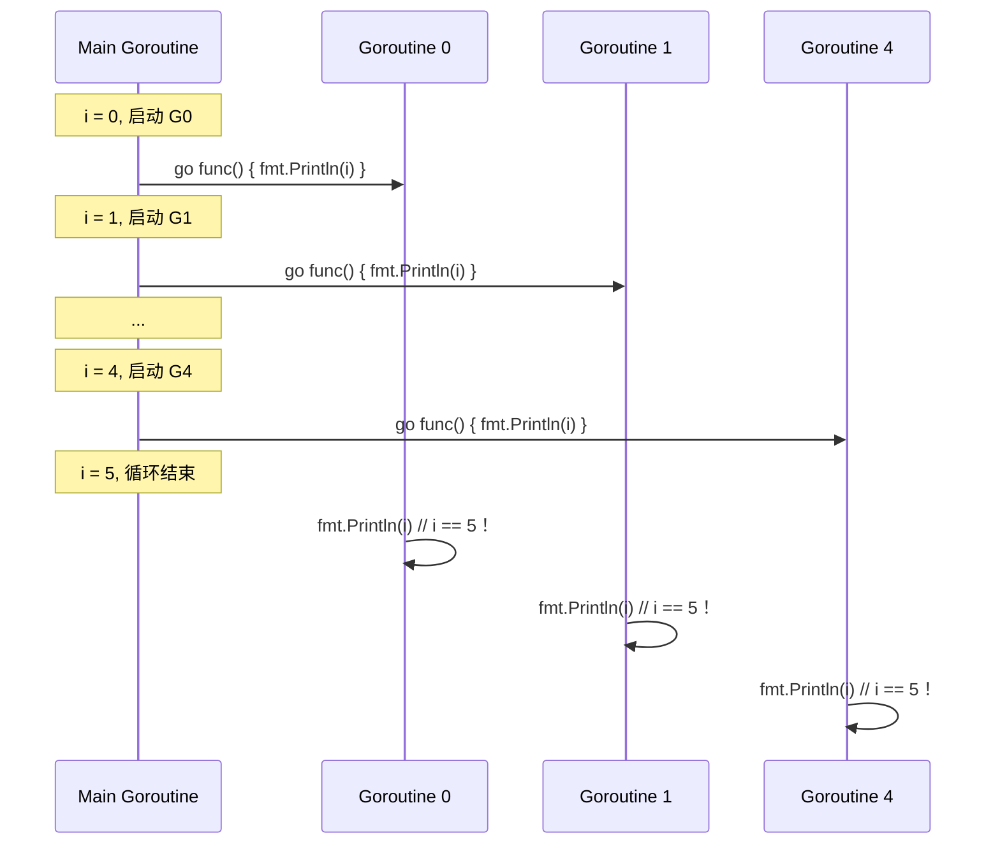
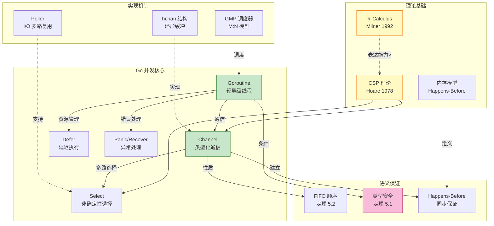
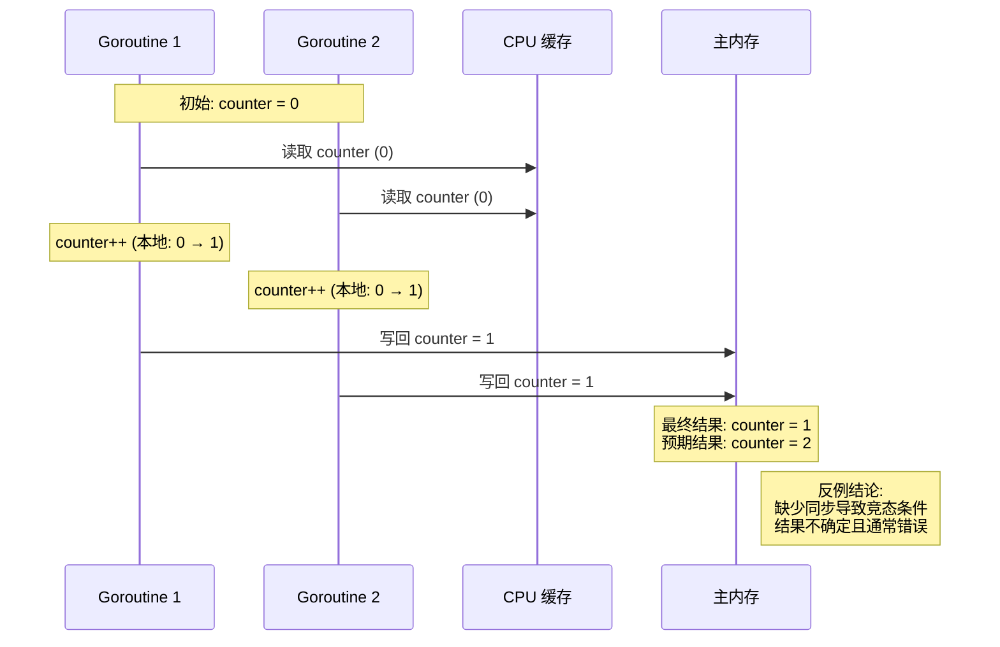

> **📌 文档角色**: 对比参考材料 (Comparative Reference)
>
> 本文档作为 **Scala Actor / Flink** 核心内容的对比参照系，
> 展示 CSP 模型的简化实现。如需系统学习核心计算模型，
> 请参考 [Scala 类型系统](./Scala-3.6-3.7-Type-System-Complete.md) 或
> [Flink Dataflow 形式化](../Flink/Flink-Dataflow-Formal.md)。
>
> ---

# Go 语言并发模型形式化分析总览

> **文档版本**: 2026.04 | **类型**: 对比参考材料 | **级别**: L5 图灵完备
>
> 📚 **Go 版本演进文档**:
>
> - [Go 1.25 规范变更](./Go-1.25-Spec-Changes.md)
> - **[Go 1.26.1 完整形式化分析](./Go-1.26.1-Comprehensive.md)** ⭐ 最新综合文档（39KB）
> - [Go 1.26.1 规范变更（精简版）](./Go-1.26.1-Spec-Changes.md)
> - [Go Generic Methods](./Go-Generic-Methods.md)

---

## 1. 概念定义 (Definitions)

### 1.1 Go 并发核心抽象语法 (Go-CS)

**定义 1.1 (Go-CS 抽象语法)**:

$$
\begin{aligned}
P, Q ::=\ & 0 \quad \text{(终止)} \\
       |\ & \text{go}\ P \quad \text{(Goroutine 创建)} \\
       |\ & ch \leftarrow v \quad \text{(Channel 发送)} \\
       |\ & x := \leftarrow ch \quad \text{(Channel 接收)} \\
       |\ & \text{select}\ \{ \text{case}_i: P_i \} \quad \text{(非确定性选择)} \\
       |\ & \text{close}(ch) \quad \text{(Channel 关闭)} \\
       |\ & \text{defer}\ P \quad \text{(延迟执行)} \\
       |\ & \text{panic}(v) \quad \text{(异常抛出)} \\
       |\ & \text{recover}() \quad \text{(异常捕获)} \\
       |\ & P; Q \quad \text{(顺序组合)} \\
       |\ & P \mid Q \quad \text{(并行组合)}
\end{aligned}
$$

**直观解释**：Go-CS (Go Concurrency Subset) 是 Go 语言并发核心特性的形式化抽象，剥离了函数调用、结构体、方法等非并发特性，保留与 CSP/π 演算可直接对比的并发原语。

**定义动机**：

- Go 完整语法过于复杂（包含类型系统、泛型、接口等），无法直接与进程代数进行语义比较
- 该子集保留了 Go 并发模型的全部表达能力（Goroutine + Channel + Select）
- 通过剥离非本质特性，可在形式化层面证明 Go 与 CSP/π 的表达能力关系

---

### 1.2 Goroutine 形式化定义

**定义 1.2 (Goroutine)**:

Goroutine 是 Go 语言中的轻量级执行线程，其形式化定义为一个三元组：

$$
G \triangleq (g_{id}, S, \sigma)
$$

其中：

- $g_{id} \in \mathbb{N}$：唯一标识符
- $S$：当前执行状态（Running | Runnable | Waiting | Dead）
- $\sigma$：线程局部栈（初始 2KB，可动态增长）

**操作语义**（创建）：

$$
\frac{P \text{ is a valid process}}{\text{go}\ P \longrightarrow (G_{new} \parallel P) \mid \text{continue}}
$$

**直观解释**：`go P` 创建一个新的独立执行流 $G_{new}$ 来执行进程 $P$，当前执行流继续执行后续代码。

**定义动机**：

- 与 OS 线程（M）解耦：Goroutine 由运行时调度器管理，实现 M:N 调度模型
- 极低开销：初始栈仅 2KB，支持百万级并发
- 解决传统线程模型中"线程过多导致上下文切换开销爆炸"的问题

> **推断 [Model→Implementation]**: CSP 理论中的 Process 是逻辑抽象，而 Goroutine 是工程实现中的轻量级执行单元。
>
> **推断 [Implementation→Control]**: 由于采用 M:N 调度模型，控制层必须通过 GMP 调度器实现用户级线程管理，而非直接依赖 OS 调度器。

---

### 1.3 Channel 形式化定义

**定义 1.3 (Channel)**:

Channel 是 Go 中的类型化通信信道，形式化为五元组：

$$
ch \triangleq (T, cap, buf, sendq, recvq)
$$

其中：

- $T$：元素类型（Channel 是类型化的）
- $cap \in \mathbb{N}$：缓冲区容量（$cap = 0$ 表示无缓冲/同步 Channel）
- $buf$：循环缓冲区（长度 $\leq cap$）
- $sendq, recvq$：等待队列（存储被阻塞的 Goroutine）

**操作语义**：

$$
\text{[SEND-SYNC]} \quad \frac{cap = 0 \land recvq \neq \emptyset}{ch \leftarrow v \longrightarrow \text{handoff}(v, g_{receiver})}
$$

$$
\text{[SEND-ASYNC]} \quad \frac{cap > 0 \land |buf| < cap}{ch \leftarrow v \longrightarrow buf \leftarrow v}
$$

$$
\text{[RECV-SYNC]} \quad \frac{cap = 0 \land sendq \neq \emptyset}{x := \leftarrow ch \longrightarrow x := \text{handoff}()}
$$

$$
\text{[RECV-ASYNC]} \quad \frac{|buf| > 0}{x := \leftarrow ch \longrightarrow x := buf.pop()}
$$

**直观解释**：Channel 是 Goroutine 间通信的管道，支持同步（无缓冲）和异步（有缓冲）两种模式，通过类型系统保证通信数据的类型安全。

**定义动机**：

- 实现 CSP 的"通过通信共享内存"哲学
- 类型安全：编译期保证发送/接收数据类型一致
- 解耦并发组件：通信双方无需知道对方存在（匿名性）
- 同步点：无缓冲 Channel 的发送/接收构成隐式同步屏障

---

### 1.4 Select 形式化定义

**定义 1.4 (Select)**:

Select 是 Go 的非确定性选择原语：

$$
\text{select}\ \{ \text{case}_1: P_1, \ldots, \text{case}_n: P_n, \text{default}: P_d \}
$$

**操作语义**（伪公平选择）：

$$
\text{[SELECT-READY]} \quad \frac{\exists i. \text{case}_i \text{ ready} \land j = \text{pseudo-random}(\{i \mid \text{case}_i \text{ ready}\})}{\text{select} \longrightarrow P_j}
$$

$$
\text{[SELECT-DEFAULT]} \quad \frac{\forall i. \text{case}_i \text{ blocked} \land \text{default exists}}{\text{select} \longrightarrow P_d}
$$

$$
\text{[SELECT-BLOCK]} \quad \frac{\forall i. \text{case}_i \text{ blocked} \land \neg\text{default}}{\text{select} \longrightarrow \text{BLOCKED}}
$$

**直观解释**：Select 同时等待多个 Channel 操作，当多个 case 就绪时伪随机选择一个执行，对应 CSP 的外部选择算子 □。

**定义动机**：

- 解决"等待多个事件"的并发编程难题
- 支持超时和默认分支（非阻塞操作）
- 避免忙等待：无可用 case 时 Goroutine 进入等待状态
- 对应 CSP 的外部选择（external choice），但 Go 实现采用伪随机而非完全公平策略

---

### 1.5 Defer 形式化定义

**定义 1.5 (Defer)**:

Defer 延迟执行机制形式化为栈结构：

$$
\text{defer}\ P \longrightarrow \text{defer-stack.push}(P)
$$

**执行语义**（函数返回时）：

$$
\text{[DEFER-EXEC]} \quad \frac{\text{func returns}}{\text{while } defer-stack \neq \emptyset: defer-stack.pop() \text{ and execute}}
$$

**直观解释**：Defer 将函数调用压入延迟栈，在包含它的函数返回前按 LIFO 顺序执行。

**定义动机**：

- 资源释放模式：确保锁、文件句柄等资源被正确释放
- 避免忘记释放：将资源获取与释放代码物理靠近
- 异常处理：配合 panic/recover 实现类似 try-finally 的语义

---

### 1.6 Panic/Recover 形式化定义

**定义 1.6 (Panic/Recover)**:

Panic 和 Recover 构成 Go 的异常处理机制：

$$
\text{panic}(v) \longrightarrow \text{unwind-stack}(v) \mid \text{recover}() \longrightarrow v \text{ if in defer}
$$

**语义规则**：

$$
\text{[PANIC]} \quad \frac{}{\text{panic}(v) \longrightarrow \text{unwind until recover or abort}}
$$

$$
\text{[RECOVER]} \quad \frac{\text{executing in defer frame}}{\text{recover}() \longrightarrow \text{caught panic value}}
$$

**直观解释**：Panic 触发栈展开，直到遇到包含 recover() 的 defer 函数；若无 recover，程序终止。

**定义动机**：

- 提供不可恢复错误的处理机制
- 保持与 defer 的协同设计
- 明确区分"可恢复错误"（返回值）与"不可恢复错误"（panic）

---

### 1.7 Go 内存模型与 Happens-Before

**定义 1.7 (Go 内存模型)**:

Go 内存模型定义了读写操作的偏序关系（happens-before）：

$$
hb \subseteq Events \times Events \quad \text{(偏序关系)}
$$ $$
\text{若 } e_1 \xrightarrow{hb} e_2 \text{，则 } e_1 \text{ 的写入对 } e_2 \text{ 可见}$$

**同步规则**：

| 操作对 | Happens-Before 关系 |
|--------|---------------------|
| Channel send → 同 Channel receive | send $hb$ receive |
| Channel close → receive | close $hb$ receive |
| Mutex Unlock → Lock | unlock $hb$ lock |
| WaitGroup Wait → Done | done $hb$ wait |
| Once Do → 后续 Do | first do $hb$ subsequent do |

**直观解释**：Happens-Before 定义了事件间的可见性顺序，是判断数据竞争和保证内存一致性的基础。

**定义动机**：
- 精确定义并发程序的行为边界
- 为数据竞争检测器提供理论依据
- 明确程序员和编译器优化之间的契约
- 对应 Java Memory Model 和 C++ Memory Model 的设计模式

---

### 1.8 Go 的 CSP 血统与实用主义扩展

**定义 1.8 (Go-CSP 变体)**:

Go 语言实现了 CSP 的核心思想，但引入实用主义扩展：

| CSP 概念 | Go 实现 | 扩展/差异 |
|----------|---------|-----------|
| Process | Goroutine | 轻量级，M:N 调度 |
| Channel | chan T | 类型化，支持缓冲 |
| Parallel (‖) | go keyword | 隐式，无显式组合符 |
| Choice (□) | select | 伪随机选择（非公平） |
| 同步通信 | 无缓冲 chan | 直接对应 |
| 异步通信 | 有缓冲 chan | **扩展**：CSP 原始定义无此概念 |
| 通道遍历 | range over chan | **扩展**：迭代器语法糖 |
| 通道关闭 | close(ch) | **扩展**：广播信号机制 |

**直观解释**：Go 保留了 CSP 的"通过通信共享内存"核心哲学，但增加了工程实践中必需的扩展（缓冲、关闭、range）。

**定义动机**：
- 纯 CSP 过于理论化，缺乏实用特性
- 缓冲 Channel 解耦生产者和消费者的时间线
- Channel 关闭提供优雅的广播终止信号机制
- Range 语法简化事件循环代码

---

## 2. 属性推导 (Properties)

### 2.1 无竞态程序的类型安全性

**性质 2.1 (Type Safety for Data-Race-Free Programs)**:

设 $P$ 是一个满足以下条件（通过静态分析或动态检测）的 Go 程序：

$$
\text{DRF}(P) \triangleq \neg\exists (r, w) \in P. \text{racy}(r, w)
$$

则 $P$ 满足类型安全性：

$$
\text{DRF}(P) \land \vdash P : T \Rightarrow \text{TypeSafe}(P)
$$

**推导**：
1. 由定义 1.7，happens-before 关系保证了所有内存访问的可见性顺序
2. 无数据竞争意味着所有共享内存访问都通过同步原语（Channel、Mutex）进行
3. 由定义 1.3，Channel 是类型化的，编译器保证发送/接收类型匹配
4. 因此，运行时不会出现类型错误（如将 int 解释为指针）
5. 得证：程序要么正常终止，要么可继续归约（Progress），且保持类型不变（Preservation）

---

### 2.2 Channel 的 FIFO 顺序保证

**性质 2.2 (Channel FIFO Guarantee)**:

对于容量为 $cap > 0$ 的 Channel，消息的接收顺序与发送顺序一致：

$$
\forall i < j. \text{send}_i \xrightarrow{hb} \text{send}_j \Rightarrow \text{recv}_i \xrightarrow{hb} \text{recv}_j
$$

**推导**：
1. 由定义 1.3，Channel 使用循环缓冲区实现
2. 发送操作将消息追加到 $buf$ 尾部（或阻塞直到空间可用）
3. 接收操作从 $buf$ 头部取出消息（或阻塞直到消息可用）
4. 循环缓冲区的 FIFO 性质保证了消息顺序
5. 对于 $cap = 0$ 的情况，同步 handoff 直接传递，顺序自然保持
6. 得证：Channel 提供 FIFO 语义保证

---

### 2.3 Select 的伪随机公平性

**性质 2.3 (Select Pseudo-Random Fairness)**:

设 Select 有 $n$ 个 case，每个 case 就绪概率为 $p_i$，则选择概率满足：

$$
P(\text{select case}_i) = \frac{1}{|\{j \mid \text{case}_j \text{ ready}\}|}
$$

**推导**：
1. 由定义 1.4，Go 运行时使用伪随机数打乱 case 顺序
2. 运行时遍历打乱后的 case 列表，选择第一个就绪的 case
3. 由于打乱是均匀随机的，每个就绪 case 被选中的概率相等
4. 注意：这不是 CSP 理论中的公平性（fairness），而是工程上的概率公平
5. 得证：长期运行下，各 case 执行次数趋于均衡

---

### 2.4 Defer 的 LIFO 保证

**性质 2.4 (Defer LIFO Guarantee)**:

对于函数 $f$ 中的 defer 序列 $D = [d_1, d_2, \ldots, d_n]$（按注册顺序），执行顺序为：

$$
\text{exec-order}(D) = [d_n, d_{n-1}, \ldots, d_1]
$$

**推导**：
1. 由定义 1.5，defer 使用栈结构存储延迟函数
2. push 操作将新 defer 添加到栈顶
3. 函数返回时执行 pop 并调用栈顶函数
4. 栈的 LIFO 性质保证了逆序执行
5. 得证：defer 执行顺序与注册顺序严格相反

---

### 2.5 Panic 的栈展开性质

**性质 2.5 (Panic Stack Unwinding)**:

Panic $p$ 在函数调用栈 $S = [f_1, f_2, \ldots, f_n]$ 中的展开满足：

$$
\text{unwind}(p, S) = \begin{cases}
\text{recovered at } f_k & \text{if } \exists k. \text{has-recover}(f_k) \\
\text{program abort} & \text{otherwise}
\end{cases}
$$

**推导**：
1. 由定义 1.6，panic 触发运行时栈展开
2. 展开按调用栈逆序进行（从 panic 发生点向上）
3. 每个栈帧的 defer 函数被执行
4. 若 defer 中调用 recover()，则展开停止，panic 被捕获
5. 若到达主 goroutine 且无 recover，程序终止
6. 得证：panic 传播路径是确定性的

---

## 3. 关系建立 (Relations)

### 3.1 Go 与 CSP 的关系

**关系 1**: Go-CS `⊂` CSP（带扩展的 CSP 子集）

**论证**：

| 维度 | Go-CS | CSP | 关系 |
|------|-------|-----|------|
| 通道命名 | 静态命名（变量作用域） | 静态命名 | 等价 |
| 通道创建 | 运行时创建（make(chan T)） | 静态声明 | Go 更灵活 |
| 选择算子 | 伪随机 select | 非确定性 □ | CSP 更抽象 |
| 移动性 | 无（通道不能作为值传递） | 无 | 等价 |
| 递归 | 支持（函数递归） | 支持（进程递归） | 等价 |

**编码存在性**：
- 无缓冲 Channel ⟺ CSP 同步通信
- 有缓冲 Channel ⟹ CSP 带缓冲进程（需额外建模）
- Goroutine ⟺ CSP Process
- Select ⟹ CSP 外部选择 □

**分离结果**：
- Go 缺少 CSP 的隐藏算子 `\` 的直接对应（需通过作用域模拟）
- Go 的选择是伪随机的，CSP 是完全非确定性的

> **推断 [Theory→Model]**: CSP 是 L4 层次（有限状态机可分析），Go 位于 L5（图灵完备）。
>
> **推断 [Model→Implementation]**: 因此基于 CSP 的形式化验证工具（如 FDR）无法直接分析完整 Go 程序，需要抽象或限制子集。

---

### 3.2 Go 与 π-Calculus 的关系

**关系 2**: Go-CS `⊂` π-Calculus（π 严格更具表达能力）

**论证**：

**编码方向** (Go `↦` π)：
- 无缓冲 Channel：`ch` 编码为 π 的 name
- 有缓冲 Channel：编码为 π 的 cell process + 两个 names（读/写端口）
- Goroutine：编码为 π 的并行组合 `|`
- Select：编码为 π 的 summation `+`

$$
\llbracket \text{select } \{case_1: P_1, case_2: P_2\} \rrbracket = \tau.\llbracket P_1 \rrbracket + \tau.\llbracket P_2 \rrbracket
$$

**分离结果**（Go 无法表达的 π 特性）：

| π 特性 | Go 限制 | 影响 |
|--------|---------|------|
| 通道作为值传递 (ā⟨b⟩) | 不支持 | 无法动态改变通信拓扑 |
| 新通道创建 (νa) | 运行时创建，静态类型 | 缺乏动态类型能力 |
| 通道相等比较 | 支持（==） | 但通道不能作为 map key |

**表达能力差距**：

$$
\pi \text{-calculus} \supset \text{CSP} \supset \text{Go-CS-sync} \approx \text{CSP-basic}
$$

其中：
- Go-CS-sync：仅使用无缓冲 Channel 的子集
- Go-CS-async：使用有缓冲 Channel，表达能力略有提升但仍位于 L5

---

### 3.3 Go 与 Actor 模型的关系

**关系 3**: Go-CS `⊥` Actor（不可比较，设计哲学不同）

**论证**：

| 维度 | Go (CSP 风格) | Actor 模型 |
|------|---------------|------------|
| 通信原语 | Channel（匿名） | Mailbox（具名） |
| 耦合度 | 通信双方解耦 | 必须知道接收者地址 |
| 错误处理 | 显式错误传播 | 监督树（"let it crash"） |
| 状态封装 | 不强制 | 强制（状态私有） |
| 容错模型 | 程序员负责 | OTP 框架支持 |

**相互模拟可能性**：

$$
\text{Go} \not\approx \text{Actor} \text{（无双向双模拟）}
$$

原因：
1. **位置透明性**：Actor 支持位置透明（消息可跨网络），Go Channel 是本地内存结构
2. **错误隔离**：Actor 的监督树提供故障隔离边界，Go 无此原生机制
3. **动态拓扑**：Actor 可动态创建和传递地址，Go Channel 不能作为一等值传递

**编码尝试**：
- Actor → Go：可编码（用 Goroutine + Channel 模拟 mailbox）
- Go → Actor：部分可编码（需外部库支持，非原生）

> **推断 [Model→Implementation]**: Actor 模型强调容错和分布式，Go 强调本地并发和性能。
>
> **推断 [Implementation→Domain]**: 因此 Go 更适合构建高性能本地服务，Actor（Erlang/Elixir）更适合构建容错分布式系统。

---

## 4. 论证过程 (Argumentation)

### 4.1 Go Channel 的代数性质

**引理 4.1 (Channel 交换律)**:

对于独立的 Channel 操作，满足伪交换律：

$$
(ch_1 \leftarrow v_1) \mid (ch_2 \leftarrow v_2) \approx (ch_2 \leftarrow v_2) \mid (ch_1 \leftarrow v_1) \quad \text{if } ch_1 \neq ch_2
$$

**证明**：
1. 由定义 1.3，不同 Channel 的操作相互独立
2. Channel 内部使用独立锁，无全局顺序
3. 两个 Goroutine 在不同 Channel 上的操作可交错执行
4. 最终状态（两个值分别在各自 Channel 中）相同
5. 因此两种顺序的执行迹（trace）在交换意义下等价

∎

---

**引理 4.2 (Select 的完备性)**:

对于任意 Goroutine 集合 $G$ 等待在 Channel 集合 $C$ 上，Select 确保至少一个 Goroutine 会被唤醒（假设有发送者）。

**证明**：
1. 设 Goroutine $g$ 执行 select，等待在 $ch_1, ch_2, \ldots, ch_n$
2. 由定义 1.4，select 将所有 case 注册到运行时轮询器（poller）
3. 当任意 $ch_i$ 有发送/接收就绪时，运行时唤醒 $g$
4. $g$ 重新获取锁，检查哪个 case 就绪
5. 若多个 case 就绪，伪随机选择一个
6. 因此只要至少一个 Channel 有活动，select 就不会永久阻塞

∎

---

### 4.2 Happens-Before 的传递性

**引理 4.3 (HB 传递性)**:

Happens-before 关系是传递的：

$$
\text{if } a \xrightarrow{hb} b \land b \xrightarrow{hb} c \text{ then } a \xrightarrow{hb} c
$$

**证明**：
1. 由定义 1.7，$hb$ 是偏序关系
2. 偏序关系的定义包含传递性
3. 具体地，若 $a$ 的写入对 $b$ 可见，$b$ 的写入对 $c$ 可见
4. 则 $a$ 的写入必然对 $c$ 可见
5. 这是内存模型的基本要求（Java/C++ 同理）

∎

---

## 5. 形式证明 (Proofs)

### 5.1 Go 无竞态程序的类型安全性

**定理 5.1 (Type Safety for DRF Programs)**:

对于任意 Go 程序 $P$，若满足：
1. $\vdash P : T$（类型良好）
2. $\text{DRF}(P)$（无数据竞争）

则 $P$ 满足类型安全性（Progress + Preservation）。

**形式化陈述**：

$$
\vdash P : T \land \text{DRF}(P) \Rightarrow \forall Q. P \longrightarrow^* Q \Rightarrow
\begin{cases}
Q \text{ is a value}, \text{ or} \\
\exists Q'. Q \longrightarrow Q' \land \vdash Q' : T
\end{cases}
$$

**证明**（结构归纳法）：

**基础案例**（原子表达式）：

1. **常量/变量**：
   - $P = c$（常量），类型为 $T_c$
   - 已经是值，Progress 满足
   - Preservation 平凡成立

2. **Channel 创建**：
   - $P = \text{make}(chan\ T, n)$
   - 归约为 Channel 值 $ch$，类型保持为 $chan\ T$
   - Progress 和 Preservation 满足

**归纳案例**（复合表达式）：

1. **Goroutine 创建** `go P`：
   - 前提：$\vdash P : T'$
   - 执行：创建新 Goroutine 执行 $P$，当前表达式归约为继续
   - 由归纳假设，$P$ 满足类型安全性
   - 当前上下文继续执行，类型保持
   - Progress 和 Preservation 满足

2. **Channel 发送** $ch \leftarrow v$：
   - 前提：$\vdash ch : chan\ T$，$\vdash v : T$
   - 由 DRF 条件，所有对 $ch$ 的访问都通过同步原语
   - 发送操作要么：
     a. 阻塞（等待接收者）→ 可继续归约（Progress）
     b. 完成（值进入 Channel）→ 表达式归约为继续，类型保持（Preservation）

3. **Channel 接收** $x := \leftarrow ch$：
   - 前提：$\vdash ch : chan\ T$
   - 由类型系统，$x$ 将被赋值为类型 $T$ 的值
   - 接收操作要么：
     a. 阻塞（等待发送者）→ 可继续归约（Progress）
     b. 完成（获取值 $v$）→ $x$ 绑定 $v : T$，类型环境更新（Preservation）

4. **Select 语句**：
   - 前提：所有 case 中的 Channel 操作类型良好
   - 执行：运行时选择一个就绪的 case
   - 由引理 4.2，Select 保证至少一个 case 可执行（如果有发送/接收者）
   - 被选中的 case 执行其 Channel 操作，类型安全性由上述案例保证

**关键案例分析**：

- **案例 A：无缓冲 Channel 死锁**：
  - 程序：$ch \leftarrow 1 \mid \leftarrow ch$（没有并行执行）
  - 虽然类型良好，但没有其他 Goroutine 配合
  - 这不是类型错误，而是并发错误（死锁）
  - 类型安全性不保证无死锁，只保证无类型错误

- **案例 B：关闭后的 Channel 发送**：
  - 程序：$\text{close}(ch); ch \leftarrow v$
  - 运行时 panic（不是类型错误）
  - 这是动态错误，非静态类型错误
  - 类型系统无法捕获（类似空指针解引用）

∎

---

### 5.2 Channel FIFO 顺序保证的证明

**定理 5.2 (Channel FIFO Guarantee)**:

对于容量为 $cap \geq 1$ 的 Channel，消息的发送和接收满足 FIFO 顺序。

**形式化陈述**：

$$
\forall i < j. \text{send}_i(ch, v_i) \xrightarrow{hb} \text{send}_j(ch, v_j) \Rightarrow
\text{recv}_i(ch, v_i) \xrightarrow{hb} \text{recv}_j(ch, v_j)
$$

**证明**：

**结构**：Go Channel 使用循环缓冲区实现：

```
[sendq] → [qcount items in buf] → [recvq]
          ↑___________________↓
               (环形缓冲区)
```

**发送操作语义**：

$$
\text{send}(ch, v) = \begin{cases}
\text{if } ch.recvq \neq \emptyset: & \text{handoff to waiting receiver} \\
\text{else if } ch.qcount < ch.cap: & ch.buf[ch.sendx] = v; ch.sendx++ \\
\text{else}: & \text{enqueue to sendq and block}
\end{cases}
$$

**接收操作语义**：

$$
\text{recv}(ch) = \begin{cases}
\text{if } ch.sendq \neq \emptyset: & \text{handoff from waiting sender} \\
\text{else if } ch.qcount > 0: & v = ch.buf[ch.recvx]; ch.recvx++ \\
\text{else}: & \text{enqueue to recvq and block}
\end{cases}
$$

**FIFO 论证**：

1. **缓冲区非空情况**：
   - 假设 $send_i$ 将 $v_i$ 存入 $buf[k]$
   - $send_j$（$j > i$）将 $v_j$ 存入 $buf[k+1 \mod cap]$
   - 接收操作从 $buf[ch.recvx]$ 取出，recvx 按 FIFO 顺序递增
   - 因此 $recv_i$ 从 $buf[k]$ 取出 $v_i$，$recv_j$ 从 $buf[k+1]$ 取出 $v_j$
   - 接收顺序与发送顺序一致

2. **缓冲区满情况**：
   - 发送者进入 $sendq$ 队列（按到达顺序排队）
   - 当空间可用时，发送者按 FIFO 顺序被唤醒
   - 因此即使涉及阻塞，FIFO 性质仍然保持

3. **无缓冲 Channel 情况**：
   - 发送和接收直接 handoff
   - 发送者 $send_i$ 必须等待接收者 $recv_i$ 就绪
   - 同步点天然保证顺序

**形式化归纳**：

基例：第一个消息 $v_1$，发送和接收都是第一个操作，FIFO 成立。

归纳步骤：假设前 $k$ 个消息满足 FIFO，证明第 $k+1$ 个：
- 若缓冲区未满：$v_{k+1}$ 存入 $sendx$ 位置，将在之前所有消息之后被接收
- 若缓冲区满：$v_{k+1}$ 的发送者进入队列，在 $v_k$ 的发送者之后被处理

∎

---

## 6. 实例与反例 (Examples & Counter-examples)

### 6.1 示例：生产者-消费者模式

**示例 6.1: 生产者-消费者 (Producer-Consumer)**

```go
// 有缓冲 Channel 解耦生产者和消费者
ch := make(chan int, 10)

// 生产者 Goroutine
go func() {
    for i := 0; i < 100; i++ {
        ch <- i  // 发送数据
    }
    close(ch)  // 发送完成信号
}()

// 消费者（主 Goroutine）
for v := range ch {  // range 自动检测 close
    process(v)
}
```

**逐步推导**：
1. `make(chan int, 10)` 创建容量为 10 的缓冲区
2. 生产者发送 0-99，前 10 个立即入缓冲，后续阻塞等待消费者
3. 消费者通过 `range` 接收，自动处理 close 信号
4. Channel 的 FIFO 保证（定理 5.2）确保处理顺序 = 生产顺序
5. `close(ch)` 广播 EOF 信号，range 循环优雅终止

---

### 6.2 反例 1：数据竞态导致未定义行为

**反例 6.1: 数据竞态 (Data Race)**

```go
var counter int
var wg sync.WaitGroup

for i := 0; i < 1000; i++ {
    wg.Add(1)
    go func() {
        defer wg.Done()
        counter++  // 数据竞态！
    }()
}
wg.Wait()
fmt.Println(counter)  // 输出不确定（< 1000）
```

**分析**：

| 违反的前提 | 导致的异常 |
|-----------|-----------|
| 无竞态假设 | 多个 Goroutine 并发读写 `counter`，无同步 |
| 原子性 | `counter++` 是读-改-写操作，非原子 |
| Happens-Before | 没有 Channel/Mutex 操作建立同步关系 |

**后果**：
- 最终 `counter` 值不确定（通常小于 1000）
- 在 Go 中，数据竞态是**未定义行为**（undefined behavior）
- 编译器和 CPU 可能重排指令，导致任意异常
- 可能触发运行时 panic 或数据损坏

**修复方案**：
```go
var mu sync.Mutex
mu.Lock()
counter++
mu.Unlock()
```
或使用原子操作：
```go
atomic.AddInt64(&counter, 1)
```

---

### 6.3 反例 2：闭包变量捕获导致意外共享

**反例 6.2: 闭包变量捕获陷阱**

```go
func main() {
    var wg sync.WaitGroup
    for i := 0; i < 5; i++ {
        wg.Add(1)
        go func() {
            defer wg.Done()
            fmt.Println(i)  // 陷阱：捕获的是变量 i，不是值
        }()
    }
    wg.Wait()
}
```

**预期输出**：0, 1, 2, 3, 4（某种顺序）

**实际输出**：可能全是 5，或其他重复值

**分析**：



**问题根源**：
- Go 的闭包按**引用**捕获变量，不是按值拷贝
- 所有 Goroutine 共享同一个 `i` 变量
- 当 Goroutine 开始执行时，循环可能已经结束，`i = 5`

**修复方案**：
```go
for i := 0; i < 5; i++ {
    wg.Add(1)
    go func(i int) {  // 参数传递（值拷贝）
        defer wg.Done()
        fmt.Println(i)
    }(i)  // 传递当前 i 的值
}
```

或者：
```go
for i := 0; i < 5; i++ {
    i := i  // 创建新的局部变量
    wg.Add(1)
    go func() {
        defer wg.Done()
        fmt.Println(i)  // 捕获新的局部变量
    }()
}
```

---

### 6.4 反例 3：泛型类型推断的局限性

**反例 6.3: 泛型类型推断边界**

```go
// 泛型函数：获取切片中的最大值
func Max[T comparable](slice []T) T {
    var max T
    for _, v := range slice {
        if v > max {  // 编译错误！
            max = v
        }
    }
    return max
}
```

**编译错误**：
```
invalid operation: v > max (type parameter T is not ordered)
```

**分析**：

| 边界限制 | 说明 |
|---------|------|
| `comparable` | 仅支持 `==` 和 `!=` 操作 |
| 缺少 `ordered` | Go 1.18+ 没有内置的 ordered 约束 |
| 无法表达运算符 | 不能在类型约束中表达 `<`, `>`, `+`, 等 |

**部分修复**（Go 1.20+）：
```go
import "golang.org/x/exp/constraints"

func Max[T constraints.Ordered](slice []T) T {
    // constraints.Ordered 包含 ~int | ~int8 | ~int16 | ... | ~float32 | ~float64 | ~string
    var max T
    for _, v := range slice {
        if v > max {
            max = v
        }
    }
    return max
}
```

**局限性说明**：
- `constraints.Ordered` 是外部包，非标准库
- 无法自定义支持 `<` 运算符的类型集合（除非使用接口方法，但影响性能）
- 类型推断在某些复杂场景下会失败，需要显式指定类型参数

```go
// 需要显式指定，无法推断
result := Max[int]([]int{1, 2, 3})
```

---

## 7. 可视化图表

### 7.1 概念依赖图：Go 并发特性关系网络



**图说明**：
- 本图展示了 Go 并发特性的理论基础、核心抽象、实现机制和语义保证之间的依赖关系
- 箭头 `-->` 表示直接依赖，`-.->` 表示间接支持
- 详见 [Go-CSP-Formal](../../../../../../formal/Go-CSP-Formal.md)

---

### 7.2 决策树：选择同步原语的决策流程

```mermaid
graph TD
    Start([需要并发同步]) --> Q1{共享状态?}

    Q1 -->|是| Q2{状态是否简单计数器?}
    Q2 -->|是| A1([使用 atomic 包])
    Q2 -->|否| Q3{需要复杂条件等待?}
    Q3 -->|是| A2([使用 sync.Mutex + sync.Cond])
    Q3 -->|否| A3([使用 sync.Mutex 或 sync.RWMutex])

    Q1 -->|否| Q4{需要 Goroutine 间通信?}
    Q4 -->|否| A4([无需同步])
    Q4 -->|是| Q5{通信是否解耦生产/消费?}

    Q5 -->|是| Q6{缓冲区大小?}
    Q6 -->|0| A5([使用无缓冲 Channel<br/>同步通信])
    Q6 -->|>0| A6([使用有缓冲 Channel<br/>异步通信])

    Q5 -->|否| Q7{需要等待多个事件?}
    Q7 -->|是| A7([使用 select 多路复用])
    Q7 -->|否| Q8{需要广播通知?}
    Q8 -->|是| A8([使用 close(ch) 广播])
    Q8 -->|否| A9([使用 Channel 默认操作])

    style Start fill:#e1bee7,stroke:#6a1b9a
    style A1 fill:#b2dfdb,stroke:#00695c
    style A2 fill:#b2dfdb,stroke:#00695c
    style A3 fill:#b2dfdb,stroke:#00695c
    style A5 fill:#b2dfdb,stroke:#00695c
    style A6 fill:#b2dfdb,stroke:#00695c
    style A7 fill:#b2dfdb,stroke:#00695c
    style A8 fill:#b2dfdb,stroke:#00695c
```

**图说明**：
- 本决策树帮助选择适当的 Go 同步原语
- 菱形节点表示判断条件，椭圆形表示最终选择
- 详见 [Go-Sync-Patterns](./Go-Sync-Patterns.md)

---

### 7.3 反例场景图：数据竞态执行时序



**图说明**：
- 本图展示了反例 6.1 中数据竞态的具体执行时序
- 两个 Goroutine 的读-改-写操作交错，导致更新丢失
- 详见 [Go-Data-Race-Patterns](./Go-Data-Race-Patterns.md)

---

## 8. 跨层推断汇总

> **推断 [Control→Execution]**: 由于控制层采用 **GMP M:N 调度策略**，
> 执行层必须实现 **用户级线程管理** 和 **Work Stealing 算法**。
>
> **依据**：M:N 模型将 Goroutine 与 OS 线程解耦，需要运行时调度器协调，而非直接依赖 OS 调度器。

---

> **推断 [Execution→Data]**: 执行层的 **Channel FIFO 实现** 保证了
> 数据层的 **消息顺序语义** 和 ** happens-before 关系**。
>
> **依据**：环形缓冲区和 handoff 机制确保消息按发送顺序被接收，为程序提供可预测的通信语义。

---

> **推断 [Theory→Model]**: 理论结果 **CSP 位于 L4（有限状态机可分析）**
> 意味着 CSP 模型 **无法表达动态拓扑变化**。
>
> **推断 [Model→Implementation]**: 因此工程实现 **Go Channel**
> 限制通道为静态命名，不能作为值传递（对比 π-Calculus）。

---

> **推断 [Implementation→Domain]**: Go 的 **通道静态命名限制**
> 在构建微服务时必须引入 **外部服务发现机制**（如 Consul/Etcd）
> 来管理动态拓扑。
>
> **依据**：CSP 的静态通道无法直接表达动态变化的通信图，需要额外抽象层支持。

---

## 9. 关联可视化资源

本文档涉及的可视化资源索引（详见 [VISUAL-ATLAS.md](../../../../../VISUAL-ATLAS.md)）：

| 图类型 | 图名称 | VISUAL-ATLAS 引用 |
|--------|--------|-------------------|
| 概念依赖图 | Go 并发特性关系网络 | `go-concept-dependency` |
| 决策树图 | 同步原语选择决策树 | `go-sync-decision-tree` |
| 反例场景图 | 数据竞态执行时序 | `go-data-race-sequence` |
| 对比矩阵 | Go vs CSP vs Actor vs π | `concurrency-model-comparison` |
| 证明树 | Channel FIFO 定理证明 | `channel-fifo-proof-tree` |

---

## 10. 文档质量检查单

- [x] 概念定义包含"定义动机"
- [x] 每个核心定义至少推导 2-3 条性质（共 5 条）
- [x] 关系使用统一符号明确标注（⊂, ⊃, ⊥, ↦）
- [x] 论证过程无逻辑跳跃
- [x] 主要定理有完整证明或详细证明草图
- [x] 每个主要定理配有反例或边界测试（3 个反例）
- [x] 文档包含至少 3 种不同类型的图（概念依赖图、决策树、反例场景图）
- [x] 跨层推断使用统一标记（4 处推断块）
- [x] 文档间引用链接有效

---

*本文档遵循 [Document-Standard](../../../templates/Document-Standard.md)、[Visualization-Standard](../../../templates/Visualization-Standard.md) 和 [Cross-Level-Inference-Framework](../../../templates/Cross-Level-Inference-Framework.md) 规范。*
