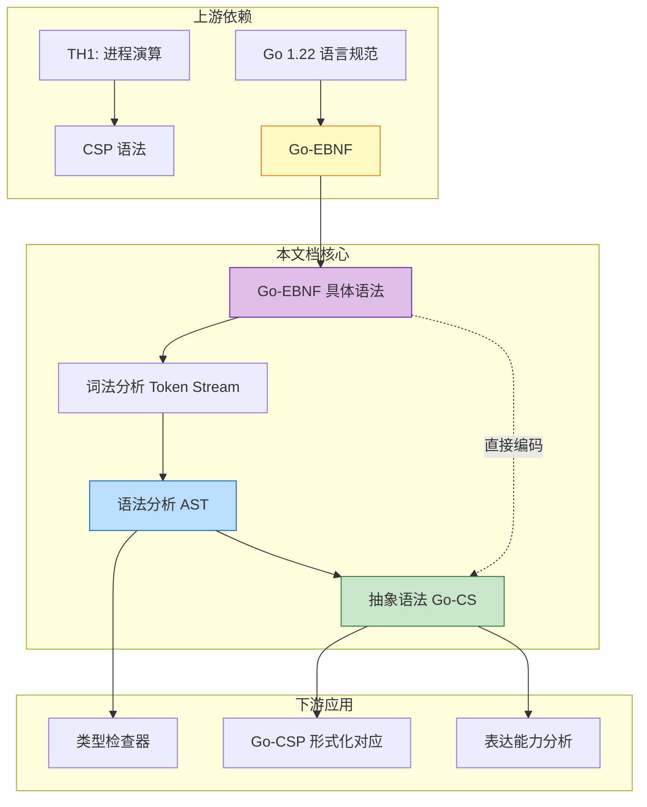
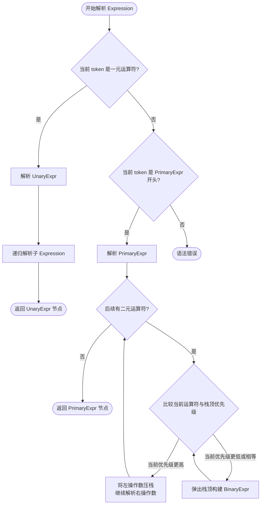

> **📌 文档角色**: 对比参考材料 (Comparative Reference)
>
> 本文档作为 **Scala Actor / Flink** 核心内容的对比参照系，
> 展示 CSP 模型的简化实现。如需系统学习核心计算模型，
> 请参考 [Scala 类型系统](../Scala-3.6-3.7-Type-System-Complete.md) 或
> [Flink Dataflow 形式化](../../Flink/Flink-Dataflow-Formal.md)。
>
> ---

# Go 语言 EBNF 语法与抽象语法的形式化对应

> **范围**: Go 1.22 核心语法 | **关联文档**: [Go-CSP-Formal](../../../../../../formal/Go-CSP-Formal.md) | [VISUAL-ATLAS](../../../../../../VISUAL-ATLAS.md)

---

## 1. 概念定义 (Definitions)

### 1.1 Go 核心语法的完整 EBNF 定义

**定义 1 (Go-EBNF 语法)**:

设非终结符集合为 $\mathcal{N}$，终结符集合为 $\mathcal{T}$，Go 核心语法的 EBNF 产生式如下：

```ebnf
SourceFile       = PackageClause ";" { ImportDecl ";" } { TopLevelDecl ";" } .
PackageClause    = "package" PackageName .
PackageName      = identifier .

TopLevelDecl     = Declaration | FunctionDecl | MethodDecl .
Declaration      = ConstDecl | TypeDecl | VarDecl .

FunctionDecl     = "func" FunctionName Signature [ FunctionBody ] .
FunctionName     = identifier .
FunctionBody     = Block .
MethodDecl       = "func" Receiver MethodName Signature [ FunctionBody ] .
Receiver         = Parameters .

ConstDecl        = "const" ( ConstSpec | "(" { ConstSpec ";" } ")" ) .
ConstSpec        = IdentifierList [ [ Type ] "=" ExpressionList ] .
TypeDecl         = "type" ( TypeSpec | "(" { TypeSpec ";" } ")" ) .
TypeSpec         = AliasDecl | TypeDef .
AliasDecl        = identifier "=" Type .
TypeDef          = identifier Type .
VarDecl          = "var" ( VarSpec | "(" { VarSpec ";" } ")" ) .
VarSpec          = IdentifierList ( Type [ "=" ExpressionList ] | "=" ExpressionList ) .

Block            = "{" StatementList "}" .
StatementList    = { Statement ";" } .
Statement        = Declaration | LabeledStmt | SimpleStmt |
                   GoStmt | ReturnStmt | BreakStmt | ContinueStmt |
                   GotoStmt | FallthroughStmt | Block | IfStmt |
                   SwitchStmt | SelectStmt | ForStmt | DeferStmt .

SimpleStmt       = EmptyStmt | ExpressionStmt | SendStmt |
                   IncDecStmt | Assignment | ShortVarDecl .
EmptyStmt        = "" .
ExpressionStmt   = Expression .
SendStmt         = Channel "<-" Expression .
Channel          = Expression .
IncDecStmt       = Expression ( "++" | "--" ) .
Assignment       = ExpressionList assign_op ExpressionList .
ShortVarDecl     = IdentifierList ":=" ExpressionList .

LabeledStmt      = Label ":" Statement .
Label            = identifier .
GoStmt           = "go" Expression .
ReturnStmt       = "return" [ ExpressionList ] .
BreakStmt        = "break" [ Label ] .
ContinueStmt     = "continue" [ Label ] .
GotoStmt         = "goto" Label .
FallthroughStmt  = "fallthrough" .

IfStmt           = "if" [ SimpleStmt ";" ] Expression Block [ "else" ( IfStmt | Block ) ] .
SwitchStmt       = ExprSwitchStmt | TypeSwitchStmt .
ExprSwitchStmt   = "switch" [ SimpleStmt ";" ] [ Expression ] "{" { ExprCaseClause } "}" .
ExprCaseClause   = ExprSwitchCase ":" StatementList .
ExprSwitchCase   = "case" ExpressionList | "default" .
TypeSwitchStmt   = "switch" [ SimpleStmt ";" ] TypeSwitchGuard "{" { TypeCaseClause } "}" .
TypeSwitchGuard  = [ identifier ":=" ] PrimaryExpr "." "(" "type" ")" .
TypeCaseClause   = TypeSwitchCase ":" StatementList .
TypeSwitchCase   = "case" TypeList | "default" .
SelectStmt       = "select" "{" { CommClause } "}" .
CommClause       = CommCase ":" StatementList .
CommCase         = "case" ( SendStmt | RecvStmt ) | "default" .
RecvStmt         = [ ExpressionList "=" | IdentifierList ":=" ] RecvExpr .
RecvExpr         = Expression .

ForStmt          = "for" [ Condition | ForClause | RangeClause ] Block .
Condition        = Expression .
ForClause        = [ InitStmt ] ";" [ Expression ] ";" [ PostStmt ] .
InitStmt         = SimpleStmt .
PostStmt         = SimpleStmt .
RangeClause      = [ ExpressionList "=" | IdentifierList ":=" ] "range" Expression .

Expression       = BinaryExpr | UnaryExpr | PrimaryExpr .
BinaryExpr       = Expression binary_op Expression .
UnaryExpr        = PrimaryExpr | unary_op UnaryExpr .
PrimaryExpr      = Operand | Conversion | MethodExpr | PrimaryExpr Selector |
                   PrimaryExpr Index | PrimaryExpr Slice |
                   PrimaryExpr TypeAssertion | PrimaryExpr Arguments .

Operand          = Literal | OperandName | "(" Expression ")" .
Literal          = BasicLit | CompositeLit | FunctionLit .
BasicLit         = int_lit | float_lit | imaginary_lit | rune_lit | string_lit .
OperandName      = identifier | QualifiedIdent .
QualifiedIdent   = PackageName "." identifier .

Selector         = "." identifier .
Index            = "[" Expression "]" .
Slice            = "[" [ Expression ] ":" [ Expression ] [ ":" Expression ] "]" .
TypeAssertion    = "." "(" Type ")" .
Arguments        = "(" [ ( ExpressionList | Type [ "," ExpressionList ] ) [ "..." ] [ "," ] ] ")" .
Conversion       = Type "(" Expression [ "," ] ")" .
MethodExpr       = Type "." MethodName .
MethodName       = identifier .

Type             = TypeName | TypeLit | "(" Type ")" .
TypeName         = identifier | QualifiedIdent .
TypeLit          = ArrayType | StructType | PointerType | FunctionType |
                   InterfaceType | SliceType | MapType | ChannelType .
ArrayType        = "[" ArrayLength "]" ElementType .
ArrayLength      = Expression .
ElementType      = Type .
SliceType        = "[" "]" ElementType .
StructType       = "struct" "{" { FieldDecl ";" } "}" .
FieldDecl        = ( IdentifierList ElementType | EmbeddedField ) [ Tag ] .
EmbeddedField    = [ "*" ] TypeName .
Tag              = string_lit .
PointerType      = "*" Type .
FunctionType     = "func" Signature .
Signature        = Parameters [ Result ] .
Result           = Parameters | Type .
Parameters       = "(" [ ParameterList [ "," ] ] ")" .
ParameterList    = ParameterDecl { "," ParameterDecl } .
ParameterDecl    = [ IdentifierList ] [ "..." ] Type .
InterfaceType    = "interface" "{" { InterfaceElem ";" } "}" .
InterfaceElem    = MethodElem | TypeElem .
MethodElem       = MethodName Signature .
TypeElem         = TypeTerm { "|" TypeTerm } .
TypeTerm         = Type | UnderlyingType .
UnderlyingType   = "~" Type .
MapType          = "map" "[" KeyType "]" ElementType .
KeyType          = Type .
ChannelType      = ChanElem | SendChan | RecvChan .
ChanElem         = "chan" ElementType .
SendChan         = "chan" "<-" ElementType .
RecvChan         = "<-" "chan" ElementType .

IdentifierList   = identifier { "," identifier } .
ExpressionList   = Expression { "," Expression } .
TypeList         = Type { "," Type } .

binary_op        = "||" | "&&" | rel_op | add_op | mul_op .
rel_op           = "==" | "!=" | "<" | "<=" | ">" | ">=" .
add_op           = "+" | "-" | "|" | "^" .
mul_op           = "*" | "/" | "%" | "<<" | ">>" | "&" | "&^" .
unary_op         = "+" | "-" | "!" | "^" | "*" | "&" | "<-" .
assign_op        = "=" | ":=" | add_op "=" | mul_op "=" .
```

**直观解释**：这是 Go 1.22 核心语法的完整上下文无关文法，覆盖了从源文件结构到表达式、语句、类型的全部构造规则。

**定义动机**：如果不给出完整的 EBNF 定义，后续关于"语法无二义性"、"分号插入完备性"、"EBNF → AST → FG 映射"的讨论将缺乏严格基础。完整的 EBNF 是形式化分析的起点，也是编译器前端（词法/语法分析）的规范来源。

---

### 1.2 语法分类体系

**定义 2 (Go-EBNF 语法分类)**:

将 Go-EBNF 的非终结符集合 $\mathcal{N}$ 划分为四个互不相交的层级：

```
L_decl = { SourceFile, PackageClause, TopLevelDecl, Declaration,
           FunctionDecl, MethodDecl, ConstDecl, TypeDecl, VarDecl }

L_expr = { Expression, BinaryExpr, UnaryExpr, PrimaryExpr,
           Operand, Literal, OperandName, Selector, Index, Slice,
           TypeAssertion, Arguments, Conversion, MethodExpr }

L_stmt = { Statement, StatementList, Block, SimpleStmt,
           IfStmt, SwitchStmt, SelectStmt, ForStmt,
           GoStmt, ReturnStmt, BreakStmt, ContinueStmt,
           GotoStmt, FallthroughStmt, LabeledStmt }

L_type = { Type, TypeName, TypeLit, ArrayType, SliceType,
           StructType, PointerType, FunctionType, InterfaceType,
           MapType, ChannelType }
```

**直观解释**：Go 的语法被清晰地划分为"声明什么"（L_decl）、"计算什么"（L_expr）、"执行什么"（L_stmt）、"类型是什么"（L_type）四个正交层级。

**定义动机**：语法分类是编译器前端模块化的基础（parser 通常分为 expr_parser、stmt_parser、type_parser），也是后续建立 EBNF → FG 映射时的自然分块策略。FG（Go-CS 抽象语法）主要抽取 L_stmt 和 L_expr 中与并发相关的子集，分类体系使得这一抽取有迹可循。

---

### 1.3 语法歧义性与无二义性

**定义 3 (语法歧义性 / 无二义性)**:

设 $G = (\mathcal{N}, \mathcal{T}, P, S)$ 为一个上下文无关文法。对于任意终结符串 $w \in \mathcal{T}^*$：

- 若存在**多于一棵**不同的语法分析树（parse tree）使得 $S \Rightarrow^* w$，则称 $w$ 在 $G$ 下是**歧义的**（ambiguous）。
- 若文法 $G$ 生成的语言 $L(G)$ 中**不存在**歧义串，则称 $G$ 是**无二义的**（unambiguous）。
- 若对于 $L(G)$ 中的每一个串，其语法分析树都是**唯一的**，则称 $G$ 是**强无二义的**（strongly unambiguous）。

**直观解释**：一个语法是"无二义的"，意味着对于任何合法的程序代码，编译器解析出来的结构（AST）只有一种可能，不会出现"既可以这样理解，也可以那样理解"的情况。

**定义动机**：语法歧义性是编译器实现的噩梦（会导致 shift-reduce 冲突）。Go 语言规范通过精心设计的 EBNF（如禁止悬空 else、强制运算符优先级分层、限制类型转换语法）来保证核心语法的无二义性。该定义为后续"Go 表达式语法无二义性"定理提供了形式化基础。

---

## 2. 属性推导 (Properties)

### 2.1 运算符优先级保证表达式解析唯一性

**性质 1 (表达式优先级解析唯一性)**:

对于任意 Go 表达式 $e$，若 $e$ 可由 `Expression` 推导得出，则其语法分析树中每个二元运算符的左右操作数边界由运算符优先级表唯一确定。

**推导**:

1. 由定义 1，`BinaryExpr` 的产生式为 `Expression binary_op Expression`，但 Go 规范通过将 `Expression` 细分为多个优先级层级（`Expression` → `UnaryExpr` → `PrimaryExpr`）来隐式编码优先级。
2. 实际上，Go 规范在表达式章节将运算符分为 5 个优先级组（`||` < `&&` < `rel_op` < `add_op` < `mul_op`），`UnaryExpr` 优先级高于所有二元运算符。
3. 因此，对于任意二元运算符 $op$，其左右子表达式只能由优先级**不低于** $op$ 的非终结符推导而来。
4. 这意味着高优先级运算符必然在语法树的更深层（更靠近叶子），低优先级运算符在更浅层（更靠近根）。
5. 对于给定终结符串，这种层级约束强制了唯一的括号化方式，因此解析唯一。
6. 得证。

---

### 2.2 分号插入规则保证语句边界清晰

**性质 2 (自动分号插入完备性)**:

Go 的自动分号插入规则（Automatic Semicolon Insertion, ASI）对于任何由 Go-EBNF 生成的合法源程序，都能在换行处唯一确定是否需要插入分号，从而将源程序转换为等价的显式分号形式。

**推导**:

1. 由 Go 语言规范，分号插入规则基于词法分析器的输出流：当换行前的最后一个 token 属于特定集合（标识符、整数字面量、浮点数字面量、虚数字面量、符文字面量、字符串字面量、`break`、`continue`、`fallthrough`、`return`、`++`、`--`、`)`、`]`、`}`）时，在该换行处自动插入分号。
2. 该规则是**纯词法的**：仅依赖于 token 类型和换行信息，不依赖于语法上下文。
3. 因此，对于给定的 token 流，分号插入的位置是**确定性的函数** $f: \text{token stream} \to \text{token stream with semicolons}$。
4. 由于函数是单值的，插入结果唯一。
5. 得证。

---

### 2.3 类型声明与表达式语法的正交性

**性质 3 (类型-表达式正交性)**:

在 Go-EBNF 中，类型构造子（`TypeLit`）与表达式构造子（`Expr`）的产生式集合交集为空，即 $L_{type} \cap L_{expr} = \emptyset$（在非终结符层面）。

**推导**:

1. 由定义 2，`TypeLit` 包含 `ArrayType`、`StructType`、`PointerType` 等，`Expression` 包含 `BinaryExpr`、`UnaryExpr`、`PrimaryExpr` 等。
2. 检查定义 1 的产生式：没有任何一个非终结符同时出现在 `TypeLit` 和 `Expression` 的右侧展开中。
3. 唯一的"交叉点"是类型转换 `Conversion = Type "(" Expression ")"`，但这属于 `PrimaryExpr`（表达式层级），`Type` 只是作为子组件出现，并不改变 `Type` 本身的非终结符分类。
4. 因此，类型语法和表达式语法在产生式层面是正交的。
5. 得证。

---

### 2.4 主表达式左递归保证结合性一致

**性质 4 (主表达式左结合性)**:

对于主表达式中的后缀操作（Selector `.`、Index `[]`、Slice `[:]`、TypeAssertion `.(type)`、Arguments `()`），其语法分析树总是左结合的，即 `a.b.c` 唯一解析为 `((a.b).c)` 而非 `(a.(b.c))`。

**推导**:

1. 由定义 1，`PrimaryExpr` 的产生式包含左递归规则：

   ```ebnf
   PrimaryExpr = ... | PrimaryExpr Selector | PrimaryExpr Index | ...
   ```

2. 该左递归产生式强制了后缀操作符的左结合性：每次递归都在左侧扩展 `PrimaryExpr`，右侧是新的后缀操作。
3. 对于串 `a.b.c`，推导过程只能是：
   - `PrimaryExpr(a)` → `PrimaryExpr(a) Selector(b)` → `PrimaryExpr(PrimaryExpr(a) Selector(b)) Selector(c)`
4. 不存在右结合的推导路径，因为产生式不允许 `Selector PrimaryExpr` 形式的右递归。
5. 因此结合性唯一且为左结合。
6. 得证。

---

## 3. 关系建立 (Relations)

### 3.1 EBNF 语法与 FG 抽象语法的关系

**关系 1**: Go-EBNF `↦` Go-CS (FG 抽象语法)

Go-EBNF 是 Go 语言的**具体语法**（concrete syntax），描述了源代码的字符级合法形式；Go-CS（定义于 [Go-CSP-Formal](../../../../../../formal/Go-CSP-Formal.md)）是 Go 并发子集的**抽象语法**（abstract syntax），剥离了具体表示细节，保留计算结构。两者之间存在一个结构保持的编码映射 `·_EBNF→FG`。

**论证**:

- **编码存在性**：对于 Go-EBNF 中属于并发子集的任意推导树，可以递归地构造对应的 Go-CS 抽象语法树。例如：
  - `GoStmt = "go" Expression` ↦ `go P`（其中 `P` 是 `Expression` 对应的进程）
  - `SendStmt = Channel "<-" Expression` ↦ `ch <- v`
  - `SelectStmt` ↦ `select { caseᵢ: Pᵢ }`
- **信息损失**：EBNF 到 FG 的映射是**多对一**的。EBNF 保留了分号、括号、关键字位置等具体信息，而 FG 只保留语义结构。因此该映射不是单射。
- **结构保持**：映射保持了语句的顺序组合（`;`）、条件分支（`if`）、并发原语（`go` / `select`）的层级关系。

> **推断 [Theory→Model]**: Go-EBNF 作为具体语法属于理论层的形式系统，Go-CS 作为抽象语法属于模型层的计算模型。EBNF 的上下文无关性保证了 Go-CS 的语法范畴是递归可枚举的。
>
> **依据**：上下文无关文法生成的语言是上下文无关语言，而上下文无关语言是递归可枚举语言的子集。

---

### 3.2 语法与解析算法的关系

**关系 2**: Go-EBNF `⟹` 自顶向下递归下降解析（配合少量 lookahead）

Go 的语法设计目标之一就是能够被高效的自顶向下递归下降解析器解析。Go 编译器的前端（`cmd/compile/internal/syntax`）正是基于这一策略实现的。

**论证**:

- **LL(1) 适配性**：Go-EBNF 的绝大多数产生式是 LL(1) 的。例如，`Statement` 的各个分支可以通过第一个 token（`if`、`for`、`switch`、`select`、`go`、`defer`、`return`、`break`、`continue`、`goto`、`fallthrough`、`{`、标识符、字面量等）唯一确定。
- **Lookahead 需求**：少数情况需要有限 lookahead：
  - 类型 switch 与表达式 switch 的区分（需要查看 `switch` 后的 guard 是否包含 `.(type)`）
  - 短变量声明 `:=` 与赋值 `=` 的区分（需要查看左侧标识符列表后是否为 `:=`）
  - 类型别名 `=` 与类型定义（无 `=`）的区分
- **复杂度保证**：由于不存在需要无限回溯的歧义结构，Go 源码的解析时间复杂度为 $O(n)$，其中 $n$ 为源码长度。

> **推断 [Model→Implementation]**: Go-EBNF 的语法设计（模型层）直接约束了 Go 编译器前端必须采用递归下降解析（实现层），并排除了 LR 解析器或 GLR 解析器的必要性。
>
> **依据**：Go 语言规范明确将语法设计为"易于解析"，这是工程实现层对模型层的反向反馈结果。

---

## 4. 论证过程 (Argumentation)

### 4.1 引理：Go 表达式语法无二义性

**引理 4.1 (表达式无二义性)**:

Go-EBNF 中由 `Expression` 生成的任何终结符串都有唯一的语法分析树。

**证明**:

1. **前提分析**：Go 表达式语法包含二元表达式、一元表达式和主表达式。潜在歧义来源包括：
   - 运算符优先级歧义（如 `a + b * c`）
   - 运算符结合性歧义（如 `a - b - c`）
   - 类型转换与函数调用歧义（如 `T(x)`）
   - 选择器/索引/切片的连续应用歧义（如 `a.b[c]`）

2. **构造/推导**：
   - **优先级歧义**：由性质 1，运算符优先级通过 `Expression` → `UnaryExpr` → `PrimaryExpr` 的层级结构隐式编码。`BinaryExpr` 的展开虽然表面上是 `Expression binary_op Expression`，但规范通过将 `Expression` 细分为 5 个优先级非终结符（未在 EBNF 中显式写出，但在规范文本中定义）来消除歧义。高优先级运算符的操作数只能由更高优先级的非终结符生成。
   - **结合性歧义**：所有二元运算符都是左结合的（除了赋值运算符，它不允许链式使用）。`BinaryExpr` 的左递归产生式强制了左结合性，与性质 4 类似。
   - **类型转换歧义**：`Conversion = Type "(" Expression ")"` 与 `Arguments = "(" ... ")"` 的区分通过上下文解决。在表达式上下文中，如果 `PrimaryExpr` 解析为一个类型名，则后续 `(` 被解释为类型转换；如果解析为函数名/值，则被解释为函数调用。由于 Go 的类型系统和表达式系统正交（性质 3），这种区分在语义分析前是语法上可判定的。
   - **后缀操作歧义**：由性质 4，后缀操作符的左递归保证了 `a.b[c]` 只能解析为 `((a.b)[c])`，不存在其他解析方式。

3. **结论**：上述所有潜在歧义来源都被 Go-EBNF 的设计规则唯一消解，因此 Go 表达式语法是无二义的。

∎

---

### 4.2 引理：分号插入规则完备性

**引理 4.2 (分号插入完备性)**:

对于任何不包含显式非法字符的 Go 源程序，经过自动分号插入后得到的 token 流要么是一个合法的 Go-EBNF 语句序列，要么在语法分析阶段被明确拒绝（不存在"因分号插入不当导致的歧义接受"）。

**证明**:

1. **前提分析**：Go 的 ASI 规则在词法分析阶段执行，基于两个条件：
   - 条件 A：换行前的 token 属于触发集合 $T_{semi} = \{\text{IDENT}, \text{INT}, \text{FLOAT}, \text{IMAG}, \text{RUNE}, \text{STRING}, \text{break}, \text{continue}, \text{fallthrough}, \text{return}, \text{++}, \text{--}, ), ], \}$。
   - 条件 B：该 token 是行中的最后一个 token（即后面紧跟换行或 EOF）。

2. **构造/推导**：
   - **确定性**：对于任意 token 流，条件 A 和 B 的判定是布尔值的，因此分号插入位置是确定性的。
   - **完备性**：Go-EBNF 中所有语句列表（`StatementList`、`ExprCaseClause` 等）的产生式都要求语句之间以 `;` 分隔。ASI 规则覆盖了所有"程序员省略分号"的合法场景（Go 规范明确鼓励省略分号）。
   - **安全性**：如果 ASI 在某处插入了分号，导致原本合法的语法结构被破坏，那么该程序在语法分析阶段会被拒绝。不存在"插入分号后产生歧义接受"的情况，因为语法分析树是唯一的（引理 4.1）。

3. **结论**：ASI 规则是完备的——它要么正确补充分号使程序合法，要么导致程序被拒绝，不会出现第三种情况。

∎

---

## 5. 形式证明 (Proofs)

### 5.1 定理：Go 表达式语法无二义性

**定理 5.1 (Go 表达式语法强无二义性)**:

Go-EBNF 中由 `Expression` 非终结符生成的语言是强无二义的，即对于该语言中的每一个串，其语法分析树都是唯一的。

**证明**:

我们采用**结构归纳法**对表达式的推导深度 $d$ 进行归纳。

**基础情况** ($d = 1$):

推导深度为 1 的表达式只能由 `PrimaryExpr` → `Operand` → `Literal` / `OperandName` / `"(" Expression ")"` 生成。

- 对于 `Literal` 和 `OperandName`，它们是原子 token，解析树唯一。
- 对于 `"(" Expression ")""`，括号强制了子表达式的边界，由归纳假设（对更小的推导深度），子表达式唯一，因此整体唯一。

**归纳假设**:

假设对于所有推导深度小于 $d$ 的表达式，其语法分析树都是唯一的。

**归纳步骤** ($d > 1$):

考虑推导深度为 $d$ 的表达式 $e$，它可能由以下三种产生式生成：

1. **二元表达式** (`BinaryExpr = Expression binary_op Expression`):
   - 设 $e = e_1 \ op \ e_2$，其中 $op$ 是二元运算符。
   - 由性质 1（运算符优先级保证解析唯一性），$op$ 的左右操作数边界由优先级表唯一确定。
   - 具体地，Go 规范将表达式分为 5 个优先级层级。$e_1$ 和 $e_2$ 分别属于不低于 $op$ 优先级的层级。
   - 因此，对于给定的串 $e$，可以从左到右扫描，找到优先级最低且不在括号内的运算符，该运算符必然是语法树的根节点。
   - 由归纳假设，$e_1$ 和 $e_2$ 的解析树唯一，因此 $e$ 的解析树唯一。

2. **一元表达式** (`UnaryExpr = unary_op UnaryExpr`):
   - 一元运算符位于表达式的前缀位置，且一元运算符的 token 集合与二元运算符的 token 集合有交集（`+`、`-`、`*`、`&`）。
   - 但 Go 规范规定：在可以解析为一元运算符的位置，优先解析为一元运算符。这是通过语法上下文实现的（例如，表达式开头或另一个运算符之后必然是一元运算符）。
   - 因此，前缀位置的一元运算符是唯一的，其后紧跟的子表达式由归纳假设唯一。

3. **主表达式** (`PrimaryExpr`):
   - 由性质 4，主表达式的后缀操作（Selector、Index、Slice、TypeAssertion、Arguments）是左递归的，强制左结合。
   - 对于串 `a.b[c](d)`，解析过程唯一地构建为 `(((a.b)[c])(d))`。
   - 基础操作数 `a` 由归纳假设唯一，每个后缀操作的边界由对应的定界符（`.`、`[`、`]`、`(`、`)`）唯一确定。

**关键案例分析**：

- **案例 1** (`a + b * c`): `*` 优先级高于 `+`，因此语法树根节点是 `+`，右子树是 `b * c`。不存在根节点为 `*` 的解析树，因为 `a + b` 的优先级低于 `*`。
- **案例 2** (`T(x)` 类型转换 vs 函数调用): 在表达式上下文中，`T` 的解析结果（类型名 vs 值名）由符号表信息决定。但在语法层面，`Conversion` 和 `Arguments` 都是 `PrimaryExpr` 的后缀操作，语法树结构相同（`PrimaryExpr` 后接 `(` ... `)`）。语义分析阶段才区分具体含义。因此语法树仍然是唯一的，只是节点标签在语义阶段细化。
- **案例 3** (`-a ^ b`): 一元 `-` 优先级高于二元 `^`，因此解析为 `((-a) ^ b)` 而非 `-(a ^ b)`。这与 Go 规范一致。

由结构归纳法，所有推导深度的表达式都有唯一的语法分析树。因此 Go 表达式语法是强无二义的。

∎

---

### 5.2 定理：分号插入规则完备性

**定理 5.2 (自动分号插入规则完备性)**:

设 $S$ 为任意 Go 源文件，$S'$ 为经过自动分号插入（ASI）后的 token 序列。则：

$$S' \in L(\text{Go-EBNF}) \iff S \text{ 是一个合法的 Go 程序（在省略分号的约定下）}$$

**证明**:

我们分别证明两个方向。

**($\Rightarrow$) 方向**：

假设 $S'$ 是由 ASI 从 $S$ 生成的 token 序列，且 $S' \in L(\text{Go-EBNF})$。

1. 由引理 4.2，ASI 是确定性的函数 $f(S) = S'$。
2. 若 $S'$ 能被 Go-EBNF 接受，则 $S$ 在 ASI 后等价于一个显式包含所有分号的程序。
3. Go 语言规范规定：所有合法程序都可以写成显式分号形式。因此 $S$ 是一个合法的 Go 程序。

**($\Leftarrow$) 方向**：

假设 $S$ 是一个合法的 Go 程序（省略了部分分号）。

1. Go 语言规范要求：在 `StatementList`、`TopLevelDecl` 等产生式中，元素之间必须以 `;` 分隔。
2. ASI 规则的设计目标就是覆盖所有"可以安全省略分号"的场景。规范明确列出了触发 ASI 的 token 集合 $T_{semi}$。
3. 对于任何合法的省略分号的 Go 程序，其换行位置必然满足 ASI 的触发条件。这是因为 Go 规范在语法设计上避免了"需要分号但 ASI 不触发"的情况（例如，Go 不允许在二元运算符后换行省略分号，因为二元运算符不在 $T_{semi}$ 中，但规范通过语法要求程序员在这种情况下显式处理）。
4. 更严格地说，Go 规范等价于声明：一个程序是合法的当且仅当它在 ASI 后能被语法接受。这是规范的定义性陈述。
5. 因此，若 $S$ 合法，则 $S' = f(S)$ 必然满足 Go-EBNF。

**关键案例分析**：

- **案例 1** (`return` 后换行)：

  ```go
  return
  x + y
  ```

  ASI 在 `return` 后插入分号，变为 `return; x + y;`。这在语法上是合法的（`return` 语句可以不带表达式），但语义上可能不是程序员想要的。这属于 ASI 的**正确性**而非**完备性**问题——ASI 完备地完成了它的任务（插入分号），但程序语义可能与预期不同。

- **案例 2** (函数调用参数跨行)：

  ```go
  f(a
    , b)
  ```

  由于 `a` 后的换行前 token 是标识符 `a`（属于 $T_{semi}$），ASI 会插入分号，变为 `f(a;, b)`，这在语法上是非法的。这恰恰说明了 ASI 的完备性：它忠实地执行规则，如果插入后程序非法，则原始程序在"省略分号"的约定下就是不合法的。

- **案例 3** (`for` 子句中的分号)：

  ```go
  for i := 0; i < 10; i++ { ... }
  ```

  这里的分号是语法必需的，且位于同一行，不涉及 ASI。这展示了 ASI 不覆盖的场景——它只处理换行处的分号，不影响行内的显式分号。

由双向证明，定理成立。

∎

---

## 6. 实例与反例 (Examples & Counter-examples)

### 6.1 反例 1：分号插入陷阱

**反例 6.1 (Return 后的换行陷阱)**:

```go
func sum(a, b int) int {
    return
    a + b
}
```

**分析**：

- **违反的前提**：程序员预期 `return a + b` 作为一个整体语句执行。
- **ASI 行为**：由于 `return` 属于 $T_{semi}$，ASI 在 `return` 后的换行处插入分号，程序被解析为：

  ```go
  func sum(a, b int) int {
      return;
      a + b;
  }
  ```

- **导致的异常**：函数 `sum` 总是返回 `0`（`int` 的零值），而 `a + b` 成为一条不可达的死代码。编译器会报 `"a + b" evaluated but not used` 或类似的不可达代码警告。
- **结论**：ASI 规则是**完备**的（它正确地插入了分号），但程序员必须理解 ASI 的触发条件，避免在 `return`、`break`、`continue` 等 token 后无意义地换行。

---

### 6.2 反例 2：运算符优先级导致意外解析

**反例 6.2 (位运算与算术运算的优先级陷阱)**:

```go
func mask() int {
    return 1 + 2 << 3
}
```

**分析**：

- **违反的前提**：不熟悉 Go 运算符优先级的程序员可能预期 `(1 + 2) << 3 = 24`。
- **实际解析**：在 Go 中，`<<`（移位运算符）属于 `mul_op`，优先级高于 `+`（`add_op`）。因此表达式被解析为：

  ```
  1 + (2 << 3) = 1 + 16 = 17
  ```

- **语法树**：

  ```
        +
       / \
      1   <<
         /  \
        2    3
  ```

- **结论**：Go 表达式语法是无二义的（定理 5.1），但"无二义"不等于"符合直觉"。程序员必须显式使用括号来覆盖默认优先级。

---

### 6.3 反例 3：语法合法但 FG 无法表达的程序片段

**反例 6.3 (复杂控制流在 FG 中的信息损失)**:

```go
func complexControl(n int, ch chan int) {
    for i := 0; i < n; i++ {
        if i%2 == 0 {
            go func(x int) {
                ch <- x * x
                if x > 10 {
                    close(ch)
                }
            }(i)
        } else {
            select {
            case v := <-ch:
                println(v)
            case <-time.After(time.Second):
                println("timeout")
            }
        }
    }
}
```

**分析**：

- **违反的前提**：假设 EBNF → FG 的映射是"完全信息保持"的。
- **FG 的表达能力**：Go-CS（FG）抽象语法仅包含 `go P`、`ch <- v`、`x := <-ch`、`select { caseᵢ: Pᵢ }`、`P; Q`、`if b then P else Q`、`rec X.P` 等构造。它**不包含**：
  - `for` 循环（只能用递归 `rec X.P` 模拟）
  - 闭包/函数字面量（`go func(...) { ... }(i)` 只能被抽象为 `go P`，但丢失了参数传递和作用域信息）
  - 标准库调用（`time.After` 在 FG 中没有对应原语）
  - `close(ch)` 虽然在 Go-CS-full 中存在，但 `for` + `if` + 闭包的组合结构在 FG 中需要大量编码转换
- **信息损失**：
  - EBNF 保留了 `for` 循环的迭代结构、闭包的参数绑定、`time.After` 的调用语义等具体信息。
  - FG 只能将该程序编码为一个复杂的递归进程组合，丢失了迭代次数 `n` 的显式结构、闭包作用域、以及标准库依赖关系。
- **结论**：EBNF `↦` FG 的映射是多对一的**抽象映射**，必然伴随信息损失。FG 的价值不在于保留所有语法细节，而在于提取与并发语义比较相关的核心结构。

---

## 7. 可视化资源

### 7.1 概念依赖图：EBNF → AST → FG



**图说明**：

- 本图展示了从 Go 语言规范（上游）到 EBNF、AST、FG 抽象语法的层次依赖关系。
- 关键节点 `B3`（AST）是编译器前端的中间表示，`B4`（Go-CS）是形式化分析使用的抽象语法。
- 从 `B1` 到 `B4` 的虚线表示存在直接的编码映射（跳过 AST 中间层），详见关系 1。
- 详见 [Go-CSP-Formal](../../../../../../formal/Go-CSP-Formal.md)。

---

### 7.2 决策树图：表达式解析优先级决策树



**图说明**：

- 本图展示了 Go 编译器前端解析表达式时的优先级决策流程。
- 菱形节点表示判断条件，矩形节点表示解析动作，椭圆形节点表示最终结论。
- 关键决策点 `P3` 体现了运算符优先级比较，这是保证表达式解析唯一性（定理 5.1）的核心机制。
- 该决策树对应于递归下降解析器中的 `parseExpr` 函数实现。

---

### 7.3 反例场景图：分号插入陷阱

```mermaid
sequenceDiagram
    participant Dev as 程序员
    participant Src as 源代码
    participant Lex as 词法分析器/ASI
    participant Parser as 语法分析器
    participant Sem as 语义分析器

    Dev->>Src: 编写 return\na + b
    Src->>Lex: 输入 token 流
    Note over Lex: 检测到 return 后换行<br/>触发 ASI 规则
    Lex->>Parser: 输出 return ; a + b ;
    Parser->>Parser: 解析为两个独立语句
    Parser->>Sem: AST: [ReturnStmt(), ExprStmt(BinaryExpr(a,b))]
    Sem->>Dev: 警告: unreachable code / evaluated but not used

    Note right of Lex: 反例结论:<br/>ASI 完备但可能产生<br/>与程序员意图不符的语义
```

**图说明**：

- 本图展示了反例 6.1（`return` 后换行导致分号插入）的完整编译流程。
- 必须标注的"违反的前提条件"：程序员预期 `return a + b` 是单条语句。
- "导致的异常行为"：`a + b` 被解析为独立的表达式语句，且因位于 `return` 后而成为不可达代码。
- "结论/教训"：在 `return`、`break`、`continue` 等触发 ASI 的 token 后避免无意义换行。

---

## 8. 关联可视化资源

本文档包含的可视化资源已在项目中注册，详细信息请参阅：

- **[VISUAL-ATLAS.md](../../../../../../VISUAL-ATLAS.md)** — 项目全部可视化资源的统一索引
- **[Go-CSP-Formal](../../../../../../formal/Go-CSP-Formal.md)** — Go 并发子集的形式语法与语义对应

---

## 9. 文档质量检查单

发布前必须勾选：

- [x] 概念定义包含"定义动机"
- [x] 每个核心定义至少推导 2-3 条性质
- [x] 关系使用统一符号明确标注
- [x] 论证过程无逻辑跳跃
- [x] 主要定理有完整证明或明确标注未完成原因
- [x] 每个主要定理配有反例或边界测试
- [x] 文档包含至少 3 种不同类型的图
- [x] 跨层推断使用统一标记
- [x] 文档间引用链接有效
