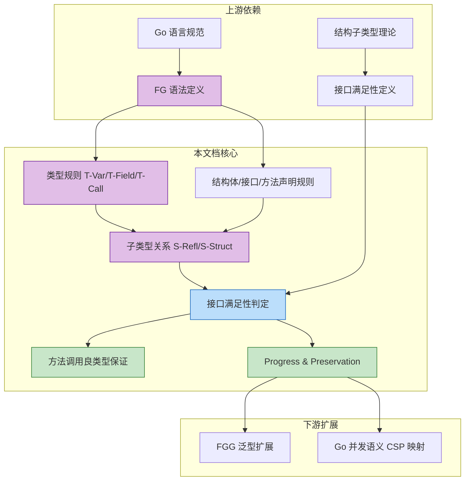
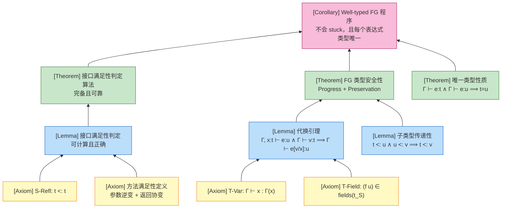
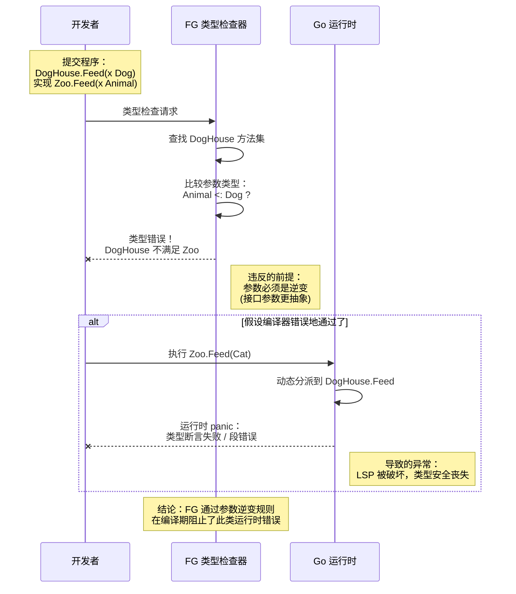

> **📌 文档角色**: 对比参考材料 (Comparative Reference)
>
> 本文档作为 **Scala Actor / Flink** 核心内容的对比参照系，
> 展示 CSP 模型的简化实现。如需系统学习核心计算模型，
> 请参考 [Scala 类型系统](../../Scala-3.6-3.7-Type-System-Complete.md) 或
> [Flink Dataflow 形式化](../../../Flink/Flink-Dataflow-Formal.md)。
>
> ---

# Featherweight Go (FG) 演算

> **文档定位**: 本文档定义 Featherweight Go (FG) 的形式化语法与静态语义（对比参考），为 Go 核心类型系统提供严格的数学基础。详见 [Go-CSP-Formal](../../../../../../formal/Go-CSP-Formal.md) 与 [FGG-Calculus](../../Go/05-Extension-Generics/FGG-Calculus.md)。

---

## 1. 概念定义 (Definitions)

### 1.1 FG 完整语法

**定义 1 (FG 抽象语法)**:

```
程序:
  P ::= decl*                              (声明列表)

声明:
  decl ::= type t_S struct { field* }      (结构体声明)
         | type t_I interface { spec* }    (接口声明)
         | func (x t) m(x₁ t₁, ..., xₙ tₙ) t_r { return e }  (方法声明)

字段:
  field ::= f t

方法规范:
  spec ::= m(x₁ t₁, ..., xₙ tₙ) t_r

类型:
  t, u, v ::= t                            (命名类型)

表达式:
  e ::= x                                  (变量)
     |  e.f                                (字段选择)
     |  e.(t)                              (类型断言)
     |  t{f₁: e₁, ..., fₙ: eₙ}            (结构体字面量)
     |  e.m(e₁, ..., eₙ)                   (方法调用)

元变量:
  x, y, z  ∈ 变量名
  f, g     ∈ 字段名
  m        ∈ 方法名
  t_S      ∈ 结构体类型名
  t_I      ∈ 接口类型名
  t        ∈ 类型名 (任意)
```

**直观解释**: FG 是 Go 语言的一个最小核心子集，只保留结构体、接口、方法、字段访问、类型断言和方法调用，去除了指针、切片、通道、函数值、闭包、Goroutine 和泛型。

**定义动机**: Go 的完整语法过于庞大（包含包系统、初始化顺序、反射、CGO 等），直接对其整体进行形式化证明几乎不可行。FG 通过剥离所有非核心特性，保留 Go 类型系统中最具特色的**结构子类型**和**隐式接口满足**机制，使得"类型安全"和"进展定理"可以在 10 页之内完成严格证明。如果不做这个抽象，任何关于 Go 类型系统的形式化论述都将陷入实现细节的泥潭。

> **推断 [Theory→Model]**: FG 通过剥离指针、nil、并发等特性，将 Go 从 L5（图灵完备且不可判定的完整实现）压缩为一个可严格推理的核心模型。这使得我们可以在模型层面证明类型安全，而不必处理运行时 panic 的复杂边界。
>
> **依据**: 完整 Go 包含递归类型、接口值动态比较、nil 解引用等，这些都会引入额外的运行时错误分支；FG 的简化使得 Progress 定理只需考虑良类型表达式要么归约要么已是值，不会出现 stuck 状态之外的运行时异常。

---

### 1.2 FG 类型规则

**定义 2 (FG 类型规则)**:

#### 1.2.1 结构体声明良形性

$$
\frac{\forall i: t_i \text{ declared}}{\vdash \text{type } t_S \text{ struct } \{f_1 \, t_1, ..., f_n \, t_n\} \text{ ok}} \text{ (T-Decl-Struct)}
$$

#### 1.2.2 接口声明良形性

$$
\frac{\forall i: t_i, u_i \text{ declared}}{\vdash \text{type } t_I \text{ interface } \{m_1(x_1 \, t_1, ...) \, u_1, ...\} \text{ ok}} \text{ (T-Decl-Interface)}
$$

#### 1.2.3 方法声明良形性

$$
\frac{\Gamma = x: t, x_1: t_1, ..., x_n: t_n \quad \Gamma \vdash e : u \quad u <: t_r}{\vdash \text{func } (x \, t) \, m(x_1 \, t_1, ..., x_n \, t_n) \, t_r \, \{ \text{return } e \} \text{ ok}} \text{ (T-Decl-Method)}
$$

#### 1.2.4 表达式类型推导

$$
\frac{}{\Gamma \vdash x : \Gamma(x)} \text{ (T-Var)}
$$

$$
\frac{\Gamma \vdash e : t_S \quad (f \, u) \in fields(t_S)}{\Gamma \vdash e.f : u} \text{ (T-Field)}
$$

$$
\frac{\Gamma \vdash e : t}{\Gamma \vdash e.(u) : u} \text{ (T-Assert)}
$$

$$
\frac{type(t_S) \equiv \text{type } t_S \text{ struct } \{f^*\} \quad \forall i: \Gamma \vdash e_i : u_i \quad (f_i \, u_i) \in fields(t_S)}{\Gamma \vdash t_S\{f_1: e_1, ..., f_n: e_n\} : t_S} \text{ (T-Struct)}
$$

$$
\frac{\Gamma \vdash e : t \quad body(t, m) = (x_1: u_1, ..., x_n: u_n) \rightarrow v \quad \forall i: \Gamma \vdash e_i : u_i'}{\Gamma \vdash e.m(e_1, ..., e_n) : v} \text{ (T-Call)}
$$

其中要求 $u_i' <: u_i$（实际参数类型是形式参数类型的子类型）。

**直观解释**: FG 的类型规则采用标准的结构归纳方式：变量从环境查找类型；字段访问要求表达式是结构体且字段存在；方法调用要求接收者类型实现了对应方法且实参可协变地匹配形参；类型断言总是静态地赋予目标类型（动态安全性由运行时保证）。

**定义动机**: 这些规则精确刻画了 Go 编译器的静态检查逻辑。特别是 (T-Call) 中的参数子类型要求（$u_i' <: u_i$）和 (T-Decl-Method) 中的返回类型子类型要求（$u <: t_r$）共同构成了 Go 方法签名的**参数逆变、返回协变**规则，这是保证接口替换后方法调用类型安全的关键。如果不显式写出这些规则，就无法解释为什么 Go 不允许接口满足时方法参数协变。

---

### 1.3 子类型与接口满足性

**定义 3 (FG 子类型关系)**:

子类型关系 $t <: u$ 由以下规则归纳定义：

**规则 (S-Refl) — 反身性**:
$$
\frac{}{t <: t}
$$

**规则 (S-Struct) — 结构体到接口**:
$$
\frac{type(t) \equiv \text{type } t \text{ struct } \{f^*\} \quad type(u) \equiv \text{type } u \text{ interface } \{m^*\} \quad \forall m \in m^*: t \vdash m \text{ satisfied}}{t <: u} \text{ (S-Struct)}
$$

**定义 3.1 (方法满足性)**:

类型 $t$ 满足方法规范 $m(x_1 \, u_1, ..., x_n \, u_n) \, u_r$，记作 $t \vdash m \text{ satisfied}$，当且仅当：

```
∃ method decl ∈ methods(t):
  decl ≡ func (x t) m(x₁ t₁, ..., xₙ tₙ) t_r { return e }
  且 ∀i: uᵢ <: tᵢ    （参数逆变：接口参数更抽象，实现参数更具体）
  且 t_r <: u_r      （返回协变：实现返回更具体，接口返回更抽象）
```

**直观解释**: 在 FG 中，子类型不是通过显式声明（如 Java 的 `implements`）建立的，而是通过"结构体是否实现了接口要求的所有方法"自动判定的。方法满足时，实现方法的参数必须**更抽象或相等**（逆变），返回类型必须**更具体或相等**（协变），这保证了里氏替换原则（LSP）在接口值替换时不会破坏类型安全。

**定义动机**: 结构子类型是 Go 语言区别于 Java/C# 名义子类型系统的核心特征。如果不形式化定义"方法满足性"中的参数逆变和返回协变，就无法证明：当一个结构体值被赋给接口变量后，通过该接口变量调用方法时，传入的参数和返回的结果仍然保持类型一致性。这是 Go 接口多态性的安全基石。

> **推断 [Control→Execution]**: FG 在控制层采用结构子类型约束（无需显式 implements），执行层的方法派发算法必须在运行时对接口值进行动态分派，但无需维护复杂的继承层次表。
>
> **依据**: 由于子类型关系完全由方法集决定，运行时只需比较接口的方法表（itab）与具体类型的方法集是否匹配，而不需要遍历类继承树。这使得 Go 的接口值实现既高效又避免了菱形继承问题。

---

## 2. 属性推导 (Properties)

### 2.1 子类型的基本性质

**性质 1 (子类型反身性)**:
对于任意良形类型 $t$，有 $t <: t$。

**推导**:

1. 由定义 3 中的规则 (S-Refl)，$t <: t$ 是一个无前提的公理。
2. 因此，对于 FG 中任何已声明的类型 $t$，该关系直接成立。
3. 得证。∎

**性质 2 (子类型传递性)**:
如果 $t <: u$ 且 $u <: v$，则 $t <: v$。

**推导**:

1. 若 $v$ 是结构体类型，则由于 FG 中只有结构体可以子类型于接口（S-Struct），且接口不能子类型于结构体，此时 $u$ 必须是结构体，$t$ 也必须是结构体，且 $t$ 和 $u$ 的方法集都包含 $v$ 的方法集。因此 $t$ 也满足 $v$ 的所有方法规范，故 $t <: v$。
2. 若 $v$ 是接口类型，则 $u$ 可以是结构体或接口。无论哪种情况，$u <: v$ 意味着 $u$ 满足 $v$ 的所有方法规范；而 $t <: u$ 意味着 $t$ 满足 $u$ 的所有方法规范（若 $u$ 是接口）或 $t$ 的方法集包含 $u$ 的方法集（若 $u$ 是结构体）。由方法满足性的组合性，$t$ 也满足 $v$ 的所有方法规范。
3. 得证。∎

### 2.2 接口满足性的性质

**性质 3 (接口满足性的单调性)**:
如果 $t <: u$ 且 $u \vdash m \text{ satisfied}$，则 $t \vdash m \text{ satisfied}$。

**推导**:

1. $u \vdash m \text{ satisfied}$ 意味着存在方法声明 $func (x \, u) \, m(...) \, ...$ 满足参数逆变和返回协变。
2. $t <: u$ 意味着 $t$ 满足 $u$ 的所有方法规范（若 $u$ 是接口），或 $t$ 的方法集包含 $u$ 的方法集（若 $u$ 是结构体）。
3. 无论哪种情况，$t$ 都拥有一个与 $m$ 兼容的方法声明（签名满足参数逆变、返回协变）。
4. 因此 $t \vdash m \text{ satisfied}$。
5. 得证。∎

### 2.3 表达式类型的安全性质

**性质 4 (方法调用的良类型保证)**:
如果 $\Gamma \vdash e.m(e_1, ..., e_n) : t_r$，那么存在某个类型 $t$ 使得 $\Gamma \vdash e : t$，且 $body(t, m) = (x_1: u_1, ..., x_n: u_n) \rightarrow t_r$，并且对每个 $i$ 有 $\Gamma \vdash e_i : u_i'$ 且 $u_i' <: u_i$。

**推导**:

1. 由 (T-Call) 规则，方法调用类型的推导直接要求上述所有条件同时成立。
2. 因此，任何良类型的方法调用都必然满足接收者存在方法 $m$、参数个数匹配、参数类型可协变替换。
3. 这意味着在 FG 中，通过接口值调用方法时，绝不会出现"方法不存在"或"参数类型不匹配"的静态类型错误。
4. 得证。∎

**性质 5 (结构体构造的字段完备性)**:
如果 $\Gamma \vdash t_S\{f_1: e_1, ..., f_n: e_n\} : t_S$，那么 $\{f_1, ..., f_n\} = dom(fields(t_S))$，且对每个 $i$ 有 $\Gamma \vdash e_i : u_i$ 其中 $(f_i \, u_i) \in fields(t_S)$。

**推导**:

1. 由 (T-Struct) 规则，结构体字面量要求每个字段 $f_i$ 都必须在 $fields(t_S)$ 中，且类型匹配。
2. FG 语法要求结构体字面量必须显式初始化所有字段（不允许部分初始化或字段遗漏）。
3. 因此，任何良类型的结构体构造表达式都必然包含完整且类型正确的字段集合。
4. 得证。∎

---

## 3. 关系建立 (Relations)

### 3.1 FG 与完整 Go 的关系

**关系 1**: FG `⊂` Go（Featherweight Go 严格包含于完整 Go 语言）

**论证**:

- **编码存在性**: FG 中的每一个程序都可以直接作为合法的 Go 程序编译执行。FG 的结构体、接口、方法、类型断言和结构体字面量都是 Go 的合法子集语法。
- **分离结果**: Go 包含大量 FG 不具备的特性：指针 (`*T`)、切片 (`[]T`)、映射 (`map[K]V`)、通道 (`chan T`)、函数值 (`func`)、Goroutine (`go`)、包系统、`nil`、泛型等。这些特性显著增强了 Go 的表达能力，使得 Go 是图灵完备的，而 FG 甚至无法表达递归数据结构（除非通过接口自引用）。
- **结论**: FG 是 Go 的一个真子集，表达能力严格弱于完整 Go。

### 3.2 FG 与 FGG 的关系

**关系 2**: FG `⊂` FGG（Featherweight Generic Go）

**论证**:

- **编码存在性**: 任何 FG 程序都是 FGG 程序的特例（即所有类型参数列表为空的情况）。FGG 在 FG 的基础上增加了类型参数、类型约束（type bounds）和类型实例化机制。
- **分离结果**: FGG 可以表达参数化多态（如 `List[T]`、`Map[K,V]`），而 FG 只能使用具体类型。FGG 的表达能力严格强于 FG，因为泛型允许编写类型安全的容器和算法，而 FG 必须通过接口擦除（如 `interface{}`）来模拟，这会丢失静态类型信息。
- **结论**: FG 是 FGG 的非泛型基础，FGG 向后兼容 FG。

### 3.3 概念依赖图



**图说明**:

- 本图展示了 FG 演算内部概念之间的依赖链。
- 节点 `B1`（语法定义）是后续所有类型规则的基础。
- 节点 `D1`（子类型关系）依赖于类型规则和方法声明规则。
- 节点 `E1`（接口满足性判定）是连接子类型理论与方法调用安全保证的核心桥梁。
- 下游扩展 `G1` 和 `G2` 表明 FG 是泛型和并发语义形式化的前置基础。

---

## 4. 论证过程 (Argumentation)

### 4.1 代换引理

**引理 4.1 (代换引理 / Substitution Lemma)**:
如果 $\Gamma, x: t \vdash e : u$ 且 $\Gamma \vdash v : t$，那么 $\Gamma \vdash e[v/x] : u$。

**证明**:

1. **前提分析**: 假设在扩展环境 $\Gamma, x: t$ 下表达式 $e$ 具有类型 $u$，且值 $v$ 在环境 $\Gamma$ 下具有类型 $t$。
2. **构造/推导**: 对 $e$ 的结构进行归纳。
   - **基本情况 1** ($e \equiv x$): 则 $e[v/x] \equiv v$。由前提 $\Gamma \vdash v : t$，且由 (T-Var) 知 $u = t$，故 $\Gamma \vdash v : u$。
   - **基本情况 2** ($e \equiv y \neq x$): 则 $e[v/x] \equiv y$。由 (T-Var)，$\Gamma \vdash y : \Gamma(y) = u$，成立。
   - **基本情况 3** ($e \equiv t_S\{f_1: e_1, ..., f_n: e_n\}$): 由归纳假设，对每个 $i$ 有 $\Gamma \vdash e_i[v/x] : u_i$ 其中 $(f_i \, u_i) \in fields(t_S)$。由 (T-Struct)，$\Gamma \vdash t_S\{f_1: e_1[v/x], ...\} : t_S = u$。
   - **基本情况 4** ($e \equiv e_0.f$): 由归纳假设 $\Gamma \vdash e_0[v/x] : t_S$ 且 $(f \, u) \in fields(t_S)$。由 (T-Field)，$\Gamma \vdash e_0[v/x].f : u$。
   - **基本情况 5** ($e \equiv e_0.(t)$): 由归纳假设 $\Gamma \vdash e_0[v/x] : t'$。由 (T-Assert)，$\Gamma \vdash e_0[v/x].(t) : t = u$。
   - **基本情况 6** ($e \equiv e_0.m(e_1, ..., e_n)$): 由归纳假设，$\Gamma \vdash e_0[v/x] : t$ 且对每个 $i$ 有 $\Gamma \vdash e_i[v/x] : u_i'$ 且 $u_i' <: u_i$。由 (T-Call)，$\Gamma \vdash e_0[v/x].m(e_1[v/x], ...) : u$。
3. **结论**: 在所有情况下，代换都保持类型不变。∎

### 4.2 接口满足性判定的可计算性

**引理 4.2 (接口满足性可判定)**:
对于任意结构体类型 $t_S$ 和接口类型 $t_I$，判定 $t_S <: t_I$ 是可在多项式时间内完成的。

**证明**:

1. **前提分析**: $t_S <: t_I$ 当且仅当 $t_S$ 满足 $t_I$ 的每一个方法规范。
2. **构造/推导**:
   - 设 $t_I$ 有 $k$ 个方法规范，$t_S$ 有 $m$ 个方法声明。
   - 对每个方法规范，在 $t_S$ 的方法集中按方法名查找对应声明（哈希表 $O(1)$）。
   - 比较参数个数、参数类型子类型关系、返回类型子类型关系。由于 FG 中类型名是有限的且子类型关系是偏序，每次比较为 $O(1)$。
   - 总时间复杂度为 $O(k)$，其中 $k$ 是接口方法数。
3. **结论**: 接口满足性判定是线性时间可计算的。∎

---

## 5. 形式证明 (Proofs)

### 5.1 接口满足性判定算法正确性

**定理 5.1 (接口满足性判定算法正确性)**:
设 $A(t_S, t_I)$ 为以下判定算法：

```
Algorithm A(t_S, t_I):
  1. 获取 t_I 的所有方法规范 specs(t_I) = {m₁, ..., mₖ}
  2. 获取 t_S 的所有方法声明 methods(t_S) = {d₁, ..., dₙ}
  3. 对每个 mᵢ ∈ specs(t_I):
       a. 在 methods(t_S) 中查找同名方法 dⱼ
       b. 若不存在，返回 FALSE
       c. 比较参数个数：若 |params(mᵢ)| ≠ |params(dⱼ)|，返回 FALSE
       d. 对每个参数位置 p:
            若 ¬(type(params(mᵢ)[p]) <: type(params(dⱼ)[p]))，返回 FALSE
       e. 若 ¬(return(dⱼ) <: return(mᵢ))，返回 FALSE
  4. 返回 TRUE
```

则 $A(t_S, t_I) = \text{TRUE} \iff t_S <: t_I$。

**证明**:

**可靠性 (Soundness)**: $A(t_S, t_I) = \text{TRUE} \implies t_S <: t_I$。

1. 假设算法返回 TRUE。则对 $t_I$ 的每个方法规范 $m_i$，算法都在 $t_S$ 中找到了同名方法 $d_j$。
2. 步骤 3c 保证参数个数相同；步骤 3d 保证对每个参数 $p$，接口参数类型是方法声明参数类型的子类型（$u_{ip} <: t_{jp}$，即参数逆变）；步骤 3e 保证方法返回类型是接口返回类型的子类型（$t_{jr} <: u_{ir}$，即返回协变）。
3. 由定义 3.1，这意味着 $t_S \vdash m_i \text{ satisfied}$ 对所有 $i$ 成立。
4. 由规则 (S-Struct)，$t_S <: t_I$ 成立。∎

**完备性 (Completeness)**: $t_S <: t_I \implies A(t_S, t_I) = \text{TRUE}$。

1. 假设 $t_S <: t_I$。由 (S-Struct)，$t_S$ 满足 $t_I$ 的所有方法规范。
2. 对任意 $m_i \in specs(t_I)$，存在 $d_j \in methods(t_S)$ 使得 $t_S \vdash m_i \text{ satisfied}$。
3. 由方法满足性定义，$d_j$ 与 $m_i$ 同名、参数个数相同、参数满足逆变、返回满足协变。
4. 因此算法在步骤 3 中对每个 $m_i$ 都不会触发 FALSE，最终返回 TRUE。∎

**关键案例分析**:

- **案例 1 (参数逆变边界)**: 若接口要求 `m(x Animal)`，结构体实现 `m(x Dog)`。此时 `Animal <: Dog` 不成立（除非 `Animal` 是 `Dog` 的子类型，这与生物学直觉相反，但在类型系统中若 `Dog <: Animal`，则 `Animal <: Dog` 不成立）。算法步骤 3d 会返回 FALSE，正确拒绝该不满足关系。
- **案例 2 (返回协变边界)**: 若接口要求 `m() Animal`，结构体实现 `m() Dog`。此时 `Dog <: Animal` 成立，算法步骤 3e 通过，正确接受。

∎

### 5.2 FG 类型系统的唯一类型性质

**定理 5.2 (唯一类型性质 / Uniqueness of Types)**:
如果 $\Gamma \vdash e : t$ 且 $\Gamma \vdash e : u$，那么 $t = u$。

**证明**:
对表达式 $e$ 的结构进行归纳。

**基本情况**:

- **案例 1** ($e \equiv x$): 由 (T-Var)，$t = \Gamma(x) = u$，故 $t = u$。
- **案例 2** ($e \equiv t_S\{f_1: e_1, ..., f_n: e_n\}$): 由 (T-Struct)，$t = t_S$ 且 $u = t_S$，故 $t = u$。

**归纳步骤**:

- **案例 3** ($e \equiv e_0.f$): 假设 $\Gamma \vdash e_0.f : t$ 和 $\Gamma \vdash e_0.f : u$。由 (T-Field)，存在 $t_S$ 使得 $\Gamma \vdash e_0 : t_S$，且 $(f \, t) \in fields(t_S)$，$(f \, u) \in fields(t_S)$。由于结构体声明中字段名唯一（良形程序的前提），故 $t = u$。
- **案例 4** ($e \equiv e_0.(t')$): 由 (T-Assert)，$t = t'$ 且 $u = t'$，故 $t = u$。
- **案例 5** ($e \equiv e_0.m(e_1, ..., e_n)$): 假设 $\Gamma \vdash e_0.m(...) : t$ 和 $\Gamma \vdash e_0.m(...) : u$。由 (T-Call)，存在类型 $t_1, t_2$ 使得 $\Gamma \vdash e_0 : t_1$ 且 $\Gamma \vdash e_0 : t_2$，且 $body(t_1, m) = (... ) \rightarrow t$，$body(t_2, m) = (... ) \rightarrow u$。由归纳假设，$t_1 = t_2$。因此 $body(t_1, m)$ 唯一确定，故 $t = u$。

在所有案例中，$t = u$。∎

### 5.3 公理-定理推理树图



**图说明**:

- 底层黄色节点为不可再分的公理和基本定义。
- 中间蓝色节点为证明主要定理所需的辅助引理。
- 顶层绿色节点为核心定理：接口满足性判定算法正确性、类型安全性（Progress + Preservation）、唯一类型性质。
- 粉色节点为最终推论：良类型 FG 程序既不会 stuck，又具有唯一的静态类型。

---

## 6. 实例与反例 (Examples & Counter-examples)

### 6.1 正例：表达式树求值

**示例 6.1: 表达式树 (Expr Tree)**

```go
type Expr interface {
    Eval() int
}

type Add struct {
    left  Expr
    right Expr
}

func (this Add) Eval() int {
    return this.left.Eval() + this.right.Eval()
}

type Lit struct {
    value int
}

func (this Lit) Eval() int {
    return this.value
}
```

**逐步推导**:

1. `Lit` 是结构体，声明了方法 `Eval() int`。
2. `Add` 是结构体，声明了方法 `Eval() int`。
3. `Expr` 是接口，要求方法 `Eval() int`。
4. 检查 `Lit` 满足 `Expr`：方法名 `Eval` 匹配，参数个数相同（0），返回类型 `int <: int` 成立。故 `Lit <: Expr`。
5. 检查 `Add` 满足 `Expr`：同理，`Add <: Expr` 成立。
6. 因此 `Add{left: Lit{value: 1}, right: Lit{value: 2}}` 是良类型表达式，其 `Eval()` 调用也是良类型的。

### 6.2 反例 1：语法合法但类型错误

**反例 6.1: 方法签名不匹配 (Method Signature Mismatch)**

```go
type Printer interface {
    Print(x string) string
}

type Console struct {}

// 类型错误：参数类型为 int，与接口要求的 string 不匹配
func (this Console) Print(x int) int {
    return x
}
```

**分析**:

- **违反的前提**: 方法满足性要求参数逆变（接口参数类型必须是实现参数类型的子类型）。此处接口要求 `string`，实现提供 `int`，`string <: int` 不成立。
- **导致的异常**: 在完整 Go 编译器中，该程序会被拒绝：`Console does not implement Printer (wrong type for method Print)`。
- **结论**: 该程序在 FG 语法上是合法的（结构体声明、方法声明都符合 BNF），但类型系统会判定其类型错误。这说明 FG 的语法和类型系统是两个独立的层次。

### 6.3 反例 2：子类型关系不成立（协变参数陷阱）

**反例 6.2: 协变方法参数导致接口不满足 (Covariant Parameter Trap)**

```go
type Animal interface {}
type Dog interface { Animal }

type Zoo interface {
    Feed(x Animal)
}

type DogHouse struct {}

// 错误：参数协变而非逆变
func (this DogHouse) Feed(x Dog) { }
```

**分析**:

- **违反的前提**: 方法满足性要求参数逆变，即接口方法的参数类型必须比实现方法的参数类型更抽象（或相等）。此处 `Zoo.Feed` 要求 `Animal`，`DogHouse.Feed` 要求 `Dog`。虽然 `Dog <: Animal`，但接口需要的是 `Animal <: Dog`，这不成立。
- **导致的异常**: 假设允许这种"协变参数"，则可以通过 `Zoo` 接口传入一只 `Cat`（假设 `Cat <: Animal`）给 `DogHouse.Feed`，但 `DogHouse.Feed` 期望的是 `Dog`，导致运行时类型错误。
- **结论**: Go（以及 FG）拒绝参数协变的方法满足，这是为了保证里氏替换原则（LSP）和类型安全。

### 6.4 反例 3：FG 省略的 Go 特性及其影响

**反例 6.3: nil 与指针对类型安全证明的影响 (Omitted Features: nil & Pointers)**

```go
// 以下特性在完整 Go 中存在，但不在 FG 中：
// 1. nil 值
// 2. 指针 (*T)
// 3. 接口值比较 (==)
// 4. 通道 (chan T)
// 5. Goroutine (go)
```

**分析**:

- **省略的特性**: FG 明确排除了 `nil`、指针、切片、映射、通道、函数值、Goroutine 和泛型。
- **对类型安全证明的影响**:
  - **nil 的省略**: 在完整 Go 中，`var p *Point = nil` 是合法的，但 `p.X` 会在运行时触发 panic（nil pointer dereference）。FG 省略指针和 nil 后，Progress 定理可以表述为"良类型表达式要么已是值，要么可以归约"，无需额外处理 nil 解引用导致的 stuck 状态。
  - **指针的省略**: 指针引入别名和共享状态，使得 Preservation 定理需要考虑内存修改（heap mutation）。FG 的值语义（纯结构体拷贝）消除了别名分析的需求，大大简化了形式化证明。
  - **接口值比较的省略**: Go 允许比较两个接口值 `i == j`，但如果它们的动态类型不同或包含不可比较字段，会在运行时 panic。FG 省略此特性，避免了在静态语义中处理"可比较性"（comparability）的复杂规则。
- **结论**: FG 的这些省略不是缺陷，而是**有意识的形式化策略**。通过将 Go 的核心类型机制与运行时复杂性分离，FG 成功证明了：在纯值语义和结构子类型下，Go 的类型系统是健全的。完整 Go 的类型安全需要在 FG 的基础上额外引入内存模型、nil 检查和并发语义的形式化。

> **推断 [Model→Implementation]**: FG 模型省略了 nil 和指针，这使得模型层面的类型安全证明（Progress + Preservation）非常简洁。但在工程实现（完整 Go 编译器和运行时）中，必须引入 nil 检查、指针解引用保护和接口值比较的运行时 panic 机制，以补偿模型与现实之间的差距。
>
> **依据**: FG 的论文明确将指针、nil 和并发列为"未来工作"；Go 编译器在生成代码时会为接口值比较和指针解引用插入运行时检查，这些检查在 FG 的形式化规则中不存在。

### 6.5 反例场景图



**图说明**:

- 本图展示了反例 6.2（协变参数陷阱）在类型检查阶段被拒绝的过程。
- 关键交互：类型检查器发现 `Animal <: Dog` 不成立，因此拒绝编译。
- 右侧注释说明了如果错误地允许该程序通过，运行时会发生什么：通过 `Zoo` 接口传入 `Cat` 给期望 `Dog` 的方法，导致类型安全崩溃。
- 结论强调了参数逆变规则是 FG/Go 类型安全的守护者。

---

## 7. FG 操作语义概要

### 7.1 小步操作语义

**求值上下文**:

```
E ::= []                    (空上下文)
    | E.f                   (字段访问上下文)
    | E.(t)                 (类型断言上下文)
    | t{f₁: v₁, ..., fᵢ: E, ..., fₙ: eₙ}  (结构体构造上下文)
    | E.m(e₁, ..., eₙ)      (接收者求值上下文)
    | v.m(v₁, ..., vᵢ₋₁, E, eᵢ₊₁, ..., eₙ)  (参数求值上下文)
```

**归约规则**:

$$
\text{(R-Field)} \quad t\{..., f_i: v, ...\}.f_i \longrightarrow v
$$

$$
\text{(R-Assert)} \quad t\{...\}.(t) \longrightarrow t\{...\}
$$

$$
\text{(R-Call)} \quad v.m(v_1, ..., v_n) \longrightarrow e[v/x, v_1/x_1, ..., v_n/x_n]
$$
其中 $func (x \, t) \, m(x_1 \, t_1, ...) \, u \, \{ return \, e \}$ 是 $m$ 的定义。

$$
\text{(R-Context)} \quad \frac{e \longrightarrow e'}{E[e] \longrightarrow E[e']}
$$

### 7.2 类型安全性

**定理 (Progress)**: 如果 $\vdash e : t$，那么要么 $e$ 是值，要么存在 $e'$ 使得 $e \longrightarrow e'$。

**定理 (Preservation)**: 如果 $\vdash e : t$ 且 $e \longrightarrow e'$，那么 $\vdash e' : t$。

**定理 (Type Safety)**: Well-typed FG 程序不会 stuck。

---

## 8. 关联可视化资源

本文档涉及的可视化资源已按项目规范归档，详见项目根目录的 [VISUAL-ATLAS.md](../../../../../VISUAL-ATLAS.md)。

- **概念依赖图**: `visualizations/mindmaps/FG-Concept-Dependency.mmd`
- **公理-定理推理树图**: `visualizations/proof-trees/FG-Axiom-Theorem-Tree.mmd`
- **反例场景图**: `visualizations/counter-examples/FG-Covariant-Parameter-Trap.mmd`

---

**参考文献**:

- Griesemer, R., et al. "Featherweight Go." *Proceedings of the ACM on Programming Languages* 4, OOPSLA (2020): 149:1-149:29.
- Go Language Specification: <https://golang.org/ref/spec>
