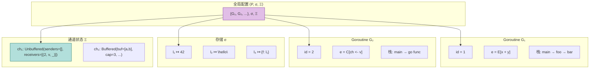
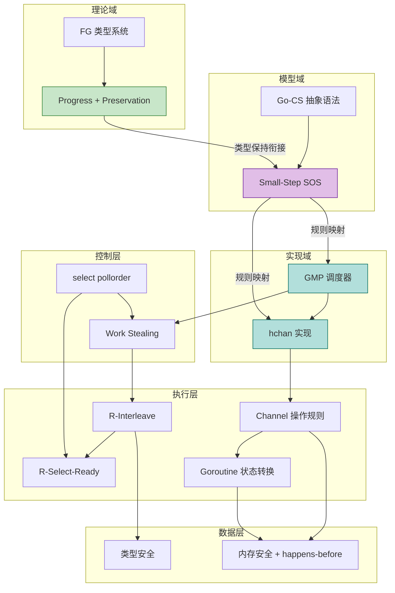
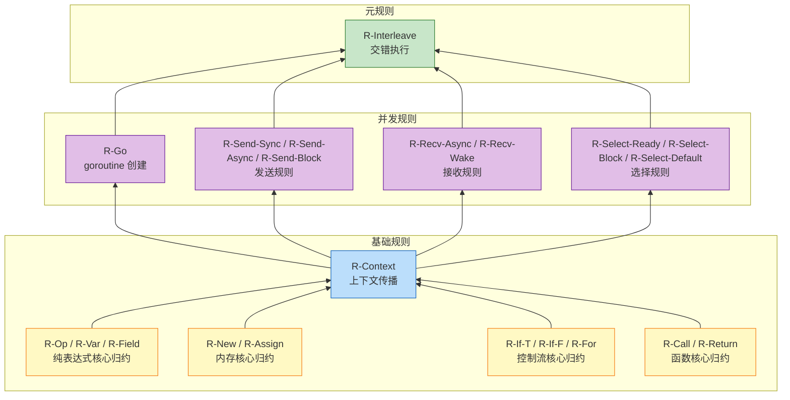
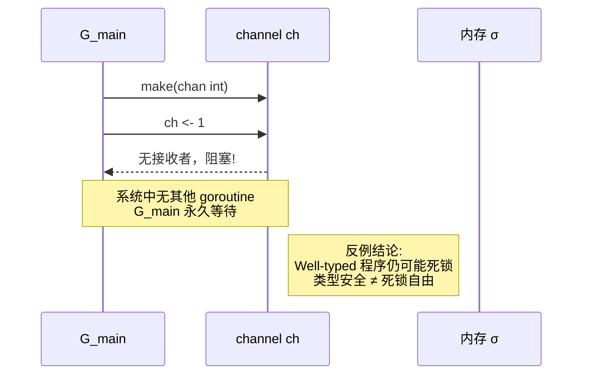
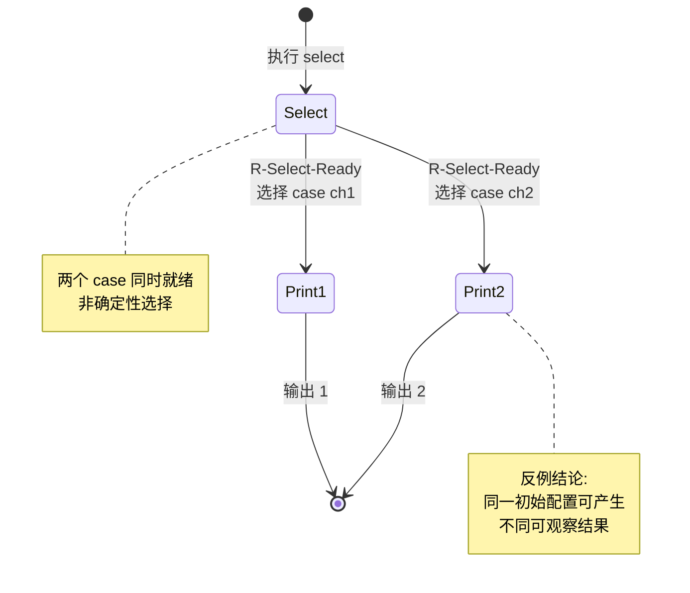

# Go-CS 子集小步操作语义（Small-Step Semantics）

> **文档定位**: Go 主线动态语义深度标杆 | **版本**: 2026.03
>
> **前置依赖**: [FG-Calculus](../02-Static-Semantics/FG-Calculus.md) | [GMP-Scheduler](../04-Runtime-System/GMP-Scheduler.md) | [Type-Safety-Proof](../06-Verification/Type-Safety-Proof.md)

---

## 1. 概念定义 (Definitions)

### 1.1 Go-CS 子集语法

**定义 1.1 (Go-CS 抽象语法)**:

```
P, Q ::= 0                              (终止进程)
       | x = e                          (赋值)
       | go P                           (启动 goroutine)
       | ch <- e                        (通道发送)
       | x := <-ch                      (通道接收)
       | select { caseᵢ commᵢ: Pᵢ } [default: Q]   (选择)
       | P; Q                           (顺序组合)
       | if e { P } else { Q }          (条件)
       | for e { P }                    (循环)
       | e.m(e₁, ..., eₙ)               (方法调用)
       | return e                       (返回)

comm ::= ch <- e | <-ch | x := <-ch

e ::= x | v | e op e | e.f | e.(t) | t{f: e, ...} | make(chan T, n) | new(t)

v ::= n | b | s | l | nil | func(...) {...} | make(chan T, n)
```

**直观解释**: Go-CS（Go Concurrent Subset）是 Go 并发核心子集的抽象语法，剥离了泛型、包系统、复杂初始化等非并发特性，保留 goroutine、channel、select 等 CSP 可比的并发原语。

**定义动机**: 如果不抽象出这个子集，Go 的完整语法过于复杂，无法与 CSP 进行严格的语义比较，也无法清晰地刻画小步操作语义中并发交错与内存交互的边界。该子集保留了 Go 并发模型的全部表达能力，同时足够精简以支持形式化分析。

---

### 1.2 执行配置 ⟨P, σ, Ξ⟩

**定义 1.2 (全局配置)**:

```
Configuration ::= ⟨P, σ, Ξ⟩
```

**直观解释**: 全局配置是程序执行状态的完整快照，包含所有活跃的执行流（goroutine 集合）、共享内存状态以及通道同步状态。

**定义动机**: 并发程序的执行不能仅由表达式本身决定，必须显式建模共享存储和同步介质。将 goroutine 集合、存储和通道状态分离为三个正交维度，使得每一步归约的副作用范围清晰可追踪，便于后续与内存模型和运行时实现建立映射。

---

#### 1.2.1 Goroutine 集合 P

**定义 1.2.1 (Goroutine)**:

```
G ::= ⟨id, e, s⟩

P ::= {G₁, G₂, ..., Gₙ}    (有限集合，n ≥ 0)

其中:
- id ∈ ℕ:        唯一标识符
- e:             当前表达式/语句
- s:             调用栈 (frame 列表)

frame ::= ⟨vars, ret_addr, E⟩    (局部变量映射、返回地址、求值上下文)
```

**定义动机**: Goroutine 是 Go 并发的基本执行单元。将其建模为三元组而非简单的表达式，是为了显式保留调用栈信息——这是方法调用、返回和 panic/recover 等控制流转移的必要状态。`id` 的存在使得在交错执行规则中可以唯一标识被调度的执行流。

---

#### 1.2.2 存储 σ

**定义 1.2.2 (存储 / Store)**:

```
σ ∈ Location ⇀ Value

Location (l) ::= 堆地址 | 栈地址

Value (v) ::= n               (整数)
            | b               (布尔值)
            | s               (字符串)
            | l               (指针/引用)
            | {f₁: l₁, ..., fₙ: lₙ}   (结构体：字段→地址映射)
            | chan(l)         (通道值：指向通道对象的引用)
            | clos(λx.e, ρ)   (闭包：代码+环境)
            | nil             (空值)
```

**定义动机**: 采用基于地址的存储模型（而非替换语义），是因为 Go 具有显式的指针、共享内存和别名。只有将值存储在可寻址的位置 `l` 中，才能准确描述 `&x`、`*p = v`、以及多个 goroutine 通过指针并发读写同一内存位置的行为。

---

#### 1.2.3 通道状态 Ξ

**定义 1.2.3 (通道状态 / Channel State)**:

```
Ξ ∈ ChannelID ⇀ ChanState

ChanState ::=
  | Unbuffered {senders: WaitQueue, receivers: WaitQueue}
  | Buffered   {buf: Value*, cap: n, senders: WaitQueue, receivers: WaitQueue}
  | Closed

WaitQueue ::= (GoroutineID × Value × Context) list
```

**定义动机**: 将通道状态从存储 `σ` 中独立出来（使用单独的 `Ξ`），是因为 channel 不仅是数据结构，更是同步原语。`Ξ` 显式记录了哪些 goroutine 正在等待通信（WaitQueue），这是描述阻塞、唤醒和 select 多路复用语义的关键。若将 channel 仅视为普通值，则无法表达同步的 happens-before 关系。

---

### 1.3 求值上下文 (Evaluation Contexts)

**定义 1.3 (求值上下文)**:

```
// 纯表达式上下文
E ::= []                              (空上下文 / hole)
    | E op e                          (左操作数上下文)
    | v op E                          (右操作数上下文)
    | E.f                             (字段选择上下文)
    | E.(t)                           (类型断言上下文)
    | E[e]                            (索引左上下文)
    | v[E]                            (索引右上下文)
    | E(e₁, ..., eₙ)                  (调用函数上下文)
    | v(..., E, e, ...)               (调用参数上下文)
    | make(chan T, E)                 (通道创建上下文)
    | new(E)                          (new 上下文)
    | &E                              (取址上下文)
    | *E                              (解引用上下文)

// 语句上下文
S ::= []                              (空语句上下文)
    | E                               (表达式语句上下文)
    | var x = E                       (变量声明上下文)
    | x = E                           (赋值上下文)
    | E.f = e                         (字段赋值左上下文)
    | v.f = E                         (字段赋值右上下文)
    | *E = e                          (指针赋值上下文)
    | return E                        (return 上下文)
    | if E { P } else { Q }           (if 条件上下文)
    | for E { P }                     (for 条件上下文)

// 并发上下文
C ::= []                              (空并发上下文)
    | go E                            (goroutine 启动上下文)
    | E <- e                          (发送左上下文)
    | v <- E                          (发送右上下文)
    | <-E                             (接收上下文)
    | select { case comm₁: P₁ ... case E: Pᵢ ... }   (select 通信上下文)
```

**直观解释**: 求值上下文是一个带有"洞" `[]` 的表达式/语句模板，它规定了表达式中下一个可以被规约的"焦点"位置。

**定义动机**: 引入求值上下文是为了将语法归约（如 `1 + 2 → 3`）与位置归约（如 `(1 + 2) * 4 → 3 * 4`）解耦。没有上下文，我们需要为每种语法组合单独写一条规则（规则数量爆炸）；有了上下文，只需定义核心表达式的归约规则，再通过一条统一的上下文规则（R-Context）将其应用到任意嵌套位置。这是小步语义能够规模化的关键抽象。

---

### 1.4 全局配置可视化



**图说明**:

- 本图展示了全局配置 `⟨P, σ, Ξ⟩` 的三维结构。
- `G₁` 正在执行纯表达式 `x + y`，处于求值上下文 `E` 中。
- `G₂` 正在执行通道发送 `ch <- v`，处于并发上下文 `C` 中。
- 通道状态 `Ξ` 与存储 `σ` 分离，以强调同步原语的特殊地位。

---

### 1.5 Go-CS 小步操作语义完整规则

**定义 1.5 (SOS 归约规则)**:

#### 1.5.1 纯表达式归约

**算术运算 (R-Op)**:
$$
\frac{n = n_1 \, op \, n_2}{\langle E[n_1 \, op \, n_2], \sigma, \Xi \rangle \longrightarrow \langle E[n], \sigma, \Xi \rangle}
$$

**变量查找 (R-Var)**:
$$
\frac{\sigma(l) = v}{\langle E[x], \sigma, \Xi \rangle \longrightarrow \langle E[v], \sigma, \Xi \rangle} \quad \text{where } locals(x, s) = l
$$

**字段访问 (R-Field)**:
$$
\frac{\sigma(l) = \{..., f: l_f, ...\} \quad \sigma(l_f) = v}{\langle E[l.f], \sigma, \Xi \rangle \longrightarrow \langle E[v], \sigma, \Xi \rangle}
$$

**类型断言成功 (R-Assert-OK)**:
$$
\frac{v = t\{...\}}{\langle E[v.(t)], \sigma, \Xi \rangle \longrightarrow \langle E[v], \sigma, \Xi \rangle}
$$

#### 1.5.2 内存操作归约

**new 操作 (R-New)**:
$$
\frac{l \notin dom(\sigma)}{\langle E[new(t)], \sigma, \Xi \rangle \longrightarrow \langle E[l], \sigma[l \mapsto zero(t)], \Xi \rangle}
$$

**取址操作 (R-Addr)**:
$$
\frac{l = addr(x)}{\langle E[\&x], \sigma, \Xi \rangle \longrightarrow \langle E[l], \sigma, \Xi \rangle}
$$

**赋值操作 (R-Assign)**:
$$
\frac{}{\langle E[l = v], \sigma, \Xi \rangle \longrightarrow \langle E[v], \sigma[l \mapsto v], \Xi \rangle}
$$

#### 1.5.3 控制流归约

**if-true (R-If-T)**:
$$
\frac{}{\langle E[\text{if true } \{P\} \text{ else } \{Q\}], \sigma, \Xi \rangle \longrightarrow \langle E[P], \sigma, \Xi \rangle}
$$

**if-false (R-If-F)**:
$$
\frac{}{\langle E[\text{if false } \{P\} \text{ else } \{Q\}], \sigma, \Xi \rangle \longrightarrow \langle E[Q], \sigma, \Xi \rangle}
$$

**for 循环展开 (R-For)**:
$$
\frac{}{\langle E[\text{for } c \{ P \}], \sigma, \Xi \rangle \longrightarrow \langle E[\text{if } c \{ P; \text{for } c \{ P \} \} \text{ else } \{0\}], \sigma, \Xi \rangle}
$$

#### 1.5.4 函数调用归约

**方法调用 (R-Call)**:
$$
\frac{method(t, m) = func(r \, t) \, m(x_1, ..., x_n) \{ return \, e \} \quad \forall i: l_i \text{ fresh}}{\langle E[v.m(v_1, ..., v_n)], \sigma, \Xi \rangle \longrightarrow \langle E[e[r \mapsto l_0, x_i \mapsto l_i]], \sigma[l_0 \mapsto v, l_1 \mapsto v_1, ..., l_n \mapsto v_n], \Xi \rangle}
$$

其中 $v = t\{...\}$

**return (R-Return)**:
$$
\frac{}{\langle \langle id, E[\text{return } v], s \cdot frame \rangle, \sigma, \Xi \rangle \longrightarrow \langle \langle id, v, s \rangle, \sigma, \Xi \rangle}
$$

#### 1.5.5 并发归约

**goroutine 创建 (R-Go)**:
$$
\frac{G' = \langle id_{new}, f(v_1, ..., v_n), \epsilon \rangle \quad id_{new} \text{ fresh}}{\langle \{G\} \cup Gs, \sigma, \Xi \rangle \longrightarrow \langle \{G, G'\} \cup Gs, \sigma, \Xi \rangle}
$$

其中 $G$ 执行 `go f(v₁, ..., vₙ)`，规约后 $G$ 继续执行下一条语句（`go` 表达式求值为 `0`）。

**同步发送（无缓冲 channel）(R-Send-Sync)**:
$$
\frac{\Xi(ch) = \text{Unbuffered}(ws, (G_r, \_, E_r) :: rest)}{\langle G_s \text{ doing } ch <- v, G_r \text{ doing } E_r[<-ch], \sigma, \Xi \rangle \longrightarrow \langle G_s \text{ doing } v, G_r \text{ doing } E_r[v], \sigma, \Xi[ch \mapsto \text{Unbuffered}(ws, rest)] \rangle}
$$

**异步发送（有缓冲 channel 未满）(R-Send-Async)**:
$$
\frac{\Xi(ch) = \text{Buffered}(buf, n, ws, wr) \quad |buf| < n}{\langle G \text{ doing } ch <- v, \sigma, \Xi \rangle \longrightarrow \langle G \text{ doing } v, \sigma, \Xi[ch \mapsto \text{Buffered}(buf \cdot v, n, ws, wr)] \rangle}
$$

**阻塞发送（有缓冲 channel 满）(R-Send-Block)**:
$$
\frac{\Xi(ch) = \text{Buffered}(buf, n, ws, wr) \quad |buf| = n}{\langle G \text{ doing } ch <- v, \sigma, \Xi \rangle \longrightarrow \langle G \text{ blocked on } ch, \sigma, \Xi[ch \mapsto \text{Buffered}(buf, n, ws \cdot (G, v, E), wr)] \rangle}
$$

**异步接收（有缓冲 channel 非空）(R-Recv-Async)**:
$$
\frac{\Xi(ch) = \text{Buffered}(v :: buf, n, ws, wr)}{\langle G \text{ doing } <-ch, \sigma, \Xi \rangle \longrightarrow \langle G \text{ doing } v, \sigma, \Xi[ch \mapsto \text{Buffered}(buf, n, ws, wr)] \rangle}
$$

**唤醒等待发送者 (R-Recv-Wake)**:
$$
\frac{\Xi(ch) = \text{Buffered}(buf, n, (G_s, v_s, E_s) :: ws, wr) \quad |buf| = n - 1}{\langle G_r \text{ doing } <-ch, \sigma, \Xi \rangle \longrightarrow \langle G_r \text{ doing } head(buf), G_s \text{ doing } v_s, \sigma, \Xi' \rangle}
$$

其中 $\Xi'$ 更新 buffer 为 $buf \cdot v_s$ 并移除等待发送者 $(G_s, v_s, E_s)$。

**select 立即执行 (R-Select-Ready)**:
$$
\frac{\exists i: ready(comm_i, \Xi)}{\langle G \text{ doing } select(\{comm_i: P_i\}), \sigma, \Xi \rangle \longrightarrow \langle G \text{ doing } P_j, \sigma, \Xi' \rangle}
$$

其中 $j$ 从就绪的 case 中**非确定性**选择，$\Xi'$ 反映通信副作用。

**select 阻塞等待 (R-Select-Block)**:
$$
\frac{\forall i: \neg ready(comm_i, \Xi)}{\langle G \text{ doing } select(\{comm_i: P_i\}), \sigma, \Xi \rangle \longrightarrow \langle G \text{ blocked on } \{comm_i\}, \sigma, \Xi' \rangle}
$$

其中 $G$ 注册到所有相关 channel 的等待队列，无 `default` 分支。

**select default 执行 (R-Select-Default)**:
$$
\frac{\forall i: \neg ready(comm_i, \Xi)}{\langle G \text{ doing } select(\{comm_i: P_i\} \text{ default: } Q), \sigma, \Xi \rangle \longrightarrow \langle G \text{ doing } Q, \sigma, \Xi \rangle}
$$

**交错执行 (R-Interleave)**:
$$
\frac{\langle G_i, \sigma, \Xi \rangle \longrightarrow \langle G_i', \sigma', \Xi' \rangle}{\langle \{G_1, ..., G_i, ..., G_n\}, \sigma, \Xi \rangle \longrightarrow \langle \{G_1, ..., G_i', ..., G_n\}, \sigma', \Xi' \rangle}
$$

**定义动机**: 以上 SOS 规则完整覆盖了 Go-CS 子集的所有动态行为。将规则按表达式、内存、控制流、函数调用、并发五个维度分类，既便于模块化验证（每个维度可独立证明性质），也便于与 GMP 运行时的实现模块建立一一映射。

---

## 2. 属性推导 (Properties)

### 2.1 纯表达式求值的确定性

**性质 1 (纯表达式确定性)**:
对于不含并发原语（`go`、channel、`select`）的表达式 $e$，给定相同的存储 $\sigma$，其小步归约是确定的：

$$
\langle e, \sigma, \Xi \rangle \longrightarrow \langle e_1, \sigma_1, \Xi_1 \rangle \land \langle e, \sigma, \Xi \rangle \longrightarrow \langle e_2, \sigma_2, \Xi_2 \rangle \Rightarrow \langle e_1, \sigma_1, \Xi_1 \rangle = \langle e_2, \sigma_2, \Xi_2 \rangle
$$

**推导**:

1. 纯表达式仅涉及 R-Op、R-Var、R-Field、R-Assert-OK、R-New、R-Addr、R-Assign、R-If-T/F、R-For、R-Call、R-Return 以及 R-Context 规则。
2. 对任意非值表达式 $e$，求值上下文 $E$ 的分解是唯一的（由上下文语法的确定性结构保证）。
3. 每个核心归约规则（不含 R-Interleave）的前提条件和结论都是函数式的：给定相同的左式，右式唯一确定。
4. 因此，不存在两个不同的归约步骤从同一纯表达式配置出发。

∎

---

### 2.2 并发执行的非确定性

**性质 2 (并发非确定性)**:
包含多个非终止 goroutine 的配置通常具有非确定性归约行为。

**推导**:

1. 由 **R-Interleave** 规则，若配置中有多个 goroutine $G_i$ 和 $G_j$ 均可归约，则调度器可以任选其一执行下一步。
2. 由 **R-Select-Ready** 规则，若 `select` 的多个 case 同时就绪，$j$ 的选择是非确定性的（对应 Go 运行时中 `pollorder` 的伪随机洗牌）。
3. 因此，即使从相同的初始配置出发，也可能产生不同的执行轨迹（trace）。

∎

> **推断 [Control→Execution]**: 由于控制层采用 `select` 的随机 `pollorder` 策略来打破 channel 等待的确定性顺序，执行层的小步语义规则 **R-Select-Ready** 必须引入非确定性选择，以准确反映运行时的行为。
>
> **依据**: Go 语言规范明确规定："If one or more of the communications can proceed, a single one that can proceed is chosen via a uniform pseudo-random selection."

---

### 2.3 纯表达式的合流性

**性质 3 (纯表达式合流性 / Confluence)**:
对于纯表达式 $e$，如果 $e$ 可以归约到 $e_1$ 和 $e_2$，则存在 $e'$ 使得两者都能继续归约到 $e'$：

$$
\langle e, \sigma, \Xi \rangle \longrightarrow^* \langle e_1, \sigma_1, \Xi_1 \rangle \land \langle e, \sigma, \Xi \rangle \longrightarrow^* \langle e_2, \sigma_2, \Xi_2 \rangle \Rightarrow \exists e', \sigma', \Xi': \langle e_1, \sigma_1, \Xi_1 \rangle \longrightarrow^* \langle e', \sigma', \Xi' \rangle \land \langle e_2, \sigma_2, \Xi_2 \rangle \longrightarrow^* \langle e', \sigma', \Xi' \rangle
$$

**推导**:

1. 纯表达式子集不含副作用冲突：存储修改仅通过 R-New（分配新地址）和 R-Assign（对已知地址赋值）发生。
2. 由于纯表达式求值的确定性（性质 1），实际上不存在从同一配置出发的分支；任何"分支"只能来自上下文分解中不相交的子表达式。
3. 对于不相交子表达式的独立归约（如 `(1+2) + (3+4)` 中先算左边或先算右边），它们最终都会收敛到同一个标准形式（值）。
4. 这是 Church-Rosser 性质在命令式小步语义中的直接体现。

∎

---

### 2.4 配置的良构性保持

**性质 4 (配置良构性保持)**:
如果初始配置 $\langle P_0, \sigma_0, \Xi_0 \rangle$ 是良构的（well-formed），则任何可达配置 $\langle P', \sigma', \Xi' \rangle$ 也是良构的。

**推导**:

1. 良构性要求：(a) 所有 goroutine 的当前表达式语法合法；(b) 所有存储地址要么已分配要么为 nil；(c) 通道状态一致（buffer 长度不超过 cap，WaitQueue 中的 goroutine 确实处于 blocked 状态）。
2. R-New 只分配新地址，不会重复分配；R-Assign 只对已存在地址赋值。
3. R-Send-Async 增加 buffer 仅在 $|buf| < cap$ 时发生；R-Recv-Async 减少 buffer 仅在 buffer 非空时发生。
4. R-Go 创建的新 goroutine 具有合法的初始表达式和空栈。
5. 因此，每条 SOS 规则都保持上述良构性条件。

∎

> **推断 [Execution→Data]**: 执行层采用 Small-Step 的交错语义来描述 goroutine 执行，这要求数据层必须引入 happens-before 关系来保证数据竞争自由（Data-Race Freedom）。否则，两个 goroutine 对同一地址的无序读写将产生不可预测的语义。
>
> **依据**: 若 $G_1$ 执行 `x = 1` 而 $G_2$ 执行 `print(x)`，且两者无 happens-before 关系，则 `print(x)` 的输出无法由 SOS 规则唯一确定，导致数据竞争。

---

## 3. 关系建立 (Relations)

### 3.1 Small-Step 语义与 FG 静态语义的关系

**关系 1**: FG 类型保持性 `⟹` Small-Step 动态语义中的表达式类型不变

**论证**:

- **编码存在性**: FG 演算定义了 Go 核心类型系统的静态规则（详见 [FG-Calculus](../02-Static-Semantics/FG-Calculus.md)）。Small-Step 语义中的纯表达式子集（字段访问、类型断言、方法调用、结构体构造）与 FG 的表达式完全对应。
- **衔接机制**: FG 的 Preservation 定理（定理 6.2）证明：若 $\Gamma \vdash e : T$ 且 $e \longrightarrow e'$，则 $\Gamma \vdash e' : T$。Small-Step 语义中的 R-Field、R-Assert-OK、R-Call 规则正是 FG 小步语义的运行时实现。
- **扩展**: 对于并发扩展（`go`、channel），FG 本身不包含这些特性，但 Go-CS 子集要求：任何进入 channel 的值必须类型匹配（由 Go 编译器的扩展类型检查保证），这可以视为 FG 类型系统向并发领域的自然延伸。

**关系 2**: Small-Step 的并发配置 `⊃` FG 的纯表达式配置

**论证**:

- FG 配置仅包含表达式 $e$（或存储扩展），而 Small-Step 配置 `⟨P, σ, Ξ⟩` 额外包含 goroutine 集合和通道状态。
- 任何 FG 程序都可以嵌入到 Go-CS 中作为单 goroutine 程序（$P = \{G_{main}\}$，$\Xi = \emptyset$），因此 Small-Step 语义严格包含 FG 语义。

---

### 3.2 Small-Step 语义与 GMP 运行时的关系

**关系 3**: Small-Step 的 R-Interleave 规则 `≈` GMP 调度器的 `schedule()` + `execute()` 行为

**论证**:

- **双模拟等价**: 在忽略时间片长度和偷取随机性的情况下，R-Interleave 规则"任选一个可规约的 goroutine 执行一步"与 GMP 的"从 runq 中取出 G 并在 M 上执行"是行为等价的。
- **差异点**: GMP 是批量执行（一个 G 可能连续执行多条指令才被抢占），而 SOS 是单步执行。这种差异可以通过将 GMP 的"执行步"细粒度化为 SOS 的"归约步"来弥合。

**关系 4**: Small-Step 的 channel 规则 `↦` GMP 的 `hchan` 操作（`chansend`、`chanrecv`）

**论证**:

- **编码映射**:
  - R-Send-Sync ↔ `chansend` 中的直接内存复制 + `goready` 唤醒接收者
  - R-Send-Block ↔ `chansend` 中的 `gopark` 将 G 加入 `hchan.sendq`
  - R-Select-Ready ↔ `selectgo` 中的 `pollorder` 遍历 + `lockorder` 加锁
- **分离结果**: SOS 规则抽象了 `hchan` 的锁细节（`lockorder`），聚焦于状态转换的语义效果；GMP 实现则必须处理缓存一致性、内存屏障和 CAS 操作。

---

### 3.3 跨层综合关系图



**图说明**:

- 本图展示了从 FG 静态语义 → Small-Step SOS → GMP 运行时的完整概念依赖链。
- FG 的 Progress + Preservation 定理为 Small-Step 语义提供了类型安全的基础保证。
- Small-Step 的每条规则都在 GMP 实现中有明确的对应机制（`schedule()`、`chansend()`、`selectgo()` 等）。

---

## 4. 论证过程 (Argumentation)

### 4.1 求值上下文分解唯一性

**引理 4.1 (上下文分解唯一性)**:
对于任意非值表达式 $e$，存在唯一的求值上下文 $E$ 和唯一的 redex（可归约式）$r$，使得 $e = E[r]$。

**证明**:

1. **前提分析**: 对 $e$ 的抽象语法树进行结构归纳。
2. **基本情况**: 若 $e$ 本身就是 redex（如 $n_1 + n_2$、$l.f$、$v.m(...)$），则 $E = []$，$r = e$，唯一性显然成立。
3. **归纳步骤**: 若 $e$ 是复合表达式（如 $e_1 + e_2$、$e.m(e_1)$），则根据求值顺序（Go 规定从左到右求值），要么 $e_1$ 可继续分解（由归纳假设唯一），要么 $e_1$ 已是值而 $e_2$ 需要分解。由于语法结构是树形的，分解路径唯一。
4. **结论**: 因此，$E$ 和 $r$ 的存在性和唯一性均得证。

∎

### 4.2 替换引理（并发扩展）

**引理 4.2 (并发配置替换)**:
若 goroutine $G = \langle id, E[x], s \rangle$ 且局部变量 $x$ 在栈帧 $s$ 中绑定到地址 $l$（即 $locals(x, s) = l$），则将 $x$ 替换为 $\sigma(l)$ 不改变程序的动态行为语义。

**证明**:

1. 由 R-Var 规则，$\langle E[x], \sigma, \Xi \rangle \longrightarrow \langle E[v], \sigma, \Xi \rangle$ 当且仅当 $\sigma(l) = v$ 且 $locals(x, s) = l$。
2. 因此，在配置层面，$x$ 的语义就是其在存储中的值 $v$。
3. 替换 $x$ 为 $v$ 后，后续所有涉及 $x$ 的归约都等价于直接对 $v$ 进行归约。

∎

---

## 5. 形式证明 (Proofs)

### 5.1 引理 5.1 (求值上下文保持规约)

**定理 5.1 (求值上下文保持规约 / Context Preservation)**:
若 $r \longrightarrow r'$（核心 redex 归约），则对任意求值上下文 $E$，有 $E[r] \longrightarrow E[r']$。

**证明**:

1. 对求值上下文 $E$ 的结构进行结构归纳。
2. **基本情况 ($E = []$)**: $E[r] = r \longrightarrow r' = E[r']$，显然成立。
3. **归纳步骤**: 假设对上下文 $E_0$ 成立，考虑 $E = E_0 \, op \, e$（其他情况类似）。
   - $E[r] = E_0[r] \, op \, e$
   - 由归纳假设，$E_0[r] \longrightarrow E_0[r']$
   - 由 R-Context 规则（左操作数上下文），$E_0[r] \, op \, e \longrightarrow E_0[r'] \, op \, e = E[r']$
4. 所有其他上下文形式（字段访问、方法调用参数、if 条件等）均可类似地由 R-Context 规则推导。
5. **结论**: 因此，求值上下文保持规约成立。

∎

---

### 5.2 定理 5.2 (配置转换的良构性)

**定理 5.2 (配置良构性保持)**:
如果配置 $\langle P, \sigma, \Xi \rangle$ 是良构的（well-formed），且 $\langle P, \sigma, \Xi \rangle \longrightarrow \langle P', \sigma', \Xi' \rangle$，则 $\langle P', \sigma', \Xi' \rangle$ 也是良构的。

**证明**:

**良构性定义 (Well-formedness)**:
配置 $\langle P, \sigma, \Xi \rangle$ 是良构的，当且仅当：

1. **WF-G**: $\forall G = \langle id, e, s \rangle \in P$，$e$ 是 Go-CS 语法合法的表达式/语句，且 $s$ 中的返回地址和上下文匹配。
2. **WF-σ**: $\forall l \in dom(\sigma)$，$\sigma(l)$ 是合法的 Value；所有出现在值中的地址 $l'$ 要么 $l' \in dom(\sigma)$，要么 $l' = nil$。
3. **WF-Ξ**: $\forall ch \in dom(\Xi)$：
   - 若 $\Xi(ch) = \text{Buffered}(buf, n, ws, wr)$，则 $0 \leq |buf| \leq n$；
   - WaitQueue 中的每个 $(G_{id}, v, E)$ 对应的 $G_{id}$ 确实在 $P$ 中且状态为 blocked；
   - 不存在同一个 $G$ 同时出现在 $ws$ 和 $wr$ 中。

**案例分析**:

- **案例 1: 纯表达式规则 (R-Op, R-Var, R-Field, R-Assert-OK)**:
  - 仅改变当前 goroutine 的表达式，不改变 $P$ 的结构、$\sigma$ 的定义域或 $\Xi$。
  - 归约结果 $e'$ 由规则的结论唯一确定，保持语法合法性。WF-G、WF-σ、WF-Ξ 均不变。

- **案例 2: 内存规则 (R-New, R-Assign)**:
  - R-New: 分配新地址 $l \notin dom(\sigma)$，将其映射到 $zero(t)$。新地址的值是合法的，且不会重复分配。WF-σ 保持。
  - R-Assign: 对已有地址 $l$ 更新值 $v$。$l \in dom(\sigma)$ 由前提保证，$v$ 是值。WF-σ 保持。

- **案例 3: 控制流规则 (R-If-T/F, R-For)**:
  - 仅替换表达式为子表达式/语句，不改变 $P$、$\sigma$、$\Xi$。WF 显然保持。

- **案例 4: 函数调用 (R-Call)**:
  - 创建新地址 $l_i$（fresh），将参数值存入 $\sigma$。由于 $l_i$ 是新地址，不会破坏 WF-σ。
  - 方法体 $e$ 是语法合法的，替换后仍是合法表达式。WF-G 保持。

- **案例 5: goroutine 创建 (R-Go)**:
  - 创建 $G' = \langle id_{new}, f(...), \epsilon \rangle$。$id_{new}$ fresh 保证 $P$ 中无重复 id。
  - $f(...)$ 是合法表达式，空栈 $\epsilon$ 合法。WF-G 保持。
  - $\sigma$ 和 $\Xi$ 不变。WF-σ、WF-Ξ 保持。

- **案例 6: Channel 发送 (R-Send-Async)**:
  - 前提要求 $|buf| < n$，更新后 $|buf \cdot v| = |buf| + 1 \leq n$。WF-Ξ 的 buffer 边界保持。
  - WaitQueue 不变。WF-Ξ 保持。

- **案例 7: Channel 发送 (R-Send-Block)**:
  - 前提 $|buf| = n$，$G$ 被加入 $ws$。$G$ 的状态变为 blocked。WF-Ξ 要求 WaitQueue 中的 goroutine 必须 blocked，此条件满足。

- **案例 8: Channel 接收唤醒 (R-Recv-Wake)**:
  - 前提 $|buf| = n - 1$，更新后 buffer 变为 $buf \cdot v_s$，长度恢复为 $n$。边界保持。
  - $G_s$ 从 $ws$ 移除，状态变为可运行。WF-Ξ 保持。

- **案例 9: 交错执行 (R-Interleave)**:
  - 仅替换 $P$ 中的一个 $G_i$ 为 $G_i'$，其余不变。若单步归约保持 WF，则整体保持 WF。

**结论**: 所有可能的归约规则都保持良构性。

∎

---

### 5.3 语义规则依赖图



**图说明**:

- 本图展示了各 SOS 规则之间的调用/依赖关系。
- 底层黄色节点为纯表达式、内存、控制流、函数的核心归约规则。
- 中间蓝色节点 **R-Context** 是关键的"放大器"，将核心 redex 的归约传播到任意嵌套上下文。
- 紫色节点为并发扩展规则，它们依赖 R-Context 来定位 redex，然后触发 goroutine 状态或通道状态的改变。
- 顶层绿色节点 **R-Interleave** 是元规则，将所有单 goroutine 归约组合成全局配置的转换。

---

## 6. 实例与反例 (Examples & Counter-examples)

### 6.1 示例：并发程序的小步执行轨迹

**示例 6.1: Channel 同步与 Happens-Before**

```go
var x int
ch := make(chan int)

go func() {
    x = 1
    ch <- 1
}()

<-ch
print(x)
```

**逐步推导**:

1. **初始状态**:
   $$\langle \{G_{main}, G_{done}\}, \sigma_0, \Xi_0 \rangle$$

2. **步骤 1 (main)**: `ch := make(chan int)`
   $$\langle \{G_{main}, G_{done}\}, \sigma_0, \Xi_0[ch \mapsto \text{Unbuffered}(\emptyset, \emptyset)] \rangle$$

3. **步骤 2 (main)**: `go func() {...}()`
   创建 $G_{child}$:
   $$\langle \{G_{main}, G_{child}, G_{done}\}, \sigma_1, \Xi_1 \rangle$$

4. **步骤 3 (child)**: `x = 1`
   $$\langle \{G_{main}, G_{child}, G_{done}\}, \sigma_1[x \mapsto 1], \Xi_1 \rangle$$

5. **步骤 4 (child)**: `ch <- 1`（阻塞，等待接收者）
   $G_{child}$ 阻塞，注册到 channel 的 senders 队列:
   $$\langle \{G_{main}, G_{blocked}, G_{done}\}, \sigma_2, \Xi_1[ch.senders \mapsto \{(G_{child}, 1, E)\}] \rangle$$

6. **步骤 5 (main)**: `<-ch`
   与 $G_{child}$ 同步（R-Send-Sync + R-Recv-Async 的组合效果）:
   $$\langle \{G_{main} \text{ doing } 1, G_{child} \text{ doing } 1, G_{done}\}, \sigma_2, \Xi_2[ch.senders \mapsto \emptyset] \rangle$$

7. **步骤 6 (main)**: `print(x)` → 输出 `1`

**结论**: 由于 channel 通信建立了 happens-before 关系，`print(x)` 必然观察到 `x = 1`。

---

### 6.2 反例 1: Well-typed 但 Stuck（死锁）

**反例 6.1: 无缓冲 Channel 双向死锁**

```go
func main() {
    ch := make(chan int)
    ch <- 1      // G_main 发送
    <-ch         // 永远不会执行到这里
}
```

**分析**:

- **违反的前提**: Progress 定理在并发扩展中的前提是"存在可继续的归约步或阻塞是语义允许的"。但在此例中，唯一的 goroutine $G_{main}$ 在 `ch <- 1` 处阻塞，且没有其它 goroutine 可以接收。
- **导致的异常**: 配置变为 $\langle \{G_{main}^{blocked}\}, \sigma, \Xi[ch.senders = \{(G_{main}, 1, E)\}] \rangle$。没有任何规则可以进一步归约此配置——$G_{main}$ 不是值，也不能继续执行，且没有其它 goroutine 来唤醒它。
- **结论**: 这是一个 **well-typed 但 stuck** 的配置。Go 运行时会将其检测为死锁（`fatal error: all goroutines are asleep - deadlock!`）。这说明类型安全不能保证死锁自由。



---

### 6.3 反例 2: 非确定性规约导致不同结果

**反例 6.2: Select 两个 Case 同时就绪**

```go
func main() {
    ch1 := make(chan int)
    ch2 := make(chan int)

    go func() { ch1 <- 1 }()
    go func() { ch2 <- 2 }()

    select {
    case v := <-ch1:
        print(v)   // 可能输出 1
    case v := <-ch2:
        print(v)   // 可能输出 2
    }
}
```

**分析**:

- **场景设定**: 两个 goroutine 分别向 `ch1` 和 `ch2` 发送值。当 `main` 执行到 `select` 时，两个 case 都可能已经就绪（senders 已经在等待）。
- **非确定性来源**: 由 **R-Select-Ready** 规则，$j$ 从就绪 case 中非确定性选择。
  - 若选择 `case <-ch1`，输出 `1`；
  - 若选择 `case <-ch2`，输出 `2`。
- **导致的异常**: 从同一个初始配置出发，可能产生不同的最终输出。这不是 bug，而是 Go 语义的一部分（用于打破确定性饥饿）。
- **结论**: `select` 的 pollorder 随机化引入了真正的非确定性，Small-Step 语义必须显式建模这种选择，否则无法准确描述程序的可观察行为。



---

### 6.4 反例 3: Small-Step 语义描述 Goroutine 抢占的局限性

**反例 6.3: 无限循环导致无法被抢占**

```go
func main() {
    done := make(chan bool)

    go func() {
        for { }   // 纯计算循环，无函数调用
    }()

    go func() {
        done <- true
    }()

    <-done
}
```

**分析**:

- **违反的前提**: Small-Step 语义假设任何 goroutine 在每一步后都可以被 R-Interleave 规则切换出去。但在实际 Go 运行时（Go 1.14 之前），如果一个 goroutine 陷入没有函数调用的纯计算循环，运行时无法插入抢占点。
- **Small-Step 的局限性**: 在 SOS 中，R-Interleave 规则允许"在任意一步后切换"，这隐含了一个强假设——调度器具有**细粒度抢占**能力。然而，早期的 GMP 实现采用**协作式抢占**（仅在函数调用 prologue 检查栈溢出时插入抢占逻辑）。
- **导致的异常**: 在 Go 1.13 及更早版本中，上述程序可能永远 hang 住，因为无限循环的 goroutine 永远不会到达函数调用点，从而无法被抢占，`done <- true` 的 goroutine 虽然可运行但得不到调度。
- **工程修正**: Go 1.14 引入了基于信号的**异步抢占**（`SIGURG`），允许运行时在任何指令边界中断 goroutine。这相当于在 SOS 中引入了一个额外的元规则："即使当前表达式不是 redex，也可以强制切换 goroutine"。
- **结论**: 纯粹的 Small-Step 交错语义不足以描述真实运行时的抢占行为，必须引入额外的**抢占机制**（如时间片、信号中断）才能准确建模。

```mermaid
sequenceDiagram
    participant G1 as G_无限循环
    participant G2 as G_发送者
    participant Scheduler as GMP 调度器
    participant Main as G_main

    Note over G1: for { }<br/>无函数调用
    G1->>G1: 步骤 1: 循环体
    G1->>G1: 步骤 2: 循环体
    G1->>G1: 步骤 3: 循环体
    G1->>G1: ...

    Scheduler->>G1: 尝试抢占?<br/>(Go 1.13: 无函数调用 = 无法抢占)
    G1--xScheduler: 抢占失败

    G2->>Scheduler: 状态 = _Grunnable<br/>(等待调度)
    Note over G2: 永远得不到执行机会

    Main->>Scheduler: <-done<br/>阻塞等待
    Note over Main,Scheduler: 程序死锁 / 无限延迟

    Note right of Scheduler
        反例结论:
        Small-Step 的"任意步可切换"
        假设过于理想化。
        实际实现需要异步抢占
        机制作为补充。
    End note
```

---

### 6.5 决策树图：表达式规约路径

```mermaid
graph TD
    Start([表达式 e 需要规约]) --> Q1{e 是 redex?}
    Q1 -->|是| Q2{redex 类型?}
    Q1 -->|否| Q3{e 可分解为 E[r]?}

    Q3 -->|是| A1([对 r 应用核心规则<br/>得到 r'])
    A1 --> A2([由 R-Context 得<br/>E[r] → E[r']])

    Q3 -->|否| A3([e 已是值<br/>规约终止])

    Q2 -->|算术/变量/字段| A4([应用 R-Op / R-Var / R-Field])
    Q2 -->|内存操作| A5([应用 R-New / R-Assign])
    Q2 -->|控制流| A6([应用 R-If / R-For])
    Q2 -->|函数调用| A7([应用 R-Call / R-Return])
    Q2 -->|并发原语| A8([应用 R-Go / Channel / Select])

    A4 --> A2
    A5 --> A2
    A6 --> A2
    A7 --> A2
    A8 --> Q4{涉及多个 G?}

    Q4 -->|是| A9([由 R-Interleave<br/>选择可规约的 G_i])
    Q4 -->|否| A2

    style Start fill:#e1bee7,stroke:#6a1b9a
    style A3 fill:#c8e6c9,stroke:#2e7d32
    style A9 fill:#f8bbd9,stroke:#ad1457
```

**图说明**:

- 本图展示了任意表达式 $e$ 在 Small-Step 语义中的规约路径决策流程。
- 菱形节点表示判断条件，矩形节点表示中间结论，椭圆形节点表示最终结论。
- 关键分支在于：先判断是否为 redex，再判断是否需要上下文分解，最后判断是否需要并发交错。

---

## 7. 关联可视化资源

> **关联可视化资源**: 参见 [VISUAL-ATLAS.md](../../../../../VISUAL-ATLAS.md) 的以下章节：
>
> - [§2.2 Go 完整概念图](../../../../../VISUAL-ATLAS.md#22-go-完整概念图) — 展示 Go 语言形式化分析的全链条概念依赖
> - [§4.2 GMP 调度决策树](../../../../../VISUAL-ATLAS.md#42-gmp-调度决策树) — 展示 GMP 调度器从 `schedule()` 到 `findrunnable()` 的完整决策流程
> - [§5.1 类型安全证明树](../../../../../VISUAL-ATLAS.md#51-类型安全证明树) — Go/FG 类型安全定理（Progress + Preservation）的 LaTeX 证明树
> - [§6.1 GMP 无限制自旋反例](../../../../../VISUAL-ATLAS.md#61-gmp-无限制自旋反例) — 展示若 `nmspinning` 不受限制时的 CPU 浪费场景
>
> 本文档新增可视化资源：
>
> - **概念依赖图** (§3.3) — FG 语法 → FG 类型规则 → Small-Step SOS → GMP 运行时的层次关系
> - **决策树图** (§6.5) — 表达式规约路径决策树
> - **语义规则依赖图** (§5.3) — 各 SOS 规则之间的调用/依赖关系
> - **反例场景图** (§6.2, §6.3, §6.4) — 死锁、select 非确定性、抢占局限性的 Mermaid 序列图/状态图
