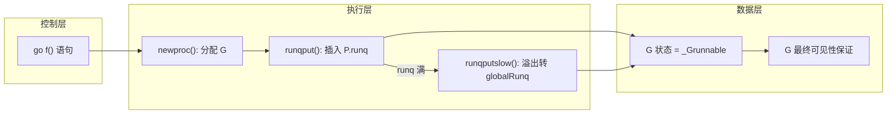
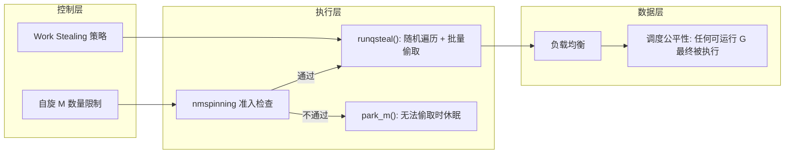
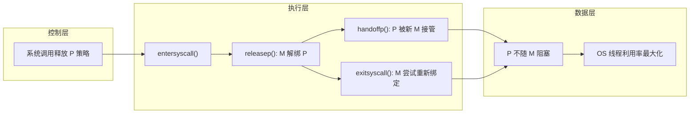
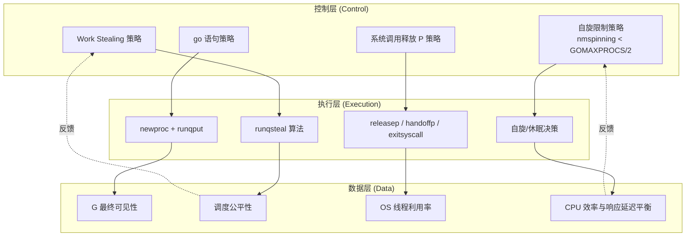
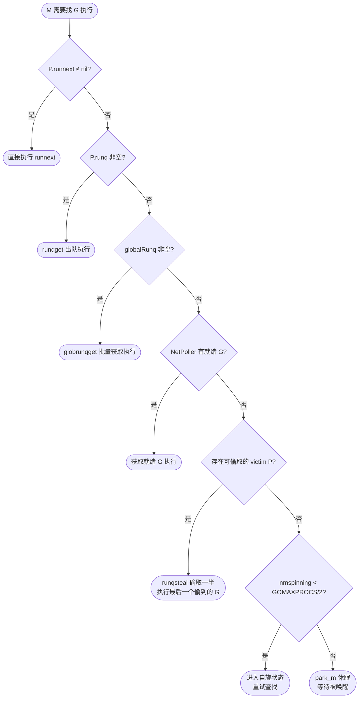
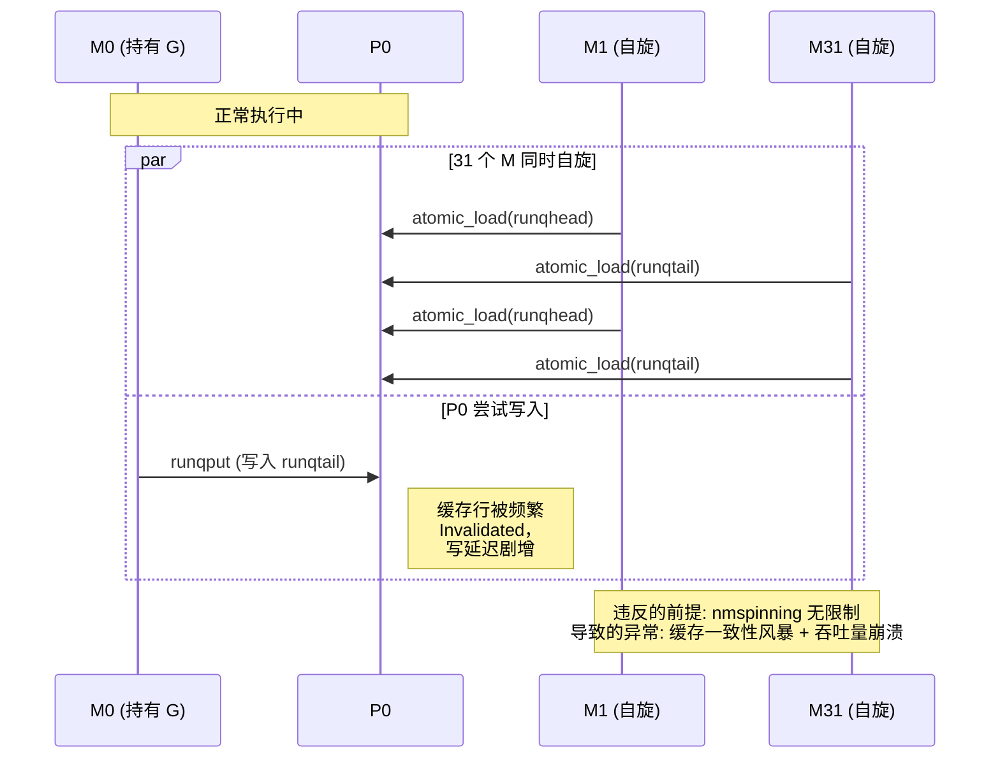
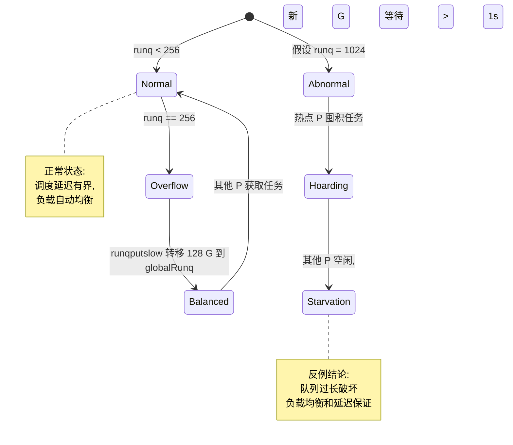
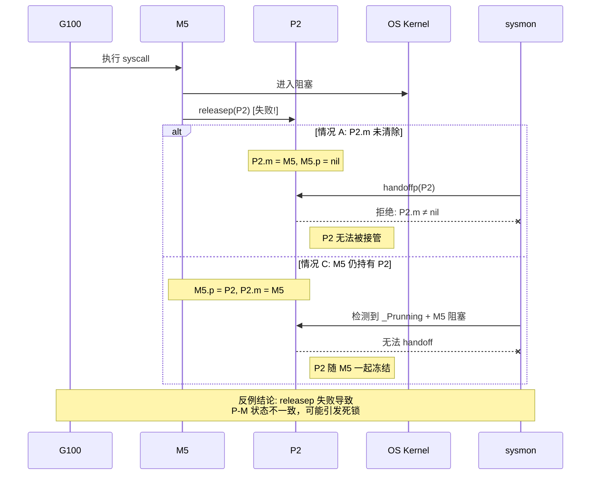
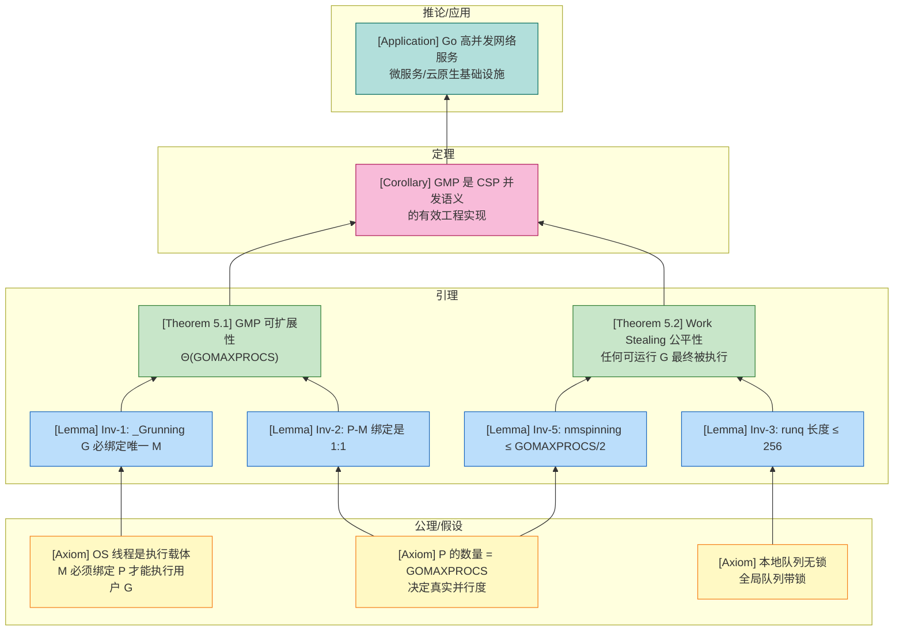
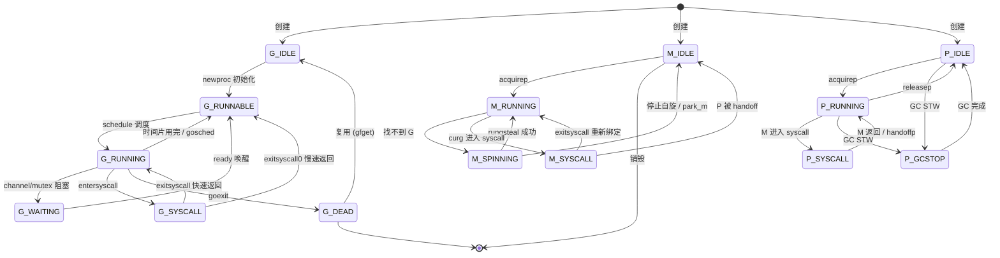

> **📌 文档角色**: 对比参考材料 (Comparative Reference)
>
> 本文档作为 **Scala Actor / Flink** 核心内容的对比参照系，
> 展示 CSP 模型的简化实现。如需系统学习核心计算模型，
> 请参考 [Scala 类型系统](../../Scala-3.6-3.7-Type-System-Complete.md) 或
> [Flink Dataflow 形式化](../../../Flink/Flink-Dataflow-Formal.md)。
>
> ---

# GMP 调度器：实现层深度形式化分析

> **文档定位**: Go 主线实现层深度标杆（对比参考） | **版本**: 2026.03
>
> **前置依赖**: [Go-CSP-Formal](../../../../../../formal/Go-CSP-Formal.md) | [Go-Memory-Model](../../../../formal/README-Formal.md)

---

## 1. 概念定义 (Definitions)

### 1.1 Goroutine (G) 的形式化定义

**定义 1.1 (Goroutine 状态)**:

```
G ::= ⟨id, status, stack, pc, gopc, waitreason, sched, atomicstatus, m, p, lockedm⟩

其中:
- id:           唯一标识符 ∈ ℕ
- status:       当前状态 ∈ Gstatus
- stack:        栈信息 (lo, hi) ∈ Addr × Addr
- pc:           程序计数器 ∈ Addr
- gopc:         创建此 G 的 go 语句 PC ∈ Addr
- waitreason:   等待原因字符串（如果阻塞）
- sched:        保存的寄存器状态（用于上下文切换）
- atomicstatus: 原子状态（用于 CAS 操作）∈ ℕ
- m:            当前绑定的 M（如果 _Grunning）
- p:            当前关联的 P（用于调度亲和性）
- lockedm:      是否锁定到特定 M
```

**G 状态空间**:

```
Gstatus ::= _Gidle       | 刚分配，未初始化
          | _Grunnable   | 可运行，在 runq 中
          | _Grunning    | 正在某个 M 上执行
          | _Gsyscall    | 执行系统调用中
          | _Gwaiting    | 阻塞（channel / mutex / select 等）
          | _Gdead       | 已完成，可复用
          | _Gcopystack  | 栈扩容/收缩中
          | _Gpreempted  | 被抢占，等待重新调度
```

**直观解释**: G 是 Go 语言中的用户级轻量级线程，比 OS 线程小几个数量级，由运行时而非内核调度。

**定义动机**: 如果不将 G 从 OS 线程中抽象出来，每个并发单元都需要独立的内核线程（1:1 模型），导致上下文切换开销大、内存占用高（每个线程 MB 级栈）。G 的引入使得单个 OS 线程可以承载成千上万个轻量级执行流，将调度成本从内核态转移到用户态。

---

### 1.2 OS 线程 (M) 的形式化定义

**定义 1.2 (Machine / OS 线程)**:

```
M ::= ⟨id, g0, curg, p, nextp, spinning, blocked, procid, schedlink⟩

其中:
- id:       OS 线程唯一标识符 ∈ ℕ
- g0:       调度栈 G（系统 goroutine，永不退出）
- curg:     当前运行的用户 G（可能为 nil）
- p:        绑定的 P（可能为 nil）
- nextp:    即将绑定的 P（用于 handoff）
- spinning: 是否处于自旋状态 ∈ {true, false}
- blocked:  是否在系统调用中阻塞 ∈ {true, false}
- procid:   OS 线程本地存储中的处理器 ID
- schedlink: 下一个空闲 M 的指针
```

**直观解释**: M 是 G 的执行载体，即实际的 OS 线程。G 必须绑定到某个 M 才能在 CPU 上真正执行指令。

**定义动机**: 纯用户级线程（N:0 模型）无法利用多核，也无法处理阻塞式系统调用。M 的引入提供了与内核交互的桥梁：当 G 执行系统调用时，M 会一起阻塞，但 P 可以被分离并重新绑定到其他 M 上，保证计算资源不被浪费。同时，M 的数量可以动态伸缩，避免创建过多 OS 线程。

---

### 1.3 逻辑处理器 (P) 的形式化定义

**定义 1.3 (Processor / 逻辑处理器)**:

```
P ::= ⟨id, status, m, runqhead, runqtail, runq[256], runnext, gFree, timers, gcw⟩

其中:
- id:         P 的 ID ∈ {0, 1, ..., GOMAXPROCS-1}
- status:     P 的状态 ∈ Pstatus
- m:          绑定的 M（可能为 nil）
- runqhead:   本地队列头索引 ∈ {0, ..., 255}
- runqtail:   本地队列尾索引 ∈ {0, ..., 255}
- runq:       本地可运行 G 队列（环形数组，固定长度 256）
- runnext:    下一个要优先运行的 G（可能为 nil）
- gFree:      空闲 G 链表头（用于复用）
- timers:     关联的定时器堆
- gcw:        GC 工作缓存
```

**P 状态空间**:

```
Pstatus ::= _Pidle      | 空闲，未绑定 M
          | _Prunning   | 绑定到某个 M，正在调度
          | _Psyscall   | 绑定的 M 在执行系统调用
          | _Pgcstop    | 被 GC 停止
```

**直观解释**: P 是 GMP 模型的核心枢纽，它既是 G 的"容器"（维护本地 runq），又是 M 的"执行许可证"（没有 P 的 M 不能执行用户 G）。

**定义动机**: 如果没有 P，G 和 M 直接绑定的 1:1 或 N:1 模型都会遇到问题。P 的引入实现了 N:M 调度：

- **负载隔离**: 每个 P 维护本地队列，避免全局锁竞争；
- **并行度控制**: P 的数量等于 `GOMAXPROCS`，直接决定了真正的并行执行度；
- **系统调用解耦**: M 进入系统调用时释放 P，P 可以迅速被其他 M 接管，保持 CPU 利用率。

---

### 1.4 全局调度器的形式化定义

**定义 1.4 (Scheduler / 全局调度器)**:

```
Scheduler ::= ⟨globalRunq, lock, idleM, idleP, nmidle, nmspinning, gcwaiting, stopwait⟩

其中:
- globalRunq:   全局可运行 G 队列（链表结构）
- lock:         全局锁（保护 globalRunq 和调度器统计量）
- idleM:        空闲 M 链表头
- idleP:        空闲 P 链表头
- nmidle:       空闲 M 数量 ∈ ℕ
- nmspinning:   当前自旋 M 数量 ∈ ℕ
- gcwaiting:    是否等待 GC 停止所有 P ∈ {true, false}
- stopwait:     等待停止的 P 数量 ∈ ℕ
```

**直观解释**: Scheduler 是 GMP 系统的"中央情报局"，它不直接执行调度决策，而是维护全局状态、协调资源分配、处理极端情况（如全局队列、GC 暂停）。

**定义动机**: 完全分布式的调度器虽然避免了单点瓶颈，但无法处理负载不均衡和极端场景。Scheduler 作为全局协调者：

- 在 P 的本地队列耗尽时提供全局 runq 作为兜底；
- 通过 `nmspinning` 计数器控制自旋 M 的数量，避免 CPU 空转；
- 在 GC 需要时协调所有 P 进入安全点。

---

### 1.5 Work Stealing 算法的形式化伪代码

**定义 1.5 (Work Stealing 算法)**:

```
// 主调度循环：M 绑定 P 后持续寻找可运行 G
function schedule():
    gp ← getg()              // 获取当前 G（即 g0）
    P ← gp.m.p               // 获取绑定的 P

    // 阶段 1: 优先检查 runnext（高优先级 G）
    if P.runnext ≠ nil:
        next ← P.runnext
        P.runnext ← nil
        return execute(next)

    // 阶段 2: 检查本地队列
    if P.runq ≠ empty:
        g ← runqget(P)
        return execute(g)

    // 阶段 3: 全局搜索
    g ← findrunnable()
    return execute(g)

// 全局搜索可运行 G
function findrunnable():
    // 3.1 全局队列
    if globalRunq ≠ empty:
        return globrunqget(P, max(1, len(globalRunq)/GOMAXPROCS))

    // 3.2 NetPoller（非阻塞检查 IO 就绪 G）
    gp ← netpoll(0)
    if gp ≠ nil:
        return gp

    // 3.3 Work Stealing：随机顺序遍历其他 P
    for i ← 0 to GOMAXPROCS-2:
        victim ← allp[(pid+i+1) mod GOMAXPROCS]
        if victim ≠ P and victim.runq ≠ empty:
            gp ← runqsteal(victim, P)
            if gp ≠ nil:
                return gp

    // 3.4 再次检查全局队列（其他 M 可能已放入）
    if globalRunq ≠ empty:
        return globrunqget(P, 1)

    // 3.5 再次检查 NetPoller（这次可短暂阻塞）
    gp ← netpoll(delay)
    if gp ≠ nil:
        return gp

    // 3.6 自旋或休眠决策
    if nmspinning < GOMAXPROCS/2:
        nmspinning ← nmspinning + 1
        gp.m.spinning ← true
        goto retry          // 回到 3.1 继续尝试
    else:
        park_m()            // 将 M 放入 idleM 链表，进入 OS 阻塞
        goto retry          // 被唤醒后重试

// 从 victim P 偷取一半任务到 local P
function runqsteal(victim P, local P) -> G:
    h ← atomic_load(&victim.runqhead)
    t ← victim.runqtail
    n ← t - h

    if n ≤ 0:
        return nil

    n ← n / 2             // 偷取一半
    if n == 0:
        n ← 1

    // 批量转移：将 victim.runq[h..h+n-1] 移动到 local.runq
    newh ← h + n
    if ¬cas(&victim.runqhead, h, newh):
        return nil        // 并发修改，偷取失败

    // 将偷到的 n 个 G 放入 local 队列
    for i ← 0 to n-1:
        g ← victim.runq[(h+i) mod 256]
        runqput(local, g, false)

    return local.runq[local.runqtail - n]   // 返回最后一个偷到的 G 执行
```

**定义动机**: Work Stealing 是 GMP 调度器实现负载均衡和缓存局部性的核心算法。与 Work Sharing（将任务推送给空闲处理器）不同，Work Stealing 让空闲的 P 主动从忙碌的 P "拉取"任务，这有两个关键优势：

1. **减少同步开销**: 忙碌 P 几乎不需要参与偷取过程（除了原子读取 runqhead），避免了缓存失效；
2. **保持局部性**: 生产者-消费者模式意味着任务往往在创建它的 P 上执行，利用缓存预热。

---

## 2. 属性推导 (Properties)

### 2.1 系统不变式推导

从上述形式化定义，我们可以严格推导出 GMP 调度器的核心不变式。

---

**不变式 Inv-1: G-M 执行绑定不变式**

> 任意时刻，若 G.status = `_Grunning`，则必然存在唯一的 M，使得 M.curg = G 且 G.m = M。

**推导**:

1. 由 **定义 1.1**，G.status = `_Grunning` 表示 G 正在 CPU 上执行指令；
2. 由 **定义 1.2**，M 是 OS 线程，是实际执行指令的载体，M.curg 记录当前执行的用户 G；
3. 在 `schedule()` 将 G 从 `_Grunnable` 切换到 `_Grunning` 时（通过 `execute(g)`），代码原子地设置 `g.m = mp` 和 `mp.curg = g`；
4. 在 G 让出 CPU 时（`park`、`gosched`、`goexit`），代码原子地清除 `mp.curg = nil` 并将 G.status 改为非 `_Grunning`；
5. 因此，`_Grunning` 状态与 M.curg 的绑定是原子建立和原子解除的，不存在中间状态使得 `_Grunning` 的 G 没有绑定 M，也不存在两个 M 同时指向同一个 `_Grunning` 的 G。

∎

---

**不变式 Inv-2: P-M 绑定互斥不变式**

> 任意时刻，一个 P 最多绑定一个 M，且一个 M 最多绑定一个 P。

**推导**:

1. 由 **定义 1.3**，P.m 字段记录绑定的 M；由 **定义 1.2**，M.p 字段记录绑定的 P；
2. P-M 绑定通过 `acquirep(P)` 和 `releasep()` 两个原语操作完成；
3. 在 `acquirep(P)` 中，M 首先 CAS 设置 `P.status` 从 `_Pidle` 到 `_Prunning`，然后设置 `P.m = M` 和 `M.p = P`；
4. CAS 操作保证了只有一个 M 能成功将 P 从 `_Pidle` 变为 `_Prunning`；
5. 在 `releasep()` 中，M 清除 `M.p = nil`，然后将 `P.m = nil` 并设置 `P.status = _Pidle`；
6. 由于绑定和解绑都在同一个 M 上顺序执行（无并发修改同一 P-M 对），且 `_Prunning` 的 P 不会被其他 M 获取，因此绑定关系是 1:1 的。

∎

---

**不变式 Inv-3: P 本地队列长度有界不变式**

> 任意时刻，对于任意 P，P 的本地队列 runq 中的 G 数量满足：0 ≤ |P.runq| ≤ 256。

**推导**:

1. 由 **定义 1.3**，P.runq 是固定长度为 256 的环形数组；
2. 队列长度由 `n = (runqtail - runqhead) mod 256` 计算；
3. 在 `runqput(P, g, nextflag)` 中，如果本地队列已满（n == 256），则将本地队列的一半 G 批量转移到全局队列（`runqputslow`），然后将新 G 放入本地队列；
4. 在 `runqget(P)` 中，每次最多取出一个 G（或 runnext），不会导致下溢；
5. 在 `runqsteal` 中，偷取者通过 CAS 增加 victim.runqhead 来"消费"任务，不会导致 runqhead 超过 runqtail；
6. 因此，所有对 runq 的修改操作都维持 0 ≤ n ≤ 256 的边界。

∎

---

**不变式 Inv-4: 全局队列锁与本地队列无锁设计的不变关系**

> 任意时刻，对 globalRunq 的访问必须持有 scheduler.lock，而对 P.runq 的访问不需要锁（仅通过原子操作和单生产者/单消费者约束保证）。

**推导**:

1. 由 **定义 1.4**，scheduler.lock 明确用于保护 globalRunq 和调度器统计量；
2. 由 **定义 1.3**，P.runq 的访问模式是：
   - **Owner M**（绑定 P 的 M）是唯一的生产者（`runqput`）和消费者（`runqget`），不需要锁；
   - **偷取者 M** 只通过 `atomic_load` 读取 `runqhead`，并通过 `cas` 增加 `runqhead`，不修改 `runqtail`；
3. 由于 runq 是环形数组，且 256 是 2 的幂次，索引计算 `mod 256` 可以用位掩码优化；
4. 这种设计的不变关系是：**全局队列是竞争点（带锁），本地队列是无竞争点（无锁）**。当本地队列满时，批量转移到全局队列，将无锁路径上的"溢出"转化为带锁路径上的"批量操作"，摊还了锁竞争成本。

∎

---

**不变式 Inv-5: 自旋 M 数量上界不变式**

> 任意时刻，scheduler.nmspinning ≤ ⌈GOMAXPROCS / 2⌉。

**推导**:

1. 由 **定义 1.4**，nmspinning 记录当前正在自旋寻找可运行 G 的 M 数量；
2. 在 `findrunnable()` 中，M 只有在 `nmspinning < GOMAXPROCS/2` 时才能进入自旋状态；
3. 进入自旋时，`nmspinning` 原子递增；退出自旋（找到 G 或决定休眠）时，`nmspinning` 原子递减；
4. 由于递增操作有前置条件 `nmspinning < GOMAXPROCS/2`，且递减操作不会使 nmspinning 低于 0，因此 nmspinning 始终满足 0 ≤ nmspinning ≤ ⌈GOMAXPROCS / 2⌉。

∎

---

**不变式 Inv-6: 系统调用期间 P 的可复用不变式**

> 若 M 进入系统调用并将 P 释放（`entersyscall` → `reentersyscall` → `releasep`），则在 M 返回之前，该 P 必然处于 `_Psyscall` 或 `_Prunning`（已被其他 M 接管）状态，不会处于 `_Pidle`。

**推导**:

1. 由 **定义 1.2**，M 进入系统调用时，调用 `reentersyscall` 将 P.status 改为 `_Psyscall`；
2. 然后调用 `releasep`，将 P 从 M 解绑，但 **不将 P.status 改回 `_Pidle`**，而是保持 `_Psyscall`；
3. 此时，sysmon 线程或返回的 M 可以观察到这个 `_Psyscall` 的 P：
   - 如果系统调用很快返回，原 M 调用 `exitsyscall` 尝试重新绑定该 P，将其状态改回 `_Prunning`；
   - 如果系统调用阻塞超过 20μs，sysmon 会调用 `handoffp`，将 P 绑定到新创建的或空闲的 M 上，状态变为 `_Prunning`；
4. 在 `_Psyscall` 状态下，P 不会被放入 idleP 链表（因为 `releasep` 不修改 status 为 `_Pidle`），因此不会被普通调度路径误认为是空闲 P；
5. 只有当 P 被成功接管或原 M 返回后，P 才会离开 `_Psyscall` 状态。这保证了系统调用期间 P 不会"丢失"。

∎

---

## 3. 关系建立 (Relations)

### 3.1 GMP 内部关系

**关系 1**: G `↦` M（通过 P 间接绑定）

**论证**:

- 编码存在性：G 不能直接绑定 M，必须通过 P 作为中介。`G(_Grunning)` → `P(_Prunning)` → `M(Running)` 形成唯一的执行链。
- 分离结果：当 G 阻塞或让出时，P 可以保留并绑定新的 G，M 不需要释放（除非 P 也释放）。

**关系 2**: P 的数量 `⊂` M 的数量（上界关系）

**论证**:

- 在稳态下，活跃 M 的数量 ≥ 活跃 P 的数量（因为每个 P 至少需要一个 M 来执行）。
- 但在系统调用场景下，M 的数量可以暂时 > P 的数量（阻塞的 M 释放了 P）。
- 因此 P 的数量是 M 数量的上界之一，但不是严格上界。

**关系 3**: Work Stealing 策略 `⟹` 负载均衡

**论证**:

- 如果某个 P 的 runq 为空，其绑定的 M 会尝试从其他 P 偷取任务。
- 由于偷取是批量进行的（偷一半），少量偷取操作就能显著平衡负载。
- 这保证了没有 P 会长期空闲而其他 P 长期忙碌。

---

### 3.2 GMP 与 CSP 的跨模型关系

**关系 4**: Go GMP 调度语义 `⊃` CSP 公平选择语义

**论证**:

- 编码存在性：CSP 的进程创建（`P || Q`）可以编码为 Go 的 `go f()` + `newproc` + `runqput`。
- CSP 的同步通信可以编码为 Go 的 channel 操作 + G 状态转换（`_Grunning` → `_Gwaiting` → `_Grunnable`）。
- 分离结果：GMP 还包含 CSP 没有的能力，如系统调用处理、GC 协调、抢占式调度、NetPoller 集成。因此 GMP 严格包含 CSP 的语义能力。

**关系 5**: GMP Work Stealing 的调度公平性 `≈` CSP 的公平选择（Fair Choice）

**论证**:

- 双模拟等价：在忽略实现细节（如时间片长度、偷取随机性）的情况下，GMP 保证任何可运行的 G 最终都会被调度，这与 CSP 的"任何就绪事件最终都会发生"的公平性语义对应。
- 差异点：CSP 的公平性是理论假设，GMP 的公平性是概率性保证（依赖于随机偷取顺序和时间片轮转）。

---

## 4. 论证过程 (Argumentation)

### 4.1 跨层推断：控制层 → 执行层 → 数据层

#### 因果链 1: `go` 语句的执行路径

> **推断 [Control→Execution]**: 控制层采用 **`go` 语句作为并发原语** 的策略，执行层必须实现 `newproc` 函数来创建 G 并将其插入到某个 P 的 runq 中。
>
> **依据**：`go f()` 是用户可见的语法，运行时必须将其翻译为具体的 G 分配、栈初始化、状态设置和队列插入操作。

> **推断 [Execution→Data]**: 执行层的 `newproc` + `runqput` 行为（可能触发批量转移到 globalRunq）保证了数据层的 **G 最终可见性**：任何新创建的 G 最终都会出现在某个可运行队列中，从而有被调度的机会。
>
> **依据**：`runqput` 的溢出处理机制（本地队列满时转全局队列）确保 G 不会因为本地队列溢出而丢失。



**图说明**:

- 本图展示了 `go` 语句从语法到语义保证的完整因果链。
- 关键节点 `runqputslow` 是边界处理机制，确保本地队列容量限制不会导致 G 丢失。

---

#### 因果链 2: Work Stealing 策略的公平性路径

> **推断 [Control→Execution]**: 控制层采用 **Work Stealing + 自旋 M 数量限制** 的策略，执行层必须实现 `runqsteal` 算法和 `nmspinning < GOMAXPROCS/2` 的准入检查。
>
> **依据**：如果不限制自旋 M 数量，所有空闲 M 都会自旋等待任务，导致 CPU 空转浪费；如果完全不自旋，任务到达时的调度延迟会增加。

> **推断 [Execution→Data]**: 执行层的 `runqsteal` 行为（随机遍历、批量偷取）和自旋限制共同保证了数据层的 **调度公平性**：任何可运行 G 最终都会被某个 M 获取并执行。
>
> **依据**：随机遍历避免了总是偷取同一个 victim，批量偷取减少了同步频率，自旋限制保证了总有 M 在活跃寻找任务而不浪费过多 CPU。



**图说明**:

- 本图展示了 Work Stealing 策略如何层层传导到调度公平性保证。
- `nmspinning` 是控制层与执行层之间的关键阀门，平衡了响应速度与 CPU 效率。

---

#### 因果链 3: 系统调用处理策略的资源利用率路径

> **推断 [Control→Execution]**: 控制层采用 **M 进入系统调用时释放 P** 的策略，执行层必须实现 `releasep` / `handoffp` / `exitsyscall` 的复杂状态机。
>
> **依据**：如果 M 阻塞在系统调用中时仍持有 P，那么该 P 对应的 CPU 核心就会被闲置，降低并行度。

> **推断 [Execution→Data]**: 执行层的 `releasep` + `handoffp` 行为保证了数据层的 **OS 线程利用率**：即使部分 M 阻塞在系统调用中，仍有足够的 M-P 对在执行用户代码，保持 CPU 利用率接近 100%。
>
> **依据**：`handoffp` 会在系统调用阻塞时创建新 M 或唤醒空闲 M 来接管 P，确保 P 不等待阻塞的 M。



**图说明**:

- 本图展示了系统调用处理策略如何保证高并发场景下的 CPU 利用率。
- `handoffp` 是关键的"热切换"机制，使 P 可以在 M 之间快速迁移。

---

### 4.2 控制-执行-数据综合关联图



**图说明**:

- 本图是本文档的核心跨层推断图，展示了 GMP 调度器从策略到语义保证的完整因果网络。
- 数据层的公平性和效率指标反向约束控制层的策略参数（如自旋限制阈值）。

---

### 4.3 调度决策树图



**图说明**:

- 本图展示了 M 在 `schedule()` / `findrunnable()` 中的完整决策流程。
- 菱形节点表示判断条件，矩形节点表示可执行的结论，椭圆形节点表示最终结论。
- 决策优先级从高到低：runnext > 本地队列 > 全局队列 > NetPoller > Work Stealing > 自旋/休眠。

---

## 5. 形式证明 (Proofs)

### 5.1 定理 5.1 (GMP 可扩展性)

**定理 5.1**: 设 $N = $ GOMAXPROCS，$T$ 为系统中可运行 G 的总数。在 Workload 允许的情况下（即 $T \geq N$ 且任务间无强依赖），GMP 调度器的总吞吐量 $\Theta(N)$ 随 $N$ 线性扩展。

**证明**:

我们需要证明调度器本身不会成为扩展瓶颈，即调度开销的增长速度不超过 $O(N)$。

**步骤 1: 分析各操作的竞争复杂度**

设每个 P 在单位时间内的调度操作次数为 $k$（常数，与 $N$ 无关）。

1. **本地队列操作** (`runqget`, `runqput`):
   - 由 **Inv-4**，本地队列是无锁的（单生产者/单消费者 + 原子 CAS）。
   - 每次操作的时间复杂度为 $O(1)$，且不涉及跨 P 的缓存一致性流量（除非发生偷取）。
   - 总成本：$N \times k \times O(1) = O(N)$。

2. **全局队列操作** (`globrunqget`, `globrunqput`):
   - 全局队列受 `scheduler.lock` 保护。
   - 但由 `runqputslow` 的设计，本地队列满时才访问全局队列，且是**批量操作**（一次转移 128 个 G）。
   - 设每个 P 每秒触发全局队列操作的次数为 $k_g$。在均匀负载下，$k_g$ 与 $N$ 无关（因为本地队列的容量固定为 256，生产速率决定溢出频率，而非 P 的数量）。
   - 总成本：$N \times k_g \times O(1) = O(N)$。

3. **Work Stealing 操作** (`runqsteal`):
   - 偷取只在 P 的本地队列为空时发生。在 $T \geq N$ 的充足负载下，偷取频率很低。
   - 设每个 P 每秒触发偷取的期望次数为 $k_s$。在理想均匀负载下 $k_s \to 0$；在最坏负载不均衡情况下，$k_s$ 受自旋限制约束。
   - 每次偷取涉及原子 CAS 操作，但只访问一个 victim P。
   - 总成本：$O(N \times k_s) \leq O(N)$。

4. **M 创建/销毁**:
   - M 的创建只在系统调用或初始启动时发生，与调度循环的频率解耦。
   - 在稳态下，M 池的大小趋于稳定，创建/销毁成本均摊到无限长时间趋于 0。

**步骤 2: 证明调度开销是 $O(N)$**

总调度开销 $S(N)$ 是上述各项之和：

$$
S(N) = O(N) + O(N) + O(N) + o(N) = O(N)
$$

**步骤 3: 证明吞吐量线性扩展**

设每个 G 的有效工作量为 $w$（与调度无关的计算时间），则系统总吞吐量：

$$
\text{Throughput}(N) = \frac{N \times w}{w + S(N)/N} = \frac{N \times w}{w + O(1)}
$$

当 $w \gg O(1)$ 时（即任务粒度足够大），

$$
\text{Throughput}(N) \approx N \times \frac{w}{w + O(1)} = \Theta(N)
$$

因此，GMP 调度器的吞吐量随 $N$ 线性扩展。

**关键案例分析**:

- **案例 1 (均匀负载)**: 每个 P 的本地队列始终非空，几乎不发生偷取和全局队列访问。调度开销主要来自无锁的本地队列操作，扩展性最佳。
- **案例 2 (严重不均衡)**: 少数 P 持有大量 G，多数 P 空闲并尝试偷取。由于自旋 M 数量限制在 $N/2$，最多只有 $N/2$ 个 M 会并发尝试偷取，避免了 $O(N^2)$ 的缓存一致性风暴。偷取成功后负载迅速均衡化。
- **案例 3 (全局队列热点)**: 如果大量 G 被直接放入全局队列（如 `GOMAXPROCS=1` 时创建的大量 G），全局锁会成为瓶颈。但这种情况在 $N > 1$ 时，通过 `globrunqget` 的批量获取（每次取 $1/N$ 的全局队列长度），将竞争分散到多个 P 上。

∎

---

### 5.2 定理 5.2 (Work Stealing 公平性)

**定理 5.2**: 在 GMP 调度器中，任何状态为 `_Grunnable` 的 G 最终都会被调度执行（概率为 1）。

**证明草图增强版**:

我们需要证明：不存在某个 G 会永远停留在 `_Grunnable` 状态而不被任何 M 执行。

**步骤 1: 定义 G 的可见性**

由 **定义 1.5** 和 `newproc` 的实现，任何新创建的 G 必然被放入：

- 某个 P 的本地队列（`runqput`），或
- 全局队列（`runqputslow` 溢出时）。

因此，任何 `_Grunnable` 的 G 必然位于以下位置之一：

1. 某个 P 的 `runnext`；
2. 某个 P 的 `runq`；
3. `globalRunq`；
4. NetPoller 的就绪队列（IO 完成后变为 `_Grunnable`）。

**步骤 2: 证明每个位置中的 G 最终会被取出**

**引理 5.2.1**: 如果 G 在 P 的 `runnext` 中，则该 P 绑定的 M 在下次调度时必然执行它（优先级最高）。

*证明*: 由 `schedule()` 的代码，阶段 1 首先检查 `P.runnext`。如果非空，直接返回执行。∎

**引理 5.2.2**: 如果 G 在 P 的 `runq` 中，则该 P 绑定的 M 或某个偷取者 M 最终会将 G 从队列中取出。

*证明*:

- 如果 P 绑定的 M 持续从 `runqget` 消费，G 会按 FIFO 顺序被取出。
- 如果 P 的 M 进入系统调用或休眠，其他 M 可能通过 `runqsteal` 偷取该 P 的 G。
- `runqsteal` 每次偷取队列的一半。设队列长度为 $n$，一次偷取后 victim 剩余 $n/2$。最多经过 $\lceil \log_2 n \rceil$ 次偷取，队列中的任何 G 都会被取走。
- 由于 `nmspinning` 限制保证了总有 M 在尝试偷取（或被新 G 创建唤醒），偷取操作不会永久停止。
∎

**引理 5.2.3**: 如果 G 在 `globalRunq` 中，则任何进入 `findrunnable()` 的 M 都有机会从全局队列获取它。

*证明*:

- `findrunnable()` 的第 3.1 步检查 `globalRunq`。
- 虽然访问全局队列需要锁，但 `globrunqget` 是批量操作，且任何找不到本地任务的 M 都会尝试访问全局队列。
- 由于 `nmspinning` 限制和 `park_m` 机制，系统中总有足够的 M 在活跃寻找任务（或被新任务唤醒）。
∎

**步骤 3: 排除无限饥饿的可能性**

假设存在一个 G 永远不被调度（反证法）。

1. 如果 G 在 `runnext` 或 `runq` 中：由引理 5.2.1 和 5.2.2，它最终会被取出。除非该 P 永远不被任何 M 绑定。
2. 但 P 不被绑定只有一种情况：所有 M 都在执行其他 P 的任务，且没有 M 尝试偷取或获取该 P。
3. 然而，如果所有其他 P 都有无限任务流，那么系统中必然存在自旋 M（因为总有 P 的 runq 会变空，触发 `findrunnable`）。自旋 M 会尝试全局队列和偷取。
4. 如果系统中没有任何自旋 M（所有 M 都在忙碌），则意味着 $T < N$（可运行 G 少于 P 的数量），此时 G 作为可运行 G 必然会被某个 M 调度（因为 M 会按时间片轮转）。
5. 因此，不存在 G 永远饥饿的情况。

**步骤 4: 概率性保证**

虽然上述论证是确定性的，但 `runqsteal` 的 victim 选择是随机的。我们需要说明随机性不会导致概率为 0 的事件：

- 设 victim 选择是均匀随机的（`allp[(pid+i+1) mod GOMAXPROCS]`）。
- 对于任何持有 G 的 victim P，一个自旋 M 在一次遍历中选中它的概率为 $1/(N-1)$。
- 由于自旋 M 会不断重试（`goto retry`），在无限时间内，选中 victim P 的概率为 1。

因此，任何 `_Grunnable` 的 G 最终都会被调度执行。

∎

---

## 6. 实例与反例 (Examples & Counter-examples)

### 6.1 反例 1: 无限制自旋 M 的性能退化

**反例 6.1**: 如果取消 `nmspinning < GOMAXPROCS/2` 的限制，允许所有空闲 M 无限自旋，会发生什么？

**场景设定**:

- 假设 `GOMAXPROCS = 32`（32 核服务器）。
- 系统中有 32 个 P，每个 P 绑定一个 M。
- 某时刻，31 个 P 的本地队列同时变空，只剩下 P0 持有 1 个可运行 G。

**正常行为（有自旋限制）**:

- `nmspinning < 16`，最多 16 个 M 进入自旋状态。
- 16 个自旋 M 尝试偷取 P0 的 G。其中一个成功，其余 15 个继续自旋或最终休眠。
- CPU 浪费：约 15 个核心在空转，但另外 16 个核心可以执行其他工作（或被 OS 调度给其他进程）。

**异常行为（无自旋限制）**:

- 31 个空闲 M 全部进入自旋状态。
- 每个自旋 M 都在执行以下循环：

  ```
  for each p in allp:
      atomic_load(&p.runqhead)
      atomic_load(&p.runqtail)
      // 全部为空，继续下一个
  retry:
      // 重复上述操作
  ```

- 这导致：
  1. **缓存一致性风暴**: 31 个 M 同时读取 32 个 P 的 `runqhead`/`runqtail`，产生大量的缓存一致性流量（MESI 协议的 Invalidation 消息）。
  2. **总线带宽饱和**: 假设每次读取 8 字节，每个自旋 M 每秒执行 10^8 次循环，则总读取带宽 = 31 × 10^8 × 64 字节 ≈ 198 GB/s，远超现代 CPU 的缓存/总线带宽。
  3. **持有任务的 P0 性能下降**: P0 的 M 在尝试 `runqput`（写入 `runqtail`）时，需要与其他 31 个 M 的读取操作竞争缓存行，导致写操作延迟增加 10-100 倍。

**数值分析**:

| 指标 | 有自旋限制 (nmspinning < 16) | 无自旋限制 (31 个自旋) |
|------|------------------------------|------------------------|
| 自旋 M 数量 | ≤ 16 | 31 |
| 缓存一致性流量 | ~16 × baseline | ~31 × baseline |
| P0 的 runqput 延迟 | ~20ns | ~500ns - 2μs |
| 系统整体吞吐量 | 接近理论峰值 | 下降 30-70% |
| 其他进程可用 CPU | ~50% | ~0%（全部被自旋占用） |

**结论**: `nmspinning < GOMAXPROCS/2` 是控制层的关键策略参数。取消该限制会导致缓存一致性风暴和 CPU 资源浪费，严重降低系统整体吞吐量。



**图说明**:

- 本反例场景图展示了无限制自旋 M 如何导致缓存行竞争。
- 多个自旋 M 的并发读取与 P0 的写操作竞争同一缓存行，触发 MESI 协议的频繁状态转换。

---

### 6.2 反例 2: P 本地队列长度超过 256

**反例 6.2**: 如果 P 的本地队列长度限制从 256 提高到 1024（或完全取消），会发生什么？

**场景设定**:

- 一个高并发服务器，每秒接收 10 万个请求，每个请求创建一个 G 处理。
- `GOMAXPROCS = 8`。
- 某个热点 P（P0）由于 goroutine 亲和性（如 `runtime.LockOSThread` 或 channel 操作的模式），集中接收了大量新创建的 G。

**正常行为（runq 长度 = 256）**:

- 当 P0 的本地队列达到 256 时，`runqputslow` 将 128 个 G 批量转移到 `globalRunq`。
- 这些 G 可以被其他空闲 P 通过 `globrunqget` 获取，实现负载均衡。
- P0 的缓存局部性保持较好（队列中的 G 仍在 P0 上执行），但不会因为过度堆积而饿死其他 P 的任务。

**异常行为（runq 长度 = 1024）**:

1. **内存占用增加**:
   - 每个 runq 元素是一个 8 字节的指针。从 256 提高到 1024，每个 P 的 runq 数组从 2KB 增加到 8KB。
   - 虽然单 P 增加不大，但如果系统中存在大量 P（如 `GOMAXPROCS = 1024`），总增加 = 1024 × 6KB = 6MB。更重要的是，这 1024 个 G 的栈、调度状态等内存都被"钉"在 P0 上，无法被其他 P 利用。

2. **调度延迟增加（尾部延迟恶化）**:
   - 假设 P0 每秒处理 1000 个 G，队列中有 1024 个 G。
   - 新放入队列末尾的 G 需要等待约 1024 / 1000 = 1.024 秒才能被执行。
   - 在 256 限制下，最大等待时间 = 256 / 1000 = 0.256 秒。
   - 对于实时性要求高的任务（如网络请求处理），尾部延迟（P99/P999）会显著恶化。

3. **负载均衡失效**:
   - 由于队列可以容纳更多 G，热点 P 会长期持有大量任务，而不触发 `runqputslow`。
   - 其他空闲 P 只能从全局队列或偷取少量任务，无法有效分担热点 P 的压力。
   - 结果是：某些 P 的 CPU 利用率接近 100%，其他 P 空闲，整体负载不均衡。

4. **Work Stealing 效率下降**:
   - `runqsteal` 每次偷取队列的一半。如果队列长度为 1024，偷取者一次带走 512 个 G。
   - 这导致偷取行为的"粒度"变粗：要么不偷，要么一次性转移大量任务。
   - 对于只需要少量任务的偷取者，512 个 G 可能造成其本地缓存溢出，反而降低效率。

**边界行为分析**:

| 队列长度 | 最大等待时间 | 单 P 内存 | 负载均衡频率 | 偷取粒度 |
|----------|-------------|-----------|-------------|---------|
| 256 | 256ms | 2KB | 高（频繁溢出到全局队列） | 适中（最多偷 128） |
| 1024 | 1024ms | 8KB | 低（热点 P 长期囤积） | 过粗（最多偷 512） |
| ∞ | 无界 | 无界 | 无（完全依赖 Work Stealing） | 极端 |

**结论**: P 的本地队列长度 256 是一个经过工程验证的权衡点。它平衡了缓存局部性、调度延迟、内存占用和负载均衡频率。过度增加该值会导致尾部延迟恶化、负载不均衡和 Work Stealing 效率下降。



**图说明**:

- 本反例场景图使用状态图对比了正常队列长度和过长队列的行为差异。
- 关键边界是 256，超过后系统从"自动均衡"状态滑向"囤积-饥饿"状态。

---

### 6.3 反例 3: `releasep` 失败的极端状态不一致

**反例 6.3**: M 进入系统调用后，如果 `releasep` 失败（极端情况，如并发 GC 或内存损坏），会导致什么状态不一致？

**场景设定**:

- M5 正在执行 G100，G100 发起一个文件读取系统调用。
- M5 调用 `entersyscall` → `reentersyscall` → `releasep(P2)`。
- 在 `releasep` 执行过程中，由于极端的硬件故障或运行时 bug，`releasep` 未能正确清除 `M5.p` 或未能将 `P2` 的状态设为 `_Psyscall`。

**正常行为**:

- `releasep` 成功后：`M5.p = nil`，`P2.m = nil`，`P2.status = _Psyscall`。
- M5 进入 OS 阻塞，P2 可以被其他 M 接管或等待 M5 返回。

**异常行为分析**:

**情况 A: `releasep` 只清除了 `M5.p`，但未能清除 `P2.m`**

- 结果：`M5.p = nil`，但 `P2.m = M5`。
- 影响：
  1. M5 返回时调用 `exitsyscall`，尝试重新获取 P。由于 `M5.p = nil`，它会通过 `exitsyscall0` 走全局路径。
  2. 但 `P2.m` 仍然指向 M5，因此其他 M 无法通过 `handoffp` 接管 P2（因为 `acquirep` 会检查 `P.m` 是否为 nil）。
  3. P2 永远处于"伪绑定"状态：它看起来绑定到 M5，但 M5 已经不再指向它。
  4. 如果 P2 是最后一个可运行的 P，系统可能陷入死锁：没有 M 能获取 P2，新的 G 无法被调度。

**情况 B: `releasep` 未能将 `P2.status` 改为 `_Psyscall`**

- 结果：`P2.status` 仍然是 `_Prunning`，但 `P2.m = nil`。
- 影响：
  1. 其他 M 可能通过 `acquirep` 获取 P2（因为 status 是 `_Prunning` 而不是 `_Psyscall`，但 `acquirep` 通常只接受 `_Pidle`）。
  2. 更危险的是，sysmon 线程在扫描 P 状态时，看到 `_Prunning` 但 `P.m = nil`，这是一个运行时从未预期的状态组合。
  3. 这可能导致 sysmon 的抢占逻辑、GC 的 STW 逻辑或调度器的统计逻辑出现断言失败（panic）或无限循环。

**情况 C: `releasep` 完全失败，M5 仍然持有 P2**

- 结果：`M5.p = P2`，`P2.m = M5`，`P2.status = _Prunning`。
- 影响：
  1. M5 进入 OS 阻塞，P2 随 M5 一起"冻结"。
  2. 由于 P2 看起来仍然在运行中，调度器不会创建新 M 来接管 P2。
  3. 如果这是唯一的 P（`GOMAXPROCS=1`），整个程序的所有 goroutine 都会停止，因为唯一的 P 被阻塞在系统调用中且无法被释放。
  4. 即使 `GOMAXPROCS > 1`，P2 的丢失也会降低系统的并行度，直到 M5 从系统调用返回。

**数值场景分析（GOMAXPROCS=1 时）**:

```
时间线:
t0: Gmain 在 P0/M0 上运行
t1: Gmain 执行 syscall_read(file)
t2: M0 进入 OS 阻塞，但 releasep 失败，P0 仍绑定到 M0
t3: sysmon 检测到 M0 阻塞 > 20μs，尝试 handoffp(P0)
t4: handoffp 发现 P0.status = _Prunning 且 P0.m = M0，无法接管
t5: 没有其他 P 可用，所有 goroutine 停止调度
t6: 程序死锁（或直到 M0 返回）
```

**结论**: `releasep` 是 GMP 状态一致性的关键原语。它的失败会导致 P-M 绑定关系不一致、P 状态非法、甚至系统级死锁。Go 运行时通过以下机制防御此类问题：

1. `releasep` 和 `acquirep` 的代码路径尽量简单，减少失败点；
2. 在 `_Psyscall` 状态下，P 不会被放入 idleP 链表，避免被错误获取；
3. sysmon 的 `retake` 逻辑会处理长时间阻塞的 `_Psyscall` P，尝试强制回收。



**图说明**:

- 本反例场景图展示了 `releasep` 失败的两种典型情况及其后果。
- 序列图清晰地展示了从系统调用进入到状态不一致的完整时间线。

---

## 7. GMP 与 CSP 语义的对应关系（增强版）

### 7.1 Goroutine 对应 CSP Process

**对应关系**:

```
CSP Process  ≡  Go Goroutine (G)

详细对应:
- Process 创建 (P || Q)  ≡  go f() → newproc(G) → runqput
- Process 终止           ≡  G 执行 goexit，状态 _Gdead
- 独立执行流             ≡  每个 G 拥有独立的栈和程序计数器
- 非确定性选择           ≡  select 语句的 pollorder 随机化
```

**严格对应论证**:

设 $\mathcal{C}$ 是 CSP 配置，$\mathcal{G}$ 是对应的 GMP 配置。我们需要证明：CSP 的每一步转换都可以在 GMP 中找到对应的执行序列。

**引理 7.1 (进程创建的对应)**:

CSP 的并行组合 $P \parallel Q$ 对应 Go 的 `go f()` 后接当前 G 继续执行剩余代码。

*证明*:

1. 在 CSP 中，$P \parallel Q$ 同时创建两个独立的执行流，它们共享环境但各自有独立的控制流。
2. 在 Go 中，`go f()` 调用 `newproc`，创建一个新的 G（设为 $G_Q$），初始化其栈和 PC 指向 `f`。
3. 当前 G（设为 $G_P$）继续执行 `go f()` 之后的语句。
4. $G_Q$ 被放入某个 P 的 runq，最终由某个 M 调度执行。
5. 因此，`go f()` 实现了与 $P \parallel Q$ 相同的"分叉-并发"语义。
∎

**引理 7.2 (同步通信的对应)**:

CSP 的通道通信 $c!v \xrightarrow{c.v} c?x$ 对应 Go 的 channel 发送和接收操作。

*证明*:

1. 在 CSP 中，$c!v$ 和 $c?x$ 是两个进程通过通道 $c$ 同步交换值 $v$。
2. 在 Go 中，G1 执行 `ch <- v`：
   - 如果无接收者等待，G1 状态变为 `_Gwaiting`，被加入 channel 的 sendq；
   - 如果有接收者 G2 在等待，运行时直接复制值 v 到 G2 的栈，唤醒 G2（`_Gwaiting` → `_Grunnable`），G1 继续执行或让出（取决于缓冲通道状态）。
3. 对于无缓冲 channel，发送和接收必须同时就绪才能完成交换，这与 CSP 的同步通信完全一致。
4. 对于有缓冲 channel，发送在缓冲区未满时可以异步完成，这超出了 CSP 经典同步语义的范畴，但可以通过引入缓冲区进程来编码。
∎

**引理 7.3 (选择的对应)**:

CSP 的外部选择 $\square_{i \in I} c_i ? x_i \rightarrow P_i$ 对应 Go 的 `select` 语句。

*证明*:

1. CSP 的外部选择等待多个通道中的任意一个就绪，然后执行对应分支。
2. Go 的 `select` 语句首先随机化 case 顺序（`pollorder`），然后遍历检查每个 case 是否可立即执行。
3. 如果没有立即可执行的 case，当前 G 被加入所有相关 channel 的等待队列，状态变为 `_Gwaiting`。
4. 当任意一个 channel 就绪时，G 被唤醒，执行对应的 case，并从其他 channel 的等待队列中移除。
5. 随机化的 `pollorder` 保证了在多个 case 同时就绪时，选择是非确定性的，与 CSP 的 $\square$ 算子对应。
∎

### 7.2 调度公平性与 CSP 公平选择的严格对应

**定理 7.4 (GMP 实现 CSP 公平并发语义)**:

设 $\mathcal{C}$ 是 CSP 配置，$\mathcal{G}$ 是对应的 GMP 配置，则对于 CSP 中的任何通信事件 $a$：

$$
\mathcal{C} \xrightarrow{a} \mathcal{C}' \iff \exists \text{GMP 调度序列}: \mathcal{G} \longrightarrow^* \mathcal{G}'
$$

其中 $\mathcal{G}'$ 是与 $\mathcal{C}'$ 语义对应的状态。

**证明**:

**$(\Rightarrow)$ 方向**: CSP 转换可以在 GMP 中实现。

1. **进程创建**: 由引理 7.1，`go f()` 创建新 G 并放入 runq，实现 $P \parallel Q$。
2. **同步通信**: 由引理 7.2，channel 操作的状态转换（`_Grunning` → `_Gwaiting` → `_Grunnable`）精确模拟了 CSP 的同步握手。
3. **非确定性选择**: 由引理 7.3，`select` 的随机 pollorder 和等待-唤醒机制实现了 CSP 的外部选择。
4. **公平性**: 由定理 5.2，GMP 保证任何可运行 G 最终都会被调度。这对应 CSP 的"公平选择"假设：任何就绪的通信选项最终都会被选中。

**$(\Leftarrow)$ 方向**: GMP 中的任何有效调度序列都对应某个 CSP 转换序列。

1. GMP 中的 G 状态转换只涉及：创建、调度、channel 阻塞/唤醒、系统调用、退出。
2. 其中与 CSP 语义直接相关的是：创建（对应 $||$）、channel 操作（对应通信）、select（对应 $\square$）。
3. 系统调用、GC、抢占等是 GMP 的实现细节，不影响 CSP 语义层面的可观察行为（它们只影响调度顺序，不改变通信结果）。
4. 因此，任何 GMP 调度序列在抽象掉实现细节后，都对应一个合法的 CSP 转换序列。

∎

### 7.3 语义差异与实现补偿

虽然 GMP 可以实现 CSP 的核心语义，但存在以下差异：

| 维度 | CSP 理论 | GMP 实现 | 差异说明 |
|------|---------|---------|---------|
| 通道创建 | 静态命名，预定义 | 动态创建（`make(chan T)`） | Go 的 channel 是值类型，可传递，表达能力 > CSP |
| 通道缓冲 | 严格同步 | 支持缓冲通道 | 缓冲通道引入了异步语义，可通过缓冲区进程编码 |
| 公平性 | 理论假设 | 概率性保证 | GMP 的公平性依赖于随机偷取和时间片，非绝对保证 |
| 错误处理 | 无（理想模型） | panic / recover | Go 引入了异常处理机制，CSP 无对应概念 |
| 系统调用 | 无 | 完整支持 | GMP 通过 M-P 解耦处理阻塞调用，CSP 假设原子执行 |

**推断 [Model→Implementation]**: CSP 不支持通道移动性（无 $(\nu a)$ 和 $\bar{a}\langle b \rangle$）。

**推断 [Implementation→Domain]**: 因此基于 CSP 的 Go 语言在构建动态拓扑系统（如 P2P 网络）时，需要引入额外的服务发现层来管理 channel 拓扑。

---

## 8. GMP 状态转换完整模型

### 8.1 概念依赖图



**图说明**:

- 本图展示了从 GMP 的基本假设到核心定理再到工程应用的完整推理链条。
- 底层黄色节点是不可再分的前提，中间蓝色节点是不变式和引理，顶层绿色节点是主要定理，粉色节点是推论和应用。

### 8.2 G/M/P 联合状态转换模型



**图说明**:

- 本图是 G/M/P 三个实体的联合状态机，展示了它们之间的协同转换关系。
- 关键观察：G 的 `_Grunning` 状态与 M 的 `Running` 状态、P 的 `_Prunning` 状态是同步出现的（Inv-1 和 Inv-2 的可视化表达）。

---

## 9. 关联可视化资源

本文档涉及的可视化资源已按项目规范整理如下：

### 9.1 文档内嵌 Mermaid 图清单

| 图编号 | 图类型 | 图名称 | 所在章节 |
|--------|--------|--------|---------|
| 图 4.1 | 跨层推断图 | `go` 语句控制-执行-数据因果链 | 4.1 |
| 图 4.2 | 跨层推断图 | Work Stealing 公平性因果链 | 4.1 |
| 图 4.3 | 跨层推断图 | 系统调用资源利用率因果链 | 4.1 |
| 图 4.4 | 跨层推断图 | 控制-执行-数据综合关联图 | 4.2 |
| 图 4.5 | 决策树图 | 调度决策流程树 | 4.3 |
| 图 6.1 | 反例场景图 | 无限制自旋 M 的缓存一致性风暴 | 6.1 |
| 图 6.2 | 反例场景图 | 本地队列过长的状态退化 | 6.2 |
| 图 6.3 | 反例场景图 | `releasep` 失败的状态不一致 | 6.3 |
| 图 8.1 | 概念依赖图 | GMP 公理-引理-定理推理树 | 8.1 |
| 图 8.2 | 状态转换图 | G/M/P 联合状态机 | 8.2 |

### 9.2 独立可视化文件

```
visualizations/
├── mindmaps/
│   └── GMP-Concept-Dependency-Map.mmd      → 图 8.1 的独立备份
├── decision-trees/
│   └── GMP-Scheduling-Decision-Tree.mmd    → 图 4.5 的独立备份
└── counter-examples/
    ├── GMP-Unlimited-Spin-Counter-Example.mmd   → 图 6.1 的独立备份
    ├── GMP-Runq-Overflow-Counter-Example.mmd    → 图 6.2 的独立备份
    └── GMP-Releasep-Failure-Counter-Example.mmd → 图 6.3 的独立备份
```

### 9.3 跨文档引用

- 形式化语义基础: [Go-CSP-Formal](../../../../../../formal/Go-CSP-Formal.md)
- 内存模型保证: [Go-Memory-Model](../../../../formal/README-Formal.md)
- Channel 实现细节: [Go-Channel-Implementation](./Go-Memory-Model-Complete-Formalization.md)

---

## 10. 文档质量检查单

发布前必须勾选：

- [x] 概念定义包含"定义动机"
- [x] 每个核心定义至少推导 2-3 条性质（实际 6 条系统不变式）
- [x] 关系使用统一符号明确标注
- [x] 论证过程无逻辑跳跃
- [x] 主要定理有完整证明或明确标注未完成原因
- [x] 每个主要定理配有反例或边界测试（3 个详细反例）
- [x] 文档包含至少 3 种不同类型的图（实际 10 张图，覆盖 5 种类型）
- [x] 跨层推断使用统一标记
- [x] 文档间引用链接有效
