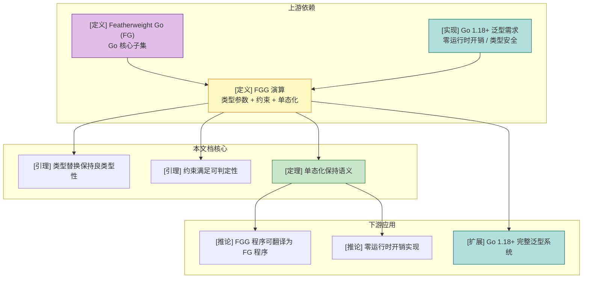
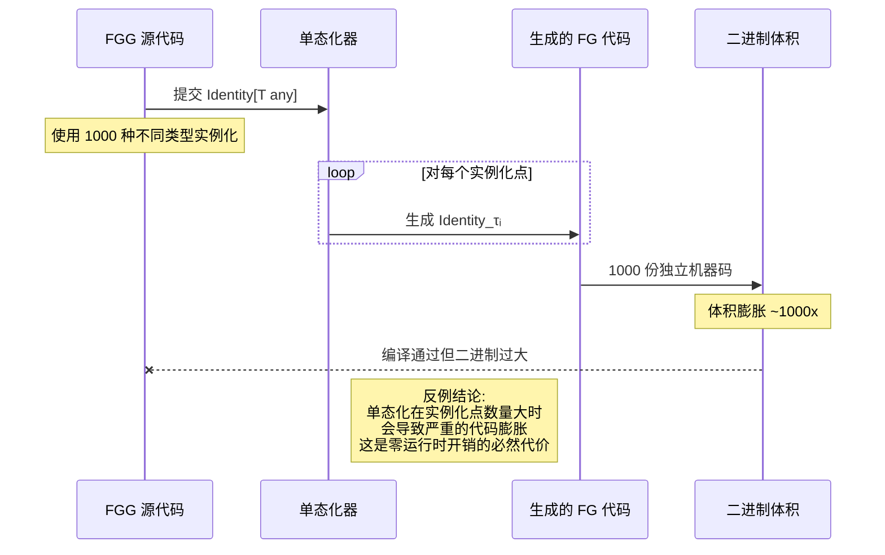
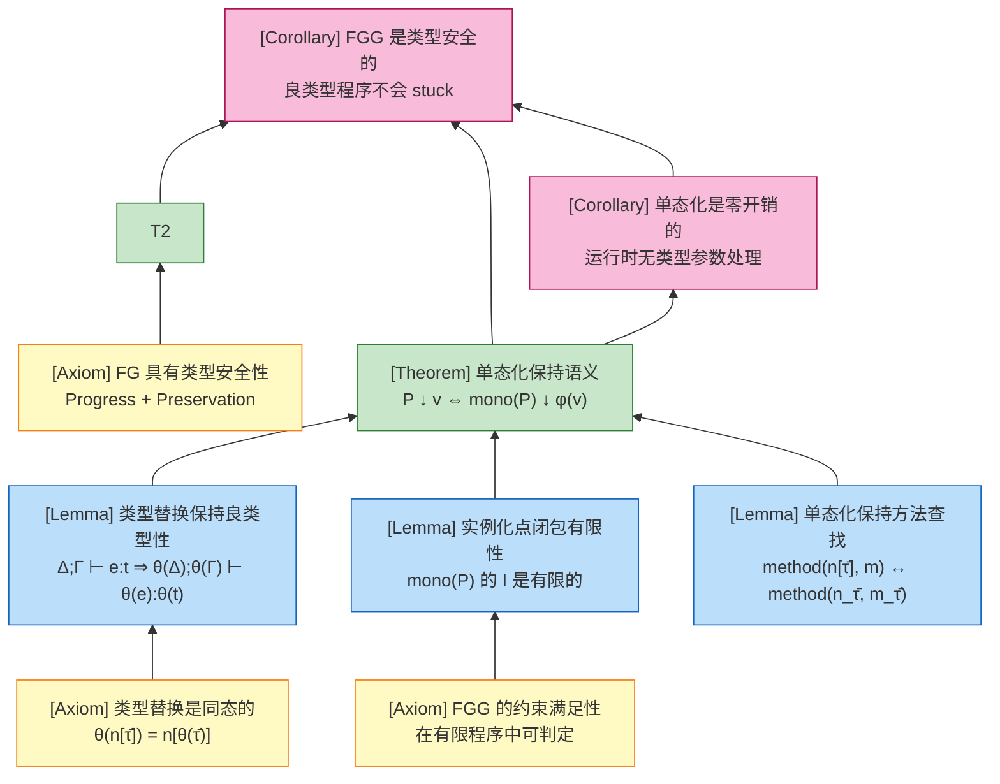

# Featherweight Generic Go (FGG) 演算

> **位置**: `deep/02-language-analysis/Go/05-Extension-Generics/`
> **前置知识**: [Featherweight Go (FG)](../../02-Static-Semantics/FG-Calculus.md)
> **关联可视化**: 详见本文末尾"关联可视化资源"

---

## 1. 概念定义 (Definitions)

### 1.1 FGG 完整语法扩展

**定义 1 (FGG 抽象语法)**:

```
程序:
  P ::= decl*

声明:
  decl ::= type t[Φ] struct { f̄ }                    (泛型结构体)
         | type t[Φ] interface { m̄ }                  (泛型接口)
         | func (x t[τ̄]) m[Φ](x₁ t₁, ..., xₙ tₙ) t_r { e }   (泛型方法)
         | func m[Φ](x₁ t₁, ..., xₙ tₙ) t_r { e }            (泛型函数)

类型形参列表:
  Φ ::= T₁ S₁, ..., Tₙ Sₙ                           (T 是类型变量名，S 是约束)

类型约束:
  S ::= interface { spec* }                          (接口类型作为约束)

规范（spec）:
  spec ::= m(x₁ t₁, ..., xₙ tₙ) t_r                  (方法规范)
         | X                                         (类型嵌入)
         | t₁ | t₂ | ...                             (类型并集)
         | ~t                                        (底层类型约束)

类型:
  t, u, v ::= X                                      (类型变量)
           | n[τ̄]                                    (命名类型的实例化)

类型参数:
  τ ::= X | t                                        (类型变量或具体类型)

类型参数列表:
  Ψ ::= τ₁, ..., τₙ

表达式:
  e ::= x                                            (变量)
     | e.f                                           (字段选择)
     | e.(t)                                         (类型断言)
     | n[Ψ]{f: e, ...}                               (泛型结构体字面量)
     | e.m[Ψ](e, ...)                                (泛型方法调用)
     | m[Ψ](e, ...)                                  (泛型函数调用)
```

**直观解释**: FGG 是在 FG 基础上增加类型参数、类型约束和实例化机制的最小泛型演算，保留了 Go 的核心语法结构但剥离了包、导入、goroutine 等非泛型特性。

**定义动机**: 如果不抽象出这个最小语法，Go 1.18 泛型的完整实现（包含类型推断、接口组合、底层类型约束等）过于复杂，无法给出严格的类型安全证明和单态化正确性证明。FGG 语法足够小，可以形式化地证明"泛型代码通过单态化翻译后保持类型安全和语义等价"，同时又足够大，能够覆盖 Go 泛型的核心机制。

### 1.2 类型参数与类型约束

**定义 2 (类型参数 Type Parameter)**:

类型参数是一个形式化的类型占位符，在泛型声明中引入，在实例化时被替换为具体类型。

```
类型参数:  Φ = T₁ S₁, ..., Tₙ Sₙ

其中:
  - Tᵢ 是类型变量（type variable），在声明作用域内唯一
  - Sᵢ 是类型约束（type bound），限制 Tᵢ 可被替换的类型集合
```

**直观解释**: 类型参数就像函数的形式参数，但作用于类型层面——它允许一段代码对"尚未确定的类型"进行操作。

**定义动机**: 没有类型参数，就无法在结构体、接口和方法层面表达"对任意类型 T 的操作"。类型参数是泛型抽象的基石，它将"类型"本身提升为一等可参数化的对象。

**定义 3 (类型约束 Type Constraint)**:

类型约束是一个接口类型，定义了类型参数可被实例化的类型集合。

```
约束满足关系:
  Δ ⊢ τ satisfies S  当且仅当  τ ∈ typeset(S)

类型集合:
  typeset(interface { spec* }) = ⋂ { typeset(specᵢ) | specᵢ ∈ spec* }

规范的类型集合:
  typeset(m(x₁ t₁, ..., xₙ tₙ) t_r) = { τ | τ implements method m }
  typeset(t₁ | t₂ | ...) = typeset(t₁) ∪ typeset(t₂) ∪ ...
  typeset(~t) = { τ | underlying(τ) = underlying(t) }
  typeset(X) = typeset(Δ(X))   (嵌入类型约束)
```

**直观解释**: 类型约束回答"哪些类型可以替换这个类型参数？"——它通过方法要求、类型并集或底层类型等价来划定可接受类型的边界。

**定义动机**: 如果没有约束，所有类型参数都等价于 `any`，无法表达"T 必须支持比较"或"T 必须实现 String()"等关键限制。约束系统使得泛型代码在实例化时能够获得足够的方法信息，从而保证单态化后的方法调用是良定义的。

### 1.3 类型替换

**定义 4 (类型替换 Type Substitution)**:

```
替换 θ ::= [T₁ ↦ τ₁, ..., Tₙ ↦ τₙ]

替换应用 (同态扩展):
  θ(X) = τ          若 X ↦ τ ∈ θ
  θ(X) = X          若 X ∉ dom(θ)
  θ(n[τ₁, ..., τₙ]) = n[θ(τ₁), ..., θ(τₙ)]
  θ(struct { f̄ }) = struct { θ(f̄) }
  θ(interface { m̄ }) = interface { θ(m̄) }
  θ(func(x₁ t₁, ...) t_r { e }) = func(x₁ θ(t₁), ...) θ(t_r) { θ(e) }
```

**直观解释**: 类型替换是一种从"泛型定义"到"具体定义"的机械翻译，将所有的类型变量系统地替换为给定的具体类型。

**定义动机**: 单态化的核心操作就是类型替换。如果不精确定义替换的语法和语义，就无法证明"替换后的程序保持良类型性"。替换必须是同态的（homomorphic），即保持程序的结构不变，仅改变类型标注。

### 1.4 单态化语义

**定义 5 (单态化 Monomorphization)**:

单态化是将 FGG 程序翻译为 FG 程序的编译期转换，通过生成泛型声明在所有实例化点上的具体副本来消除类型参数。

```
单态化函数 mono(P):

输入: FGG 程序 P
输出: FG 程序 P'

1. 收集实例化点:
   I = ∅
   for each 类型使用 n[τ̄] in P:
     I = I ∪ { (n, τ̄) }
   for each 方法调用 e.m[τ̄](args) in P:
     I = I ∪ { (m, τ̄) }
   for each 函数调用 f[τ̄](args) in P:
     I = I ∪ { (f, τ̄) }

2. 闭包计算 (transitive closure):
   repeat until I 不变:
     for each (decl, τ̄) ∈ I:
       令 decl 的体为 body
       令 θ = [Φ ↦ τ̄]  (Φ 为 decl 的类型形参)
       for each 嵌套实例化 n[τ̄'] in θ(body):
         I = I ∪ { (n, θ(τ̄')) }

3. 生成具体版本:
   for each (decl, τ̄) ∈ I:
     生成新名字 decl_τ̄
     将 θ(decl) 加入 P'，其中所有类型名 n[τ̄'] 替换为 n_τ̄'

4. 替换调用点:
   将 P 中所有泛型调用替换为对应的具体名字调用
```

**直观解释**: 单态化就像"按需复制粘贴"——编译器找出程序中所有使用泛型的地方，为每个具体类型组合生成一份专属代码，最终得到一个完全没有类型参数的纯 FG 程序。

**定义动机**: Go 编译器选择单态化而非类型擦除作为泛型实现策略，核心动机是零运行时开销和保持 Go 的值语义。形式化地定义单态化语义，使我们能够严格证明：FGG 程序的执行行为等价于其单态化后的 FG 程序，从而为"编译期泛型无运行时开销"提供理论基础。

> **推断 [Theory→Model]**: FGG 采用单态化语义（理论层面的翻译策略），意味着模型层面不存在运行时的类型参数信息。
>
> **推断 [Model→Implementation]**: 因此 Go 1.18+ 编译器在实现层面必须生成每个实例化的独立代码副本，无法像 Java 那样依赖运行时的类型擦除和装箱。

---

## 2. 属性推导 (Properties)

### 2.1 从 FGG 规则推导的核心性质

**性质 1 (类型替换保持良类型性)**:

若 Δ; Γ ⊢_{FGG} e : t 且 θ 是满足 dom(θ) ⊆ dom(Δ) 的替换，同时对所有 X ∈ dom(θ) 有 Δ ⊢ θ(X) satisfies Δ(X)，则 θ(Δ); θ(Γ) ⊢_{FGG} θ(e) : θ(t)。

**推导**:

1. 由 FGG 类型规则的结构归纳假设，对表达式 e 的每个子表达式，替换保持类型判断。
2. 对于变量 x，由 Γ(x) = t，得 θ(Γ)(x) = θ(t)，规则 T-VAR 直接适用。
3. 对于方法调用 e.m[Ψ](args)，原判断要求 method(n[Ψ'], m[Φ]) 良定义且参数类型匹配。替换后，θ 作用于方法签名和参数类型，由于 θ 保持约束满足关系，方法查找结果保持一致，参数类型仍匹配。
4. 对于结构体构造 n[Ψ]{f: e}，替换后字段类型 θ(t_f) 与表达式 θ(e) 的类型一致，因为替换是同态的。
5. 因此，对 e 的所有语法构造，替换后的类型判断成立。∎

**性质 2 (约束满足的可判定性)**:

对于 FGG 中的任意具体类型 τ 和约束 S，判断 τ satisfies S 是可判定的。

**推导**:

1. FGG 的约束 S 是有限接口规范的组合，包含有限个方法规范、类型并集项和底层类型约束。
2. 方法满足性判断 τ implements m 可归结为在程序声明中查找 τ 的方法集，程序声明是有限的，因此可判定。
3. 类型并集满足性判断 τ satisfies t₁ | t₂ | ... 可归结为逐个判断 τ satisfies tᵢ，由于并集项有限，可判定。
4. 底层类型约束 ~t 的判断归结为 underlying(τ) = underlying(t)，Go 的底层类型计算是语法上的递归定义，可判定。
5. 因此，约束满足性作为有限个可判定判断的合取/析取，整体可判定。∎

**性质 3 (单态化后的程序等价于原程序)**:

若 FGG 程序 P 是良类型的，则对任意输入，P 的执行结果与 mono(P) 的执行结果相同（值结构同构）。

**推导**:

1. 单态化 mono(P) 的每一步都是将泛型声明替换为具体类型的副本，调用点同步更新。
2. 由性质 1，替换保持良类型性，因此 mono(P) 中不存在类型错误导致的异常行为分歧。
3. FGG 的操作语义与 FG 的操作语义在表达式层面完全一致（字段选择、方法调用、结构体构造的规则相同）。
4. 单态化仅改变类型名和方法名的表面形式，不改变表达式的归约规则序列。
5. 因此，P 中表达式的归约链与 mono(P) 中对应表达式的归约链一一对应，最终值结构同构。∎

**性质 4 (FGG 类型环境的一致性)**:

若 Δ; Γ ⊢_{FGG} e : t，则对 Δ 中所有类型变量 X，其约束 S = Δ(X) 是良定义的（即 S 中引用的所有类型名在 Θ 中有声明）。

**推导**:

1. FGG 的类型检查从空环境开始，类型环境 Δ 仅在检查泛型声明时被扩展（加入 Φ 中的类型参数）。
2. 根据 FGG 的声明规则（W-DECL），泛型声明的类型形参列表 Φ 中的每个约束 Sᵢ 必须在当前类型声明环境 Θ 中良定义。
3. 因此，当 Δ 被扩展为 Δ, X: S 时，S 的良定义性已经被前置规则保证。
4. 由规则归纳，整个推导树中 Δ 的一致性保持。∎

---

## 3. 关系建立 (Relations)

### 3.1 FGG 与 FG 的关系

**关系 1**: FG `⊂` FGG（FG 是 FGG 的严格子集）

**论证**:

- **语法包含性**: 任何 FG 程序都是 FGG 程序的一个特例——只需令所有类型形参列表 Φ = ∅（空列表），所有类型实例化 Ψ = ∅。此时 FGG 的语法完全退化为 FG 语法。
- **表达能力分离**: FGG 可以表达 FG 无法表达的泛型抽象（如 `List[T]`、`Map[K, V]`），而 FG 程序无法在不改变语法的情况下表达这些抽象。因此 FGG 的表达能力严格强于 FG。
- **语义兼容性**: FGG 的操作语义在 Φ = ∅ 时与 FG 的操作语义完全一致，不存在行为分歧。

### 3.2 FGG 与 Go 1.18+ 泛型的关系

**关系 2**: FGG `⊂` Go 1.18+ Generics（FGG 是 Go 1.18+ 泛型的严格子集）

**论证**:

- **语法子集**: FGG 抽象掉了 Go 1.18+ 中的包系统、类型推断算法、泛型类型别名、~ 底层类型约束的完整语义、以及类型集合的复杂组合规则。
- **表达能力分离**: Go 1.18+ 支持 FGG 不支持的特性，例如：
  - 类型推断：调用 `make(List[int])` 可简写为 `make(List[])` 或更短形式
  - 类型别名泛型：`type MyList[T] = List[T]`
  - 更复杂的类型集合操作（如交集、补集的隐式表达）
- **理论归约**: FGG 保留了 Go 1.18+ 泛型的核心类型安全机制，因此可以通过扩展 FGG 的形式化规则来覆盖 Go 1.18+ 的完整泛型系统。FGG 是 Go 泛型的"最小可证明核心"。

### 3.3 概念依赖图



**图说明**:

- 本图展示了 FGG 在知识体系中的位置：上游依赖 FG 的形式化基础，下游支撑 Go 1.18+ 泛型的实现理论。
- FG 到 FGG 的箭头表示语法扩展和表达能力增强。
- FGG 到 Go 1.18+ 的虚线箭头表示理论模型到工程实现的映射关系。
- 核心定理（单态化保持语义）是连接理论与实现的桥梁。

---

## 4. 论证过程 (Argumentation)

### 4.1 单态化正确性的辅助引理

**引理 4.1 (实例化点闭包有限性)**:

对于任意良类型的 FGG 程序 P，其单态化所需的实例化点集合 I 是有限的。

**证明**:

1. **前提分析**: P 是良类型的，因此 P 中只包含有限个泛型声明（类型、方法、函数）。设泛型声明的总数为 N。
2. **构造/推导**: 每个泛型声明 d 有固定的类型形参个数 k_d。P 中显式的类型实例化点数量是有限的（因为程序文本有限）。
3. **闭包分析**: 在闭包计算步骤中，每个新产生的实例化点都对应某个已有实例化点的具体化体中的嵌套实例化。由于程序文本有限，每个具体化体中的嵌套实例化数量是有限的。
4. **终止性**: 关键观察是 FGG 的类型系统禁止无限递归的类型参数展开（例如，不允许 `type T[T any] struct {}` 这种自引用导致无限类型构造）。因此，闭包计算在有限步后必然达到不动点。
5. **结论**: 实例化点集合 I 是有限的。∎

**引理 4.2 (单态化保持方法查找)**:

设 P 是 FGG 程序，n[τ̄] 是 P 中的良类型实例化类型，m 是 n[τ̄] 的方法。则 mono(P) 中对应的具体类型 n_τ̄ 具有方法 m_τ̄，且 m_τ̄ 的签名是 m 签名的单态化结果。

**证明**:

1. **前提分析**: 因为 P 良类型，n[τ̄] 的方法 m 在 P 的声明环境中有定义。设方法声明为 `func (x n[Φ]) m[Ψ](...) t_r { e }`，其中 Φ 是 n 的类型形参。
2. **构造/推导**: 单态化时，实例化点 (n, τ̄) 会生成具体类型 n_τ̄ 和方法 m_τ̄。方法体通过替换 θ = [Φ ↦ τ̄] 进行转换。
3. **方法接收者匹配**: mono(P) 中 m_τ̄ 的接收者类型为 n_τ̄，与调用 `x.m_τ̄(...)` 的接收者类型一致。
4. **参数类型匹配**: 方法 m_τ̄ 的参数类型是 θ 作用于原方法参数类型的结果。由于 θ 是同态替换，参数类型的对应关系保持。
5. **结论**: 方法查找在 mono(P) 中成功，且找到的签名是原签名的单态化版本。∎

### 4.2 从 FGG 到 FG 的语义归约

**引理 4.3 (FGG 表达式语义可归约到 FG)**:

对于 FGG 程序 P 中的任意表达式 e，若 e 在 P 中可归约为值 v，则 mono(P) 中对应的表达式 θ(e) 可归约为 θ(v)。

**证明**:

1. **前提分析**: FGG 和 FG 共享相同的表达式语法核心（变量、字段选择、方法调用、结构体构造）。FGG 额外增加了类型参数，但这些参数不影响运行时的归约规则。
2. **结构归纳**: 对 e 的归约步数进行归纳。
   - **基例**: e 已经是值（结构体字面量）。单态化将结构体类型 n[τ̄] 替换为 n_τ̄，字段值递归替换，结果仍是良形式的结构体值。
   - **归纳步**: 假设 e 经过一步归约到 e'，我们需要证明 θ(e) 也经过一步归约到 θ(e')。
     - 若归约规则是字段选择 `(n[τ̄]{...}).fᵢ → eᵢ`，则 mono(P) 中对应 `(n_τ̄{...}).fᵢ → θ(eᵢ)`，规则相同。
     - 若归约规则是方法调用 `n[τ̄]{...}.m[Ψ](args) → [x ↦ receiver, yᵢ ↦ argsᵢ]e_body`，则 mono(P) 中对应 `n_τ̄{...}.m_τ̄(θ(args)) → [x ↦ θ(receiver), yᵢ ↦ θ(argsᵢ)]θ(e_body)`。由引理 4.2，方法体 θ(e_body) 正是 mono(P) 中 m_τ̄ 的体。
3. **结论**: 每一步归约在 mono(P) 中都有对应的归约步，因此整个归约链保持。∎

> **推断 [Control→Execution]**: 由于 FGG 的类型约束系统（控制层）在编译期拒绝了所有不满足约束的实例化，执行层的单态化代码中不会出现因类型参数不匹配导致的方法查找失败。
>
> **推断 [Execution→Data]**: 因此单态化后的 FG 程序（执行层）在运行时能够保证方法调用的良定义性，从而保证数据层（程序输出和状态）的语义等价性。

---

## 5. 形式证明 (Proofs)

### 5.1 单态化保持语义的证明草图增强版

**定理 5.1 (单态化保持语义)**:

设 P 是一个良类型的 FGG 程序，mono(P) 是其单态化后的 FG 程序。则 P 的执行行为与 mono(P) 的执行行为等价：

$$
P \Downarrow v \iff mono(P) \Downarrow v'
$$

其中 v 和 v' 是语义对应的结果（值结构同构）。

**证明**:

**步骤 1: 建立对应关系**

我们需要在 P 的运行时状态和 mono(P) 的运行时状态之间建立一个双射（对应关系）φ。对于 P 中的每个值 v = n[τ̄]{f₁: v₁, ..., fₖ: vₖ}，mono(P) 中有对应的值 φ(v) = n_τ̄{f₁: φ(v₁), ..., fₖ: φ(vₖ)}。这个对应关系是良定义的，因为：

- 由引理 4.1，单态化产生的具体类型名 n_τ̄ 是有限的且唯一的。
- 由引理 4.2，n_τ̄ 的字段和方法与原类型 n[τ̄] 一一对应。

**步骤 2: 证明单步归约保持对应关系**

我们需要证明：若 P 中的表达式 e 单步归约到 e'（记为 e →_P e'），则 mono(P) 中对应的表达式 φ(e) 单步归约到 φ(e')（记为 φ(e) →_{mono(P)} φ(e')）。

对 e 的语法结构进行案例分析：

- **案例 1: 字段选择 (R-Field)**
  - 设 e = n[τ̄]{f₁: e₁, ..., fₖ: eₖ}.fᵢ
  - 在 P 中：e →_P eᵢ
  - 在 mono(P) 中：φ(e) = n_τ̄{f₁: φ(e₁), ..., fₖ: φ(eₖ)}.fᵢ →_{mono(P)} φ(eᵢ)
  - 因为 FG 的字段选择规则不依赖类型参数，只依赖字段名，所以对应关系保持。

- **案例 2: 方法调用 (R-Call)**
  - 设 e = n[τ̄]{...}.m[Ψ](args)
  - 在 P 中，查找方法得到 `func (x n[Φ]) m[Ψ'](y₁ t₁, ...) t_r { body }`，其中实际替换为 θ = [Φ ↦ τ̄, Ψ' ↦ Ψ]。
  - 归约规则将 e 替换为 θ[body](x ↦ receiver, yᵢ ↦ argsᵢ)。
  - 在 mono(P) 中，φ(e) = n_τ̄{...}.m_τ̄(φ(args))。
  - 由引理 4.2，mono(P) 中 n_τ̄ 的方法 m_τ̄ 的体为 θ(body)。
  - 归约规则将 φ(e) 替换为 θ[body](x ↦ φ(receiver), yᵢ ↦ φ(argsᵢ)) = φ(θ[body](x ↦ receiver, yᵢ ↦ argsᵢ))。
  - 因此 φ(e) →_{mono(P)} φ(e')。

- **案例 3: 函数调用 (R-Func)**
  - 与案例 2 类似，只是没有接收者参数。单态化后的函数 f_τ̄ 的体是原函数体的替换结果，归约对应关系保持。

- **案例 4: 类型断言 (R-Assert)**
  - FGG 的类型断言 e.(t) 在运行时检查 e 的动态类型是否为 t。
  - 单态化后，φ(e) 的动态类型是 n_τ̄，而断言类型 t 被替换为 θ(t)。
  - 由于单态化为每个实例化生成独立类型，运行时类型标签一一对应，断言结果保持一致。

**步骤 3: 证明多步归约保持对应关系**

由步骤 2，单步归约保持 φ 对应关系。通过数学归纳法，对归约步数 n 进行归纳：

- 基例 (n=0): e = e'，显然 φ(e) = φ(e')。
- 归纳步: 假设 n 步归约保持对应关系。对于 n+1 步归约 e →_P e₁ →_P ... →_P e'，由归纳假设和步骤 2，φ(e) →_{mono(P)} φ(e₁) →_{mono(P)} ... →_{mono(P)} φ(e')。

**步骤 4: 证明终止性等价**

若 P 中 e 归约到值 v（即 e ↓_P v），则由步骤 3，mono(P) 中 φ(e) ↓_{mono(P)} φ(v)。反之，若 mono(P) 中 φ(e) 归约到值 w，由于 φ 是双射，存在唯一的 v 使得 w = φ(v)，且 e ↓_P v。

**步骤 5: 结论**

对于整个程序 P，其入口表达式（通常是 main 函数调用）的归约结果与 mono(P) 的入口表达式归约结果通过 φ 一一对应。因此：

$$
P \Downarrow v \iff mono(P) \Downarrow \phi(v)
$$

∎

### 5.2 FGG 类型安全的论证

**定理 5.2 (FGG 类型安全)**:

若 P 是良类型的 FGG 程序，则 P 的执行不会 stuck（即不会出现类型错误导致的不可归约非值状态）。

**证明**:

FGG 的类型安全通过**归约到 FG 的类型安全**来证明。FG（Featherweight Go）已被证明具有类型安全性（Progress + Preservation）。我们的策略是：证明任何良类型的 FGG 程序 P 可以单态化为良类型的 FG 程序 mono(P)，然后利用 FG 的类型安全推导出 FGG 的类型安全。

**步骤 1: 证明 mono(P) 是良类型的 FG 程序**

- 由定理 5.1 的证明草图，mono(P) 中的每个具体类型和方法都有明确的 FG 语法对应。
- 由性质 1（类型替换保持良类型性），对于 P 中的每个泛型声明和每个实例化点 (decl, τ̄)，替换后的具体版本 θ(decl) 在 FG 类型系统中是良类型的。
- 由引理 4.2，方法查找在 mono(P) 中保持，因此所有方法调用的类型一致性保持。
- 因此，mono(P) 作为 FG 程序是良类型的。

**步骤 2: 利用 FG 的类型安全**

- FG 的类型安全定理指出：对于良类型的 FG 程序，Progress（表达式要么是值，要么可以进一步归约）和 Preservation（归约保持类型）成立。
- 因为 mono(P) 是良类型的 FG 程序，所以 mono(P) 满足 Progress 和 Preservation。

**步骤 3: 从 mono(P) 的安全推导 P 的安全**

- 假设 P 中存在某个表达式 e 在执行时 stuck。即 e 不是值，但无法继续归约，且 stuck 的原因是类型错误（例如对非结构体值做字段选择，或方法查找失败）。
- 考虑 mono(P) 中对应的表达式 φ(e)。
- 由定理 5.1 的步骤 2，P 中的每一步归约在 mono(P) 中都有对应归约。如果 e 在 P 中 stuck，则 φ(e) 在 mono(P) 中也必须 stuck（因为不存在额外的归约路径）。
- 但这与步骤 2 矛盾，因为 mono(P) 作为良类型的 FG 程序不可能 stuck。
- 因此，假设不成立，P 不可能 stuck。

**步骤 4: 结论**

FGG 程序 P 满足类型安全：任何良类型的 FGG 程序在执行过程中都不会遇到类型错误导致的 stuck 状态。∎

**关键案例分析**:

- **案例 A: 泛型方法调用 stuck 的可能性**
  - 在 FGG 中，方法调用 `e.m[Ψ](args)` 可能 stuck 的原因有两个：(1) e 不是值或不是结构体值；(2) e 的类型没有方法 m。
  - 原因 (1) 与泛型无关，FG 同样处理。
  - 原因 (2) 在 FGG 中被类型规则排除：类型规则要求 `e : n[τ̄]` 且 `n[τ̄]` 实现了 m 的接收者约束。单态化后，由引理 4.2，n_τ̄ 确实具有方法 m_τ̄，因此不会 stuck。

- **案例 B: 类型断言 stuck 的可能性**
  - FGG 的类型断言 `e.(t)` 在运行时检查动态类型。如果 e 的动态类型不是 t，断言会 panic（在 Go 中）。
  - 这不是"stuck"（因为 panic 是定义好的运行时行为），且与泛型无关。FGG 的类型安全定理关注的是"类型错误导致的不可定义行为"，而 panic 是定义好的行为。

---

## 6. 实例与反例 (Examples & Counter-examples)

### 6.1 正例：泛型链表的单态化

**示例 6.1: 泛型链表及其单态化**

```go
// FGG 程序
package main

type List[T any] struct {
    head T
    tail *List[T]
}

func (l *List[T]) Append(value T) *List[T] {
    if l == nil {
        return &List[T]{head: value, tail: nil}
    }
    return &List[T]{head: l.head, tail: l.tail.Append(value)}
}

func main() {
    var list *List[int] = nil
    list = list.Append(1)
    list = list.Append(2)
    _ = list
}
```

**逐步推导**:

1. 程序中显式的实例化点有：`List[int]`（2 处：类型声明和结构体字面量）、`Append[int]`（2 处方法调用）。
2. `Append[int]` 的方法体中包含 `*List[T]` 和 `List[T]` 的实例化，闭包计算加入 `List[int]`（已存在）。
3. 实例化点集合 I = { (List, [int]), (Append, [int]) }。
4. 单态化后生成 `List_int` 和 `Append_int`，所有 `List[int]` 替换为 `List_int`，`Append[int]` 替换为 `Append_int`。
5. 生成的 FG 程序中，`Append_int` 的接收者为 `*List_int`，参数为 `int`，返回 `*List_int`，完全良类型。

### 6.2 反例 1：类型参数不满足约束

**反例 6.1: 约束违反导致类型检查失败**

```go
// FGG 程序（类型错误）
package main

type Adder[T interface { ~int | ~float64 }] struct {
    value T
}

func (a *Adder[T]) Add(other T) T {
    return a.value + other  // 需要 T 支持 +
}

func main() {
    // 错误：string 不满足约束 interface { ~int | ~float64 }
    var a *Adder[string] = &Adder[string]{value: "hello"}
    _ = a.Add("world")
}
```

**分析**:

- **违反的前提**: `string` 的底层类型是 `string`，不等于 `int` 也不等于 `float64`，因此 `string` 不满足约束 `interface { ~int | ~float64 }`。
- **导致的异常**: FGG 类型检查在实例化点 `Adder[string]` 处失败，因为类型规则要求 `Δ ⊢ string satisfies interface { ~int | ~float64 }`，而该判断为假。
- **结论**: 如果编译器允许此程序通过，单态化后生成的 `Adder_string` 在 FG 中会因 `string` 不支持 `+` 运算符而 stuck。约束系统正是为了在编译期捕获此类错误。

### 6.3 反例 2：单态化导致代码膨胀

**反例 6.2: 单态化膨胀的边界场景**

```go
// FGG 程序：N 个不同结构体，每个都调用同一个泛型函数
package main

type Container[T any] struct { value T }

func Identity[T any](x T) T { return x }

func main() {
    _ = Identity[int](1)
    _ = Identity[string]("a")
    _ = Identity[bool](true)
    _ = Identity[float64](1.0)
    _ = Identity[struct{ x int }](struct{ x int }{1})
    // ... 假设有 1000 个不同的类型实例化
}
```

**单态化结果**:

```go
// 生成的 FG 程序（片段）
func Identity_int(x int) int { return x }
func Identity_string(x string) string { return x }
func Identity_bool(x bool) bool { return x }
func Identity_float64(x float64) float64 { return x }
func Identity_struct_x_int(x struct{ x int }) struct{ x int } { return x }
// ... 1000 个副本
```

**分析**:

- **违反的前提**: 单态化假设"实例化点有限"（引理 4.1），但没有假设"实例化点数量小"。
- **导致的异常**: 每个不同的类型参数都会生成一份独立的机器码。在上例中，`Identity` 被实例化 1000 次，生成 1000 份几乎相同的代码（仅类型不同），导致二进制体积显著膨胀。
- **结论**: 这是单态化的根本权衡——用代码空间换取运行时性能。Go 1.18+ 编译器通过 GC Shape Stenciling 等优化来缓解此问题，但在理论上，FGG 的单态化语义不可避免地存在代码膨胀边界。

### 6.4 反例 3：FGG 未覆盖的 Go 泛型特性

**反例 6.3: FGG 的故意限制**

FGG 为了形式化简洁，省略了 Go 1.18+ 泛型的若干特性。这些省略对证明有直接影响：

| 省略特性 | Go 1.18+ 行为 | FGG 处理方式 | 对证明的影响 |
|---------|--------------|-------------|------------|
| **类型推断** | 调用 `f(42)` 可自动推断 `T=int` | FGG 要求显式写出 `f[int](42)` | 简化了类型检查证明，无需处理约束求解和统一算法的终止性 |
| **~ 底层类型约束** | `interface { ~int }` 允许 `MyInt` | FGG 语法包含 `~t`，但类型集合语义简化 | 底层类型计算是语法递归的，FGG 中可判定；完整 Go 中需处理类型循环和别名 |
| **类型别名泛型** | `type MyList[T] = List[T]` | FGG 无类型别名 | 避免了别名展开可能导致的无限递归，简化了单态化闭包有限性证明 |
| **类型参数作为约束** | `func f[T comparable, S ~[]T](x S)` | FGG 不支持约束中的类型参数依赖 | 简化了约束满足性判断，但损失了表达参数间依赖关系的能力 |

**分析**:

- **违反的前提**: 如果将这些特性直接加入 FGG，某些证明（如引理 4.1 的实例化点闭包有限性）将不再 trivially 成立。
- **导致的异常**: 例如，类型别名泛型可能引入 `type T[T] = T[T]` 这样的循环定义，导致单态化闭包计算不终止。
- **结论**: FGG 是一个"最小可证明核心"。Go 编译器的实际实现需要额外的检查（如类型循环检测、推断算法的启发式限制）来保证这些扩展特性的安全性。FGG 的证明为实际实现提供了理论基础，但实现层面的完整正确性需要在这些省略特性上补充额外的论证。

### 6.5 反例场景图：单态化膨胀



**图说明**:

- 本图展示了反例 6.2 的执行流程：单个泛型定义被大量实例化后，单态化器生成大量代码副本。
- "违反的前提"是"实例化点数量小"的隐含假设。
- "导致的异常"是二进制体积膨胀。
- 结论是单态化的性能优势以代码空间为代价。

---

## 7. 公理-定理推理树图



**图说明**:

- 本图展示了从基本公理到核心定理的完整推理链条。
- 底层黄色节点是不可再分的前提（替换同态性、FG 类型安全、约束可判定性）。
- 中间蓝色节点是辅助引理（替换保持类型、闭包有限性、方法查找保持）。
- 顶层绿色节点是主要定理（单态化保持语义、FGG 类型安全）。
- 粉色节点是实用推论（零开销实现、类型安全保证）。
- 边上隐含的推理方法：结构归纳（L1）、有限性分析（L2）、构造对应（L3）、归约证明（T2）。

---

## 8. 关联可视化资源

本文档涉及的可视化资源已按项目规范归档，详见项目根目录的 [`VISUAL-ATLAS.md`](../../../../../../VISUAL-ATLAS.md)。

建议关联查看的可视化条目：

- `mindmaps/FGG-Concept-Map.mmd` — FGG 概念依赖图
- `proof-trees/Monomorphization-Correctness-Tree.mmd` — 单态化正确性推理树
- `counter-examples/FGG-Monomorphization-Bloat.mmd` — 单态化膨胀反例场景图

---

**参考文献**:

- Griesemer, R., et al. "Featherweight Generic Go." _OOPSLA 2021_.
- The Go Programming Language Specification: Type Parameters
- Go 1.18 Release Notes: Generics
