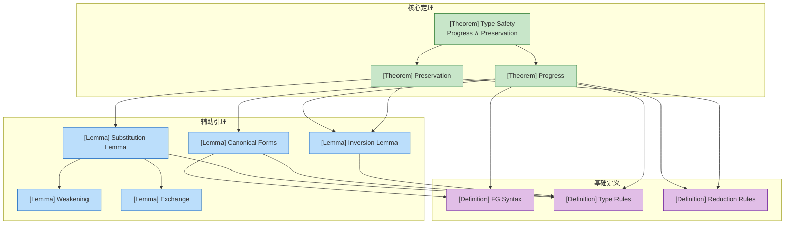
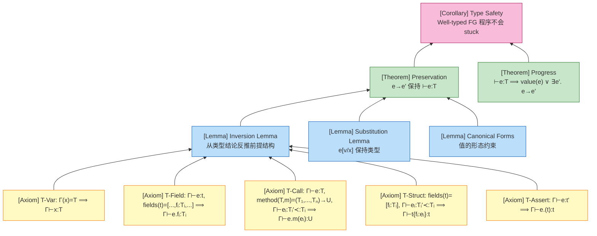
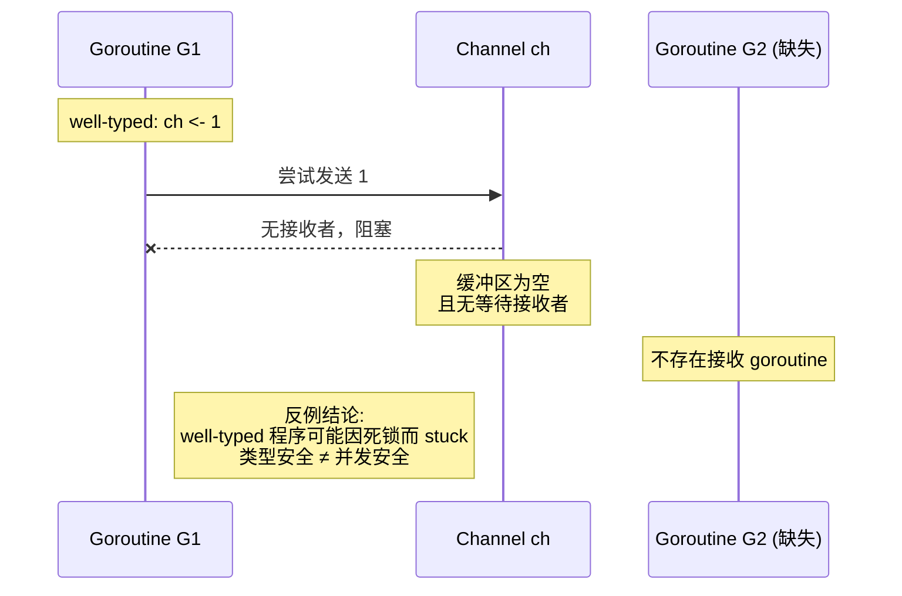

# Go 语言类型安全证明

> **文档定位**: 本文件属于 `deep/02-language-analysis/Go/06-Verification/` 阶段，建立 Featherweight Go (FG) 的类型安全形式化框架。

---

## 1. 概念定义 (Definitions)

### 定义 1 (类型安全)

**类型安全 (Type Safety)** 是编程语言理论中的核心性质，确保 well-typed 程序不会陷入某些未定义行为。对于 Go 语言，类型安全由以下两个定理的合取构成：

$$
\text{Type Safety} \triangleq \text{Progress} \land \text{Preservation}
$$

其中：

- **Progress**: 若 $\vdash e : T$，则 $e$ 要么是值 $v$，要么存在 $e'$ 使得 $e \longrightarrow e'$。
- **Preservation (Subject Reduction)**: 若 $\vdash e : T$ 且 $e \longrightarrow e'$，则 $\vdash e' : T$。

**直观解释**：类型安全保证"类型正确的程序在运行时不会由于类型不匹配而卡住"，要么正常求值到结果，要么无限运行下去。

**定义动机**：如果不将类型安全分解为 Progress 和 Preservation，我们无法分别定位"运行时卡住"和"运行时类型丢失"这两类不同的问题。该分解是 Wright & Felleisen (1994) 提出的标准框架，已被广泛应用于现代编程语言的形式化验证。Progress 回答"程序能否继续执行"，Preservation 回答"执行后类型是否仍然正确"，两者缺一不可。

### 定义 2 (FG 核心语法)

我们选择 **Featherweight Go (FG)** 子集作为证明载体。FG 的抽象语法如下：

```
类型:
  T, U ::= t                    (命名类型：结构体或接口)

表达式:
  e ::= x                       (变量)
     | e.f                      (字段访问)
     | e.(T)                    (类型断言)
     | t{f: e, ...}             (结构体构造)
     | e.m(e, ...)              (方法调用)
     | panic                    (动态失败)

值:
  v ::= t{f: v, ...}           (结构体值)

环境:
  Γ ::= ∅ | Γ, x: T             (变量环境)
  Θ ::= ∅ | Θ, type_decl        (类型声明环境)
```

**直观解释**：FG 是 Go 语言的"核心骨架"，去掉了包、函数声明（保留方法）、控制流语句、并发原语和指针，只保留与类型系统本质相关的构造。

**定义动机**：完整 Go 的语法过于庞大（包含 50+ 种语句和表达式），直接在完整语言上证明类型安全会导致归纳案例爆炸。FG 保留了 Go 类型系统的核心挑战——结构体、接口、方法集和类型断言——同时足够小，使得纸笔证明可行。FG 已被证明是 Go 类型系统的可靠核心（Griesemer et al., 2020）。选择 FG 作为载体，是在"证明可处理性"与"结果迁移性"之间的最优权衡。

### 定义 3 (类型判断)

FG 的类型系统由以下判断构成：

**表达式类型**:
$$
\Gamma \vdash e : T
$$
（在环境 $\Gamma$ 下，表达式 $e$ 具有类型 $T$）

**子类型**:
$$
\Gamma \vdash T <: U
$$
（$T$ 是 $U$ 的子类型，当且仅当 $T$ 的方法集包含 $U$ 的方法集）

**方法满足**:
$$
T \vdash m \text{ satisfied}
$$
（类型 $T$ 实现了方法 $m$ 的签名）

**归约关系**:
$$
e \longrightarrow e'
$$
（表达式 $e$ 一步归约为 $e'$）

### 定义 4 (求值上下文)

求值上下文 $E$ 定义了归约可以发生的孔位：

```
E ::= []                         (空上下文)
    | E.f                        (字段访问上下文)
    | E.(T)                      (类型断言上下文)
    | t{f₁: v₁, ..., fᵢ: E, ..., fₙ: eₙ}   (结构体构造上下文)
    | E.m(e₁, ..., eₙ)           (方法调用接收者上下文)
    | v.m(v₁, ..., vᵢ₋₁, E, eᵢ₊₁, ..., eₙ) (方法调用参数上下文)
```

### 定义 5 (归约规则)

**R-Field（字段访问）**:
$$
\overline{t\{..., f_i: v_i, ...\}.f_i \longrightarrow v_i}
$$

**R-Assert-Success（类型断言成功）**:
$$
\frac{v = t\{...\}}{v.(t) \longrightarrow v}
$$

**R-Assert-Fail（类型断言失败）**:
$$
\frac{v = t'\{...\} \quad t' \neq t}{v.(t) \longrightarrow \text{panic}}
$$

**R-Call（方法调用）**:
$$
\frac{method(t, m) = func(r\ t)\ m(x_1\ T_1, ...)\ U\ \{ return\ e \}}{v.m(v_1, ...) \longrightarrow e[v/r, v_1/x_1, ...]}
$$
其中 $v = t\{...\}$。

**R-Context（上下文规则）**:
$$
\frac{e \longrightarrow e'}{E[e] \longrightarrow E[e']}
$$

**Panic 传播规则**（为完整性）：
$$
\frac{}{E[\text{panic}] \longrightarrow \text{panic}}
$$

---

## 2. 属性推导 (Properties)

从 FG 的类型系统定义，我们可以严格推导出以下性质：

**性质 1 (良类型程序无"方法不存在"错误)**:
若 $\vdash e : T$ 且 $e$ 包含子表达式 $e_0.m(e_1, ..., e_n)$，则当 $e_0$ 归约为值 $v = t\{...\}$ 时，$method(t, m)$ 必然在类型声明环境 $\Theta$ 中有定义。

**推导**:

1. 由反演引理（方法调用），若 $\Gamma \vdash e_0.m(e_1, ..., e_n) : U$，则 $\Gamma \vdash e_0 : T$ 且 $method(T, m)$ 有定义。
2. 由标准形式引理，若 $e_0$ 归约为值 $v$ 且 $\vdash v : T$，则 $v = t\{...\}$ 且 $t <: T$。
3. 由方法集的子类型单调性，$method(t, m)$ 亦有定义。
4. 因此，运行时不会出现"方法不存在"的错误。∎

**性质 2 (良类型程序无"字段不存在"错误)**:
若 $\vdash e : T$ 且 $e$ 包含子表达式 $e_0.f_i$，则当 $e_0$ 归约为值时，$f_i$ 必然在该结构体类型中声明。

**推导**:

1. 由反演引理（字段访问），若 $\Gamma \vdash e_0.f_i : T_i$，则 $\Gamma \vdash e_0 : t$ 且 $fields(t) = [..., f_i: T_i, ...]$。
2. 由标准形式引理，$e_0$ 的值形态必为 $t\{..., f_i: v_i, ...\}$。
3. 因此 R-Field 规则总是可应用，不会出现"字段不存在"的运行时错误。∎

**性质 3 (类型断言的完备性)**:
若 $\vdash e.(T) : T$ 且 $e$ 归约为值 $v$，则要么 $v = T\{...\}$（断言成功），要么 $v = t\{...\}$ 且 $t \neq T$（断言失败触发 panic）。不存在第三种未定义行为。

**推导**:

1. 由反演引理（类型断言），若 $\Gamma \vdash e.(T) : T$，则 $\Gamma \vdash e : U$ 对某个 $U$ 成立。
2. 由标准形式引理，任何值 $v$ 都形如 $t\{...\}$。
3. 由 R-Assert-Success 和 R-Assert-Fail，对 $t = T$ 和 $t \neq T$ 分别处理。
4. 因此类型断言的结果空间是穷尽的。∎

**性质 4 (值的封闭性)**:
若 $\vdash v : T$ 且 $v$ 是值，则 $v$ 中不包含自由变量。

**推导**:

1. 值的定义要求结构体构造 $t\{f_1: v_1, ..., f_n: v_n\}$ 中所有 $v_i$ 都是值。
2. 基础值（结构体字面值）不含变量。
3. 由结构归纳，所有组成部分都是闭的，因此 $v$ 是闭的。∎

---

## 3. 关系建立 (Relations)

### 关系 1: FG 类型安全 `⊂` 完整 Go 类型安全

**关系 1**: FG 的类型安全性质 `⊂` 完整 Go 的类型安全性质。

**论证**:

- **严格子集**: FG 的语法是完整 Go 语法的严格子集。任何 FG 程序都是合法的 Go 程序。
- **表达能力差距**: 完整 Go 包含指针、切片、映射、通道、goroutine、defer、panic/recover 等 FG 未涵盖的特性。
- **结论**: FG 的类型安全结果只能**部分迁移**到完整 Go。对于 FG 子集内的程序，类型安全保证成立；对于超出 FG 范围的特性（如指针算术、数据竞争），需要额外的证明框架（如内存模型、并发语义）。

> **推断 [Theory→Implementation]**: FG 的类型安全定理（理论结果）意味着 Go 编译器的类型检查算法（实现）对于 FG 子集是正确的。由于 FG 覆盖了 Go 类型系统的核心（结构体、接口、方法集、类型断言），该理论结果强烈暗示 Go 编译器主类型检查路径的正确性。

### 关系 2: 类型安全 `⟹` 内存安全（在 FG 范围内）

**关系 2**: 在 FG 子集内，类型安全 `⟹` 内存安全。

**论证**:

- FG 中没有指针、地址运算或显式内存分配。所有值都是结构体字面值，按值传递。
- 由性质 2，字段访问总是合法的；由性质 1，方法调用总是合法的。
- 不存在悬空引用、缓冲区溢出或非法内存访问的可能。
- 因此，在 FG 的封闭世界中，类型安全直接蕴含内存安全。

> **推断 [Model→Implementation]**: FG 模型中缺少指针和别名语义，意味着基于 FG 的证明无法直接保证完整 Go 的内存安全。完整 Go 的内存安全需要依赖 Go 内存模型（happens-before、逃逸分析、GC）作为补偿机制。

---

## 4. 论证过程 (Argumentation)

本节建立证明 Type Safety 所需的核心引理。

### 4.1 反演引理（Inversion Lemma）

反演引理允许我们从类型判断的结论反推其前提结构。

**引理 4.1 (反演 - 变量)**:
$$
\frac{\Gamma \vdash x : T}{\Gamma(x) = T}
$$

**证明**: 直接由变量类型规则（T-Var）的唯一性可得。∎

**引理 4.2 (反演 - 字段访问)**:
$$
\frac{\Gamma \vdash e.f_i : T_i}{\exists t: \Gamma \vdash e : t \land fields(t) = [..., f_i: T_i, ...]}
$$

**证明**: 字段访问的唯一类型规则是 T-Field，其前提正是 $\Gamma \vdash e : t$ 且 $t$ 声明了 $f_i : T_i$。∎

**引理 4.3 (反演 - 方法调用)**:
$$
\frac{\Gamma \vdash e.m(e_1, ..., e_n) : U}{\exists T, T_1, ..., T_n: \Gamma \vdash e : T \land method(T, m) = (T_1, ..., T_n) \rightarrow U \land \forall i: \Gamma \vdash e_i : T_i' \land T_i' <: T_i}
$$

**证明**: 方法调用的唯一类型规则是 T-Call，要求接收者类型 $T$ 具有方法 $m$，且每个实参 $e_i$ 的类型 $T_i'$ 是形参类型 $T_i$ 的子类型。∎

**引理 4.4 (反演 - 结构体构造)**:
$$
\frac{\Gamma \vdash t\{f_1: e_1, ..., f_n: e_n\} : t}{fields(t) = [f_1: T_1, ..., f_n: T_n] \land \forall i: \Gamma \vdash e_i : T_i' \land T_i' <: T_i}
$$

**证明**: 结构体构造的唯一类型规则是 T-Struct，要求字段列表与类型声明一致，且每个表达式类型是声明字段类型的子类型。∎

**引理 4.5 (反演 - 类型断言)**:
$$
\frac{\Gamma \vdash e.(t) : t}{\exists t': \Gamma \vdash e : t'}
$$

**证明**: 类型断言的唯一类型规则是 T-Assert，要求 $e$ 具有某个命名类型 $t'$，断言结果类型为 $t$。∎

### 4.2 标准形式引理（Canonical Forms）

标准形式引理描述值的可能形态，是 Progress 证明的关键。

**引理 4.6 (结构体值)**:
$$
\frac{\vdash v : t \quad type(t) = struct\{f_1: T_1, ..., f_n: T_n\}}{v = t\{f_1: v_1, ..., f_n: v_n\} \land \forall i: \vdash v_i : T_i}
$$

**证明**: 对值的结构进行归纳。FG 中唯一的值构造子是结构体字面值。由 T-Struct 规则，每个字段 $v_i$ 必须具有类型 $T_i$（或子类型）。∎

**引理 4.7 (接口值)**:
$$
\frac{\vdash v : t \quad type(t) = interface\{m_1, ..., m_n\}}{\exists t': t' <: t \land v = t'\{...\}}
$$

**证明**: FG 中接口本身不是值构造子。任何具有接口类型 $t$ 的值 $v$ 必须是某个实现了 $t$ 方法集的具体结构体类型 $t'$ 的字面值。∎

### 4.3 替换引理（Substitution Lemma）

**引理 4.8 (替换)**:
$$
\frac{\Gamma, x: T \vdash e : U \quad \Gamma \vdash v : T}{\Gamma \vdash e[v/x] : U}
$$

**证明**: 对 $e$ 的结构进行结构归纳。

1. **基本情况**:
   - $e = x$: $x[v/x] = v$。由前提 $\Gamma \vdash v : T$，且此时 $U = T$。成立。
   - $e = y \neq x$: $y[v/x] = y$。类型不变。成立。

2. **归纳步骤**:
   - $e = e_1.f$: 由归纳假设，$\Gamma \vdash e_1[v/x] : T_1$。由 T-Field 规则，字段访问保持类型。成立。
   - $e = e_1.m(e_2)$: 由归纳假设，$\Gamma \vdash e_1[v/x] : T_1$ 且 $\Gamma \vdash e_2[v/x] : T_2'$。由 T-Call 规则，方法调用保持类型。成立。
   - $e = t\{f_1: e_1, ...\}$: 由归纳假设，每个字段替换后保持类型。由 T-Struct 规则，整体保持类型。成立。
   - $e = e_1.(t)$: 由归纳假设，$\Gamma \vdash e_1[v/x] : T_1$。由 T-Assert 规则，断言保持类型。成立。

∎

### 4.4 结构引理

**引理 4.9 (弱化 / Weakening)**:
$$
\frac{\Gamma \vdash e : T \quad x \notin dom(\Gamma)}{\Gamma, x: U \vdash e : T}
$$

**证明**: 对 $e$ 的类型推导进行归纳。新增变量 $x$ 不影响已有推导中的任何规则应用。∎

**引理 4.10 (交换 / Exchange)**:
$$
\frac{\Gamma_1, x: T, y: U, \Gamma_2 \vdash e : V}{\Gamma_1, y: U, x: T, \Gamma_2 \vdash e : V}
$$

**证明**: 对 $e$ 的类型推导进行归纳。FG 类型规则中环境是有序列表但变量查找不依赖相邻变量的顺序，交换不影响任何规则的前提。∎

---

## 5. 形式证明 (Proofs)

### 5.1 证明依赖树图



**图说明**:

- 本图展示了 Type Safety 定理的证明依赖结构。
- 顶层绿色节点是主要定理；蓝色节点是辅助引理；紫色节点是基础定义。
- Type Safety 直接依赖 Progress 和 Preservation；两者共同依赖反演引理。
- 替换引理进一步依赖弱化、交换引理和类型规则定义。
- 详见 [Go-CSP-Formal](../../../../../../../../../formal/Go-CSP-Formal.md) 对 FG 语义的进一步形式化。

### 5.2 公理-定理推理树图



**图说明**:

- 本图自底向上展示了从 FG 类型规则公理到 Type Safety 推论的完整推理链。
- 底层黄色节点是五条基本类型规则公理；蓝色节点是三个核心引理。
- Preservation 和 Progress 定理（绿色）组合得到 Type Safety 推论（粉色）。
- 边上隐含的推理方法包括：结构归纳（引理）、规则归纳（定理）。

### 5.3 Preservation 定理

**定理 5.1 (Subject Reduction / Preservation)**:
如果 $\vdash e : T$ 且 $e \longrightarrow e'$，那么 $\vdash e' : T$。

**证明**: 对归约关系 $e \longrightarrow e'$ 进行规则归纳（案例分析）。

**关键案例分析**:

**案例 1: R-Field**
给定: $e = t\{..., f_i: v_i, ...\}.f_i \longrightarrow v_i = e'$

1. 由反演引理 4.2（字段访问）:
   - $\vdash t\{..., f_i: v_i, ...\} : t$
   - $fields(t) = [..., f_i: T_i, ...]$

2. 由反演引理 4.4（结构体构造）:
   - $\vdash v_i : T_i'$
   - $T_i' <: T_i$

3. 由子类型的传递性和 T-Sub 规则:
   - 因为 $T_i' <: T_i$，所以 $v_i$ 在需要 $T_i$ 的上下文中是良类型的。
   - 因此 $\vdash v_i : T_i$。

结论: $\vdash e' : T_i$ ✓

**案例 2: R-Assert-Success**
给定: $e = v.(t) \longrightarrow v = e'$，其中 $v = t\{...\}$

1. 由反演引理 4.5（类型断言）:
   - $\vdash v : t'$
   - 断言结果类型为 $t$

2. 由标准形式引理 4.6:
   - $v = t\{...\}$ 意味着 $t' = t$（因为值的类型与其构造子类型一致）

3. 因此 $\vdash v : t$。

结论: $\vdash e' : t$ ✓

**案例 3: R-Assert-Fail**
给定: $e = v.(t) \longrightarrow \text{panic} = e'$，其中 $v = t'\{...\}$ 且 $t' \neq t$

1. 由反演引理 4.5:
   - $\vdash v.(t) : t$，因此原表达式类型为 $t$。

2. 在 FG 扩展中，我们引入 panic 的类型规则:
   - $\forall T.\ \Gamma \vdash \text{panic} : T$（panic 可被赋予任意类型，因为它不会正常返回）

3. 因此 $\vdash \text{panic} : t$。

结论: $\vdash e' : t$ ✓

**案例 4: R-Call**
给定: $e = v.m(v_1, ..., v_n) \longrightarrow e_{body}[v/r, v_1/x_1, ...] = e'$，其中 $v = t\{...\}$

1. 由反演引理 4.3（方法调用）:
   - $\vdash v : t$
   - $method(t, m) = func(r\ t)\ m(x_1\ T_1, ..., x_n\ T_n)\ U\ \{ return\ e_{body} \}$
   - $\forall i: \vdash v_i : T_i'$
   - $T_i' <: T_i$

2. 由方法声明的类型检查（方法体在方法声明时已检查）:
   - $r: t, x_1: T_1, ..., x_n: T_n \vdash e_{body} : U'$
   - $U' <: U$

3. 由替换引理 4.8（多次应用）:
   - 首先，$r: t \vdash e_{body}[v/r] : U'$（因为 $\vdash v : t$）
   - 然后依次替换 $x_i$ 为 $v_i$。由弱化引理 4.9，可在上下文中添加其他绑定。
   - 最终得到 $\vdash e_{body}[v/r, v_1/x_1, ...] : U'$。

4. 由子类型传递性，$U' <: U$。

结论: $\vdash e' : U' <: U$，即 $\vdash e' : U$ ✓

**案例 5: R-Context**
给定: $e = E[e_1] \longrightarrow E[e_1'] = e'$，其中 $e_1 \longrightarrow e_1'$

1. 由归纳假设:
   - 若 $\vdash e_1 : T_1$ 且 $e_1 \longrightarrow e_1'$，则 $\vdash e_1' : T_1$。

2. 对求值上下文 $E$ 的结构进行归纳，证明"上下文保持类型":
   - **空上下文** $E = []$: 显然成立。
   - **字段访问** $E = E_1.f$: 若 $\Gamma \vdash E_1[e_1] : t$ 且 $fields(t) = [..., f: T_1, ...]$，由归纳假设 $\Gamma \vdash E_1[e_1'] : t$，则 $\Gamma \vdash E_1[e_1'].f : T_1$。
   - **类型断言** $E = E_1.(t)$: 类似，由 T-Assert 规则保持。
   - **结构体构造** $E = t\{..., f_i: E_1, ...\}$: 由 T-Struct 规则，若 $E_1[e_1]$ 字段类型保持，则替换后整体类型保持。
   - **方法调用（接收者）** $E = E_1.m(e_i)$: 由 T-Call 规则，接收者类型保持则整体保持。
   - **方法调用（参数）** $E = v.m(..., E_1, ...)$: 同理，参数类型保持则整体保持。

结论: $\vdash E[e_1'] : T$ ✓

**案例 6: Panic 传播**
给定: $e = E[\text{panic}] \longrightarrow \text{panic} = e'$

1. 由 panic 的类型规则，$\vdash \text{panic} : T$ 对任意 $T$ 成立。
2. 原表达式 $\vdash E[\text{panic}] : T$ 要求 $\vdash \text{panic} : T_1$ 对某个 $T_1$ 成立，这总是成立的。
3. 因此 $\vdash \text{panic} : T$。

结论: $\vdash e' : T$ ✓

∎

### 5.4 Progress 定理

**定理 5.2 (Progress)**:
如果 $\vdash e : T$，那么要么 $e$ 是值（$e = v$），要么存在 $e'$ 使得 $e \longrightarrow e'$。

**证明**: 对类型判断 $\Gamma \vdash e : T$ 进行结构归纳。

**关键案例分析**:

**案例 1: 变量 x**
在 closed term（封闭项）中，自由变量不会出现。若考虑 open term，变量本身已是正规形式（但在 FG 操作语义中，变量不是值，也不归约；Progress 通常针对 closed terms 陈述）。对于 closed term，此案例不适用。✓

**案例 2: 结构体构造 $t\{f_1: e_1, ..., f_n: e_n\}$**

1. 由归纳假设，对每个 $e_i$:
   - 要么 $e_i$ 是值 $v_i$，
   - 要么 $e_i \longrightarrow e_i'$。

2. 若所有 $e_i$ 都是值:
   - 则整个表达式 $t\{f_1: v_1, ..., f_n: v_n\}$ 是值。✓

3. 若存在某个 $e_i$ 可规约:
   - 由 R-Context 规则（结构体构造上下文），整个表达式可规约。✓

**案例 3: 字段访问 $e.f_i$**

1. 由归纳假设:
   - $e$ 要么是值，要么 $e \longrightarrow e'$。

2. 若 $e \longrightarrow e'$:
   - 由 R-Context 规则（字段访问上下文），$e.f_i \longrightarrow e'.f_i$。✓

3. 若 $e = v$ 是值:
   - 由标准形式引理 4.6，$v = t\{..., f_i: v_i, ...\}$。
   - 由 R-Field 规则，$v.f_i \longrightarrow v_i$。✓

**案例 4: 方法调用 $e.m(e_1, ..., e_n)$**

1. 由归纳假设:
   - $e$ 要么值，要么可规约。
   - 每个 $e_i$ 要么值，要么可规约。

2. 若任何子表达式可规约:
   - 由 R-Context 规则（方法调用的接收者或参数上下文），整个表达式可规约。✓

3. 若所有子表达式都是值:
   - $e = v = t\{...\}$。
   - 由反演引理 4.3，$method(t, m)$ 存在（因为表达式是 well-typed 的）。
   - 由 R-Call 规则，$v.m(v_1, ..., v_n) \longrightarrow e_{body}[v/r, v_1/x_1, ...]$。✓

**案例 5: 类型断言 $e.(t)$**

1. 由归纳假设:
   - $e$ 要么值，要么可规约。

2. 若 $e \longrightarrow e'$:
   - 由 R-Context 规则（类型断言上下文），$e.(t) \longrightarrow e'.(t)$。✓

3. 若 $e = v$ 是值:
   - 由标准形式引理 4.6，$v = t'\{...\}$。
   - 若 $t' = t$: 由 R-Assert-Success，$v.(t) \longrightarrow v$。✓
   - 若 $t' \neq t$: 由 R-Assert-Fail，$v.(t) \longrightarrow \text{panic}$。✓

**案例 6: panic**
$\text{panic}$ 不是值，但由 panic 传播规则，$E[\text{panic}] \longrightarrow \text{panic}$。对于顶层 $\text{panic}$，可视为已归约到异常状态。✓

∎

### 5.5 Type Safety 定理

**定理 5.3 (Type Safety)**:
若 $\vdash e : T$ 且 $e \longrightarrow^* e'$，则 $e'$ 要么是值，要么存在 $e''$ 使得 $e' \longrightarrow e''$。

**证明**: 由 Preservation（定理 5.1）和 Progress（定理 5.2）直接组合可得。

1. **Preservation** 保证：若 $e$ 是 well-typed 的，则它的所有归约后继状态 $e'$ 也是 well-typed 的。
2. **Progress** 保证：任何 well-typed 表达式 $e'$ 要么已经是值，要么可以继续归约。
3. 因此，对于任意可达状态 $e'$，它不会 stuck 在非值且不可归约的状态。

∎

---

## 6. 实例与反例 (Examples & Counter-examples)

### 6.1 反例 1: 类型断言失败与 Panic

**反例 6.1: 类型断言失败触发 panic**

```go
type Dog struct{}
type Cat struct{}

var x interface{} = Dog{}
_ = x.(Cat)  // panic: interface conversion: interface {} is Dog, not Cat
```

**分析**:

- **前提满足**: 表达式 `x.(Cat)` 在 FG 中是 well-typed 的（`x` 具有某个接口类型，`Cat` 是命名类型）。
- **行为**: 运行时类型断言失败，触发 panic。
- **边界说明**: 这不是类型安全的违反，而是类型安全**允许**的边界行为。类型安全保证的是"不会由于类型错误而 stuck 在不可解释的状态"。panic 是语言明确定义的动态失败机制，有明确的操作语义（R-Assert-Fail）。Progress 定理仍然成立，因为 `x.(Cat)` 可以归约到 `panic`。

### 6.2 反例 2: Well-typed 但死锁的并发配置

**反例 6.2: 并发扩展后的 Progress 失效**

```go
func deadlock() {
    ch := make(chan int)
    ch <- 1      // Goroutine G1: 发送，但无接收者
    _ = <-ch     // 永远不会执行到这里
}
```

**分析**:

- **前提满足**: 上述程序通过 Go 编译器的类型检查（well-typed）。
- **行为**: 当 `deadlock()` 在单独的 goroutine 中运行时，该 goroutine 会 stuck 在 `ch <- 1` 上，因为没有其他 goroutine 接收。
- **边界说明**: 这不是由于类型错误导致的 stuck，而是由于**并发通信不匹配**（死锁）。这说明：如果我们将 FG 扩展为包含 channel 和 goroutine 的并发 FG，Progress 定理必须修改为"每个 goroutine 要么完成、要么可规约、要么阻塞等待通信"。单纯的"可规约或值"不再成立。



**图说明**:

- 本序列图展示了反例 6.2 的执行流程。
- G1 尝试向 channel 发送，但由于缺少接收者 G2 而永久阻塞。
- 这证明了并发扩展后，Progress 需要引入"阻塞"作为第三种状态。

### 6.3 反例 3: FG 未包含的指针别名

**反例 6.3: 指针别名破坏 FG 的内存安全保证**

```go
func aliasUnsafe() {
    type Point struct{ x, y int }
    p := &Point{1, 2}
    q := p
    q.x = 99
    // 此时 p.x 也是 99，FG 无法解释这种别名行为
}
```

**分析**:

- **违反的前提**: FG 中没有指针（`*T`）和地址运算符（`&`），所有值都是按值传递的结构体副本。
- **导致的异常**: 在完整 Go 中，指针别名允许通过 $q$ 修改 $p$ 指向的内存。这引入了数据竞争、悬空指针和非法内存访问的可能性。
- **结论**: FG 的类型安全证明**不能直接推广**到完整 Go，因为完整 Go 的内存安全依赖于 Go 内存模型、GC 和 happens-before 关系，而非仅靠类型系统。

### 6.4 边界总结

| 边界场景 | FG 中的行为 | 完整 Go 中的行为 | 对证明的影响 |
|----------|------------|-----------------|-------------|
| 类型断言失败 | 归约为 panic（有定义） | panic（有定义） | Progress 成立 |
| 并发死锁 | FG 不包含并发 | goroutine 阻塞 | Progress 需修改 |
| 指针别名 | FG 不包含指针 | 可能数据竞争/内存不安全 | 需额外内存模型证明 |

---

## 7. 关联可视化资源

> **关联可视化资源**: 参见 [VISUAL-ATLAS.md](../../../../../../../../VISUAL-ATLAS.md) 的
>
> - [证明树 §5.1](../../../../../../../../VISUAL-ATLAS.md#51-类型安全证明树)
> - [反例场景图 §6.1–6.3](../../../../../../../../VISUAL-ATLAS.md#6-反例场景图-counter-examples)
