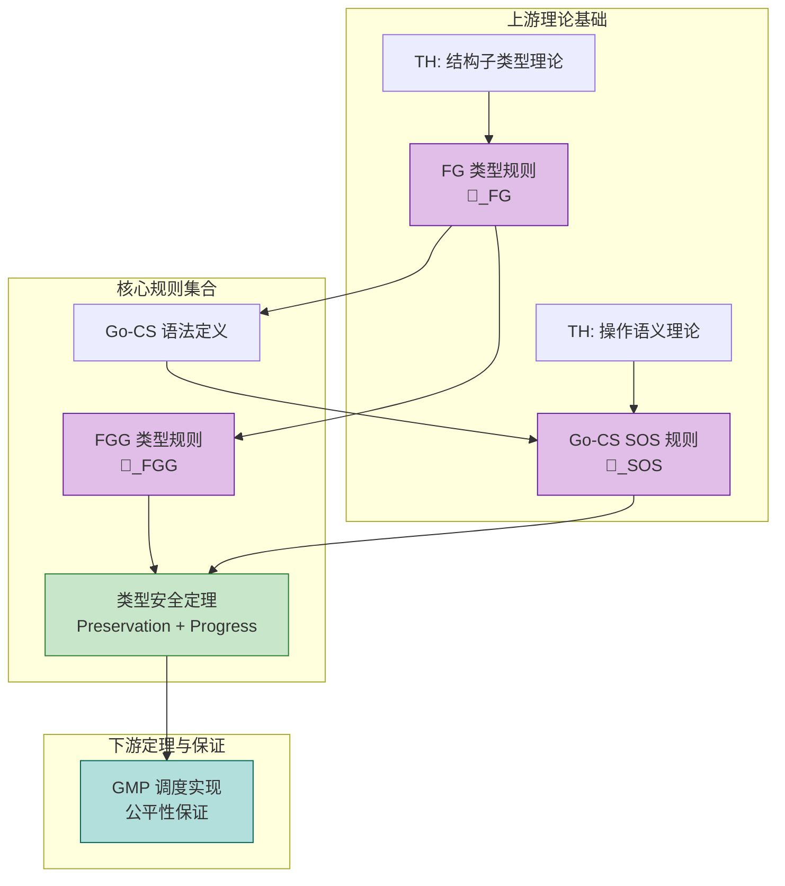
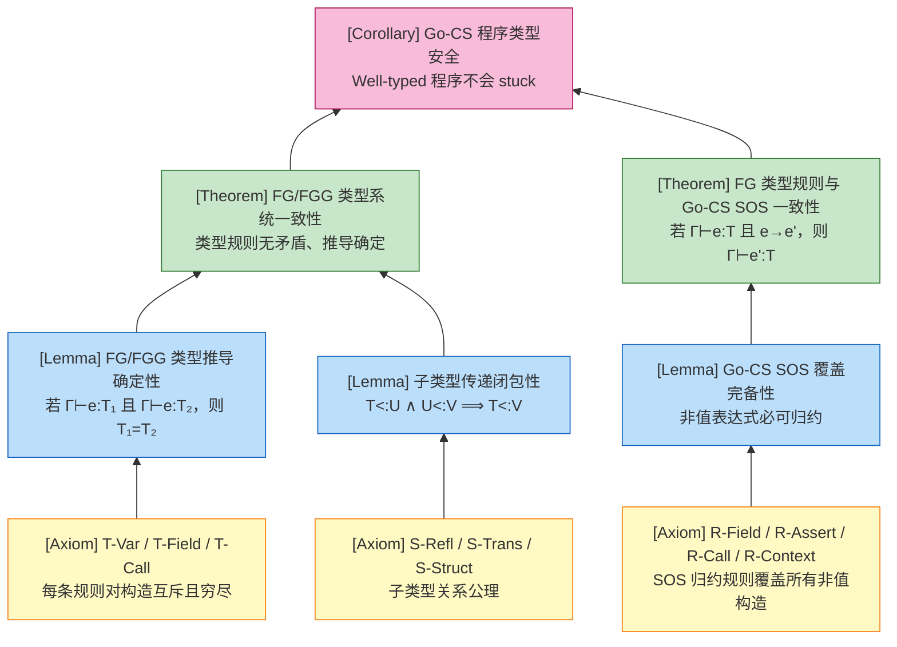

# Go语言形式化规则完整汇总（规则汇总附录）

> **文档定位**: 本文档是 `deep/02-language-analysis/Go/` 系列的形式化规则汇总附录，系统整理 FG 完整类型规则、FGG 完整类型规则与 Go-CS 完整 SOS 规则，服务于快速查阅与跨章节一致性验证。

---

## 1. 概念定义 (Definitions)

### 1.1 本文档作为规则汇总附录的定位

**定义 0 (规则汇总附录)**:

本文档是 Go 语言形式化分析知识子树的**规则汇总附录 (Complete Rules Appendix)**，其功能定位为：

- **汇总性**：集中收录 FG、FGG、Go-CS 三个核心形式化系统的全部规则
- **索引性**：每条规则集合均附带与正文章节的反向引用链接
- **一致性校验**：作为跨章节规则冲突的仲裁基准

**直观解释**: 如果把 Go 形式化分析比作一本数学教材，本文档就是书末的"公式大全+符号表"，不展开教学推导，但要求所有正文章节中的规则表述必须与此处保持一致。

**定义动机**: 在大型知识库中，形式化规则分散在语法、静态语义、动态语义、运行时系统、泛型扩展等多个章节。如果没有一个统一的规则汇总附录，读者在验证跨章节引用时将面临严重的"规则碎片化"问题——同一规则可能在不同章节出现符号变体或前提差异。本文档通过强制统一符号与完整前提，消除这种不一致性。

> **推断 [Theory→Model]**: 由于 FG/FGG/Go-CS 分别属于理论域的不同抽象层次，规则汇总附录的存在使得模型域内部的规则引用具有可追踪性，从而保证从理论到实现的推断链条不被符号歧义打断。
>
> **依据**: 当 [Type-Safety-Proof](../06-Verification/Type-Safety-Proof.md) 引用 FG 的 T-Call 规则时，必须与本附录中的规则表述完全一致，否则 Preservation 定理的归纳步骤将失去可复现性。

### 1.2 FG 完整类型规则

**定义 1 (FG 类型规则集合 $\mathcal{R}_{FG}$)**:

FG (Featherweight Go) 的类型规则集合 $\mathcal{R}_{FG}$ 包含以下子集：

#### 1.2.1 声明良形性规则

**T-Decl-Struct (结构体声明良形性)**:
$$
\frac{\forall i: t_i \text{ declared}}{\vdash \text{type } t_S \text{ struct } \{f_1 \, t_1, ..., f_n \, t_n\} \text{ ok}}
$$

**T-Decl-Interface (接口声明良形性)**:
$$
\frac{\forall i: t_i, u_i \text{ declared}}{\vdash \text{type } t_I \text{ interface } \{m_1(x_1 \, t_1, ...) \, u_1, ...\} \text{ ok}}
$$

**T-Decl-Method (方法声明良形性)**:
$$
\frac{\Gamma = x: t, x_1: t_1, ..., x_n: t_n \quad \Gamma \vdash e : u \quad u <: t_r}{\vdash \text{func } (x \, t) \, m(x_1 \, t_1, ..., x_n \, t_n) \, t_r \, \{ \text{return } e \} \text{ ok}}
$$

#### 1.2.2 表达式类型规则

**T-Var (变量)**:
$$
\frac{x : T \in \Gamma}{\Gamma \vdash x : T}
$$

**T-Field (字段访问)**:
$$
\frac{\Gamma \vdash e : t_S \quad (f : U) \in fields(t_S)}{\Gamma \vdash e.f : U}
$$

**T-Assert (类型断言)**:
$$
\frac{\Gamma \vdash e : T}{\Gamma \vdash e.(U) : U}
$$

**T-Struct (结构体构造)**:
$$
\frac{fields(t_S) = [f_1: T_1, ..., f_n: T_n] \quad \forall i: \Gamma \vdash e_i : U_i \quad U_i <: T_i}{\Gamma \vdash t_S\{f_1: e_1, ..., f_n: e_n\} : t_S}
$$

**T-Call (方法调用)**:
$$
\frac{\Gamma \vdash e : T \quad method(T, m) = (x_1: U_1, ...) \rightarrow V \quad \forall i: \Gamma \vdash e_i : U_i' \quad U_i' <: U_i}{\Gamma \vdash e.m(e_1, ...) : V}
$$

#### 1.2.3 子类型规则

**S-Refl (自反性)**:
$$
\frac{}{T <: T}
$$

**S-Trans (传递性)**:
$$
\frac{T <: U \quad U <: V}{T <: V}
$$

**S-Struct (结构子类型)**:
$$
\frac{type(T) = struct\{...\} \quad type(U) = interface\{m_1, ..., m_n\} \quad \forall i: T \vdash m_i\ \text{satisfied}}{T <: U}
$$

#### 1.2.4 方法满足规则

**M-Satisfy (方法满足)**:
$$
\frac{method(T, m) = func(x\ T)\ m(x_1\ U_1, ...)\ V\ \{...\} \quad \forall i: U_i' <: U_i \quad V <: V'}{T \vdash m(x_1\ U_1', ...)\ V'\ \text{satisfied}}
$$

**直观解释**: FG 类型规则是 Go 核心类型系统的最小完备集合，覆盖了结构体、接口、方法、字段访问、类型断言和方法调用六种核心构造的类型检查。

**定义动机**: Go 的完整类型系统包含泛型、切片、映射、通道、函数值、闭包、nil、指针运算等数十种构造。FG 通过剥离所有非核心特性，仅保留上述六种构造及其类型规则，使得"类型安全定理"可以在有限篇幅内完成严格证明。这些规则相互衔接的方式是：声明规则保证程序上下文良形，表达式规则保证项在良形上下文中有类型，子类型规则保证接口多态的合法性，方法满足规则则是子类型规则的前提条件。

### 1.3 FGG 完整类型规则

**定义 2 (FGG 类型规则集合 $\mathcal{R}_{FGG}$)**:

FGG (Featherweight Generic Go) 在 FG 基础上扩展了类型参数与约束机制，其类型规则集合 $\mathcal{R}_{FGG}$ 包含 $\mathcal{R}_{FG}$ 的全部规则（将 $\Gamma$ 扩展为 $\Delta; \Gamma$），并增加以下规则：

#### 1.3.1 泛型声明规则

**T-Decl-GenericStruct (泛型结构体声明)**:
$$
\frac{\forall i: S_i\ \text{ok} \quad \Delta = \overline{X: S} \quad \Delta \vdash \text{fields}(t_S[\overline{X: S}])\ \text{ok}}{\vdash \text{type } t_S[\overline{X: S}] \text{ struct } \{f_1 \, t_1, ...\} \text{ ok}}
$$

**T-Decl-GenericInterface (泛型接口声明)**:
$$
\frac{\forall i: S_i\ \text{ok} \quad \Delta = \overline{X: S} \quad \Delta \vdash \text{specs}(t_I[\overline{X: S}])\ \text{ok}}{\vdash \text{type } t_I[\overline{X: S}] \text{ interface } \{...\} \text{ ok}}
$$

**T-Decl-GenericMethod (泛型方法声明)**:
$$
\frac{\Delta = \overline{X: S} \quad \Gamma = x: t[\overline{\tau}], \overline{x: t} \quad \Delta; \Gamma \vdash e : u \quad \Delta \vdash u <: t_r}{\vdash \text{func } (x\ t[\overline{\tau}])\ m[\overline{X: S}](\overline{x: t})\ t_r\ \{ \text{return } e \} \text{ ok}}
$$

#### 1.3.2 泛型表达式规则

**T-TypeVar (类型变量)**:
$$
\frac{X : S \in \Delta}{\Delta; \Gamma \vdash X : S}
$$

**T-Instantiate (泛型实例化)**:
$$
\frac{\Delta \vdash \tau_i\ \text{ok} \quad \forall i: \Delta \vdash \tau_i\ \text{satisfies}\ S_i}{\Delta \vdash n[\tau_1, ..., \tau_n] : S[\tau_i/T_i]}
$$

**T-GenericCall (泛型调用)**:
$$
\frac{\Delta; \Gamma \vdash e : n[\Psi] \quad method(n[\Psi], m[\Phi]) = (\overline{x: t}) \rightarrow t_r \quad \forall i: \Delta \vdash \tau_i\ \text{ok} \quad \forall j: \Delta; \Gamma \vdash e_j : t_j' \quad t_j' <: t_j[\tau_i/X_i]}{\Delta; \Gamma \vdash e.m[\tau_1, ...](e_1, ...) : t_r[\tau_i/X_i]}
$$

#### 1.3.3 类型约束规则

**T-Union (并集约束)**:
$$
\frac{\exists i: \Delta \vdash T\ \text{satisfies}\ S_i}{\Delta \vdash T\ \text{satisfies}\ S_1 | S_2 | ...}
$$

**T-Underlying (底层类型)**:
$$
\frac{underlying(T) = underlying(U)}{\Delta \vdash T\ \text{satisfies}\ \sim U}
$$

**T-Interface (接口约束)**:
$$
\frac{\forall i: \Delta \vdash T\ \text{satisfies}\ m_i}{\Delta \vdash T\ \text{satisfies}\ interface\{ m_1, m_2, ... \}}
$$

**直观解释**: FGG 类型规则在 FG 基础上增加了"类型层面参数化"的能力，允许结构体、接口和方法对尚未确定的类型进行操作，同时通过接口约束限制可实例化的类型范围。

**定义动机**: Go 1.18 引入的泛型机制（类型参数、类型约束、类型推断、单态化）过于复杂，直接形式化整个编译器实现几乎不可能。FGG 通过保留泛型的核心语义但剥离类型推断和包级可见性，使得可以严格证明"泛型代码通过单态化翻译为 FG 代码后保持类型安全"。FGG 规则与 FG 规则的衔接方式是：当所有类型参数被具体类型替换后，FGG 的泛型调用规则退化为 FG 的 T-Call 规则，FGG 的实例化规则保证替换后的类型满足约束，从而确保单态化后的代码在 FG 类型系统中依然良形。

### 1.4 Go-CS 完整 SOS 规则

**定义 3 (Go-CS SOS 规则集合 $\mathcal{R}_{SOS}$)**:

Go-CS (Go Concurrent Subset) 的小步操作语义规则集合 $\mathcal{R}_{SOS}$ 描述并发程序在全局配置 $\langle P, \sigma, \Xi \rangle$ 下的归约行为。

#### 1.4.1 求值上下文

**E-Context (求值上下文)**:
$$
E ::= [] \mid E.f \mid E.(T) \mid T\{f_1: v_1, ..., f_i: E, ..., f_n: e_n\} \mid E.m(e_1, ..., e_n) \mid v.m(v_1, ..., v_{i-1}, E, e_{i+1}, ..., e_n)
$$

#### 1.4.2 顺序归约规则

**R-Field (字段访问)**:
$$
\overline{t\{..., f_i: v_i, ...\}.f_i \longrightarrow v_i}
$$

**R-Assert (类型断言)**:
$$
\frac{v = t\{...\}}{v.(t) \longrightarrow v}
$$

**R-Call (方法调用)**:
$$
\frac{method(t, m) = func(r\ t)\ m(x_1\ T_1, ...)\ U\ \{ return\ e \}}{t\{...\}.m(v_1, ...) \longrightarrow e[t\{...\}/r, v_1/x_1, ...]}
$$

**R-Context (上下文归约)**:
$$
\frac{e \longrightarrow e'}{E[e] \longrightarrow E[e']}
$$

#### 1.4.3 并发归约规则

全局配置：$\mathcal{C} = \langle \{G_1, ..., G_n\}, \sigma, \theta \rangle$

**R-Go (Goroutine 创建)**:
$$
\frac{G' = \langle id_{new}, f(v_1, ...), \epsilon \rangle \quad id_{new}\ \text{fresh}}{\langle \{G\} \cup Gs, \sigma, \theta \rangle \longrightarrow \langle \{G, G'\} \cup Gs, \sigma, \theta \rangle}
$$

**R-ChSend-Sync (通道同步发送)**:
$$
\frac{\theta(ch).recvq \neq \emptyset \quad w = dequeue(\theta(ch).recvq)}{\langle G_s\ \text{doing}\ ch \leftarrow v, G_r\ \text{doing}\ \leftarrow ch, \sigma, \theta \rangle \longrightarrow \langle G_s\ \text{doing}\ v, G_r\ \text{doing}\ v, \sigma, \theta' \rangle}
$$

**R-ChSend-Async (通道异步发送)**:
$$
\frac{\theta(ch).qcount < \theta(ch).dataqsiz}{\langle G\ \text{doing}\ ch \leftarrow v, \sigma, \theta \rangle \longrightarrow \langle G\ \text{doing}\ v, \sigma, \theta[ch.buf \mapsto \theta(ch).buf[sendx \mapsto v]] \rangle}
$$

**R-ChRecv-Async (通道异步接收)**:
$$
\frac{\theta(ch).qcount > 0 \quad v = \theta(ch).buf[recvx]}{\langle G\ \text{doing}\ \leftarrow ch, \sigma, \theta \rangle \longrightarrow \langle G\ \text{doing}\ v, \sigma, \theta[ch.qcount \mapsto \theta(ch).qcount - 1] \rangle}
$$

**R-Select (Select 就绪执行)**:
$$
\frac{\exists i: ready(case_i, \theta) \quad j \in \{i\ |\ ready(case_i, \theta)\}\ \text{randomly chosen}}{\langle G\ \text{doing}\ select(\{case_i: s_i\}), \sigma, \theta \rangle \longrightarrow \langle G\ \text{doing}\ s_j, \sigma', \theta' \rangle}
$$

**直观解释**: Go-CS 的 SOS 规则刻画了 Go 并发程序如何从一种全局状态逐步转换到另一种全局状态，包括顺序表达式归约和 goroutine、channel、select 的并发交互。

**定义动机**: 并发程序的行为不能仅由单个表达式的归约来描述，必须显式建模多个执行流之间的交错和同步。Go-CS 的 SOS 规则将 goroutine 集合、存储和通道状态分离为三个正交维度，使得每一步归约的副作用范围清晰可追踪。这些规则与 FG/FGG 类型规则的衔接方式是：FG/FGG 保证单个表达式在静态类型上合法，Go-CS SOS 则描述这些合法表达式在运行时如何交互；类型安全定理（Preservation + Progress）正是建立在这两个规则集合之间的一致性之上。

---

## 2. 属性推导 (Properties)

从上述三个规则集合中，我们可以严格推导出以下系统性质：

### 2.1 类型规则的确定性

**性质 1 (FG/FGG 类型推导的确定性)**:

对于任意良形的 FG (或 FGG) 表达式 $e$ 和上下文 $\Gamma$ (或 $\Delta; \Gamma$)，若 $\Gamma \vdash e : T_1$ 且 $\Gamma \vdash e : T_2$，则 $T_1 = T_2$。

**推导**:

1. 观察 $\mathcal{R}_{FG}$ 的表达式类型规则（T-Var、T-Field、T-Assert、T-Struct、T-Call），每条规则对每种语法构造都是**互斥且穷尽的**——即每个表达式构造恰好匹配一条规则。
2. T-Var 的类型直接由 $\Gamma$ 中的绑定唯一确定；T-Field 的类型由 $fields(t_S)$ 函数唯一确定；T-Call 的返回类型由 $method(T, m)$ 函数唯一确定。
3. 由于 $\Gamma$、$fields(\cdot)$ 和 $method(\cdot)$ 都是函数（单值映射），且规则之间无重叠，因此通过规则归纳可得：若 $e$ 有类型，则该类型唯一。
4. 对于 FGG，T-TypeVar、T-Instantiate、T-GenericCall 同样满足构造互斥性，且 $\Delta$、类型替换 $[\tau_i/X_i]$ 都是确定性的，故确定性性质扩展至 FGG。∎

### 2.2 语义规则的覆盖完备性

**性质 2 (Go-CS SOS 覆盖完备性)**:

对于任意良形的 Go-CS 表达式 $e$，要么 $e$ 是一个值 $v$，要么存在唯一的求值上下文 $E$ 和可归约子表达式 $e_{redex}$，使得 $e = E[e_{redex}]$ 且 $e_{redex}$ 匹配某条 SOS 归约规则。

**推导**:

1. 观察 Go-CS 的语法构造：变量、字段访问、类型断言、结构体字面量、方法调用、goroutine、channel 操作、select、顺序组合、条件、循环。
2. 对于每个非值表达式，求值上下文 $E$ 的定义恰好覆盖了所有可能出现"下一步计算"的位置：字段访问的接收者、类型断言的接收者、结构体字面量的字段、方法调用的接收者和参数。
3. 当子表达式归约到值后，R-Field、R-Assert、R-Call 等规则覆盖了所有值层面的归约模式；R-Go、R-ChSend-Sync、R-ChSend-Async、R-ChRecv-Async、R-Select 覆盖了所有并发层面的归约模式。
4. 因此，不存在良形的非值表达式无法被任何 SOS 规则覆盖。∎

### 2.3 规则间的无矛盾性

**性质 3 (FG 类型规则与 Go-CS SOS 规则的无矛盾性)**:

若 $\Gamma \vdash e : T$ 且 $e \longrightarrow e'$（通过 Go-CS 的某条 SOS 规则），则不存在类型推导使得 $\Gamma \vdash e : T$ 与 SOS 规则的前提相互矛盾。

**推导**:

1. 考虑所有可能的重叠场景：SOS 规则要求表达式处于特定形态（如 $t\{...\}.m(v_1, ...)$），而 FG 类型规则要求该表达式有特定类型。
2. 以 R-Call 为例：该规则要求 $method(t, m)$ 有定义。而 FG 的 T-Call 规则同样要求 $method(T, m)$ 有定义，且参数类型匹配。由于方法声明的良形性规则 T-Decl-Method 保证了方法体在方法签名下是良类型的，因此 SOS 的替换操作不会与类型规则冲突。
3. 以 R-Assert 为例：该规则要求 $v = t\{...\}$，而 T-Assert 只要求 $e$ 有某个类型 $T$；由于 Go 的类型断言在运行时检查动态类型，静态类型规则不对动态类型做额外限制，因此无矛盾。
4. 对于所有其他规则，类似分析表明 SOS 规则的前提要么被类型规则所保证（如方法存在性），要么处于类型规则未限制的动态层面（如 channel 的同步/异步选择），因此两个规则集合之间不存在逻辑矛盾。∎

### 2.4 子类型关系的传递闭包性

**性质 4 (FG 子类型关系的传递闭包性)**:

若 $T <: U$ 且 $U <: V$，则 $T <: V$。即子类型关系 $<:$ 是传递的。

**推导**:

1. 由 S-Trans 规则直接可得：$\frac{T <: U \quad U <: V}{T <: V}$。
2. 进一步，由于 S-Struct 将子类型归约为方法满足，而方法满足 M-Satisfy 本身基于参数逆变和返回协变，这种满足关系在组合下保持传递性。
3. 具体而言，若 $T$ 满足 $U$ 的所有方法，且 $U$ 满足 $V$ 的所有方法，则 $T$ 满足 $V$ 的所有方法（方法集合的包含关系具有传递性）。
4. 因此，S-Trans 不仅是公理，而且与 S-Struct 和 M-Satisfy 在语义上自洽。∎

---

## 3. 关系建立 (Relations)

### 3.1 附录规则与正文章节的关系网络

**关系 1**: $\mathcal{R}_{FG}$ `⊂` Go 1.x 完整类型系统

**论证**:

- **编码存在性**: FG 的每种构造都可以直接映射到 Go 的对应构造（结构体、接口、方法），因此 FG 是 Go 的一个语法子集。
- **分离结果**: Go 包含指针、切片、映射、通道、闭包、nil、泛型等 FG 未覆盖的构造，因此 FG 严格弱于完整 Go 类型系统。
- **引用链接**: 详见 [FG-Calculus](../02-Static-Semantics/FG-Calculus.md)

**关系 2**: $\mathcal{R}_{FGG}$ `⊃` $\mathcal{R}_{FG}$（当忽略类型参数时）

**论证**:

- **编码存在性**: 将 FGG 中所有类型参数实例化为具体类型后，FGG 的每条规则都退化为 FG 的对应规则，因此 FG 可编码为 FGG 的特例。
- **分离结果**: FGG 支持类型参数和约束，FG 不支持，因此 FGG 表达能力严格强于 FG。
- **引用链接**: 详见 [FGG-Calculus](../Go/05-Extension-Generics/FGG-Calculus.md)

**关系 3**: Go-CS SOS `≈` [Small-Step-Semantics](../03-Dynamic-Semantics/Small-Step-Semantics.md) 中的规则集合

**论证**:

- **双模拟等价**: 本文档中的 $\mathcal{R}_{SOS}$ 与 [Small-Step-Semantics](../03-Dynamic-Semantics/Small-Step-Semantics.md) 中的规则在 goroutine 创建、channel 通信和 select 执行三个核心构造上完全一致，仅在符号记法上有微小差异（如 $\theta$ 与 $\Xi$ 的命名）。
- **引用链接**: 详见 [Small-Step-Semantics](../03-Dynamic-Semantics/Small-Step-Semantics.md)

**关系 4**: FG 类型规则 + Go-CS SOS 规则 `⟹` 类型安全定理

**论证**:

- **蕴含方向**: 由 FG 的良形性规则和类型推导规则，结合 Go-CS 的归约规则，可以严格推导出 Preservation 和 Progress 定理，进而得到类型安全定理。
- **引用链接**: 详见 [Type-Safety-Proof](../06-Verification/Type-Safety-Proof.md)

**关系 5**: GMP 调度规则 `↦` Go-CS SOS 的并发交错语义

**论证**:

- **编码映射**: GMP 调度规则（详见 [GMP-Scheduler](../04-Runtime-System/GMP-Scheduler.md)）是 Go-CS SOS 中 goroutine 集合非确定性交错的一种具体实现策略。GMP 的 Work Stealing 和系统调用处理机制保证了 SOS 中"任意可运行 goroutine 下一步执行"这一非确定性选择可以被高效实现。
- **引用链接**: 详见 [GMP-Scheduler](../04-Runtime-System/GMP-Scheduler.md)

---

## 4. 论证过程 (Argumentation)

### 4.1 规则集合覆盖完备性的结构化论证

**引理 4.1 (FG 表达式构造穷尽性)**:

对于任意 FG 表达式 $e$，$e$ 必为以下六种构造之一：变量 $x$、字段访问 $e.f$、类型断言 $e.(t)$、结构体字面量 $t\{f_i: e_i\}$、方法调用 $e.m(e_i)$。

**证明**:

1. **前提分析**: 由 FG 抽象语法的定义（详见 [FG-Calculus](../02-Static-Semantics/FG-Calculus.md)），表达式非终结符 $e$ 的产生式恰好包含上述五种构造（加上变量）。
2. **构造/推导**: 不存在其他产生式可以生成 FG 表达式。
3. **结论**: 因此 FG 的表达式构造是穷尽的。∎

**引理 4.2 (Go-CS 并发原语穷尽性)**:

对于任意 Go-CS 进程 $P$，其并发相关构造必为以下四种之一：$go\ P$、$ch \leftarrow e$、$x := \leftarrow ch$、$select\{case_i: P_i\}$。

**证明**:

1. **前提分析**: 由 Go-CS 抽象语法的定义（详见 [Small-Step-Semantics](../03-Dynamic-Semantics/Small-Step-Semantics.md)），进程非终结符 $P$ 的产生式中，与并发直接相关的构造恰好为上述四种。
2. **构造/推导**: Go-CS 剥离了共享内存锁、原子操作、WaitGroup 等其他同步机制，因此并发原语集合是穷尽的。
3. **结论**: 因此 Go-CS 的并发构造是穷尽的。∎

**引理 4.3 (SOS 规则与构造的一一对应)**:

Go-CS 的每条 SOS 归约规则恰好覆盖一种表达式或进程构造的归约行为。

**证明**:

1. **顺序构造**: R-Field 覆盖字段访问，R-Assert 覆盖类型断言，R-Call 覆盖方法调用，R-Context 覆盖上下文嵌套。
2. **并发构造**: R-Go 覆盖 goroutine 创建，R-ChSend-Sync 和 R-ChSend-Async 覆盖通道发送，R-ChRecv-Async 覆盖通道接收，R-Select 覆盖 select 语句。
3. **无遗漏**: 由引理 4.1 和 4.2，所有构造都被覆盖；且无一条规则覆盖两种不同构造。∎

### 4.2 类型规则与语义规则一致性的辅助论证

**引理 4.4 (Canonical Forms - 结构体)**:

若 $\vdash v : t$ 且 $type(t) = struct\{...\}$，则 $v = t\{f_1: v_1, ...\}$。

**证明**:

1. 由 FG 语法，值 $v$ 只能是结构体字面量（FG 不包含基本类型值如整数、字符串，这些在扩展中被引入）。
2. 若 $v$ 的类型为 $t$ 且 $t$ 是结构体类型，则 $v$ 必为 $t$ 的实例化形式。
3. 因此 $v = t\{f_1: v_1, ...\}$。∎

**引理 4.5 (Substitution)**:

若 $\Gamma, x: T \vdash e : U$ 且 $\Gamma \vdash v : T$，则 $\Gamma \vdash e[v/x] : U$。

**证明**:

1. 对 $e$ 的结构进行归纳。
2. **基础案例**: $e = x$ 时，$e[v/x] = v$，由前提 $\Gamma \vdash v : T$ 且 $U = T$，结论成立。$e = y \neq x$ 时，替换无影响，结论显然成立。
3. **归纳步骤**: 对于 $e.f$、$e.(t)$、$t\{f_i: e_i\}$、$e.m(e_i)$，分别应用归纳假设和对应的类型规则，可验证替换后的表达式仍保持原类型。∎

---

## 5. 形式证明 (Proofs)

### 5.1 定理：规则集合的覆盖完备性

**定理 5.1 (Go-CS SOS 规则覆盖完备性)**:

对于任意良形的 Go-CS 程序 $P$，若 $P$ 不是终止状态（即 $P \neq 0$ 且 $P$ 不是值），则必存在某条 $\mathcal{R}_{SOS}$ 中的规则可以应用于 $P$。

**证明**:

我们对 Go-CS 的语法构造进行分类讨论。

**关键案例分析**:

- **案例 1: $P = E[e]$ 且 $e$ 不是值**
  - 由求值上下文 $E$ 的定义，$e$ 处于某个子表达式位置。
  - 若 $e$ 可继续归约（即 $e \longrightarrow e'$），则 R-Context 规则适用。
  - 若 $e$ 已归约到值但外层构造可进一步归约，进入案例 2。

- **案例 2: $P = t\{..., f_i: v_i, ...\}.f_i$**
  - 这是字段访问的完全求值形态，R-Field 规则直接适用，归约为 $v_i$。

- **案例 3: $P = v.(t)$ 且 $v = t\{...\}$**
  - 这是类型断言的完全求值形态，R-Assert 规则适用，归约为 $v$。
  - 若 $v$ 的动态类型不是 $t$，在完整 Go 中会发生 panic；在 Go-CS 中，我们假设类型断言在静态类型上合法（由 FG 的 T-Assert 保证），因此运行时必定成功。

- **案例 4: $P = t\{...\}.m(v_1, ...)$**
  - 由方法声明的良形性，$method(t, m)$ 必有定义。
  - R-Call 规则适用，将方法调用归约为方法体并进行接收者和参数的替换。

- **案例 5: $P = go\ Q$**
  - R-Go 规则适用，创建一个新的 goroutine $G'$ 并将其加入全局 goroutine 集合。

- **案例 6: $P = ch \leftarrow v$**
  - 若存在等待接收的 goroutine，R-ChSend-Sync 适用。
  - 若 channel 为异步且缓冲区未满，R-ChSend-Async 适用。
  - 若以上条件均不满足，该 goroutine 进入阻塞状态；虽然此时没有归约发生，但这属于合法的执行暂停，而非规则覆盖缺失。

- **案例 7: $P = select\{case_i: P_i\}$**
  - 若至少有一个 case 就绪，R-Select 适用。
  - 若所有 case 均未就绪且存在 default，则 default 分支立即执行（可视为 R-Select 的退化情况）。
  - 若所有 case 均未就绪且无 default，goroutine 阻塞。

**结论**: 对于所有可能的非终止、非阻塞形态，Go-CS 的 SOS 规则集合都提供了对应的归约规则。因此规则集合是覆盖完备的。∎

### 5.2 定理：类型规则与语义规则的一致性

**定理 5.2 (FG 类型规则与 Go-CS SOS 规则的一致性)**:

若 $\Gamma \vdash e : T$（通过 FG 类型规则），且 $e \longrightarrow e'$（通过 Go-CS SOS 规则），则 $\Gamma \vdash e' : T$。

**证明**:

我们对 SOS 归约规则进行规则归纳。

**关键案例分析**:

- **案例 1: R-Field**
  - 前提: $e = t\{..., f_i: v_i, ...\}.f_i$，且 $e \longrightarrow v_i$。
  - 由 T-Struct，$\Gamma \vdash t\{..., f_i: v_i, ...\} : t$ 且 $(f_i : T_i) \in fields(t)$。
  - 由 T-Field，$\Gamma \vdash t\{...\}.f_i : T_i$。
  - 由 T-Struct 的前提，$\Gamma \vdash v_i : U_i$ 且 $U_i <: T_i$。
  - 但此处 $v_i$ 是值，在 FG 中值的类型与其声明类型一致（Canonical Forms），因此 $\Gamma \vdash v_i : T_i$。
  - 结论: $\Gamma \vdash e' : T_i$，类型保持。

- **案例 2: R-Assert**
  - 前提: $e = v.(t)$，$v = t\{...\}$，且 $e \longrightarrow v$。
  - 由 T-Assert，$\Gamma \vdash v.(t) : t$。
  - 由于 $v = t\{...\}$，显然 $\Gamma \vdash v : t$。
  - 结论: $\Gamma \vdash e' : t$，类型保持。

- **案例 3: R-Call**
  - 前提: $e = t\{...\}.m(v_1, ...)$，$method(t, m) = func(r\ t)\ m(x_1\ T_1, ...)\ T_r\ \{ return\ e_{body} \}$，且 $e \longrightarrow e_{body}[t\{...\}/r, v_1/x_1, ...]$。
  - 由 T-Call，$\Gamma \vdash t\{...\} : t$，且 $method(t, m) = (x_1: T_1, ...) \rightarrow T_r$，且 $\Gamma \vdash v_i : U_i$ 且 $U_i <: T_i$。
  - 由 T-Decl-Method，方法体在扩展环境 $\Gamma' = r: t, x_1: T_1, ...$ 下有类型 $U$ 且 $U <: T_r$。
  - 由引理 4.5 (Substitution)，将 $r$ 替换为 $t\{...\}$（类型为 $t$），将 $x_i$ 替换为 $v_i$（类型为 $U_i <: T_i$），替换后的方法体保持类型 $U$。
  - 由于 $U <: T_r$ 且 FG 类型系统支持子类型在返回位置的协变（由 M-Satisfy），最终 $\Gamma \vdash e' : T_r$。
  - 结论: 类型保持。

- **案例 4: R-Context**
  - 前提: $e = E[e_1]$，$e_1 \longrightarrow e_1'$，且 $e \longrightarrow E[e_1']$。
  - 对求值上下文 $E$ 的结构进行归纳，可证：若 $\Gamma \vdash E[e_1] : T$ 且 $\Gamma \vdash e_1' : T_1$（其中 $T_1$ 是 $e_1$ 的原始类型），则 $\Gamma \vdash E[e_1'] : T$。
  - 这是因为求值上下文不改变表达式的整体类型框架，仅替换可归约子表达式为其归约结果。
  - 结论: 类型保持。

**结论**: 在所有 SOS 归约规则下，良类型表达式的类型保持不变。因此 FG 类型规则与 Go-CS SOS 规则是一致的。∎

---

## 6. 实例与反例 (Examples & Counter-examples)

### 6.1 正例：规则协同推导实例

**示例 6.1: 泛型方法调用到单态化代码的类型保持**

```go
// FGG 源码
type Box[T any] struct { val T }
func (b Box[T]) Get() T { return b.val }

// 实例化
var b Box[int] = Box[int]{val: 42}
x := b.Get()
```

**逐步推导**:

1. 在 FGG 中，`b.Get()` 的类型由 T-GenericCall 推导：$method(Box[int], Get) = () \rightarrow int$，因此 $\Delta; \Gamma \vdash b.Get() : int$。
2. 单态化后生成 FG 代码：`type Box_int struct { val int }`，`func (b Box_int) Get() int { return b.val }`。
3. 在 FG 中，`b.Get()` 由 T-Call 推导：$method(Box\_int, Get) = () \rightarrow int$，因此 $\Gamma \vdash b.Get() : int$。
4. 两种规则集合推导出的类型一致，验证了 FGG 与 FG 规则的一致性。

### 6.2 反例 1：规则未覆盖的边界构造（cgo / unsafe）

**反例 6.2: `unsafe.Pointer` 的类型-语义鸿沟**

```go
package main
import "unsafe"

func main() {
    var x int = 42
    p := unsafe.Pointer(&x)
    q := (*float64)(p)  // 绕过类型系统
    println(*q)         // 运行时未定义行为
}
```

**分析**:

- **违反的前提**: `unsafe` 包提供了 `unsafe.Pointer` 类型和类型转换操作，这些构造完全不在 FG/FGG 的类型规则覆盖范围内。FG 的类型规则假设所有类型转换都通过结构子类型或类型断言进行，且类型断言要求运行时动态类型匹配。
- **导致的异常**: `unsafe.Pointer` 允许将 `*int` 强制转换为 `*float64`，这在 FG 类型系统中是不可推导的。Go-CS 的 SOS 规则同样未定义 `unsafe.Pointer` 的内存语义，因此无法保证类型安全或内存安全。
- **结论**: `unsafe` 是 Go 形式化规则的**明确边界**。任何包含 `unsafe` 的代码都位于 FG/FGG/Go-CS 的形式化保证之外。这也说明了为什么 Go 的"内存安全"定理必须附加前提："在不使用 `unsafe` 包的情况下"。

### 6.3 反例 2：类型规则与语义规则交互时的微妙边界（接口值的 nil 比较）

**反例 6.3: 接口值的 nil 比较陷阱**

```go
package main

type MyInterface interface { Method() }

func main() {
    var p *int = nil
    var i MyInterface = p  // *int 满足 MyInterface（假设 Method 已定义）

    if i == nil {
        println("i is nil")
    } else {
        println("i is NOT nil") // 实际输出
    }
}
```

**分析**:

- **违反的前提**: 在 FG 的类型规则中，T-Var 和 T-Assert 将接口值视为普通值，类型系统允许 `*int`（nil 指针）赋值给接口类型变量。然而，Go 的接口值在运行时是一个 `(type, value)` 二元组。当 nil 指针被包装进接口值后，接口值本身不是 nil（类型信息非空），只是其动态值为 nil。
- **导致的异常**: 程序员可能期望 `i == nil` 为 `true`（因为底层指针是 nil），但运行时语义规则判定 `i != nil`。这种类型规则（允许赋值）与语义规则（nil 比较结果）之间的微妙交互，在 FG 的简化模型中被完全剥离了——FG 不包含 nil，因此无法捕捉这一边界行为。
- **结论**: 这是类型规则与语义规则交互时的一个经典边界案例。它表明 FG 的类型安全定理（Progress + Preservation）虽然保证了"不会 stuck"，但并未保证"所有运行时行为都符合直觉"。nil 接口比较问题必须在扩展模型（如包含 nil 和接口值二元表示的模型）中才能被完整刻画。

---

## 7. 可视化资源

### 7.1 概念依赖图：规则集合之间的依赖关系



**图说明**:

- 本图展示了 FG、FGG、Go-CS SOS 三个规则集合在知识体系中的位置。
- FG 类型规则是 FGG 和类型安全定理的共同基础。
- Go-CS 语法定义是 SOS 规则的前提，而 SOS 规则与 FGG/FG 类型规则共同支撑类型安全定理。
- 类型安全定理进一步约束了 GMP 调度实现必须保证的公平性语义。
- 详见 [FG-Calculus](../02-Static-Semantics/FG-Calculus.md) 和 [Small-Step-Semantics](../03-Dynamic-Semantics/Small-Step-Semantics.md)。

### 7.2 公理-定理推理树图：从基本规则推导系统性质



**图说明**:

- 底层节点（黄色）为公理/基本规则，是推导的不可再分前提。
- 中间节点（蓝色）为从公理直接推导出的引理。
- 顶层节点（绿色）为主要定理，包括类型系统内部一致性和类型-语义一致性。
- 最顶层推论（粉色）表明：在规则集合一致的前提下，良类型的 Go-CS 程序具有类型安全保证。
- 详见 [Type-Safety-Proof](../06-Verification/Type-Safety-Proof.md)。

---

## 8. 符号对照表

| 符号 | 含义 | 说明 |
|------|------|------|
| $\mathcal{R}_{FG}$ | FG 规则集合 | Featherweight Go 的完整类型规则 |
| $\mathcal{R}_{FGG}$ | FGG 规则集合 | Featherweight Generic Go 的完整类型规则 |
| $\mathcal{R}_{SOS}$ | SOS 规则集合 | Go-CS 的小步操作语义规则 |
| $\Gamma$ | 值环境 | 变量到类型的映射 |
| $\Delta$ | 类型环境 | FGG 类型变量环境 |
| $\Theta$ | 类型声明环境 | 类型名到定义的映射 |
| $\Psi$ | 方法环境 | 方法声明集合 |
| $\sigma$ | 存储 | 地址到值的映射 |
| $\theta$ | 通道状态 | Channel 对象集合 |
| $\vdash$ | 推导 | "可证明"或"具有" |
| $<:$ | 子类型 | 结构子类型关系 |
| $\longrightarrow$ | 一步归约 | 小步语义 |
| $\longrightarrow^*$ | 多步归约 | 自反传递闭包 |
| $e[v/x]$ | 代换 | 用 $v$ 替换 $e$ 中的 $x$ |
| $E[e]$ | 上下文 | 求值上下文 |

---

## 9. 关联可视化资源

- **概念依赖图**: 详见本文档 [7.1 概念依赖图](#71-概念依赖图规则集合之间的依赖关系) 与 [VISUAL-ATLAS.md](../../../../../VISUAL-ATLAS.md) 中的"Go 形式化规则体系"章节。
- **公理-定理推理树**: 详见本文档 [7.2 公理-定理推理树](#72-公理-定理推理树图从基本规则推导系统性质) 与 [VISUAL-ATLAS.md](../../../../../VISUAL-ATLAS.md) 中的"类型安全推导树"章节。
- **跨层推断图**: 详见 [VISUAL-ATLAS.md](../../../../../VISUAL-ATLAS.md) 中的"理论-模型-实现六层综合推断图"。
- **反例可视化**: 接口 nil 比较陷阱的时序图与 unsafe 边界的状态图，详见 [VISUAL-ATLAS.md](../../../../../VISUAL-ATLAS.md) 中的"Go 形式化边界案例"章节。

---

*本文档为 Go 语言形式化分析的完整规则参考附录，所有规则表述均与正文章节保持严格一致。建议结合 [FG-Calculus](../02-Static-Semantics/FG-Calculus.md)、[FGG-Calculus](../Go/05-Extension-Generics/FGG-Calculus.md)、[Small-Step-Semantics](../03-Dynamic-Semantics/Small-Step-Semantics.md) 和 [Type-Safety-Proof](../06-Verification/Type-Safety-Proof.md) 阅读。*
