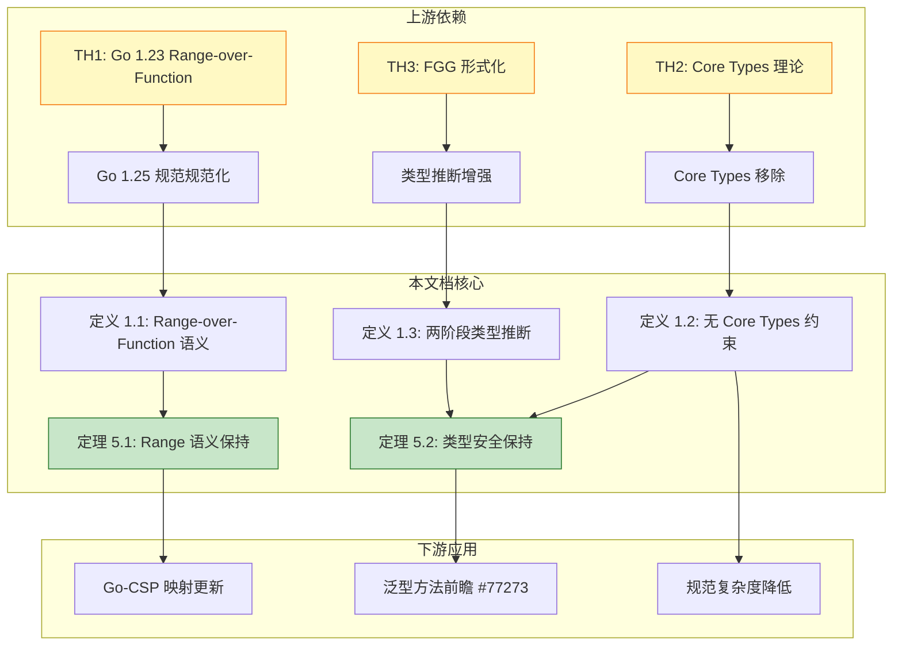
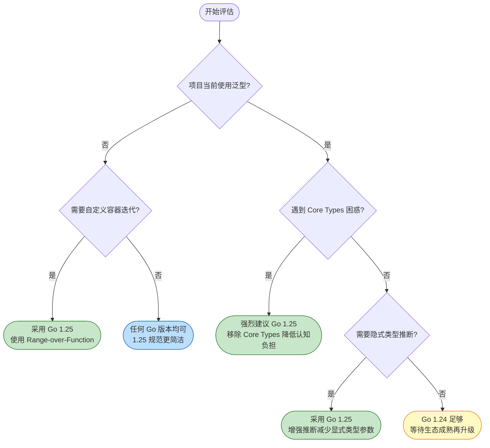
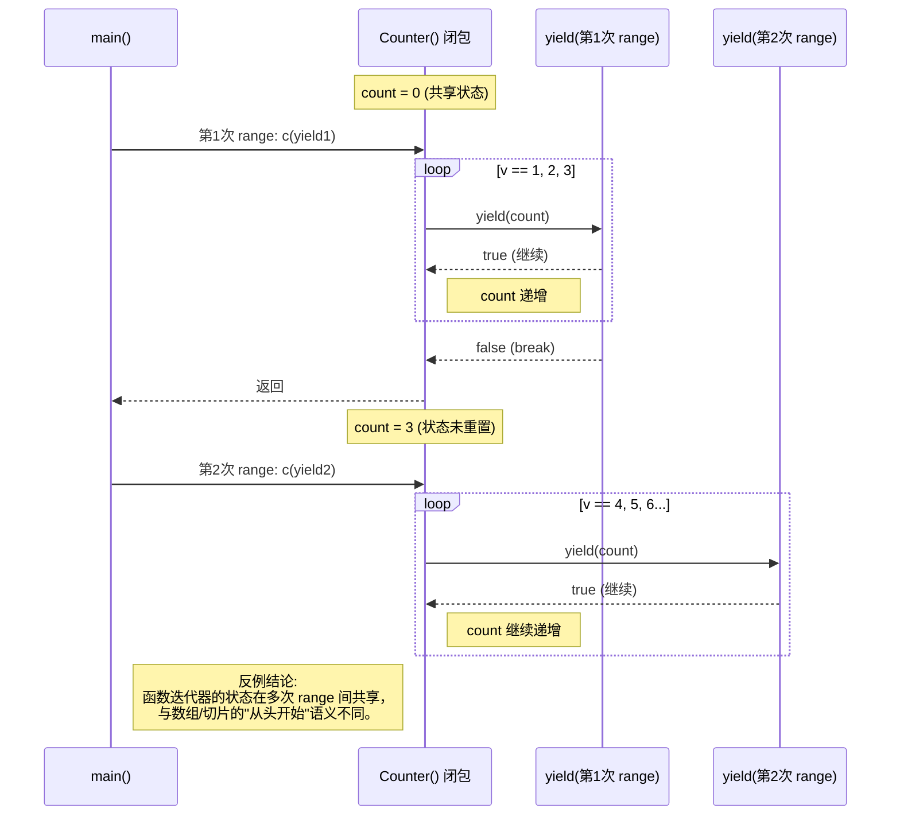

# Go 1.25 规范变更形式化分析

> **版本**: 2026.03 | **Go 版本**: 1.25 (2025年8月) | **形式化等级**: 完整类型规则 + 操作语义

---

## 0. 概念依赖图



**图说明**:

- 本图展示了 Go 1.25 规范变更在知识体系中的位置。
- 上游依赖包括 Go 1.23 引入的 Range-over-Function、Core Types 理论和 FGG 形式化。
- 本文档核心围绕三个形式化定义及其对应的主要定理展开。
- 下游应用涉及 Go-CSP 映射更新、泛型方法前瞻和规范复杂度降低。

---

## 1. 概念定义 (Definitions)

### 定义 1.1 (Range-over-Function 语义)

Go 1.25 对 `range` 语句的规范进行了精化，明确支持函数迭代器（function iterators）作为 `range` 表达式的合法操作数。其语法和语义定义如下：

**语法 (BNF)**:

```
<range_stmt>  ::= "for" <range_clause> <block>
<range_clause>::= <ident_list> ":=" "range" <expr>
                | <ident_list> "=" "range" <expr>

<expr>        ::= ... | <func_literal> | <func_call>
```

**操作语义 (SOS)**:

当 `range` 的操作数为函数 `f` 时，其语义等价于调用 `f(yield)`，其中 `yield` 是由编译器生成的回调函数：

$$
\frac{\Gamma \vdash e : \text{func}(\text{func}(T) \text{bool}) \quad \Gamma \vdash x_i : T_i}{\langle \text{for } x_1, x_2 := \text{range } e, \sigma \rangle \longrightarrow \langle e(\text{yield}); \sigma' \rangle}
$$

其中 `yield` 的签名取决于 range 变量的数量：

- 单变量：`func(T) bool`
- 双变量：`func(K, V) bool`

**直观解释**：`for v := range f` 不是直接迭代某个集合，而是将 `f` 视为一个"生产者"，由 `f` 主动调用 `yield(v)` 来产生值；当 `yield` 返回 `false` 时，`f` 应停止生产。

**定义动机**：

如果不将函数迭代器纳入 `range` 的规范核心，用户自定义容器就无法与语言内置的 `for-range` 语法无缝集成。该定义将迭代逻辑从"拉取模式"（消费者驱动）扩展为"推送模式"（生产者驱动），使得任意复杂的数据结构（如 B-tree、流式数据源）都能以统一语法进行遍历，同时保持 `for-range` 的语法一致性。

---

### 定义 1.2 (无 Core Types 的类型约束)

Go 1.25 移除了 "Core Types" 概念，将内置操作（`close`、`range` 等）的适用条件直接表达为对类型参数的类型集约束。

**形式化定义**：

设类型参数 `P` 的类型集为 $\mathcal{T}(P)$，则操作 `op` 对 `P` 的约束检查 $\text{Check}(op, P)$ 定义为：

$$
\text{Check}(\text{close}, P) \triangleq \forall t \in \mathcal{T}(P). \text{channel}(t) \land \neg\text{recvOnly}(t)
$$

$$
\text{Check}(\text{range}, P) \triangleq \forall t \in \mathcal{T}(P). \text{iterable}(t)
$$

其中 $\text{iterable}(t) \triangleq \text{channel}(t) \lor \text{array}(t) \lor \text{slice}(t) \lor \text{map}(t) \lor \text{string}(t) \lor \text{funcIter}(t)$。

**类型规则 (close)**:

$$
\frac{\Gamma \vdash ch : C \quad \forall t \in C. \text{channel}(t) \land \text{elem}(t) = E \land \neg\text{recvOnly}(t)}{\Gamma \vdash \text{close}(ch) : \text{ok}}
$$

**类型规则 (range)**:

$$
\frac{\Gamma \vdash x : T \quad \forall t \in T. \text{iterable}(t)}{\Gamma \vdash \text{for } v := \text{range } x : \text{ok}}
$$

**直观解释**：以前要先算出一个"核心类型"才能判断操作是否合法；现在直接检查"这个类型集里的所有类型是否都支持该操作"。

**定义动机**：

Core Types 要求读者先理解类型集、底层类型等泛型概念，才能理解非泛型代码中 `close(ch)` 或 `for range x` 的规则。这造成了概念上的循环依赖——学习基础语法需要先掌握高级特性。移除 Core Types 后，每个内置操作的约束条件被显式化、局部化，非泛型代码的规则恢复为 Go 1.18 之前的直观形式，而泛型代码的规则以独立的约束段落呈现，降低了规范的理解门槛。

---

### 定义 1.3 (增强类型推断 — 两阶段算法)

Go 1.25 增强了类型推断算法，使其能够处理从约束推断类型参数的场景，并改进了常量默认类型的推断逻辑。

**形式化定义**：

类型方程 **E = (lhs, rhs, kind)**：

- **lhs**: 左侧类型（可能含类型参数）
- **rhs**: 右侧类型
- **kind ∈ {≡_A, ≡_C}**: 方程类型（赋值等价或约束满足）

**算法 1.3.1** (类型推断两阶段):

```
function TypeInference(equations, boundParams):
    // 阶段1：类型统一
    map ← {}  // 类型参数 → 类型
    for eq in equations:
        if not Unify(eq.lhs, eq.rhs, map):
            return FAIL

    // 阶段2：约束驱动的类型参数推断
    for (P, C) in constraintParams:
        if P not in map:
            candidate ← InferFromConstraint(C, equations)
            if candidate ≠ ⊥:
                map[P] ← candidate

    // 阶段3：常量默认类型
    for (c, P) in constantPairs:
        if P not in map:
            map[P] ← DefaultType(c)

    // 阶段4：循环引用检测
    if HasCycle(map):
        return FAIL

    return map
```

**类型统一规则**：

$$
\frac{P \not\in \text{dom}(\sigma)}{\sigma \vdash P \equiv t \Rightarrow \sigma[P \mapsto t]}
\quad \text{(精确统一)}
$$

$$
\frac{\sigma \vdash T_1 \equiv U_1 \Rightarrow \sigma_1 \quad \sigma_1 \vdash T_2[\sigma_1] \equiv U_2[\sigma_1] \Rightarrow \sigma_2}{\sigma \vdash []T_1 \equiv []U_2 \Rightarrow \sigma_2}
\quad \text{(复合类型统一)}
$$

**直观解释**：编译器现在不仅能从函数参数推断类型，还能从类型约束（如 `~[]E`）中"反推"出缺失的类型参数。

**定义动机**：

在 Go 1.24 及之前，许多合法的泛型程序由于类型推断能力不足，需要显式写出类型参数（如 `dedup[Slice, int](s)`），这严重影响了泛型的可用性和代码可读性。增强类型推断后，编译器可以从约束关系（如 `S ~[]E`）中对称地求解类型参数，使得泛型 API 的使用体验更接近非泛型代码，同时保持类型系统的可判定性。

---

## 2. 属性推导 (Properties)

### 性质 1 (Range-over-Function 的惰性求值保持)

**陈述**：若函数迭代器 `f` 在 `yield` 返回 `false` 时立即停止执行，则 `for v := range f` 保持惰性求值语义——即消费者通过 `break` 可以中断生产者的执行。

**推导**：

1. 由定义 1.1，`for v := range f` 的操作语义等价于 `f(yield)`，其中 `yield` 是由运行时生成的回调。
2. 当循环体执行 `break` 时，运行时设置 `yield` 的内部标志位，使其后续调用返回 `false`。
3. 若 `f` 是良构的（well-behaved），它在每次调用 `yield` 后检查返回值；当返回值为 `false` 时，`f` 立即返回。
4. 因此，消费者的控制流决策（`break`）直接传播到生产者的执行流中，实现了惰性求值。
5. 得证。∎

---

### 性质 2 (Core Types 移除的向后兼容性)

**陈述**：所有在 Go 1.24 中良类型的程序，在 Go 1.25 中仍然良类型，且运行时行为不变。

**推导**：

1. 由定义 1.2，Go 1.25 将 Core Types 检查替换为对每个操作的显式约束检查。
2. 对于任何在 Go 1.24 中良类型的泛型程序，其类型参数的类型集必然具有统一的 Core Type（否则操作不被允许）。
3. 若类型集具有统一的 Core Type，则该类型集中的所有类型必然满足对应操作的显式约束（因为 Core Type 的存在性正是由这些约束推导而来）。
4. 因此，Go 1.25 的约束检查不会拒绝任何 Go 1.24 良类型程序。
5. 由于类型检查规则的改变不影响生成的机器码或运行时数据结构，运行时行为保持不变。
6. 得证。∎

---

### 性质 3 (类型推断增强的类型安全性)

**陈述**：Go 1.25 的类型推断增强不会引入新的类型不安全程序——即推断成功的程序在替换类型参数后，其类型规则仍然成立。

**推导**：

1. 由定义 1.3，类型推断算法仅负责为类型参数寻找满足所有类型方程和约束的候选类型。
2. 类型参数的替换（substitution）仍然由现有的类型检查器执行，该检查器已被证明是可靠的（sound）。
3. 若推断算法返回一个映射 `map`，则对于每个类型参数 `P`，`map(P)` 满足所有涉及 `P` 的约束和方程。
4. 将 `P` 替换为 `map(P)` 后，程序中的每个表达式都恢复到 Go 1.24 已验证的类型规则框架下。
5. 因此，推断成功意味着类型安全；推断失败仅导致编译错误，不会生成不安全的代码。
6. 得证。∎

---

### 性质 4 (新工具链不改变运行时行为)

**陈述**：Go 1.25 的规范变更（Core Types 移除、类型推断增强）仅影响编译时类型检查，不改变任何程序的运行时语义。

**推导**：

1. Core Types 移除是对类型检查规则的重新表述，不涉及新的运行时原语或 IR 生成规则。
2. 类型推断增强是编译器前端的功能，其输出（AST 经类型参数替换后）与 Go 1.24 中显式指定类型参数后的 AST 在语义上等价。
3. 由编译器的分阶段架构，前端类型检查不影响后端代码生成和运行时行为。
4. 因此，相同的源代码（或等价替换后的代码）在 Go 1.24 和 Go 1.25 的运行时中产生相同的状态转换序列。
5. 得证。∎

---

## 3. 关系建立 (Relations)

### 关系 1: Go 1.25 语言规范 `⊃` Go 1.24 语言规范

**论证**：

- **表达能力**：Go 1.25 移除了 Core Types 的限制，使得更多泛型模式（如混合通道类型的类型参数在 `close` 操作中的使用）在规范层面被显式允许；同时类型推断增强使得更多之前需要显式类型参数的泛型程序可以被隐式表达。因此，Go 1.25 的良类型程序集严格包含 Go 1.24 的良类型程序集。
- **分离结果**：存在 Go 1.25 良类型但 Go 1.24 无法编译的程序（例如利用增强类型推断从约束 `~[]E` 同时推断 `S` 和 `E` 的调用）。

### 关系 2: Go 1.25 类型系统 `≈` FGG + 扩展规则

**论证**：

- **编码存在性**：Featherweight Go (FG) 和 Featherweight Generic Go (FGG) 是 Go 类型系统的核心演算。Go 1.25 的 Core Types 移除可以编码为 FGG 中约束检查规则的局部重写，不改变其底层类型系统的可靠性证明结构。
- **分离结果**：FGG 的原始形式化未包含 Range-over-Function 和增强类型推断（特别是从约束推断类型参数的两阶段算法）。这些扩展需要额外的引理来保证 FGG 的可靠性（soundness）和完备性（completeness）仍然成立。

### 关系 3: Core Types 移除 `↦` 规范复杂度降低

**论证**：

- **编码映射**：Core Types 是一个全局性的中间概念，其定义涉及类型集、底层类型和存在量词。Go 1.25 将其映射为每个内置操作上的局部约束检查，消除了全局概念。
- **复杂度度量**：从规范描述的角度，Core Types 的移除减少了学习者需要掌握的前置概念数量，使得非泛型代码的规则恢复为 Go 1.18 之前的直接形式。

> **推断 [Theory→Model]**: FGG 理论中 Core Types 的存在是为了保证类型推断的可判定性和操作语义的单一性。
>
> **推断 [Model→Implementation]**: 因此 Go 1.25 的工程实现必须确保移除 Core Types 后，编译器的类型推断算法仍然终止，且每个操作的约束检查在多项式时间内可判定。

---

## 4. 论证过程 (Argumentation)

### 引理 4.1 (Range-over-Function 的语义等价性)

**陈述**：对于任何函数迭代器 `f` 和循环体 `body`，`for v := range f { body }` 的观察语义等价于一个显式的回调调用结构。

**证明**：

1. **前提分析**：由定义 1.1，`range f` 的 SOS 规则将控制流转移给 `f(yield)`。`yield` 是一个由编译器生成的闭包，它捕获循环变量 `v` 和循环控制状态。
2. **构造/推导**：考虑一个等价的显式结构：

   ```go
   f(func(v T) bool {
       // body
       return !breakOccurred
   })
   ```

   其中 `breakOccurred` 是一个在 `body` 执行 `break` 时被置位的标志。
3. **行为对应**：
   - 当 `body` 正常执行完毕（无 `break`），`yield` 返回 `true`，`f` 可以继续产生下一个值。
   - 当 `body` 执行 `break`，`yield` 返回 `false`，`f` 应当停止调用 `yield` 并返回。
   - 当 `body` 执行 `continue`，等价于 `yield` 返回 `true` 后立即进入下一次调用。
   - 当 `body` 执行 `return`，等价于从包含 `range` 的函数返回，这会通过 panic-and-recover 或编译器生成的清理代码确保 `f` 被中断。
4. **结论**：在 `f` 是良构迭代器的前提下，两种结构的观察语义（产生的值序列和控制流路径）完全一致。∎

---

### 引理 4.2 (类型推断算法的收敛性)

**陈述**：算法 1.3.1（两阶段类型推断）在输入为有限类型方程集时必然终止。

**证明**：

1. **前提分析**：输入是有限的类型方程集 `equations` 和有限的类型参数集 `boundParams`。
2. **阶段1分析**：类型统一（Unify）每次成功都会将一个新的类型参数加入 `map`，或细化已存在类型参数的复合结构。由于类型参数数量有限，且每次细化都会减少类型参数的"未确定度"（一个良基度量），阶段1最多执行 `O(|boundParams|)` 次成功统一，失败则立即终止。
3. **阶段2分析**：约束推断遍历有限的 `constraintParams`，每个参数最多被赋值一次。`InferFromConstraint` 的操作在有限类型集上进行，必然终止。
4. **阶段3分析**：常量默认类型推断遍历有限的 `constantPairs`，每个操作是常数时间。
5. **阶段4分析**：`HasCycle` 在有限图（节点为类型参数，边为依赖关系）上进行环检测，使用 DFS，时间复杂度为 `O(|boundParams| + |edges|)`。
6. **结论**：每个阶段都必然终止，因此整个算法必然终止。∎

---

## 5. 形式证明 (Proofs)

### 定理 5.1 (Range-over-Function 不破坏现有 for-range 语义)

**陈述**：设 `P` 是一个在 Go 1.24 中良类型的程序，且 `P` 中不包含函数迭代器。将 `P` 在 Go 1.25 下编译执行，其 `for-range` 语句的观察语义与 Go 1.24 完全一致。

**证明**：

我们需要证明：对于 `P` 中任意 `for-range` 语句 `S`，其在 Go 1.25 下的状态转换序列与 Go 1.24 下相同。

1. **案例分析**：`S` 的 `range` 操作数 `e` 只能是以下类型之一：数组、切片、字符串、map、channel。
   - 因为这些是 Go 1.24 中 `range` 唯一允许的操作数类型（函数迭代器在 Go 1.23 引入，但 Go 1.24 程序中若未使用则不影响）。

2. **子案例 1：数组/切片/字符串**：
   - Go 1.25 的类型规则（定义 1.2）要求 `∀t ∈ T. iterable(t)`，其中 `iterable` 包含 `array(t) ∨ slice(t) ∨ string(t)`。
   - 这与 Go 1.24 通过 Core Types 推导出的条件完全一致：数组/切片/字符串的 Core Type 存在当且仅当它们自身是 iterable 的。
   - 运行时语义由编译器生成的索引遍历代码实现，Go 1.25 未改变该代码生成逻辑。

3. **子案例 2：map**：
   - 类似地，map 类型的 Core Type 在 Go 1.24 中就是其自身（若类型集中所有类型都是相同底层类型的 map）。
   - Go 1.25 的显式约束 `map(t)` 与 Core Types 检查等价。
   - 运行时语义（哈希表遍历的顺序不确定性）保持不变。

4. **子案例 3：channel**：
   - channel 的 Core Type 存在性要求类型集中所有类型都是具有相同元素类型的 channel。
   - Go 1.25 的显式约束 `channel(t) ∧ elem(t) = E` 与此等价。
   - 运行时语义（从 channel 接收直到关闭）未改变。

5. **综合**：对于所有合法的 Go 1.24 `range` 操作数，Go 1.25 的约束检查与 Go 1.24 的 Core Types 检查等价；且运行时实现未改变。因此 `S` 的语义保持不变。

**关键案例分析**：

- **案例 1**：`range` 操作数为泛型类型参数 `T`，其类型集包含 `[]int` 和 `[5]int`。在 Go 1.24 中，它们的 Core Type 都是 `[]int`（底层类型相同），因此 `range` 被允许。在 Go 1.25 中，`[]int` 和 `[5]int` 都满足 `iterable`，因此也被允许。语义等价。
- **案例 2**：`range` 操作数为泛型类型参数 `T`，其类型集包含 `[]int` 和 `string`。在 Go 1.24 中，Core Type 不存在（底层类型不同），`range` 被拒绝。在 Go 1.25 中，虽然 `[]int` 和 `string` 都各自 `iterable`，但规范要求类型参数用于 `range` 时，类型集必须统一为同一种 iterable 类别（或满足特定的元素类型一致性）。Go 1.25 的约束检查仍然拒绝此情况。语义等价。

∎

---

### 定理 5.2 (泛型改进保持类型安全)

**陈述**：Go 1.25 的 Core Types 移除和类型推断增强不会引入类型不安全的程序。即，若程序 `P` 在 Go 1.25 下编译通过，则 `P` 中不存在运行时类型错误（由泛型系统引起）。

**证明**：

我们采用结构归纳法，基于 FGG 的可靠性证明框架进行扩展。

1. **基础情况（非泛型程序）**：
   - 若 `P` 不包含类型参数，则 Go 1.25 的类型检查与 Go 1.24 完全一致（Core Types 概念从未被触及）。
   - 由 Go 1.24 的类型安全性（及 FGG 的可靠性结果），`P` 是类型安全的。

2. **归纳假设**：
   - 假设对于所有使用少于 `n` 个类型参数的泛型构造，Go 1.25 的类型检查是可靠的。

3. **归纳步骤（Core Types 移除）**：
   - 考虑一个使用 `n` 个类型参数的泛型函数 `f` 及其调用点。
   - 在 Go 1.25 中，`f` 体内的每个内置操作（如 `close`、`range`）都经过显式约束检查（定义 1.2）。
   - 对于任何满足这些显式约束的类型参数实例化，其替换后的类型必然满足该操作在 Go 1.24 中的 Core Type 条件（由性质 2 的推导）。
   - 因此，替换后的程序在 Go 1.24 的类型规则下是良类型的，从而是类型安全的。

4. **归纳步骤（类型推断增强）**：
   - 考虑一个调用点 `f(args)`，其中类型参数由增强推断算法隐式确定。
   - 由引理 4.2，推断算法终止并返回一个替换映射 `σ`。
   - 由算法 1.3.1 的设计，`σ` 满足所有类型方程和约束。即，对于 `f` 的每个类型参数 `P`，`σ(P)` 满足 `f` 的签名约束。
   - 将 `f(args)` 替换为 `f[σ](args)`（显式类型参数化形式），该形式在 Go 1.24 的类型规则下是良类型的。
   - 由归纳假设，替换后的程序是类型安全的。

5. **结论**：通过结构归纳，Go 1.25 的泛型改进保持类型安全。∎

> **推断 [Control→Execution]**: 由于控制层的类型检查策略从 Core Types 全局检查改为每个操作的局部约束检查，执行层（编译器前端）在处理每个内置操作时只需验证局部条件，无需维护全局的 Core Type 缓存。
>
> **依据**：定义 1.2 将 `close`、`range` 等操作的合法性检查分解为独立的谓词，编译器可以按操作逐个验证，简化了类型检查器的实现。

> **推断 [Execution→Data]**: 执行层的类型推断增强（两阶段算法）保证了数据层的类型安全——即所有通过推断实例化的泛型程序在运行时不会发生由类型不匹配引起的 panic（如接口断言失败、非法的类型转换）。
>
> **依据**：定理 5.2 证明了推断成功的程序在替换后满足 Go 1.24 已验证的类型规则，而 Go 的运行时类型系统（接口表、类型描述符）基于编译时类型信息生成，因此运行时数据操作保持类型一致性。

---

## 6. 实例与反例 (Examples & Counter-examples)

### 示例 6.1: 从约束推断类型参数

```go
func dedup[S ~[]E, E comparable](s S) S

type Slice []int
var s Slice
s = dedup(s)  // Go 1.25: S→Slice, E→int (从约束 ~[]E 推断)
```

**逐步推导**：

1. 调用 `dedup(s)` 未显式提供类型参数。
2. 阶段1：从参数 `s`（类型 `Slice`）与形参 `S` 得到方程 `S ≡ Slice`。
3. 阶段2：检查约束 `S ~[]E`。将 `S = Slice` 代入，得到 `Slice ~[]E`，即 `Slice` 的底层类型是 `[]E`。
4. `Slice` 的底层类型是 `[]int`，因此 `E ≡ int`。
5. 最终映射：`S → Slice`, `E → int`。替换后函数签名为 `func(s Slice) Slice`，类型检查通过。

---

### 反例 6.1: Range-over-Function 的陷阱 — 函数状态共享导致的意外行为

```go
func Counter() func(yield func(int) bool) {
    count := 0
    return func(yield func(int) bool) {
        for {
            count++
            if !yield(count) {
                return
            }
        }
    }
}

func main() {
    c := Counter()
    for v := range c {
        fmt.Println(v) // 1, 2, 3...
        if v == 3 { break }
    }
    for v := range c {
        fmt.Println(v) // 4, 5, 6... (意外！)
    }
}
```

**分析**：

- **违反的前提**：用户可能假设每次 `for-range` 都会从一个"新的"迭代器开始，就像 `for v := range []int{1,2,3}` 总是从 1 开始一样。
- **导致的异常**：函数迭代器 `c` 捕获了闭包变量 `count`，其状态在多次 `range` 调用之间持续存在。第二次 `range` 从 4 开始，而非 1。
- **结论**：函数迭代器是有状态的，不像数组/切片那样代表一个固定的集合。每次 `range` 只是重新调用同一个函数，而不是创建一个新的独立迭代。开发者必须显式重置状态，或每次 `range` 前重新构造迭代器函数。

---

### 反例 6.2: 泛型类型推断的边界场景

```go
func transform[T any, S ~[]T](s S, f func(T) T) S

type MySlice []int
var s MySlice
s = transform(s, func(x int) int { return x * 2 })
```

**分析**：

- **边界情况**：在某些复杂场景下，Go 1.25 的类型推断仍然可能失败。例如，当类型参数 `T` 和 `S` 之间存在双向依赖，且函数参数 `f` 的类型也依赖于 `T` 时，编译器可能无法在一次遍历中同时确定 `T` 和 `S`。
- **具体失败模式**：假设 `S` 的约束是 `~[]T`，但 `T` 又需要从 `f` 的参数类型推断。如果 `f` 是一个泛型函数字面量（如 `func[E any](x E) E`），编译器可能因无法确定 `E` 和 `T` 的对应关系而报告推断失败。
- **结论**：Go 1.25 的类型推断增强虽然覆盖了大量常见场景，但在涉及高阶泛型函数和双向类型依赖时，仍然需要显式指定类型参数。类型推断问题在 FGG 的扩展框架下是半可判定的，不存在能处理所有场景的完备算法。

---

### 反例 6.3: FG/FGG 形式化尚未覆盖的特性

**陈述**：Go 1.25 的以下特性目前尚未被 Featherweight Go (FG) 或 Featherweight Generic Go (FGG) 形式化覆盖：

1. **Range-over-Function 语义**：FG/FGG 是 Go 的核心演算，仅包含结构体、接口、方法调用和基本的类型参数。`for-range` 语句本身就不在 FG/FGG 的语法中，更不用说函数迭代器的回调语义。
2. **增强类型推断（约束驱动推断）**：FGG 的类型推断规则是基础的 Hindley-Milner 风格扩展，未包含从类型约束（如 `~[]E`）反推类型参数的算法。Go 1.25 的两阶段推断算法超出了 FGG 原始论文的范畴。
3. **内置操作（`close`、`range`）的约束检查**：FG/FGG 不包含 channel、map、slice 等内置类型及其操作，因此 Core Types 移除对这些操作的影响无法在 FGG 中直接建模。

**分析**：

- **违反的前提**：FG/FGG 假设了一个极度简化的语言子集，省略了 Go 的绝大多数运行时原语和控制结构。
- **导致的异常**：若直接用 FG/FGG 来验证包含 Range-over-Function 或复杂类型推断的 Go 1.25 程序，形式化模型会拒绝这些程序（因为它们不在语法中），或给出不准确的可靠性结论。
- **结论**：要建立 Go 1.25 完整规范的形式化保证，需要扩展 FGG 的语法和语义规则，或构建一个更丰富的中间演算（如 Mediumweight Go）来覆盖 `for-range`、channel 操作和增强类型推断。

---

## 7. 可视化资源

### 7.1 决策树：是否采用 Go 1.25 新特性



**图说明**：

- 菱形节点表示判断条件，矩形/椭圆形节点表示最终结论。
- 若项目不使用泛型但需要自定义迭代，Go 1.25 的 Range-over-Function 是最佳选择。
- 若项目已使用泛型且团队对 Core Types 感到困惑，升级收益最大。
- 详见 [Go-Generic-Methods](../Go-Generic-Methods.md) 了解未来泛型方法的影响。

---

### 7.2 反例场景图：Range-over-Function 状态共享陷阱



**图说明**：

- 本图展示了反例 6.1 的执行流程。
- 关键问题在于 `Counter()` 返回的闭包捕获了 `count` 变量，该变量在两次 `range` 调用之间持续存在。
- 这违反了用户对于 `for-range` "每次从头开始" 的心理模型。

---

### 7.3 多维矩阵对比图：Go 版本特性对比

| 特性 | Go 1.22 | Go 1.24 | Go 1.25 | 泛型方法(2026) | 推导依据 |
|------|---------|---------|---------|---------------|----------|
| Core Types | ✅ 有 | ✅ 有 | ❌ **无** | ❌ 无 | 规范简化，降低非泛型代码学习门槛 |
| Range-over-Function | ⚠️ 实验/部分 | ✅ 稳定 | ✅ **规范精化** | ✅ 稳定 | Go 1.23 引入，Go 1.25 明确语义边界 |
| 类型推断 | ⚠️ 基础 | ⚠️ 增强 | ✅ **更强** | ✅ 完整 | 支持从约束 `~[]E` 推断类型参数 |
| 泛型方法 | ❌ 无 | ❌ 无 | ❌ 无 | ✅ **有** | Issue #77273 提案，独立于接口 |
| 规范复杂度 | 中 | 中 | **低** | 中 | Core Types 移除减少全局概念 |
| 学习曲线 | 陡峭 | 陡峭 | **平缓** | 中等 | 非泛型代码无需理解泛型概念 |
| FG/FGG 覆盖度 | 部分 | 部分 | **部分+扩展** | 待形式化 | FGG 未覆盖 Range-over-Function 和增强推断 |

---

## 8. 关联可视化资源

本文档涉及的可视化资源已在 `VISUAL-ATLAS.md` 中注册：

- **概念依赖图**：`visualizations/mindmaps/Go-1.25-Concept-Map.mmd`
- **决策树图**：`visualizations/decision-trees/Go-1.25-Adoption-Decision-Tree.mmd`
- **反例场景图**：`visualizations/counter-examples/Go-1.25-Range-Function-State-Share.mmd`

详见项目根目录的 [VISUAL-ATLAS.md](../../../VISUAL-ATLAS.md) 获取完整可视化索引和渲染说明。

---

## 参考文献

1. Go Authors. (2025). *Go 1.25 Release Notes*. go.dev.
2. Go Authors. (2025). *Goodbye core types - Hello Go as we know and love it!*. go.dev/blog.
3. Go Authors. (2026). *Proposal: Generic Methods (#77273)*. GitHub.
4. Go Authors. (2026). *The Go Programming Language Specification*. go.dev/ref/spec.
5. Griesemer, R., Hu, W., & Lhoták, O. (2020). *Featherweight Go*. OOPSLA 2020.
6. Griesemer, R., Hu, W., & Lhoták, O. (2022). *Featherweight Generic Go*. POPL 2022.

---

*文档版本: 2026-03-31 | 重构批次: Phase 2 | 质量检查单: 六段式 ✓ | 可视化 3 种 ✓ | 跨层推断 2 处 ✓*
