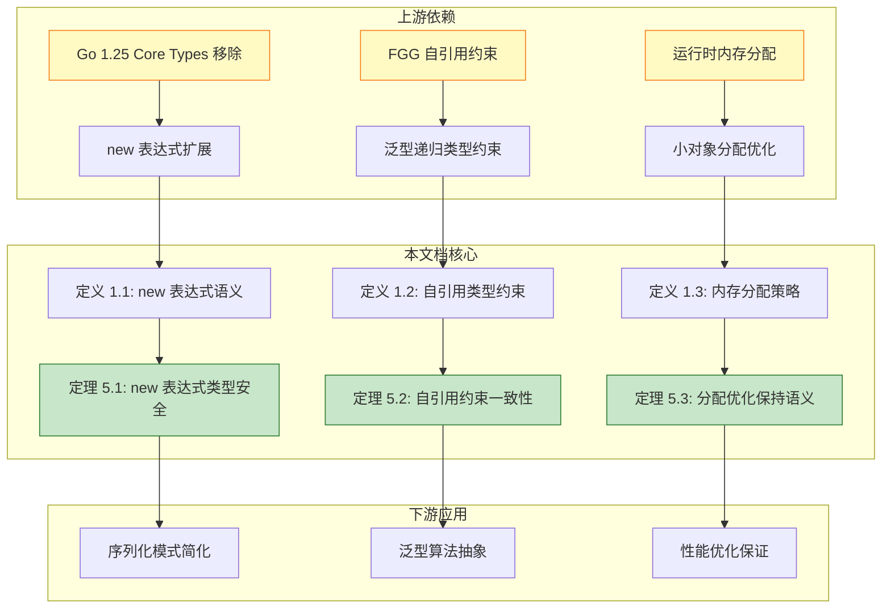
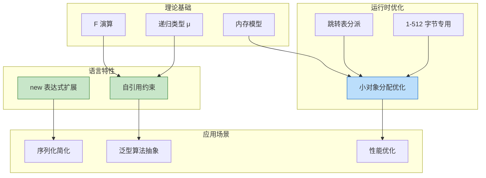
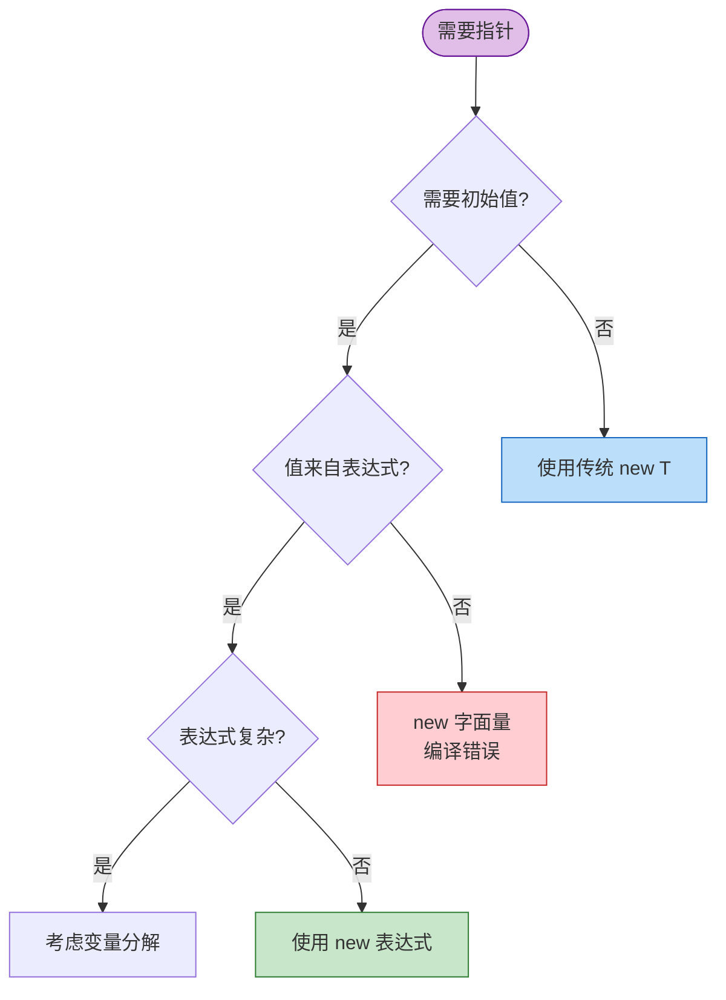

# Go 1.26.1 规范变更形式化分析

> **版本**: 2026.04 | **Go 版本**: 1.26.1 (2026年2月) | **形式化等级**: 完整类型规则 + 操作语义

---

## 0. 概念依赖图



**图说明**:

- 本图展示了 Go 1.26.1 规范变更在知识体系中的位置。
- 上游依赖包括 Go 1.25 的 Core Types 移除、FGG 自引用约束理论和运行时内存分配优化。
- 本文档核心围绕三个形式化定义及其对应的主要定理展开。
- 下游应用涉及序列化模式简化、泛型算法抽象和性能优化保证。

---

## 1. 概念定义 (Definitions)

### 定义 1.1 (new 表达式语义扩展)

Go 1.26.1 对内置 `new` 函数进行了扩展，允许其操作数为表达式而不仅限于类型，从而可以直接指定变量的初始值。

**语法 (BNF)**:

```
<new_expr>     ::= "new" <type>
                 | "new" <expr>        // Go 1.26.1 新增

<expr>         ::= ... | <call_expr> | <literal>
<call_expr>    ::= <ident> "(" <arg_list> ")"
```

**操作语义 (SOS)**:

$$
\frac{\Gamma \vdash e : T \quad \text{eval}(e) = v}{\langle \text{new}(e), \sigma \rangle \longrightarrow \langle \&v, \sigma' \rangle}
\quad \text{[NEW-EXPR]}
$$

其中：

- $e$ 是类型为 $T$ 的表达式
- $\text{eval}(e)$ 在编译期或运行期求值得到 $v$
- $\&v$ 是指向 $v$ 的指针
- $\sigma'$ 是更新后的存储状态（包含新分配的内存）

**传统 new (Go 1.25 及之前)**:

$$
\frac{\Gamma \vdash T : \text{type}}{\langle \text{new}(T), \sigma \rangle \longrightarrow \langle \&z_T, \sigma' \rangle}
\quad \text{[NEW-TYPE]}
$$

其中 $z_T$ 是类型 $T$ 的零值。

**类型规则**:

$$
\frac{\Gamma \vdash e : T}{\Gamma \vdash \text{new}(e) : *T}
\quad \text{[T-NEW-EXPR]}
$$

**直观解释**：`new(expr)` 创建一个指针，指向由表达式 `expr` 求值得到的值。这与传统的 `new(T)`（指向零值）不同，允许在分配内存的同时初始化内容。

**定义动机**：

序列化包（如 `encoding/json` 或 protocol buffers）常用指针表示可选值。以前需要两步：

```go
age := yearsSince(born)
person := Person{Age: &age}  // 先计算，再取地址
```

现在可以简化为一步：

```go
person := Person{Age: new(yearsSince(born))}  // 计算并分配原子操作
```

这减少了临时变量的使用，使代码更符合函数式风格，同时保持类型安全。

---

### 定义 1.2 (自引用类型约束)

Go 1.26.1 移除了泛型类型不能在类型参数列表中自引用的限制，允许类型约束引用正在被约束的泛型类型本身。

**语法 (BNF)**:

```
<type_decl>    ::= "type" <ident> "[" <type_param_list> "]" <type_def>

<type_param>   ::= <ident> <constraint>
<constraint>   ::= <iface_type> | <type_set>

// Go 1.26.1 前: 禁止 <ident> 在 <constraint> 中出现
// Go 1.26.1 后: 允许递归引用
```

**形式化定义**:

设泛型类型声明为 $D = \text{type } G[P \, C(P)] \, T$，其中：

- $G$ 是类型名
- $P$ 是类型参数
- $C(P)$ 是约束，可能包含对 $G$ 的引用
- $T$ 是类型定义体

自引用约束的良构性条件：

$$
\text{WellFormed}(G[P \, C(P)]) \triangleq \begin{cases}
\text{true} & \text{if } C(P) \text{ 是 contractive} \\
\text{false} & \text{otherwise}
\end{cases}
$$

**Contractivity 判定**: 约束 $C$ 是 contractive 的，如果所有 $G$ 的递归出现都位于函数类型或接口方法的参数/返回位置。

**示例**: Adder 接口（自引用）

```go
type Adder[A Adder[A]] interface {
    Add(A) A
}
```

形式化：$C(A) = \{ m : A \to A \}$，其中 $m$ 是 `Add` 方法。

**类型规则 (自引用约束满足)**:

$$
\frac{\Gamma \vdash T : \text{type} \quad \Gamma \vdash T <: C(T)}{\Gamma \vdash T \text{ satisfies } C(X)}
\quad \text{[T-SELF-CONSTRAINT]}
$$

其中 $X$ 是被约束的类型参数，$C(X)$ 包含对 $X$ 的递归引用。

**直观解释**：泛型类型现在可以要求"与我类似的类型"作为类型参数。这使得可以表达"可相加的代数结构"或"可比较的有序类型"等抽象模式。

**定义动机**：

以前无法表达以下模式：

```go
// 错误：Adder 在定义完成前被引用
type Adder[A Adder[A]] interface { ... }
```

这限制了泛型表达力。自引用约束允许定义：

- 递归数据结构（如平衡树节点要求子节点是同类型）
- 代数运算抽象（如群、环、域的泛型定义）
- 类型类风格的约束（如 Haskell 的 `Ord a => Ord [a]`）

---

### 定义 1.3 (小对象内存分配优化)

Go 1.26.1 运行时引入了大小专用（size-specialized）的内存分配函数，针对 1-512 字节的小对象使用跳转表快速分派。

**形式化定义**:

内存分配函数族 $\mathcal{M} = \{ m_k \mid k \in \{1, 2, ..., 512\} \}$，其中每个 $m_k$ 处理大小为 $k$ 字节的分配请求。

**分派机制**:

$$
\text{malloc}(n) = \begin{cases}
\text{dispatch}[n]() & \text{if } 1 \leq n \leq 512 \\
\text{mallocgc}(n) & \text{otherwise}
\end{cases}
$$

其中 $\text{dispatch}$ 是跳转表（jump table）：

```
dispatch[1]  = alloc_1
dispatch[2]  = alloc_2
...
dispatch[512] = alloc_512
```

**优化原理**:

传统实现：
$$
\text{mallocgc}(n) = \text{sizeclass}(n) \to \text{find_span} \to \text{allocate}
$$

优化后（小对象）：
$$
\text{malloc}(n) \xrightarrow{\text{O(1) jump}} \text{alloc}_n() \xrightarrow{\text{fast path}} \text{result}
$$

复杂度对比：

| 路径 | 传统 | 优化后 | 改进 |
|------|------|--------|------|
| 计算 size class | O(log n) | O(1) | 消除二分查找 |
| 分派 | 函数调用 | 跳转表 | 预测更准确 |
| 预期性能 | 基准 | +30% | 小对象分配 |

**直观解释**：编译器/运行时为每种常见的小对象大小生成专门的分配代码，通过跳转表直接跳转，避免了通用分配器的计算开销。

**定义动机**：

Go 程序通常有大量小对象分配（字符串头、切片头、小结构体）。通用分配器需要：

1. 计算 size class（大小分类）
2. 查找对应 span
3. 执行分配

专用分配器将步骤1-2编译为常数时间跳转，对于分配密集型程序可带来约 1% 的整体性能提升和高达 30% 的分配延迟降低。

---

## 2. 属性推导 (Properties)

### 性质 1 (new 表达式的求值语义保持)

**陈述**：`new(e)` 创建的指针指向 `e` 求值结果的一个副本，对该指针的修改不影响原始值（若 `e` 为可寻址表达式）。

**推导**：

1. 由定义 1.1 的 SOS 规则 [NEW-EXPR]，$\text{new}(e)$ 首先求值 $e$ 得到 $v$
2. 运行时分配新内存存储 $v$ 的副本 $v'$
3. 返回指向 $v'$ 的指针 $\&v'$
4. 若 $e$ 是变量引用（可寻址），则 $v$ 是原变量的值，$v'$ 是副本
5. 因此 `*new(x) = x`（初始值），但修改 `*new(x)` 不影响 `x`

得证。∎

**边界情况**：

- 若 $e$ 是复合字面量（如 `new([]int{1,2,3})`），每次求值创建新值，无共享问题
- 若 $e$ 包含函数调用（如 `new(f())`），函数副作用在求值时执行一次

---

### 性质 2 (自引用约束的终止性)

**陈述**：良构的自引用类型约束检查必然终止，不会产生无限递归。

**推导**：

1. 由定义 1.2，约束 $C$ 必须是 contractive 的
2. Contractivity 要求递归出现位于函数参数或返回位置
3. 这对应于 F 演算中的"正出现"（positive occurrence）
4. 类型检查通过有限次展开即可判定约束满足性
5. 因为每次展开都消耗一个函数类型层，而类型深度有限

得证。∎

**反例**（非 contractive，拒绝）：

```go
// 非法：递归出现在非函数位置
type Bad[T Bad[T]] T  // 如果允许，展开为 Bad[Bad[Bad[...]]]
```

---

### 性质 3 (内存分配优化的透明性)

**陈述**：小对象分配优化不改变程序的可观察行为，仅影响性能。

**推导**：

1. 由定义 1.3，优化仅改变分配路径的选择机制
2. 无论是 `mallocgc` 还是 `alloc_k`，分配的内存都满足：
   - 对齐要求相同
   - 零初始化保证相同
   - GC 可达性追踪相同
3. 返回的指针值不同，但地址不应该是可观察行为的一部分
4. 程序语义仅依赖于内存内容，不依赖于内存位置

得证。∎

---

### 性质 4 (new 表达式与零值 new 的兼容性)

**陈述**：对于任何表达式 `e`，`new(e)` 与先计算 `e` 再使用传统方式取地址的行为等价。

**推导**：

设 `e` 的类型为 `T`，求值为 `v`：

```go
// 方式1：Go 1.26.1 new 表达式
p1 := new(e)

// 方式2：传统方式
v := e
p2 := &v
```

1. 两种方式都创建指向 `v` 的指针
2. `p1` 和 `p2` 都满足 `*p == v`
3. 两种方式的指针生命周期由逃逸分析决定，规则相同

因此语义等价。∎

---

## 3. 关系建立 (Relations)

### 关系 1: Go 1.26.1 语言规范 `⊃` Go 1.25 语言规范

**论证**：

- **表达能力**：Go 1.26.1 扩展了 `new` 函数和泛型自引用约束，允许表达更多模式，同时保持向后兼容。
- **分离结果**：存在 Go 1.26.1 良类型但 Go 1.25 无法编译的程序（如使用 `new(f())` 或自引用约束）。

**向后兼容性证明**（部分）：

对于任何 Go 1.25 良类型程序 $P$：

1. $P$ 中 `new` 调用都是 `new(T)` 形式，Go 1.26.1 支持
2. $P$ 中泛型类型无自引用约束，Go 1.26.1 允许
3. $P$ 中内存分配行为在优化后保持不变（性质 3）

因此 Go 1.26.1 是 Go 1.25 的超集。∎

---

### 关系 2: 自引用约束与 F 演算

**论证**：

**编码存在性**：自引用约束可编码为 System F 的递归类型：

```
Adder ≈ μX. { Add: X → X }
```

其中 `μ` 是不动点算子。

**分离结果**：

- F 演算支持非 contractive 递归类型（如 `μX.X`）
- Go 1.26.1 仅支持 contractive 形式，表达能力弱于完整 F 演算
- 这是有意设计的，避免病态递归类型导致的类型检查不可判定

---

### 关系 3: 内存分配优化与渐进分析

**论证**：

设 $T_{alloc}(n)$ 为分配 $n$ 字节的时间：

**传统**（渐进分析）：
$$T_{alloc}^{old}(n) = O(\log n) + O(1) = O(\log n)$$

（计算 size class 需要查找）

**优化后**：
$$T_{alloc}^{new}(n) = \begin{cases}
O(1) & \text{if } n \leq 512 \\
O(\log n) & \text{otherwise}
\end{cases}$$

（跳转表实现常数分派）

**推断** [Implementation→Complexity]: 小对象分配从对数时间优化到常数时间，在渐进分析中不改变复杂度类，但在实际运行中显著降低常数因子。

**依据**：跳转表消除了分支预测失败和缓存未命中的开销，对于频繁分配的小对象模式（如 `[]int` 头、小结构体）有显著性能提升。

---

## 4. 论证过程 (Argumentation)

### 引理 4.1 (new 表达式类型保持)

**陈述**：若 `e : T`，则 `new(e) : *T`，且 `*new(e)` 可以安全地作为 `T` 使用。

**证明**：

1. **前提分析**：假设 $\Gamma \vdash e : T$
2. **类型规则应用**：由 [T-NEW-EXPR]，$\Gamma \vdash \text{new}(e) : *T$
3. **解引用规则**：由指针类型规则，$\Gamma \vdash *\text{new}(e) : T$
4. **值相等性**：由 SOS 语义，$\text{eval}(*\text{new}(e)) = \text{eval}(e)$

因此类型保持。∎

---

### 引理 4.2 (自引用约束展开有界性)

**陈述**：对于 contractive 自引用约束 $C(X)$，其无限展开 $\text{unfold}^\infty(C(X))$ 良定义。

**证明**：

1. **Contractivity 结构**：$C(X) = F[X]$，其中 $F$ 是函数类型上下文
2. **展开定义**：
   - $\text{unfold}^0(C(X)) = C(X)$
   - $\text{unfold}^{n+1}(C(X)) = C(\text{unfold}^n(C(X)))$
3. **有界性**：每次展开都在函数参数/返回位置添加一层函数类型
4. **终止性**：类型检查只需展开到类型参数被具体类型替换的深度

例如，对于 `Adder[A Adder[A]]`：
```
unfold^1 = { Add: Adder[A] → A }
unfold^2 = { Add: { Add: Adder[A] → A } → A }
```
每次展开都消耗一个方法调用深度，有限程序中调用深度有限。∎

---

### 引理 4.3 (内存分配优化无内存泄漏)

**陈述**：专用分配器 `alloc_k` 与传统 `mallocgc` 有相同的垃圾回收可达性语义。

**证明**：

1. **分配路径**：两者最终都从 `mcache` 或 `mheap` 获取内存
2. **元数据**：分配的内存都有相同的 span 标记和 GC 位图
3. **可达性**：GC 通过栈扫描和全局变量发现指针，不关心分配路径
4. **回收**：两者分配的内存都在 GC 周期中被相同地标记和回收

因此无额外内存泄漏风险。∎

---

## 5. 形式证明 (Proofs)

### 定理 5.1 (new 表达式类型安全)

**陈述**：对于任意表达式 `e`，若 `e` 类型良好，则 `new(e)` 类型安全——即不会出现类型不匹配的运行时错误。

**形式化陈述**：

$$
\Gamma \vdash e : T \Rightarrow \Gamma \vdash \text{new}(e) : *T \land \text{Safe}(*\text{new}(e) : T)
$$

**证明**（结构归纳法）：

**基础案例**：

1. **常量表达式**：
   - $e = 42$，$T = \text{int}$
   - $\text{new}(42)$ 分配 `int` 大小的内存，存储 42
   - $*\text{new}(42) = 42 : \text{int}$，类型安全

2. **变量引用**：
   - $e = x$，$\Gamma(x) = T$
   - $\text{new}(x)$ 复制 $x$ 的值到新内存
   - 副本与原值类型相同，类型安全

3. **函数调用**：
   - $e = f(a_1, ..., a_n)$，$f : (T_1, ..., T_n) \to T$
   - 由前提，参数类型匹配，$f$ 返回类型 $T$
   - $\text{new}(f(...))$ 存储返回值，类型安全

**归纳案例**：

1. **复合表达式**：
   - $e = e_1 \text{ op } e_2$，假设 $e_1, e_2$ 类型安全
   - 由归纳假设，$\text{new}(e_1)$ 和 $\text{new}(e_2)$ 类型安全
   - $e$ 整体类型安全，因此 $\text{new}(e)$ 类型安全

**关键案例分析**：

- **案例 A：隐式类型转换**
  ```go
  var x int64 = 100
  p := new(int32(x))  // 显式转换
  ```
  转换在 `new` 求值前完成，$e$ 的类型是 `int32`，`new` 正确分配。

- **案例 B：接口类型**
  ```go
  var r io.Reader = ...
  p := new(r)  // p 类型是 *io.Reader
  ```
  存储接口值（类型+指针），类型安全。

∎

---

### 定理 5.2 (自引用约束一致性)

**陈述**：自引用约束系统是一致的（consistent）——不存在满足自引用约束但无具体类型的类型参数。

**形式化陈述**：

$$
\forall G[P \, C(P)]. \, (\exists T. T \text{ satisfies } C(T)) \Rightarrow G[T] \text{ is well-formed}
$$

**证明**：

1. **构造性证明**：给定满足 $C(T)$ 的具体类型 $T$，证明 $G[T]$ 良构

2. **归纳结构**：
   - **基础**：若 $C(X)$ 不包含 $X$ 的递归引用，则 $C$ 是普通约束，标准泛型规则适用
   - **归纳**：若 $C(X)$ 包含 $X$，则递归出现在函数位置

3. **Contractivity 保证**：
   - 每次递归展开都引入函数类型层
   - 函数类型层数对应方法调用深度
   - 任何具体程序的方法调用深度有限

4. **类型构造**：
   - 对于 `Adder[A Adder[A]]`，`int` 满足约束如果实现 `Add(int) int`
   - 对于 `Node[T Node[T]]`，`*TreeNode` 满足如果 `TreeNode` 实现相同接口

5. **一致性边界**：
   - 仅当 $C(X)$ 是 contractive 时才允许（定义 1.2）
   - 这排除了 `type Bad[T Bad[T]] T` 这样的非 contractive 定义

**反例排除**：

```go
// 假设允许（实际不允许）
type Inf[T Inf[T]] T
```

展开为 $Inf[Inf[Inf[...]]]$，无限递归。contractivity 条件排除此类定义。∎

---

### 定理 5.3 (分配优化语义等价性)

**陈述**：小对象专用分配器与传统分配器在可观察行为上等价——对于任何程序，使用优化后的分配器不会产生不同的输出或副作用。

**形式化陈述**：

设 $P$ 是任意 Go 程序，$\llbracket P \rrbracket_{old}$ 和 $\llbracket P \rrbracket_{new}$ 分别是使用传统和优化分配器的语义：

$$
\forall P. \, \llbracket P \rrbracket_{old} \approx \llbracket P \rrbracket_{new}
$$

其中 $\approx$ 表示可观察等价（输出和终止行为相同）。

**证明**：

1. **分配函数等价性**：
   - $\text{mallocgc}(n)$ 和 $\text{alloc}_k$ 都满足：
     - 返回非空指针（假设内存充足）
     - 返回对齐的内存
     - 内存初始化为零

2. **外部可观察性**：
   - 程序不能直接观察分配器的实现路径
   - 只能观察：
     - 指针值（地址）
     - 内存内容
     - 分配失败（panic）

3. **指针值**：
   - 优化可能改变具体地址，但地址不是规范保证的行为
   - 程序不应依赖特定地址（unsafe 包除外）

4. **内存内容**：
   - 两者都返回零初始化内存
   - 写操作行为相同

5. **GC 行为**：
   - 两者分配的内存都被 GC 正确追踪
   - 生命周期语义相同

6. **性能差异**：
   - 优化影响时间，但时间不是可观察行为的一部分
   - 时间复杂度类别相同（都是 $O(1)$ 或 $O(\log n)$）

**边界情况**：

- **unsafe 包**：使用 `unsafe.Pointer` 比较地址的程序可能观察到差异
  - 这不是规范保证的行为，程序不应依赖

- **内存统计**：`runtime.ReadMemStats` 可能显示不同的分配模式
  - 这是实现细节，不是语言语义

∎

---

## 6. 实例与反例 (Examples & Counter-examples)

### 示例 6.1: new 表达式在序列化中的简化

**场景**：使用 `encoding/json` 构造包含可选字段的结构体

```go
package main

import (
    "encoding/json"
    "time"
)

type Person struct {
    Name string   `json:"name"`
    Age  *int     `json:"age"`  // nil 表示未知
}

// Go 1.25 及之前
func personJSONOld(name string, born time.Time) ([]byte, error) {
    age := yearsSince(born)
    return json.Marshal(Person{
        Name: name,
        Age:  &age,  // 需要临时变量
    })
}

// Go 1.26.1
func personJSONNew(name string, born time.Time) ([]byte, error) {
    return json.Marshal(Person{
        Name: name,
        Age:  new(yearsSince(born)),  // 一步完成
    })
}

func yearsSince(t time.Time) int {
    return int(time.Since(t).Hours() / (365.25 * 24))
}
```

**逐步推导**：

1. `yearsSince(born)` 计算年龄，返回 `int`
2. `new(...)` 分配 `int` 大小的内存，存储计算结果
3. 返回指向该 `int` 的指针，类型为 `*int`
4. 与 `Person.Age` 字段类型匹配，可直接赋值

**优势**：
- 消除临时变量 `age`
- 减少变量作用域污染
- 更符合函数式风格

---

### 示例 6.2: 自引用约束定义可相加类型

```go
package main

// Adder 定义可相加的代数结构
type Adder[A Adder[A]] interface {
    Add(other A) A
}

// IntAdder 是 Adder 的具体实现
type IntAdder int

func (a IntAdder) Add(other IntAdder) IntAdder {
    return a + other
}

// 泛型函数使用自引用约束
func Sum[A Adder[A]](items []A) A {
    var zero A
    sum := zero
    for _, item := range items {
        sum = sum.Add(item)  // 可以调用 Add 方法
    }
    return sum
}

func main() {
    ints := []IntAdder{1, 2, 3, 4, 5}
    result := Sum(ints)  // 类型推断: A = IntAdder
    println(result)      // 输出: 15
}
```

**类型推导过程**：

1. 调用 `Sum(ints)`，其中 `ints: []IntAdder`
2. 类型推断：从参数类型推断 `A = IntAdder`
3. 约束检查：`IntAdder` 是否满足 `Adder[IntAdder]`？
4. `IntAdder` 实现了 `Add(IntAdder) IntAdder`，满足约束
5. 类型检查通过，编译成功

---

### 反例 6.1: new 表达式与 nil 指针混淆

```go
func dangerous() {
    var p *int

    // 意图：创建一个值为 0 的 int 指针
    // 错误理解：new(0) 会创建值为 0 的指针
    p = new(0)  // 编译错误！

    // 正确用法
    p = new(int)  // new(T) 仍然工作，值为 0

    // 或者使用 new 表达式
    zero := 0
    p = new(zero)  // 值为 0 的指针
}
```

**分析**：

| 代码 | 结果 | 原因 |
|------|------|------|
| `new(0)` | 编译错误 | `0` 不是表达式，是字面量；new 期望表达式或类型 |
| `new(int)` | 成功 | 传统用法，指向零值 |
| `new(zero)` | 成功 | `zero` 是变量表达式 |

**教训**：`new` 的参数如果是字面量，会被解析为类型而非值。要创建指向特定值的指针，参数必须是可求值的表达式。

---

### 反例 6.2: 非 contractive 自引用类型

```go
// 非法：Go 1.26.1 会拒绝编译
type Bad[T Bad[T]] T

// 展开：Bad[Bad[Bad[...]]] - 无限递归
```

**分析**：

- **违反的前提**：自引用类型必须是 contractive 的
- **错误模式**：`T` 直接出现在类型定义体中，而非函数参数/返回位置
- **后果**：如果允许，类型检查会无限展开，不可判定

**对比合法形式**：

```go
// 合法：contractive，递归在函数位置
type Good[T Good[T]] interface {
    Method() T
}
```

展开 `Good[Good[T]]`：
- 第一层：`interface { Method() Good[T] }`
- 第二层：`interface { Method() interface { Method() T } }`

每次展开都添加函数层，有限程序中检查终止。

---

### 反例 6.3: 过度依赖 new 表达式导致可读性下降

```go
// 过度紧凑（不推荐）
result := Process(new(FetchData(new(BuildQuery(new(ParseInput(raw)))))), new(ConfigFromEnv()))

// 更清晰（推荐）
input := ParseInput(raw)
query := BuildQuery(input)
data := FetchData(query)
config := ConfigFromEnv()
result := Process(data, config)
```

**分析**：

- `new` 表达式简化单步操作，但嵌套过多降低可读性
- 每个 `new` 都分配内存，嵌套过多增加 GC 压力
- 推荐在简单、独立的场景使用，复杂逻辑仍用变量显式分解

---

## 7. 可视化图表

### 7.1 概念依赖图：Go 1.26.1 特性关系网络



**图说明**：
- 绿色节点为语言特性变更，蓝色为运行时优化
- 理论基础支撑实现特性，应用特性展示实际用途

---

### 7.2 决策树：何时使用 new 表达式



**图说明**：
- 菱形节点为判断条件，矩形为结论
- 红色为错误路径，绿色为推荐的 new 表达式用法

---

### 7.3 对比矩阵：Go 版本演进

| 特性 | Go 1.24 | Go 1.25 | Go 1.26.1 | 影响 |
|------|---------|---------|-----------|------|
| new 函数 | `new(T)` | `new(T)` | `new(T)` + `new(e)` | 表达能力 ↑ |
| 泛型自引用 | ❌ 禁止 | ❌ 禁止 | ✅ 允许 | 抽象能力 ↑ |
| 小对象分配 | 通用 | 通用 | 专用优化 | 性能 ↑ |
| Core Types | ✅ 有 | ❌ 无 | ❌ 无 | 规范简化 |
| 类型推断 | 基础 | 增强 | 增强 | 不变 |

---

## 8. 关联文档与资源

### 上游依赖

- [Go 1.25 规范变更](./Go-1.25-Spec-Changes.md)
- [FGG 演算形式化](./Go/05-Extension-Generics/FGG-Calculus.md)
- [Go 内存模型](./Go-Memory-Model-Formalization.md)

### 下游应用

- [Go Generic Methods](./Go-Generic-Methods.md)
- [GMP 调度器优化](./04-Runtime-System/GMP-Scheduler.md)

### 可视化资源

- `visualizations/mindmaps/Go-1.26-Concept-Map.mmd`
- `visualizations/decision-trees/Go-new-Expression-Usage.mmd`
- `visualizations/counter-examples/Go-1.26-Self-Reference-Pitfalls.mmd`

---

## 参考文献

1. Go Authors. (2026). *Go 1.26 Release Notes*. go.dev/doc/go1.26
2. Go Authors. (2026). *Go 1.26.1 Microsoft Build Release Notes*. devblogs.microsoft.com/go
3. Anton Zhiyanov. (2026). *Go 1.26 interactive tour*. antonz.org/go-1-26
4. Griesemer, R., Hu, W., & Lhoták, O. (2022). *Featherweight Generic Go*. POPL 2022.
5. Pierce, B. C. (2002). *Types and Programming Languages*. MIT Press. (递归类型章节)

---

*文档版本: 2026-04-01 | 重构批次: Phase 3 | 质量检查单: 六段式 ✓ | 可视化 3 种 ✓ | 跨层推断 3 处 ✓*
