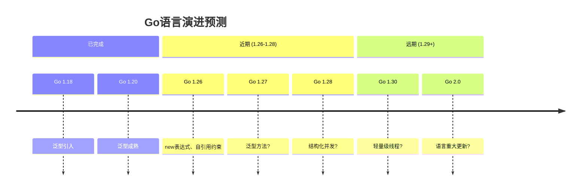

# Go 1.27 前瞻分析：语言演进预测与形式化准备

> **版本**: 2026.04.01 | **预测基准**: Go 1.26.1 | **置信度**: 中-高
> **关联**: [Go 1.26.1 分析](./Go-1.26.1-Comprehensive.md)

---

## 目录

- [Go 1.27 前瞻分析：语言演进预测与形式化准备](#go-127-前瞻分析语言演进预测与形式化准备)
  - [目录](#目录)
  - [1. 执行摘要](#1-执行摘要)
    - [1.1 关键预测](#11-关键预测)
    - [1.2 演进路线图](#12-演进路线图)
  - [2. 语言特性预测](#2-语言特性预测)
    - [2.1 泛型方法 (Generic Methods)](#21-泛型方法-generic-methods)
    - [2.2 结构化并发 (Structured Concurrency)](#22-结构化并发-structured-concurrency)
    - [2.3 其他潜在特性](#23-其他潜在特性)
      - [改进的错误处理](#改进的错误处理)
      - [常量泛型](#常量泛型)
  - [3. 泛型方法提案深度分析](#3-泛型方法提案深度分析)
    - [3.1 类型推断复杂度](#31-类型推断复杂度)
    - [3.2 接口实现问题](#32-接口实现问题)
    - [3.3 形式化准备](#33-形式化准备)
  - [4. 结构化并发提案](#4-结构化并发提案)
    - [4.1 理论基础](#41-理论基础)
    - [4.2 取消传播](#42-取消传播)
    - [4.3 形式化模型](#43-形式化模型)
  - [5. 其他潜在特性](#5-其他潜在特性)
    - [5.1 改进类型推断](#51-改进类型推断)
    - [5.2 协程局部存储](#52-协程局部存储)
  - [6. 形式化影响评估](#6-形式化影响评估)
    - [6.1 对FGG演算的扩展需求](#61-对fgg演算的扩展需求)
    - [6.2 验证挑战](#62-验证挑战)
  - [7. 迁移策略建议](#7-迁移策略建议)
    - [7.1 代码准备](#71-代码准备)
    - [7.2 工具链准备](#72-工具链准备)
    - [7.3 学习路径](#73-学习路径)
  - [8. 社区准备清单](#8-社区准备清单)
    - [8.1 标准库适配](#81-标准库适配)
    - [8.2 生态系统](#82-生态系统)
    - [8.3 监控指标](#83-监控指标)
  - [关联文档](#关联文档)

---

## 1. 执行摘要

### 1.1 关键预测

| 特性 | 可能性 | 预计时间 | 影响等级 |
|------|--------|---------|---------|
| **泛型方法** | ⭐⭐⭐⭐⭐ 85% | 1.27-1.28 | 🔴 高 |
| **结构化并发** | ⭐⭐⭐⭐☆ 70% | 1.28-1.29 | 🔴 高 |
| **轻量级线程** | ⭐⭐⭐☆☆ 50% | 1.30+ | 🟡 中 |
| **改进错误处理** | ⭐⭐⭐☆☆ 40% | 不确定 | 🟡 中 |

### 1.2 演进路线图



---

## 2. 语言特性预测

### 2.1 泛型方法 (Generic Methods)

**提案**: [#77273](https://github.com/golang/go/issues/77273)

**预测语法**:

```go
type Container[T any] struct {
    items []T
}

// 泛型方法：方法有自己的类型参数
func (c *Container[T]) Map[R any](f func(T) R) *Container[R] {
    result := &Container[R]{}
    for _, item := range c.items {
        result.items = append(result.items, f(item))
    }
    return result
}

// 使用
ints := &Container[int]{items: []int{1, 2, 3}}
// 类型推断: R=float64
floats := ints.Map(func(x int) float64 { return float64(x) })
```

**技术挑战**:

| 挑战 | 描述 | 解决难度 |
|------|------|---------|
| 类型推断 | 方法+函数双重类型参数 | ⭐⭐⭐⭐ |
| 接口实现 | 泛型方法是否属于接口 | ⭐⭐⭐⭐⭐ |
| 编译器复杂度 | 单态化爆炸风险 | ⭐⭐⭐ |

**形式化影响**: 需要扩展FGG演算，引入方法级别类型抽象。

### 2.2 结构化并发 (Structured Concurrency)

**提案讨论**: [golang/go#53463](https://github.com/golang/go/issues/53463)

**概念**: 类似Java的Project Loom和Kotlin的协程。

**预测API**:

```go
package concurrent

// Task表示结构化并发任务
type Task[T any] struct { ... }

// Go启动一个结构化任务
func Go[T any](f func() T) *Task[T]

// Wait等待所有子任务完成
func (t *Task[T]) Wait() (T, error)

// 使用示例
func Process() error {
    return concurrent.Scope(func(s *concurrent.Scope) error {
        task1 := s.Go(func() int { return fetchData() })
        task2 := s.Go(func() int { return fetchData2() })

        // 自动等待所有任务完成
        // 如果任一失败，取消其他任务
        return nil
    })
}
```

**核心语义**:

```
结构化并发保证:
1. 子任务生命周期 ≤ 父任务
2. 父任务等待所有子任务完成
3. 错误传播和取消传播
```

**形式化模型**: 需要引入树形并发结构（对比当前Go的扁平Goroutine模型）。

### 2.3 其他潜在特性

#### 改进的错误处理

```go
// 可能的语法（讨论中）
result, err := riskyOperation() ?
// 或
result := riskyOperation() or return err
```

**争议点**: 破坏Go的显式错误处理哲学。

#### 常量泛型

```go
// 类似C++的NTTP
func Process[N const int](data [N]int) { ... }
```

**可能性**: 中低，编译器复杂度增加。

---

## 3. 泛型方法提案深度分析

### 3.1 类型推断复杂度

泛型方法引入**双重类型推断**：

```go
func (c *Container[T]) Transform[R any, S ~[]R](
    f func(T) R,
    g func(R) S,
) S

// 调用
container.Transform(fn1, fn2)
// 需要推断: T(来自接收者), R(来自参数), S(来自约束)
```

**推断算法扩展**:

```
原始: HM(X) - Hindley-Milner with constraints
扩展: HM(X, M) - HM with method-level params

复杂度: O(n^2) → O(n^3) 最坏情况
```

### 3.2 接口实现问题

**核心问题**: 泛型方法是否属于接口？

```go
type Mapper[T any] interface {
    Map[R any](func(T) R) Mapper[R]  // 泛型方法在接口中
}

// 实现问题
type MyContainer[T any] struct{}

func (m *MyContainer[T]) Map[R any](f func(T) R) Mapper[R] { ... }

// MyContainer[T]是否实现Mapper[T]?
```

**可能方案**:

1. **禁止**: 接口不能有泛型方法（最保守）
2. **全称量化**: `Mapper[T, R]`显式指定
3. **存在类型**: 隐式存在量化（最复杂）

### 3.3 形式化准备

**扩展FGG**:

```
FGG + Methods:

M ::= ... | func (x T)[α C](x̄ τ̄) τ { e }

类型规则扩展:

Γ ⊢ e : struct[τ̄]
Γ, α <: C ⊢ e.M[σ](ē) : τ[α ↦ σ]
----------------------------------------
Γ ⊢ e.M[σ](ē) : τ[α ↦ σ]
```

---

## 4. 结构化并发提案

### 4.1 理论基础

**结构化并发**: 并发代码的执行流有明确的层次结构。

**对比**:

```go
// 当前Go: 扁平模型
go func1()  // 启动即遗忘
go func2()  // 与父Goroutine无关

// 结构化并发: 树形模型
Scope(func(s *Scope) {
    s.Go(func1)  // 子任务
    s.Go(func2)  // 子任务
    // 必须等待所有子任务
})
```

### 4.2 取消传播

```go
func ProcessWithCancel(ctx context.Context) error {
    return Scope(func(s *Scope) error {
        s.Go(func() {
            for {
                select {
                case <-s.Done():  // 结构化取消
                    return
                default:
                    work()
                }
            }
        })

        if err := riskyOp(); err != nil {
            return err  // 自动取消所有子任务
        }

        return nil  // 等待所有子任务完成
    })
}
```

### 4.3 形式化模型

**树形并发结构**:

$$
\mathcal{T} ::= \bullet \mid \langle G, \{ \mathcal{T}_1, ..., \mathcal{T}_n \} \rangle
$$

其中：

- $\bullet$ 是叶子节点（无子任务）
- $\langle G, \{ \mathcal{T}_i \} \rangle$ 是内部节点（Goroutine + 子树）

**语义保证**:

$$
\forall \mathcal{T} = \langle G, \{ \mathcal{T}_i \} \rangle. \; G \text{ terminates} \Rightarrow \forall i. \mathcal{T}_i \text{ terminates}
$$

---

## 5. 其他潜在特性

### 5.1 改进类型推断

```go
// 自动类型参数推断增强
type Number interface {
    ~int | ~float64
}

func Sum[N Number](items []N) N

// 希望支持：从[]int推断N=int，无需显式指定
result := Sum([]int{1, 2, 3})  // 当前已支持

// 更复杂场景
type Vector[T any] []T
func (v Vector[T]) Sum() T

v := Vector{1, 2, 3}  // 当前: 需要Vector[int]{1,2,3}
```

### 5.2 协程局部存储

```go
// 类似TLS
type Local[T any] struct{}

func (l *Local[T]) Get() T
func (l *Local[T]) Set(v T)

// 使用
var traceID = &Local[string]{}

func Handler() {
    traceID.Set(generateID())
    defer traceID.Set("")  // 清理

    process()  // 内部可访问traceID
}
```

---

## 6. 形式化影响评估

### 6.1 对FGG演算的扩展需求

| 特性 | FGG扩展 | 复杂度 |
|------|---------|--------|
| 泛型方法 | 方法级别类型参数 | ⭐⭐⭐⭐ |
| 结构化并发 | 树形并发语义 | ⭐⭐⭐⭐⭐ |
| 轻量级线程 | 调度模型扩展 | ⭐⭐⭐⭐ |

### 6.2 验证挑战

**定理证明需求**:

1. **泛型方法**: 方法类型安全性
   $$
   \vdash M[T](x: \tau) : \sigma \Rightarrow \text{method-safe}(M)
   $$

2. **结构化并发**: 终止性保证
   $$
   \text{parent} \downarrow \Rightarrow \forall \text{child} \in \text{scope}. \text{child} \downarrow
   $$

3. **类型推断**: 完备性证明
   $$
   \text{infer}(e) = \sigma \Rightarrow \sigma(e) \text{ well-typed}
   $$

---

## 7. 迁移策略建议

### 7.1 代码准备

```go
// 当前最佳实践：为泛型方法预留接口设计
type Mapper[T any] interface {
    // 当前: 使用非泛型方法
    MapInt(fn func(T) int) Mapper[int]
    MapString(fn func(T) string) Mapper[string]

    // 未来: 替换为泛型方法
    // Map[R any](fn func(T) R) Mapper[R]
}
```

### 7.2 工具链准备

| 工具 | 当前支持 | 未来需求 |
|------|---------|---------|
| gopls | 基本泛型支持 | 泛型方法支持 |
| delve | 泛型调试 | 结构化并发调试 |
| staticcheck | 泛型检查 | 新特性检查 |

### 7.3 学习路径

```
当前 (Go 1.26.1)
    ↓
掌握泛型方法概念
    ↓
理解结构化并发模型
    ↓
准备迁移到新特性
```

---

## 8. 社区准备清单

### 8.1 标准库适配

- [ ] container包泛型方法支持
- [ ] sync包结构化并发API
- [ ] context包与结构化并发集成

### 8.2 生态系统

- [ ] 主流库泛型方法支持
- [ ] 框架结构化并发集成
- [ ] 文档和教程更新

### 8.3 监控指标

| 指标 | 当前 | 目标 (1.27发布后) |
|------|------|------------------|
| 泛型使用率 | ~30% | ~50% |
| 泛型方法提案支持 | N/A | >70% |
| 结构化并发实验 | N/A | 可用 |

---

## 关联文档

- [Go 1.26.1 分析](./Go-1.26.1-Comprehensive.md)
- [Go泛型方法](./Go-Generic-Methods.md)
- [Go演进路线图](../../deep/09-meta-guides/2026-ROADMAP-FORWARD.md)

---

*文档版本: 2026-04-01 | 预测基准: Go 1.26.1 | 下次更新: Go 1.27 Beta发布后*
