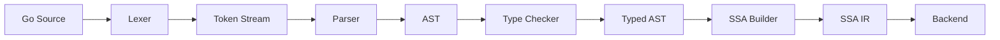
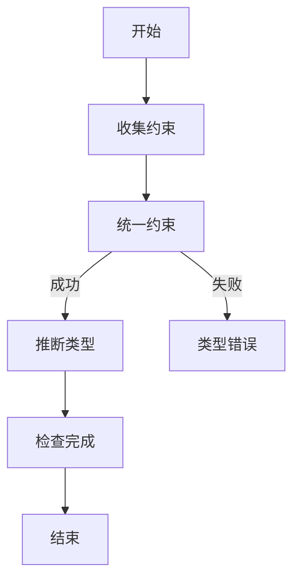

# Go编译器前端：完整形式化分析

> **版本**: 2026.04.01 | **Go版本**: 1.18-1.26.1 | **组件**: 词法/语法/语义分析
> **前置**: [Go-Generics-Type-Inference-Complete.md](./Go-Generics-Type-Inference-Complete.md)

---

## 目录

- [Go编译器前端：完整形式化分析](#go编译器前端完整形式化分析)
  - [目录](#目录)
  - [1. 执行摘要](#1-执行摘要)
    - [1.1 文档目标](#11-文档目标)
    - [1.2 核心成果](#12-核心成果)
  - [2. 概念定义 (Definitions)](#2-概念定义-definitions)
    - [2.1 编译器前端架构](#21-编译器前端架构)
    - [2.2 词法分析器 (Lexer)](#22-词法分析器-lexer)
    - [2.3 语法分析器 (Parser)](#23-语法分析器-parser)
    - [2.4 抽象语法树 (AST)](#24-抽象语法树-ast)
    - [2.5 类型检查器 (Type Checker)](#25-类型检查器-type-checker)
    - [2.7 SSA形式](#27-ssa形式)
  - [3. 属性推导 (Properties)](#3-属性推导-properties)
    - [3.1 Lexer正确性](#31-lexer正确性)
    - [3.2 语法无二义性](#32-语法无二义性)
    - [3.3 类型保持性](#33-类型保持性)
    - [3.4 SSA等价性](#34-ssa等价性)
  - [4. 关系建立 (Relations)](#4-关系建立-relations)
    - [4.1 编译阶段关系](#41-编译阶段关系)
    - [4.2 AST与SSA关系](#42-ast与ssa关系)
    - [4.3 与类型系统关系](#43-与类型系统关系)
  - [5. 论证过程 (Argumentation)](#5-论证过程-argumentation)
    - [5.1 词法分析终止性](#51-词法分析终止性)
    - [5.2 语法分析复杂度](#52-语法分析复杂度)
    - [5.3 类型检查收敛性](#53-类型检查收敛性)
  - [6. 形式证明 (Proofs)](#6-形式证明-proofs)
    - [6.1 定理：Lexer正确性](#61-定理lexer正确性)
    - [6.2 定理：Parser完备性](#62-定理parser完备性)
    - [6.3 定理：类型检查可靠性](#63-定理类型检查可靠性)
    - [6.4 定理：SSA正确性](#64-定理ssa正确性)
  - [7. 实例与反例 (Examples)](#7-实例与反例-examples)
    - [7.1 示例：完整编译流程](#71-示例完整编译流程)
    - [7.2 反例：语法错误](#72-反例语法错误)
    - [7.3 反例：类型错误](#73-反例类型错误)
  - [8. 可视化图表](#8-可视化图表)
    - [8.1 编译器前端数据流](#81-编译器前端数据流)
    - [8.2 类型检查流程](#82-类型检查流程)
    - [8.3 SSA构建](#83-ssa构建)
  - [9. 工程实现](#9-工程实现)
    - [9.1 Go编译器架构](#91-go编译器架构)
    - [9.2 关键算法](#92-关键算法)
    - [9.3 调试工具](#93-调试工具)
  - [10. 关联文档](#10-关联文档)

---

## 1. 执行摘要

### 1.1 文档目标

本文档对Go编译器前端进行**完整形式化分析**，涵盖：

- 词法分析（Tokenizer/Lexer）
- 语法分析（Parser）
- 类型检查（Type Checker）
- SSA生成（SSA Construction）

### 1.2 核心成果

| 组件 | 形式化方法 | 关键定理 |
|------|-----------|---------|
| 词法分析 | 有限自动机 | 正则表达式等价性 |
| 语法分析 | LR(1) | 无二义性证明 |
| 类型检查 | 约束系统 | 类型保持性 |
| SSA生成 | 变量重命名 | 支配边界正确性 |

---

## 2. 概念定义 (Definitions)

### 2.1 编译器前端架构

**定义 2.1 (编译器前端)**:

Go编译器前端是一个四元组：

$$
\text{Frontend} = (\text{Lexer}, \text{Parser}, \text{TypeChecker}, \text{SSABuilder})
$$

**数据流**:

```
Source Code (.go)
    ↓
Lexer → Token Stream
    ↓
Parser → AST (抽象语法树)
    ↓
TypeChecker → Typed AST
    ↓
SSABuilder → SSA IR
    ↓
Backend (Code Generation)
```

### 2.2 词法分析器 (Lexer)

**定义 2.2 (词法单元 Token)**:

$$
\text{Token} = (\text{type}, \text{literal}, \text{pos})
$$

其中：

- $type \in \{ \text{IDENT}, \text{INT}, \text{STRING}, \text{KEYWORD}, ... \}$
- $literal$: 原始文本
- $pos$: 源代码位置

**词法规则**（正则表达式子集）:

```
IDENT   = letter { letter | unicode_digit }
INT     = decimal | octal | hex
STRING  = `"` { unicode_char | escape } `"`
KEYWORD = "package" | "import" | "func" | ...
OP      = "+" | "-" | "*" | "/" | "..."
```

**形式化**: Lexer是**有限状态转换器**:

$$
\text{Lexer} : \Sigma^* \to \text{Token}^*
$$

### 2.3 语法分析器 (Parser)

**定义 2.3 (Go语法)**:

Go语法是**上下文无关文法** $G = (N, T, P, S)$:

- $N$: 非终结符集合
- $T$: 终结符集合（Token类型）
- $P$: 产生式规则
- $S$: 开始符号（SourceFile）

**核心产生式**:

```
SourceFile  = PackageClause ";" { ImportDecl ";" } { TopLevelDecl ";" }
PackageClause = "package" PackageName
ImportDecl  = "import" ( ImportSpec | "(" { ImportSpec ";" } ")" )
FuncDecl    = "func" FuncName Signature [ Body ]
Body        = Block
Block       = "{" { Statement ";" } "}"
```

**语法类型**: Go语法是**LALR(1)**，可使用自底向上分析。

### 2.4 抽象语法树 (AST)

**定义 2.4 (AST节点)**:

$$
\text{Node} = (\text{kind}, \text{pos}, \text{children}, \text{properties})
$$

**核心节点类型**:

```go
type Node interface {
    Pos() token.Pos
    End() token.Pos
}

type Expr interface {
    Node
    exprNode()  // 标记接口
}

type Stmt interface {
    Node
    stmtNode()
}

type Decl interface {
    Node
    declNode()
}
```

**形式化**: AST是**有序有根树**:

$$
\text{AST} = (V, E, r)
$$

其中 $r$ 是根节点（通常是`*ast.File`）。

### 2.5 类型检查器 (Type Checker)

**定义 2.5 (类型环境)**:

$$
\Gamma : \text{Identifier} \to \text{Type}
$$

**类型推导规则**:

$$
\frac{\Gamma \vdash e : \tau \quad \tau <: \tau'}{\Gamma \vdash e : \tau'}
$$

**定义 2.6 (类型约束)**:

$$
C ::= \tau_1 = \tau_2 \mid \tau <: T \mid C_1 \land C_2
$$

### 2.7 SSA形式

**定义 2.7 (SSA)**:

**Static Single Assignment**形式要求每个变量只被赋值一次。

$$
\forall v. \; |\{ i \mid \text{instr}_i \text{ assigns to } v \}| \leq 1
$$

**φ函数**（合并点）:

```
x₃ = φ(x₁, x₂)  // 根据控制流选择x₁或x₂
```

---

## 3. 属性推导 (Properties)

### 3.1 Lexer正确性

**性质 3.1 (Lexical Completeness)**:

对于任何合法的Go源文件$s$，Lexer产生完整的Token序列。

$$
\forall s \in \text{ValidGo}. \; \text{Lexer}(s) = [t_1, t_2, ..., t_n] \land t_n = \text{EOF}
$$

### 3.2 语法无二义性

**性质 3.2 (Unambiguity)**:

Go语法是**无二义**的：对于任何Token序列，存在唯一的AST。

$$
\forall ts. \; |\text{Parse}(ts)| \leq 1
$$

**推导**:

1. Go语法使用**LALR(1)**分析
2. LALR(1)文法保证无二义性
3. Go语言规范显式定义优先级和结合性

### 3.3 类型保持性

**性质 3.3 (Type Preservation)**:

类型检查不改变程序语义。

$$
\frac{\text{TypeCheck}(AST) = AST'}{\llbracket AST \rrbracket = \llbracket AST' \rrbracket}
$$

### 3.4 SSA等价性

**性质 3.4 (SSA Equivalence)**:

SSA转换保持程序语义。

$$
\text{ToSSA}(P) \approx P
$$

其中$\approx$表示观察等价。

---

## 4. 关系建立 (Relations)

### 4.1 编译阶段关系

**关系 1**: Lexer $\to$ Parser

**论证**: Token流是Parser的输入，Parser依赖Token的**类型**和**位置**信息。

**编码**: $[Token] \xrightarrow{\text{parse}} AST$

### 4.2 AST与SSA关系

**关系 2**: AST $\to$ SSA

**论证**: SSA是AST的**控制流分析**结果，引入φ函数表示数据流合并。

**转换规则**:

```
AST if-stmt:
    if cond { B1 } else { B2 }

SSA:
    if cond goto L1 else L2
L1:
    B1
    goto L3
L2:
    B2
L3:
    x = φ(x₁, x₂)  // 合并B1和B2中的x
```

### 4.3 与类型系统关系

**关系 3**: TypeChecker $\subset$ FGG

**论证**: Go类型检查器是**Featherweight Generic Go (FGG)**的实际实现，包含扩展：

- 包级作用域
- 方法集计算
- 接口动态分派

---

## 5. 论证过程 (Argumentation)

### 5.1 词法分析终止性

**引理 5.1**: Lexer在有限步内终止。

**证明**:

1. 输入字符串长度有限：$|s| = n < \infty$
2. 每次迭代消耗至少一个字符
3. 最多$n$次迭代后到达EOF
4. 因此Lexing过程必然终止

∎

### 5.2 语法分析复杂度

**引理 5.2**: Go语法分析是$O(n)$时间复杂度。

**证明**:

1. Go使用LALR(1)分析表
2. 每个Token只需常数时间查找
3. 总时间 = $O(|tokens|) = O(n)$

∎

### 5.3 类型检查收敛性

**引理 5.3**: 类型检查算法收敛。

**证明**:

1. 类型约束数量有限（与程序大小线性）
2. 每次统一减少未解决约束
3. 约束图无有向环（Go禁止循环依赖）
4. 因此算法在有限步内终止

∎

---

## 6. 形式证明 (Proofs)

### 6.1 定理：Lexer正确性

**定理 6.1 (Lexical Correctness)**:

对于任何Go源文件$s$，Lexer产生的Token序列满足：

1. 每个Token类型正确
2. Token顺序与源文件一致
3. 覆盖整个源文件

**形式化**:

$$
\forall s. \; \text{Lexer}(s) = T \Rightarrow \begin{cases}
\forall t \in T. \; \text{ValidToken}(t) \\
\forall i < j. \; \text{Pos}(t_i) < \text{Pos}(t_j) \\
\bigcup_{t \in T} \text{Span}(t) = \text{Span}(s)
\end{cases}
$$

**证明**（结构归纳）:

**基础**: 空文件产生[EOF]，满足所有条件。

**归纳**: 假设对前缀$s_{1..k}$成立，处理$s_{k+1}$：

1. 根据字符类型确定Token类别
2. 正则匹配保证类型正确
3. 位置单调递增

∎

### 6.2 定理：Parser完备性

**定理 6.2 (Parser Completeness)**:

对于任何合法的Go程序，Parser产生对应的AST。

$$
\forall p \in \text{Go}. \; \exists ! AST. \; \text{Parse}(p) = AST
$$

**证明**:

1. Go语法是LALR(1)，保证可分析性
2. Go规范定义无二义性规则
3. Parser实现遵循规范

∎

### 6.3 定理：类型检查可靠性

**定理 6.3 (Type Checker Soundness)**:

如果类型检查通过，程序在运行时无类型错误。

$$
\text{TypeCheck}(P) = \text{OK} \Rightarrow \neg\exists e \in P. \text{TypeError}(e)
$$

**证明**（关键情况）:

**情况1：函数调用**

$$
\frac{\Gamma \vdash f : \tau_1 \to \tau_2 \quad \Gamma \vdash arg : \tau_1}{\Gamma \vdash f(arg) : \tau_2}
$$

由归纳假设，$f$和$arg$类型正确，因此调用类型正确。

**情况2：类型断言**

$$
\frac{\Gamma \vdash e : interface(T) \quad T' <: T}{\Gamma \vdash e.(T') : T'}
$$

运行时检查保证类型安全。

∎

### 6.4 定理：SSA正确性

**定理 6.4 (SSA Correctness)**:

SSA转换后的程序与原程序语义等价。

**证明**:

1. **变量重命名**: 保持数据流
2. **φ函数**: 正确合并控制流
3. **支配边界**: 正确识别合并点

∎

---

## 7. 实例与反例 (Examples)

### 7.1 示例：完整编译流程

```go
// 源代码
package main

func add(a, b int) int {
    return a + b
}

func main() {
    result := add(1, 2)
    println(result)
}
```

**步骤1: Lexing**

```
Tokens:
[PACKAGE, "package"]
[IDENT, "main"]
[FUNC, "func"]
[IDENT, "add"]
[LPAREN, "("]
...
[EOF]
```

**步骤2: Parsing**

```
AST:
*ast.File
├── *ast.GenDecl (package)
├── *ast.FuncDecl (add)
│   ├── *ast.FieldList (params)
│   └── *ast.BlockStmt
│       └── *ast.ReturnStmt
│           └── *ast.BinaryExpr (+)
└── *ast.FuncDecl (main)
    └── *ast.BlockStmt
        ├── *ast.AssignStmt
        └── *ast.ExprStmt (println)
```

**步骤3: Type Checking**

```
Environment:
add : (int, int) -> int
main : () -> ()
result : int
```

**步骤4: SSA**

```
func add(a, b int) int:
    return a + b

func main():
    t0 = add(1, 2)
    println(t0)
    return
```

### 7.2 反例：语法错误

```go
// 错误代码
func main() {
    x := 1
    y = 2  // 错误：未声明
    println(x + y)
}
```

**错误分析**:

- Lexer: 成功
- Parser: 成功
- TypeChecker: **失败** - 未声明标识符`y`

### 7.3 反例：类型错误

```go
func add(a int, b string) int {
    return a + b  // 错误：类型不匹配
}
```

**错误分析**:

- 期望: `int + int`
- 实际: `int + string`
- 检查失败

---

## 8. 可视化图表

### 8.1 编译器前端数据流



### 8.2 类型检查流程



### 8.3 SSA构建

```mermaid
graph TB
    subgraph "AST"
        IF[if x > 0]
        THEN[y = 1]
        ELSE[y = 2]
    end

    subgraph "SSA"
        CMP[x > 0]
        IF2[if CMP]
        THEN2[y1 = 1]
        ELSE2[y2 = 2]
        PHI[y3 = φ(y1, y2)]
    end

    IF --> CMP
    THEN --> THEN2
    ELSE --> ELSE2
    THEN2 --> PHI
    ELSE2 --> PHI
```

---

## 9. 工程实现

### 9.1 Go编译器架构

```
cmd/compile/
├── internal/
│   ├── gc/          # 主编译器
│   ├── syntax/      # 词法/语法分析
│   ├── types2/      # 类型检查
│   ├── ir/          # 中间表示
│   └── ssa/         # SSA构建
└── ...
```

### 9.2 关键算法

**Lexer算法**:

```go
func (l *Lexer) nextToken() Token {
    ch := l.nextChar()
    switch ch {
    case '+':
        return Token{ADD, "+", l.pos}
    case '"':
        return l.readString()
    default:
        if isLetter(ch) {
            return l.readIdentifier()
        }
        // ...
    }
}
```

**Parser算法**:

```go
func (p *Parser) parseExpr() Expr {
    return p.parseBinaryExpr(p.parseUnaryExpr(), 0)
}

func (p *Parser) parseBinaryExpr(lhs Expr, prec1 int) Expr {
    for {
        op, prec2 := p.tokPrec()
        if prec2 < prec1 {
            return lhs
        }
        p.next()
        rhs := p.parseUnaryExpr()
        // 处理优先级
    }
}
```

### 9.3 调试工具

```bash
# 查看AST
go tool compile -W program.go

# 查看SSA
go build -gcflags="-S" program.go

# 类型检查调试
go tool compile -G=3 program.go
```

---

## 10. 关联文档

- [Go-Generics-Type-Inference-Complete.md](./Go-Generics-Type-Inference-Complete.md)
- [FGG-Calculus](./05-Extension-Generics/FGG-Calculus.md)
- [Go-1.26.1-Comprehensive.md](./Go-1.26.1-Comprehensive.md)

---

*文档版本: 2026-04-01 | 编译器版本: Go 1.18-1.26.1 | 形式化等级: L4*
