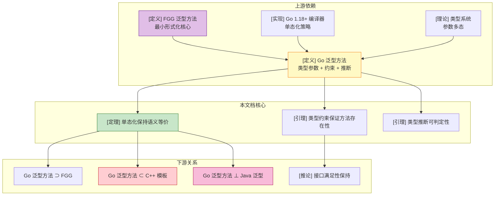
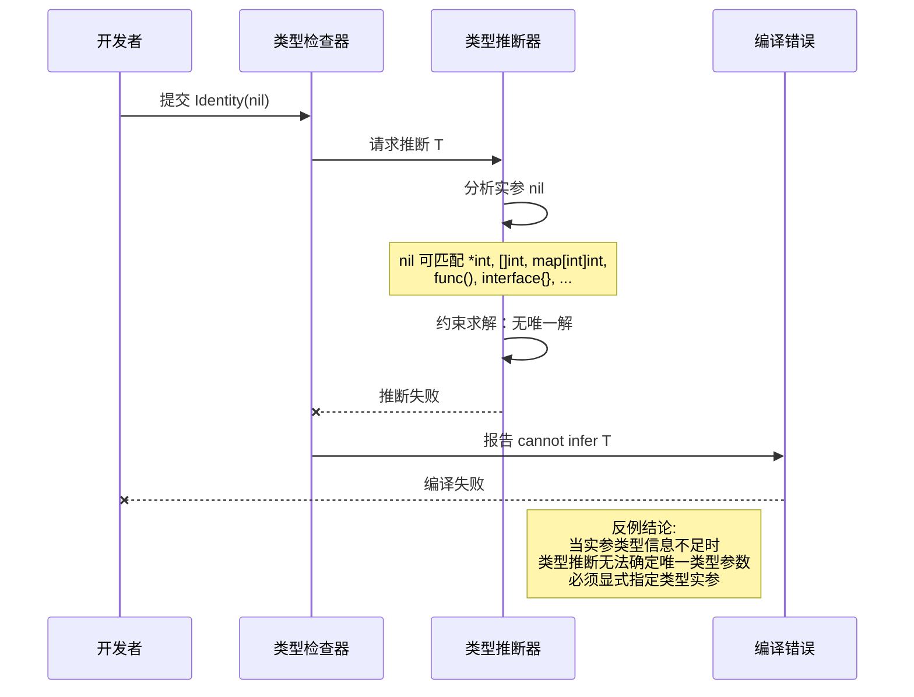
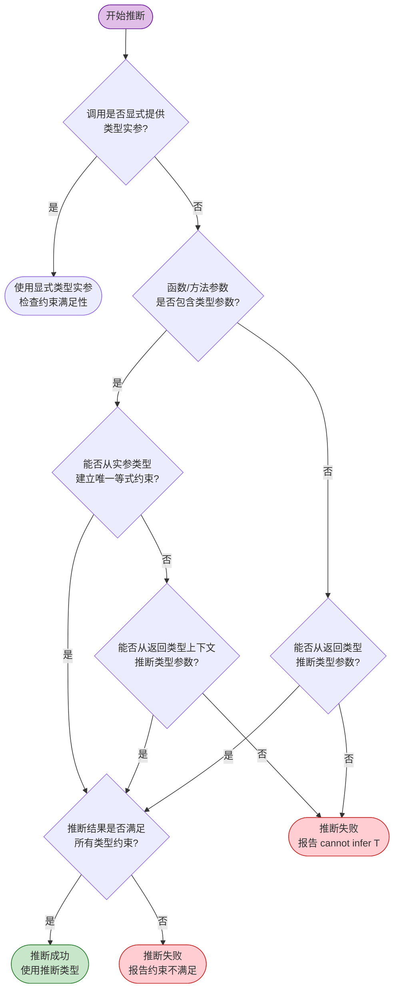

# Go 泛型方法 (Generic Methods)

> **位置**: `deep/02-language-analysis/Go/Go-Generic-Methods.md`
> **前置知识**: [Featherweight Generic Go (FGG)](./Go/05-Extension-Generics/FGG-Calculus.md)
> **关联可视化**: 详见本文末尾"关联可视化资源"

---

## 1. 概念定义 (Definitions)

### 1.1 泛型方法的核心语法

**定义 1 (Go 泛型方法语法)**:

```
方法声明:
  MethodDecl ::= func (x Receiver[T̄]) m[Φ](y₁ t₁, ..., yₙ tₙ) t_r { body }

类型形参列表:
  Φ ::= T₁ S₁, ..., Tₙ Sₙ

类型约束:
  S ::= interface { spec* }

方法调用:
  Call ::= e.m[Ψ](e₁, ..., eₙ)
```

**直观解释**: Go 泛型方法允许在方法接收者或方法自身上声明类型参数，使得同一段方法体可以作用于多种不同类型，而无需通过接口动态分发或代码复制。

**定义动机**: 如果没有泛型方法，开发者必须为每种类型重复编写逻辑相同的方法（如 `SortIntSlice`、`SortStringSlice`），或者放弃静态类型安全而使用 `interface{}` 和类型断言。泛型方法将"代码复用"与"编译期类型检查"统一起来。

### 1.2 类型参数、类型约束与类型推断

**定义 2 (类型参数 Type Parameter)**:

类型参数是在泛型方法声明中引入的形式化类型占位符，在方法调用时通过显式实例化或类型推断被替换为具体类型。

```
类型参数: Φ = T₁ S₁, ..., Tₙ Sₙ

其中:
  - Tᵢ 是类型变量，在方法作用域内唯一
  - Sᵢ 是类型约束，限定 Tᵢ 可被替换的类型集合
```

**直观解释**: 类型参数就像方法的"类型层面的形参"，它使得方法能够声明"我对任意满足某约束的类型 T 进行操作"。

**定义动机**: 没有类型参数，方法只能对固定类型或接口类型进行操作。类型参数将类型本身提升为可参数化的对象，使得算法（如排序、搜索、映射）可以跨类型复用，同时保持静态类型安全。

**定义 3 (类型约束 Type Constraint)**:

类型约束是一个接口类型，定义了类型参数可被实例化的类型集合。

```
约束满足关系:
  τ satisfies S  当且仅当  τ 实现了接口 S 中声明的所有方法，
  且 τ 的底层类型满足 S 中的类型集合要求（如 ~int | ~float64）
```

**直观解释**: 类型约束回答"哪些类型可以替换 T？"——它通过方法要求、类型并集或底层类型等价来划定可接受类型的边界。

**定义动机**: 如果类型参数没有约束，就等价于 `any`，无法表达"T 必须支持比较"或"T 必须实现 Stringer"等关键限制。约束系统使得泛型方法在实例化时能够获得足够的方法信息，从而保证单态化后的方法调用是良定义的。

**定义 4 (类型推断 Type Inference)**:

Go 泛型方法的类型推断是一种基于约束求解的编译期算法，允许在调用泛型方法时省略部分或全部类型实参。

```
显式实例化:  e.m[int, string](args)
隐式推断:    e.m(args)   // 编译器从实参类型推断 T=int, S=string
```

**直观解释**: 类型推断让泛型方法的调用语法尽可能接近普通方法调用，减少显式类型标注的噪音。

**定义动机**: 如果没有类型推断，每次调用泛型方法都需要显式写出所有类型实参（如 `m[int, string](x)`），这会显著降低代码可读性。类型推断通过编译期约束求解，在保持类型安全的前提下提升 ergonomics。

### 1.3 泛型方法与接口满足性

**定义 5 (泛型方法的接口满足性)**:

一个命名类型 `n[τ̄]` 满足接口 `I`（即 `n[τ̄]` implements `I`），当且仅当对于 `I` 中声明的每个方法 `m`，`n[τ̄]` 的方法集中存在一个泛型方法 `m[Ψ]`，使得在将 `n[τ̄]` 的类型参数代入后，`m[Ψ]` 的签名与 `I` 中 `m` 的签名匹配。

```
n[τ̄] implements I  ⇔
  ∀m ∈ methods(I), ∃m[Ψ] ∈ methods(n[τ̄]) :
    after substituting type params of n with τ̄,
    signature(m[Ψ]) = signature(I.m)
```

**直观解释**: 泛型方法不会"自动"让类型满足接口——只有当类型参数被具体化后，生成的方法签名与接口要求完全匹配时，接口满足性才成立。

**定义动机**: 这是连接 Go 泛型与 Go 接口系统的关键桥梁。Go 的接口满足性是隐式的（没有 `implements` 关键字），泛型方法的引入不能破坏这一核心设计。该定义确保了泛型代码与现有接口代码的兼容性。

### 1.4 泛型方法的单态化语义

**定义 6 (泛型方法单态化)**:

泛型方法的单态化是将带有类型参数的方法声明翻译为多个无类型参数的具体方法副本的编译期过程。

```
单态化函数 mono(MethodDecl, Ψ):

输入: 泛型方法声明 func (x Receiver[T̄]) m[Φ](y₁ t₁, ..., yₙ tₙ) t_r { body }
      类型实参列表 Ψ = τ₁, ..., τₙ

输出: 具体方法声明 func (x Receiver'[T̄']) m'(y₁ t₁', ..., yₙ tₙ') t_r' { body' }

其中:
  θ = [Φ ↦ Ψ]  (将方法类型形参替换为类型实参)
  Receiver'[T̄'] = θ(Receiver[T̄])
  tᵢ' = θ(tᵢ)
  t_r' = θ(t_r)
  body' = θ(body)
  m' = 为 (m, Ψ) 生成的新方法名
```

**直观解释**: 单态化就像为泛型方法的每个具体使用场景"按需复制粘贴"一份专属代码，最终消除所有类型参数。

**定义动机**: Go 编译器选择单态化而非类型擦除作为泛型实现策略，核心动机是零运行时开销和保持 Go 的值语义。形式化地定义单态化语义，使我们能够严格证明：泛型方法的执行行为等价于其单态化后的具体方法，从而为"编译期泛型无运行时开销"提供理论基础。

> **推断 [Theory→Model]**: FGG 演算采用单态化语义（理论层面），意味着泛型方法在模型层面不存在运行时的类型参数信息。
>
> **推断 [Model→Implementation]**: 因此 Go 1.18+ 编译器在实现层面必须为每个泛型方法的实例化生成独立代码副本，无法像 Java 泛型方法那样依赖运行时的类型擦除和装箱。

---

## 2. 属性推导 (Properties)

### 2.1 从泛型方法定义推导的核心性质

**性质 1 (泛型方法保持类型安全)**:

若泛型方法声明 `func (x R[T̄]) m[Φ](y₁ t₁, ..., yₙ tₙ) t_r { body }` 在类型环境 Δ 下是良类型的，且调用点 `e.m[Ψ](args)` 也是良类型的，则该调用在执行时不会因类型错误而 stuck。

**推导**:

1. 由定义 3（类型约束），类型环境 Δ 要求每个类型参数 Tᵢ 满足其约束 Sᵢ。
2. 由定义 5（接口满足性），调用点的类型实参 Ψ 必须满足方法接收者和参数的所有约束。
3. 由定义 6（单态化），单态化后的具体方法 `m_Ψ` 的签名是原方法签名在替换 θ=[Φ↦Ψ] 下的结果。
4. 由于 θ 保持类型约束的满足关系，单态化后的方法体 `θ(body)` 中的每个操作都作用于兼容类型。
5. 因此，调用 `e.m[Ψ](args)` 的执行等价于单态化后的具体方法调用，不会出现类型错误导致的 stuck。∎

**性质 2 (类型约束保证方法存在性)**:

若类型参数 T 的约束 S 包含方法规范 `m(x₁ t₁, ..., xₙ tₙ) t_r`，则对于任何满足 `τ satisfies S` 的具体类型 τ，τ 的方法集中必然包含签名兼容的方法 m。

**推导**:

1. 由定义 3，约束满足 `τ satisfies S` 意味着 τ 实现了接口 S 中声明的所有方法规范。
2. 方法规范 `m(x₁ t₁, ..., xₙ tₙ) t_r` 是 S 的一部分。
3. 因此 τ 必须实现该方法规范，即 τ 的方法集中存在方法 m，其参数和返回类型与规范匹配。
4. 这保证了在泛型方法体中调用 `x.m(...)`（其中 x 的类型受约束 S 限制）在单态化后总是能找到对应方法。∎

**性质 3 (泛型方法单态化保持语义等价)**:

对于任意良类型的泛型方法调用 `e.m[Ψ](args)`，其执行结果与单态化后的具体方法调用 `mono(e).m_Ψ(mono(args))` 的执行结果相同（值结构同构）。

**推导**:

1. 由定义 6，单态化仅对方法声明和调用点进行类型替换，不改变表达式的操作语义规则。
2. 泛型方法体中的控制流（if、for、return）在替换后保持不变。
3. 方法调用和字段选择的归约规则在 FGG/FG 中完全相同。
4. 由 FGG-Calculus 中的引理 4.2（单态化保持方法查找），单态化后的接收者类型 `mono(R)` 具有方法 `m_Ψ`，且其签名匹配。
5. 因此，原调用和单态化调用的归约链一一对应，最终值结构同构。∎

**性质 4 (泛型方法类型推断的可判定性)**:

对于任意良类型的泛型方法调用，若其实参类型信息足够，则编译器可以在有限时间内完成类型推断或报告推断失败。

**推导**:

1. Go 的类型推断算法基于约束生成和约束求解。
2. 每个实参类型为对应类型参数生成一个等式约束或子类型约束。
3. 泛型方法的类型参数数量是有限的（设为 k）。
4. 约束求解通过逐步代换和统一进行，每一步都减少未知类型参数的数量。
5. 由于类型参数数量有限，且 Go 的类型系统禁止无限递归的类型参数依赖，求解过程必然在 O(k²) 步内终止。∎

---

## 3. 关系建立 (Relations)

### 3.1 Go 泛型方法与 FGG 演算的关系

**关系 1**: Go 泛型方法 `⊃` FGG 泛型方法（Go 泛型方法的表达能力严格包含 FGG）

**论证**:

- **编码存在性**: 任何 FGG 中的泛型方法声明都可以直接映射为 Go 1.18+ 的泛型方法语法。FGG 的 `func (x t[Φ]) m[Ψ](...) t_r { e }` 对应 Go 的 `func (x t[Φ]) m[Ψ](...) t_r { e }`。
- **分离结果**: Go 泛型方法支持 FGG 不支持的实际特性，如类型推断、更复杂的类型约束组合（并集、交集）、以及底层类型约束 `~t`。因此 Go 泛型方法的表达能力严格强于 FGG。
- **语义兼容性**: 在 FGG 子集上，Go 泛型方法的单态化语义与 FGG 的单态化语义完全一致。

### 3.2 Go 泛型方法与 C++ 模板的关系

**关系 2**: Go 泛型方法 `⊂` C++ 模板方法（Go 泛型方法的表达能力弱于 C++ 模板）

**论证**:

- **编码存在性**: 任何 Go 泛型方法都可以编码为 C++ 模板方法。Go 的 `func m[T comparable](x T)` 对应 C++ 的 `template<typename T> void m(T x)`（配合 `requires` 或 SFINAE 约束）。
- **分离结果**: C++ 模板支持 Go 不支持的关键特性：
  - 特化（Specialization）：C++ 可以为特定类型提供完全不同的模板实现
  - 非类型模板参数：C++ 允许 `template<int N>`
  - 编译期计算（TMP）：C++ 模板是图灵完备的编译期语言
- **类型检查差异**: Go 在泛型方法声明处进行完整的类型检查，而 C++ 在模板实例化时才进行类型检查（two-phase lookup）。这使得 Go 泛型方法的错误报告更早、更友好，但表达能力受限。

### 3.3 Go 泛型方法与 Java 泛型的关系

**关系 3**: Go 泛型方法 `⊥` Java 泛型方法（两者不可直接比较，各有优劣）

**论证**:

- **实现策略差异**: Go 采用单态化，Java 采用类型擦除。这导致两者在运行时语义上存在根本差异：
  - Go 泛型方法调用在运行时是直接的方法分派，无装箱开销
  - Java 泛型方法在运行时类型参数被擦除，基本类型需要装箱
- **表达能力对比**:
  - Java 支持通配符（`? extends T`、`? super T`）和更复杂的变型（variance）系统，Go 不支持
  - Go 支持底层类型约束（`~int`）和类型并集，Java 不支持
- **结论**: 两者在表达能力上各有扩展方向，不存在严格的包含关系。`⊥` 表示它们是不可直接比较的两种设计。

### 3.4 多维矩阵对比图

| 特性 | Go 泛型方法 | C++ 模板方法 | Java 泛型方法 | 推导依据 |
|------|------------|-------------|--------------|---------|
| 编译期类型检查 | ✅ 完整 | ⚠️ 两阶段 | ✅ 完整 | Go/Java 在声明处检查；C++ 主要依赖实例化时检查 |
| 零运行时开销 | ✅ 是 | ✅ 是 | ❌ 否（擦除+装箱） | Go/C++ 使用单态化；Java 使用类型擦除 |
| 方法特化 | ❌ 不支持 | ✅ 支持 | ❌ 不支持 | Go/Java 无特化语法；C++ 有 `template<>` |
| 类型推断 | ✅ 支持 | ✅ 支持 | ✅ 支持 | 三者均支持基于实参的类型推断 |
| 通配符/变型 | ❌ 不支持 | ✅ 支持 | ✅ 支持 | Go 故意简化设计；C++ 通过模板参数推导实现；Java 有 `? extends T` |
| 底层类型约束 | ✅ 支持 | ✅ 支持 | ❌ 不支持 | Go 有 `~t`；C++ 有 `std::is_same`；Java 无此概念 |

### 3.5 概念依赖图



**图说明**:

- 本图展示了 Go 泛型方法在知识体系中的位置：上游依赖 FGG 的形式化基础和类型系统理论，下游与 C++、Java 的泛型方法形成对比关系。
- 核心定理（单态化保持语义等价）是连接理论与实现的桥梁。
- 详见 [FGG-Calculus](./Go/05-Extension-Generics/FGG-Calculus.md)

---

## 4. 论证过程 (Argumentation)

### 4.1 泛型方法不破坏接口满足性的辅助引理

**引理 4.1 (泛型方法实例化后的签名唯一性)**:

设类型 `n[τ̄]` 有一个泛型方法 `m[Φ]`，对于固定的类型实参 Ψ，实例化后的方法 `m[Ψ]` 在 `n[τ̄]` 的方法集中具有唯一的签名。

**证明**:

1. **前提分析**: 在 Go 中，一个命名类型 `n` 不能声明两个同名方法 `m`，即使它们的类型参数不同。Go 规范禁止"方法重载"。
2. **构造/推导**: 若 `n` 声明了 `func (x n[T̄]) m[Φ](...) t_r { ... }`，则对于 `n` 的任何其他方法 `m'`，必有 `m' ≠ m`（按名字区分）。
3. **实例化分析**: 单态化为 `m[Φ]` 生成具体副本时，每个 Ψ 对应一个唯一的具体方法名 `m_Ψ`。
4. **结论**: 因此，对于固定的 Ψ，`m_Ψ` 在 `n_τ̄` 的方法集中签名唯一。∎

**引理 4.2 (接口满足性在单态化下保持)**:

若 `n[τ̄] implements I`，则单态化后的具体类型 `n_τ̄` 也满足接口 `I_τ̄`（其中 `I_τ̄` 是 `I` 的单态化结果）。

**证明**:

1. **前提分析**: `n[τ̄] implements I` 意味着对于 `I` 中声明的每个方法 `m_m`，`n[τ̄]` 的方法集中存在泛型方法 `m[Φ]`，使得在代入 `n` 的类型参数后，签名匹配。
2. **构造/推导**: 单态化后，`n_τ̄` 的方法集中包含 `m_Ψ`（对于所有实例化点 Ψ）。
3. **签名匹配**: 由定义 6，单态化通过同态替换保持方法签名。因此若原签名匹配 `I.m_m`，则 `m_Ψ` 的签名也匹配 `I_τ̄.m_m`。
4. **结论**: `n_τ̄ implements I_τ̄` 成立。∎

### 4.2 泛型方法类型推断的约束求解

**引理 4.3 (类型推断的约束系统一致性)**:

若泛型方法调用 `e.m(args)` 的类型推断成功，则推断出的类型实参 Ψ 满足该方法的所有类型约束。

**证明**:

1. **前提分析**: 类型推断算法从实参类型生成约束。对于每个实参 `argᵢ : τᵢ` 和对应形参 `yᵢ : tᵢ[T̄]`，生成等式约束 `τᵢ = tᵢ[T̄]`。
2. **构造/推导**: 约束求解通过代换逐步确定类型参数的值。当推断出候选 Ψ 后，编译器检查 `Δ ⊢ Ψ satisfies Φ`。
3. **约束验证**: 若某个类型参数 `Tⱼ = τⱼ` 不满足约束 `Sⱼ`，编译器会报告推断失败，而不是生成不满足约束的实例化。
4. **结论**: 推断成功的 Ψ 必然满足所有类型约束。∎

> **推断 [Control→Execution]**: 由于 Go 泛型方法的类型约束系统（控制层）在编译期拒绝了所有不满足约束的实例化，执行层的单态化代码中不会出现因类型参数不匹配导致的方法查找失败。
>
> **推断 [Execution→Data]**: 因此单态化后的具体方法调用（执行层）在运行时能够保证方法调用的良定义性，从而保证数据层（程序输出和状态）的语义正确性。

---

## 5. 形式证明 (Proofs)

### 5.1 泛型方法不破坏接口满足性

**定理 5.1 (泛型方法不破坏接口满足性)**:

设 P 是一个包含泛型方法的良类型 Go 程序。若 P 中的某个具体类型 `n[τ̄]` 满足接口 `I`，则 P 的单态化程序 mono(P) 中对应的类型 `n_τ̄` 也满足接口 `I_τ̄`。

**证明**:

**步骤 1: 建立对应关系**

我们需要证明：对于 `n[τ̄]` 的每个方法 `m`，若 `m` 对 `I` 的满足性有贡献，则单态化后的 `m_Ψ` 对 `I_τ̄` 的满足性也有贡献。

设 `I` 声明了方法 `m_m(y₁ u₁, ..., yₙ uₙ) u_r`。`n[τ̄] implements I` 意味着：

```
∃ method d ∈ methods(n[τ̄]) :
  d 的名字 = m_m
  且 d 的签名（在代入 n 的类型参数后）= (y₁ u₁, ..., yₙ uₙ) u_r
```

**步骤 2: 分析泛型方法的两种情况**

- **情况 A: `m_m` 不是泛型方法**
  - 则 `d` 的签名固定不变。单态化不改变非泛型方法的签名。
  - 因此 `n_τ̄` 中 `m_m` 的签名与原签名相同，自然满足 `I_τ̄.m_m`。

- **情况 B: `m_m` 是泛型方法 `m_m[Φ]`**
  - 设 `d` 的声明为 `func (x n[Φₙ]) m_m[Φ](y₁ t₁, ..., yₙ tₙ) t_r { body }`。
  - 在 `n[τ̄]` 中，`n` 的类型参数已被替换为 `τ̄`，因此 `d` 的实际签名是 `θₙ(t₁), ..., θₙ(tₙ) → θₙ(t_r)`，其中 `θₙ = [Φₙ ↦ τ̄]`。
  - 由于 `n[τ̄] implements I`，这个签名与 `I.m_m` 匹配。
  - 单态化后，`n_τ̄` 中 `m_m` 对应的具体方法 `m_m_Ψ` 的签名是 `θ(t₁), ..., θ(tₙ) → θ(t_r)`，其中 `θ = [Φₙ ↦ τ̄, Φ ↦ Ψ]`。
  - 接口 `I_τ̄` 中 `m_m` 的签名也经过相同的替换 `θₙ`。
  - 因此签名匹配关系保持。

**步骤 3: 结论**

对于 `I` 中声明的所有方法，单态化后的匹配关系都保持。因此：

```
n[τ̄] implements I  ⟹  n_τ̄ implements I_τ̄
```

∎

### 5.2 泛型方法的单态化保持语义

**定理 5.2 (泛型方法单态化保持语义)**:

设 P 是包含泛型方法的良类型程序，`e.m[Ψ](args)` 是 P 中的一个泛型方法调用。则：

```
P ⊢ e.m[Ψ](args) ↓ v    ⟺    mono(P) ⊢ mono(e).m_Ψ(mono(args)) ↓ φ(v)
```

其中 `v` 和 `φ(v)` 是语义对应的结果（值结构同构）。

**证明**:

**步骤 1: 建立表达式对应关系**

定义对应关系 φ：

- 对于结构体值 `n[τ̄]{f₁: v₁, ..., fₖ: vₖ}`，`φ(v) = n_τ̄{f₁: φ(v₁), ..., fₖ: φ(vₖ)}`
- 对于基本类型值，`φ(v) = v`（保持不变）

**步骤 2: 证明单步归约保持对应关系**

对 `e.m[Ψ](args)` 的归约规则进行案例分析：

- **案例 1: 接收者是结构体值**
  - 在 P 中：`n[τ̄]{...}.m[Ψ](args) → [x ↦ receiver, yᵢ ↦ argsᵢ]body`
  - 在 mono(P) 中：`n_τ̄{...}.m_Ψ(φ(args)) → [x ↦ φ(receiver), yᵢ ↦ φ(argsᵢ)]θ(body)`
  - 由引理 4.2，mono(P) 中 `n_τ̄` 的方法 `m_Ψ` 的体正是 `θ(body)`。
  - 由于 θ 是同态替换，`θ[body](x ↦ receiver, ...)` 的语义对应关系保持。
  - 因此 `φ(e) → φ(e')`。

- **案例 2: 接收者需要先行归约**
  - 若 `e → e'`，则由归纳假设 `φ(e) → φ(e')`。
  - 方法调用上下文不改变，因此 `e.m[Ψ](args) → e'.m[Ψ](args)` 对应 `φ(e).m_Ψ(φ(args)) → φ(e').m_Ψ(φ(args))`。

- **案例 3: 参数需要先行归约**
  - 与案例 2 类似，参数归约的对应关系保持。

**步骤 3: 证明多步归约保持对应关系**

由步骤 2，单步归约保持 φ。通过数学归纳法，对归约步数 n 进行归纳：

- 基例 (n=0): 表达式已经是值，φ 直接适用。
- 归纳步: 假设 n 步归约保持 φ。对于 n+1 步归约，前 n 步由归纳假设保持，最后一步由步骤 2 保持。

**步骤 4: 终止性等价**

若 `e.m[Ψ](args)` 在 P 中归约到值 v，则在 mono(P) 中 `φ(e.m[Ψ](args))` 归约到 `φ(v)`。反之亦然，因为 φ 是双射。

**步骤 5: 结论**

泛型方法调用与其单态化版本在语义上等价。∎

**关键案例分析**:

- **案例 A: 泛型方法调用中的接口值接收者**
  - 若 `e` 的类型是接口 `I`，则 `e.m[Ψ](args)` 在运行时通过接口的动态类型分派。
  - 单态化后，`e` 的动态类型 `n[τ̄]` 变为 `n_τ̄`，接口 `I` 变为 `I_τ̄`。
  - 由定理 5.1，`n_τ̄` 满足 `I_τ̄`，因此动态分派仍然成功。
  - 分派到的具体方法 `m_Ψ` 的签名匹配，语义保持。

- **案例 B: 嵌套泛型方法调用**
  - 若泛型方法体 `body` 中包含另一个泛型方法调用 `f[Ψ'](args')`。
  - 单态化后，`θ(body)` 中的调用变为 `f_Ψ'(θ(args'))`。
  - 由引理 4.3 和单态化的闭包计算，这个嵌套调用也在 mono(P) 中有定义。
  - 递归应用定理 5.2，嵌套调用的语义等价性保持。

---

## 6. 实例与反例 (Examples & Counter-examples)

### 6.1 正例：泛型方法的单态化

**示例 6.1: 泛型方法 Max 及其单态化**

```go
package main

type Number interface {
    ~int | ~float64
}

type Container[T Number] struct {
    value T
}

func (c *Container[T]) Max(other T) T {
    if c.value > other {
        return c.value
    }
    return other
}

func main() {
    c := &Container[int]{value: 10}
    _ = c.Max(5)
}
```

**逐步推导**:

1. 程序中显式的实例化点有：`Container[int]`（类型声明和结构体字面量）、`Max[int]`（方法调用）。
2. `Max[int]` 的方法体中无额外泛型调用，闭包计算结束。
3. 单态化后生成 `Container_int` 和 `Max_int`。
4. 生成的 FG 程序中，`Max_int` 的接收者为 `*Container_int`，参数为 `int`，返回 `int`。
5. 方法体中的 `>` 运算符在 `int` 上良定义，程序正确执行。

### 6.2 反例 1：类型约束不满足导致编译错误

**反例 6.1: 约束违反导致类型检查失败**

```go
package main

type Comparable interface {
    ~int | ~float64 | ~string
}

type Sorter[T Comparable] struct {
    items []T
}

func (s *Sorter[T]) Sort() {
    // 假设使用某种排序算法
}

func main() {
    type MyStruct struct { x int }

    // 错误：MyStruct 不满足约束 Comparable
    var s *Sorter[MyStruct] = &Sorter[MyStruct]{}
    s.Sort()
}
```

**分析**:

- **违反的前提**: `MyStruct` 的底层类型是 `struct { x int }`，不在 `Comparable` 约束的类型集合 `{~int, ~float64, ~string}` 中。
- **导致的异常**: 编译器在实例化点 `Sorter[MyStruct]` 处报告类型错误：`MyStruct does not satisfy Comparable`。
- **结论**: 约束系统是编译期的安全闸门。如果允许此程序通过，单态化后 `Sorter_MyStruct` 在需要比较操作时会出现未定义行为。

### 6.3 反例 2：泛型方法无法推断类型参数

**反例 6.2: 类型推断失败的场景**

```go
package main

func Identity[T any](x T) T {
    return x
}

func main() {
    // 错误：无法推断 T 的类型
    _ = Identity(nil)

    // 错误：无法从空接口推断具体类型
    var x interface{} = 42
    _ = Identity(x)
}
```

**分析**:

- **违反的前提**: Go 的类型推断要求从实参类型能够唯一确定类型参数。`nil` 没有具体类型，可以被赋值给任何指针、切片、map、channel、函数或接口类型。
- **导致的异常**: 编译器报告 `cannot infer T`。
- **结论**: 类型推断不是万能的。当实参类型信息不足（如 `nil`、空接口值、或约束过于宽泛）时，必须显式提供类型实参，如 `Identity[*int](nil)`。

### 6.4 反例 3：不支持类型参数上的方法调用

**反例 6.3: 类型参数上的方法调用边界**

Go 泛型方法的一个关键限制是：**类型参数不能作为方法接收者**。以下代码在 Go 中非法：

```go
package main

type MyType[T any] struct {
    value T
}

// 这是允许的：在命名类型 MyType[T] 上定义方法
func (m MyType[T]) Get() T {
    return m.value
}

// 这是不允许的：类型参数 T 本身不能是接收者
// func (t T) String() string { ... }  // 编译错误：invalid receiver type T
```

**分析**:

- **违反的前提**: 用户可能期望类型参数可以像具体类型一样拥有方法集，或者可以在类型参数上定义新方法。
- **导致的异常**: 编译器报告 `invalid receiver type T` 或类似错误。
- **结论**: Go 的类型参数是"抽象的占位符"，不是具体的命名类型。方法必须定义在具体的命名类型（如 `MyType[T]`）上，而不能定义在类型参数 `T` 本身上。这限制了某些高级泛型编程模式（如 C++ 的 CRTP 或 Rust 的 trait 扩展），但保持了语言语义的简单性。

### 6.5 反例场景图：类型推断失败



**图说明**:

- 本图展示了反例 6.2 的执行流程：开发者调用 `Identity(nil)`，类型推断器因 `nil` 的多态性无法确定唯一的 `T`。
- "违反的前提"是"实参类型足以唯一确定类型参数"。
- "导致的异常"是编译器报告推断失败。
- 结论是类型推断有其边界，需要显式类型标注作为补充。

### 6.6 决策树图：泛型方法类型推断



**图说明**:

- 本图展示了 Go 编译器对泛型方法调用进行类型推断的决策流程。
- 菱形节点表示判断条件，椭圆形节点表示最终结论。
- 优先从函数参数推断，若失败则尝试从返回类型上下文推断，最后才报告失败。
- 详见 [FGG-Calculus](./Go/05-Extension-Generics/FGG-Calculus.md)

---

## 7. 关联可视化资源

本文档涉及的可视化资源已按项目规范归档，详见项目根目录的 [`VISUAL-ATLAS.md`](../../../VISUAL-ATLAS.md)。

建议关联查看的可视化条目：

- `mindmaps/Go-Complete-Concept-Map.mmd` — Go 语言形式化分析的完整概念地图
- `decision-trees/Type-Inference-Decision-Tree.mmd` — 类型推断决策流程
- `counter-examples/Go-Generic-Method-Inference-Failure.mmd` — 泛型方法推断失败反例场景图
