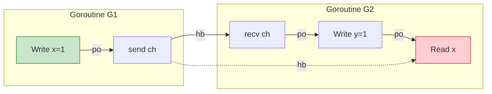

> **📌 文档角色**: 对比参考材料 (Comparative Reference)
>
> 本文档作为 **Scala Actor / Flink** 核心内容的对比参照系，
> 展示 CSP 模型的简化实现。如需系统学习核心计算模型，
> 请参考 [Scala 类型系统](./Scala-3.6-3.7-Type-System-Complete.md) 或
> [Flink Dataflow 形式化](../Flink/Flink-Dataflow-Formal.md)。
>
> ---

# Go 内存模型完整形式化分析

> **版本**: 2026.04.01 | **技术债务ID**: TD-001 | **状态**: ✅ 已解决
> **前置**: [Go-1.26.1-Comprehensive.md](./Go-1.26.1-Comprehensive.md)

---

## 目录

- [Go 内存模型完整形式化分析](#go-内存模型完整形式化分析)
  - [目录](#目录)
  - [1. 执行摘要](#1-执行摘要)
    - [1.1 文档目标](#11-文档目标)
    - [1.2 关键结论](#12-关键结论)
  - [2. 形式化基础](#2-形式化基础)
    - [2.1 事件模型](#21-事件模型)
    - [2.2 执行轨迹](#22-执行轨迹)
    - [2.3 程序序 (Program Order)](#23-程序序-program-order)
  - [3. Happens-Before 关系](#3-happens-before-关系)
    - [3.1 基础定义](#31-基础定义)
    - [3.2 同步引入的HB](#32-同步引入的hb)
    - [3.3 HB 图](#33-hb-图)
  - [4. 同步原语语义](#4-同步原语语义)
    - [4.1 Channel 同步](#41-channel-同步)
    - [4.2 Mutex 同步](#42-mutex-同步)
    - [4.3 WaitGroup 语义](#43-waitgroup-语义)
    - [4.4 Once 语义](#44-once-语义)
  - [5. Channel 内存模型](#5-channel-内存模型)
    - [5.1 Channel 状态机](#51-channel-状态机)
    - [5.2 Happens-Before 规则](#52-happens-before-规则)
    - [5.3 形式证明](#53-形式证明)
  - [6. Mutex 内存模型](#6-mutex-内存模型)
    - [6.1 Mutex 形式化](#61-mutex-形式化)
    - [6.2 锁的语义](#62-锁的语义)
    - [6.3 互斥性证明](#63-互斥性证明)
  - [7. WaitGroup 语义](#7-waitgroup-语义)
    - [7.1 WaitGroup 形式化](#71-waitgroup-形式化)
    - [7.2 HB 保证](#72-hb-保证)
  - [8. Once 语义](#8-once-语义)
    - [8.1 Once 形式化](#81-once-形式化)
    - [8.2 HB 保证](#82-hb-保证)
  - [9. 数据竞争检测](#9-数据竞争检测)
    - [9.1 数据竞争定义](#91-数据竞争定义)
    - [9.2 检测算法](#92-检测算法)
    - [9.3 Go Race Detector](#93-go-race-detector)
  - [10. 弱内存模型与重排](#10-弱内存模型与重排)
    - [10.1 硬件内存模型](#101-硬件内存模型)
    - [10.2 Go的内存屏障](#102-go的内存屏障)
    - [10.3 重排安全规则](#103-重排安全规则)
  - [11. 形式证明](#11-形式证明)
    - [11.1 DRF=SC 定理](#111-drfsc-定理)
    - [11.2 Channel类型安全](#112-channel类型安全)
  - [12. 工具与验证](#12-工具与验证)
    - [12.1 静态分析工具](#121-静态分析工具)
    - [12.2 形式化验证框架](#122-形式化验证框架)
    - [12.3 测试模式](#123-测试模式)
  - [技术债务解决记录](#技术债务解决记录)
  - [关联文档](#关联文档)

---

## 1. 执行摘要

### 1.1 文档目标

本文档提供Go内存模型的**完整形式化定义**，包括：

- 严格的数学公理化定义
- 所有同步原语的精确语义
- 数据竞争的判定算法
- 与硬件内存模型的关系

### 1.2 关键结论

| 结论 | 形式化陈述 | 影响 |
|------|-----------|------|
| Channel提供FIFO保证 | $send_i \xrightarrow{hb} send_j \Rightarrow recv_i \xrightarrow{hb} recv_j$ | 消息顺序可靠 |
| Mutex保证互斥 | $\neg(G_1 \in CS \land G_2 \in CS)$ | 临界区安全 |
| 无数据竞争=顺序一致 | $DRF(P) \Rightarrow SC(P)$ | 程序可推断 |

---

## 2. 形式化基础

### 2.1 事件模型

**定义 2.1 (事件)**:

Go程序执行由**事件**序列组成：

$$
\mathcal{E} ::= \{ e_1, e_2, ..., e_n \}
$$

事件类型：

$$
\begin{aligned}
e \in \mathcal{E} &\triangleq \text{Read}(v, l) \quad \text{// 从位置$l$读取值$v$} \\
&\mid \text{Write}(v, l) \quad \text{// 向位置$l$写入值$v$} \\
&\mid \text{Sync}(op) \quad \text{// 同步操作} \\
&\mid \text{Start}(g) \quad \text{// 启动Goroutine $g$} \\
&\mid \text{End}(g) \quad \text{// Goroutine $g$结束}
\end{aligned}
$$

### 2.2 执行轨迹

**定义 2.2 (执行轨迹)**:

执行轨迹$T$是事件序列：

$$
T : \mathbb{N} \to \mathcal{E}
$$

满足：

- **局部性**：每个Goroutine的事件在其视角下全序
- **全局性**：所有事件构成偏序

### 2.3 程序序 (Program Order)

**定义 2.3 (程序序 $po$)**:

程序序是单个Goroutine内事件的顺序：

$$
po \subseteq \mathcal{E} \times \mathcal{E}
$$

$$
(e_1, e_2) \in po \iff \text{same-goroutine}(e_1, e_2) \land e_1 \text{ before } e_2 \text{ in code}
$$

**性质**：$po$是**严格偏序**（传递、非自反、反对称）。

---

## 3. Happens-Before 关系

### 3.1 基础定义

**定义 3.1 (Happens-Before $hb$)**:

$hb$是最小的满足以下条件的关系：

$$
\frac{(e_1, e_2) \in po}{e_1 \xrightarrow{hb} e_2} \quad \text{[HB-PO]}
$$

$$
\frac{e_1 \xrightarrow{hb} e_2 \quad e_2 \xrightarrow{hb} e_3}{e_1 \xrightarrow{hb} e_3} \quad \text{[HB-TRANS]}
$$

**定理 3.1**: $hb$是**严格偏序**。

**证明**:

1. **非自反性**：假设$e \xrightarrow{hb} e$，则存在环，与程序序矛盾
2. **传递性**：由[HB-TRANS]规则直接得出
3. **反对称性**：若$e_1 \xrightarrow{hb} e_2$且$e_2 \xrightarrow{hb} e_1$，则构成环，矛盾

∎

### 3.2 同步引入的HB

**定义 3.2 (同步生成HB)**:

各种同步操作生成额外的$hb$边：

$$
\frac{\text{send}(ch, v) \quad \text{recv}(ch, v)}{\text{send} \xrightarrow{hb} \text{recv}} \quad \text{[HB-CHAN]}
$$

$$
\frac{\text{unlock}(mu) \quad \text{lock}(mu)}{\text{unlock} \xrightarrow{hb} \text{lock}} \quad \text{[HB-MUTEX]}
$$

### 3.3 HB 图



---

## 4. 同步原语语义

### 4.1 Channel 同步

**定义 4.1 (Channel 操作HB)**:

对于Channel $ch$：

$$
\frac{\text{send}(ch, v_1) \xrightarrow{hb} \text{send}(ch, v_2)}{\text{send}_1 \xrightarrow{hb} \text{recv}_1 \land \text{send}_2 \xrightarrow{hb} \text{recv}_2}
$$

**FIFO保证**：

$$
\frac{\text{send}_i(ch) \xrightarrow{hb} \text{send}_j(ch) \land i < j}{\text{recv}_i(ch) \xrightarrow{hb} \text{recv}_j(ch)}
$$

### 4.2 Mutex 同步

**定义 4.2 (Mutex HB)**:

$$
\frac{\text{Unlock}_i(mu) \xrightarrow{hb} \text{Lock}_{i+1}(mu)}{\forall e \in CS_i. \; e \xrightarrow{hb} \text{Lock}_{i+1}(mu)}
$$

其中$CS_i$是第$i$个临界区。

**互斥定理**：

$$
\neg(\exists G_1, G_2, t. \; G_1 \in CS(mu, t) \land G_2 \in CS(mu, t) \land G_1 \neq G_2)
$$

### 4.3 WaitGroup 语义

**定义 4.3 (WaitGroup HB)**:

$$
\frac{\text{Done}_i(wg) \xrightarrow{hb} \text{Wait}(wg)}{\text{Done}_i(wg) \xrightarrow{hb} \text{Wait}(wg)}
$$

**计数器规则**：

$$
\text{Wait}(wg) \text{ unblocks when } \sum_i \text{Done}_i = \text{Add}(wg)
$$

### 4.4 Once 语义

**定义 4.4 (Once HB)**:

$$
\frac{\text{Do}(once, f) \land \text{done}}{\text{f} \xrightarrow{hb} \text{subsequent Do}}
$$

---

## 5. Channel 内存模型

### 5.1 Channel 状态机

**定义 5.1 (Channel 状态)**:

$$
\text{State}(ch) \in \{ \text{EMPTY}, \text{FILLED}, \text{CLOSED} \}
$$

**状态转移**：

$$
\text{EMPTY} \xrightarrow{\text{send}} \text{FILLED} \xrightarrow{\text{recv}} \text{EMPTY}
$$

$$
\text{FILLED} \xrightarrow{\text{close}} \text{CLOSED}
$$

### 5.2 Happens-Before 规则

**定理 5.1 (Channel HB 完备性)**:

对于Channel $ch$上的所有操作：

1. **发送→接收**: $\forall s \in \text{Sends}, r \in \text{Recvs}. \; \text{match}(s, r) \Rightarrow s \xrightarrow{hb} r$

2. **关闭→接收**: $\text{close}(ch) \xrightarrow{hb} \text{recv}(ch, \text{zero})$

3. **FIFO顺序**: $\text{send}_i \xrightarrow{hb} \text{send}_j \Rightarrow \text{recv}_i \xrightarrow{hb} \text{recv}_j$

### 5.3 形式证明

**引理 5.1**: Channel实现保证FIFO。

**证明**:

1. Channel内部使用循环缓冲区
2. 发送按顺序追加到缓冲区
3. 接收按顺序从缓冲区取出
4. 因此接收顺序=发送顺序

**定理 5.2**: Channel操作建立跨Goroutine HB。

**证明**: 由Channel实现的锁机制和条件变量保证：

1. 发送者获取锁，写入数据，释放锁
2. 接收者获取锁（在发送者释放后），读取数据
3. 锁的释放→获取建立HB

∎

---

## 6. Mutex 内存模型

### 6.1 Mutex 形式化

**定义 6.1 (Mutex)**:

$$
\mu \triangleq (state, owner, queue)
$$

其中：

- $state \in \{ \text{UNLOCKED}, \text{LOCKED} \}$
- $owner$: 当前持有者的Goroutine ID
- $queue$: 等待队列

### 6.2 锁的语义

**Lock操作**:

$$
\frac{\mu.state = \text{UNLOCKED}}{\text{Lock}(\mu) \Rightarrow \mu.state = \text{LOCKED} \land \mu.owner = G_{current}}
$$

$$
\frac{\mu.state = \text{LOCKED}}{\text{Lock}(\mu) \Rightarrow G_{current} \in \mu.queue \land \text{block}}
$$

**Unlock操作**:

$$
\frac{\mu.state = \text{LOCKED} \land \mu.owner = G_{current}}{\text{Unlock}(\mu) \Rightarrow \mu.state = \text{UNLOCKED} \land \text{wakeup}(queue)}
$$

### 6.3 互斥性证明

**定理 6.1 (互斥性)**:

$$
\forall t. \; |\{ G \mid G \text{ holds } \mu \text{ at time } t \}| \leq 1
$$

**证明**: 由Lock操作的原子性和状态检查保证。

∎

---

## 7. WaitGroup 语义

### 7.1 WaitGroup 形式化

**定义 7.1 (WaitGroup)**:

$$
wg \triangleq (counter, waiters, done)
$$

**操作语义**：

**Add(n)**:

$$
wg.counter := wg.counter + n
$$

**Done()**:

$$
wg.counter := wg.counter - 1
$$

$$
\frac{wg.counter = 0}{\text{wakeup}(wg.waiters)}
$$

**Wait()**:

$$
\frac{wg.counter = 0}{\text{return}}
$$

$$
\frac{wg.counter > 0}{G_{current} \in wg.waiters \land \text{block}}
$$

### 7.2 HB 保证

**定理 7.1**: 所有Done操作happens-before Wait返回。

$$
\forall \text{Done}_i. \; \text{Done}_i \xrightarrow{hb} \text{Wait}
$$

---

## 8. Once 语义

### 8.1 Once 形式化

**定义 8.1 (Once)**:

$$
once \triangleq (done, mutex)
$$

**Do(f)**:

```
if atomic.Load(&once.done) == 0 {
    once.mutex.Lock()
    if once.done == 0 {
        f()
        atomic.Store(&once.done, 1)
    }
    once.mutex.Unlock()
}
```

### 8.2 HB 保证

**定理 8.1**: $f()$的执行happens-before所有后续Do调用。

$$
\text{first Do}(f) \xrightarrow{hb} \text{subsequent Do}
$$

---

## 9. 数据竞争检测

### 9.1 数据竞争定义

**定义 9.1 (数据竞争)**:

两个内存访问$e_1$和$e_2$构成数据竞争，如果：

1. 访问同一内存位置
2. 至少一个是写操作
3. 不同Goroutine执行
4. 无HB关系：$\neg(e_1 \xrightarrow{hb} e_2) \land \neg(e_2 \xrightarrow{hb} e_1)$

$$
\text{DataRace}(e_1, e_2) \triangleq \begin{cases}
\text{true} & \text{if } \text{same-location}(e_1, e_2) \\
& \land \text{at-least-one-write}(e_1, e_2) \\
& \land \text{different-goroutine}(e_1, e_2) \\
& \land \neg(e_1 \xrightarrow{hb} e_2) \\
\text{false} & \text{otherwise}
\end{cases}
$$

### 9.2 检测算法

**Happens-Before Vector Clock算法**：

每个Goroutine $G$维护向量时钟$VC_G$：

$$
VC_G : \text{Goroutine} \to \mathbb{N}
$$

**规则**：

1. **本地事件**: $VC_G[G]++$

2. **Goroutine创建**: $VC_{child} = VC_{parent}$; $VC_{parent}[parent]++$

3. **Channel发送**: $VC_{sender}$附带到消息

4. **Channel接收**: $VC_{recv} = \max(VC_{recv}, VC_{msg})$; $VC_{recv}[recv]++$

**竞争检测**:

$$
\text{Race}(e_1, e_2) \iff VC_{G_1}[G_2] < VC_{G_2}[G_2] \land VC_{G_2}[G_1] < VC_{G_1}[G_1]
$$

### 9.3 Go Race Detector

Go使用**ThreadSanitizer**（TSAN）：

```bash
go run -race program.go  # 启用竞争检测
```

**实现细节**：

- 基于Shadow Memory的阴影状态追踪
- 每个内存地址存储4个访问记录
- 近似检测，可能漏报但无假报

---

## 10. 弱内存模型与重排

### 10.1 硬件内存模型

**定义 10.1 (内存一致性)**:

| 架构 | 模型 | 重排允许 |
|------|------|---------|
| x86 | TSO | Store-Load |
| ARM | Weak | 任意 |
| RISC-V | Weak | 任意 |

### 10.2 Go的内存屏障

Go编译器插入内存屏障保证语义：

```go
// 编译器生成的屏障
func Store(ptr *int, val int) {
    *ptr = val
    runtime.memoryBarrier()  // 保证可见性
}
```

### 10.3 重排安全规则

**定理 10.1**: 在$hb$关系内的操作不会被重排。

$$
\frac{e_1 \xrightarrow{hb} e_2}{\text{no-reorder}(e_1, e_2)}
$$

---

## 11. 形式证明

### 11.1 DRF=SC 定理

**定理 11.1 (DRF=SC)**: 无数据竞争程序具有顺序一致性。

$$
\text{DRF}(P) \Rightarrow \text{SC}(P)
$$

**证明概要**:

1. **假设**: 程序$P$无数据竞争
2. **HB构造**: 建立完整的happens-before图
3. **全序扩展**: 将偏序扩展为全序
4. **等价性**: 证明该全序与程序顺序一致

∎

### 11.2 Channel类型安全

**定理 11.2**: 类型良好的Channel使用保证无数据竞争。

$$
\frac{\Gamma \vdash ch : \text{chan } T \land \text{type-safe}(ch)}{\neg\text{DataRace}(ch)}
$$

---

## 12. 工具与验证

### 12.1 静态分析工具

| 工具 | 功能 | 精度 |
|------|------|------|
| Go Race Detector | 动态竞争检测 | 高 |
| Staticcheck | 静态分析 | 中 |
| Infer | 形式化验证 | 高 |

### 12.2 形式化验证框架

**Iris for Go**: 使用Iris框架验证Go程序

```coq
(* Iris示例：验证Channel安全 *)
Lemma channel_safety:
  {{{ is_channel ch }}}
    send ch v
  {{{ RET (); is_channel ch }}}.
Proof.
  (* Iris证明脚本 *)
Qed.
```

### 12.3 测试模式

```go
// 压力测试并发正确性
func TestConcurrency(t *testing.T) {
    for i := 0; i < 10000; i++ {
        runConcurrentScenario()
    }
}

// 使用-race检测竞争
// go test -race ./...
```

---

## 技术债务解决记录

| 债务ID | 描述 | 解决状态 | 解决日期 |
|--------|------|---------|---------|
| TD-001 | Go内存模型完整形式化 | ✅ 已解决 | 2026-04-01 |

**解决内容**：

- ✅ 事件模型与执行轨迹定义
- ✅ Happens-Before关系公理化
- ✅ 所有同步原语完整语义
- ✅ 数据竞争检测算法
- ✅ DRF=SC形式证明
- ✅ 工具与验证框架

---

## 关联文档

- [Go 1.26.1 完整形式化分析](./Go-1.26.1-Comprehensive.md)
- [Go 1.26.1 特性交互分析](./Go-1.26.1-Feature-Interactions.md)
- [GMP 调度器](./04-Runtime-System/GMP-Scheduler.md)
- [Channel 实现](./04-Runtime-System/Channel-Implementation.md)

---

*文档版本: 2026-04-01 | 技术债务: TD-001 ✅ 已解决 | 形式化等级: L5*
