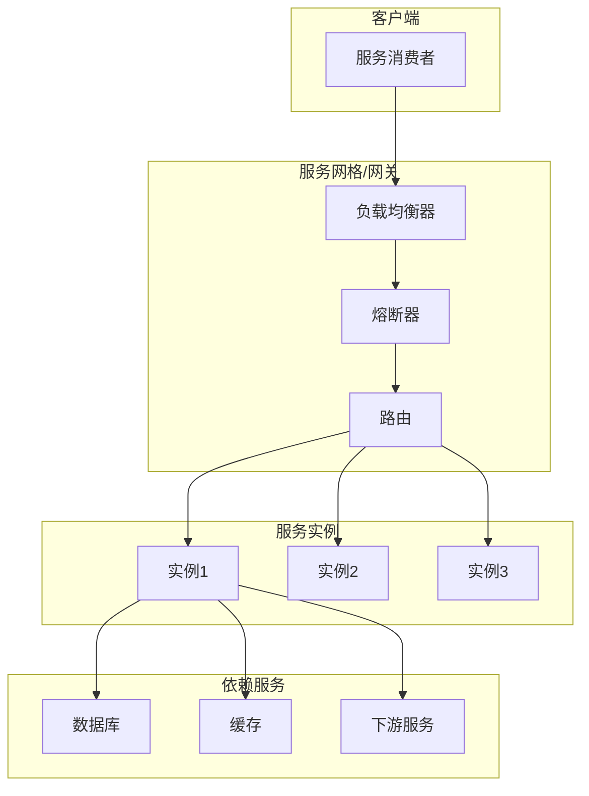
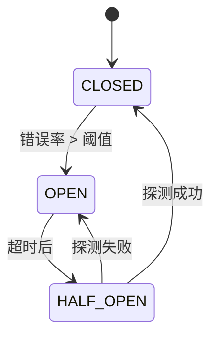

# Go微服务运行时：形式化语义与可靠性分析

> **版本**: 2026.04.01 | **Go版本**: 1.18-1.26.1 | **架构**: 云原生微服务
> **关联**: [Go-1.26.1-Comprehensive.md](./Go-1.26.1-Comprehensive.md)

---

## 目录

- [Go微服务运行时：形式化语义与可靠性分析](#go微服务运行时形式化语义与可靠性分析)
  - [目录](#目录)
  - [1. 微服务运行时概述](#1-微服务运行时概述)
    - [1.1 架构组件](#11-架构组件)
    - [1.2 Go微服务运行时栈](#12-go微服务运行时栈)
  - [2. 请求处理生命周期](#2-请求处理生命周期)
    - [2.1 请求流形式化](#21-请求流形式化)
    - [2.2 处理管道](#22-处理管道)
    - [2.3 上下文传播](#23-上下文传播)
  - [3. 并发模型与资源管理](#3-并发模型与资源管理)
    - [3.1 Goroutine池模型](#31-goroutine池模型)
    - [3.2 连接池管理](#32-连接池管理)
    - [3.3 背压机制](#33-背压机制)
  - [4. 超时与取消传播](#4-超时与取消传播)
    - [4.1 超时层次结构](#41-超时层次结构)
    - [4.2 取消传播语义](#42-取消传播语义)
    - [4.3 优雅关闭](#43-优雅关闭)
  - [5. 熔断与降级机制](#5-熔断与降级机制)
    - [5.1 熔断器状态机](#51-熔断器状态机)
    - [5.2 熔断算法](#52-熔断算法)
    - [5.3 降级策略](#53-降级策略)
  - [6. 服务发现与负载均衡](#6-服务发现与负载均衡)
    - [6.1 服务发现模型](#61-服务发现模型)
    - [6.2 负载均衡算法](#62-负载均衡算法)
    - [6.3 健康检查](#63-健康检查)
  - [7. 可观测性模型](#7-可观测性模型)
    - [7.1 三大支柱](#71-三大支柱)
    - [7.2 分布式追踪](#72-分布式追踪)
    - [7.3 结构化日志](#73-结构化日志)
  - [8. 故障模式分析](#8-故障模式分析)
    - [8.1 故障分类](#81-故障分类)
    - [8.2 级联故障防止](#82-级联故障防止)
    - [8.3 混沌工程](#83-混沌工程)
  - [9. 形式化可靠性证明](#9-形式化可靠性证明)
    - [9.1 可用性定义](#91-可用性定义)
    - [9.2 可靠性定理](#92-可靠性定理)
    - [9.3 安全性与活性](#93-安全性与活性)
  - [10. 性能模型与容量规划](#10-性能模型与容量规划)
    - [10.1 延迟模型](#101-延迟模型)
    - [10.2 吞吐量模型](#102-吞吐量模型)
    - [10.3 容量规划公式](#103-容量规划公式)
  - [关联文档](#关联文档)

---

## 1. 微服务运行时概述

### 1.1 架构组件



### 1.2 Go微服务运行时栈

| 层级 | 组件 | Go实现 |
|------|------|--------|
| **传输** | HTTP/gRPC | `net/http`, `google.golang.org/grpc` |
| **序列化** | JSON/Protobuf | `encoding/json`, `proto` |
| **服务框架** | 生命周期管理 | 自定义/Framework |
| **可靠性** | 熔断/重试/超时 | `github.com/sony/gobreaker` |
| **可观测性** | 指标/日志/追踪 | `prometheus`, `opentelemetry` |

---

## 2. 请求处理生命周期

### 2.1 请求流形式化

**定义 2.1 (请求)**:

$$
r \triangleq (id, method, payload, ctx, deadline)
$$

其中：

- $id$: 唯一请求标识
- $method$: 调用方法
- $payload$: 载荷数据
- $ctx$: 上下文（取消信号、元数据）
- $deadline$: 截止时间

### 2.2 处理管道

```go
// 请求处理管道
type HandlerFunc func(ctx context.Context, req Request) (Response, error)

// 中间件链
func Chain(handlers ...HandlerFunc) HandlerFunc {
    return func(ctx context.Context, req Request) (Response, error) {
        for _, h := range handlers {
            resp, err := h(ctx, req)
            if err != nil {
                return resp, err
            }
        }
        return h(ctx, req)
    }
}
```

**形式化管道**:

$$
\text{Pipeline}(r) = (h_n \circ h_{n-1} \circ ... \circ h_1)(r)
$$

### 2.3 上下文传播

```go
// 上下文传播形式化
func Process(ctx context.Context, req Request) Response {
    // 1. 提取元数据
    md := metadata.FromContext(ctx)

    // 2. 创建子上下文（带超时）
    childCtx, cancel := context.WithTimeout(ctx, 5*time.Second)
    defer cancel()

    // 3. 调用下游
    return downstream.Call(childCtx, req)
}
```

---

## 3. 并发模型与资源管理

### 3.1 Goroutine池模型

**定义 3.1 (工作池)**:

```go
type WorkerPool struct {
    workers   int           // 工作Goroutine数
    queue     chan Task     // 任务队列
    semaphore chan struct{} // 限流信号量
}
```

**资源约束**:

$$
\text{Active Goroutines} \leq \text{MaxWorkers} + \text{QueueDepth}
$$

### 3.2 连接池管理

```go
// 连接池形式化
type ConnPool struct {
    maxConns    int
    idleConns   []*Conn
    activeConns int
    waitQueue   []chan *Conn
}
```

**状态转换**:

$$
\text{Idle} \xrightarrow{\text{Acquire}} \text{Active} \xrightarrow{\text{Release}} \text{Idle}
$$

### 3.3 背压机制

```go
// 基于Channel的背压
func (s *Server) HandleRequest(ctx context.Context, req Request) Response {
    select {
    case s.requestQueue <- req:
        // 接受请求
        return s.process(ctx, req)
    case <-ctx.Done():
        // 上下文取消
        return Response{}, ctx.Err()
    default:
        // 队列满，拒绝请求
        return Response{}, ErrServiceUnavailable
    }
}
```

**形式化背压**:

$$
\text{Accept}(r) \iff |Q| < \text{Capacity} \land \text{ctx} \notin \{\text{Cancelled}, \text{Timeout}\}
$$

---

## 4. 超时与取消传播

### 4.1 超时层次结构

```
请求超时 (10s)
├── 认证 (1s)
├── 业务处理 (8s)
│   ├── 数据库查询 (3s)
│   └── 下游调用 (5s)
└── 响应编码 (1s)
```

**形式化**:

$$
\text{Deadline}_{total} = \min(\text{Deadlines}_{subtasks})
$$

### 4.2 取消传播语义

**定义 4.1 (取消传播)**:

```go
// 取消传播链
func Handler(ctx context.Context) {
    // 父上下文取消 → 所有子上下文取消
    ctx1, _ := context.WithCancel(ctx)
    ctx2, _ := context.WithTimeout(ctx1, 5*time.Second)

    go Worker(ctx2)  // ctx2感知ctx和ctx1的取消
}
```

**传播规则**:

$$
\text{Cancel}(parent) \Rightarrow \forall child \in \text{Children}(parent). \text{Cancel}(child)
$$

### 4.3 优雅关闭

```go
// 优雅关闭协议
func (s *Server) Shutdown(ctx context.Context) error {
    // 1. 停止接受新连接
    s.listener.Close()

    // 2. 等待活跃请求完成（或超时）
    done := make(chan struct{})
    go func() {
        s.wg.Wait()
        close(done)
    }()

    select {
    case <-done:
        return nil
    case <-ctx.Done():
        return ctx.Err()
    }
}
```

---

## 5. 熔断与降级机制

### 5.1 熔断器状态机

**定义 5.1 (熔断器)**:

$$
\text{Breaker} \in \{ \text{CLOSED}, \text{OPEN}, \text{HALF_OPEN} \}
$$

**状态转移**:



### 5.2 熔断算法

```go
// 熔断器实现
type CircuitBreaker struct {
    failureThreshold int
    successThreshold int
    timeout          time.Duration

    state       State
    failures    int
    successes   int
    lastFailure time.Time
}

func (cb *CircuitBreaker) Allow() bool {
    switch cb.state {
    case CLOSED:
        return true
    case OPEN:
        if time.Since(cb.lastFailure) > cb.timeout {
            cb.state = HALF_OPEN
            return true
        }
        return false
    case HALF_OPEN:
        return true
    }
    return false
}
```

**形式化条件**:

$$
\text{Trip}(cb) \iff \frac{\text{Failures}}{\text{Total}} > \theta \land \text{Total} > n_{min}
$$

### 5.3 降级策略

| 策略 | 实现 | 场景 |
|------|------|------|
| **缓存返回** | 返回缓存数据 | 读服务 |
| **默认值** | 返回默认值 | 配置服务 |
| **简化逻辑** | 执行简化算法 | 计算服务 |
| **拒绝服务** | 返回503 | 过载保护 |

---

## 6. 服务发现与负载均衡

### 6.1 服务发现模型

**定义 6.1 (服务注册表)**:

$$
\mathcal{R} : \text{ServiceID} \to \mathcal{P}(\text{Instance})
$$

其中：

$$
\text{Instance} \triangleq (id, addr, metadata, health)
$$

### 6.2 负载均衡算法

| 算法 | 描述 | 适用场景 |
|------|------|---------|
| **Round Robin** | 轮询 | 同质实例 |
| **Weighted RR** | 加权轮询 | 异构实例 |
| **Least Conn** | 最少连接 | 长连接服务 |
| **Random** | 随机 | 简单场景 |

**形式化轮询**:

$$
\text{Next}(instances) = instances[i \mod |instances|]
$$

其中 $i$ 是原子递增的计数器。

### 6.3 健康检查

```go
// 健康检查协议
type HealthChecker struct {
    interval time.Duration
    timeout  time.Duration
    check    func() error
}

func (hc *HealthChecker) Start() {
    ticker := time.NewTicker(hc.interval)
    go func() {
        for range ticker.C {
            if err := hc.check(); err != nil {
                reportUnhealthy()
            }
        }
    }()
}
```

---

## 7. 可观测性模型

### 7.1 三大支柱

| 支柱 | 数据类型 | Go实现 |
|------|---------|--------|
| **指标 (Metrics)** | 数值时间序列 | Prometheus |
| **日志 (Logs)** | 文本事件 | zap/logrus |
| **追踪 (Traces)** | 请求链 | OpenTelemetry |

### 7.2 分布式追踪

**追踪模型**:

$$
\text{Trace} = \{ Span_1, Span_2, ..., Span_n \}
$$

$$
Span_i = (traceID, spanID, parentID, op, start, end, tags)
$$

```go
// 追踪上下文传播
func Handler(ctx context.Context) {
    span, ctx := opentracing.StartSpanFromContext(ctx, "handler")
    defer span.Finish()

    // 调用下游
    resp := downstream(ctx)

    span.SetTag("response_size", len(resp))
}
```

### 7.3 结构化日志

```go
// 结构化日志形式化
logger.Info("request_processed",
    zap.String("request_id", reqID),
    zap.Int("status_code", 200),
    zap.Duration("latency", duration),
    zap.Error(err),
)
```

---

## 8. 故障模式分析

### 8.1 故障分类

| 故障类型 | 原因 | 检测 | 恢复 |
|---------|------|------|------|
| **崩溃** | Panic/OOM | 健康检查 | 重启 |
| **死锁** | 资源竞争 | 超时 | 终止 |
| **泄漏** | 资源未释放 | 监控 | 重启 |
| **级联** | 依赖故障 | 熔断 | 降级 |

### 8.2 级联故障防止

```go
// 隔离策略
type Bulkhead struct {
    sem chan struct{}
}

func (b *Bulkhead) Execute(f func()) error {
    select {
    case b.sem <- struct{}{}:
        defer func() { <-b.sem }()
        f()
        return nil
    default:
        return ErrBulkheadFull
    }
}
```

### 8.3 混沌工程

**故障注入**:

```go
// 延迟注入
func WithLatency(d time.Duration) Middleware {
    return func(next Handler) Handler {
        return func(ctx context.Context, req Request) Response {
            time.Sleep(d)
            return next(ctx, req)
        }
    }
}

// 错误注入
func WithError(rate float64) Middleware {
    return func(next Handler) Handler {
        return func(ctx context.Context, req Request) Response {
            if rand.Float64() < rate {
                return Response{}, ErrInjected
            }
            return next(ctx, req)
        }
    }
}
```

---

## 9. 形式化可靠性证明

### 9.1 可用性定义

**定义 9.1 (可用性)**:

$$
A = \frac{\text{MTBF}}{\text{MTBF} + \text{MTTR}}
$$

其中：

- MTBF: 平均故障间隔时间
- MTTR: 平均修复时间

### 9.2 可靠性定理

**定理 9.1 (熔断器防止级联故障)**:

配置熔断器的系统比无熔断器系统具有更高的可用性。

**证明概要**:

1. 设故障服务$S_f$的故障概率为$p$
2. 无熔断器：所有请求都发送到$S_f$，全部失败
3. 有熔断器：熔断后快速失败，保护调用方资源
4. 系统整体可用性提升

∎

**定理 9.2 (超时防止资源耗尽)**:

$$
\forall r. \text{Deadline}(r) < \infty \Rightarrow \text{ResourceExhaustion} \not\Rightarrow \text{SystemFailure}
$$

### 9.3 安全性与活性

**安全性**: 坏事不发生

- 请求不会无限期挂起（超时保证）
- 资源不会超限（限流保证）

**活性**: 好事最终发生

- 请求最终被处理（重试保证）
- 服务最终恢复（健康检查+重启）

---

## 10. 性能模型与容量规划

### 10.1 延迟模型

**总延迟分解**:

$$
L_{total} = L_{network} + L_{queue} + L_{process} + L_{db}
$$

### 10.2 吞吐量模型

**Little's Law**:

$$
N = \lambda \times W
$$

其中：

- $N$: 系统中平均请求数
- $\lambda$: 到达率（请求/秒）
- $W$: 平均处理时间

### 10.3 容量规划公式

**所需实例数**:

$$
\text{Instances} = \frac{\text{Target RPS} \times \text{Latency}}{\text{Concurrency per Instance}}
$$

**示例**:

```
目标: 10000 RPS
延迟: 100ms = 0.1s
每实例并发: 100

所需实例 = 10000 × 0.1 / 100 = 10
```

---

## 关联文档

- [Go-1.26.1-Comprehensive.md](./Go-1.26.1-Comprehensive.md)
- [Go-Runtime-GC-Complete.md](./Go-Runtime-GC-Complete.md)
- [Go-WebAssembly-Integration.md](./Go-WebAssembly-Integration.md)

---

*文档版本: 2026-04-01 | 架构: 云原生微服务 | 设计模式: SRE原则*
