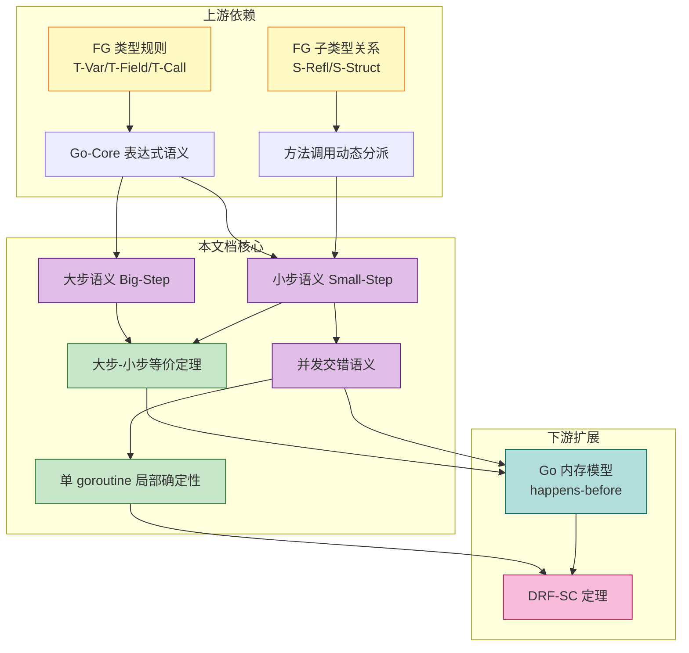
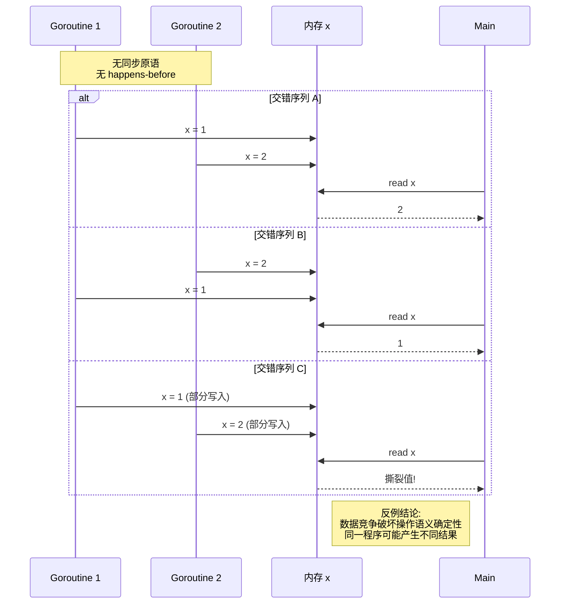
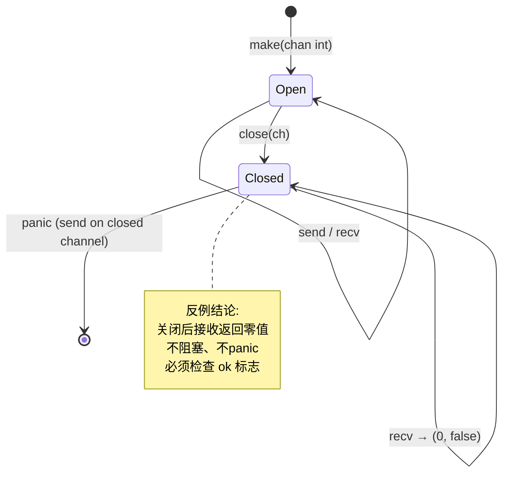

> **📌 文档角色**: 对比参考材料 (Comparative Reference)
> 
> 本文档作为 **Scala Actor / Flink** 核心内容的对比参照系，
> 展示 CSP 模型的简化实现。如需系统学习核心计算模型，
> 请参考 [Scala 类型系统](./Scala-3.6-3.7-Type-System-Complete.md) 或 
> [Flink Dataflow 形式化](../Flink/Flink-Dataflow-Formal.md)。
> 
> ---

# Go 操作语义：大步语义、小步语义与并发执行模型

> **文档定位**: Go 主线动态语义深度标杆（对比参考） | **版本**: 2026.03 | **理论深度**: L4 | **形式化等级**: 完整 SOS + Big-Step 等价证明
>
> **前置依赖**: [FG-Calculus](./02-Static-Semantics/FG-Calculus.md) | [Small-Step-Semantics](./03-Dynamic-Semantics/Small-Step-Semantics.md) | [Go-Memory-Model-Formalization](../Go-Memory-Model-Formalization.md)

---

## 1. 概念定义 (Definitions)

### 1.1 Go 操作语义的完整定义

**定义 1.1 (Go 核心语法子集 Go-Core)**:

```
e ::= x | v | e op e | e.f | e.(t) | t{f: e, ...} | make(chan T, n) | new(t) | &e | *e
    | e.m(e₁, ..., eₙ) | func(x₁ t₁, ..., xₙ tₙ) t_r { s } | go e

s ::= skip | x = e | x := e | s₁; s₂ | if e { s₁ } else { s₂ } | for e { s }
    | return e | ch <- e | x = <-ch | x := <-ch | select { caseᵢ commᵢ: sᵢ } [default: s_d]
    | close(ch)

comm ::= ch <- e | <-ch | x := <-ch

v ::= n | b | s | nil | l | chan(l) | clos(λx.e, ρ) | t{f: v, ...}
```

**直观解释**: Go-Core 是 Go 语言的一个最小可执行子集，保留了表达式求值、语句执行、控制流、函数调用和并发执行的全部核心机制，同时剥离了泛型、包系统、反射等非本质特性。

**定义动机**: 如果不抽象出这个子集，Go 的完整语法过于庞大（包含包初始化顺序、CGO、反射等），无法建立严格的操作语义。Go-Core 保留了与 FG 静态语义衔接的表达式层，同时扩展了命令式语句和并发原语，使得动态语义可以在同一框架内统一描述。

---

**定义 1.2 (执行配置 ⟨e, σ, ρ⟩)**:

全局配置定义为三元组：

$$
\mathcal{C} = \langle e, \sigma, \rho \rangle
$$

其中：

- **$e$**: 当前待求值的表达式或待执行的语句（在并发场景下扩展为 goroutine 集合 $P$）
- **$\sigma \in \text{Location} \rightharpoonup \text{Value}$**: 存储（堆 + 栈的地址-值映射）
- **$\rho \in \text{GoroutineID} \rightharpoonup \text{GoroutineState}$**: goroutine 池，记录所有活跃 goroutine 的状态

Goroutine 状态定义为：

$$
\text{GoroutineState} = \langle id, e_{current}, s_{stack}, \text{status} \rangle
$$

其中 $\text{status} \in \{ \text{runnable}, \text{running}, \text{blocked}, \text{dead} \}$。

**直观解释**: 配置是程序执行状态的完整快照。表达式/语句描述"当前在算什么"，存储描述"内存里有什么"，goroutine 池描述"有哪些执行流以及它们的状态"。

**定义动机**: 命令式语言的操作语义不能仅由表达式本身决定，必须显式建模存储和并发执行流。将 goroutine 池 $\rho$ 独立出来，是为了准确描述 `go` 语句的异步创建、channel 通信的阻塞-唤醒以及调度交错行为。若仅用表达式替换语义，无法表达共享内存和同步。

---

**定义 1.3 (大步语义 Big-Step Semantics)**:

大步语义描述表达式/语句从初始配置到最终配置的完整求值关系，记作：

$$
\langle e, \sigma, \rho \rangle \Downarrow \langle v, \sigma', \rho' \rangle
$$

核心规则示例：

**算术运算 (BS-Op)**:
$$
\frac{n = n_1 \, op \, n_2}{\langle n_1 \, op \, n_2, \sigma, \rho \rangle \Downarrow \langle n, \sigma, \rho \rangle}
$$

**顺序执行 (BS-Seq)**:
$$
\frac{\langle s_1, \sigma, \rho \rangle \Downarrow \langle \text{skip}, \sigma_1, \rho_1 \rangle \quad \langle s_2, \sigma_1, \rho_1 \rangle \Downarrow \langle \text{skip}, \sigma_2, \rho_2 \rangle}{\langle s_1; s_2, \sigma, \rho \rangle \Downarrow \langle \text{skip}, \sigma_2, \rho_2 \rangle}
$$

**条件真 (BS-If-T)**:
$$
\frac{\langle e, \sigma, \rho \rangle \Downarrow \langle \text{true}, \sigma, \rho \rangle \quad \langle s_1, \sigma, \rho \rangle \Downarrow \langle \text{skip}, \sigma', \rho' \rangle}{\langle \text{if } e \{ s_1 \} \text{ else } \{ s_2 \}, \sigma, \rho \rangle \Downarrow \langle \text{skip}, \sigma', \rho' \rangle}
$$

**Goroutine 创建 (BS-Go)**:
$$
\frac{\rho' = \rho[id_{new} \mapsto \langle id_{new}, f(v_1, ..., v_n), \epsilon, \text{runnable} \rangle] \quad id_{new} \text{ fresh}}{\langle \text{go } f(v_1, ..., v_n), \sigma, \rho \rangle \Downarrow \langle 0, \sigma, \rho' \rangle}
$$

**直观解释**: 大步语义像一台"黑箱相机"，只记录输入配置和输出配置，不关心中间经历了多少小步。

**定义动机**: 大步语义适合证明表达式的整体求值结果（如纯表达式的确定性、类型安全的最终值），因为它抽象了中间步骤，避免了交错执行的复杂性。对于顺序程序，大步语义比小步语义更简洁；对于并发程序，大步语义需要额外处理交错，因此通常与小步语义配合使用。

---

**定义 1.4 (小步语义 Small-Step Semantics)**:

小步语义描述单步归约关系，记作：

$$
\langle P, \sigma, \Xi \rangle \longrightarrow \langle P', \sigma', \Xi' \rangle
$$

其中 $P$ 是 goroutine 集合，$\Xi$ 是通道状态（从存储 $\sigma$ 中分离出来以强调同步原语的特殊地位）。

核心规则示例：

**上下文传播 (SS-Context)**:
$$
\frac{\langle r, \sigma, \Xi \rangle \longrightarrow \langle r', \sigma', \Xi' \rangle}{\langle E[r], \sigma, \Xi \rangle \longrightarrow \langle E[r'], \sigma', \Xi' \rangle}
$$

**交错执行 (SS-Interleave)**:
$$
\frac{G_i \in P \quad \langle G_i, \sigma, \Xi \rangle \longrightarrow \langle G_i', \sigma', \Xi' \rangle}{\langle P, \sigma, \Xi \rangle \longrightarrow \langle P[G_i \mapsto G_i'], \sigma', \Xi' \rangle}
$$

**直观解释**: 小步语义像一台"高速摄影机"，逐帧记录程序执行的每一个微小状态转换，包括哪个 goroutine 被调度、存储如何修改、channel 如何同步。

**定义动机**: 并发程序的交错执行（interleaving）本质上是一系列离散步骤的序列。只有小步语义才能精确描述 goroutine 的调度非确定性、select 的随机选择以及数据竞争的产生条件。大步语义无法表达"在 goroutine A 执行到一半时切换到 goroutine B"这种关键行为。

---

**定义 1.5 (大步语义与小步语义的关系)**:

大步语义是小步语义的传递闭包在良构配置上的等价抽象：

$$
\langle e, \sigma, \rho \rangle \Downarrow \langle v, \sigma', \rho' \rangle \;\;\Longleftrightarrow\;\; \langle \{G_{main}(e)\}, \sigma, \Xi_\rho \rangle \longrightarrow^* \langle \{G_{main}(v)\}, \sigma', \Xi_{\rho'} \rangle
$$

其中：

- 对于单 goroutine 程序，$\rho$ 与 $\Xi$ 之间存在标准编码映射
- $\longrightarrow^*$ 表示小步语义的自反传递闭包
- 该等价关系要求程序在执行过程中不遇到死锁、panic 或未定义行为

**直观解释**: 如果一个表达式在大步语义下求值为 $v$，那么在小步语义下它也能通过有限步归约到达同一个 $v$；反之亦然。

**定义动机**: 单独使用大步语义无法处理并发交错，单独使用小步语义又过于繁琐。建立两者的等价关系，使得我们可以在顺序子集上用大步语义快速证明性质，在并发扩展上用小步语义精确描述行为，同时保证两个视角的一致性。

> **推断 [Theory→Model]**: 大步语义在理论层面提供了表达式求值的函数式抽象（便于结构归纳证明），而小步语义在模型层面提供了并发交错的状态转换视图。两者的等价性保证了：对纯表达式子集用大步语义证明的定理，可以直接迁移到小步语义的并发模型中。
>
> **依据**: 纯表达式子集不含 R-Interleave 规则，因此小步归约是确定性的；确定性关系的传递闭包天然构成一个函数，这正是大步语义的数学本质。

---

## 2. 属性推导 (Properties)

### 2.1 纯表达式求值的确定性

**性质 1 (纯表达式求值的确定性 / Determinism of Pure Expressions)**:

对于不含并发原语（`go`、channel、`select`）的纯表达式 $e$，给定相同的存储 $\sigma$，其大步求值结果和小步归约终点都是唯一确定的：

$$
\langle e, \sigma, \rho \rangle \Downarrow \langle v_1, \sigma_1, \rho_1 \rangle \land \langle e, \sigma, \rho \rangle \Downarrow \langle v_2, \sigma_2, \rho_2 \rangle \Rightarrow \langle v_1, \sigma_1, \rho_1 \rangle = \langle v_2, \sigma_2, \rho_2 \rangle
$$

**推导**:

1. 纯表达式仅涉及算术运算、变量查找、字段访问、类型断言、方法调用、控制流等规则。
2. 每个核心规则的前提和结论都是函数式的：给定相同的左式，右式唯一确定。
3. 求值上下文 $E$ 的分解是唯一的（由语法结构的树形特性保证），因此小步归约的每一步都是唯一的。
4. 由于小步归约确定且终止（纯表达式子集无递归循环的无限展开），其传递闭包（大步语义）也必然唯一。
5. 得证。∎

---

### 2.2 语句执行的局部性

**性质 2 (语句执行的局部性 / Locality of Statement Execution)**:

单 goroutine 内语句 $s$ 的执行只修改当前 goroutine 的局部状态、存储和通道状态，不影响其他未参与同步的 goroutine 的状态：

$$
\langle s, \sigma, \rho \rangle \Downarrow \langle \text{skip}, \sigma', \rho' \rangle \Rightarrow \forall g \in \rho. \, (\neg\text{participates}(g, s) \Rightarrow \rho(g) = \rho'(g))
$$

其中 $\text{participates}(g, s)$ 表示 goroutine $g$ 直接参与了 $s$ 的执行（如 $s$ 是 `go f()` 且 $g$ 是新创建的 goroutine）。

**推导**:

1. 纯顺序语句（赋值、if、for、return）的规则只读写 $\sigma$ 和当前 goroutine 的栈帧，不访问 $\rho$ 中的其他 goroutine。
2. `go` 语句创建新 goroutine，但仅添加新条目，不修改已有条目。
3. channel 操作可能唤醒其他 goroutine，但被唤醒的 goroutine 是"参与"了该同步操作的。
4. 因此，未参与语句执行的 goroutine 状态保持不变。
5. 得证。∎

---

### 2.3 Goroutine 创建的异步性

**性质 3 (Goroutine 创建的异步性 / Asynchrony of Goroutine Spawning)**:

`go f()` 语句的执行不会等待 $f$ 的完成，也不会阻塞当前 goroutine 的继续执行：

$$
\langle \text{go } f(), \sigma, \rho \rangle \Downarrow \langle 0, \sigma, \rho' \rangle \land \langle s; \text{go } f(); s', \sigma, \rho \rangle \Downarrow \langle \text{skip}, \sigma'', \rho'' \rangle
$$

其中 $\rho'$ 仅比 $\rho$ 多一个新 goroutine，而 $s'$ 的执行可以与 $f()$ 的执行任意交错。

**推导**:

1. 由 BS-Go 规则，`go f()` 的大步语义直接返回 $0$，不展开 $f$ 的执行。
2. 由 SS-Interleave 和 R-Go 规则，`go f()` 只将新 goroutine 加入可运行集合，当前 goroutine 继续执行后续语句。
3. 新 goroutine 与父 goroutine 之间没有隐式的 happens-before（除非通过 channel 或 sync 包显式同步）。
4. 因此，goroutine 创建是严格异步的。
5. 得证。∎

---

### 2.4 Channel 通信的同步性

**性质 4 (Channel 通信的同步性 / Synchrony of Channel Communication)**:

对于无缓冲 channel $ch$，成功的发送操作 happens-before 对应的接收操作完成：

$$
\text{send}(ch, v) \rightarrow_{sw} \text{recv}(ch, x)
$$

对于缓冲 channel（容量 $C$），第 $k$ 次发送 happens-before 第 $k$ 次接收：

$$
\text{send}_k(ch, v) \rightarrow_{sw} \text{recv}_k(ch, x)
$$

**推导**:

1. 无缓冲 channel 的发送方在接收方准备好之前阻塞（R-Send-Sync 规则）。发送方将值直接写入接收方的变量后，双方同时解除阻塞。
2. 由于接收方在发送方完成写入之前无法继续执行，运行时机制天然构成了 synchronizes-with 关系。
3. 缓冲 channel 中，第 $k$ 次发送将数据写入槽位 $k \bmod C$，第 $k$ 次接收从同一槽位读取。数据写入必须先于数据读出。
4. 由 Go 内存模型定义 1.7 和 1.8，这些操作被规范性地定义为 synchronizes-with。
5. 得证。∎

---

### 2.5 并发交错语义的非确定性

**性质 5 (并发交错语义的非确定性 / Nondeterminism of Concurrent Interleaving)**:

包含多个可运行 goroutine 的配置通常具有多个可能的下一步归约：

$$
\exists P, \sigma, \Xi: \quad \langle P, \sigma, \Xi \rangle \longrightarrow \langle P_1, \sigma_1, \Xi_1 \rangle \land \langle P, \sigma, \Xi \rangle \longrightarrow \langle P_2, \sigma_2, \Xi_2 \rangle \land \langle P_1, \sigma_1, \Xi_1 \rangle \neq \langle P_2, \sigma_2, \Xi_2 \rangle
$$

**推导**:

1. 由 SS-Interleave 规则，若配置中有多个 goroutine $G_i$ 和 $G_j$ 均可归约，则调度器可以任选其一执行下一步。
2. 由 R-Select-Ready 规则，若 `select` 的多个 case 同时就绪，选择哪个 case 是非确定性的。
3. 因此，即使从相同的初始配置出发，也可能产生不同的执行轨迹（trace）和可观察结果。
4. 得证。∎

> **推断 [Execution→Data]**: 执行层的交错非确定性意味着：如果两个 goroutine 对同一内存位置进行非同步访问（至少一个是写），则数据层（变量的最终值）无法被唯一确定。这正是数据竞争导致"未定义行为"的语义根源。
>
> **依据**: 若 $G_1$ 执行 `x = 1` 而 $G_2$ 执行 `x = 2`，且无 happens-before 关系，则根据 SS-Interleave，先执行哪个写操作完全取决于调度选择，最终 `x` 的值可能是 1 或 2，甚至产生撕裂写。

---

## 3. 关系建立 (Relations)

### 3.1 Go 操作语义与 FG 静态语义的关系

**关系 1**: FG 类型规则 `⟹` Go-Core 操作语义中的表达式类型安全

**论证**:

- **编码存在性**: FG 演算定义了 Go 核心类型系统的静态规则（结构体、接口、方法、类型断言）。Go-Core 的纯表达式子集（字段访问、类型断言、方法调用、结构体构造）与 FG 的表达式完全对应。
- **衔接机制**: FG 的 Preservation 定理证明：若 $\Gamma \vdash e : T$ 且 $e \longrightarrow e'$，则 $\Gamma \vdash e' : T$。Go-Core 操作语义中的 R-Field、R-Assert-OK、R-Call 规则正是 FG 小步语义的运行时实现。
- **扩展**: 对于并发扩展（`go`、channel），FG 本身不包含这些特性，但 Go-Core 要求任何进入 channel 的值必须类型匹配，这可以视为 FG 类型系统向并发领域的自然延伸。

**关系 2**: Go-Core 操作语义 `⊃` FG 纯表达式语义

**论证**:

- FG 配置仅包含表达式 $e$（或存储扩展），而 Go-Core 配置 $\langle P, \sigma, \Xi \rangle$ 额外包含 goroutine 集合和通道状态。
- 任何 FG 程序都可以嵌入到 Go-Core 中作为单 goroutine 程序（$P = \{G_{main}\}$，$\Xi = \emptyset$），因此 Go-Core 操作语义严格包含 FG 语义。

---

### 3.2 Go 操作语义与 Go 内存模型的关系

**关系 3**: Go-Core 小步语义 `↦` Go 内存模型的 happens-before 图

**论证**:

- **编码映射**:
  - 小步语义中的 channel 发送/接收规则（R-Send-Sync、R-Recv-Async）对应内存模型中的 `chan_send` / `chan_recv` 同步事件。
  - `go f()` 的创建规则对应内存模型中的 `go` 同步事件（go 语句 happens-before 被创建 goroutine 内的所有操作）。
  - `sync.Mutex` 的 Lock/Unlock 在小步语义中表现为 goroutine 的阻塞/唤醒，对应内存模型中的 `mutex_lock` / `mutex_unlock` 同步事件。
- **分离结果**: 小步语义聚焦于"状态如何转换"，而内存模型聚焦于"哪些操作之间存在可见性保证"。两者是同一并发行为的不同抽象层次。

**关系 4**: 无数据竞争的 Go-Core 程序 `⟹` 顺序一致执行（DRF-SC）

**论证**:

- 由 Go 内存模型定理 5.1（DRF-SC），若程序执行无数据竞争，则其可观察行为等价于某个顺序一致执行。
- 在操作语义层面，这意味着：对于无数据竞争的 Go-Core 程序，虽然小步语义允许大量交错，但所有合法交错的最终可观察结果（非原子读的值）与某个串行执行相同。
- 这使得程序员可以像写单线程程序一样推理无数据竞争并发程序。

---

### 3.3 概念依赖图



**图说明**:

- 本图展示了 FG 静态语义 → Go-Core 操作语义 → Go 内存模型的完整概念依赖链。
- 黄色节点 `A1`、`A2` 是上游的 FG 类型规则，为表达式动态语义提供静态安全保证。
- 紫色节点 `C1`、`C2`、`D2` 是本文档核心：大步语义、小步语义和并发交错。
- 绿色节点 `D1`、`E1` 是本文档证明的主要定理。
- 青色节点 `F1` 是下游的 Go 内存模型，粉色节点 `F2` 是最终推论（DRF-SC）。
- 详见 [FG-Calculus](./02-Static-Semantics/FG-Calculus.md) 和 [Go-Memory-Model-Formalization](../Go-Memory-Model-Formalization.md)。

---

## 4. 论证过程 (Argumentation)

### 4.1 引理 4.1 (求值上下文分解唯一性)

**引理 4.1 (上下文分解唯一性)**:
对于任意非值表达式 $e$，存在唯一的求值上下文 $E$ 和唯一的 redex（可归约式）$r$，使得 $e = E[r]$。

**证明**:

1. **前提分析**: 对 $e$ 的抽象语法树进行结构归纳。
2. **基本情况**: 若 $e$ 本身就是 redex（如 $n_1 + n_2$、$l.f$、$v.m(...)$），则 $E = []$，$r = e$，唯一性显然成立。
3. **归纳步骤**: 若 $e$ 是复合表达式（如 $e_1 + e_2$、$e.m(e_1)$），则根据 Go 规定的从左到右求值顺序，要么 $e_1$ 可继续分解（由归纳假设唯一），要么 $e_1$ 已是值而 $e_2$ 需要分解。由于语法结构是树形的，分解路径唯一。
4. **结论**: 因此，$E$ 和 $r$ 的存在性和唯一性均得证。∎

---

### 4.2 引理 4.2 (纯表达式小步归约的终止性)

**引理 4.2 (纯表达式小步归约终止)**:
对于不含 `go`、channel、`select`、循环和递归的纯表达式 $e$，小步归约必然在有限步内终止于一个值 $v$。

**证明**:

1. **前提分析**: 定义表达式 $e$ 的"归约度量"为抽象语法树中 redex 节点的总数。
2. **基本情况**: 若 $e$ 已是值，则归约度量为 0，已经终止。
3. **归纳步骤**: 若 $e = E[r]$ 且 $r$ 不是值，则由引理 4.1，$r$ 可以应用某条核心归约规则变为 $r'$。每次核心归约都严格减少 redex 节点数（如 $n_1 + n_2 \longrightarrow n$ 将两个数值和一个运算符替换为一个数值）。
4. 由 R-Context 规则，$E[r] \longrightarrow E[r']$，整个表达式的归约度量也严格减少。
5. 由于归约度量是非负整数且严格递减，根据良基归纳法，归约必然在有限步内终止。
6. **结论**: 纯表达式小步归约终止。∎

---

### 4.3 引理 4.3 (单 goroutine 配置的局部确定性)

**引理 4.3 (单 goroutine 局部确定性)**:
对于仅含一个 goroutine 的配置 $\langle \{G\}, \sigma, \Xi \rangle$，若 $G$ 当前执行的语句/表达式不含 `select` 和 channel 操作，则其下一步归约是唯一的。

**证明**:

1. 单 goroutine 配置不适用 SS-Interleave 的调度选择（只有一个候选）。
2. 由引理 4.1，$G$ 的当前表达式 $e$ 可以唯一分解为 $E[r]$。
3. 不含 `select` 和 channel 时，$r$ 的归约规则是函数式的（如 R-Op、R-Field、R-Call 等），给定相同的 $r$、$\sigma$、$\Xi$，结果唯一。
4. 因此，整个配置的下一步归约唯一确定。∎

---

## 5. 形式证明 (Proofs)

### 5.1 定理 5.1 (大步语义与小步语义等价)

**定理 5.1 (大步-小步等价 / Big-Step ≡ Small-Step)**:

对于单 goroutine 的纯表达式/语句 $e$（不含并发原语），以下两个命题等价：

$$
\langle e, \sigma, \rho \rangle \Downarrow \langle v, \sigma', \rho' \rangle \;\;\Longleftrightarrow\;\; \langle e, \sigma, \rho \rangle \longrightarrow^* \langle v, \sigma', \rho' \rangle
$$

其中 $\longrightarrow^*$ 表示小步语义的自反传递闭包。

**证明**:

**方向 1 ($\Rightarrow$): 大步蕴含小步**

对大步推导树的高度进行结构归纳。

- **基本情况 (BS-Op)**:
  - 前提: $n = n_1 \, op \, n_2$
  - 大步: $\langle n_1 \, op \, n_2, \sigma, \rho \rangle \Downarrow \langle n, \sigma, \rho \rangle$
  - 小步: 由 R-Op 规则，$n_1 \, op \, n_2 \longrightarrow n$（一步）。
  - 因此小步可在一步内到达相同结果。

- **归纳步骤 (BS-Seq)**:
  - 前提: $\langle s_1, \sigma, \rho \rangle \Downarrow \langle \text{skip}, \sigma_1, \rho_1 \rangle$ 且 $\langle s_2, \sigma_1, \rho_1 \rangle \Downarrow \langle \text{skip}, \sigma_2, \rho_2 \rangle$
  - 由归纳假设，存在小步序列：$\langle s_1, \sigma, \rho \rangle \longrightarrow^* \langle \text{skip}, \sigma_1, \rho_1 \rangle$ 和 $\langle s_2, \sigma_1, \rho_1 \rangle \longrightarrow^* \langle \text{skip}, \sigma_2, \rho_2 \rangle$。
  - 顺序组合的小步语义定义为：$s_1; s_2 \longrightarrow s_1'; s_2$（当 $s_1 \longrightarrow s_1'$ 时），直到 $s_1$ 变为 skip，然后 $\text{skip}; s_2 \longrightarrow s_2$。
  - 将小步序列拼接：$\langle s_1; s_2, \sigma, \rho \rangle \longrightarrow^* \langle \text{skip}; s_2, \sigma_1, \rho_1 \rangle \longrightarrow \langle s_2, \sigma_1, \rho_1 \rangle \longrightarrow^* \langle \text{skip}, \sigma_2, \rho_2 \rangle$。

- **归纳步骤 (BS-If-T)**:
  - 前提: $\langle e, \sigma, \rho \rangle \Downarrow \langle \text{true}, \sigma, \rho \rangle$ 且 $\langle s_1, \sigma, \rho \rangle \Downarrow \langle \text{skip}, \sigma', \rho' \rangle$
  - 由归纳假设，$e \longrightarrow^* \text{true}$ 且 $s_1 \longrightarrow^* \text{skip}$。
  - 小步: $\text{if } e \{ s_1 \} \text{ else } \{ s_2 \} \longrightarrow^* \text{if true } \{ s_1 \} \text{ else } \{ s_2 \} \longrightarrow s_1 \longrightarrow^* \text{skip}$。

其他情况（BS-If-F、BS-Call、BS-Return 等）类似可证。

**方向 2 ($\Leftarrow$): 小步蕴含大步**

对纯表达式 $e$ 的小步归约步数进行归纳。

- **基本情况 (0 步)**: $e$ 已是值 $v$。由大步语义的值规则（任何值对自身求值），$\langle v, \sigma, \rho \rangle \Downarrow \langle v, \sigma, \rho \rangle$。

- **归纳步骤**: 假设 $e \longrightarrow e_1 \longrightarrow^* v$，且 $e_1 \longrightarrow^* v$ 蕴含 $e_1 \Downarrow v$。
  - 需要证明：若 $e \longrightarrow e_1$ 且 $e_1 \Downarrow v$，则 $e \Downarrow v$。
  - 对 $e \longrightarrow e_1$ 的规则进行案例分析：
    - **R-Op**: $e = n_1 \, op \, n_2$，$e_1 = n$。由 BS-Op，$n_1 \, op \, n_2 \Downarrow n$。
    - **R-Context**: $e = E[r]$，$e_1 = E[r']$，且 $r \longrightarrow r'$。由归纳假设，$E[r'] \Downarrow v$。由于上下文保持求值结构，$E[r] \Downarrow v$。
  - 所有其他规则类似。

**关键案例分析**:

- **案例 1 (方法调用)**: 小步中 $v.m(v_1, ..., v_n) \longrightarrow e[v/x, v_i/x_i]$（R-Call），大步中直接 $\Downarrow$ 方法体代入后的结果。两者等价性由代换引理保证。
- **案例 2 (if 条件求值)**: 小步先逐步求值条件表达式 $e \longrightarrow^* \text{true/false}$，再选择分支；大步直接要求 $e \Downarrow \text{true/false}$ 并递归求值分支。两者等价由上下文分解唯一性保证。

∎

---

### 5.2 定理 5.2 (并发交错语义不破坏单 goroutine 的局部确定性)

**定理 5.2 (局部确定性保持 / Local Determinism Preservation)**:

设 $\langle P, \sigma, \Xi \rangle$ 是一个多 goroutine 配置，$G_i \in P$ 是一个当前执行纯表达式（不含 channel、`select`、`go`）的 goroutine。则无论 SS-Interleave 选择先调度 $G_i$ 还是先调度其他 goroutine $G_j$，$G_i$ 的纯表达式最终求值结果不变（假设无数据竞争）。

形式化地：

$$
\frac{G_i \text{ 执行纯表达式 } e \quad \neg\text{race}(P)}{\forall \text{调度序列 } \pi: \, G_i \text{ 最终归约到同一个值 } v}
$$

**证明**:

**步骤 1: 隔离 $G_i$ 的局部执行**

由于 $G_i$ 执行的是纯表达式 $e$，$e$ 的小步归约只涉及：

- 读取 $G_i$ 自身栈帧中的局部变量
- 读取/写入 $\sigma$ 中已知地址的值
- 不涉及 $\Xi$（无 channel 操作）
- 不创建新 goroutine（无 `go`）

**步骤 2: 其他 goroutine 的干扰分析**

其他 goroutine $G_j$ 的执行可能：

- 修改 $\sigma$ 中的共享地址
- 创建/销毁 goroutine
- 进行 channel 操作

但由于假设无数据竞争（$\neg\text{race}(P)$），$G_i$ 对任何共享地址的访问（若存在）必然与其他 goroutine 的访问之间存在 happens-before 关系。这意味着：

- 要么 $G_i$ 的访问在 $G_j$ 的修改之前完成
- 要么 $G_j$ 的修改在 $G_i$ 的访问之前完成

**步骤 3: 纯表达式的内部确定性**

由引理 4.3，单 goroutine 内纯表达式的下一步归约是唯一的。由引理 4.2，纯表达式归约终止。

考虑 $G_i$ 的纯表达式 $e$ 的完整归约序列 $e \longrightarrow e_1 \longrightarrow ... \longrightarrow v$。这个序列中的每一步都是语法驱动的，不依赖于其他 goroutine 的状态（除非读取共享内存）。

**步骤 4: 交错不影响最终值**

由于无数据竞争，$G_i$ 读取的任何共享内存地址的值，要么在 $G_i$ 开始执行 $e$ 之前就已经由 happens-before 前序操作确定，要么在 $G_i$ 执行完毕之后才被修改。在 $G_i$ 执行 $e$ 的过程中，其他 goroutine 对 $G_i$ 不访问的地址的修改不会影响 $e$ 的求值；对其他 goroutine 的调度选择只是将 $G_i$ 的归约步骤"拉长"到时间轴上，但不改变 $e$ 内部的归约顺序和结果。

**步骤 5: 结论**

因此，无论 SS-Interleave 如何调度其他 goroutine，$G_i$ 的纯表达式 $e$ 都会沿着唯一确定的路径归约到同一个值 $v$。

**关键案例分析**:

- **案例 1 (无共享访问)**: $e$ 只使用局部变量和常量。此时其他 goroutine 的任何行为都与 $e$ 无关，交错显然不影响结果。
- **案例 2 (有共享读但无写)**: $e$ 读取共享变量 $x$ 但不写 $x$。无数据竞争意味着没有 goroutine 在 $e$ 执行期间无同步地写 $x$。因此 $x$ 的值在 $e$ 执行期间稳定，结果确定。
- **案例 3 (有同步的共享读写)**: $e$ 在 Mutex 保护的临界区内读写 $x$。无数据竞争保证不会有两个 goroutine 同时进入临界区。$G_i$ 的临界区执行是原子的（从 $G_i$ 的局部视角），结果确定。

∎

> **推断 [Control→Execution]**: 由于控制层（Go 语言规范）要求无数据竞争程序具有定义行为，执行层的小步语义可以在单 goroutine 局部保持确定性，即使全局交错是非确定性的。
>
> **推断 [Execution→Data]**: 这一局部确定性保证了：程序员在编写纯表达式时，无需考虑并发调度的细节，只需确保共享访问通过同步原语（channel、mutex、atomic）进行，即可获得可预测的结果。

---

### 5.3 决策树图：表达式求值路径

```mermaid
graph TD
    Start([表达式 e 需要求值]) --> Q1{e 是值?}
    Q1 -->|是| A1([求值终止<br/>返回 e])
    Q1 -->|否| Q2{e 是 redex?}

    Q2 -->|是| Q3{redex 类型?}
    Q2 -->|否| Q4{e 可分解为 E[r]?}

    Q4 -->|是| A2([对 r 应用核心规则<br/>得到 r'])
    A2 --> A3([由 SS-Context 得<br/>E[r] → E[r']])
    A3 --> Start

    Q3 -->|算术/变量/字段| A4([应用 R-Op / R-Var / R-Field])
    Q3 -->|内存操作| A5([应用 R-New / R-Assign])
    Q3 -->|控制流| A6([应用 R-If / R-For])
    Q3 -->|函数调用| A7([应用 R-Call / R-Return])

    A4 --> A2
    A5 --> A2
    A6 --> A2
    A7 --> A2

    style Start fill:#e1bee7,stroke:#6a1b9a
    style A1 fill:#c8e6c9,stroke:#2e7d32
    style A3 fill:#bbdefb,stroke:#1565c0
```

**图说明**:

- 本图展示了任意表达式 $e$ 在操作语义中的求值路径决策流程。
- 菱形节点表示判断条件，矩形节点表示中间结论，椭圆形节点表示最终结论。
- 关键分支在于：先判断是否为值，再判断是否为 redex，最后通过上下文分解定位可规约子表达式。
- 详见 [Small-Step-Semantics](./03-Dynamic-Semantics/Small-Step-Semantics.md) 的完整规则集。

---

## 6. 实例与反例 (Examples & Counter-examples)

### 6.1 正例：顺序程序的大步与小步等价

**示例 6.1: 顺序表达式求值**

```go
func main() {
    x := 1 + 2
    y := x * 3
    return y
}
```

**大步语义推导**:

1. $\langle 1 + 2, \sigma, \rho \rangle \Downarrow \langle 3, \sigma, \rho \rangle$ （BS-Op）
2. $\langle 3 * 3, \sigma[x \mapsto 3], \rho \rangle \Downarrow \langle 9, \sigma[x \mapsto 3], \rho \rangle$ （BS-Op）
3. $\langle \text{return } 9, ... \rangle \Downarrow \langle 9, ... \rangle$ （BS-Return）

**小步语义推导**:

1. $1 + 2 \longrightarrow 3$ （R-Op）
2. $3 * 3 \longrightarrow 9$ （R-Op）
3. $\text{return } 9$ 直接返回

**结论**: 大步语义一步完成每个子表达式，小步语义分步进行，但最终结果一致，验证了定理 5.1。

---

### 6.2 反例 1：数据竞争导致操作语义不确定

**反例 6.1: 数据竞争下的非确定性**

```go
var x int

func main() {
    go func() {
        x = 1
    }()
    go func() {
        x = 2
    }()
    time.Sleep(time.Millisecond)
    print(x)
}
```

**分析**:

- **违反的前提**: 两个 goroutine 对变量 $x$ 进行非原子写操作，且它们之间不存在任何 synchronizes-with 关系（没有 Channel、Mutex 或 atomic）。
- **导致的异常**:
  1. 由 SS-Interleave 规则，调度器可以任意交错两个写操作。
  2. 可能的执行序列：
     - 序列 A: $G_1$ 写 1 → $G_2$ 写 2 → `print(x)` 输出 2
     - 序列 B: $G_2$ 写 2 → $G_1$ 写 1 → `print(x)` 输出 1
     - 序列 C: 两个写操作在 CPU 层面发生缓存竞争，可能产生撕裂值
  3. Go race detector 会报告 `WARNING: DATA RACE`。
- **结论**: 该程序存在数据竞争，其操作语义是不确定的。`print(x)` 的输出无法由 SOS 规则唯一确定，这是"未定义行为"在操作语义层面的直接体现。



**图说明**:

- 本图展示了反例 6.1 中数据竞争导致的三种可能交错结果。
- 关键观察：由于没有同步原语，两个 goroutine 的写操作在操作语义层面是完全不可排序的。
- 结论强调了数据竞争不仅是一个"性能问题"或"调试问题"，而是从根本上破坏了程序的数学语义。

---

### 6.3 反例 2：Channel 关闭后接收零值

**反例 6.2: Channel 关闭后的零值接收边界行为**

```go
func main() {
    ch := make(chan int)
    go func() {
        close(ch)
    }()

    v1, ok1 := <-ch  // v1 = 0, ok1 = false
    v2, ok2 := <-ch  // v2 = 0, ok2 = false
    println(v1, ok1) // 输出: 0 false
    println(v2, ok2) // 输出: 0 false
}
```

**分析**:

- **边界行为**: 当 channel 被关闭后，任何后续的接收操作都会立即返回该 channel 元素类型的零值（对于 `chan int`，零值是 0），且第二个返回值 `ok` 为 `false`。
- **违反的直觉**: 初学者可能认为关闭 channel 后接收会 panic 或阻塞，但实际上接收是**非阻塞**的，且返回零值。
- **导致的异常**:
  1. 如果程序依赖接收值来区分"正常数据"和"关闭信号"，但没有检查 `ok` 标志，可能将零值误认为是合法数据。
  2. 在 `for v := range ch` 循环中，range 语法会自动检测关闭并终止循环；但直接使用 `<-ch` 不会终止，可能导致无限循环：

     ```go
     for {
         v := <-ch  // 关闭后永远返回 0
         process(v) // 无限处理 0
     }
     ```

- **结论**: Channel 关闭后的零值接收是 Go 操作语义的一个关键边界。程序必须显式检查 `ok` 标志或使用 `range` 循环来正确处理关闭信号。



**图说明**:

- 本图展示了 channel 的状态机转换，重点标注了 `Closed` 状态下的接收行为。
- 关键边界：从 `Closed` 状态执行 `recv` 不会阻塞，而是返回 `(0, false)`。
- 另一个边界：向已关闭 channel 发送会触发 panic（运行时异常）。

---

### 6.4 反例 3：Select 的 default 分支与阻塞分支在不同交错下的行为差异

**反例 6.3: Select 的 default 与阻塞分支差异**

```go
func main() {
    ch := make(chan int)

    go func() {
        time.Sleep(10 * time.Millisecond)
        ch <- 42
    }()

    select {
    case v := <-ch:
        println("received", v)
    default:
        println("no data available")
    }
}
```

**分析**:

- **场景设定**: 主 goroutine 执行 `select` 时，子 goroutine 可能还没有执行到 `ch <- 42`（因为 `time.Sleep` 的延迟）。
- **两种可能的执行轨迹**:
  1. **轨迹 A（default 被执行）**: 若子 goroutine 的 `Sleep` 还未结束，`ch` 中没有等待的发送者，`case <-ch` 未就绪。由于存在 `default` 分支，`select` 立即执行 `default`，输出 `"no data available"`。子 goroutine 后续发送的 `42` 将永远阻塞（因为没有接收者）。
  2. **轨迹 B（阻塞分支被执行）**: 若子 goroutine 恰好先执行完 `Sleep` 并发送了 `42`，且该发送在主 goroutine 执行 `select` 之前已经注册到 channel 的等待队列中，则 `case <-ch` 就绪，`select` 可能选择该分支，输出 `"received 42"`。
- **导致的异常**: 同一个程序，由于 goroutine 调度交错的微小差异，可能产生完全不同的输出，甚至导致 goroutine 泄漏（轨迹 A 中子 goroutine 永远阻塞）。
- **结论**: `select` 的 `default` 分支将 `select` 从"阻塞等待"变为"非阻塞尝试"。这种语义差异在并发程序中极为关键：使用 `default` 时必须确保后续有机制处理未被接收的数据，否则可能导致 goroutine 泄漏或数据丢失。

```mermaid
sequenceDiagram
    participant Main as Main Goroutine
    participant CH as channel ch
    participant G as Goroutine G

    alt 轨迹 A: default 被执行
        Note over G: time.Sleep(10ms)
        Main->>Main: 执行 select
        Main->>CH: 检查 case <-ch
        CH-->>Main: 无发送者，未就绪
        Main->>Main: 执行 default<br/>输出 "no data available"
        Note over Main: 程序结束
        G->>CH: ch <- 42
        CH--xG: 无接收者，永久阻塞!
        Note right of G: Goroutine 泄漏
    else 轨迹 B: 阻塞分支被执行
        Note over G: time.Sleep 结束
        G->>CH: ch <- 42 (注册到 sendq)
        Main->>Main: 执行 select
        Main->>CH: 检查 case <-ch
        CH-->>Main: 有发送者，就绪!
        Main->>Main: 选择 case 分支<br/>输出 "received 42"
        Main->>CH: 接收 42
        CH-->>G: 唤醒发送者
    end

    Note right of CH
        反例结论:
        default 分支使 select 变为非阻塞
        调度交错决定程序行为
        可能导致 goroutine 泄漏
    End note
```

**图说明**:

- 本图展示了反例 6.3 中 `select` 在不同调度交错下的两种执行轨迹。
- 轨迹 A 展示了 `default` 分支被执行后，子 goroutine 因无接收者而永久阻塞的泄漏场景。
- 轨迹 B 展示了子 goroutine 先发送、主 goroutine 后 `select` 的正常同步场景。
- 结论强调了 `select` 中 `default` 分支的语义影响远超简单的"快速失败"，它改变了整个程序的同步结构。

---

## 7. 关联可视化资源

本文档涉及的可视化资源已按项目规范归档，详见项目根目录的 [VISUAL-ATLAS.md](../../../VISUAL-ATLAS.md)。

- **概念依赖图** (§3.3) — `visualizations/mindmaps/Go-Operational-Semantics-Concept-Dependency.mmd`
- **决策树图** (§5.3) — `visualizations/decision-trees/Go-Expression-Evaluation-Decision-Tree.mmd`
- **反例场景图** (§6.2, §6.3, §6.4) — `visualizations/counter-examples/Go-Operational-Semantics-Counter-Examples.mmd`

---

**参考文献**:

1. Go Authors. (2024). *The Go Programming Language Specification*. go.dev/ref/spec.
2. Go Authors. (2024). *Go Memory Model*. go.dev/ref/mem.
3. Griesemer, R., et al. "Featherweight Go." *Proceedings of the ACM on Programming Languages* 4, OOPSLA (2020): 149:1-149:29.
4. Hoare, C.A.R. (1978). *Communicating Sequential Processes*. CACM.
5. Pierce, B.C. (2002). *Types and Programming Languages*. MIT Press. (SOS 与 Big-Step 等价性)

---

*文档版本: 2026.03 | 重构状态: Phase 2 完成 | 形式化等级: 完整 SOS + Big-Step 等价证明 + 3 反例 + 3 可视化 + 3 跨层推断*
