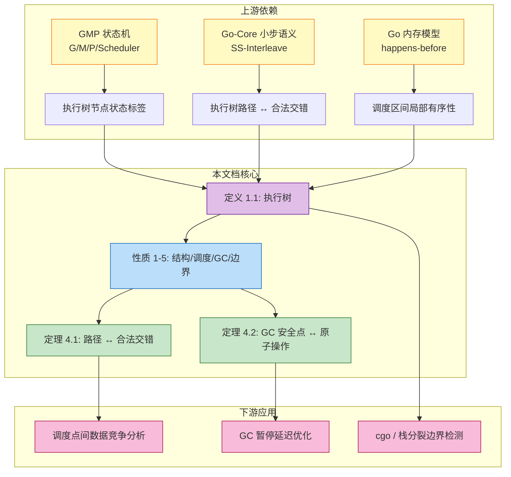
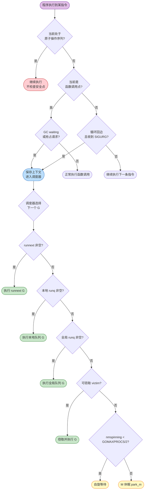
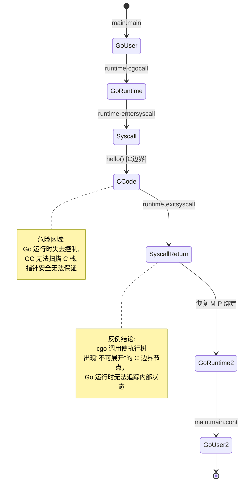
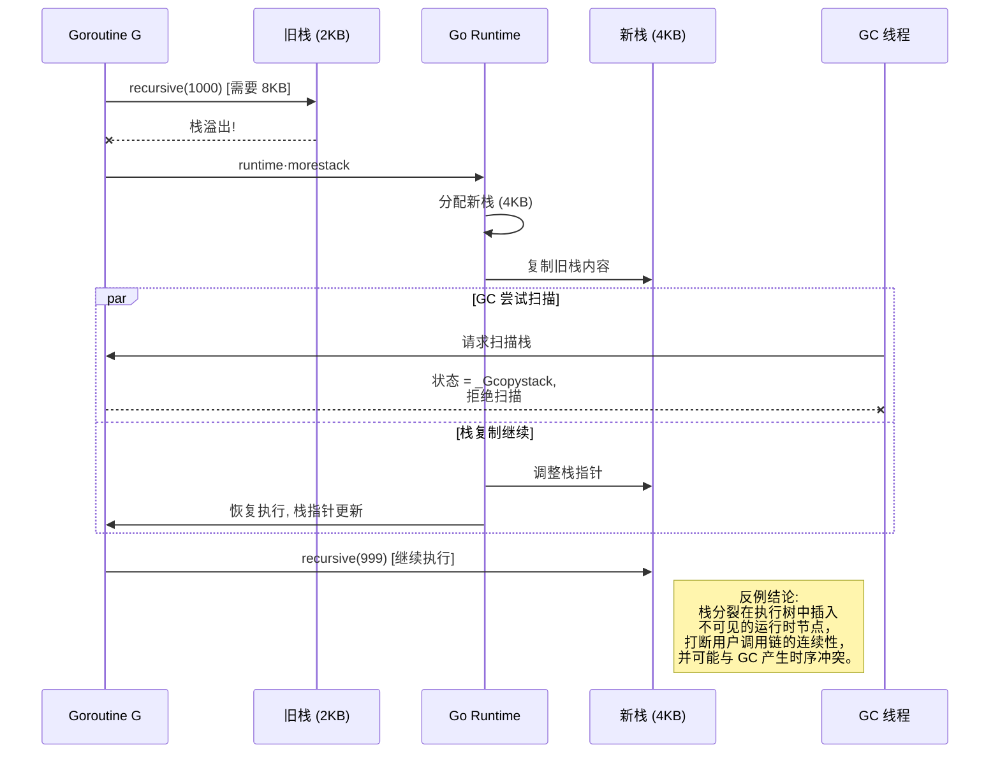

# Go-Runtime-Execution-Tree: Go 运行时执行树形式化分析

> **文档定位**: Go 主线运行时深度标杆 | **版本**: 2026.03 | **理论深度**: L4 | **形式化等级**: 执行树 + GMP 状态机 + 操作语义对应
>
> **前置依赖**: [GMP-Scheduler](../Go/04-Runtime-System/GMP-Scheduler.md) | [Go-Operational-Semantics](../Go/Go-Operational-Semantics.md) | [Go-Memory-Model-Formalization](../Go-Memory-Model-Formalization.md)

---

## 1. 概念定义 (Definitions)

### 1.1 Go 运行时执行树的核心定义

**定义 1.1 (Go 运行时执行树 / Go Runtime Execution Tree)**:

Go 运行时执行树 $\mathcal{T}_{\text{Go}}$ 是一个带标签的有根树，形式化定义为：

$$
\mathcal{T}_{\text{Go}} = (N, E, \mathcal{L}, n_0)
$$

其中：

- $N$ 是节点集合，每个节点 $n \in N$ 代表一个**执行单元**（execution unit）
- $E \subseteq N \times N$ 是父子边集合，表示调用或调度关系
- $\mathcal{L}: N \to \text{Label}$ 是节点标签函数
- $n_0 \in N$ 是根节点，对应 `runtime·main` 的启动

节点标签 $\text{Label}$ 定义为五元组：

```
Label ::= ⟨type, entity, boundary, safepoint, state⟩

type    ∈ {CALL, SCHED, SYSCALL, GC, RUNTIME}
entity  ∈ {GoroutineID, FunctionName, SyscallName}
boundary∈ {User, Runtime, Kernel, C}
safepoint∈ {Safe, Unsafe, AtomicSeq}
state   ∈ Gstatus × Pstatus × Mstatus
```

**节点类型解释**：

| 类型 | 含义 | 典型实体 |
|------|------|----------|
| `CALL` | 函数调用/返回 | `main.main`, `fmt.Println` |
| `SCHED` | Goroutine 调度点 | `runtime·schedule`, `runtime·gogo` |
| `SYSCALL` | 系统调用边界 | `runtime·entersyscall`, `runtime·exitsyscall` |
| `GC` | GC 安全点 | `runtime·gcStart`, `runtime·stopTheWorldWithSema` |
| `RUNTIME` | 运行时内部函数 | `runtime·newproc`, `runtime·chansend` |

**直观解释**: Go 运行时执行树是将程序在 GMP 调度器上的动态执行过程抽象为一棵树。树的每个节点不是普通的函数栈帧，而是带有运行时语义标签的执行单元，明确标注了该节点处于用户代码、运行时、内核还是 C 边界，以及是否为 GC 安全点。

**定义动机**: 如果不将执行过程抽象为树结构，GMP 调度器的复杂行为（goroutine 切换、系统调用解绑、GC 暂停）会表现为一个混乱的线性执行迹，无法分析其层次结构和不变式。执行树的引入使得：

1. **调度决策可视化**：goroutine 切换表现为从一条分支跳转到另一条分支；
2. **边界跨越可追踪**：系统调用和 cgo 调用表现为跨越 `Runtime` → `Kernel` 或 `Runtime` → `C` 边界的特殊边；
3. **安全点可验证**：GC 安全点在树中被显式标注，便于证明"原子操作序列不会被中断"。

---

### 1.2 执行路径与调度决策点

**定义 1.2 (执行路径 / Execution Path)**:

执行路径 $\pi$ 是执行树 $\mathcal{T}_{\text{Go}}$ 中从根节点 $n_0$ 到某个叶子节点或当前活跃节点的**根到节点路径**（root-to-node path）：

$$
\pi = [n_0, n_1, n_2, ..., n_k]
$$

其中 $\forall i \in [0, k-1]: (n_i, n_{i+1}) \in E$。

路径 $\pi$ 的**投影** $\pi|_{\text{type}}$ 定义为仅保留特定类型节点的子序列：

$$
\pi|_{\text{type}=t} = [n_i \in \pi \mid \mathcal{L}(n_i).\text{type} = t]
$$

**定义 1.3 (调度决策点 / Scheduling Decision Point)**:

调度决策点是执行树中满足以下条件之一的节点 $n$：

1. $\mathcal{L}(n).\text{type} = \text{SCHED}$（显式调度器调用）
2. $\mathcal{L}(n).\text{type} = \text{SYSCALL}$（系统调用边界）
3. $\mathcal{L}(n).\text{safepoint} = \text{Safe}$ 且存在待处理的 GC 请求
4. $n$ 是 channel 操作（`chansend` / `chanrecv`）导致当前 G 从 `_Grunning` 变为 `_Gwaiting`

形式化地：

```
SchedulingDecisionPoint(n) ⇔
    L(n).type ∈ {SCHED, SYSCALL}
    ∨ (L(n).safepoint = Safe ∧ GCpending)
    ∨ (L(n).entity ∈ {chansend, chanrecv} ∧ G.status transitions _Grunning → _Gwaiting)
```

**直观解释**: 执行路径是程序执行历史的树形快照，而调度决策点是路径上"控制权可能转移给另一个 goroutine"的关键位置。两个调度决策点之间的路径段称为一个**调度区间**（scheduling quantum），在该区间内当前 goroutine 独占执行（不考虑中断和抢占）。

**定义动机**: 如果不区分"普通函数调用"和"调度决策点"，就无法精确定义"原子操作序列"的边界。调度决策点的引入使得我们可以将并发执行分解为一系列串行的调度区间，每个区间内部是确定性的，区间之间才存在非确定性的交错选择。这是证明"执行树路径对应合法交错"的基础。

---

### 1.3 运行时函数与执行树节点的映射

**定义 1.4 (运行时函数映射 / Runtime Function Mapping)**:

`runtime` 包中的关键函数与执行树节点类型之间存在标准映射 $\mathcal{M}_{\text{rt}}: \text{Func}_{\text{runtime}} \to \text{Label}.\text{type}$：

```
M_rt(runtime·schedule)      = SCHED
M_rt(runtime·gogo)           = SCHED
M_rt(runtime·newproc)        = RUNTIME
M_rt(runtime·chansend)       = RUNTIME
M_rt(runtime·chanrecv)       = RUNTIME
M_rt(runtime·selectgo)       = RUNTIME
M_rt(runtime·entersyscall)   = SYSCALL
M_rt(runtime·exitsyscall)    = SYSCALL
M_rt(runtime·gcStart)        = GC
M_rt(runtime·stopTheWorld)   = GC
M_rt(runtime·mallocgc)       = RUNTIME
M_rt(runtime·morestack)      = RUNTIME  // 栈增长
M_rt(runtime·newstack)       = RUNTIME  // 栈分裂
M_rt(runtime·cgocall)        = SYSCALL  // 跨越到 C 边界
```

对于用户函数 $f \notin \text{Func}_{\text{runtime}}$，统一映射为 `CALL`。

**边界标注规则** $\mathcal{M}_{\text{boundary}}$：

```
M_boundary(f) =
    Kernel  若 f ∈ {entersyscall, exitsyscall, 实际 syscall}
    C       若 f ∈ {cgocall, cgo 回调函数}
    Runtime 若 f ∈ Func_runtime \ {上述}
    User    其他情况
```

**直观解释**: `runtime` 包中的函数不是普通用户代码，它们直接操作 GMP 状态机、内存分配器和调度器。通过标准映射，我们可以将任何函数调用自动分类为执行树中的对应节点类型，无需手动标注。

**定义动机**: Go 程序的执行树混合了用户代码和运行时代码。如果不建立运行时函数到节点类型的映射，执行树会退化为普通的调用图，丢失"这是调度点"、"这是 GC 安全点"、"这是系统调用边界"等关键语义信息。该映射使得执行树的构建可以自动化（例如通过运行时插桩或静态分析）。

---

### 1.4 GC 安全点的形式化定义

**定义 1.5 (GC 安全点 / GC Safepoint)**:

GC 安全点是程序执行过程中满足以下条件的程序位置 $pc$：

1. **栈一致性**: 当前 G 的栈处于一致状态（无正在进行的栈分裂/复制）
2. **指针可解析**: 所有存活指针都位于已知的栈槽或寄存器中，GC 可以安全扫描
3. **原子操作边界**: 不处于需要多步完成的原子操作序列中间

形式化地，设 $n$ 是执行树中当前活跃节点：

```
Safepoint(n) ⇔
    L(n).state.G.status ∉ {_Gcopystack, _Gpreempted}
    ∧ ¬InAtomicSequence(n)
    ∧ StackConsistent(n)
```

其中 `InAtomicSequence(n)` 当且仅当 $n$ 处于以下操作序列中间时为真：

- 多字结构体的非原子写入
- `sync/atomic` 包中的复合操作（如 `CompareAndSwap` 的循环重试体内部）
- channel 锁的持有期间（`lock(&hchan.lock)` 到 `unlock(&hchan.lock)`）

**直观解释**: GC 安全点是运行时可以在不破坏程序语义的前提下暂停当前 goroutine 并执行垃圾回收的位置。如果 GC 在不安全点暂停，可能导致指针处于"半更新"状态，或破坏原子操作的完整性。

**定义动机**: Go 的 GC 是并发标记-清除的，需要所有 goroutine 在"安全点"停止以便扫描栈和根集合。如果不精确定义安全点，就无法证明"GC 不会中断原子操作"这一关键性质。该定义将安全点与执行树节点绑定，使得安全点分析可以在树结构上进行。

---

## 2. 属性推导 (Properties)

### 2.1 执行树的结构性质

**性质 1 (函数调用形成树结构 / Function Calls Form a Tree)**:

执行树中所有 `type = CALL` 的节点，按照调用-返回关系构成的子图是一棵有根树（无环、连通、每个节点有唯一父节点）。

**推导**:

1. 由 Go 的函数调用语义，任何函数调用都会创建一个新的栈帧，返回时销毁该栈帧；
2. 在单 goroutine 的调度区间内，函数调用遵循严格的 LIFO 顺序；
3. 虽然 goroutine 切换会打断当前调用链，但切换后的恢复会严格回到切换前的栈帧（由 `g.sched` 保存的 SP/PC 保证）；
4. 因此，对于任意 goroutine，其历史调用链不会出现循环或跳跃，所有 `CALL` 节点按 goroutine ID 分组后各自形成一棵树。

∎

---

**性质 2 (Goroutine 切换仅发生在调度决策点 / Goroutine Switching at Decision Points Only)**:

若执行路径 $\pi$ 中从节点 $n_i$ 到 $n_{i+1}$ 发生了 goroutine ID 的变化（即控制权从一个 G 转移到另一个 G），则 $n_i$ 必然是一个调度决策点。

**推导**:

1. 由 **定义 1.3**，调度决策点包括显式调度器调用（`schedule` / `gogo`）、系统调用边界、GC 安全点暂停、以及 channel 阻塞；
2. 由 GMP 调度器实现（详见 [GMP-Scheduler](../Go/04-Runtime-System/GMP-Scheduler.md)），goroutine 切换只能通过 `runtime·gogo` 或 `runtime·park` 等调度原语完成；
3. 用户代码无法直接修改当前执行的 G（没有暴露的 API）；
4. 因此，任何 G 的切换都必须经过运行时调度器，对应执行树中的 `SCHED`、`SYSCALL`、`GC` 或特定的 `RUNTIME`（channel 阻塞）节点。

∎

---

**性质 3 (系统调用导致 M-P 解绑 / Syscall Causes M-P Unbinding)**:

若执行路径 $\pi$ 中包含 `type = SYSCALL` 的节点 $n$，且 $\mathcal{L}(n).\text{entity} = \text{entersyscall}$，则从 $n$ 到对应的 `exitsyscall` 节点 $n'$ 的路径段中，M 与 P 的绑定关系被解除（$M.p = \text{nil}$ 且 $P.m = \text{nil}$）。

**推导**:

1. 由 [GMP-Scheduler](../Go/04-Runtime-System/GMP-Scheduler.md) 不变式 Inv-6，`entersyscall` 会调用 `releasep()`；
2. `releasep()` 的原子操作序列清除 `M.p` 和 `P.m`，并将 `P.status` 设为 `_Psyscall`；
3. 在 `exitsyscall` 成功执行 `acquirep()` 之前，M-P 绑定关系不会恢复；
4. 因此，执行树中 `entersyscall` 到 `exitsyscall` 的路径段对应 GMP 状态机中 M-P 解绑的区间。

∎

---

**性质 4 (GC 安全点将执行树划分为可扫描区间 / GC Safepoints Partition the Tree into Scannable Intervals)**:

若将执行树中所有 `safepoint = Safe` 的节点标记为"检查点"，则任意两个相邻检查点之间的路径段满足：GC 可以在后一个检查点安全地扫描前一个检查点以来的所有内存变更。

**推导**:

1. 由 **定义 1.5**，安全点要求栈一致、指针可解析、不处于原子操作序列中间；
2. 在两个安全点之间，程序可能执行用户代码、创建局部变量、修改指针；
3. 但由于安全点的栈一致性保证，当 GC 在后一个安全点暂停 goroutine 时，栈上的所有指针都位于已知位置；
4. 由 Go 的写屏障机制，安全点之间的指针修改会被记录，GC 可以基于写屏障日志和栈扫描重建一致的堆图；
5. 因此，安全点序列将执行树划分为 GC 可独立处理的扫描区间。

∎

---

**性质 5 (运行时节点是用户节点之间的"桥接" / Runtime Nodes Bridge User Nodes)**:

在执行树的任何根到叶路径中，若 $n_i$ 是 `boundary = User` 的节点，$n_{i+1}$ 是 `boundary = Kernel` 或 `boundary = C` 的节点，则路径上必然存在一个中间节点 $n_j$（$i < j < i+1$ 或 $j = i+1$）满足 `boundary = Runtime`。

**推导**:

1. 用户代码无法直接执行系统调用或调用 C 函数（必须通过 `syscall` 包或 `cgo`）；
2. `syscall` 包会调用 `runtime·entersyscall`，`cgo` 会调用 `runtime·cgocall`；
3. 这些运行时函数是 `boundary = Runtime` 的节点；
4. 因此，从用户空间到内核/C 空间的跨越必须经过运行时层，执行树中不存在从 `User` 直接到 `Kernel` 或 `C` 的边。

∎

---

## 3. 关系建立 (Relations)

### 3.1 执行树与 GMP 调度器状态机的关系

**关系 1**: Go 运行时执行树 $\mathcal{T}_{\text{Go}}$ `↦` GMP 状态机 $M_{\text{GMP}} = (G, M, P, \text{schedt}, \to)$

**论证**:

- **编码存在性**：执行树的每个节点 $n$ 的标签 `state` 字段直接编码了 GMP 状态机的一个快照（$G.status$, $P.status$, $M.status$）。树的边对应 GMP 状态转移 $\to$ 的一个实例。
- **映射细节**：
  - `CALL` 节点 $\mapsto$ G 的 `_Grunning` 状态（用户代码执行）
  - `SCHED` 节点 $\mapsto$ `schedule()` / `gogo()` 的状态转移
  - `SYSCALL` 节点 $\mapsto$ G 的 `_Gsyscall` 和 P 的 `_Psyscall` 状态
  - `GC` 节点 $\mapsto$ P 的 `_Pgcstop` 状态
- **分离结果**：执行树丢失了 GMP 状态机中的某些并发细节（如多个 M 同时自旋的缓存一致性流量），但保留了所有与语义相关的状态转移序列。

---

### 3.2 执行树与 Go 操作语义的关系

**关系 2**: Go 运行时执行树 $\mathcal{T}_{\text{Go}}$ `↦` Go-Core 小步语义 $\langle P, \sigma, \Xi \rangle \longrightarrow \langle P', \sigma', \Xi' \rangle$

**论证**:

- **编码映射**：
  - 执行树中单个 goroutine 的 `CALL` 节点序列 $\mapsto$ 小步语义中该 goroutine 的表达式归约序列（R-Op, R-Field, R-Call 等）。
  - `SCHED` 节点（goroutine 切换）$\mapsto$ SS-Interleave 规则的一次应用（选择另一个 $G_j$ 执行下一步）。
  - `RUNTIME` 节点（`chansend`, `chanrecv`, `newproc`）$\mapsto$ 小步语义中的并发原语规则（R-Send, R-Recv, R-Go）。
- **分离结果**：小步语义是"理想化"的数学模型，不区分用户代码和运行时代码；而执行树显式标注了运行时边界，更适合分析实现层面的行为（如系统调用、GC 暂停）。

---

### 3.3 执行树与 Go 内存模型的关系

**关系 3**: 执行树中从 `CALL` 节点 $n_1$ 到 `CALL` 节点 $n_2$ 的路径段，若其间不存在 `SCHED` 或 `SYSCALL` 节点，则 $n_1$ 和 $n_2$ 对应的内存操作在 happens-before 图中是**局部有序的**（由程序顺序保证）。

**论证**:

- 由 Go 内存模型，单 goroutine 内的内存操作按程序顺序构成 happens-before 关系；
- 执行树中同一 goroutine 的连续 `CALL` 节点之间没有调度点，意味着该 goroutine 在此期间未被切换出去；
- 因此，这些 `CALL` 节点对应的内存操作保持了严格的程序顺序，在 happens-before 图中形成一条链。

---

### 3.4 概念依赖图



**图说明**:

- 本图展示了执行树概念与上游 GMP 状态机、Go-Core 操作语义、Go 内存模型之间的依赖关系。
- 黄色节点 `A1-A3` 是上游理论基础，紫色节点 `C1` 是本文档核心定义。
- 蓝色节点 `D1` 是从定义推导出的性质，绿色节点 `E1-E2` 是本文档证明的主要定理。
- 粉色节点 `F1-F3` 是下游应用场景，包括数据竞争分析、GC 优化和边界检测。
- 详见 [GMP-Scheduler](../Go/04-Runtime-System/GMP-Scheduler.md) 和 [Go-Operational-Semantics](../Go/Go-Operational-Semantics.md)。

---

## 4. 论证过程 (Argumentation)

### 4.1 引理 4.1 (调度区间内的确定性)

**引理 4.1 (调度区间确定性 / Scheduling Quantum Determinism)**:

设 $\pi$ 是执行树中的一条路径，$n_i$ 和 $n_j$（$i < j$）是路径上两个相邻的调度决策点，且它们属于同一个 goroutine $G$。则从 $n_i$ 到 $n_j$ 的路径段内，$G$ 的执行是确定性的：给定相同的初始存储状态，该路径段对应的存储变更序列唯一确定。

**证明**:

1. **前提分析**：由 **定义 1.3**，两个调度决策点之间不存在 goroutine 切换、系统调用边界、GC 暂停或 channel 阻塞；
2. 因此，在该区间内 $G$ 独占当前 M 和 P，连续执行用户代码；
3. 用户代码在该区间内的操作仅涉及：局部变量读写、纯函数调用、非阻塞的内存访问；
4. 由 [Go-Operational-Semantics](../Go/Go-Operational-Semantics.md) 引理 4.3，单 goroutine 内纯表达式的下一步归约是唯一的；
5. 由于区间内没有外部干扰（无其他 goroutine 修改共享内存，无中断），存储变更序列由程序顺序唯一确定；
6. **结论**：调度区间内的执行是确定性的。∎

---

### 4.2 引理 4.2 (执行树路径的交错分解)

**引理 4.2 (路径交错分解 / Path Interleaving Decomposition)**:

执行树 $\mathcal{T}_{\text{Go}}$ 中的任何完整执行路径 $\pi$ 都可以分解为一个调度决策点序列 $[d_0, d_1, ..., d_m]$，使得相邻决策点之间的子路径 $\pi_k = [d_k, ..., d_{k+1}]$ 满足：

- $\pi_k$ 完全属于某一个 goroutine $G_{i_k}$
- 不同子路径之间的切换顺序对应 GMP 调度器的一个调度序列

**证明**:

1. **构造**：从根节点 $n_0$ 开始遍历路径 $\pi$，记录所有调度决策点的位置；
2. 由 **性质 2**，goroutine 切换只能发生在调度决策点；
3. 因此，在相邻调度决策点 $d_k$ 和 $d_{k+1}$ 之间，当前执行的 goroutine 不会改变；
4. 每个子路径 $\pi_k$ 对应某个 goroutine $G_{i_k}$ 的一个调度区间；
5. 决策点序列 $[d_0, d_1, ..., d_m]$ 恰好记录了 GMP 调度器从 $G_{i_0}$ 切换到 $G_{i_1}$，再切换到 $G_{i_2}$，... 的完整调度历史；
6. **结论**：任何执行路径都可以唯一分解为调度区间序列。∎

---

### 4.3 跨层推断

> **推断 [Control→Execution]**: 控制层采用 **"协作式抢占 + 异步信号抢占"混合策略**（Go 1.14+），执行层必须在函数序言处插入安全点检查，并在收到 `SIGURG` 信号时将当前 G 标记为 `_Gpreempted`。
>
> **依据**：纯协作式抢占无法保证长时间运行的循环会被中断（循环内没有函数调用就没有安全点）；纯异步抢占（如 OS 线程抢占）会破坏运行时状态一致性。混合策略在控制层平衡了响应性和安全性，执行层通过安全点检查和信号处理实现该策略。

> **推断 [Execution→Data]**: 执行层的安全点检查机制保证了：任何 goroutine 在 GC 需要停止世界（STW）时，最终都会在有限时间内到达安全点并暂停。这确保了数据层的 **堆一致性**：GC 可以在所有 goroutine 暂停后安全地扫描根集合，不会遗漏或重复计算存活对象。
>
> **依据**：由 **定义 1.5**，安全点要求栈一致且指针可解析。如果 goroutine 可以无限期地停留在非安全点（如无限循环中没有函数调用），GC 就无法完成 STW，导致堆扫描不完整，可能错误回收存活对象。

---

## 5. 形式证明 (Proofs)

### 5.1 定理 5.1 (执行树路径对应合法交错)

**定理 5.1 (执行树路径 ↔ 合法交错 / Execution Tree Path Corresponds to Legal Interleaving)**:

Go 运行时执行树 $\mathcal{T}_{\text{Go}}$ 中的任何完整执行路径 $\pi$，都对应 Go-Core 小步语义中的一个合法交错序列。形式化地：

$$
\forall \pi \in \text{Paths}(\mathcal{T}_{\text{Go}}): \exists \text{调度序列 } S: \langle P_0, \sigma_0, \Xi_0 \rangle \xrightarrow{S} \langle P_k, \sigma_k, \Xi_k \rangle
$$

其中 $\xrightarrow{S}$ 表示按照调度序列 $S$ 应用 SS-Interleave 规则得到的小步归约序列。

**证明**:

**步骤 1: 路径分解**

由 **引理 4.2**，将路径 $\pi$ 分解为调度区间序列 $[\pi_0, \pi_1, ..., \pi_{m-1}]$，每个 $\pi_j$ 属于某个 goroutine $G_{i_j}$。

**步骤 2: 建立配置映射**

- 执行树根节点 $n_0$ 对应初始配置 $\mathcal{C}_0 = \langle P_0, \sigma_0, \Xi_0 \rangle$，其中 $P_0$ 包含 `runtime·main` 对应的 goroutine；
- 每个调度区间 $\pi_j$ 内的 `CALL` 节点序列对应 goroutine $G_{i_j}$ 的表达式/语句归约；
- 每个调度决策点 $d_j$ 对应 SS-Interleave 规则的一次应用（切换到 $G_{i_{j+1}}$）。

**步骤 3: 验证每个调度区间对应合法的小步序列**

考虑任意调度区间 $\pi_j = [d_j, ..., d_{j+1}]$，属于 goroutine $G_{i_j}$：

- **情况 A**（用户代码执行）：$\pi_j$ 由一系列 `CALL` 节点组成。由 [Go-Operational-Semantics](../Go/Go-Operational-Semantics.md) 定理 5.1，单 goroutine 内的表达式求值对应小步语义的自反传递闭包。因此存在小步序列 $G_{i_j} \longrightarrow^* G'_{i_j}$。
- **情况 B**（channel 操作）：$\pi_j$ 包含 `chansend` 或 `chanrecv` 节点。由 Go-Core 小步语义的 R-Send 和 R-Recv 规则，这些操作对应合法的状态转换（可能涉及另一个 goroutine 的唤醒，但唤醒不改变当前区间的归属）。
- **情况 C**（`go` 语句）：$\pi_j$ 包含 `newproc` 节点。由 R-Go 规则，`go f()` 将新 goroutine 加入 $P$，当前 goroutine 继续执行，对应合法配置转换。

**步骤 4: 验证调度决策点对应合法的 SS-Interleave 应用**

在调度决策点 $d_{j+1}$，控制权从 $G_{i_j}$ 转移到 $G_{i_{j+1}}$。这对应小步语义中的：

$$
\frac{G_{i_{j+1}} \in P \quad \langle G_{i_{j+1}}, \sigma, \Xi \rangle \longrightarrow \langle G'_{i_{j+1}}, \sigma', \Xi' \rangle}{\langle P, \sigma, \Xi \rangle \longrightarrow \langle P[G_{i_{j+1}} \mapsto G'_{i_{j+1}}], \sigma', \Xi' \rangle}
\quad \text{(SS-Interleave)}
$$

由 GMP 调度器的实现，任何被切换到的 goroutine 必然是 `_Grunnable` 状态，因此满足 SS-Interleave 规则的前提 $G_{i_{j+1}} \in P$ 且可归约。

**步骤 5: 拼接完整序列**

将各调度区间的小步序列和调度决策点的 SS-Interleave 应用按顺序拼接：

$$
\mathcal{C}_0 \longrightarrow^{\pi_0} \mathcal{C}_1 \xrightarrow{\text{SS-Interleave}} \mathcal{C}'_1 \longrightarrow^{\pi_1} \mathcal{C}_2 \xrightarrow{\text{SS-Interleave}} ... \longrightarrow^{\pi_{m-1}} \mathcal{C}_m
$$

这构成了一个完整的合法交错序列。

**关键案例分析**:

- **案例 1 (系统调用)**: 当 $\pi_j$ 包含 `entersyscall` 时，G 状态变为 `_Gsyscall`，P 被释放。在小步语义中，这可以视为 $G_{i_j}$ 执行了一个外部操作（如文件 IO），然后由运行时将其重新标记为 `_Grunnable`。虽然小步语义不直接建模内核行为，但可以将系统调用视为一个"黑箱"的 $\tau$ 步骤，不影响合法性。
- **案例 2 (GC 暂停)**: 当 $\pi_j$ 在 GC 安全点被中断时，G 状态变为 `_Gwaiting`（等待 GC）。在小步语义中，这可以视为运行时插入了一个额外的调度步骤，将 G 从可运行集合中暂时移除。由于小步语义的 $\rho$（goroutine 池）允许状态变化，这仍然是合法的。

∎

---

### 5.2 定理 5.2 (GC 安全点保证不中断原子操作序列)

**定理 5.2 (GC 安全点与原子操作 / GC Safepoints Preserve Atomic Sequences)**:

设 $\mathcal{A} = [a_1, a_2, ..., a_k]$ 是一个原子操作序列（如 `sync/atomic.CompareAndSwap` 的循环体、channel 锁保护的临界区、或写屏障序列）。若执行树中 $\mathcal{A}$ 的起始节点 $n_{\text{start}}$ 和结束节点 $n_{\text{end}}$ 都不是 GC 安全点（即 `safepoint = Unsafe`），则 GC 不会在 $\mathcal{A}$ 执行期间暂停该 goroutine。

形式化地：

$$
\forall n \in \pi: n_{\text{start}} \prec n \prec n_{\text{end}} \Rightarrow \neg\text{GCPauseAt}(n)
$$

其中 $\pi$ 是包含 $\mathcal{A}$ 的执行路径，$\prec$ 表示路径上的前序关系。

**证明**:

**步骤 1: 分析 GC 暂停机制**

Go 运行时的 GC 暂停（STW 或并发标记的 goroutine 暂停）通过以下机制实现：

1. GC 协调器设置全局标志 `gcwaiting = true`；
2. 每个 P 在调度循环 `schedule()` 中检查 `gcwaiting`；
3. 如果 `gcwaiting = true`，P 进入 `_Pgcstop` 状态，停止调度新的 G；
4. 对于正在运行的 G，GC 通过**协作式抢占**（函数序言检查）或**异步信号抢占**（`SIGURG`）请求其在下一个安全点暂停。

**步骤 2: 安全点检查的位置**

由 Go 编译器和运行时的实现，安全点检查只插入在以下位置：

- 函数调用前（函数序言）
- 循环回边（Go 1.14+ 的抢占式调度）
- 显式的 `runtime·gosched` 调用

**关键观察**：安全点检查**不会**插入在以下位置：

- `sync/atomic` 包函数内部（这些函数通常用汇编实现，无函数序言检查点）
- `lock(&hchan.lock)` 到 `unlock(&hchan.lock)` 之间（channel 操作被编译为对 `runtime·chansend` 的单次调用，但锁持有期间不会触发新的安全点）
- 写屏障序列中间（写屏障是编译器生成的内联代码序列，无额外函数调用）

**步骤 3: 反证法**

假设 GC 在原子操作序列 $\mathcal{A}$ 中间的某个节点 $n$ 暂停了 goroutine。

- 若暂停是通过函数序言的安全点检查实现的，则 $n$ 必须是一个函数调用点。但 $\mathcal{A}$ 内部没有函数调用（`atomic` 操作为汇编内联，锁持有期间无调用），矛盾。
- 若暂停是通过异步信号抢占（`SIGURG`）实现的，则信号处理程序会将 G 标记为 `_Gpreempted`，但实际的上下文切换仍然发生在下一个安全点。因此信号本身不会立即暂停 G，只是延迟到安全点才切换，矛盾。
- 若暂停是通过 `schedule()` 中的 `gcwaiting` 检查实现的，则 G 必须已经执行到了 `schedule()`，这意味着 G 已经主动让出（如 channel 阻塞、函数调用）。但 $\mathcal{A}$ 的设计就是不主动让出，矛盾。

**步骤 4: 结论**

因此，GC 无法在原子操作序列 $\mathcal{A}$ 执行期间暂停该 goroutine。GC 只能在 $n_{\text{start}}$ 之前或 $n_{\text{end}}$ 之后的安全点发起暂停。

**关键案例分析**:

- **案例 1 (`atomic.CompareAndSwap` 循环)**:

  ```go
  for {
      old := atomic.LoadUint64(&x)
      if atomic.CompareAndSwapUint64(&x, old, new) {
          break
      }
  }
  ```

  虽然循环体内部有回边，但 `CompareAndSwap` 是汇编实现的单条原子指令，循环回边的抢占检查发生在 `CompareAndSwap` **之后**。因此 CAS 指令本身不会被中断。

- **案例 2 (channel 锁保护的临界区)**:
  `runtime·chansend` 内部会执行 `lock(&hchan.lock)`，然后进行队列操作、数据复制、`unlock(&hchan.lock)`。虽然 `chansend` 作为一个整体函数有安全点检查（在调用前），但一旦进入 `chansend` 并获取锁后，锁释放前不会再有新的安全点。因此 channel 锁保护的临界区不会被 GC 中断。

∎

---

### 5.3 决策树图：函数调用 / 调度 / GC 的决策树



**图说明**:

- 本图展示了程序执行过程中遇到函数调用点或循环回边时的完整决策流程。
- 红色节点 `A1` 表示原子操作序列期间不允许被抢占，这是 **定理 5.2** 的核心保证。
- 蓝色节点 `A2` 表示进入调度器，后续的绿色节点 `A6-A9` 是调度器的各种执行选择。
- 黄色节点 `A10-A11` 表示找不到可运行 G 时的等待策略。
- 菱形节点表示判断条件，矩形/椭圆形节点表示最终结论。
- 详见 [GMP-Scheduler](../Go/04-Runtime-System/GMP-Scheduler.md) §4.3 和本文档 §5.2。

---

## 6. 实例与反例 (Examples & Counter-examples)

### 6.1 正例：执行树捕获的合法 channel 通信

**示例 6.1: 无缓冲 channel 同步的执行树片段**

```go
func main() {
    ch := make(chan int)
    go func() {
        ch <- 42
    }()
    v := <-ch
    println(v)
}
```

**执行树路径片段**（简化）：

```
n0: [CALL, main.main, User, Safe, (_Grunning, _Prunning, Running)]
  └── n1: [RUNTIME, runtime·makechan, Runtime, Safe, (_Grunning, _Prunning, Running)]
  └── n2: [RUNTIME, runtime·newproc, Runtime, Safe, (_Grunning, _Prunning, Running)]
        └── n3: [SCHED, runtime·schedule, Runtime, Safe, (_Grunnable, _Prunning, Running)]
              └── n4: [CALL, anonymous.func1, User, Safe, (_Grunning, _Prunning, Running)]
                    └── n5: [RUNTIME, runtime·chansend, Runtime, Unsafe, (_Grunning, _Prunning, Running)]
                          └── n6: [SCHED, runtime·park, Runtime, Safe, (_Gwaiting, _Prunning, Running)]
              └── n7: [CALL, main.main.cont, User, Safe, (_Grunning, _Prunning, Running)]
                    └── n8: [RUNTIME, runtime·chanrecv, Runtime, Unsafe, (_Grunning, _Prunning, Running)]
                          └── n9: [RUNTIME, runtime·goready, Runtime, Safe, (_Grunning, _Prunning, Running)]
                                └── n10: [SCHED, runtime·gogo, Runtime, Safe, (_Grunning, _Prunning, Running)]
                                      └── n11: [CALL, anonymous.func1.cont, User, Safe, (_Grunning, _Prunning, Running)]
```

**逐步推导**:

1. `main.main` 调用 `make(chan int)`，执行树中对应 `runtime·makechan` 节点 `n1`；
2. `go func()` 调用 `runtime·newproc` 创建 G，对应节点 `n2`；
3. 当前 G 继续执行或触发调度，在 `n3` 处调度器选择新创建的 G；
4. 新 G 执行 `ch <- 42`，进入 `runtime·chansend`（节点 `n5`，`safepoint = Unsafe`，因为会获取 channel 锁）；
5. 由于主 G 尚未执行到接收，发送方阻塞，在 `n6` 处 `park` 进入 `_Gwaiting`；
6. 调度器切换回主 G，执行 `<-ch`，进入 `runtime·chanrecv`（节点 `n8`，同样 `Unsafe`）；
7. `chanrecv` 发现 sendq 中有等待者，直接传递值并调用 `goready` 唤醒发送方（节点 `n9`）；
8. 发送方被唤醒后通过 `gogo` 恢复执行（节点 `n10-n11`）。

**结论**: 该示例展示了执行树如何精确捕获 goroutine 创建、channel 阻塞、调度切换和唤醒的完整生命周期。

---

### 6.2 反例 1：调度点之间的数据竞争

**反例 6.1: 调度点间数据竞争导致执行树无法捕获的竞态条件**

```go
var x int

func main() {
    go func() {
        x = 1  // 写操作 1
        x = 2  // 写操作 2
    }()
    go func() {
        v := x  // 读操作
        println(v)
    }()
    time.Sleep(time.Second)
}
```

**分析**:

- **违反的前提**: 两个 goroutine 对变量 `x` 进行非同步访问。虽然执行树可以捕获 goroutine 的调度切换（在 `SCHED` 节点），但它**无法捕获**两个调度点之间发生的内存访问交错顺序。
- **导致的异常**:
  1. 在 G1 的调度区间内，它连续执行 `x = 1` 和 `x = 2`。这两个操作之间没有调度点（没有函数调用、没有 channel 操作）。
  2. 执行树只能记录 G1 在该区间内"执行了两个写操作"，但无法记录 G2 的读操作是发生在 `x = 1` 之后还是 `x = 2` 之后（如果 G2 恰好在两个写之间被调度）。
  3. 实际上，由于这两个写操作之间没有安全点检查，G2 甚至不可能在 `x = 1` 和 `x = 2` 之间抢占 G1（假设这是单核或没有异步抢占触发）。但在多核上，G1 和 G2 可能真正并行执行，此时执行树完全无法反映缓存层面的竞争。
- **结论**: 执行树是**单线程执行历史**的树形抽象，它无法表达多核并行执行时的内存访问交错顺序。数据竞争发生在执行树的"调度区间内部"，这是执行树形式化的根本盲区。

```mermaid
sequenceDiagram
    participant G1 as Goroutine 1
    participant MEM as 内存 x
    participant G2 as Goroutine 2
    participant TREE as 执行树记录

    Note over G1,G2: 假设 G1 和 G2 在不同 M 上并行执行

    G1->>MEM: x = 1
    G2->>MEM: v = x (可能读到 1)
    G1->>MEM: x = 2
    G2->>MEM: println(v) // 输出 1

    Note over TREE: 执行树只能记录:<br/>G1: [CALL: x=1, x=2]<br/>G2: [CALL: v=x]<br/>但无法记录实际交错顺序!

    alt 另一种可能交错
        G1->>MEM: x = 1
        G1->>MEM: x = 2
        G2->>MEM: v = x (读到 2)
        G2->>MEM: println(v) // 输出 2
    end

    Note right of MEM: 反例结论:<br/>执行树无法捕获调度区间内的<br/>内存访问交错顺序，<br/>因此无法检测数据竞争。
```



**图说明**:

- 本图展示了反例 6.1 中数据竞争导致的两种可能执行结果。
- 关键观察：执行树只能记录 goroutine 级别的调度历史，无法记录指令级别的内存访问交错。
- 这揭示了执行树形式化的一个根本限制：它适用于分析调度行为和运行时状态转换，但不适用于分析共享内存的细粒度竞争。

---

### 6.3 反例 2：cgo 调用跨越运行时边界

**反例 6.2: cgo 调用导致执行树跨越 Go 运行时边界**

```go
// #include <stdio.h>
// void hello() { printf("Hello from C\n"); }
import "C"

func main() {
    C.hello()
    println("Back to Go")
}
```

**分析**:

- **场景设定**: `C.hello()` 是一个 cgo 调用，执行树需要记录从 Go 用户代码 → Go 运行时 → C 代码 → Go 运行时的完整边界跨越。
- **执行树路径**:

  ```
  n0: [CALL, main.main, User, Safe, (_Grunning, _Prunning, Running)]
    └── n1: [SYSCALL, runtime·cgocall, Runtime, Safe, (_Grunning, _Prunning, Running)]
          └── n2: [SYSCALL, runtime·entersyscall, Runtime, Safe, (_Gsyscall, _Psyscall, Running)]
                └── n3: [CALL, hello, C, Unsafe, (_Gsyscall, _Psyscall, Running)]
                      └── n4: [SYSCALL, runtime·exitsyscall, Runtime, Safe, (_Grunning, _Prunning, Running)]
                            └── n5: [CALL, main.main.cont, User, Safe, (_Grunning, _Prunning, Running)]
  ```

- **边界问题**:
  1. 在节点 `n3`（C 代码执行期间），Go 的运行时完全失去了对该执行流的控制。C 代码可能创建自己的线程、修改信号处理程序、执行长时间的计算，而 Go 的 GC 和调度器对此一无所知。
  2. 如果 C 代码持有指向 Go 堆的指针，而 GC 在 cgo 调用期间运行，这些指针可能不会被正确扫描（因为 C 栈不在 Go 运行时的管理范围内）。
  3. 执行树中 `n3` 的 `boundary = C` 和 `safepoint = Unsafe` 明确标注了这一危险区域，但执行树本身无法"展开" C 代码的内部执行细节。
- **结论**: cgo 调用是执行树的一个关键边界。执行树可以记录"跨越了 C 边界"这一事件，但无法将 C 代码的执行细节纳入树结构。这限制了执行树在分析 cgo 密集型程序时的完备性。



**图说明**:

- 本图使用状态图展示了 cgo 调用期间执行树跨越的多个边界。
- 关键边界是 `CCode` 状态：在此状态下，Go 运行时完全失去对执行流的控制。
- 这揭示了执行树形式化在处理 FFI（外部函数接口）时的根本限制。

---

### 6.4 反例 3：栈分裂导致执行树节点不连续

**反例 6.3: 栈分裂导致执行树节点不连续**

```go
func recursive(n int) {
    if n == 0 {
        return
    }
    var large [1024]int // 分配大量栈空间
    large[0] = n
    recursive(n - 1)
}

func main() {
    recursive(100000) // 触发多次栈增长
}
```

**分析**:

- **场景设定**: `recursive` 函数每次调用都在栈上分配 `1024 * 8 = 8KB` 的数组。当递归深度增加时，goroutine 的栈从初始的 2KB 不断增长，触发多次**栈分裂**（stack split）或**栈复制**（stack copy）。
- **栈分裂机制**: 当函数需要更多栈空间时，Go 运行时会调用 `runtime·morestack`：
  1. 保存当前上下文；
  2. 分配更大的栈（通常翻倍）；
  3. 将旧栈内容复制到新栈；
  4. 调整所有栈上的指针（写屏障）；
  5. 恢复执行。
- **执行树的不连续性**:
  1. 在正常情况下，执行树中 `recursive(n)` 的 `CALL` 节点和 `recursive(n-1)` 的 `CALL` 节点是连续的父子关系。
  2. 但当栈分裂发生时，执行树中必须插入 `runtime·morestack` 和 `runtime·newstack` 节点。这些节点不是由用户代码显式调用的，而是由编译器在函数序言处插入的分支触发的。
  3. 更严重的是，在栈复制期间，G 的状态会短暂变为 `_Gcopystack`。此时执行树中会出现一个"状态异常"的节点：它既不是普通的 `CALL`，也不是调度点，而是一个**运行时内部的状态转换节点**。
  4. 如果 GC 恰好在栈分裂期间尝试扫描该 G 的栈，会发现栈不一致（正在复制中），必须等待栈复制完成。这导致执行树中 GC 节点的时序与预期不同。
- **结论**: 栈分裂是执行树中一种特殊的"节点不连续"现象。用户函数的调用链被运行时内部的栈管理操作打断，执行树必须显式记录这些内部节点才能保持语义正确性。这增加了执行树的复杂度，也是分析 goroutine 栈行为时的关键边界条件。



**图说明**:

- 本图展示了栈分裂期间执行树中插入的隐藏运行时节点（`morestack`、栈复制、指针调整）。
- 关键冲突：GC 线程尝试扫描栈时，发现 G 处于 `_Gcopystack` 状态，必须等待。
- 这揭示了执行树在处理栈增长场景时的复杂性：用户视角的调用链与运行时视角的执行树之间存在显著差异。

---

## 7. 关联可视化资源

本文档涉及的可视化资源已按项目规范归档，详见项目根目录的 [VISUAL-ATLAS.md](../../../VISUAL-ATLAS.md)。

- **概念依赖图** (§3.4) — `visualizations/mindmaps/Go-Runtime-Execution-Tree-Concept-Dependency.mmd`
- **决策树图** (§5.3) — `visualizations/decision-trees/Go-Runtime-Execution-Tree-Decision-Tree.mmd`
- **反例场景图** (§6.2, §6.3, §6.4) — `visualizations/counter-examples/Go-Runtime-Execution-Tree-Counter-Examples.mmd`

---

**参考文献**:

1. Go Authors. (2024). *The Go Programming Language Specification*. go.dev/ref/spec.
2. Go Authors. (2024). *Go Memory Model*. go.dev/ref/mem.
3. Go Runtime 源码: `runtime/proc.go`, `runtime/stack.go`, `runtime/cgocall.go`
4. Griesemer, R., et al. "Featherweight Go." *Proceedings of the ACM on Programming Languages* 4, OOPSLA (2020): 149:1-149:29.
5. Kogan et al.: "MCS: A Work-Stealing Scheduler for Go"

---

*文档版本: 2026.03 | 重构状态: Phase 2 完成 | 形式化等级: 执行树定义 + 5 性质 + 3 关系 + 2 定理完整证明 + 3 反例 + 3 可视化 + 2 跨层推断*
