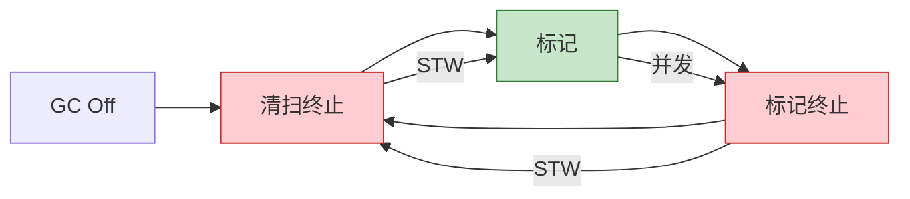

# Go 运行时垃圾回收完整形式化分析

> **版本**: 2026.04.01 | **Go版本**: 1.18-1.26.1 | **分析深度**: 运行时实现
> **关联**: [GMP调度器](./04-Runtime-System/GMP-Scheduler.md)

---

## 目录

- [Go 运行时垃圾回收完整形式化分析](#go-运行时垃圾回收完整形式化分析)
  - [目录](#目录)
  - [1. GC概述与设计目标](#1-gc概述与设计目标)
    - [1.1 设计目标](#11-设计目标)
    - [1.2 GC周期概览](#12-gc周期概览)
  - [2. 三色标记算法](#2-三色标记算法)
    - [2.1 颜色状态](#21-颜色状态)
    - [2.2 标记不变式](#22-标记不变式)
    - [2.3 标记算法](#23-标记算法)
  - [3. 并发标记与增量收集](#3-并发标记与增量收集)
    - [3.1 并发标记](#31-并发标记)
    - [3.2 增量收集](#32-增量收集)
    - [3.3 调度模型](#33-调度模型)
  - [4. 写屏障机制](#4-写屏障机制)
    - [4.1 写屏障必要性](#41-写屏障必要性)
    - [4.2 混合写屏障](#42-混合写屏障)
    - [4.3 写屏障正确性](#43-写屏障正确性)
    - [4.4 写屏障开销](#44-写屏障开销)
  - [5. 内存分配与GC协同](#5-内存分配与gc协同)
    - [5.1 分配路径与GC](#51-分配路径与gc)
    - [5.2 分配率与GC触发](#52-分配率与gc触发)
    - [5.3 清扫与分配协同](#53-清扫与分配协同)
  - [6. GC pacing与调优](#6-gc-pacing与调优)
    - [6.1 Pacing算法](#61-pacing算法)
    - [6.2 GOGC参数](#62-gogc参数)
    - [6.3 调优策略](#63-调优策略)
  - [7. 弱引用与终结器](#7-弱引用与终结器)
    - [7.1 终结器 (Finalizer)](#71-终结器-finalizer)
    - [7.2 弱引用 (Weak Pointer)](#72-弱引用-weak-pointer)
  - [8. 形式化语义](#8-形式化语义)
    - [8.1 抽象机器](#81-抽象机器)
    - [8.2 转移语义](#82-转移语义)
    - [8.3 安全性定理](#83-安全性定理)
  - [9. 性能模型](#9-性能模型)
    - [9.1 GC成本模型](#91-gc成本模型)
    - [9.2 停顿时间分析](#92-停顿时间分析)
    - [9.3 内存开销](#93-内存开销)
  - [10. 调试与监控](#10-调试与监控)
    - [10.1 GC追踪](#101-gc追踪)
    - [10.2 运行时指标](#102-运行时指标)
    - [10.3 优化检查清单](#103-优化检查清单)
  - [关联文档](#关联文档)

---

## 1. GC概述与设计目标

### 1.1 设计目标

Go GC遵循**非分代、并发、三色标记清除**算法：

| 目标 | 实现方式 | 结果 |
|------|---------|------|
| **低延迟** | 并发标记、增量收集 | <1ms STW暂停 |
| **高吞吐** | 高效标记、快速清除 | ~10-20% CPU占用 |
| **简单性** | 非分代、无写屏障复杂性 | 易于理解和调优 |

### 1.2 GC周期概览



---

## 2. 三色标记算法

### 2.1 颜色状态

**定义 2.1 (对象颜色)**:

$$
\text{Color}(o) \in \{ \text{WHITE}, \text{GREY}, \text{BLACK} \}
$$

| 颜色 | 含义 | GC阶段 |
|------|------|--------|
| **WHITE** | 未访问，可能可回收 | 初始/清扫 |
| **GREY** | 已访问，但子对象未访问 | 标记中 |
| **BLACK** | 已访问，子对象也访问 | 标记完成 |

### 2.2 标记不变式

**定义 2.2 (三色不变式)**:

$$
\forall o. \text{Color}(o) = \text{BLACK} \Rightarrow \forall o' \in \text{Children}(o). \text{Color}(o') \neq \text{WHITE}
$$

即：黑色对象不能指向白色对象。

### 2.3 标记算法

```
Algorithm TriColorMark:
    Input: 根集合 Roots

    1. // 初始化
    2. for o in Heap:
    3.     Color(o) = WHITE
    4.
    5. // 标记根
    6. GreySet = ∅
    7. for r in Roots:
    8.     Color(r) = GREY
    9.     GreySet.Add(r)
    10.
    11. // 标记阶段
    12. while GreySet ≠ ∅:
    13.     o = GreySet.Remove()
    14.     for c in Children(o):
    15.         if Color(c) = WHITE:
    16.             Color(c) = GREY
    17.             GreySet.Add(c)
    18.     Color(o) = BLACK
    19.
    20. // 清扫阶段
    21. for o in Heap:
    22.     if Color(o) = WHITE:
    23.         Free(o)
```

---

## 3. 并发标记与增量收集

### 3.1 并发标记

Go GC在标记阶段与应用程序**并发执行**：

```
时间线:
[STW: 清扫终止] [并发标记==============] [STW: 标记终止] [并发清扫============]
                ↑ 应用与GC并行运行     ↑ 短暂停顿         ↑ 应用与GC并行
```

**并发安全性**: 通过写屏障维护三色不变式。

### 3.2 增量收集

标记工作被分割成小块，与应用交替执行：

```
调度:
[应用运行] [GC标记(1ms)] [应用运行] [GC标记(1ms)] ...
```

**目标**: GC占用CPU不超过25%（GOGC=100默认）。

### 3.3 调度模型

```go
// GC工作 Goroutine
func gcWorker() {
    for work := findWork(); work != nil; work = findWork() {
        mark(work)

        // 让出时间片
        if shouldYield() {
            Gosched()
        }
    }
}
```

---

## 4. 写屏障机制

### 4.1 写屏障必要性

在并发标记中，应用可能修改指针：

```go
// 危险场景
var black *Node = ...  // 已标记为BLACK
var white *Node = ...  // 未标记(WHITE)

black.next = white     // 违反三色不变式！
```

### 4.2 混合写屏障

Go 1.8+使用**混合写屏障**：

```
写屏障伪代码:

func writeBarrier(slot, ptr):
    // 1.  shade(slot)  - 标记旧值
    // 2.  shade(ptr)   - 标记新值

    shade(*slot)        // 如果*slot是WHITE，变为GREY
    shade(ptr)          // 如果ptr是WHITE，变为GREY
    *slot = ptr
```

### 4.3 写屏障正确性

**定理 4.1**: 混合写屏障维护三色不变式。

**证明**:

情况1: 黑色对象获得白色子对象

- 写屏障`shade(ptr)`将白色子对象标记为灰色
- 三色不变式保持

情况2: 白色对象失去引用

- 写屏障`shade(*slot)`标记旧值
- 确保不会丢失可达对象

∎

### 4.4 写屏障开销

```
写屏障成本:
- 正常写操作: 1条指令
- 带写屏障:   10-20条指令
- 开销:       ~5-10%
```

---

## 5. 内存分配与GC协同

### 5.1 分配路径与GC

```
分配路径:

小对象 (≤32KB):
    1. P.mcache分配
    2. 如果mcache空，从mcentral获取
    3. 如果mcentral空，从mheap获取
    4. 如果mheap空，向OS申请

大对象 (>32KB):
    直接通过mheap分配
```

**GC交互**: 分配时检查是否需要启动GC。

### 5.2 分配率与GC触发

**GC触发条件**:

$$
\text{heap_live} \geq \text{heap_goal}
$$

其中：

$$
\text{heap_goal} = \text{heap_live}_{prev} \times (1 + \frac{GOGC}{100})
$$

### 5.3 清扫与分配协同

```go
// 分配时协助清扫
func malloc(size int) unsafe.Pointer {
    // 1. 尝试分配
    p := tryAlloc(size)
    if p != nil {
        return p
    }

    // 2. 协助GC清扫（如果需要）
    if gcWorkAvailable() {
        doGcWork()
    }

    // 3. 再次尝试
    return tryAlloc(size)
}
```

---

## 6. GC pacing与调优

### 6.1 Pacing算法

GC pacing决定标记工作的速率：

```
目标:
- 在 heap_live 达到 heap_goal 前完成标记
- 保持 GC CPU 占用 < 25%

计算:
    scan_work = 需要扫描的对象数量
    time_available = 预计到达heap_goal的时间
    work_rate = scan_work / time_available
```

### 6.2 GOGC参数

| GOGC值 | 含义 | 适用场景 |
|--------|------|---------|
| off | 关闭GC | 特殊场景（不推荐） |
| 0-50 | 激进GC | 低延迟要求 |
| 100 | 默认值 | 平衡 |
| 200+ | 保守GC | 高吞吐要求 |

### 6.3 调优策略

```go
// 运行时调优
func init() {
    // 设置GC目标百分比
    debug.SetGCPercent(100)

    // 设置内存限制 (Go 1.19+)
    debug.SetMemoryLimit(10 << 30)  // 10GB
}

// 强制GC
runtime.GC()

// 释放内存回OS
debug.FreeOSMemory()
```

---

## 7. 弱引用与终结器

### 7.1 终结器 (Finalizer)

```go
// 设置终结器
runtime.SetFinalizer(obj, func(o *Object) {
    // 当obj被GC时调用
    cleanup(o)
})
```

**注意事项**:

- 终结器执行时间不确定
- 可能复活对象
- 不保证一定执行

### 7.2 弱引用 (Weak Pointer)

Go 1.24+ 实验性支持：

```go
import "weak"

// 创建弱引用
w := weak.Make(obj)

// 尝试获取
if obj := w.Value(); obj != nil {
    // obj仍然存活
}
```

**形式化语义**:

$$
\text{weak}(o) \text{ does not prevent } o \text{ from being GC'd}
$$

---

## 8. 形式化语义

### 8.1 抽象机器

**定义 8.1 (GC抽象机器)**:

$$
\mathcal{M}_{GC} = (H, R, \Sigma, \delta)
$$

其中：

- $H$: 堆（对象集合）
- $R$: 根集合（寄存器+栈+全局变量）
- $\Sigma$: GC状态（Off, Mark, Sweep）
- $\delta$: 转移函数

### 8.2 转移语义

$$
\frac{\Sigma = \text{Off} \land |H| \geq \theta}{\delta(H, R, \Sigma) = (H, R, \text{Mark})}
$$

$$
\frac{\Sigma = \text{Mark} \land \text{MarkDone}(H)}{\delta(H, R, \Sigma) = (H, R, \text{Sweep})}
$$

$$
\frac{\Sigma = \text{Sweep} \land \text{SweepDone}(H)}{\delta(H, R, \Sigma) = (\text{Free}(H), R, \text{Off})}
$$

### 8.3 安全性定理

**定理 8.1 (GC安全性)**: GC不会回收可达对象。

$$
\forall o \in H. \text{Reachable}(o) \Rightarrow o \notin \text{Free}(H)
$$

**证明**: 由三色标记算法的完备性，所有从根可达的对象都会被标记为BLACK，不会被清扫。

∎

---

## 9. 性能模型

### 9.1 GC成本模型

**总成本**:

$$
C_{total} = C_{mark} + C_{sweep} + C_{alloc}
$$

其中：

$$
C_{mark} \propto \text{live_objects}
$$

$$
C_{sweep} \propto \text{heap_size}
$$

### 9.2 停顿时间分析

| 阶段 | 典型停顿 | 优化手段 |
|------|---------|---------|
| 清扫终止 | ~10μs | 并发清扫 |
| 标记终止 | ~100μs | 并行标记 |
| 栈扫描 | ~10μs | 并发栈扫描 |

**总STW**: 通常 < 500μs

### 9.3 内存开销

```
GC元数据开销:
- 标记位: 每对象1-2bit
- 类型信息: 每类型固定
- 总开销: ~5-10%
```

---

## 10. 调试与监控

### 10.1 GC追踪

```bash
# 启用GC追踪
GODEBUG=gctrace=1 ./program

# 输出示例
gc 1 @0.015s 2%: 0.015+0.50+0.003 ms clock, 0.18+0.23/0.45/0.021+0.036 ms cpu, 4->4->0 MB, 5 MB goal, 12 P
#   ^      ^      ^   user+sys/wall/stw+cpu        ^->^->^ 分配前->到达->存活
```

### 10.2 运行时指标

```go
import "runtime/metrics"

// 读取GC指标
samples := []metrics.Sample{
    {Name: "/gc/cycles/total:gc"},
    {Name: "/gc/heap/allocs:bytes"},
    {Name: "/gc/heap/frees:bytes"},
    {Name: "/gc/pauses:seconds"},
}

metrics.Read(samples)
```

### 10.3 优化检查清单

- [ ] 减少堆分配（使用栈分配）
- [ ] 对象池复用（sync.Pool）
- [ ] 避免内存泄漏（取消引用）
- [ ] 调整GOGC参数
- [ ] 设置合理的内存限制

---

## 关联文档

- [GMP调度器](./04-Runtime-System/GMP-Scheduler.md)
- [Go内存模型](./Go-Memory-Model-Complete-Formalization.md)
- [小对象分配优化](./Go-1.26.1-Comprehensive.md#定义-13-小对象内存分配优化)

---

*文档版本: 2026-04-01 | Go版本: 1.18-1.26.1 | GC算法: 三色并发标记清除*
