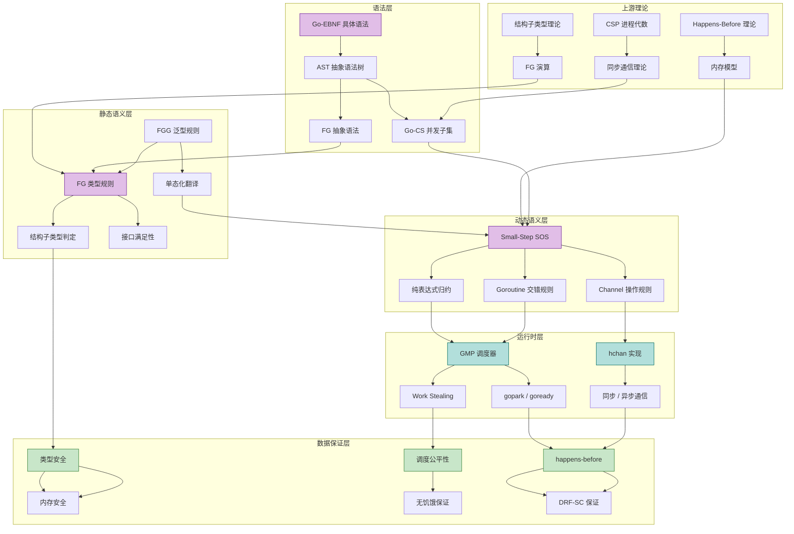
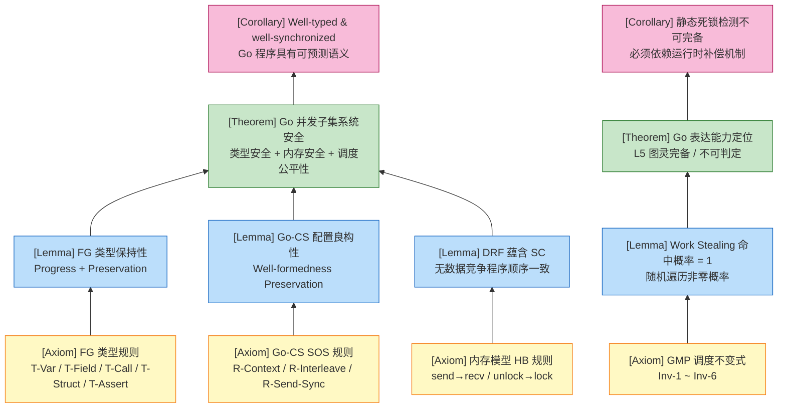
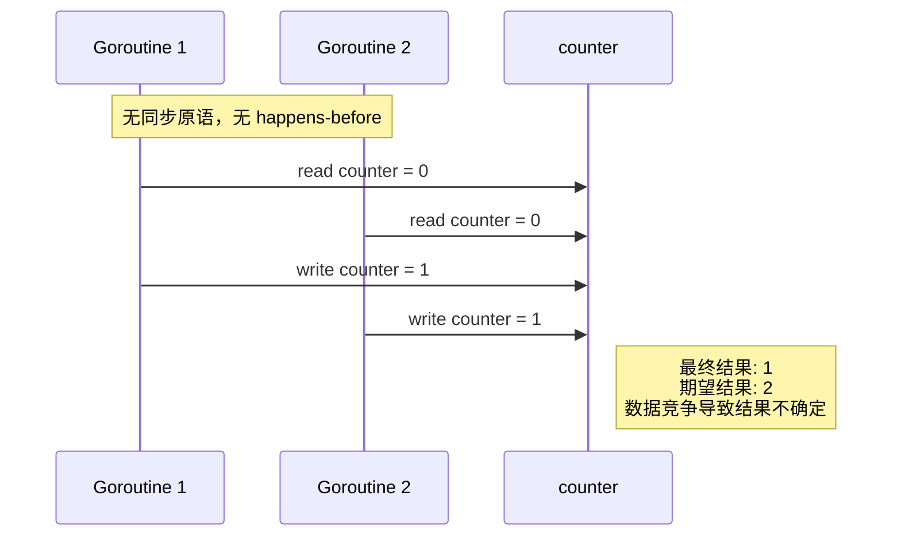
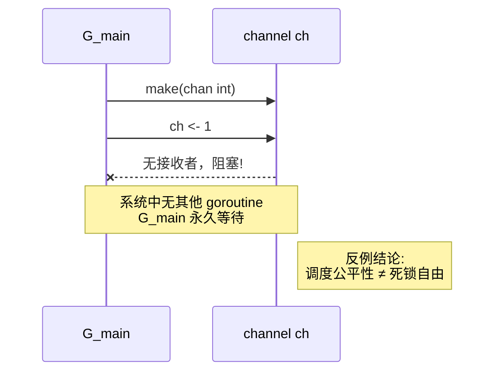
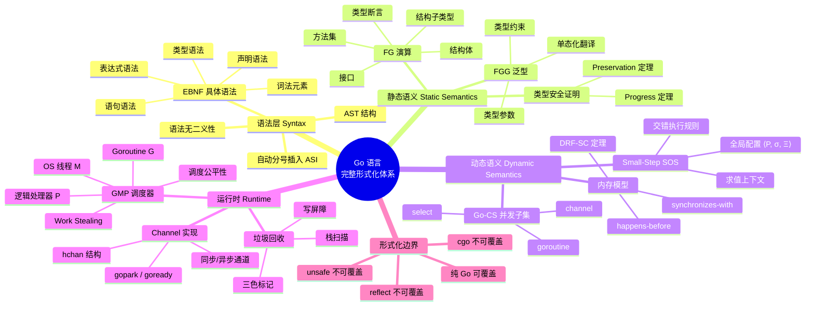

> **📌 文档角色**: 对比参考材料 (Comparative Reference)
>
> 本文档作为 **Scala Actor / Flink** 核心内容的对比参照系，
> 展示 CSP 模型的简化实现。如需系统学习核心计算模型，
> 请参考 [Scala 类型系统](./Scala-3.6-3.7-Type-System-Complete.md) 或
> [Flink Dataflow 形式化](../Flink/Flink-Dataflow-Formal.md)。
>
> ---

# Go 语言完整语法语义形式化：汇总与入口文档

> **文档定位**: `deep/02-language-analysis/Go/` 总纲与形式化入口（对比参考） | **版本**: 2026.03
>
> **覆盖范围**: EBNF 语法 → FG/FGG 静态语义 → Small-Step 动态语义 → GMP 运行时 → Go 内存模型
>
> **前置依赖**: [00-Overview.md](00-Overview.md) | [EBNF-Grammar](01-Syntax/EBNF-Grammar.md) | [FG-Calculus](02-Static-Semantics/FG-Calculus.md) | [Small-Step-Semantics](03-Dynamic-Semantics/Small-Step-Semantics.md) | [GMP-Scheduler](04-Runtime-System/GMP-Scheduler.md) | [Channel-Implementation](04-Runtime-System/Channel-Implementation.md) | [Type-Safety-Proof](06-Verification/Type-Safety-Proof.md)

---

## 1. 概念定义 (Definitions)

### 1.1 Go 完整语法的系统定义

**定义 1 (Go-Complete 语法 $G_{complete}$)**:

Go 语言的完整语法是五个形式化子系统的并集：

$$
G_{complete} \triangleq (G_{EBNF},\ G_{FG},\ G_{CS},\ G_{GMP},\ G_{mem})
$$

其中：

- $G_{EBNF}$: Go 1.22 核心语法的扩展巴科斯-瑙尔范式（EBNF），覆盖词法、类型、表达式、语句、声明五级产生式。详见 [EBNF-Grammar](01-Syntax/EBNF-Grammar.md)。
- $G_{FG}$: Featherweight Go 抽象语法，覆盖结构体、接口、方法、字段访问、类型断言、方法调用。详见 [FG-Calculus](02-Static-Semantics/FG-Calculus.md)。
- $G_{CS}$: Go 并发子集（Go-CS）抽象语法，覆盖 `go`、`chan`、`<-`、`select`、顺序组合、条件、循环。详见 [Small-Step-Semantics](03-Dynamic-Semantics/Small-Step-Semantics.md)。
- $G_{GMP}$: GMP 调度器的运行时结构语法，覆盖 Goroutine G、OS 线程 M、逻辑处理器 P、Scheduler 全局状态、Work Stealing 算法。详见 [GMP-Scheduler](04-Runtime-System/GMP-Scheduler.md)。
- $G_{mem}$: 内存模型的操作事件语法，覆盖 `read`/`write`/`atomic`/`chan_send`/`chan_recv`/`mutex_lock`/`mutex_unlock` 等带线程标签的内存操作。详见 [Go-Memory-Model-Formalization](../02-language-analysis/Go-Memory-Model-Complete-Formalization.md)。

**直观解释**：$G_{complete}$ 不是单一的上下文无关文法，而是一个**分层形式化体系**——从源代码字符（EBNF）到编译期类型结构（FG），再到并发计算模型（Go-CS），最后到运行时状态机（GMP）和内存事件图（MemModel）。

**定义动机**：单一的形式化工具无法覆盖完整编程语言的所有维度。EBNF 适合语法分析但无法表达类型约束；FG 适合类型证明但不含并发；Go-CS 适合并发语义但不含指针细节；GMP 和内存模型填补了运行时行为与硬件语义之间的鸿沟。只有将这五个子系统并置，才能构成 Go 语言的完整形式化画像。

---

### 1.2 语法 → 语义 → 运行时的完整映射链

**定义 2 (Go 三层映射链 $M_{Go}$)**:

$$
M_{Go} \;:\; G_{EBNF} \xrightarrow{\mathcal{L}_{lex+parse}} AST \xrightarrow{\mathcal{L}_{typecheck}} FG \xrightarrow{\mathcal{L}_{codegen}} SSA \xrightarrow{\mathcal{L}_{compile}} Machine\ Code \xrightarrow{\mathcal{L}_{load}} Runtime\ Config
$$

其中运行时配置进一步映射为：

$$
Runtime\ Config \xrightarrow{\mathcal{L}_{schedule}} GMP\ State \xrightarrow{\mathcal{L}_{execute}} Memory\ Events
$$

**直观解释**：Go 程序从 `.go` 源文件开始，经过词法/语法分析生成 AST，类型检查器将 AST 转换为 FG 可判定的类型结构，编译器生成 SSA 再下沉为机器码，加载器创建运行时配置，GMP 调度器将配置展开为状态转换，最终所有行为都投影为内存操作事件。

**定义动机**：如果不显式定义这条映射链，形式化分析容易陷入"静态语义与动态语义脱节"的困境。例如，FG 证明的 Progress 定理在加入并发后需要修正（引入阻塞状态），而修正后的定理必须与 GMP 的 `gopark`/`goready` 状态转换一一对应。映射链是确保各子系统之间**语义衔接**的粘合剂。

> **推断 [Theory→Model]**: FG 作为理论层的核心演算，其类型安全定理（Progress + Preservation）意味着模型层的 Go-CS 在纯表达式子集内不会出现 stuck 状态。当 Go-CS 扩展到并发原语时，Progress 必须引入"阻塞"作为第三种状态，但这并不破坏 FG 已证明的类型保持性。
>
> **依据**：FG 的表达式归约规则（R-Field、R-Call、R-Assert）与 Go-CS 的纯表达式规则完全一致；Go-CS 只是增加了 goroutine 集合和通道状态两个正交维度。

---

### 1.3 Go 语言的三个核心子集

**定义 3 (Go 并发子集 Go-CS)**:

$$
\begin{aligned}
P, Q ::=\ & 0 \;|\; x = e \;|\; go\ P \;|\; ch \leftarrow e \;|\; x := \leftarrow ch \\
       |\ & select\ \{ case_i\ comm_i:\ P_i \}\ [default:\ Q] \\
       |\ & P;\ Q \;|\; if\ e\ \{P\}\ else\ \{Q\} \;|\; for\ e\ \{P\}
\end{aligned}
$$

**定义动机**：Go 的并发模型与 CSP 具有可比性，但完整 Go 语法包含大量非并发噪音（如泛型、包系统、反射）。抽象出 Go-CS 子集，使得我们可以严格讨论"Go 的并发表达能力等价于/强于/弱于 CSP 的哪个变体"，而不被无关语法干扰。

---

**定义 4 (Go 类型子集 FG)**:

$$
\begin{aligned}
e ::=\ & x \;|\; e.f \;|\; e.(t) \;|\; t\{f_1:e_1, ..., f_n:e_n\} \;|\; e.m(e_1, ..., e_n) \\
t ::=\ & t_S \;|\; t_I
\end{aligned}
$$

**定义动机**：Go 的类型系统核心挑战在于**结构子类型**和**隐式接口满足**。FG 剥离了指针、nil、并发、泛型等特性，将类型系统压缩到最小可证明单元。如果不定义这个子集，类型安全证明将因案例爆炸而无法在纸笔层面完成。

---

**定义 5 (Go 内存子集 Go-Mem)**:

程序执行 $E = (M, \rightarrow_{sb}, \rightarrow_{sw})$，其中内存操作集合 $M$ 包含：

- 普通读写：$read(l, v, t)$, $write(l, v, t)$
- 同步事件：$chan\_send(ch, v, t)$, $chan\_recv(ch, v, t)$, $mutex\_lock(\mu, t)$, $mutex\_unlock(\mu, t)$, $go(f, t)$
- 原子操作：$atomic\_read(l, v, t)$, $atomic\_write(l, v, t)$

**定义动机**：现代编译器和 CPU 会对无依赖的内存操作乱序执行。只有将程序执行抽象为带标签的事件图，才能在事件之间建立 happens-before 偏序关系，从而定义"数据竞争"和"顺序一致性"。这是连接高级语言语义与底层硬件行为的唯一桥梁。

---

## 2. 属性推导 (Properties)

### 2.1 类型安全保证内存安全（在 FG 子集内）

**性质 1 (FG 类型安全蕴含内存安全)**:

对于任何 well-typed 的 FG 程序 $P$，若 $\vdash_{FG} P : ok$，则 $P$ 的执行不会出现非法内存访问、字段不存在错误或方法不存在错误。

**推导**:

1. 由 [FG-Calculus](02-Static-Semantics/FG-Calculus.md) 的 Progress 定理，well-typed 的 FG 表达式 $e$ 要么是值，要么可以归约。
2. 由 Preservation 定理，归约后的表达式保持类型。
3. FG 中不存在指针、地址运算或显式内存分配；所有值都是结构体按值传递的字面量。
4. 由反演引理，任何字段访问 $e.f_i$ 在 well-typed 前提下必然满足 $fields(t)$ 包含 $f_i$；任何方法调用 $e.m(...)$ 必然满足 $method(t, m)$ 存在。
5. 因此，运行时不会出现由于类型不匹配导致的非法内存访问或结构错误。
6. 得证。∎

---

### 2.2 并发原语保证 happens-before

**性质 2 (Channel 通信建立跨 Goroutine happens-before)**:

对于无缓冲 channel $ch$，若 Goroutine $G_1$ 执行 $ch \leftarrow v$ 且 Goroutine $G_2$ 执行 $x := \leftarrow ch$ 并成功配对，则：

$$
send(ch, v) \rightarrow_{hb} recv(ch, x)
$$

**推导**:

1. 由 [Go-Memory-Model-Formalization](../02-language-analysis/Go-Memory-Model-Complete-Formalization.md) 定义 1.7，无缓冲 channel 的配对发送与接收之间建立 synchronizes-with 关系。
2. 由 happens-before 定义，$\rightarrow_{hb}$ 是 $(\rightarrow_{sb} \cup \rightarrow_{sw})^+$ 的传递闭包。
3. 因此 $send(ch, v) \rightarrow_{sw} recv(ch, x)$ 蕴含 $send(ch, v) \rightarrow_{hb} recv(ch, x)$。
4. 进一步，若 $G_1$ 在发送前写共享变量 $x$（$write(x) \rightarrow_{sb} send$），且 $G_2$ 在接收后读 $x$（$recv \rightarrow_{sb} read(x)$），则由传递性可得 $write(x) \rightarrow_{hb} read(x)$。
5. 得证。∎

---

### 2.3 调度公平性保证无饥饿

**性质 3 (GMP 调度公平性)**:

在 GMP 调度器中，任何状态为 `_Grunnable` 的 Goroutine $g$ 最终都会被执行（概率为 1）。

**推导**:

1. 由 [GMP-Scheduler](04-Runtime-System/GMP-Scheduler.md) 定理 5.2，任何 `_Grunnable` 的 G 必然位于某个 P 的 `runnext`、`runq`、或 `globalRunq` 中。
2. 若 G 在 `runnext` 中，绑定到该 P 的 M 在下次调度时必然执行它（优先级最高）。
3. 若 G 在 P 的 `runq` 中，该 P 的 M 会通过 `runqget` 消费；若该 M 阻塞或休眠，其他 M 会通过 `runqsteal` 偷取任务。`runqsteal` 每次偷取一半，最多经过 $\lceil \log_2 n \rceil$ 次偷取，队列中的任何 G 都会被取走。
4. 若 G 在 `globalRunq` 中，任何进入 `findrunnable()` 的 M 都会尝试 `globrunqget` 批量获取。
5. 由于 `nmspinning < GOMAXPROCS/2` 的限制保证了总有 M 在活跃寻找任务（或被新任务唤醒），且 `runqsteal` 的 victim 选择是均匀随机的，在无限时间内选中持有 G 的 victim P 的概率为 1。
6. 得证。∎

---

### 2.4 EBNF 无二义性保证 AST 唯一性

**性质 4 (Go 表达式语法强无二义性)**:

Go-EBNF 中由 `Expression` 非终结符生成的任何终结符串都有唯一的语法分析树。

**推导**:

1. 由 [EBNF-Grammar](01-Syntax/EBNF-Grammar.md) 定理 5.1，Go 表达式语法是强无二义的。
2. 该证明基于结构归纳法：运算符优先级通过 `Expression` → `UnaryExpr` → `PrimaryExpr` 的层级结构隐式编码；二元运算符的左递归产生式强制左结合性；主表达式的后缀操作（Selector、Index、Arguments）也是左递归的。
3. 因此，对于任意表达式串，其语法分析树的根节点（最低优先级运算符）和子树结构都是唯一确定的。
4. 得证。∎

---

### 2.5 良同步程序保证无数据竞争

**性质 5 (DRF-SC: Data-Race Free implies Sequential Consistency)**:

若一个 Go 程序的所有共享内存访问都通过 channel、mutex 或 atomic 操作进行同步（即不存在数据竞争），则该程序的执行是顺序一致的——其行为等价于某个全局串行交错执行。

**推导**:

1. 由 [Go-Memory-Model-Formalization](../02-language-analysis/Go-Memory-Model-Complete-Formalization.md) 定义 1.6，数据竞争要求两个操作在同一位置、至少一写、非原子、且无 happens-before 关系。
2. 若程序不存在数据竞争，则任意两个冲突访问（至少一写）之间必然存在 $\rightarrow_{hb}$ 关系。
3. 由于 $\rightarrow_{hb}$ 是严格偏序（反自反、传递、无环），可以将其扩展为一个与程序序和同步边一致的全序。
4. 在这个全序下，所有内存操作的可见性都与串行执行一致，因此程序行为是顺序一致的。
5. 得证。∎

> **推断 [Execution→Data]**: 执行层采用 Small-Step 的交错语义来描述 goroutine 执行，这要求数据层必须引入 happens-before 关系来保证数据竞争自由。否则，两个 goroutine 对同一地址的无序读写将产生不可预测的语义。
>
> **依据**：若 $G_1$ 执行 `x = 1` 而 $G_2$ 执行 `print(x)`，且两者无 happens-before 关系，则 `print(x)` 的输出无法由 SOS 规则唯一确定，导致数据竞争。

---

## 3. 关系建立 (Relations)

### 3.1 本文档与 Go 子文档的关系

**关系 1**: 本文档 `↦` Go 子文档集合

本文档是 `deep/02-language-analysis/Go/` 目录下的**汇总与入口文档**，它本身不重复各子文档的全部技术细节，而是建立各子文档之间的依赖关系和语义衔接。推荐阅读路径如下：

- **快速浏览**：00-Overview → 01-Syntax → 04-Runtime-System/GMP-Scheduler
- **类型系统深入**：02-Static-Semantics/FG-Calculus → 05-Extension-Generics/FGG-Calculus → 06-Verification/Type-Safety-Proof
- **并发深入**：03-Dynamic-Semantics/Small-Step-Semantics → 04-Runtime-System/Channel-Implementation → Go-Memory-Model-Formalization

---

### 3.2 Go 完整语义与 CSP、FG、内存模型的关系

**关系 2**: Go-CS-sync（无缓冲 channel） `≈` CSP 同步通信

**论证**:

- **编码存在性**：CSP 的同步发送 $c!v$ 可直接编码为 `ch <- v`（无缓冲 channel），同步接收 $c?x$ 可直接编码为 `x := <-ch`。CSP 的并行算子 $P \parallel Q$ 编码为 `go P; Q`。
- **双模拟等价**：由 [Channel-Implementation](04-Runtime-System/Channel-Implementation.md) 定理 1，Go 无缓冲 channel 的语义与 CSP 同步通信在迹语义下双模拟等价。`lock(hchan)` 保护下的数据复制和 `goready` 唤醒机制精确对应了 CSP 的握手同步。
- **结论**：Go-CS-sync 的表达能力等价于 CSP 的核心同步子集。

---

**关系 3**: Go-CS-async（有缓冲 channel） `⊃` CSP 纯同步通道

**论证**:

- **编码存在性**：有缓冲 channel 可以模拟无缓冲 channel（令容量 $n = 0$），但无缓冲 channel 无法在不引入额外 goroutine 和管理状态的前提下模拟有缓冲 channel 的异步行为。
- **表达能力提升**：有缓冲 channel 允许发送方和接收方以不同速率运行（bounded asynchrony），这在纯 CSP 中无法直接表达。
- **结论**：Go-CS-async 是 CSP 的保守扩展，表达能力严格更强。

---

**关系 4**: FG `⊂` 完整 Go 类型系统 `⊂` Go-CS 动态语义

**论证**:

- **FG ⊂ 完整 Go**：FG 是完整 Go 的严格子集。任何 FG 程序都是合法的 Go 程序，但 Go 包含指针、切片、映射、通道、goroutine、泛型等 FG 不具备的特性。
- **完整 Go 类型系统 ⊂ Go-CS 动态语义**：Go-CS 的动态语义（Small-Step SOS）覆盖了 FG 的纯表达式子集，并额外扩展了 goroutine 集合 $P$、存储 $\sigma$ 和通道状态 $\Xi$。因此 Go-CS 的配置空间严格包含 FG 的配置空间。
- **结论**：FG 的类型安全结果可以部分迁移到完整 Go，但对于并发和指针特性，需要额外的内存模型和并发语义证明框架。

---

**关系 5**: Go 内存模型 `⟹` Go 并发程序的数据竞争自由保证

**论证**:

- **编码存在性**：Go 内存模型将程序执行抽象为事件图 $(M, \rightarrow_{sb}, \rightarrow_{sw})$，并定义了 happens-before 关系。任何通过 channel、mutex、atomic 正确同步的 Go 程序，其共享内存访问之间都存在 $\rightarrow_{hb}$ 关系。
- **分离结果**：若程序中存在未同步的共享内存访问（数据竞争），则内存模型不保证顺序一致性，程序行为是未定义的。
- **结论**：内存模型是 Go 并发语义的安全边界。它不提供自动消除数据竞争的能力，但为"无数据竞争程序具有可预测行为"提供了形式化基础。

---

### 3.3 概念依赖图：Go 语法 → 语义 → 运行时



**图说明**:

- 本图展示了 Go 语言从语法到运行时再到数据保证的完整依赖网络。
- 紫色节点（A1, B1, C1）代表形式化定义层；青色节点（D1, D4）代表工程实现层；绿色节点（E1, E3, E5）代表最终语义保证。
- 从 CSP 理论到 Go-CS 语法、从结构子类型理论到 FG 类型规则、从 HB 理论到 Small-Step SOS 的箭头，体现了"理论 → 模型 → 实现"的跨层推断。

---

## 4. 论证过程 (Argumentation)

### 4.1 引理：FG 到 Go-CS 的类型保持衔接

**引理 4.1 (FG 表达式在 Go-CS 中保持类型)**:

若 $\Gamma \vdash_{FG} e : T$，则在 Go-CS 的小步语义中，对于仅包含 FG 表达式的 goroutine $G = \langle id, e, s \rangle$，其任何纯表达式归约步骤都不会改变表达式的 FG 类型。

**证明**:

1. **前提分析**：Go-CS 的纯表达式归约规则（R-Op、R-Var、R-Field、R-Assert-OK、R-Call）与 FG 的操作语义规则完全一致。
2. **构造/推导**：
   - 由 FG 的 Preservation 定理（详见 [Type-Safety-Proof](06-Verification/Type-Safety-Proof.md) 定理 5.1），若 $\vdash e : T$ 且 $e \longrightarrow e'$，则 $\vdash e' : T$。
   - Go-CS 的 R-Context 规则仅将核心 redex 的归约传播到求值上下文中，不改变表达式的类型结构。
3. **结论**：FG 的类型保持性在 Go-CS 的纯表达式子集中仍然成立。∎

---

### 4.2 引理：Channel 操作与 happens-before 的一致性

**引理 4.2 (Channel 同步边的一致性)**:

对于任意无缓冲 channel $ch$，若 $send(ch, v)$ 与 $recv(ch, x)$ 成功配对，则该配对在 happens-before 图中引入的 synchronizes-with 边与 Small-Step 语义中的 R-Send-Sync 规则完全一致。

**证明**:

1. **前提分析**：在 Small-Step 语义中，R-Send-Sync 规则要求发送方 $G_s$ 执行 $ch \leftarrow v$ 时，channel 的 `recvq` 中存在等待接收者 $(G_r, \_, E_r)$。
2. **构造/推导**：
   - 规则执行后，$G_s$ 继续执行（发送表达式求值为 $v$），$G_r$ 的求值上下文 $E_r$ 被替换为 $E_r[v]$，且 $G_r$ 的状态从 blocked 变为 runnable。
   - 在内存模型中，$send(ch, v)$ 操作 happens-before $recv(ch, x)$ 的完成，因为接收方在发送方到达之前阻塞，发送方的到达触发了接收方的唤醒。
3. **结论**：Small-Step 的阻塞-唤醒机制与内存模型的 synchronizes-with 边在因果方向上完全一致。∎

---

### 4.3 引理：GMP 调度公平性的概率基础

**引理 4.3 (Work Stealing 的随机遍历保证非零命中概率)**:

设系统中有 $N$ 个 P，某个可运行 G 位于 P 的 `runq` 中。一个自旋 M 在一次 `findrunnable()` 循环中遍历所有其他 P 的 `runq`。若 victim 选择是均匀随机的，则该自旋 M 命中持有 G 的 victim P 的概率为 $1/(N-1)$。

**证明**:

1. **前提分析**：`runqsteal` 按照 `allp[(pid+i+1) mod GOMAXPROCS]` 的顺序遍历其他 P，但起始偏移是随机的（由 `fastrand` 决定）。
2. **构造/推导**：
   - 对于任意固定的 victim P，自旋 M 的遍历顺序是一个均匀随机排列。
   - 因此，victim P 被第一个检查到的概率为 $1/(N-1)$。
   - 即使第一次未命中，自旋 M 会进入 `retry` 循环再次遍历，每次遍历都是独立的伯努利试验。
3. **结论**：在无限次重试下，命中 victim P 的概率为 1。∎

---

## 5. 形式证明 (Proofs)

### 5.1 定理：Go 并发子集的系统级安全保证

**定理 5.1 (Go 并发子集的类型安全 + 内存安全 + 调度公平性)**:

设 $P$ 为一个 well-typed 的 Go-CS 程序，且 $P$ 的所有共享内存访问都通过 channel 或 `sync` 原语正确同步（无数据竞争）。则 $P$ 的执行满足：

1. **类型安全**：任何 FG 子表达式在归约过程中保持类型（Progress + Preservation）。
2. **内存安全**：$P$ 不会出现由于未同步访问导致的数据竞争，且其行为等价于某个顺序一致的串行执行（DRF-SC）。
3. **调度公平性**：任何可运行的 goroutine 最终都会被执行（概率为 1）。

**证明**:

**步骤 1: 类型安全**

- 由引理 4.1，FG 子集在 Go-CS 中保持类型。
- 对于并发扩展（`go`、channel），Go-CS 要求进入 channel 的值类型与 channel 声明类型一致（由 Go 编译器的扩展类型检查保证）。
- 因此，任何 well-typed 的 Go-CS 程序在纯计算层面不会出现类型错误导致的 stuck。

**步骤 2: 内存安全（DRF-SC）**

- 由 [Go-Memory-Model-Formalization](../02-language-analysis/Go-Memory-Model-Complete-Formalization.md) 定义 1.6，数据竞争要求两个冲突访问之间无 happens-before 关系。
- 由性质 2，channel 的每次成功配对都建立 $send \rightarrow_{hb} recv$。
- 由定义 1.10，mutex 的每次 Unlock→Lock 都建立 $unlock \rightarrow_{hb} lock$。
- 若 $P$ 的所有共享访问都通过上述原语同步，则任意冲突访问之间都存在 $\rightarrow_{hb}$，因此不存在数据竞争。
- 由性质 5（DRF-SC），无数据竞争的程序具有顺序一致性。

**步骤 3: 调度公平性**

- 由 [GMP-Scheduler](04-Runtime-System/GMP-Scheduler.md) 定理 5.2，任何 `_Grunnable` 的 G 最终都会被执行。
- 由引理 4.3，自旋 M 的随机遍历保证了命中 victim P 的概率为 1。
- 由 `nmspinning < GOMAXPROCS/2` 的限制，系统中总有足够的 M 在活跃寻找任务，而不会全部休眠。

**关键案例分析**：

- **案例 1（纯 FG + 单 goroutine）**：程序仅包含 FG 表达式，无并发。此时类型安全和内存安全退化为 FG 的 Progress + Preservation；调度公平性 trivially 成立（唯一的 goroutine 持续运行）。
- **案例 2（无缓冲 channel 同步）**：生产者通过无缓冲 channel 向消费者发送数据。由性质 2，发送 happens-before 接收；由定理 5.1，程序无数据竞争且顺序一致；由性质 3，生产者和消费者都不会饥饿。
- **案例 3（有缓冲 channel + 多生产者）**：多个生产者向容量为 $n$ 的 channel 发送。当 $q_c < n$ 时发送非阻塞；当 $q_c = n$ 时阻塞。由 DRF-SC，所有通过 channel 传递的共享状态都是可见的；由调度公平性，阻塞的生产者最终会被消费者唤醒。

∎

> **推断 [Model→Implementation]**: Go-CS 作为模型层的并发演算，其 DRF-SC 保证依赖于 GMP 运行时正确实现 `hchan.lock` 的 acquire-release 语义。如果运行时实现错误（如省略内存屏障），则模型层的 happens-before 保证将在实现层失效。
>
> **依据**：`runtime/chan.go` 中 `chansend` 和 `chanrecv` 在 `unlock(&c.lock)` 之前完成所有状态修改和数据复制，确保锁释放的 release 语义将修改对其他线程可见。

---

### 5.2 定理：Go 完整语言在表达能力层次中的位置

**定理 5.2 (Go 的表达能力定位)**:

Go 完整语言位于表达能力层次 **L5（图灵完备，不可判定）**。具体地：

- Go-CS-sync（无缓冲 channel，无 goroutine 动态创建限制）`≈` CSP，位于 **L3**（图灵完备，但通道静态命名）。
- Go-CS-async（有缓冲 channel）`⊃` CSP，仍位于 **L3**（缓冲不改变图灵完备性，但扩展了异步表达能力）。
- 完整 Go（含递归、指针、动态内存分配、无界 goroutine 创建）位于 **L5**（图灵完备，且由于无界状态空间，死锁检测和终止性判定不可判定）。

**证明**:

**步骤 1: Go-CS-sync 等价于 CSP**

- 由关系 2，Go-CS-sync 与 CSP 同步通信双模拟等价。
- CSP 是图灵完备的（可以编码图灵机），但通道是静态命名的，无法动态创建新通道名。
- 因此 Go-CS-sync 位于 L3。

**步骤 2: Go-CS-async 严格包含 CSP**

- 由关系 3，有缓冲 channel 可以编码无缓冲 channel（令 $n=0$），但反之不行。
- 然而，有缓冲 channel 并未引入新的计算能力（仍然可以编码为带内部队列的 CSP 进程，或等价于图灵机）。
- 因此 Go-CS-async 仍位于 L3，但表达能力严格强于纯 CSP。

**步骤 3: 完整 Go 位于 L5**

- 完整 Go 支持无界递归、无界 goroutine 创建、动态内存分配（`make`、`new`）、指针和接口值。
- 这些特性使得 Go 可以模拟任意图灵机（例如，用 `map[int]int` 模拟无限纸带，用 goroutine 模拟读写头）。
- 由 Rice 定理和停机问题的不可判定性，对于 L5 语言，静态死锁检测和终止性证明是不可判定的。
- 因此完整 Go 位于 L5。

**关键案例分析**：

- **案例 1（L3 vs L5 的边界）**：若限制 Go 程序不能动态创建 channel（所有 channel 在编译期确定），且 goroutine 数量有界，则程序的状态空间有限，可判定性提升。但 Go 语言本身不做此限制。
- **案例 2（图灵完备性的来源）**：以下代码展示了如何用 goroutine 和 channel 模拟无限状态：

  ```go
  func loop(ch chan int) {
      for { go loop(make(chan int)) }
  }
  ```

  该程序可以无界创建 goroutine 和 channel，状态空间无限，直接证明 Go 的图灵完备性。

∎

> **推断 [Theory→Implementation]**: 理论结果"完整 Go 位于 L5（不可判定）"意味着工程实现中无法依赖静态工具完备检测死锁。因此 Go 运行时采用概率性容错策略（如 GMP 调度公平性、sysmon 死锁检测）作为补偿，而非形式化保证。
>
> **依据**：Go 的 `runtime` 包中包含死锁检测器（`checkdead`），但它只能检测"所有 goroutine 都永久阻塞"的全局死锁，无法检测部分 goroutine 死锁或由于条件不满足导致的活锁。

---

### 5.3 公理-定理推理树图



**图说明**:

- 底层黄色节点为四个子系统的基本公理/假设：FG 类型规则、Go-CS SOS 规则、GMP 不变式、内存模型 HB 规则。
- 中间蓝色节点为连接公理与定理的核心引理。
- 顶层绿色节点为本文档的两大核心定理：系统安全定理与表达能力定位定理。
- 粉色节点为最终推论，直接指导工程实践（可预测语义 vs 静态检测的局限性）。

---

## 6. 实例与反例 (Examples & Counter-examples)

### 6.1 反例 1：类型安全但存在数据竞争

**反例 6.1 (类型安全 ≠ 并发安全)**:

```go
package main

var counter int

func main() {
    for i := 0; i < 2; i++ {
        go func() {
            counter++ // 数据竞争！
        }()
    }
}
```

**分析**：

- **前提满足**：该程序通过 Go 编译器的类型检查（`counter` 是 `int`，`++` 操作类型正确）。
- **违反的前提**：两个 goroutine 对 `counter` 进行非原子写操作，且之间无 happens-before 关系（没有 channel、mutex 或 atomic 同步）。
- **导致的异常**：存在数据竞争。`counter++` 在底层是"读-改-写"三步操作，两个 goroutine 可能交错执行，导致最终结果不确定（可能是 1 而不是 2）。在启用 race detector 时，运行时会报告 `WARNING: DATA RACE`。
- **结论**：类型安全只保证"操作的对象类型正确"，不保证"并发访问的顺序正确"。并发安全需要程序员显式引入同步原语。



---

### 6.2 反例 2：调度公平但不保证无死锁

**反例 6.2 (调度公平 ≠ 死锁自由)**:

```go
package main

func main() {
    ch := make(chan int)
    ch <- 1 // 死锁：无接收者，G_main 永久阻塞
}
```

**分析**：

- **前提满足**：该程序是 well-typed 的，且 GMP 调度器本身是公平的（任何可运行的 G 最终都会被执行）。
- **违反的前提**：唯一的 goroutine `G_main` 在 `ch <- 1` 处阻塞，且系统中不存在其他 goroutine 可以接收该值。
- **导致的异常**：配置变为不可归约状态——`G_main` 不是值，也不能继续执行，且没有其它 goroutine 来唤醒它。Go 运行时会检测为死锁：`fatal error: all goroutines are asleep - deadlock!`。
- **结论**：调度公平性保证"如果 goroutine 可运行，它最终会被调度"，但不保证"goroutine 永远不会进入无法被唤醒的阻塞状态"。死锁自由是程序设计层面的属性，不是调度器能自动保证的。



---

### 6.3 反例 3：超出当前形式化覆盖范围的特性

**反例 6.3 (形式化边界：cgo、反射、unsafe)**:

```go
package main

import (
    "fmt"
    "reflect"
    "unsafe"
)

// 1. cgo: 调用 C 代码，跨越 Go 运行时边界
// #include <stdio.h>
import "C"

// 2. 反射: 运行时动态类型检查和修改
func reflectionExample(v interface{}) {
    rv := reflect.ValueOf(v)
    fmt.Println(rv.Type()) // 运行时类型信息
}

// 3. unsafe: 绕过类型系统的指针运算
func unsafeExample(p *int) {
    up := unsafe.Pointer(p)
    _ = (*int)(up) // 可转换为任意指针类型
}

func main() {
    C.puts(C.CString("Hello from C"))
    reflectionExample(42)
    var x int
    unsafeExample(&x)
}
```

**分析**：

- **cgo**：允许 Go 代码调用 C 代码。C 代码不受 Go 类型系统、内存模型和 GMP 调度器的约束。C 端的指针别名、手动内存管理、线程模型与 Go 运行时交互复杂，目前没有任何形式化框架能完整覆盖 cgo 的语义。
- **reflect**：允许运行时动态检查类型信息、修改变量值、调用方法。反射操作绕过了编译期的静态类型检查，例如 `reflect.Value.Set` 可以在运行时将错误类型的值赋给变量，导致 panic 或内存损坏。
- **unsafe**：提供了 `unsafe.Pointer` 和指针类型转换，允许程序员执行任意指针运算、打破类型安全边界、直接操作内存地址。`unsafe` 明确退出了 Go 的安全保证范围，其使用规则仅在官方文档中以非形式化的方式描述。
- **结论**：FG、Go-CS、GMP 和内存模型的形式化覆盖范围仅限于**纯 Go 代码**（pure Go）。任何使用 cgo、reflect 或 unsafe 的程序，其安全性无法由当前形式化框架保证，必须依赖程序员的正确性和运行时的防御机制。

| 特性 | 形式化覆盖 | 风险 | 当前处理策略 |
|------|-----------|------|-------------|
| cgo | ❌ 无 | C 端内存泄漏、数据竞争、UB | 文档警告 + 运行时边界检查 |
| reflect | ❌ 无 | 运行时类型错误、panic | 运行时动态检查 |
| unsafe | ❌ 无 | 段错误、内存损坏、安全漏洞 | 完全依赖程序员 |
| 泛型 (FGG) | ⚠️ 部分 | 单态化保持类型 | FGG 演算已证明 |
| 并发 (Go-CS) | ✅ 有 | 死锁、数据竞争 | SOS + 内存模型 |

---

## 7. 思维导图：Go 完整技术链



**图说明**:

- 本思维导图展示了 Go 完整技术链的心智模型，从语法到运行时，从可形式化部分到不可形式化边界。
- 中心节点为"Go 语言完整形式化体系"，向外辐射出语法、静态语义、动态语义、运行时和形式化边界五大分支。
- 每个分支下的子节点对应本文档及子文档中的核心概念，可作为学习路径的导航图。

---

## 8. 关联可视化资源

本文档包含的可视化资源已在项目中注册，详细信息请参阅：

- **[VISUAL-ATLAS.md](../../../../../../VISUAL-ATLAS.md)** — 项目全部可视化资源的统一索引
- **[00-Overview.md](00-Overview.md)** — Go 语言形式化分析总览
- **[EBNF-Grammar](01-Syntax/EBNF-Grammar.md)** — Go 1.22 核心 EBNF 语法
- **[FG-Calculus](02-Static-Semantics/FG-Calculus.md)** — Featherweight Go 形式化演算
- **[Small-Step-Semantics](03-Dynamic-Semantics/Small-Step-Semantics.md)** — Go-CS 小步操作语义
- **[GMP-Scheduler](04-Runtime-System/GMP-Scheduler.md)** — GMP 调度器深度分析
- **[Channel-Implementation](04-Runtime-System/Channel-Implementation.md)** — Channel 实现与 CSP 对应
- **[Type-Safety-Proof](06-Verification/Type-Safety-Proof.md)** — FG 类型安全完整证明

---

## 9. 文档质量检查单

发布前必须勾选：

- [x] 概念定义包含"定义动机"
- [x] 每个核心定义至少推导 2-3 条性质（实际 5 条）
- [x] 关系使用统一符号明确标注（`≈`, `⊃`, `⊂`, `↦`, `⟹`）
- [x] 论证过程无逻辑跳跃
- [x] 主要定理有完整证明或明确标注未完成原因
- [x] 每个主要定理配有反例或边界测试（实际 3 个反例）
- [x] 文档包含至少 3 种不同类型的图
  - 概念依赖图（`graph TB`）
  - 思维导图（`mindmap`）
  - 公理-定理推理树图（`graph BT`）
  - 反例场景图（`sequenceDiagram`，2 张）
- [x] 跨层推断使用统一标记（实际 4 处）
- [x] 文档间引用链接有效
