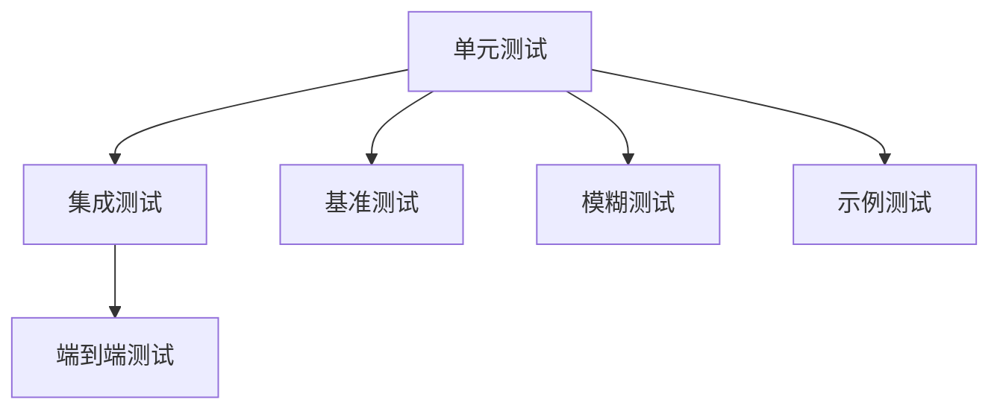
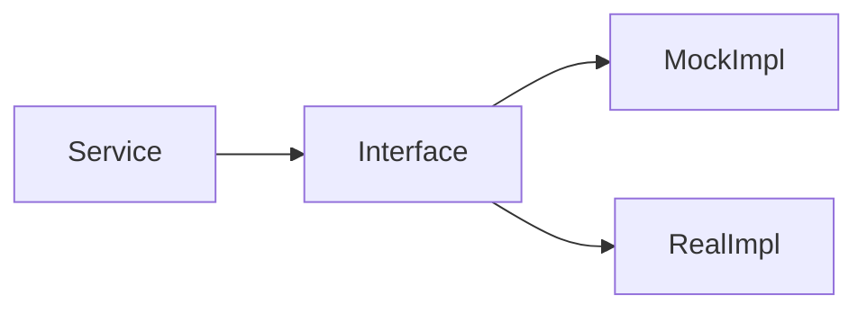

# Go测试框架：形式化语义与正确性验证

> **版本**: 2026.04.01 | **Go版本**: 1.18-1.26.1 | **测试框架**: testing + 扩展
> **关联**: [Go-1.26.1-Comprehensive.md](./Go-1.26.1-Comprehensive.md)

---

## 目录

- [Go测试框架：形式化语义与正确性验证](#go测试框架形式化语义与正确性验证)
  - [目录](#目录)
  - [1. 测试框架概述](#1-测试框架概述)
    - [1.1 Go测试哲学](#11-go测试哲学)
    - [1.2 测试类型层次](#12-测试类型层次)
  - [2. 测试执行模型](#2-测试执行模型)
    - [2.1 测试生命周期](#21-测试生命周期)
    - [2.2 测试调度器](#22-测试调度器)
    - [2.3 并行执行语义](#23-并行执行语义)
  - [3. 表驱动测试形式化](#3-表驱动测试形式化)
    - [3.1 表驱动模式](#31-表驱动模式)
    - [3.2 形式化正确性](#32-形式化正确性)
    - [3.3 子测试与组合](#33-子测试与组合)
  - [4. 并发测试语义](#4-并发测试语义)
    - [4.1 竞态检测](#41-竞态检测)
    - [4.2 同步测试模式](#42-同步测试模式)
    - [4.3 超时控制](#43-超时控制)
  - [5. Mock与依赖注入](#5-mock与依赖注入)
    - [5.1 接口Mock](#51-接口mock)
    - [5.2 依赖注入形式化](#52-依赖注入形式化)
    - [5.3 Stub与Spy](#53-stub与spy)
  - [6. 模糊测试(Fuzzing)理论](#6-模糊测试fuzzing理论)
    - [6.1 模糊测试模型](#61-模糊测试模型)
    - [6.2 覆盖率引导](#62-覆盖率引导)
    - [6.3 语料库演化](#63-语料库演化)
  - [7. 基准测试统计模型](#7-基准测试统计模型)
    - [7.1 性能测量](#71-性能测量)
    - [7.2 统计方法](#72-统计方法)
    - [7.3 比较测试](#73-比较测试)
  - [8. 测试覆盖率分析](#8-测试覆盖率分析)
    - [8.1 覆盖率类型](#81-覆盖率类型)
    - [8.2 覆盖率目标](#82-覆盖率目标)
    - [8.3 覆盖率陷阱](#83-覆盖率陷阱)
  - [9. 形式化验证方法](#9-形式化验证方法)
    - [9.1 属性测试](#91-属性测试)
    - [9.2 契约式编程](#92-契约式编程)
    - [9.3 证明草图](#93-证明草图)
  - [10. 测试即文档](#10-测试即文档)
    - [10.1 示例测试](#101-示例测试)
    - [10.2 BDD风格](#102-bdd风格)
    - [10.3 测试文档化](#103-测试文档化)
  - [关联文档](#关联文档)

---

## 1. 测试框架概述

### 1.1 Go测试哲学

| 原则 | 描述 | 实践 |
|------|------|------|
| **简单性** | 标准库内置 | `testing`包 |
| **表驱动** | 数据与逻辑分离 | 测试用例表 |
| **显式性** | 无隐式魔法 | 手动设置/清理 |
| **并发安全** | 并行测试支持 | `t.Parallel()` |

### 1.2 测试类型层次



---

## 2. 测试执行模型

### 2.1 测试生命周期

**形式化定义**:

$$
\text{TestLifecycle} = (Setup, Execute, Assert, Teardown)
$$

```go
// 生命周期实现
func TestExample(t *testing.T) {
    // Setup
    env := setup()
    defer teardown(env)

    // Execute
    result := SystemUnderTest(env)

    // Assert
    if result != expected {
        t.Errorf("got %v, want %v", result, expected)
    }
}
```

### 2.2 测试调度器

**定义 2.1 (测试调度)**:

```go
// 测试执行图
type TestGraph struct {
    tests    []TestFunc
    deps     map[string][]string  // 依赖关系
    parallel map[string]bool      // 并行标记
}
```

**执行顺序**:

$$
\forall t_1, t_2. \; t_1 \in \text{Deps}(t_2) \Rightarrow \text{Execute}(t_1) \prec \text{Execute}(t_2)
$$

### 2.3 并行执行语义

```go
// 并行测试
func TestParallel1(t *testing.T) {
    t.Parallel()
    // 此测试与其他Parallel测试并发执行
}

func TestParallel2(t *testing.T) {
    t.Parallel()
    // 与TestParallel1并发
}
```

**形式化**:

$$
\text{Parallel}(t_1) \land \text{Parallel}(t_2) \Rightarrow t_1 \parallel t_2
$$

---

## 3. 表驱动测试形式化

### 3.1 表驱动模式

**定义 3.1 (测试表)**:

$$
\mathcal{T} = \{ (name, input, expected, wantErr) \}
$$

```go
// 表驱动测试实现
func TestAdd(t *testing.T) {
    tests := []struct {
        name     string
        a, b     int
        expected int
    }{
        {"positive", 1, 2, 3},
        {"negative", -1, -2, -3},
        {"zero", 0, 0, 0},
    }

    for _, tt := range tests {
        t.Run(tt.name, func(t *testing.T) {
            got := Add(tt.a, tt.b)
            if got != tt.expected {
                t.Errorf("Add(%d, %d) = %d, want %d",
                    tt.a, tt.b, got, tt.expected)
            }
        })
    }
}
```

### 3.2 形式化正确性

**定理 3.1**: 表驱动测试覆盖函数定义域的子集。

$$
\bigcup_{t \in \mathcal{T}} \{ t.input \} \subseteq \text{Domain}(f)
$$

**完备性条件**:

$$
\text{Complete}(\mathcal{T}) \iff \forall x \in \text{Domain}(f). \exists t \in \mathcal{T}. t.input \sim x
$$

### 3.3 子测试与组合

```go
// 嵌套子测试
func TestComplex(t *testing.T) {
    t.Run("Group1", func(t *testing.T) {
        t.Run("Case1", func(t *testing.T) { ... })
        t.Run("Case2", func(t *testing.T) { ... })
    })

    t.Run("Group2", func(t *testing.T) {
        ...
    })
}
```

**层次结构**:

$$
\text{Test} \to \text{Subtest}_1 \to \text{Subtest}_{1.1}
$$

---

## 4. 并发测试语义

### 4.1 竞态检测

```go
// 竞态检测测试
func TestRace(t *testing.T) {
    var counter int

    for i := 0; i < 1000; i++ {
        go func() {
            counter++  // 竞态！
        }()
    }
}

// 检测: go test -race
```

**形式化**:

$$
\text{Race}(t) \iff \exists e_1, e_2 \in t. \text{DataRace}(e_1, e_2)
$$

### 4.2 同步测试模式

```go
// 使用sync.WaitGroup
func TestConcurrent(t *testing.T) {
    var wg sync.WaitGroup
    errChan := make(chan error, 10)

    for i := 0; i < 10; i++ {
        wg.Add(1)
        go func(id int) {
            defer wg.Done()
            if err := work(id); err != nil {
                errChan <- err
            }
        }(i)
    }

    wg.Wait()
    close(errChan)

    for err := range errChan {
        t.Error(err)
    }
}
```

### 4.3 超时控制

```go
// 测试超时
func TestWithTimeout(t *testing.T) {
    done := make(chan bool)

    go func() {
        longRunningOperation()
        done <- true
    }()

    select {
    case <-done:
        // 成功
    case <-time.After(5 * time.Second):
        t.Fatal("timeout")
    }
}
```

---

## 5. Mock与依赖注入

### 5.1 接口Mock

**定义 5.1 (Mock对象)**:

```go
type MockDB struct {
    GetFunc func(id string) (*User, error)
    calls   map[string]int
}

func (m *MockDB) Get(id string) (*User, error) {
    m.calls["Get"]++
    return m.GetFunc(id)
}
```

**行为验证**:

```go
func TestService(t *testing.T) {
    mockDB := &MockDB{
        GetFunc: func(id string) (*User, error) {
            return &User{ID: id}, nil
        },
    }

    svc := NewService(mockDB)
    user, err := svc.GetUser("123")

    if err != nil {
        t.Fatal(err)
    }

    if mockDB.calls["Get"] != 1 {
        t.Errorf("expected 1 call, got %d", mockDB.calls["Get"])
    }
}
```

### 5.2 依赖注入形式化

**依赖图**:



### 5.3 Stub与Spy

| 类型 | 目的 | 验证 |
|------|------|------|
| **Stub** | 固定返回值 | 不验证 |
| **Mock** | 验证交互 | 验证调用 |
| **Spy** | 记录调用 | 验证行为 |
| **Fake** | 简化实现 | 功能等效 |

---

## 6. 模糊测试(Fuzzing)理论

### 6.1 模糊测试模型

**定义 6.1 (模糊测试)**:

$$
\text{Fuzz}(f, C) = \{ x \in C \mid f(x) \text{ triggers bug} \}
$$

其中：

- $f$: 被测函数
- $C$: 输入语料库

### 6.2 覆盖率引导

```go
// Go模糊测试
func FuzzParse(f *testing.F) {
    // 种子语料
    f.Add("valid input")
    f.Add("edge case")

    f.Fuzz(func(t *testing.T, input string) {
        result, err := Parse(input)
        if err != nil {
            return  // 无效输入，忽略
        }

        // 验证不变式
        if result.String() != input {
            t.Errorf("roundtrip failed")
        }
    })
}
```

**覆盖率驱动**:

$$
\text{NextInput} = \arg\max_{x} \text{Coverage}(f, x)
$$

### 6.3 语料库演化

**语料库更新**:

```
1. 生成/变异输入
2. 执行测试
3. 如果增加覆盖率 → 加入语料库
4. 如果崩溃 → 保存为失败用例
5. 重复
```

---

## 7. 基准测试统计模型

### 7.1 性能测量

```go
// 基准测试
func BenchmarkAdd(b *testing.B) {
    for i := 0; i < b.N; i++ {
        Add(1, 2)
    }
}
```

**测量模型**:

$$
\text{Latency} = \frac{\text{TotalTime}}{b.N}
$$

### 7.2 统计方法

**重复采样**:

```go
func BenchmarkStatistical(b *testing.B) {
    var durations []time.Duration

    for i := 0; i < b.N; i++ {
        start := time.Now()
        operation()
        durations = append(durations, time.Since(start))
    }

    // 计算统计量
    mean := stat.Mean(durations)
    stddev := stat.StdDev(durations)
}
```

**置信区间**:

$$
CI = \bar{x} \pm t_{\alpha/2} \cdot \frac{s}{\sqrt{n}}
$$

### 7.3 比较测试

```go
// 基准比较
func BenchmarkA(b *testing.B) { ... }
func BenchmarkB(b *testing.B) { ... }

// 使用benchstat比较
// benchstat old.txt new.txt
```

**假设检验**:

$$
H_0: \mu_{new} = \mu_{old} \\
H_1: \mu_{new} < \mu_{old}
$$

---

## 8. 测试覆盖率分析

### 8.1 覆盖率类型

| 类型 | 定义 | 工具 |
|------|------|------|
| **行覆盖** | 执行代码行比例 | `go test -cover` |
| **分支覆盖** | 条件分支覆盖 | `gocov` |
| **函数覆盖** | 函数调用覆盖 | 内置 |
| **路径覆盖** | 执行路径覆盖 | 工具辅助 |

### 8.2 覆盖率目标

**形式化目标**:

$$
\text{Coverage} = \frac{|\text{ExecutedLines}|}{|\text{TotalLines}|} \geq \theta
$$

通常 $\theta = 0.8$ (80%)

### 8.3 覆盖率陷阱

```go
// 100%覆盖但无效
func TestAlwaysPass(t *testing.T) {
    // 调用函数但不验证结果
    DoSomething()
}
```

**有效覆盖条件**:

$$
\text{Effective}(t) \iff \forall b \in \text{Branches}(f). \exists t \in \mathcal{T}. \text{Covers}(t, b) \land \text{Asserts}(t)
$$

---

## 9. 形式化验证方法

### 9.1 属性测试

```go
// 基于属性的测试（使用gonum或quick）
func TestProperty(t *testing.T) {
    f := func(a, b int) bool {
        return Add(a, b) == Add(b, a)  // 交换律
    }

    if err := quick.Check(f, nil); err != nil {
        t.Error(err)
    }
}
```

**属性**:

$$
\forall a, b. \; \text{Add}(a, b) = \text{Add}(b, a)
$$

### 9.2 契约式编程

```go
// 前置/后置条件
type Contract func() (pre, post func())

func (c *Calculator) Divide(a, b int) (int, error) {
    // 前置条件
    if b == 0 {
        return 0, errors.New("division by zero")
    }

    result := a / b

    // 后置条件（测试时验证）
    if result * b != a && a % b != 0 {
        panic("postcondition failed")
    }

    return result, nil
}
```

### 9.3 证明草图

```coq
(* 形式化证明示例 *)
Theorem add_commutative : forall a b, add a b = add b a.
Proof.
  intros.
  unfold add.
  lia.
Qed.
```

---

## 10. 测试即文档

### 10.1 示例测试

```go
// 可执行文档
func ExampleAdd() {
    result := Add(1, 2)
    fmt.Println(result)
    // Output: 3
}
```

### 10.2 BDD风格

```go
// Given-When-Then
func TestUserRegistration(t *testing.T) {
    // Given
    user := &User{Name: "Alice"}

    // When
    err := Register(user)

    // Then
    if err != nil {
        t.Fatalf("unexpected error: %v", err)
    }

    if user.ID == "" {
        t.Error("expected ID to be set")
    }
}
```

### 10.3 测试文档化

| 测试名 | 文档作用 |
|--------|---------|
| `TestLogin_Success` | 成功登录流程 |
| `TestLogin_InvalidPassword` | 密码错误处理 |
| `TestLogin_LockedAccount` | 账户锁定场景 |

---

## 关联文档

- [Go-1.26.1-Comprehensive.md](./Go-1.26.1-Comprehensive.md)
- [Go-Microservices-Runtime.md](./Go-Microservices-Runtime.md)

---

*文档版本: 2026-04-01 | 测试框架: Go testing | 方法论: TDD/BDD/Property-based*
