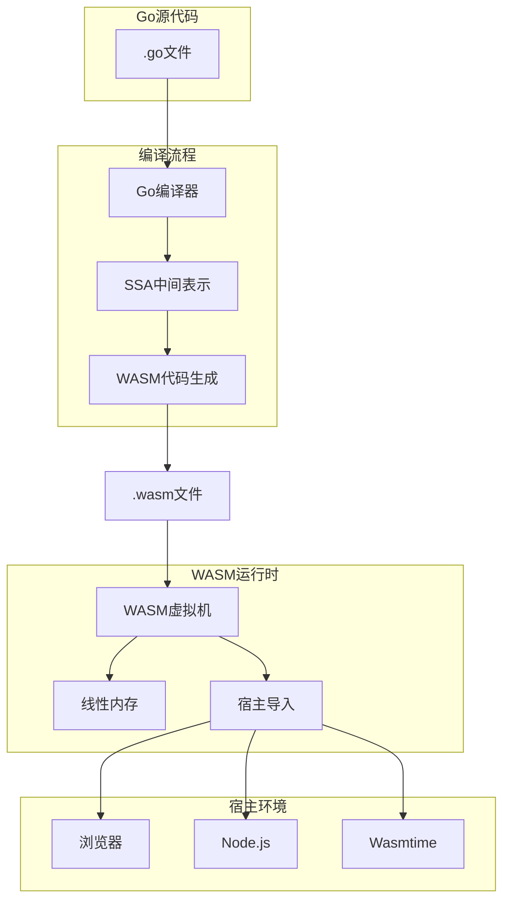

# Go与WebAssembly集成：编译模型与运行时语义

> **版本**: 2026.04.01 | **Go版本**: 1.21+ (WASI支持) | **形式化等级**: L4
> **前置**: [Go-1.26.1-Comprehensive.md](./Go-1.26.1-Comprehensive.md)

---

## 目录

- [Go与WebAssembly集成：编译模型与运行时语义](#go与webassembly集成编译模型与运行时语义)
  - [目录](#目录)
  - [1. WebAssembly概述](#1-webassembly概述)
    - [1.1 WASM基础](#11-wasm基础)
    - [1.2 WASM与Go的关系](#12-wasm与go的关系)
  - [2. Go到WASM编译模型](#2-go到wasm编译模型)
    - [2.1 编译架构](#21-编译架构)
    - [2.2 代码生成策略](#22-代码生成策略)
    - [2.3 运行时系统](#23-运行时系统)
  - [3. 内存模型映射](#3-内存模型映射)
    - [3.1 线性内存布局](#31-线性内存布局)
    - [3.2 Go内存到WASM内存](#32-go内存到wasm内存)
    - [3.3 内存管理挑战](#33-内存管理挑战)
  - [4. Goroutine在WASM中的实现](#4-goroutine在wasm中的实现)
    - [4.1 单线程调度模型](#41-单线程调度模型)
    - [4.2 异步操作模型](#42-异步操作模型)
    - [4.3 阻塞操作转换](#43-阻塞操作转换)
  - [5. 垃圾回收在WASM中](#5-垃圾回收在wasm中)
    - [5.1 GC算法适配](#51-gc算法适配)
    - [5.2 内存增长模型](#52-内存增长模型)
    - [5.3 性能影响](#53-性能影响)
  - [6. 标准库支持分析](#6-标准库支持分析)
    - [6.1 支持状态矩阵](#61-支持状态矩阵)
    - [6.2 WASI支持](#62-wasi支持)
  - [7. 性能特征](#7-性能特征)
    - [7.1 性能对比](#71-性能对比)
    - [7.2 代码大小](#72-代码大小)
  - [8. 应用场景与模式](#8-应用场景与模式)
    - [8.1 前端集成](#81-前端集成)
    - [8.2 服务端WASI](#82-服务端wasi)
    - [8.3 插件系统](#83-插件系统)
  - [9. 形式化语义](#9-形式化语义)
    - [9.1 WASM执行模型](#91-wasm执行模型)
    - [9.2 Go到WASM编译正确性](#92-go到wasm编译正确性)
    - [9.3 类型安全](#93-类型安全)
  - [10. 工具链与开发](#10-工具链与开发)
    - [10.1 开发工具](#101-开发工具)
    - [10.2 调试支持](#102-调试支持)
    - [10.3 最佳实践](#103-最佳实践)
  - [关联文档](#关联文档)

---

## 1. WebAssembly概述

### 1.1 WASM基础

**WebAssembly (WASM)** 是一种可移植、高性能的字节码格式：

| 特性 | 描述 | Go相关性 |
|------|------|---------|
| **沙箱化** | 内存隔离安全 | Go内存安全模型映射 |
| **可移植** | 跨平台执行 | Go跨编译目标 |
| **高效** | 接近原生性能 | Go运行时开销分析 |
| **紧凑** | 二进制格式 | Go编译产物大小 |

### 1.2 WASM与Go的关系



---

## 2. Go到WASM编译模型

### 2.1 编译架构

**Go WASM编译流程**:

```
Go Source
    ↓
AST (抽象语法树)
    ↓
SSA (静态单赋值)
    ↓
WASM IR (WASM中间表示)
    ↓
WASM Binary (二进制编码)
```

**编译命令**:

```bash
# 编译为WASM (JS宿主)
GOOS=js GOARCH=wasm go build -o main.wasm

# 编译为WASI (独立运行时)
GOOS=wasip1 GOARCH=wasm go build -o main.wasi
```

### 2.2 代码生成策略

**Goroutine映射**:

| Go构造 | WASM实现 | 说明 |
|--------|---------|------|
| Goroutine | 异步函数/协程模拟 | 单线程调度 |
| Channel | 共享内存队列 | 线性内存内实现 |
| Select | 状态机 | 非阻塞轮询 |
| Mutex | CAS操作 | WASM原子指令 |

### 2.3 运行时系统

Go WASM运行时包含：

```go
// WASM运行时组件
type WASMRuntime struct {
    Memory    []byte      // 线性内存
    Stack     []uintptr   // 栈管理
    GHeap     *Heap       // Go堆（在WASM内存内）
    Scheduler *Scheduler  // 协作式调度器
    Imports   ImportTable // 宿主导入函数
}
```

---

## 3. 内存模型映射

### 3.1 线性内存布局

**WASM线性内存结构**:

```
[WASM线性内存 - 32位地址空间]
┌─────────────────────────────────────┐
│ 0x0000 - 0x0100 │ WASM内部保留      │
├─────────────────────────────────────┤
│ 0x0100 - 0x1000 │ Go运行时保留      │
├─────────────────────────────────────┤
│ 0x1000 - ...    │ Go堆              │
│                 │ (GC管理)          │
├─────────────────────────────────────┤
│ ... - 上限      │ 栈空间            │
│                 │ (Goroutine栈)     │
└─────────────────────────────────────┘
```

### 3.2 Go内存到WASM内存

**映射规则**:

```
Go指针 → WASM内存偏移量

Go:   p := new(int)      // Go指针，如 0xc000012345
WASM: addr = linearMem + offset  // 线性内存偏移
```

**形式化映射**:

$$
\phi : \text{GoPtr} \to \text{WASMOffset}
$$

$$
\phi(p) = p - \text{heap_base}
$$

### 3.3 内存管理挑战

**WASM限制**:

- 线性内存大小固定或可增长，但连续
- 无内存保护（依赖宿主管控）
- 32位地址空间（当前限制）

**Go GC适配**:

```go
// WASM GC修改
func (gc *GC) scanRoots() {
    // 1. 扫描寄存器（WASM本地变量）
    // 2. 扫描栈（WASM栈内存）
    // 3. 扫描全局变量（WASM全局段）
}
```

---

## 4. Goroutine在WASM中的实现

### 4.1 单线程调度模型

WASM当前为**单线程**（无WASM线程支持时）：

```go
// WASM Goroutine调度器
type Scheduler struct {
    runq     []Goroutine   // 可运行队列
    current  *Goroutine    // 当前G
    sleeping []*Goroutine  // 睡眠G
}

func (s *Scheduler) Schedule() {
    for {
        if g := s.runq.pop(); g != nil {
            s.current = g
            g.execute()  // 执行直到阻塞或完成
        } else {
            // 无可运行G，检查定时器
            s.checkTimers()
        }
    }
}
```

**与原生Go对比**:

| 特性 | 原生Go (OS线程) | Go WASM (单线程) |
|------|----------------|------------------|
| 并行执行 | ✅ M:N调度 | ❌ 协作式调度 |
| 阻塞系统调用 | 阻塞OS线程 | 异步宿主编排 |
| 多核利用 | ✅ | ❌ |
| 上下文切换 | 快速 | 极快（函数调用） |

### 4.2 异步操作模型

**JS宿主中的异步**:

```go
// JS回调机制
func fetch(url string) js.Promise {
    // 调用JS fetch API
    return js.Global().Call("fetch", url)
}

// Go端使用
func main() {
    resp := await(fetch("https://api.example.com"))
    // 实际：注册回调，释放控制权给JS事件循环
}
```

**形式化模型**:

$$
\text{Goroutine}_i \xrightarrow{\text{yield}} \text{Scheduler} \xrightarrow{\text{resume}} \text{Goroutine}_j
$$

### 4.3 阻塞操作转换

所有阻塞操作转换为**异步非阻塞**:

```go
// 原生Go
conn, err := net.Dial("tcp", "host:port")  // 阻塞

// WASM Go
conn, err := await(net.DialAsync("tcp", "host:port"))  // 非阻塞+等待
// 底层：返回Promise，注册回调
```

---

## 5. 垃圾回收在WASM中

### 5.1 GC算法适配

Go WASM使用**相同的GC算法**（并发标记清除），但执行环境受限：

```
原生Go GC:          WASM Go GC:
├─ 并行标记          ├─ 单线程标记
├─ 多核协助          ├─ 无并行协助
├─ OS内存管理        ├─ WASM内存增长
└─ 精确栈扫描        └─ 模拟栈扫描
```

### 5.2 内存增长模型

```go
// WASM内存增长
func (rt *WASMRuntime) growHeap(size int) {
    currentPages := wasmMemorySize() / 65536  // 64KB页
    neededPages := (size + 65535) / 65536

    wasmMemoryGrow(neededPages)

    // 更新Go堆限制
    rt.heap.end = rt.heap.start + newSize
}
```

### 5.3 性能影响

| GC阶段 | 原生性能 | WASM性能 | 原因 |
|--------|---------|---------|------|
| 标记 | 快 | 慢 | 无并行协助 |
| 清扫 | 快 | 中 | 内存带宽限制 |
| STW | <1ms | <5ms | 单线程执行 |

---

## 6. 标准库支持分析

### 6.1 支持状态矩阵

| 包 | 支持度 | 说明 |
|-----|-------|------|
| `fmt` | ✅ 完全 | 格式化输出 |
| `net/http` | ⚠️ 部分 | 需JS fetch适配 |
| `os` | ⚠️ 部分 | 文件系统受限 |
| `sync` | ✅ 完全 | 锁在WASM原子操作 |
| `time` | ✅ 完全 | 依赖宿主时间 |
| `unsafe` | ⚠️ 部分 | 指针操作受限 |

### 6.2 WASI支持

**WASI (WebAssembly System Interface)** 提供标准系统接口：

```go
// WASI支持的标准输入输出
import "os"

func main() {
    // 标准输入输出
    os.Stdout.WriteString("Hello WASI\n")

    // 文件系统（受限）
    data, _ := os.ReadFile("/sandbox/file.txt")
}
```

---

## 7. 性能特征

### 7.1 性能对比

| 操作 | 原生Go (ns) | Go WASM (ns) |  slowdown |
|------|-------------|--------------|-----------|
| 函数调用 | 2 | 5 | 2.5x |
| 内存分配 | 20 | 50 | 2.5x |
| Channel操作 | 50 | 150 | 3x |
| 数学运算 | 1 | 2 | 2x |
| 系统调用 | 100 | 500+ | 5x+ |

### 7.2 代码大小

| 程序类型 | 原生二进制 | WASM二进制 | 压缩后 |
|---------|-----------|-----------|--------|
| Hello World | 2MB | 3MB | 1MB |
| 复杂应用 | 10MB | 15MB | 5MB |

**优化策略**:

- 使用`-ldflags="-s -w"`去除符号表
- 使用`wasm-opt`优化
- 启用Brotli/Gzip压缩

---

## 8. 应用场景与模式

### 8.1 前端集成

```go
// 导出Go函数到JS
func main() {
    c := make(chan struct{})

    // 注册回调
    js.Global().Set("goCalculate", js.FuncOf(func(this js.Value, args []js.Value) any {
        result := calculate(args[0].Int())
        return result
    }))

    <-c  // 保持运行
}
```

### 8.2 服务端WASI

```go
// 可移植服务端应用
package main

import (
    "fmt"
    "net/http"
)

func main() {
    http.HandleFunc("/", handler)
    http.ListenAndServe(":8080", nil)
}

// 可在任何支持WASI的运行时执行
```

### 8.3 插件系统

```go
// WASM作为插件
// 宿主加载多个WASM模块，每个可能是Go编译的

// main.wasm (Go)
func Process(data []byte) []byte {
    // 处理逻辑
    return result
}
```

---

## 9. 形式化语义

### 9.1 WASM执行模型

**定义 9.1 (WASM配置)**:

$$
C = (S, F, e^*)
$$

其中：

- $S$: 存储（内存、表、全局变量）
- $F$: 当前帧
- $e^*$: 指令序列

### 9.2 Go到WASM编译正确性

**定理 9.1**: Go程序$P$编译为WASM后语义保持。

$$
\llbracket P \rrbracket_{Go} \approx \llbracket \text{compile}(P) \rrbracket_{WASM}
$$

**条件**:

1. 无操作系统依赖
2. 标准库行为一致
3. 内存模型兼容

### 9.3 类型安全

**定理 9.2**: 类型良好的Go程序编译为WASM后类型安全。

$$
\vdash_{Go} P : \tau \Rightarrow \vdash_{WASM} \text{compile}(P) : \tau'
$$

---

## 10. 工具链与开发

### 10.1 开发工具

```bash
# 编译
GOOS=js GOARCH=wasm go build -o app.wasm

# 优化
wasm-opt -O3 app.wasm -o app.opt.wasm

# 分析
wasm-objdump -x app.wasm
wasm2wat app.wasm -o app.wat
```

### 10.2 调试支持

```go
// WASM调试
func init() {
    // 在浏览器控制台输出
    js.Global().Get("console").Call("log", "WASM initialized")
}
```

### 10.3 最佳实践

| 建议 | 原因 |
|------|------|
| 避免频繁JS调用 | 边界穿越开销 |
| 预分配内存 | 减少WASM内存增长 |
| 批量数据传输 | 减少复制开销 |
| 使用WASI | 更好的可移植性 |

---

## 关联文档

- [Go-1.26.1-Comprehensive.md](./Go-1.26.1-Comprehensive.md)
- [Go-Runtime-GC-Complete.md](./Go-Runtime-GC-Complete.md)
- [GMP调度器](./04-Runtime-System/GMP-Scheduler.md)

---

*文档版本: 2026-04-01 | WASM版本: WASI preview1 | Go版本: 1.21+*
