# 三主线对比矩阵：Go/CSP vs Scala/Actor vs Flink/Dataflow

> 文档编号: PUB-002
> 对比主线: Go/CSP、Scala/Actor、Flink/Dataflow
> 分析维度: 10+ 核心维度

---

## 1. 总体概览

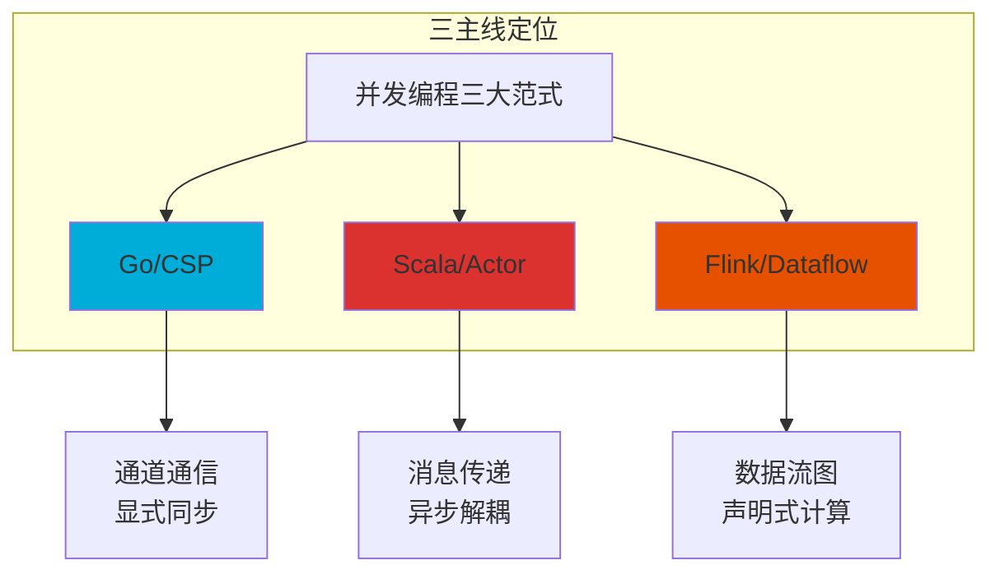

---

## 2. 核心维度对比矩阵

### 2.1 综合评分表 (1-5★)

| 维度 | Go/CSP | Scala/Actor | Flink/Dataflow | 分析说明 |
|------|--------|-------------|----------------|----------|
| **计算模型** | ★★★★☆ | ★★★★☆ | ★★★★★ | Go和Scala为通用模型，Flink专精流计算 |
| **通信机制** | ★★★★★ | ★★★★☆ | ★★★★☆ | CSP通道通信最直接，Dataflow透明优化 |
| **类型系统** | ★★★☆☆ | ★★★★★ | ★★★★☆ | Scala类型系统最强大，Flink基于Java类型 |
| **形式化深度** | ★★★☆☆ | ★★★★☆ | ★★★★★ | Flink基于数据流理论，有最强形式化基础 |
| **并发原语** | ★★★★★ | ★★★★☆ | ★★★☆☆ | Go的goroutine+channel最轻量简洁 |
| **容错机制** | ★★★☆☆ | ★★★★★ | ★★★★★ | Actor监督树和Flink检查点业界领先 |
| **工业应用** | ★★★★★ | ★★★★☆ | ★★★★★ | Go云原生，Flink大数据，Scala Akka成熟 |
| **验证工具支持** | ★★★☆☆ | ★★★★☆ | ★★★★★ | Flink模型检查工具最完善 |
| **学习曲线** | ★★★★★ | ★★★☆☆ | ★★★★☆ | Go最简单，Scala最陡峭 |
| **表达能力** | ★★★★☆ | ★★★★★ | ★★★★☆ | Scala多范式表达能力最强 |

**平均评分**: Go = 3.9★ | Scala = 4.1★ | Flink = 4.2★

---

### 2.2 详细维度分析

#### 维度 1: 计算模型

| 特性 | Go/CSP | Scala/Actor | Flink/Dataflow |
|------|--------|-------------|----------------|
| **理论基础** | Communicating Sequential Processes (CSP) | Actor Model | Dataflow / Streaming |
| **核心抽象** | Goroutine + Channel | Actor + Mailbox | Operator + Stream |
| **执行语义** | 协作式调度，M:N线程模型 | 线程池调度，mailbox串行 | 分布式数据流，事件时间 |
| **状态管理** | 显式状态，无内置持久化 | Actor局部状态，可持久化 | 有状态算子，自动检查点 |
| **时间语义** | 挂钟时间 | 挂钟时间 | 事件时间 / 处理时间 / 摄取时间 |

**代码对比**:

```go
// Go/CSP: 显式通道通信
func worker(in <-chan int, out chan<- int) {
    for x := range in {
        out <- process(x)
    }
}
```

```scala
// Scala/Actor: 异步消息处理
class Worker extends Actor {
  def receive = {
    case Task(x) => sender() ! Result(process(x))
  }
}
```

```java
// Flink/Dataflow: 声明式算子链
DataStream<Result> stream = input
    .map(x -> process(x))
    .keyBy(Result::getKey)
    .window(TumblingEventTimeWindows.of(Time.minutes(1)))
    .aggregate(new MyAggregate());
```

---

#### 维度 2: 通信机制

| 特性 | Go/CSP | Scala/Actor | Flink/Dataflow |
|------|--------|-------------|----------------|
| **通信方式** | 通道（同步/异步） | 异步消息传递 | 数据流（透明传输） |
| **背压处理** | 同步通道天然背压 | 需显式实现 | 自动背压传播 |
| **消息保证** | 无内置保证 | At-most-once / At-least-once | Exactly-once (checkpoint) |
| **顺序保证** | 通道内有序 | 单Actor内有序 | 键分区内有序 |
| **多路复用** | `select` 语句 | `become` + 偏函数 | 自动分区调度 |

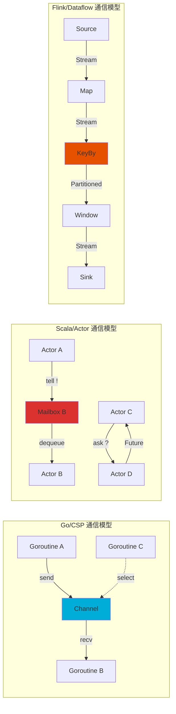

---

#### 维度 3: 类型系统

| 特性 | Go/CSP | Scala/Actor | Flink/Dataflow |
|------|--------|-------------|----------------|
| **类型范式** | 结构化类型，接口实现 | 名义类型，多继承特质 | Java类型系统 |
| **泛型支持** | 1.18+ 基础泛型 | 完整高阶类型 (HKT) | Java泛型 + 类型擦除 |
| **类型推断** | 局部推断 (`:=`) | 全局 Hindley-Milner | 局部推断 |
| **空安全** | 零值语义 | Option[T] 编译期安全 | Optional / 注解 |
| **类型状态** | 不支持 | 可用类型编码状态机 | 不支持 |

**类型系统能力层次**:

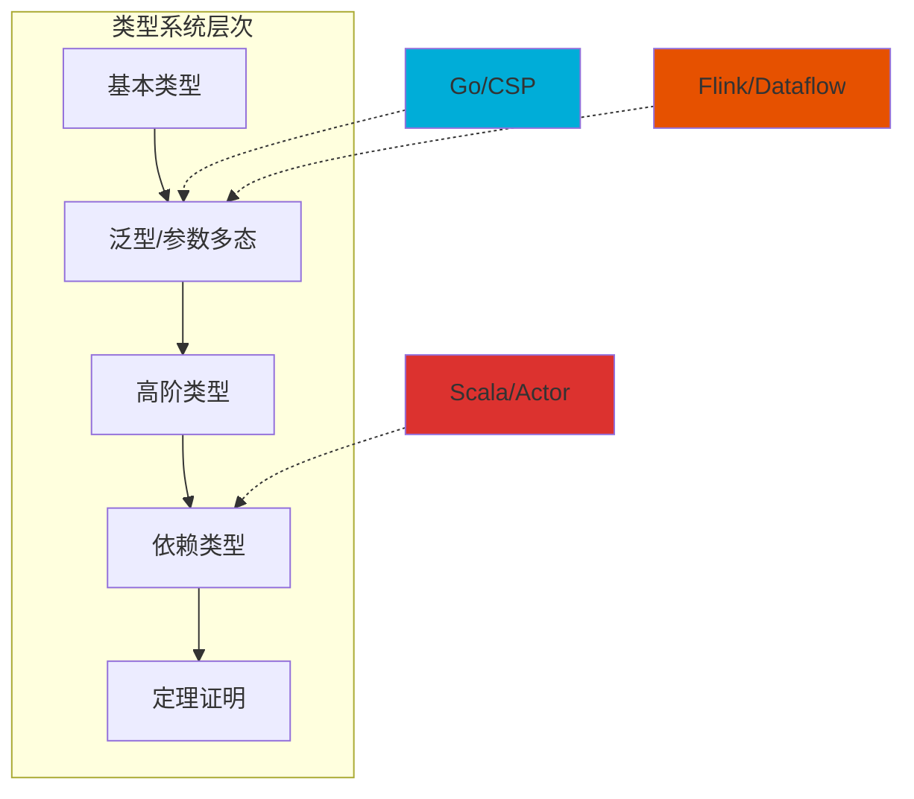

---

#### 维度 4: 形式化深度

| 特性 | Go/CSP | Scala/Actor | Flink/Dataflow |
|------|--------|-------------|----------------|
| **形式化基础** | CSP理论 (Hoare, 1978) | Actor理论 (Hewitt, 1973) | Dataflow理论 (Dennis, 1974) |
| **模型检查工具** | Go模型检查器 (有限) | Stacy, VerCors | Apache Flink ML, Beam模型验证 |
| **定理证明** | 无直接支持 | 可用Coq/Isabelle编码 | 基于Chandy-Lamport的形式化 |
| **语义定义** | 操作语义 | 操作语义 + 指称语义 | 声明式语义，批流统一 |
| **并发正确性** | 死锁检测工具 | Actor不变式验证 | 一致性模型验证 |

**形式化特性对比**:

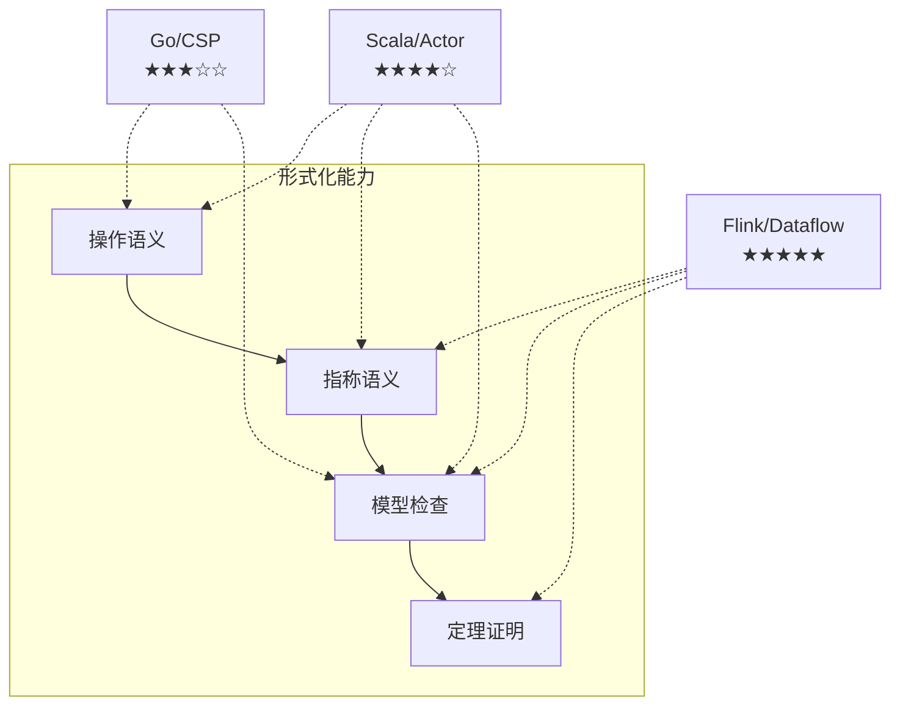

---

#### 维度 5: 并发原语

| 特性 | Go/CSP | Scala/Actor | Flink/Dataflow |
|------|--------|-------------|----------------|
| **轻量线程** | Goroutine (~2KB) | Actor (~300B+JVM) | Task Thread (JVM线程) |
| **创建开销** | 极低，可创建百万级 | 低，依赖JVM | 中等，资源管理器分配 |
| **同步原语** | Mutex, RWMutex, WaitGroup | 无（消息传递优先） | 算子内部同步 |
| **并发集合** | sync.Map, Channel | 并发集合库 | 分布式数据集 |
| **取消机制** | context.Context | Actor终止信号 | 作业取消信号 |

**并发原语丰富度**:

| 原语类型 | Go | Scala | Flink |
|----------|-----|-------|-------|
| 轻量协程 | ✅✅✅ | ✅✅ | ✅ |
| 互斥锁 | ✅✅✅ | ✅✅ | ✅ |
| 读写锁 | ✅✅✅ | ✅✅ | ✅ |
| 条件变量 | ✅✅ | ✅✅ | ✅ |
| 原子操作 | ✅✅✅ | ✅✅ | ✅ |
| Once | ✅✅✅ | ✅ | ✅ |
| Pool | ✅✅✅ | ✅✅ | ✅✅ |

---

#### 维度 6: 容错机制

| 特性 | Go/CSP | Scala/Actor | Flink/Dataflow |
|------|--------|-------------|----------------|
| **监督策略** | 无内置监督 | Supervisor Strategy (All-for-One, One-for-One) | JobManager 监督 |
| **故障恢复** | 手动实现 | 自动重启，最大重试次数 | 自动检查点恢复 |
| **状态持久化** | 需自行实现 | Akka Persistence | 分布式快照 (Chandy-Lamport) |
| **容错语义** | 无默认保证 | At-least-once / At-most-once | Exactly-once |
| **级联故障** | 需手动隔离 | 监督树隔离 | 分区隔离 |

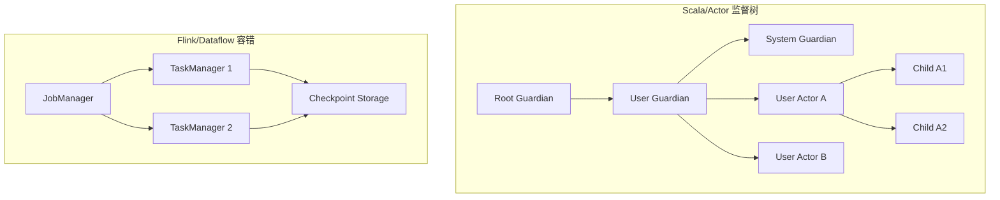

**容错能力评级**:

| 场景 | Go | Scala | Flink |
|------|-----|-------|-------|
| 进程崩溃恢复 | ★★☆ | ★★★★★ | ★★★★★ |
| 状态恢复 | ★★☆ | ★★★★☆ | ★★★★★ |
| 网络分区处理 | ★★☆ | ★★★☆☆ | ★★★★☆ |
| 级联故障隔离 | ★★☆ | ★★★★★ | ★★★★☆ |

---

#### 维度 7: 工业应用

| 领域 | Go/CSP | Scala/Actor | Flink/Dataflow |
|------|--------|-------------|----------------|
| **云原生基础设施** | Kubernetes, Docker, etcd | Lightbend Stack | Apache Beam Runner |
| **微服务框架** | Go-kit, Gin | Akka HTTP, Play | 不直接适用 |
| **大数据处理** | 有限支持 | Spark, Kafka | Flink, Beam (主流) |
| **实时流处理** | 需自建 | Akka Streams | Flink (业界标准) |
| **金融交易系统** | 部分应用 | 高频交易，风险系统 | 风控，实时定价 |

**工业采用度 (GitHub Stars / 企业采用)**:

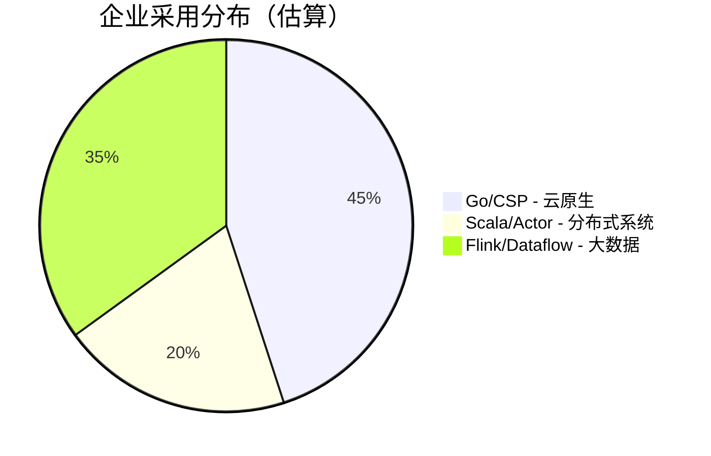

---

#### 维度 8: 验证工具支持

| 工具类型 | Go/CSP | Scala/Actor | Flink/Dataflow |
|----------|--------|-------------|----------------|
| **静态分析** | go vet, staticcheck, golangci-lint | Scalafix, WartRemover | 有限 |
| **模型检查** | GoRaceDetector, go-modelcheck | Stacy, VerCors | Apache Flink验证工具 |
| **形式化验证** | 有限 | Coq/Isabelle编码 | Chandy-Lamport验证 |
| **测试框架** | testing, testify | ScalaTest, Specs2 | Flink Test Harness |
| **契约检查** | 无原生支持 | refinement types | 有限 |

---

#### 维度 9: 学习曲线

| 阶段 | Go/CSP | Scala/Actor | Flink/Dataflow |
|------|--------|-------------|----------------|
| **入门 (基础语法)** | 1-2 周 | 2-4 周 | 2-3 周 |
| **进阶 (并发模型)** | 2-4 周 | 4-8 周 | 3-6 周 |
| **精通 (生产级)** | 1-3 月 | 3-6 月 | 2-4 月 |
| **专家 (深度优化)** | 3-6 月 | 6-12 月 | 4-8 月 |

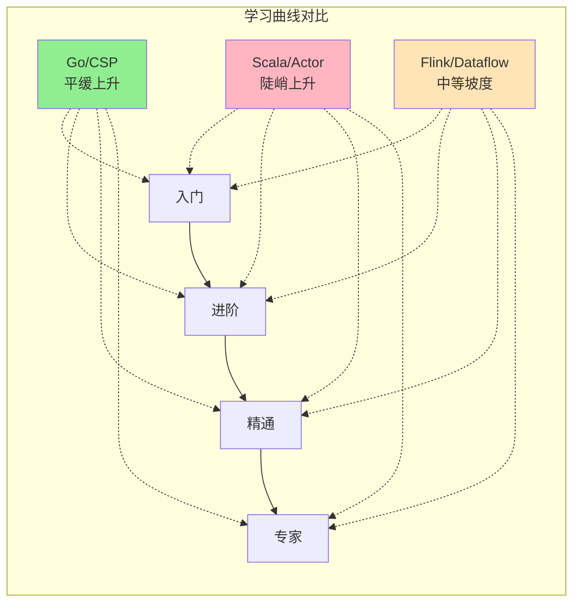

---

#### 维度 10: 表达能力

| 表达能力 | Go/CSP | Scala/Actor | Flink/Dataflow |
|----------|--------|-------------|----------------|
| **命令式编程** | ✅✅✅ | ✅✅✅ | ✅✅ |
| **函数式编程** | ✅✅ | ✅✅✅ | ✅✅✅ |
| **面向对象** | ✅✅ | ✅✅✅ | ✅✅ |
| **泛型编程** | ✅✅ | ✅✅✅ | ✅✅ |
| **元编程** | ✅ | ✅✅✅ | ✅ |
| **DSL构建** | ✅✅ | ✅✅✅ | ✅✅✅ |
| **类型级编程** | ❌ | ✅✅✅ | ❌ |

---

## 3. 各主线优势场景分析

### 3.1 Go/CSP 最佳场景

| 场景 | 优势原因 | 典型案例 |
|------|----------|----------|
| **云原生基础设施** | 编译为单二进制，启动快，资源占用低 | Kubernetes, Docker, etcd |
| **网络服务/网关** | Goroutine轻量，高并发连接处理 | Nginx替代，API网关 |
| **命令行工具** | 快速编译，单文件部署 | kubectl, helm |
| **DevOps工具** | 静态链接，跨平台 | Terraform Provider |

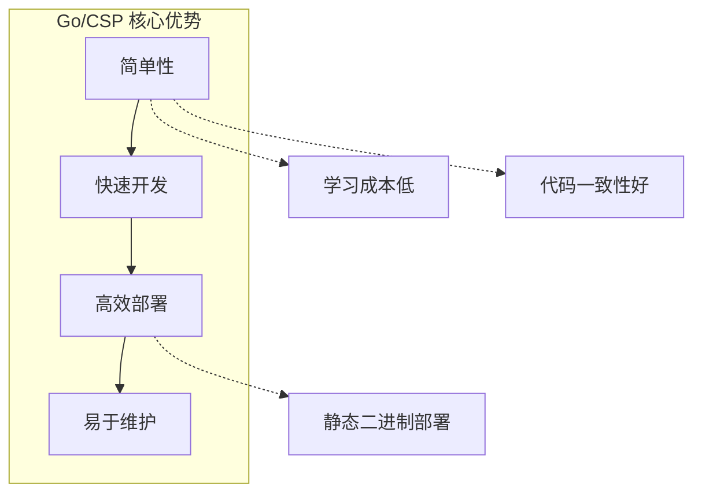

### 3.2 Scala/Actor 最佳场景

| 场景 | 优势原因 | 典型案例 |
|------|----------|----------|
| **复杂分布式系统** | Actor模型天然分布，容错性强 | 电信系统，交易系统 |
| **响应式系统** | Reactive Streams，背压处理 | 实时推荐系统 |
| **领域驱动设计** | 强类型系统支持复杂领域模型 | 金融核心系统 |
| **事件溯源/CQRS** | Akka Persistence支持 | 审计日志系统 |

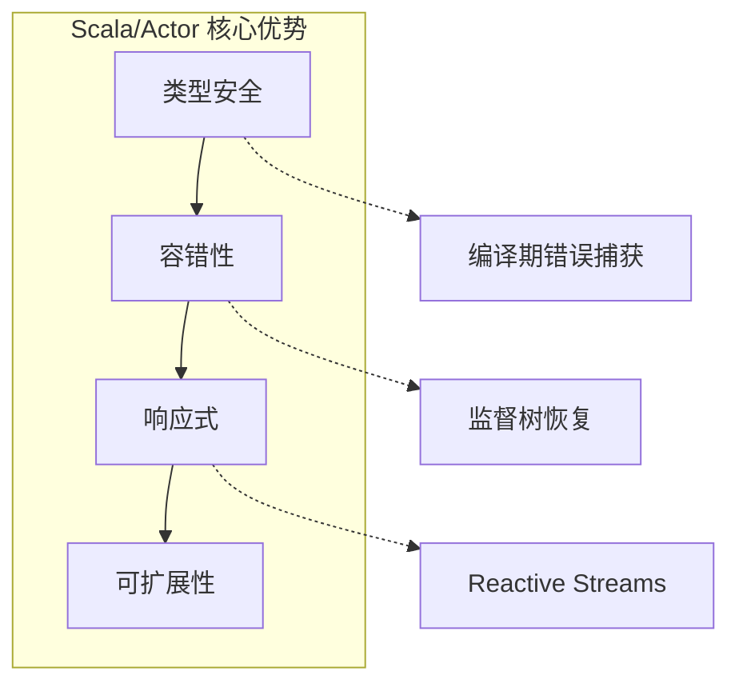

### 3.3 Flink/Dataflow 最佳场景

| 场景 | 优势原因 | 典型案例 |
|------|----------|----------|
| **大规模流处理** | 分布式数据流，自动扩缩容 | 实时ETL，日志分析 |
| **事件时间处理** | 精确的事件时间语义 | 点击流分析，IoT数据处理 |
| **有状态计算** | 分布式状态，检查点恢复 | 会话窗口，模式检测 |
| **批流统一** | 同一API处理批/流数据 | Lambda架构替代 |

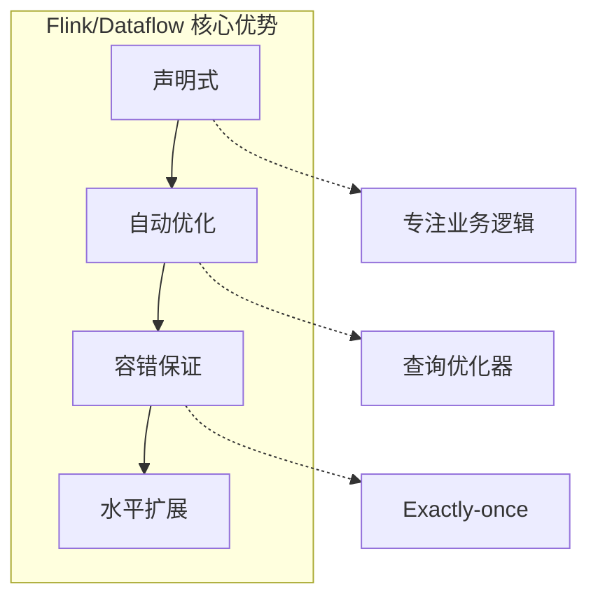

---

## 4. 选择决策树

### 4.1 技术选择决策流程

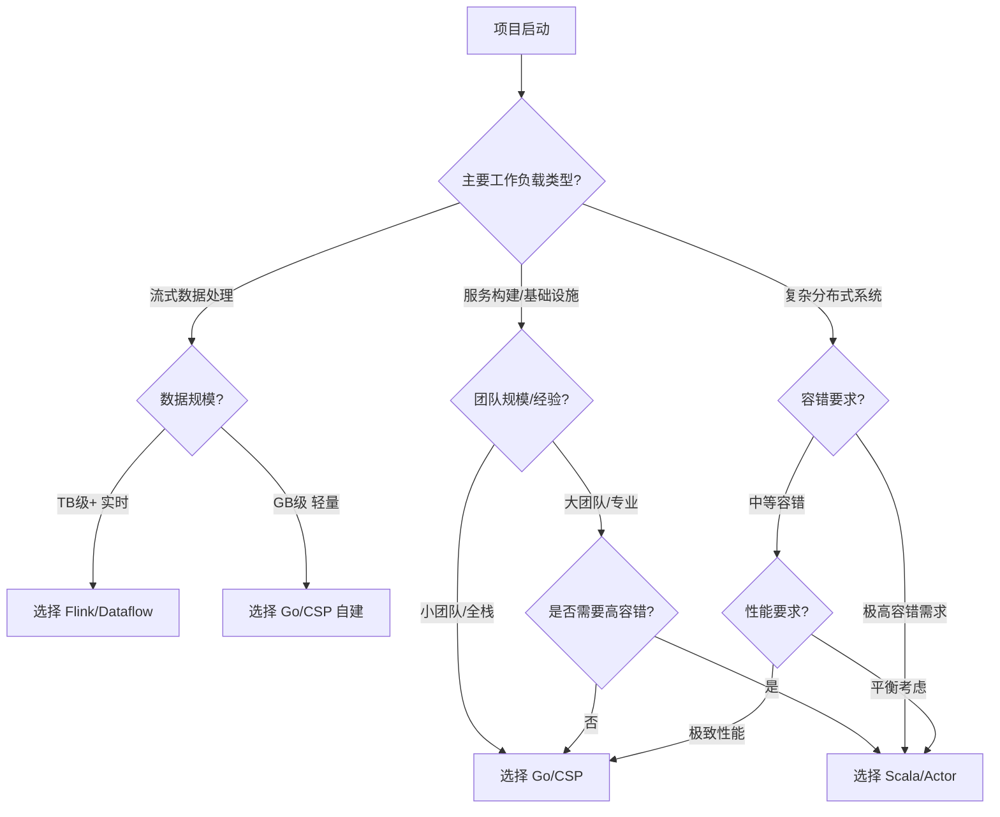

### 4.2 快速决策矩阵

| 你的需求 | 推荐选择 | 备选方案 |
|----------|----------|----------|
| 快速构建微服务 | Go/CSP | Scala/Actor (Akka HTTP) |
| 大数据实时处理 | Flink/Dataflow | Scala/Actor (Akka Streams) |
| 高容错分布式系统 | Scala/Actor | Flink/Dataflow |
| 云原生基础设施 | Go/CSP | - |
| 复杂领域建模 | Scala/Actor | - |
| 批流统一处理 | Flink/Dataflow | - |
| 快速原型开发 | Go/CSP | Flink SQL |
| 金融级交易系统 | Scala/Actor | Flink CEP |

### 4.3 团队考量因素

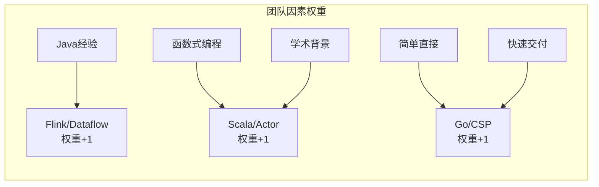

---

## 5. 技术迁移路径

### 5.1 迁移复杂度评估

| 迁移方向 | 复杂度 | 关键挑战 |
|----------|--------|----------|
| Go → Scala | ★★★☆☆ | CSP到Actor思维转换，类型系统升级 |
| Scala → Go | ★★★★☆ | 类型系统降级，模式匹配重构 |
| Go → Flink | ★★★☆☆ | 命令式到声明式，分布式理解 |
| Flink → Go | ★★★★☆ | 分布式语义手动实现 |
| Scala → Flink | ★★☆☆☆ | 同为JVM生态，概念相近 |
| Flink → Scala | ★★★☆☆ | 数据流到Actor模型转换 |

### 5.2 混合架构建议

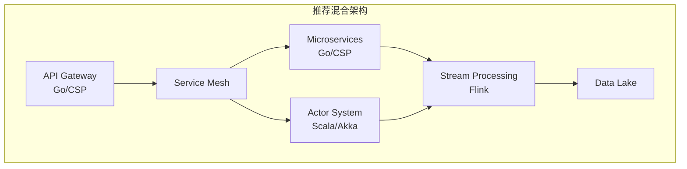

---

## 6. 总结与建议

### 6.1 核心结论

1. **Go/CSP** 是工程效率最优解，适合云原生时代的基础设施和服务开发
2. **Scala/Actor** 是复杂系统首选，在容错和领域建模方面具有不可替代的优势
3. **Flink/Dataflow** 是数据处理的终极方案，批流统一和精确语义使其成为大数据领域标准

### 6.2 选型检查清单

- [ ] 明确系统类型（服务 vs 数据处理 vs 分布式系统）
- [ ] 评估数据规模和延迟要求
- [ ] 考虑团队技术栈和经验
- [ ] 分析容错和一致性需求
- [ ] 评估部署和运维复杂度
- [ ] 考虑长期维护和演进成本

---

*文档编号: PUB-002*
*版本: 1.0*
*创建日期: 2026-04-01*
*用于 ActorCSPWorkflow 项目三主线对比分析*
