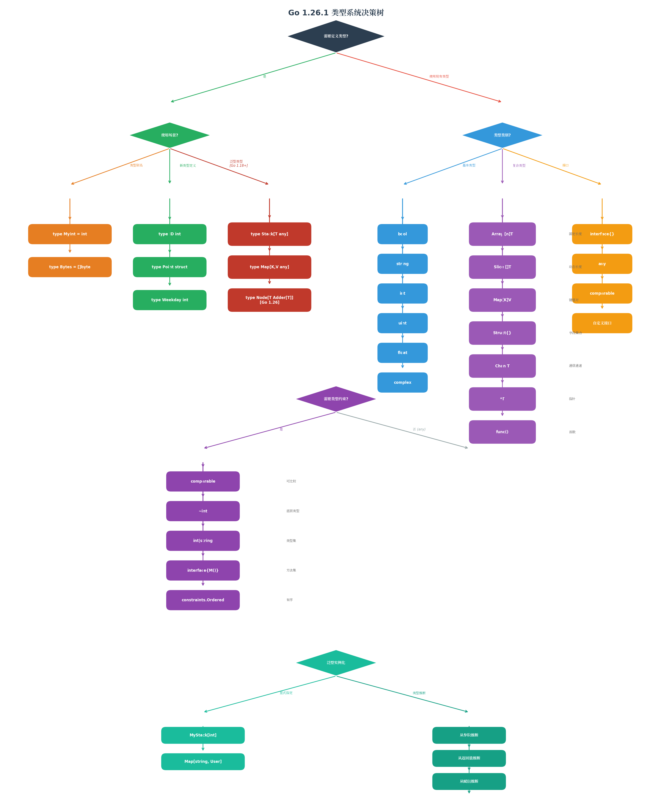
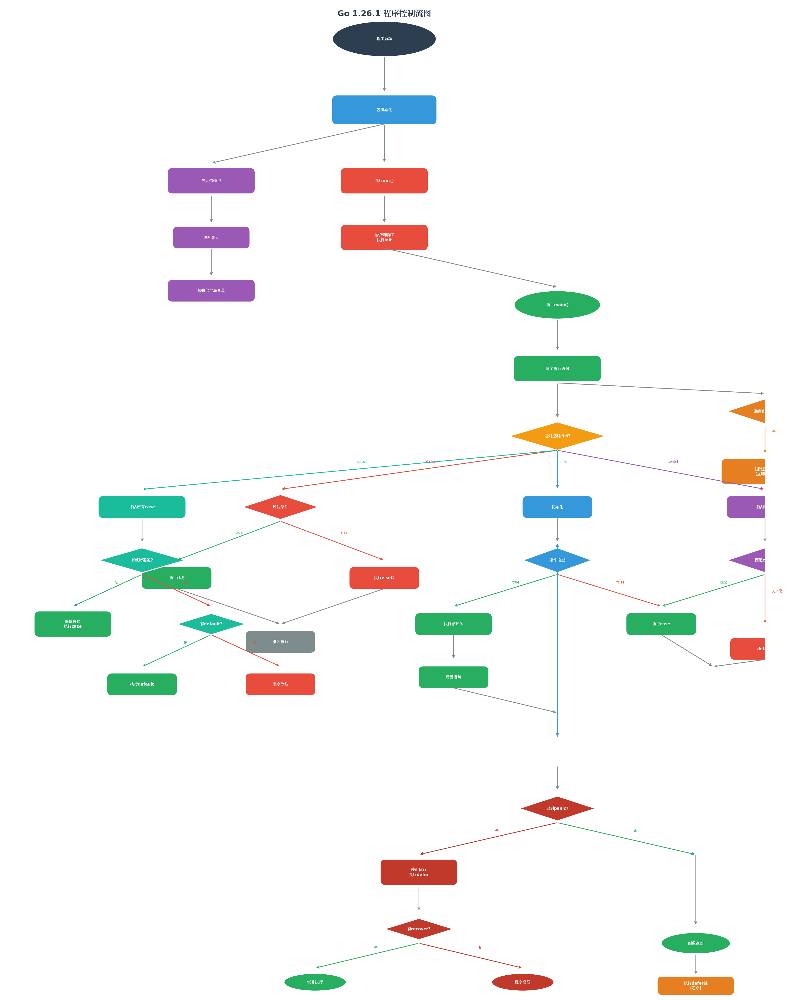
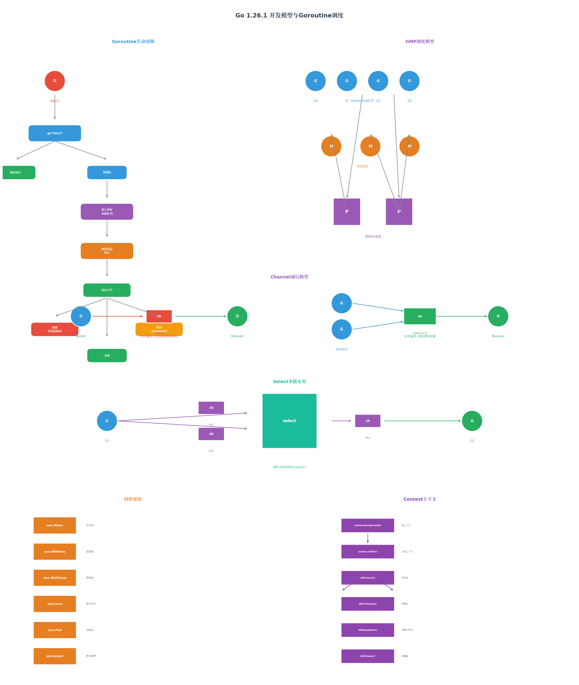
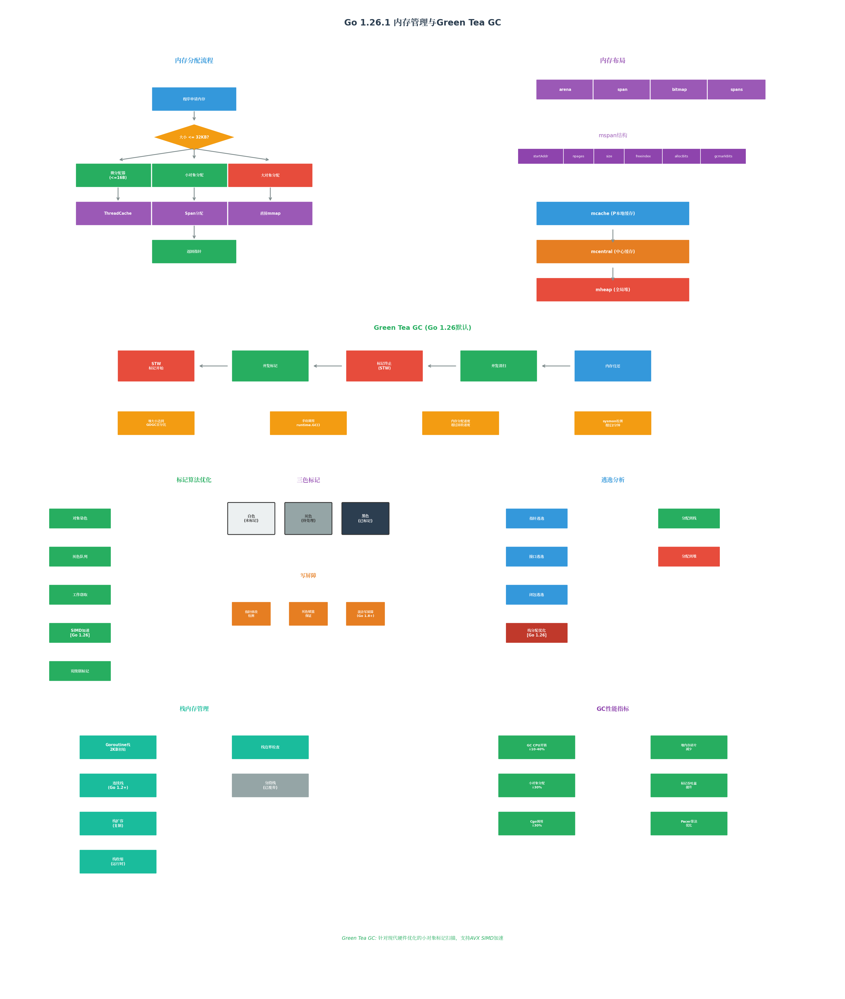
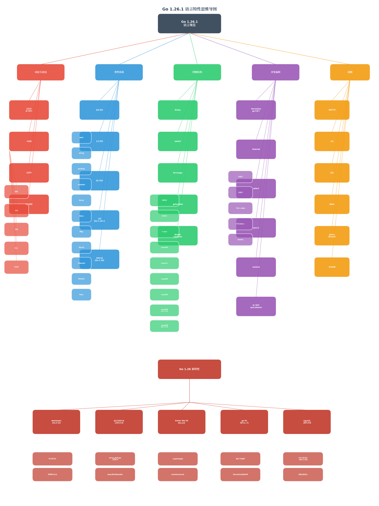

# Go 1.26.1 语言规范全面分析

> 本文档基于 Go 1.26.1 (2026年2月发布) 官方语言规范，结合最新语言特性进行全面分析。
> 参考来源：[The Go Programming Language Specification](https://go.dev/ref/spec)  [(The Go Programming Language Specification - The Go Programming Language)](https://go.dev/ref/spec) , [Go 1.26 Release Notes](https://go.dev/doc/go1.26)  [(The Go Programming Language)](https://go.dev/doc/go1.26)

---

## 目录

- [Go 1.26.1 语言规范全面分析](#go-1261-语言规范全面分析)
  - [目录](#目录)
  - [一、语言概述与设计理念](#一语言概述与设计理念)
    - [1.1 设计哲学](#11-设计哲学)
    - [1.2 语言版本演进](#12-语言版本演进)
  - [二、词法与语法基础](#二词法与语法基础)
    - [2.1 源文件表示](#21-源文件表示)
    - [2.2 词法元素](#22-词法元素)
      - [2.2.1 关键字（25个）](#221-关键字25个)
      - [2.2.2 运算符与优先级](#222-运算符与优先级)
      - [2.2.3 字面量类型](#223-字面量类型)
    - [2.3 分号规则（自动插入）](#23-分号规则自动插入)
  - [三、类型系统深度解析](#三类型系统深度解析)
    - [3.1 类型分类](#31-类型分类)
      - [3.1.1 基本类型](#311-基本类型)
      - [3.1.2 复合类型](#312-复合类型)
      - [3.1.3 接口类型](#313-接口类型)
    - [3.2 泛型（Go 1.18+）](#32-泛型go-118)
      - [3.2.1 泛型函数](#321-泛型函数)
      - [3.2.2 泛型类型](#322-泛型类型)
      - [3.2.3 类型约束](#323-类型约束)
      - [3.2.4 Go 1.26 递归类型约束](#324-go-126-递归类型约束)
    - [3.3 类型关系](#33-类型关系)
      - [3.3.1 底层类型](#331-底层类型)
      - [3.3.2 类型可赋值性](#332-类型可赋值性)
      - [3.3.3 类型转换规则](#333-类型转换规则)
  - [四、控制结构与执行流](#四控制结构与执行流)
    - [4.1 if-else](#41-if-else)
    - [4.2 switch](#42-switch)
    - [4.3 for 循环](#43-for-循环)
    - [4.4 select（多路复用）](#44-select多路复用)
    - [4.5 defer](#45-defer)
    - [4.6 panic 与 recover](#46-panic-与-recover)
  - [五、函数与方法](#五函数与方法)
    - [5.1 函数声明](#51-函数声明)
    - [5.2 方法](#52-方法)
    - [5.3 方法表达式与值](#53-方法表达式与值)
    - [5.4 闭包](#54-闭包)
  - [六、并发编程模型](#六并发编程模型)
    - [6.1 Goroutine](#61-goroutine)
    - [6.2 Channel](#62-channel)
    - [6.3 同步原语](#63-同步原语)
    - [6.4 Context](#64-context)
  - [七、内存管理与GC](#七内存管理与gc)
    - [7.1 内存分配](#71-内存分配)
    - [7.2 Green Tea GC（Go 1.26）](#72-green-tea-gcgo-126)
    - [7.3 逃逸分析](#73-逃逸分析)
    - [7.4 栈管理](#74-栈管理)
  - [八、Go 1.26 新特性详解](#八go-126-新特性详解)
    - [8.1 new(expr) 表达式支持](#81-newexpr-表达式支持)
    - [8.2 递归类型约束](#82-递归类型约束)
    - [8.3 Green Tea GC 默认启用](#83-green-tea-gc-默认启用)
    - [8.4 go fix 现代化工具](#84-go-fix-现代化工具)
    - [8.5 其他重要改进](#85-其他重要改进)
  - [九、思维导图与可视化](#九思维导图与可视化)
    - [9.1 语言特性思维导图](#91-语言特性思维导图)
    - [9.2 类型系统决策树](#92-类型系统决策树)
    - [9.3 程序控制流图](#93-程序控制流图)
    - [9.4 并发模型图](#94-并发模型图)
    - [9.5 内存管理与GC图](#95-内存管理与gc图)
  - [十、示例与反例汇总](#十示例与反例汇总)
    - [10.1 常见陷阱](#101-常见陷阱)
    - [10.2 最佳实践](#102-最佳实践)
  - [参考文档](#参考文档)

---

## 一、语言概述与设计理念

### 1.1 设计哲学

Go 语言由 Google 于 2007 年开始设计，2009 年开源发布，其设计哲学可概括为：

| 原则 | 说明 | 体现 |
|------|------|------|
| **简洁性** | 语法精简，关键字仅25个 | 无类继承、无泛型(1.18前)、无异常 |
| **显式性** | 避免隐式行为 | 显式错误处理、显式类型转换 |
| **并发性** | 原生支持并发 | Goroutine + Channel |
| **高效性** | 编译快、执行快 | 静态编译、垃圾回收、零成本抽象 |
| **工程性** | 适合大规模团队协作 | 强制代码格式、简单依赖管理 |

### 1.2 语言版本演进

```
Go 1.0 (2012)  →  初始稳定版本
Go 1.5 (2015)  →  自举编译器
Go 1.11(2018)  →  Go Modules
Go 1.13(2019)  →  错误处理改进
Go 1.18(2022)  →  泛型支持
Go 1.20(2023)  →  可比较接口
Go 1.22(2024)  →  整数range、loopvar修复
Go 1.23(2024)  →  迭代器、range-over-func
Go 1.24(2025)  →  JSON v2实验、weak指针
Go 1.26(2026)  →  new(expr)、递归类型约束、Green Tea GC
```

---

## 二、词法与语法基础

### 2.1 源文件表示

**定义**：Go 源文件是 UTF-8 编码的 Unicode 文本。

**属性**：

- 字符区分大小写
- 不处理 Unicode 规范化（组合字符视为独立字符）
- 允许 BOM（字节顺序标记）在文件开头

### 2.2 词法元素

#### 2.2.1 关键字（25个）

| 类别 | 关键字 |
|------|--------|
| 声明 | `const`, `func`, `import`, `package`, `type`, `var` |
| 控制 | `break`, `case`, `continue`, `default`, `defer`, `else`, `fallthrough`, `for`, `go`, `goto`, `if`, `range`, `return`, `select`, `switch` |
| 其他 | `chan`, `interface`, `map`, `struct` |

#### 2.2.2 运算符与优先级

```
优先级(高→低):
5: *  /  %  <<  >>  &  &^
4: +  -  |  ^
3: ==  !=  <  <=  >  >=
2: &&
1: ||
```

**示例**：

```go
// 优先级示例
result := a + b*c      // 等价于 a + (b*c)
result := a && b || c  // 等价于 (a && b) || c
```

#### 2.2.3 字面量类型

| 类型 | 语法 | 示例 |
|------|------|------|
| 整数 | 十进制/八进制(0o)/十六进制(0x)/二进制(0b) | `42`, `0o52`, `0x2A`, `0b101010` |
| 浮点 | 小数/指数 | `3.14`, `6.02e23` |
| 复数 | 实部+虚部 | `1+2i` |
| 符文 | 单引号 | `'A'`, `'\n'`, `'\u4e2d'` |
| 字符串 | 双引号/反引号 | `"hello"`, `` `raw string` `` |

**反例**：

```go
// 错误：字符串不能修改
s := "hello"
s[0] = 'H'  // 编译错误：cannot assign to s[0]

// 错误：符文是整数，不是字符串
r := 'A'
_ = r + "B"  // 编译错误：mismatched types rune and string
```

### 2.3 分号规则（自动插入）

**规则**：词法器在以下 token 后自动插入分号：

1. 标识符
2. 字面量
3. `break`, `continue`, `fallthrough`, `return`
4. `++`, `--`, `)`

**示例**：

```go
// 实际代码
func main() {
    fmt.Println("Hello")
}

// 词法器处理后（概念上）
func main(); {
    fmt.Println("Hello");
};
```

---

## 三、类型系统深度解析

### 3.1 类型分类



#### 3.1.1 基本类型

```go
// 布尔类型
var b bool = true

// 数值类型
var i int = 42           // 平台相关(32/64位)
var i8 int8 = 127        // -128 ~ 127
var i16 int16 = 32767    // -32768 ~ 32767
var i32 int32 = 2147483647
var i64 int64 = 9223372036854775807

var u uint = 42          // 无符号
var u8 uint8 = 255       // 别名 byte
var u16 uint16 = 65535
var u32 uint32 = 4294967295
var u64 uint64 = 18446744073709551615

var f32 float32 = 3.14
var f64 float64 = 3.14159265359

var c64 complex64 = 1 + 2i
var c128 complex128 = 1 + 2i

// 字符串类型
var s string = "Hello, 世界"
```

**注意**：`int` 和 `int32` 是不同类型，需要显式转换！

```go
var i int = 42
var i32 int32 = int32(i)  // 必须显式转换
```

#### 3.1.2 复合类型

**数组（Array）**：

```go
// 定义：固定长度、同类型元素序列
var arr [5]int = [5]int{1, 2, 3, 4, 5}
arr2 := [...]int{1, 2, 3}  // 长度推断为3

// 属性：值类型，赋值会复制整个数组
arrCopy := arr  // 复制5个int
```

**切片（Slice）**：

```go
// 定义：动态长度的数组视图
var s []int = []int{1, 2, 3}
s = append(s, 4, 5)

// 底层结构（概念上）
type SliceHeader struct {
    Data uintptr  // 指向底层数组
    Len  int      // 长度
    Cap  int      // 容量
}

// 切片表达式
arr := [5]int{1, 2, 3, 4, 5}
s := arr[1:4]  // [2, 3, 4]
```

**映射（Map）**：

```go
// 定义：无序键值对
m := make(map[string]int)
m["key"] = 42

// 注意：map是引用类型，未初始化为nil
var m map[string]int  // nil map
m["key"] = 1          // panic: assignment to entry in nil map

// 安全访问
if v, ok := m["key"]; ok {
    fmt.Println(v)
}
```

**结构体（Struct）**：

```go
// 定义
type Person struct {
    Name string
    Age  int
}

// 字面量
p := Person{Name: "Alice", Age: 30}
p2 := Person{"Bob", 25}  // 按字段顺序

// 匿名结构体
anon := struct {
    X, Y int
}{1, 2}

// 嵌入字段（类似继承）
type Employee struct {
    Person      // 匿名嵌入
    Salary int
}
e := Employee{Person: Person{Name: "Carol"}, Salary: 5000}
fmt.Println(e.Name)  // 直接访问嵌入字段
```

**指针（Pointer）**：

```go
var x int = 42
var p *int = &x

// Go不支持指针运算
p++  // 编译错误

// 空指针解引用会panic
var p *int
fmt.Println(*p)  // panic: nil pointer dereference
```

**通道（Channel）**：

```go
// 无缓冲通道（同步）
ch1 := make(chan int)

// 有缓冲通道（异步）
ch2 := make(chan int, 10)

// 方向约束
sendOnly := make(chan<- int)    // 只发送
recvOnly := make(<-chan int)    // 只接收

// 关闭通道
close(ch)

// 接收检查
v, ok := <-ch  // ok=false表示通道已关闭且无数据
```

**函数（Function）**：

```go
// 函数类型
type Adder func(int, int) int

// 多返回值
func div(a, b int) (int, error) {
    if b == 0 {
        return 0, errors.New("division by zero")
    }
    return a / b, nil
}

// 命名返回值
func split(sum int) (x, y int) {
    x = sum * 4 / 9
    y = sum - x
    return  // 裸return返回命名值
}
```

#### 3.1.3 接口类型

**定义**：接口定义了一组方法签名。

```go
// 基本接口
type Writer interface {
    Write(p []byte) (n int, err error)
}

// 空接口（任何类型都实现）
type Any interface{}
// Go 1.18+ 预声明别名
var x any = 42

// 可比较接口（Go 1.18+）
var c comparable = 42  // 只能赋可比较类型

// 类型集接口（Go 1.18+，用于泛型约束）
type Number interface {
    ~int | ~float64  // 底层类型为int或float64
}
```

**实现机制**：

- 隐式实现：类型无需声明实现哪个接口
- 运行时动态分派
- 接口值 = (类型, 值) 元组

```go
type Stringer interface {
    String() string
}

type MyInt int
func (m MyInt) String() string {
    return fmt.Sprintf("MyInt(%d)", m)
}

var s Stringer = MyInt(42)  // 隐式实现
```

### 3.2 泛型（Go 1.18+）

#### 3.2.1 泛型函数

```go
// 类型参数声明
func Min[T comparable](a, b T) T {
    if a < b {
        return a
    }
    return b
}

// 使用
m := Min[int](3, 5)      // 显式实例化
m2 := Min(3, 5)          // 类型推断
```

#### 3.2.2 泛型类型

```go
// 泛型栈
type Stack[T any] struct {
    items []T
}

func (s *Stack[T]) Push(item T) {
    s.items = append(s.items, item)
}

func (s *Stack[T]) Pop() (T, bool) {
    var zero T
    if len(s.items) == 0 {
        return zero, false
    }
    item := s.items[len(s.items)-1]
    s.items = s.items[:len(s.items)-1]
    return item, true
}

// 使用
var intStack Stack[int]
intStack.Push(42)
```

#### 3.2.3 类型约束

```go
// 近似约束（~）
type Integer interface {
    ~int | ~int8 | ~int16 | ~int32 | ~int64
}

// 方法约束
type Stringer interface {
    String() string
}

// 组合约束
type Ordered interface {
    Integer | Float | ~string
}

// 使用
type Adder[T interface{ Add(T) T }] interface {
    Add(T) T
}
```

#### 3.2.4 Go 1.26 递归类型约束

**新特性**：泛型类型现在可以在类型参数列表中引用自身。

```go
// Go 1.26 之前：编译错误
// Go 1.26：合法！
type Adder[A Adder[A]] interface {
    Add(A) A
}

func algo[A Adder[A]](x, y A) A {
    return x.Add(y)
}

// 应用场景：自引用数据结构
type Node[T Node[T]] struct {
    value T
    left, right *Node[T]
}
```

**概念解释**：

- **递归类型约束**：类型参数约束可以引用正在定义的类型本身
- **应用场景**：实现复杂的数据结构（如自平衡树、图节点）
- **类型推断**：编译器能够处理这种自引用关系进行类型推断

### 3.3 类型关系

#### 3.3.1 底层类型

```go
type MyInt int      // 底层类型是 int
type MyMyInt MyInt  // 底层类型仍是 int

// 用途：类型约束中的近似匹配
```

#### 3.3.2 类型可赋值性

变量 `v` 可赋值给类型 `T` 的变量，当且仅当：

1. `v` 的类型与 `T` 相同
2. `v` 的类型底层类型与 `T` 相同，且至少一个是未命名类型
3. `T` 是接口，且 `v` 的类型实现 `T`
4. `v` 是双向通道，可赋值给单向通道 `T`
5. `v` 是 `nil`，可赋值给指针/函数/切片/映射/通道/接口

#### 3.3.3 类型转换规则

```go
// 允许的情况
var i int = 42
var f float64 = float64(i)
var u uint = uint(i)

// 不允许的情况（编译错误）
var s string = string(i)  // 错误：int不能转string（用strconv.Itoa）
var b bool = bool(i)      // 错误：int不能转bool
```

---

## 四、控制结构与执行流



### 4.1 if-else

```go
// 基本形式
if x > 0 {
    return x
} else {
    return -x
}

// 带初始化语句
if err := doSomething(); err != nil {
    return err
}
// err 在这里不可见

// 短变量声明作用域
if x := 10; x > 5 {
    fmt.Println(x)  // 10
}
// fmt.Println(x)  // 编译错误：x未定义
```

### 4.2 switch

```go
// 表达式switch
switch day {
case "Monday", "Tuesday", "Wednesday", "Thursday", "Friday":
    fmt.Println("工作日")
case "Saturday", "Sunday":
    fmt.Println("周末")
default:
    fmt.Println("未知")
}

// 类型switch（接口类型断言）
var x interface{} = 42
switch v := x.(type) {
case int:
    fmt.Printf("整数: %d\n", v)
case string:
    fmt.Printf("字符串: %s\n", v)
default:
    fmt.Printf("未知类型: %T\n", v)
}

// 无条件switch（替代长if-else链）
switch {
case x < 0:
    fmt.Println("负数")
case x == 0:
    fmt.Println("零")
default:
    fmt.Println("正数")
}
```

### 4.3 for 循环

```go
// C-style（传统）
for i := 0; i < 10; i++ {
    fmt.Println(i)
}

// 条件循环（类似while）
for x < 100 {
    x *= 2
}

// 无限循环
for {
    // do something
}

// range循环
// 数组/切片
for i, v := range []int{1, 2, 3} {
    fmt.Printf("索引:%d 值:%d\n", i, v)
}

// 映射
for k, v := range map[string]int{"a": 1, "b": 2} {
    fmt.Printf("键:%s 值:%d\n", k, v)
}

// 通道
for v := range ch {
    fmt.Println(v)
}

// 字符串（按rune迭代）
for i, r := range "Hello" {
    fmt.Printf("索引:%d 符文:%c\n", i, r)
}

// Go 1.22+：整数range
for i := range 5 {  // i = 0, 1, 2, 3, 4
    fmt.Println(i)
}

// Go 1.23+：函数迭代器
for k, v := range maps.All(m) {
    fmt.Println(k, v)
}
```

### 4.4 select（多路复用）

```go
select {
case v1 := <-ch1:
    fmt.Println("ch1:", v1)
case v2 := <-ch2:
    fmt.Println("ch2:", v2)
case ch3 <- 100:
    fmt.Println("发送到ch3")
default:
    fmt.Println("无就绪通道")
}

// 永久阻塞
select {}
```

**语义**：

1. 所有通道表达式先求值
2. 如果有多个case就绪，随机选择一个
3. 无就绪case且有default，执行default
4. 无就绪case且无default，阻塞等待

### 4.5 defer

```go
// 基本用法
func readFile(filename string) error {
    f, err := os.Open(filename)
    if err != nil {
        return err
    }
    defer f.Close()  // 函数返回前执行

    // 处理文件...
    return nil
}

// 参数立即求值
func example() {
    i := 0
    defer fmt.Println(i)  // 输出0，不是1
    i++
}

// 修改命名返回值
func doubleSum(a, b int) (result int) {
    defer func() {
        result *= 2  // 影响返回值
    }()
    result = a + b
    return
}
// doubleSum(2, 3) == 10

// 多个defer：后进先出
func multipleDefer() {
    defer fmt.Println(1)
    defer fmt.Println(2)
    defer fmt.Println(3)
}
// 输出: 3, 2, 1
```

### 4.6 panic 与 recover

```go
// panic：引发运行时恐慌
func mayPanic() {
    panic("something went wrong")
}

// recover：捕获panic
func safeCall() {
    defer func() {
        if r := recover(); r != nil {
            fmt.Println("Recovered:", r)
        }
    }()
    mayPanic()
    fmt.Println("这不会执行")
}

// 注意：只能在defer中调用recover
func wrongRecover() {
    if r := recover(); r != nil {  // 无效！
        fmt.Println("不会执行")
    }
    panic("test")
}
```

---

## 五、函数与方法

### 5.1 函数声明

```go
// 基本函数
func add(a, b int) int {
    return a + b
}

// 多参数同类型
func min(a, b, c int) int {
    // ...
}

// 变参函数
func sum(nums ...int) int {
    total := 0
    for _, n := range nums {
        total += n
    }
    return total
}
// 调用: sum(1, 2, 3) 或 sum(slice...)

// 函数作为值
var op func(int, int) int = add
result := op(2, 3)  // 5
```

### 5.2 方法

```go
type Rectangle struct {
    Width, Height float64
}

// 值接收者（不修改原对象）
func (r Rectangle) Area() float64 {
    return r.Width * r.Height
}

// 指针接收者（可修改原对象）
func (r *Rectangle) Scale(factor float64) {
    r.Width *= factor
    r.Height *= factor
}

// 方法集
// 值接收者方法：T 的方法集包含 (T) 方法
// 指针接收者方法：*T 的方法集包含 (*T) 和 (T) 方法
```

### 5.3 方法表达式与值

```go
type Point struct{ X, Y float64 }

func (p Point) Distance(q Point) float64 {
    return math.Hypot(q.X-p.X, q.Y-p.Y)
}

// 方法表达式（保留接收者位置）
distance := Point.Distance
fmt.Println(distance(p, q))

// 方法值（绑定接收者）
distanceFromP := p.Distance
fmt.Println(distanceFromP(q))
```

### 5.4 闭包

```go
// 闭包捕获外部变量
func makeCounter() func() int {
    count := 0
    return func() int {
        count++
        return count
    }
}

counter := makeCounter()
fmt.Println(counter())  // 1
fmt.Println(counter())  // 2
fmt.Println(counter())  // 3

// 注意：循环变量陷阱（Go < 1.22）
funcs := make([]func(), 3)
for i := 0; i < 3; i++ {
    funcs[i] = func() { fmt.Println(i) }  // 都输出3！
}
// Go 1.22+ 修复：每次迭代新变量
```

---

## 六、并发编程模型



### 6.1 Goroutine

**定义**：Goroutine 是由 Go 运行时管理的轻量级线程。

```go
// 启动goroutine
go func() {
    fmt.Println("在goroutine中执行")
}()

// 带参数的goroutine
msg := "Hello"
go func(m string) {
    fmt.Println(m)
}(msg)

// 注意：循环变量问题（Go < 1.22）
for _, v := range []int{1, 2, 3} {
    go func() {
        fmt.Println(v)  // 可能都输出3
    }()
}
// 修复：传参或Go 1.22+
for _, v := range []int{1, 2, 3} {
    go func(val int) {
        fmt.Println(val)
    }(v)
}
```

**GMP模型**：

- **G (Goroutine)**：执行单元，轻量级（~2KB初始栈）
- **M (Machine)**：OS线程，执行G的载体
- **P (Processor)**：逻辑处理器，维护G队列

### 6.2 Channel

```go
// 创建通道
ch := make(chan int)       // 无缓冲（同步）
bch := make(chan int, 10)  // 有缓冲（异步）

// 发送
ch <- 42

// 接收
v := <-ch
v, ok := <-ch  // ok=false表示通道关闭

// 关闭
close(ch)

// range遍历（直到关闭）
for v := range ch {
    fmt.Println(v)
}

// 方向约束
func producer(ch chan<- int) {  // 只发送
    ch <- 42
}

func consumer(ch <-chan int) {  // 只接收
    v := <-ch
    fmt.Println(v)
}
```

**通道语义**：

- 无缓冲通道：同步通信，发送阻塞直到接收
- 有缓冲通道：异步通信，缓冲满时发送阻塞
- 关闭通道：发送panic，接收返回零值+false

### 6.3 同步原语

```go
// sync.Mutex - 互斥锁
var mu sync.Mutex
var count int

func increment() {
    mu.Lock()
    defer mu.Unlock()
    count++
}

// sync.RWMutex - 读写锁
var rwmu sync.RWMutex
var data map[string]int

func read(key string) int {
    rwmu.RLock()
    defer rwmu.RUnlock()
    return data[key]
}

func write(key string, val int) {
    rwmu.Lock()
    defer rwmu.Unlock()
    data[key] = val
}

// sync.WaitGroup - 等待组
var wg sync.WaitGroup

for i := 0; i < 3; i++ {
    wg.Add(1)
    go func(id int) {
        defer wg.Done()
        fmt.Println("Worker", id)
    }(i)
}
wg.Wait()  // 等待所有goroutine完成

// sync.Once - 只执行一次
var once sync.Once
var instance *Singleton

func GetInstance() *Singleton {
    once.Do(func() {
        instance = &Singleton{}
    })
    return instance
}

// sync.Pool - 对象池
var pool = sync.Pool{
    New: func() interface{} {
        return make([]byte, 1024)
    },
}

buf := pool.Get().([]byte)
// 使用buf...
pool.Put(buf)
```

### 6.4 Context

```go
// 创建根上下文
ctx := context.Background()

// 派生上下文
ctx, cancel := context.WithCancel(ctx)
ctx, cancel := context.WithTimeout(ctx, 5*time.Second)
ctx, cancel := context.WithDeadline(ctx, time.Now().Add(5*time.Second))
ctx = context.WithValue(ctx, "key", "value")

// 使用
go func(ctx context.Context) {
    select {
    case <-ctx.Done():
        fmt.Println("取消:", ctx.Err())
        return
    case <-time.After(10 * time.Second):
        fmt.Println("完成")
    }
}(ctx)

// 取消
cancel()

// 获取值
if v := ctx.Value("key"); v != nil {
    fmt.Println(v)
}
```

---

## 七、内存管理与GC



### 7.1 内存分配

**分配路径**：

1. **微对象**（≤16B）：mcache微分配器
2. **小对象**（≤32KB）：mcache → mcentral → mheap
3. **大对象**（>32KB）：直接mheap分配

**数据结构**：

- **mspan**：相同大小对象的连续内存块
- **mcache**：P本地缓存，无锁分配
- **mcentral**：中心缓存，按size class组织
- **mheap**：全局堆，管理arena

### 7.2 Green Tea GC（Go 1.26）

**特性**：

- 默认启用（Go 1.25实验）
- 针对小对象标记扫描优化
- 更好的内存局部性
- CPU可扩展性提升
- 支持AVX SIMD加速（Intel Ice Lake+/AMD Zen 4+）

**性能提升**：

- GC CPU开销降低 10-40%
- 小对象分配性能提升 ~30%

**GC阶段**：

1. **STW标记开始**：暂停所有goroutine，准备标记
2. **并发标记**：与用户代码并发执行，标记存活对象
3. **STW标记终止**：完成标记，重新扫描修改
4. **并发清扫**：回收未标记对象内存
5. **内存归还**：将空闲内存归还给OS

**三色标记**：

- **白色**：未标记（潜在垃圾）
- **灰色**：已标记，待处理子对象
- **黑色**：已标记，子对象已处理

**写屏障**：

- 保证并发标记的正确性
- 混合写屏障（Go 1.8+）：指针修改时标记

### 7.3 逃逸分析

```go
// 分配到栈（高效）
func stackAlloc() int {
    x := 42  // 栈分配
    return x
}

// 分配到堆（GC管理）
func heapAlloc() *int {
    x := 42
    return &x  // 逃逸到堆
}

// 逃逸场景：
// 1. 返回局部变量指针
// 2. 闭包引用局部变量
// 3. 发送给channel
// 4. 存入slice/map（可能逃逸）
// 5. 接口类型转换
```

**Go 1.26优化**：

- 更多场景下切片底层数组栈分配
- PGO驱动的动态逃逸分析

### 7.4 栈管理

- **初始大小**：2KB
- **增长方式**：连续栈（复制扩容）
- **收缩**：运行时检测，自动收缩
- **边界检查**：编译器插入，防止溢出

---

## 八、Go 1.26 新特性详解

### 8.1 new(expr) 表达式支持

**变化**：内置函数 `new` 现在接受表达式作为参数。

```go
// Go 1.25及之前
x := int64(300)
ptr := &x

// Go 1.26
ptr := new(int64(300))  // 更简洁！

// 更多示例
strPtr := new(string("hello"))
slicePtr := new([]int{1, 2, 3})
mapPtr := new(map[string]int{"a": 1})
```

**语义**：

- `new(T)` 创建类型为 `T` 的零值变量，返回 `*T`
- `new(expr)` 创建表达式值的副本，返回指针

**反例**：

```go
// 注意：new只接受类型或可求值表达式
ptr := new(1 + 2)  // 错误：1+2不是类型或有效表达式

// 正确做法
v := 1 + 2
ptr := &v
```

### 8.2 递归类型约束

**变化**：泛型类型可在类型参数列表中引用自身。

```go
// 自引用接口约束
type Adder[A Adder[A]] interface {
    Add(A) A
}

// 使用
func Sum[T Adder[T]](items []T) T {
    var sum T
    for _, item := range items {
        sum = sum.Add(item)
    }
    return sum
}

// 实现
type MyInt int
func (a MyInt) Add(b MyInt) MyInt {
    return a + b
}
```

**应用场景**：

- 自引用数据结构（树、图）
- 类型级递归算法
- 复杂泛型约束

### 8.3 Green Tea GC 默认启用

**变化**：Go 1.25实验特性在1.26默认启用。

**优化点**：

- 小对象标记扫描优化
- 更好的CPU缓存局部性
- SIMD向量指令加速
- 减少GC停顿时间

**禁用方式**（如需）：

```bash
GOEXPERIMENT=nogreenteagc go build
```

### 8.4 go fix 现代化工具

**变化**：完全重写，基于Go分析框架。

**功能**：

- Modernizers：自动更新代码使用新特性
- Inline指令：`//go:fix inline` 自动内联迁移

```go
// 旧API
//go:fix inline
func OldFunc() {
    NewFunc()
}

// 运行 go fix 后，调用 OldFunc() 自动替换为 NewFunc()
```

### 8.5 其他重要改进

**内存分配优化**：

- 小对象分配性能提升 ~30%
- 栈上切片分配更多场景

**Cgo优化**：

- 基准开销降低 ~30%

**标准库新增**：

- `crypto/hpke`：混合公钥加密（RFC 9180）
- `errors.AsType`：泛型版本的 `errors.As`
- `slog.NewMultiHandler`：多路日志输出
- `testing.ArtifactDir`：测试产物目录

**实验特性**：

- `simd/archsimd`：SIMD操作（需 `GOEXPERIMENT=simd`）
- `runtime/secret`：安全擦除敏感数据
- `runtime/pprof`：Goroutine泄漏检测

---

## 九、思维导图与可视化

### 9.1 语言特性思维导图



### 9.2 类型系统决策树


### 9.3 程序控制流图


### 9.4 并发模型图


### 9.5 内存管理与GC图


---

## 十、示例与反例汇总

### 10.1 常见陷阱

```go
// 陷阱1：nil map写入
var m map[string]int
m["key"] = 1  // panic!

// 正确
m := make(map[string]int)
m["key"] = 1

// 陷阱2：range的副本
items := []int{1, 2, 3}
for _, v := range items {
    go func() {
        fmt.Println(v)  // 可能都输出3
    }()
}

// 正确（Go < 1.22）
for _, v := range items {
    v := v  // 创建新变量
    go func() {
        fmt.Println(v)
    }()
}

// 陷阱3：defer参数求值
for i := 0; i < 3; i++ {
    defer fmt.Println(i)  // 输出 2, 1, 0
}

// 陷阱4：接口nil检查
var p *int = nil
var i interface{} = p
fmt.Println(i == nil)  // false！

// 陷阱5：切片共享底层数组
a := []int{1, 2, 3, 4, 5}
b := a[:3]
b[0] = 100
fmt.Println(a)  // [100 2 3 4 5]

// 陷阱6：for-range整数修改（Go 1.22+）
for i := range 3 {
    i = 10  // 修改的是循环变量副本
    fmt.Println(i)
}
// 输出: 10, 10, 10（不是 0, 1, 2）
```

### 10.2 最佳实践

```go
// 1. 错误处理
if err != nil {
    return fmt.Errorf("operation failed: %w", err)
}

// 2. 资源管理（defer）
f, err := os.Open(filename)
if err != nil {
    return err
}
defer f.Close()

// 3. 并发安全
var mu sync.Mutex
var count int

func increment() {
    mu.Lock()
    defer mu.Unlock()
    count++
}

// 4. Context传递
func doWork(ctx context.Context) error {
    ctx, cancel := context.WithTimeout(ctx, 5*time.Second)
    defer cancel()
    // ...
}

// 5. 泛型使用
type Number interface {
    ~int | ~int64 | ~float64
}

func Sum[T Number](nums []T) T {
    var sum T
    for _, n := range nums {
        sum += n
    }
    return sum
}
```

---

## 参考文档

- [(The Go Programming Language Specification - The Go Programming Language)](https://go.dev/ref/spec)  [The Go Programming Language Specification](https://go.dev/ref/spec)
- [(The Go Programming Language)](https://go.dev/doc/go1.26)  [Go 1.26 Release Notes](https://go.dev/doc/go1.26)
- [(The Go Programming Language)](https://go.dev/blog/go1.26)  [Go 1.26 is released - The Go Blog](https://go.dev/blog/go1.26)
- [(Tony Bai)](https://tonybai.com/2026/02/14/some-changes-in-go-1-26/)  [Go 1.26 中值得关注的几个变化](https://tonybai.com/2026/02/14/some-changes-in-go-1-26/)
- [(antonz.org)](https://antonz.org/go-1-26/)  [Go 1.26 interactive tour](https://antonz.org/go-1-26/)

---

*文档版本：Go 1.26.1 | 最后更新：2026年4月*
