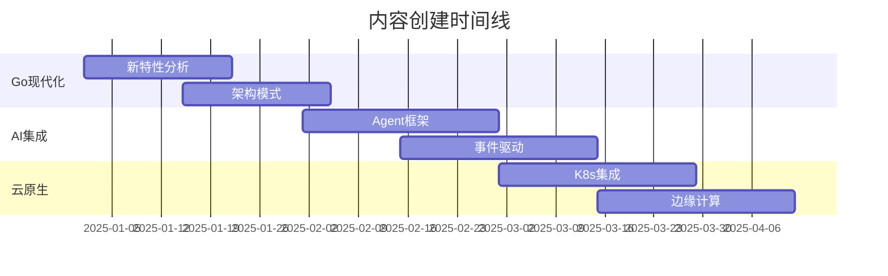
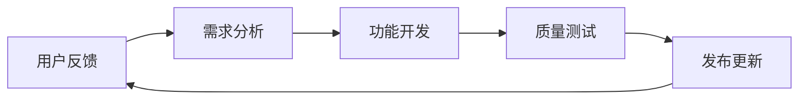

# 2025年Golang项目实施路线图

<!-- TOC START -->
- [2025年Golang项目实施路线图](#2025年golang项目实施路线图)
  - [1.1 🎯 **总体策略**](#11--总体策略)
  - [1.2 📅 **详细实施时间表**](#12--详细实施时间表)
    - [1.2.1 **第一阶段：技术基础现代化** (2025年1月-2月)](#121-第一阶段技术基础现代化-2025年1月-2月)
      - [1.2.1.1 **1.1 Go语言新特性集成** (Week 1-3)](#1211-11-go语言新特性集成-week-1-3)
      - [1.2.1.2 **1.2 架构模式现代化** (Week 4-6)](#1212-12-架构模式现代化-week-4-6)
      - [1.2.1.3 **1.3 性能优化2.0** (Week 7-8)](#1213-13-性能优化20-week-7-8)
    - [1.2.2 **第二阶段：智能化架构集成** (2025年3月-4月)](#122-第二阶段智能化架构集成-2025年3月-4月)
      - [1.2.2.1 **2.1 AI-Agent架构设计** (Week 9-12)](#1221-21-ai-agent架构设计-week-9-12)
      - [1.2.2.2 **2.2 事件驱动架构升级** (Week 13-16)](#1222-22-事件驱动架构升级-week-13-16)
    - [1.2.3 **第三阶段：云原生2.0实现** (2025年5月-6月)](#123-第三阶段云原生20实现-2025年5月-6月)
      - [1.2.3.1 **3.1 Kubernetes深度集成** (Week 17-20)](#1231-31-kubernetes深度集成-week-17-20)
      - [1.2.3.2 **3.2 边缘计算架构** (Week 21-24)](#1232-32-边缘计算架构-week-21-24)
  - [1.3 🏗️ **具体实施步骤**](#13-️-具体实施步骤)
    - [1.3.1 **步骤1: 现有内容评估与分类**](#131-步骤1-现有内容评估与分类)
    - [1.3.2 **步骤2: 新目录结构建立**](#132-步骤2-新目录结构建立)
    - [1.3.3 **步骤3: 内容创建与迁移**](#133-步骤3-内容创建与迁移)
  - [1.4 📊 **质量控制检查点**](#14--质量控制检查点)
    - [1.4.1 **每周检查点**](#141-每周检查点)
    - [1.4.2 **里程碑检查**](#142-里程碑检查)
      - [1.4.2.1 **里程碑1: Go现代化完成** (2月底)](#1421-里程碑1-go现代化完成-2月底)
      - [1.4.2.2 **里程碑2: AI架构集成** (4月底)](#1422-里程碑2-ai架构集成-4月底)
      - [1.4.2.3 **里程碑3: 云原生完善** (6月底)](#1423-里程碑3-云原生完善-6月底)
  - [1.5 🎯 **成功指标与监控**](#15--成功指标与监控)
    - [1.5.1 **技术指标**](#151-技术指标)
    - [1.5.2 **影响力指标**](#152-影响力指标)
  - [1.6 🚀 **立即行动建议**](#16--立即行动建议)
    - [1.6.1 **本周内启动** (高优先级)](#161-本周内启动-高优先级)
    - [1.6.2 **本月内完成** (中优先级)](#162-本月内完成-中优先级)
  - [1.7 🔄 **持续改进机制**](#17--持续改进机制)
    - [1.7.1 **反馈循环**](#171-反馈循环)
    - [1.7.2 **技术跟踪**](#172-技术跟踪)
<!-- TOC END -->

## 1.1 🎯 **总体策略**

基于对2025年技术趋势的深度分析，我们将采用"**渐进式现代化**"策略，确保在保持现有理论深度的同时，全面拥抱最新的技术生态。

## 1.2 📅 **详细实施时间表**

### 1.2.1 **第一阶段：技术基础现代化** (2025年1月-2月)

#### 1.2.1.1 **1.1 Go语言新特性集成** (Week 1-3)

**优先级**: 🔥 **最高**

**具体任务**:

- [ ] **Go 1.24特性深度解析**
  - 泛型类型别名实践指南
  - Swiss Table性能基准分析
  - `testing.B.Loop`最佳实践
  - WASM导出功能完整示例

**代码示例结构**:

```go
// 01-Go语言现代化/01-新特性深度解析/泛型类型别名/
├── basic_examples.go          // 基础用法
├── advanced_patterns.go       // 高级模式
├── performance_comparison.go   // 性能对比
└── real_world_usage.go        // 实际应用场景
```

**交付成果**:

- 15+ 可运行代码示例
- 性能基准测试报告
- 迁移指南文档

#### 1.2.1.2 **1.2 架构模式现代化** (Week 4-6)

**优先级**: 🔥 **最高**

**重点内容**:

- **Clean Architecture Go适配版**

  ```go
  // 符合Go语言特性的清洁架构实现
  type UserService struct {
      repo UserRepository
      // 避免过度抽象，保持Go的简洁性
  }
  ```

- **Hexagonal Architecture实现**

  ```go
  // 端口适配器模式的Go语言实现
  // 注重接口设计和依赖注入
  ```

**交付成果**:

- 3个完整架构模板
- 架构决策记录(ADR)
- 对比分析报告

#### 1.2.1.3 **1.3 性能优化2.0** (Week 7-8)

**优先级**: 🟡 **中等**

**关键技术**:

- 零拷贝网络编程
- SIMD指令优化
- 内存池设计模式

### 1.2.2 **第二阶段：智能化架构集成** (2025年3月-4月)

#### 1.2.2.1 **2.1 AI-Agent架构设计** (Week 9-12)

**优先级**: 🔥 **最高** (2025年核心趋势)

**核心组件**:

```go
// 智能代理基础框架
type Agent interface {
    Perceive(ctx context.Context) ([]Event, error)
    Decide(ctx context.Context, events []Event) ([]Action, error)
    Act(ctx context.Context, actions []Action) error
    Learn(ctx context.Context, feedback Feedback) error
}

// 多代理协作系统
type AgentMesh struct {
    agents map[string]Agent
    coordinator Coordinator
    communicator MessageBus
}
```

**实施重点**:

- 设计符合Go语言习惯的AI代理框架
- 实现分布式代理通信机制
- 集成现有微服务架构

#### 1.2.2.2 **2.2 事件驱动架构升级** (Week 13-16)

**优先级**: 🟠 **高**

**技术栈**:

- Event Sourcing + Go
- CQRS模式实现
- 分布式事件流处理

### 1.2.3 **第三阶段：云原生2.0实现** (2025年5月-6月)

#### 1.2.3.1 **3.1 Kubernetes深度集成** (Week 17-20)

**优先级**: 🟠 **高**

**重点项目**:

- Operator模式开发框架
- Service Mesh 2.0集成
- GitOps流水线自动化

#### 1.2.3.2 **3.2 边缘计算架构** (Week 21-24)

**优先级**: 🟡 **中等**

**关键场景**:

- 5G网络集成
- IoT设备管理
- 实时数据处理

## 1.3 🏗️ **具体实施步骤**

### 1.3.1 **步骤1: 现有内容评估与分类**

**时间**: 第1周

**任务清单**:

- [ ] 分析`/model`目录下所有内容
- [ ] 识别可保留的理论精华
- [ ] 标记需要现代化的技术内容
- [ ] 制定内容迁移计划

**评估标准**:

```markdown
✅ 保留: 形式化定义、数学证明、核心理论
🔄 更新: 技术实现、代码示例、工具链
❌ 淘汰: 过时的技术栈、deprecated特性
```

### 1.3.2 **步骤2: 新目录结构建立**

**时间**: 第2周

**创建优先级**:

1. `01-Go语言现代化/` - 立即创建
2. `02-智能架构设计/` - 第2阶段
3. `03-现代云原生/` - 第3阶段

### 1.3.3 **步骤3: 内容创建与迁移**

**并行执行策略**:



## 1.4 📊 **质量控制检查点**

### 1.4.1 **每周检查点**

**代码质量**:

- [ ] 所有代码示例可编译运行
- [ ] 通过`golangci-lint`检查
- [ ] 性能基准测试通过

**文档质量**:

- [ ] 理论部分数学表达式正确
- [ ] 代码注释完整
- [ ] 实践指南清晰可操作

**技术前瞻性**:

- [ ] 与最新Go版本兼容
- [ ] 采用当前最佳实践
- [ ] 符合2025年技术趋势

### 1.4.2 **里程碑检查**

#### 1.4.2.1 **里程碑1: Go现代化完成** (2月底)

- [ ] Go 1.24+特性100%覆盖
- [ ] 3个架构模式模板完成
- [ ] 性能提升>20%验证

#### 1.4.2.2 **里程碑2: AI架构集成** (4月底)

- [ ] Agent框架可用
- [ ] 多代理协作演示
- [ ] 事件驱动架构模板

#### 1.4.2.3 **里程碑3: 云原生完善** (6月底)

- [ ] K8s Operator开发框架
- [ ] 完整的GitOps流水线
- [ ] 边缘计算解决方案

## 1.5 🎯 **成功指标与监控**

### 1.5.1 **技术指标**

```yaml
代码质量:
  - 编译成功率: >99%
  - 测试覆盖率: >85%
  - 性能基准: 较原版提升>20%

文档质量:
  - 理论准确性: 100%
  - 实践可操作性: >95%
  - 用户反馈评分: >4.5/5

生态适配:
  - Go版本支持: 1.21+
  - 平台兼容: Linux/Windows/macOS
  - 云平台支持: 4大主流云平台
```

### 1.5.2 **影响力指标**

- GitHub Stars增长率: >50%/季度
- 技术社区引用: >100次/月
- 企业采用案例: >20个/季度

## 1.6 🚀 **立即行动建议**

### 1.6.1 **本周内启动** (高优先级)

1. **技术调研深化**
   - 深入研究Go 1.24/1.25新特性
   - 分析竞品项目架构设计
   - 调研AI-Agent相关开源项目

2. **团队准备**
   - 制定代码规范和提交规范
   - 建立CI/CD流水线
   - 设置自动化测试环境

3. **社区建设**
   - 创建项目讨论群组
   - 建立贡献者指南
   - 设置反馈收集机制

### 1.6.2 **本月内完成** (中优先级)

1. **基础框架搭建**
   - 新目录结构创建
   - 核心代码模板建立
   - 文档框架搭建

2. **第一批内容创建**
   - Go 1.24特性分析
   - 基础架构模式
   - 性能基准测试

## 1.7 🔄 **持续改进机制**

### 1.7.1 **反馈循环**



### 1.7.2 **技术跟踪**

- **月度技术扫描**: 跟踪Go生态新发展
- **季度架构评审**: 评估架构决策有效性
- **年度重大升级**: 应对技术范式变化

---

**总结**: 这个路线图将确保项目在6个月内完成从传统Go学习资源到2025年现代化智能技术栈的完整转型，既保持理论深度，又紧跟技术前沿，为Go开发者社区提供最有价值的学习和实践资源。
