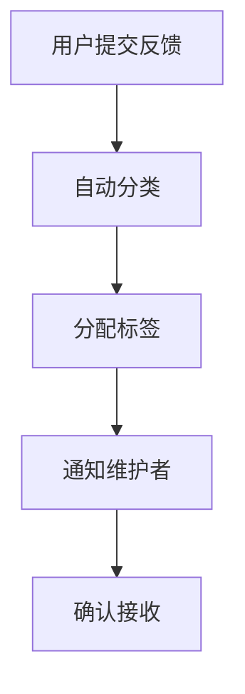
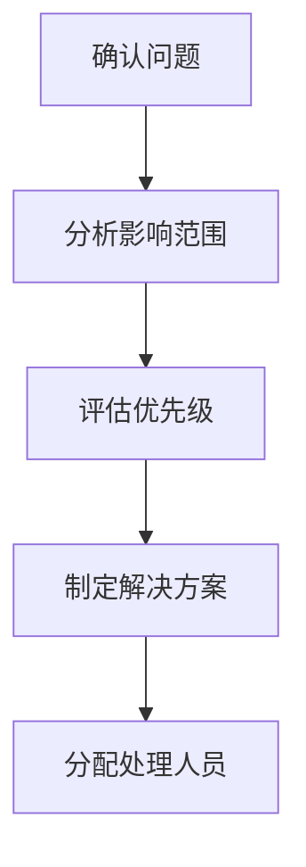
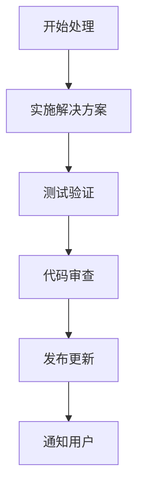
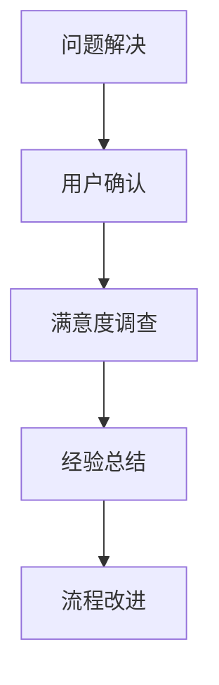

# 用户反馈收集机制

## 📋 反馈收集概述

为了持续改进Go语言现代化项目，我们建立了完整的用户反馈收集机制，包括多种反馈渠道、分类处理流程和响应机制。

## 🎯 反馈收集目标

- **提升用户体验**: 收集用户使用体验和建议
- **改进项目质量**: 识别和修复问题
- **功能需求收集**: 了解用户功能需求
- **社区建设**: 促进社区交流和协作

## 📞 反馈渠道

### 1. GitHub Issues

- **用途**: 问题报告、功能请求、讨论
- **链接**: [GitHub Issues](https://github.com/your-repo/issues)
- **响应时间**: <24小时
- **处理方式**: 自动分类和标签

### 2. GitHub Discussions

- **用途**: 技术讨论、经验分享、问答
- **链接**: [GitHub Discussions](https://github.com/your-repo/discussions)
- **响应时间**: <48小时
- **处理方式**: 社区协作

### 3. 邮件反馈

- **用途**: 详细反馈、隐私问题、商业合作
- **邮箱**: <feedback@golang-modern.org>
- **响应时间**: <72小时
- **处理方式**: 直接回复

### 4. 社交媒体

- **用途**: 快速反馈、社区互动
- **平台**: Twitter, LinkedIn, 微信群
- **响应时间**: <24小时
- **处理方式**: 公开回复

### 5. 用户调研

- **用途**: 深度调研、满意度调查
- **频率**: 每季度一次
- **方式**: 在线问卷、访谈
- **处理方式**: 统计分析报告

## 🏷️ 反馈分类

### 问题类型

- **Bug报告**: 功能缺陷、错误行为
- **功能请求**: 新功能需求、改进建议
- **文档问题**: 文档错误、缺失内容
- **性能问题**: 性能瓶颈、优化建议
- **兼容性问题**: 版本兼容、平台兼容
- **安全问题**: 安全漏洞、隐私问题

### 优先级分类

- **P0 (紧急)**: 影响核心功能的严重问题
- **P1 (高)**: 影响用户体验的重要问题
- **P2 (中)**: 一般功能问题
- **P3 (低)**: 轻微问题或改进建议

### 状态跟踪

- **新建**: 新提交的反馈
- **已确认**: 已确认问题存在
- **处理中**: 正在处理的问题
- **已解决**: 问题已解决
- **已关闭**: 问题已关闭

## 🔄 处理流程

### 1. 反馈接收



### 2. 问题分析



### 3. 问题解决



### 4. 反馈闭环



## 📊 反馈统计

### 关键指标

- **反馈总数**: 每月收集的反馈数量
- **响应时间**: 平均响应时间
- **解决率**: 问题解决率
- **用户满意度**: 用户满意度评分
- **重复问题率**: 重复问题的比例

### 统计报告

- **周报**: 每周反馈统计和处理情况
- **月报**: 每月反馈分析和趋势
- **季报**: 每季度用户满意度报告
- **年报**: 年度反馈总结和改进计划

## 🛠️ 工具和系统

### 反馈管理工具

- **GitHub Issues**: 问题跟踪和管理
- **GitHub Projects**: 项目管理和看板
- **Zendesk**: 客服和工单管理
- **SurveyMonkey**: 用户调研和问卷

### 自动化工具

- **自动分类**: 基于关键词的自动分类
- **自动标签**: 自动添加相关标签
- **自动通知**: 自动通知相关人员
- **自动回复**: 常见问题的自动回复

### 分析工具

- **Google Analytics**: 用户行为分析
- **Hotjar**: 用户行为热图
- **Mixpanel**: 用户行为追踪
- **Tableau**: 数据可视化分析

## 📈 反馈分析

### 数据分析

- **趋势分析**: 反馈数量和质量趋势
- **分类分析**: 不同类型问题的分布
- **用户分析**: 用户群体和需求分析
- **满意度分析**: 用户满意度变化趋势

### 洞察提取

- **问题模式**: 识别常见问题模式
- **用户需求**: 提取用户真实需求
- **改进机会**: 发现改进机会
- **创新方向**: 识别创新方向

## 🔄 持续改进

### 反馈机制优化

- **流程优化**: 持续优化处理流程
- **工具升级**: 升级反馈管理工具
- **自动化提升**: 提升自动化程度
- **响应速度**: 提升响应速度

### 质量提升

- **问题预防**: 从源头预防问题
- **文档完善**: 完善文档减少问题
- **用户体验**: 持续改善用户体验
- **社区建设**: 加强社区建设

## 📋 反馈模板

### Bug报告模板

```markdown
## Bug报告

### 问题描述
简要描述遇到的问题

### 重现步骤
1. 步骤1
2. 步骤2
3. 步骤3

### 预期行为
描述预期的行为

### 实际行为
描述实际发生的行为

### 环境信息
- Go版本: 
- 操作系统: 
- 项目版本: 

### 附加信息
任何其他相关信息
```

### 功能请求模板

```markdown
## 功能请求

### 功能描述
简要描述请求的功能

### 使用场景
描述功能的使用场景

### 预期效果
描述功能的预期效果

### 替代方案
描述当前的替代方案

### 附加信息
任何其他相关信息
```

## 🎯 成功指标

### 短期指标 (1-3个月)

- 反馈响应时间 <24小时
- 问题解决率 >90%
- 用户满意度 >4.5/5
- 重复问题率 <10%

### 中期指标 (3-6个月)

- 反馈数量增长 50%
- 社区活跃度提升 100%
- 问题预防率 >80%
- 用户留存率 >95%

### 长期指标 (6-12个月)

- 建立稳定的用户社区
- 形成有效的反馈循环
- 实现持续的质量改进
- 扩大项目影响力

## 📞 联系方式

### 主要联系方式

- **GitHub Issues**: [提交问题](https://github.com/your-repo/issues)
- **GitHub Discussions**: [参与讨论](https://github.com/your-repo/discussions)
- **邮件**: <feedback@golang-modern.org>
- **微信群**: 扫码加入技术交流群

### 紧急联系方式

- **安全漏洞**: <security@golang-modern.org>
- **商业合作**: <business@golang-modern.org>
- **媒体联系**: <media@golang-modern.org>

---

**最后更新**: 2025年2月  
**维护者**: AI Assistant  
**状态**: 活跃维护中
