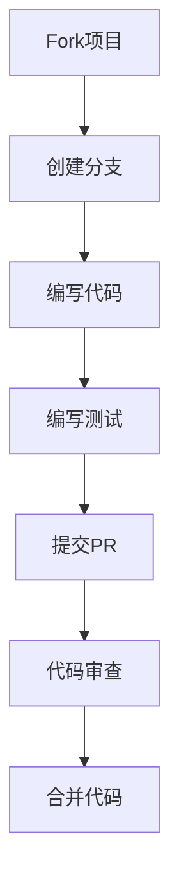

# Go语言现代化项目社区建设指南

## 🌟 社区建设概述

Go语言现代化项目致力于建立一个活跃、友好、技术驱动的开发者社区。本指南提供了完整的社区建设策略、参与方式和贡献指南。

## 🎯 社区建设目标

- **技术交流**: 促进Go语言技术交流和分享
- **知识传播**: 传播现代化Go开发最佳实践
- **协作开发**: 促进开源协作和共同开发
- **人才培养**: 培养现代化Go开发人才
- **生态建设**: 建设完整的Go开发生态

## 👥 社区结构

### 核心团队

- **项目维护者**: 负责项目整体规划和维护
- **技术专家**: 负责技术指导和代码审查
- **社区管理员**: 负责社区管理和活动组织
- **文档维护者**: 负责文档编写和维护

### 贡献者群体

- **代码贡献者**: 贡献代码和功能
- **文档贡献者**: 贡献文档和教程
- **测试贡献者**: 贡献测试用例和测试工具
- **翻译贡献者**: 贡献多语言翻译
- **社区贡献者**: 参与社区活动和推广

### 用户群体

- **初学者**: 学习Go语言的新手
- **进阶开发者**: 有一定经验的Go开发者
- **专家级开发者**: 资深的Go技术专家
- **企业用户**: 使用项目进行企业开发

## 🚀 参与方式

### 1. 代码贡献

#### 贡献流程



#### 贡献指南

- **代码规范**: 遵循Go官方代码规范
- **测试要求**: 新功能必须包含测试用例
- **文档更新**: 更新相关文档
- **提交信息**: 使用清晰的提交信息

#### 贡献类型

- **Bug修复**: 修复现有问题
- **功能开发**: 开发新功能
- **性能优化**: 优化性能
- **代码重构**: 重构代码结构

### 2. 文档贡献

#### 文档类型

- **技术文档**: API文档、使用指南
- **教程文档**: 学习教程、最佳实践
- **示例文档**: 代码示例、使用案例
- **翻译文档**: 多语言翻译

#### 文档标准

- **结构清晰**: 使用统一的文档结构
- **内容准确**: 确保内容准确性
- **示例完整**: 提供完整的代码示例
- **定期更新**: 定期更新文档内容

### 3. 社区活动

#### 技术分享

- **技术讲座**: 定期举办技术讲座
- **代码审查**: 组织代码审查活动
- **最佳实践分享**: 分享开发最佳实践
- **问题讨论**: 讨论技术问题和解决方案

#### 学习活动

- **新手指导**: 为新手提供指导
- **学习小组**: 组织学习小组
- **项目实践**: 组织项目实践活动
- **技能竞赛**: 举办编程技能竞赛

#### 社区聚会

- **线下聚会**: 定期举办线下聚会
- **线上会议**: 组织线上技术会议
- **工作坊**: 举办技术工作坊
- **黑客马拉松**: 组织编程马拉松

## 📋 贡献指南

### 代码贡献

#### 开发环境设置

```bash
# 1. Fork项目到个人账户
# 2. 克隆项目
git clone https://github.com/your-username/golang.git
cd golang

# 3. 添加上游仓库
git remote add upstream https://github.com/original-repo/golang.git

# 4. 安装依赖
go mod download

# 5. 运行测试
go test ./...
```

#### 提交规范

```bash
# 提交信息格式
<type>(<scope>): <subject>

# 示例
feat(concurrency): add generic worker pool
fix(performance): optimize memory allocation
docs(readme): update installation guide
test(agent): add unit tests for agent
```

#### 代码审查

- **功能正确性**: 确保功能正确实现
- **代码质量**: 检查代码质量和规范
- **性能影响**: 评估性能影响
- **测试覆盖**: 确保测试覆盖率

### 文档贡献

#### 文档结构

```markdown
# 标题

## 概述
简要描述内容

## 详细内容
详细的技术内容

## 示例
代码示例

## 参考资料
相关链接和资源
```

#### 文档要求

- **准确性**: 确保技术内容准确
- **完整性**: 提供完整的信息
- **可读性**: 使用清晰的语言
- **时效性**: 保持内容更新

### 社区贡献

#### 社区管理

- **友好交流**: 保持友好和尊重的态度
- **技术讨论**: 专注于技术讨论
- **帮助他人**: 积极帮助其他社区成员
- **遵守规则**: 遵守社区规则和准则

#### 活动组织

- **活动策划**: 策划有意义的技术活动
- **内容准备**: 准备高质量的活动内容
- **参与引导**: 引导参与者积极参与
- **反馈收集**: 收集活动反馈并改进

## 🏆 贡献者认可

### 认可机制

- **贡献者列表**: 在README中列出贡献者
- **贡献统计**: 统计和展示贡献数据
- **特殊贡献**: 认可特殊贡献
- **长期贡献**: 认可长期贡献者

### 奖励机制

- **贡献者徽章**: 颁发贡献者徽章
- **技术专家认证**: 认证技术专家
- **社区领袖**: 认可社区领袖
- **年度贡献者**: 评选年度贡献者

## 📊 社区指标

### 活跃度指标

- **贡献者数量**: 活跃贡献者数量
- **提交频率**: 代码提交频率
- **问题解决**: 问题解决速度
- **社区互动**: 社区互动频率

### 质量指标

- **代码质量**: 代码质量评分
- **文档质量**: 文档质量评分
- **测试覆盖率**: 测试覆盖率
- **用户满意度**: 用户满意度

### 增长指标

- **用户增长**: 用户数量增长
- **贡献增长**: 贡献数量增长
- **社区规模**: 社区规模扩大
- **影响力提升**: 项目影响力提升

## 🔧 社区工具

### 协作工具

- **GitHub**: 代码协作和项目管理
- **Slack**: 实时交流和协作
- **Discord**: 社区聊天和语音
- **Zoom**: 在线会议和讲座

### 文档工具

- **GitBook**: 文档编写和发布
- **Notion**: 知识管理和协作
- **Confluence**: 团队协作和文档
- **Markdown**: 文档编写格式

### 活动工具

- **Eventbrite**: 活动报名和管理
- **Meetup**: 线下活动组织
- **YouTube**: 视频分享和直播
- **Twitch**: 编程直播和互动

## 📅 社区活动计划

### 月度活动

- **技术分享会**: 每月一次技术分享
- **代码审查会**: 每月一次代码审查
- **新手指导**: 每月一次新手指导
- **问题讨论**: 每月一次问题讨论

### 季度活动

- **技术大会**: 每季度一次技术大会
- **工作坊**: 每季度一次技术工作坊
- **项目展示**: 每季度一次项目展示
- **社区聚会**: 每季度一次社区聚会

### 年度活动

- **年度大会**: 每年一次大型技术大会
- **贡献者聚会**: 每年一次贡献者聚会
- **技术竞赛**: 每年一次编程竞赛
- **社区回顾**: 每年一次社区回顾

## 🎯 社区目标

### 短期目标 (3个月)

- 建立稳定的社区结构
- 吸引100+活跃贡献者
- 组织10+技术活动
- 建立完整的贡献流程

### 中期目标 (6个月)

- 扩大社区规模到1000+成员
- 建立多个专业小组
- 举办大型技术会议
- 建立社区品牌

### 长期目标 (12个月)

- 成为Go语言社区的重要力量
- 建立国际化的社区
- 推动Go语言生态发展
- 培养大量技术人才

## 📞 联系方式

### 社区联系方式

- **GitHub**: [项目仓库](https://github.com/your-repo)
- **Slack**: [加入Slack](https://your-slack.workspace.com)
- **Discord**: [加入Discord](https://discord.gg/your-server)
- **微信群**: 扫码加入微信群

### 活动联系方式

- **活动邮箱**: <events@golang-modern.org>
- **活动网站**: [活动网站](https://events.golang-modern.org)
- **活动日历**: [活动日历](https://calendar.golang-modern.org)

### 媒体联系方式

- **媒体邮箱**: <media@golang-modern.org>
- **新闻稿**: [新闻稿](https://news.golang-modern.org)
- **社交媒体**: [关注我们](https://social.golang-modern.org)

---

**最后更新**: 2025年2月  
**维护者**: AI Assistant  
**状态**: 活跃建设中
