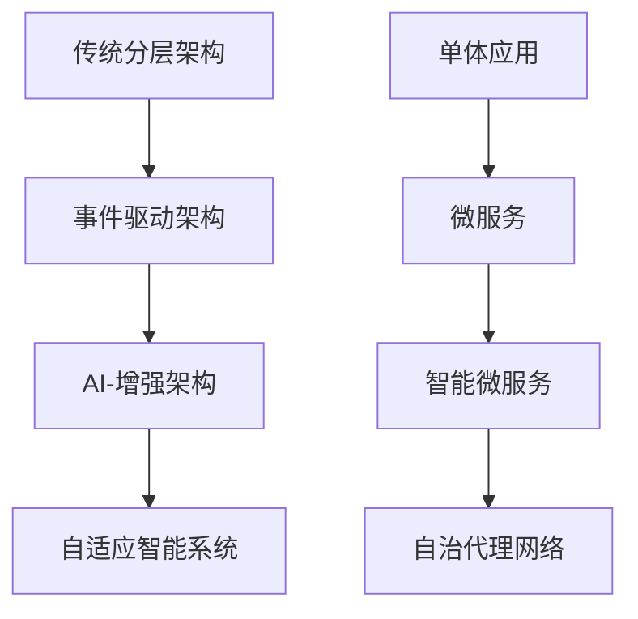

# Golang项目重构建议 - 面向2025年技术生态

## 📊 **当前评估与2025年趋势对比**

### **技术趋势变化**

#### **1. Go 1.24/1.25 新特性影响**

- **泛型类型别名**：简化复杂类型定义
- **Swiss Table 哈希表**：显著提升map性能（2-3%）
- **增强的`go vet`**：更智能的代码分析
- **改进的基准测试**：`testing.B.Loop`简化性能测试
- **WASM增强**：`go:wasmexport`指令支持

#### **2. 架构范式革新**

- **AI-Driven Architecture**：智能代理成为架构核心
- **Agentic Systems**：多智能体协作系统
- **Event-Driven Everything**：事件驱动架构全面普及
- **Edge-First Design**：边缘计算优先的架构设计

#### **3. 生态系统演进**

- **云原生2.0**：从容器化到智能化编排
- **Serverless++**：函数计算与传统服务的混合模式
- **DevSecOps Evolution**：安全左移到"安全无处不在"
- **绿色计算**：可持续性成为架构考量因素

## 🎯 **核心重构策略**

### **策略1: 架构现代化**



**重点领域：**

- **Hexagonal Architecture in Go**：端口适配器模式的Go实现
- **Clean Architecture Evolution**：适配Go语言特性的清洁架构
- **Agent-Based Microservices**：智能代理驱动的微服务
- **Event Sourcing + CQRS**：事件溯源与命令查询责任分离

### **策略2: 目录结构现代化**

```text
golang-2025/
├── 00-核心理论/                    # 理论基础（保留精华）
│   ├── 形式化定义/
│   ├── 架构理论/
│   └── 范畴论应用/
│
├── 01-Go语言现代化/                # Go 1.24+ 特性
│   ├── 01-新特性深度解析/
│   │   ├── 泛型类型别名/
│   │   ├── Swiss-Table性能优化/
│   │   └── WASM增强功能/
│   ├── 02-并发2.0/
│   │   ├── 高级Goroutine模式/
│   │   ├── 无锁数据结构/
│   │   └── 分布式并发/
│   └── 03-互操作性/
│       ├── Python集成/
│       ├── Rust集成/
│       └── WASM跨平台/
│
├── 02-智能架构设计/                # AI-驱动架构
│   ├── 01-Agent-Based-Systems/
│   │   ├── 智能代理设计模式/
│   │   ├── 多代理协作/
│   │   └── 代理网格架构/
│   ├── 02-自适应架构/
│   │   ├── 自愈系统/
│   │   ├── 智能扩缩容/
│   │   └── 预测性维护/
│   └── 03-边缘智能/
│       ├── 边缘计算架构/
│       ├── 5G集成/
│       └── IoT智能网关/
│
├── 03-现代云原生/                  # Cloud Native 2.0
│   ├── 01-Kubernetes进阶/
│   │   ├── Operator模式/
│   │   ├── Service-Mesh-2.0/
│   │   └── GitOps流水线/
│   ├── 02-Serverless混合架构/
│   │   ├── 函数计算优化/
│   │   ├── 冷启动消除/
│   │   └── 状态管理/
│   └── 03-多云战略/
│       ├── 云原生抽象层/
│       ├── 数据主权管理/
│       └── 成本优化/
│
├── 04-高性能系统/                  # Performance 2.0
│   ├── 01-极致性能优化/
│   │   ├── 零拷贝网络编程/
│   │   ├── SIMD指令优化/
│   │   └── 内存池优化/
│   ├── 02-分布式性能/
│   │   ├── 一致性哈希2.0/
│   │   ├── 智能负载均衡/
│   │   └── 全局缓存策略/
│   └── 03-实时计算/
│       ├── 流式处理/
│       ├── 复杂事件处理/
│       └── 毫秒级响应/
│
├── 05-安全与治理/                  # Security-First
│   ├── 01-零信任架构/
│   │   ├── 身份认证2.0/
│   │   ├── 动态授权/
│   │   └── 端到端加密/
│   ├── 02-供应链安全/
│   │   ├── 依赖安全扫描/
│   │   ├── 构建安全/
│   │   └── 运行时保护/
│   └── 03-合规自动化/
│       ├── 策略即代码/
│       ├── 审计自动化/
│       └── 风险评估/
│
├── 06-行业智能化/                  # Industry 4.0
│   ├── 01-金融科技2.0/
│   │   ├── DeFi架构/
│   │   ├── 央行数字货币/
│   │   └── 智能风控/
│   ├── 02-工业4.0/
│   │   ├── 数字孪生/
│   │   ├── 智能制造/
│   │   └── 预测性维护/
│   └── 03-智慧城市/
│       ├── 物联网平台/
│       ├── 智能交通/
│       └── 能源管理/
│
├── 07-可观测性2.0/                 # Observability
│   ├── 01-智能监控/
│   │   ├── AIOps集成/
│   │   ├── 异常检测/
│   │   └── 自动修复/
│   ├── 02-分布式追踪/
│   │   ├── OpenTelemetry进阶/
│   │   ├── 性能分析/
│   │   └── 根因分析/
│   └── 03-成本可观测性/
│       ├── 资源优化/
│       ├── FinOps实践/
│       └── 碳足迹追踪/
│
└── 08-未来技术探索/                # Future Tech
    ├── 01-量子计算接口/
    │   ├── 量子算法抽象/
    │   ├── 混合计算/
    │   └── 量子安全/
    ├── 02-神经形态计算/
    │   ├── 边缘AI芯片/
    │   ├── 脑机接口/
    │   └── 自适应硬件/
    └── 03-可持续计算/
        ├── 绿色架构设计/
        ├── 能效优化/
        └── 循环经济模式/
```

## 🔧 **实施计划**

### **阶段1: 基础现代化 (1-2个月)**

**目标**: 整合Go 1.24+新特性，建立现代化基础

**重点任务**:

1. **Go新特性深度分析**
   - 泛型类型别名实践案例
   - Swiss Table性能基准测试
   - WASM导出功能演示

2. **架构模式现代化**
   - Clean Architecture的Go适配版本
   - Hexagonal Architecture实现
   - 事件驱动架构模板

**交付物**:

- [ ] Go 1.24特性完整指南
- [ ] 现代架构模式代码模板
- [ ] 性能基准测试套件

### **阶段2: 智能化集成 (2-3个月)**

**目标**: 整合AI驱动的架构模式

**重点任务**:

1. **Agent-Based系统设计**
   - 智能代理框架
   - 多代理协作模式
   - 自适应系统实现

2. **AI-Ops集成**
   - 智能监控系统
   - 自动化运维
   - 预测性维护

**交付物**:

- [ ] AI代理框架库
- [ ] 智能运维工具链
- [ ] 自适应系统模板

### **阶段3: 生态完善 (3-4个月)**

**目标**: 建立完整的现代化生态系统

**重点任务**:

1. **云原生2.0工具链**
   - Kubernetes Operator开发
   - Service Mesh集成
   - GitOps流水线

2. **行业解决方案**
   - 金融科技模板
   - 工业4.0解决方案
   - 智慧城市框架

**交付物**:

- [ ] 云原生工具集
- [ ] 行业解决方案库
- [ ] 最佳实践指南

## 📈 **质量保证体系**

### **代码质量**

- **静态分析**: golangci-lint + 自定义规则
- **性能测试**: 持续基准测试 + 性能回归检测
- **安全扫描**: 依赖漏洞扫描 + 代码安全审计

### **文档质量**

- **理论严谨性**: 保持形式化定义的学术标准
- **实践可用性**: 所有示例代码可运行
- **更新及时性**: 跟踪技术发展，季度更新

### **生态兼容性**

- **版本兼容**: 支持Go 1.21+
- **平台兼容**: Linux/Windows/macOS全平台
- **云兼容**: AWS/Azure/GCP/阿里云

## 🎯 **成功指标**

### **技术指标**

- [ ] Go新特性覆盖率 > 95%
- [ ] 代码示例可运行率 > 98%
- [ ] 性能基准提升 > 20%

### **生态指标**

- [ ] 主流云平台支持 100%
- [ ] 行业解决方案 > 10个
- [ ] 社区贡献者 > 50人

### **影响力指标**

- [ ] GitHub Stars > 10K
- [ ] 企业采用案例 > 100个
- [ ] 技术文章引用 > 500次

## 🔮 **未来展望**

### **2025年技术预测**

1. **AI-First Development**: 开发过程全面AI化
2. **Quantum-Ready Architecture**: 量子计算兼容架构
3. **Sustainable Computing**: 绿色计算成为标准
4. **Autonomous Systems**: 完全自治的系统架构

### **持续演进策略**

- **季度技术评估**: 跟踪新兴技术趋势
- **月度内容更新**: 保持内容的时效性
- **年度架构升级**: 重大架构范式升级

---

**结论**: 通过这次重构，项目将从传统的Go学习资源升级为面向2025年的智能化、现代化技术栈完整解决方案，既保持理论深度，又紧跟技术前沿，为Go开发者提供最有价值的学习和实践资源。
