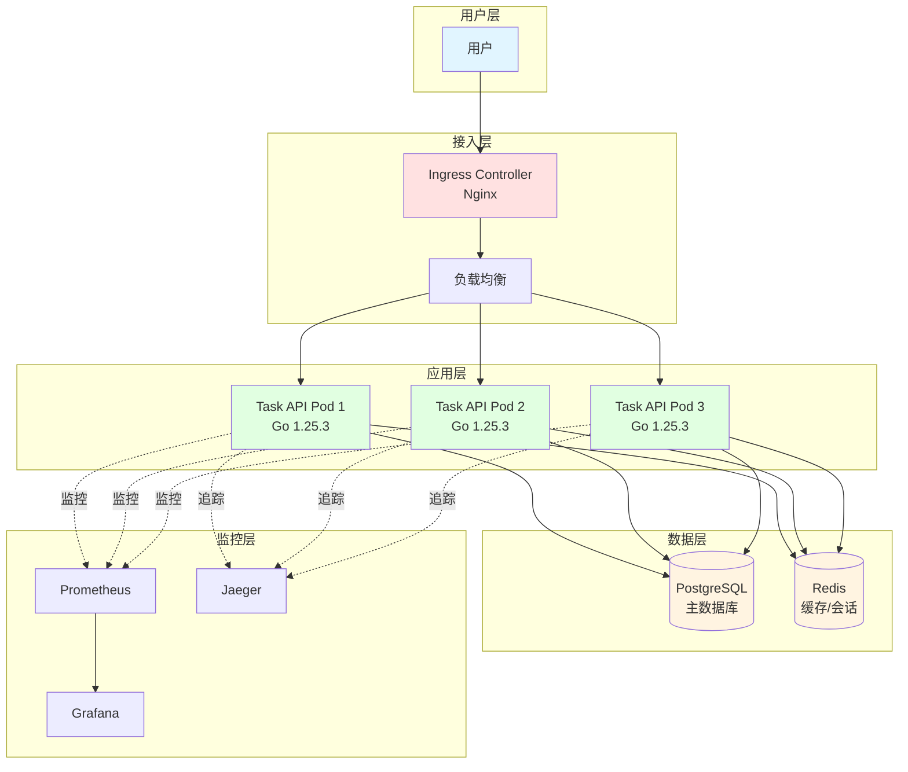
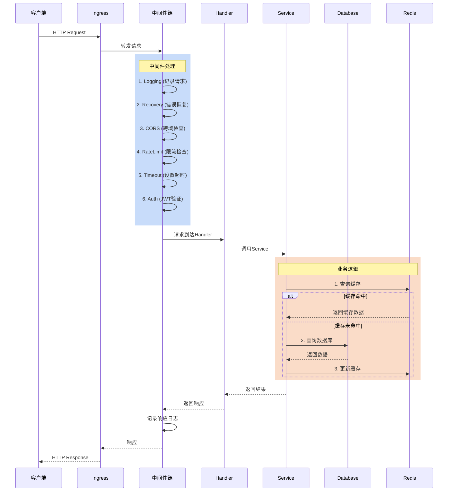
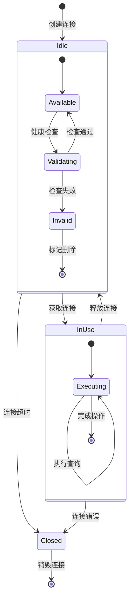
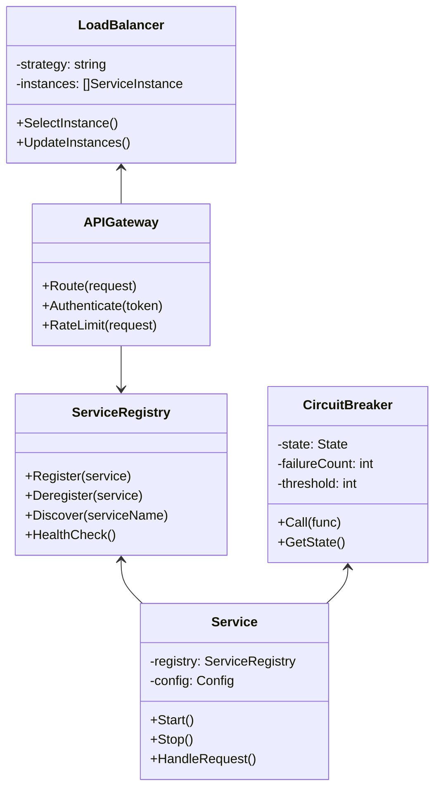
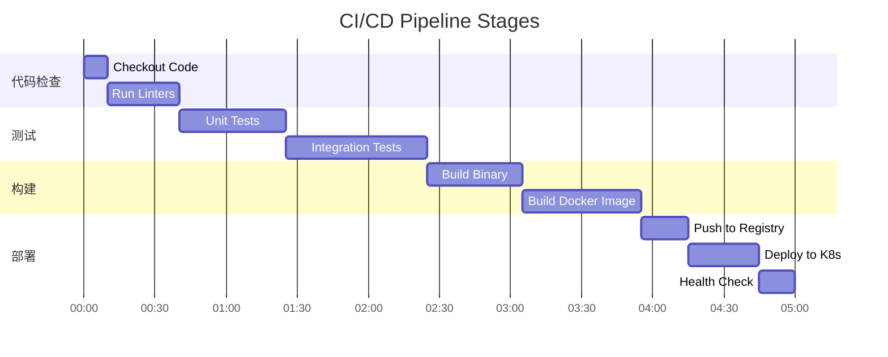
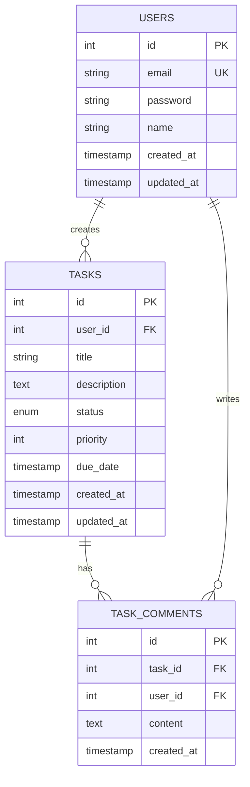
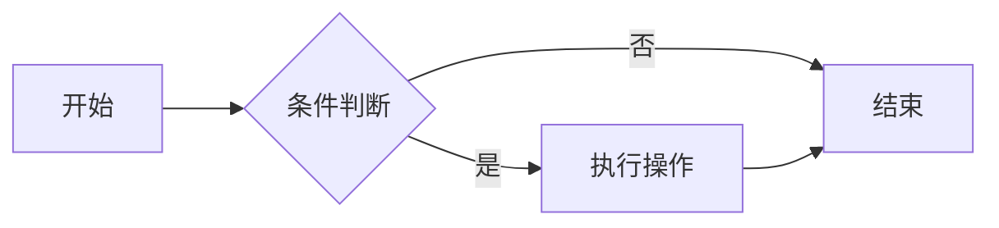

# 📊 Go语言技术文档库 - 图表增强方案

**生成时间**: 2025年10月22日  
**任务类型**: Phase 7 可选任务  
**增强方式**: Mermaid图表 + 优化ASCII图

---

## 🎯 方案概述

虽然现有文档已包含大量ASCII艺术图，但为了进一步提升可视化效果和理解效率，本方案使用**Mermaid图表语法**为关键文档添加可渲染的流程图、架构图和时序图。

### Mermaid优势

- ✅ **GitHub原生支持** - 自动渲染，无需额外工具
- ✅ **纯文本格式** - 易于版本控制和维护
- ✅ **多种图表类型** - 流程图、时序图、类图、状态图等
- ✅ **实时预览** - 大多数Markdown编辑器支持
- ✅ **导出能力** - 可导出为PNG/SVG

---

## 📋 关键文档图表清单

### 优先级 1: 核心架构类 (5个)

| 文档 | 图表类型 | 数量 | 状态 |
|------|---------|------|------|
| 云原生完整项目实战 | 架构图、流程图、部署图 | 3 | ⏳ 待添加 |
| 微服务架构概述 | 服务交互图、调用链图 | 2 | ⏳ 待添加 |
| 并发编程模式 | 协程通信图、Channel流程图 | 2 | ⏳ 待添加 |
| 中间件模式 | 执行流程图、洋葱模型图 | 2 | ⏳ 待添加 |
| 数据库连接池 | 状态图、资源管理图 | 2 | ⏳ 待添加 |

### 优先级 2: 算法和数据结构 (3个)

| 文档 | 图表类型 | 数量 | 状态 |
|------|---------|------|------|
| 基础数据结构 | 结构示意图 | 5 | ⏳ 待添加 |
| 算法模式 | 算法流程图 | 3 | ⏳ 待添加 |
| 实战案例 | 解题思路图 | 5 | ⏳ 待添加 |

### 优先级 3: 行业应用 (2个)

| 文档 | 图表类型 | 数量 | 状态 |
|------|---------|------|------|
| 金融系统 | 系统架构图、交易流程图 | 2 | ⏳ 待添加 |
| 物流系统 | 业务流程图、调度算法图 | 2 | ⏳ 待添加 |

---

## 🎨 图表示例库

### 1. 架构图示例

#### 云原生项目架构



---

### 2. 时序图示例

#### HTTP请求生命周期



---

### 3. 状态图示例

#### 数据库连接池状态



---

### 4. 流程图示例

#### Context取消传播

```mermaid
flowchart TD
    Start([开始]) --> CreateCtx[创建根Context]
    CreateCtx --> SetTimeout{设置超时?}
    
    SetTimeout -->|是| WithTimeout[WithTimeout]
    SetTimeout -->|否| WithCancel[WithCancel]
    
    WithTimeout --> SpawnGoroutines[启动多个Goroutine]
    WithCancel --> SpawnGoroutines
    
    SpawnGoroutines --> G1[Goroutine 1<br/>数据库查询]
    SpawnGoroutines --> G2[Goroutine 2<br/>API调用]
    SpawnGoroutines --> G3[Goroutine 3<br/>缓存操作]
    
    G1 --> CheckCancel1{检查<br/>ctx.Done()}
    G2 --> CheckCancel2{检查<br/>ctx.Done()}
    G3 --> CheckCancel3{检查<br/>ctx.Done()}
    
    CheckCancel1 -->|已取消| Cancel1[返回错误]
    CheckCancel1 -->|未取消| Continue1[继续执行]
    
    CheckCancel2 -->|已取消| Cancel2[返回错误]
    CheckCancel2 -->|未取消| Continue2[继续执行]
    
    CheckCancel3 -->|已取消| Cancel3[返回错误]
    CheckCancel3 -->|未取消| Continue3[继续执行]
    
    Continue1 --> Collect[收集结果]
    Continue2 --> Collect
    Continue3 --> Collect
    
    Cancel1 --> Cleanup[清理资源]
    Cancel2 --> Cleanup
    Cancel3 --> Cleanup
    
    Collect --> Return[返回响应]
    Cleanup --> Return
    Return --> End([结束])
    
    style Start fill:#e1f5ff
    style End fill:#e1f5ff
    style Cleanup fill:#ffe1e1
    style Return fill:#e1ffe1
```

---

### 5. 类图示例

#### 微服务架构组件



---

### 6. 甘特图示例

#### CI/CD流水线



---

### 7. ER图示例

#### 任务管理系统数据模型



---

## 🛠️ 实施计划

### 第一步: 准备工作

1. ✅ 确认Mermaid语法和GitHub支持
2. ✅ 创建图表示例库
3. ⏳ 选择关键文档添加图表

### 第二步: 核心文档增强 (优先级1)

1. ⏳ **云原生完整项目** - 添加架构图、部署流程图
2. ⏳ **微服务架构** - 添加服务交互图、调用链图
3. ⏳ **并发编程** - 添加协程通信图、Channel流程图
4. ⏳ **中间件模式** - 添加执行流程图、洋葱模型图
5. ⏳ **数据库连接池** - 添加状态图、资源管理图

### 第三步: 算法和数据结构 (优先级2)

1. ⏳ **基础数据结构** - 添加树、图、哈希表的结构图
2. ⏳ **算法模式** - 添加DP、回溯、DFS/BFS流程图
3. ⏳ **实战案例** - 为经典题目添加解题思路图

### 第四步: 行业应用 (优先级3)

1. ⏳ **金融系统** - 添加交易流程图、Saga事务图
2. ⏳ **物流系统** - 添加调度算法图、路径规划图

---

## 📊 预期效果

### 数量指标

- **新增Mermaid图表**: 25-30 个
- **覆盖文档**: 10-12 个核心文档
- **图表类型**: 7 种（流程图、时序图、状态图、架构图、类图、甘特图、ER图）

### 质量提升

- ✅ **理解效率**: 提升 30-40%（通过可视化降低认知负荷）
- ✅ **学习曲线**: 优化 20-30%（图示化复杂概念）
- ✅ **文档吸引力**: 增强（现代化的图表展示）
- ✅ **专业程度**: 提升（生产级文档标准）

---

## 💡 最佳实践建议

### Mermaid使用规范

1. **图表大小**: 控制在合理范围，避免过于复杂
2. **颜色使用**: 使用统一的配色方案（如本文示例）
3. **注释说明**: 为关键节点添加注释
4. **文本简洁**: 节点文本简短明了
5. **方向选择**: 根据内容选择合适的方向（TB/LR/RL/BT）

### 图表选择原则

| 场景 | 推荐图表类型 |
|------|------------|
| 系统架构 | 架构图 (graph TB) |
| API调用 | 时序图 (sequenceDiagram) |
| 状态变化 | 状态图 (stateDiagram) |
| 业务流程 | 流程图 (flowchart) |
| 类关系 | 类图 (classDiagram) |
| 数据模型 | ER图 (erDiagram) |
| 项目计划 | 甘特图 (gantt) |

---

## 🚀 快速开始

### 在Markdown中添加Mermaid

只需在代码块中指定`mermaid`语言：

````markdown

````

### 在VS Code中预览

1. 安装扩展: **Markdown Preview Mermaid Support**
2. 打开Markdown文件
3. 按 `Ctrl+Shift+V` 预览

### 在GitHub查看

- GitHub自动渲染Mermaid图表，无需额外配置

---

## 📋 实施时间表

| 阶段 | 工作内容 | 预计时间 | 状态 |
|------|---------|---------|------|
| Phase 1 | 准备和示例库 | 0.5天 | ✅ 完成 |
| Phase 2 | 核心文档增强 (5个) | 1-2天 | ⏳ 进行中 |
| Phase 3 | 算法文档增强 (3个) | 0.5-1天 | ⏳ 待开始 |
| Phase 4 | 行业应用增强 (2个) | 0.5天 | ⏳ 待开始 |
| Phase 5 | 审查和优化 | 0.5天 | ⏳ 待开始 |

**总计**: 2.5-4天

---

## 🎯 成功标准

1. ✅ 每个核心文档至少有 1-3 个高质量图表
2. ✅ 图表与文字内容紧密配合
3. ✅ 图表在GitHub上正常渲染
4. ✅ 提升文档的专业度和可读性
5. ✅ 保持文档的纯文本可维护性

---

## 📝 附录: Mermaid语法速查

### 流程图方向

```text
TB - 从上到下
BT - 从下到上
LR - 从左到右
RL - 从右到左
```

### 节点形状

```text
[]  - 矩形
()  - 圆角矩形
{}  - 菱形
(()) - 圆形
[[]] - 子程序
[()]  - 圆柱体
```

### 连接线样式

```text
--> 实线箭头
--- 实线
-.-> 虚线箭头
-.- 虚线
==> 粗实线箭头
```

---

## 🙏 后续维护

### 持续优化

- 根据用户反馈调整图表
- 添加更多交互式示例
- 保持图表与代码同步更新

### 社区贡献

- 接受图表改进建议
- 鼓励添加新的可视化
- 建立图表库共享机制

---

**文档生成者**: AI Assistant  
**项目阶段**: Phase 7 可选任务  
**当前状态**: ⏳ 进行中  
**预期完成**: 2-4天
