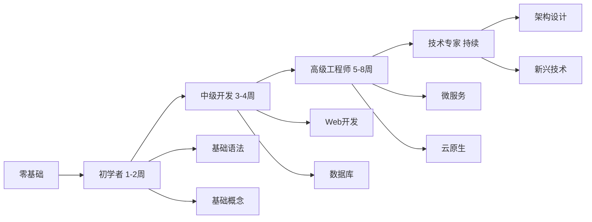

# 📖 Go 1.25.3 完整学习地图

> **版本**: v1.0  
> **更新日期**: 2025年10月23日  
> **适用范围**: Go 1.25.3 Complete Documentation & Code System

---

<div align="center">

## 🎯 从零基础到技术专家的完整路径

**4条学习路径** · **8个技术阶段** · **70+实战项目**

</div>

---

## 📋 目录

- [📖 Go 1.25.3 完整学习地图](#-go-1253-完整学习地图)
  - [🎯 从零基础到技术专家的完整路径](#-从零基础到技术专家的完整路径)
  - [📋 目录](#-目录)
  - [🗺️ 学习路径总览](#️-学习路径总览)
    - [四条主要路径](#四条主要路径)
    - [学习时间分配](#学习时间分配)
  - [🌱 路径1: 初学者入门 (1-2周)](#-路径1-初学者入门-1-2周)
    - [目标](#目标)
    - [第1周：语言基础](#第1周语言基础)
      - [Day 1-2: 环境搭建与Hello World](#day-1-2-环境搭建与hello-world)
      - [Day 3-4: 基础语法](#day-3-4-基础语法)
      - [Day 5-7: 复合类型与函数](#day-5-7-复合类型与函数)
    - [第2周：进阶概念](#第2周进阶概念)
      - [Day 8-10: 接口与并发](#day-8-10-接口与并发)
      - [Day 11-14: 错误处理与测试](#day-11-14-错误处理与测试)
    - [✅ 第一阶段完成检查清单](#-第一阶段完成检查清单)
  - [🚀 路径2: 中级开发者 (3-4周)](#-路径2-中级开发者-3-4周)
    - [目标2](#目标2)
    - [第3周：Web开发基础](#第3周web开发基础)
      - [Day 15-17: HTTP编程](#day-15-17-http编程)
      - [Day 18-21: Web框架](#day-18-21-web框架)
    - [第4周：数据库与持久化](#第4周数据库与持久化)
      - [Day 22-24: 数据库操作](#day-22-24-数据库操作)
      - [Day 25-28: ORM框架](#day-25-28-orm框架)
    - [✅ 第二阶段完成检查清单](#-第二阶段完成检查清单)
  - [🏆 路径3: 高级工程师 (5-8周)](#-路径3-高级工程师-5-8周)
    - [目标3](#目标3)
    - [第5-6周：微服务架构](#第5-6周微服务架构)
      - [Day 29-35: 微服务基础](#day-29-35-微服务基础)
      - [Day 36-42: 服务治理](#day-36-42-服务治理)
    - [第7-8周：云原生技术](#第7-8周云原生技术)
      - [Day 43-49: 容器化](#day-43-49-容器化)
      - [Day 50-56: 云原生生态](#day-50-56-云原生生态)
    - [✅ 第三阶段完成检查清单](#-第三阶段完成检查清单)
  - [🌟 路径4: 技术专家 (持续)](#-路径4-技术专家-持续)
    - [目标4](#目标4)
    - [阶段1: 架构设计精通](#阶段1-架构设计精通)
    - [阶段2: 性能优化专家](#阶段2-性能优化专家)
    - [阶段3: 新兴技术探索](#阶段3-新兴技术探索)
    - [✅ 第四阶段完成检查清单](#-第四阶段完成检查清单)
  - [📚 学习资源索引](#-学习资源索引)
    - [核心文档](#核心文档)
    - [代码示例](#代码示例)
  - [🎯 实战项目清单](#-实战项目清单)
    - [按难度分类](#按难度分类)
      - [⭐ 初级项目 (1-16)](#-初级项目-1-16)
      - [⭐⭐⭐ 中级项目 (17-28)](#-中级项目-17-28)
      - [⭐⭐⭐⭐ 高级项目 (29-40)](#-高级项目-29-40)
      - [⭐⭐⭐⭐⭐ 专家级项目 (41-70)](#-专家级项目-41-70)
  - [📊 学习进度追踪](#-学习进度追踪)
    - [进度表模板](#进度表模板)
  - [🎓 学习建议](#-学习建议)
    - [学习方法](#学习方法)
    - [常见问题](#常见问题)
  - [📞 获取帮助](#-获取帮助)
    - [资源链接](#资源链接)
    - [推荐资源](#推荐资源)
  - [🎉 开始你的Go语言学习之旅](#-开始你的go语言学习之旅)

---

## 🗺️ 学习路径总览

### 四条主要路径



### 学习时间分配

| 路径 | 时间 | 知识点 | 实战项目 | 难度 |
|------|------|--------|----------|------|
| **初学者** | 1-2周 | 30+ | 10+ | ⭐ |
| **中级开发** | 3-4周 | 50+ | 20+ | ⭐⭐⭐ |
| **高级工程师** | 5-8周 | 70+ | 30+ | ⭐⭐⭐⭐ |
| **技术专家** | 持续 | 100+ | 70+ | ⭐⭐⭐⭐⭐ |

---

## 🌱 路径1: 初学者入门 (1-2周)

### 目标

- ✅ 掌握Go语言基础语法
- ✅ 理解Go核心概念
- ✅ 完成10+个小项目
- ✅ 能够编写简单的命令行工具

### 第1周：语言基础

#### Day 1-2: 环境搭建与Hello World

**学习内容**:

- Go安装与配置
- 第一个Go程序
- Go模块系统基础

**文档**:

- 📖 [快速开始指南](docs/🚀-快速开始指南-5分钟上手.md)
- 📖 [环境搭建](docs/01-语言基础/01-环境搭建.md)

**实战项目**:

1. Hello World
2. 简单计算器
3. 命令行参数处理

**代码示例**:

```bash
examples/01-basics/hello-world/
examples/01-basics/calculator/
```

#### Day 3-4: 基础语法

**学习内容**:

- 变量与常量
- 基本数据类型
- 运算符与表达式
- 控制流程（if/for/switch）

**文档**:

- 📖 [基础语法](docs/01-语言基础/02-基础语法.md)
- 📖 [数据类型](docs/01-语言基础/03-数据类型.md)

**实战项目**:
4. 温度转换器
5. 成绩管理系统
6. 猜数字游戏

**代码示例**:

```bash
examples/01-basics/control-flow/
examples/01-basics/data-types/
```

#### Day 5-7: 复合类型与函数

**学习内容**:

- 数组与切片
- Map映射
- 结构体
- 函数与方法

**文档**:

- 📖 [复合类型](docs/01-语言基础/04-复合类型.md)
- 📖 [函数](docs/01-语言基础/05-函数.md)

**实战项目**:
7. 通讯录管理
8. TODO列表
9. 学生信息管理
10. 简单文件处理器

**代码示例**:

```bash
examples/01-basics/composite-types/
examples/01-basics/functions/
```

### 第2周：进阶概念

#### Day 8-10: 接口与并发

**学习内容**:

- 接口概念与应用
- Goroutine基础
- Channel通道
- 简单并发模式

**文档**:

- 📖 [接口](docs/01-语言基础/08-接口.md)
- 📖 [并发编程](docs/01-语言基础/09-并发编程.md)

**实战项目**:
11. 并发下载器
12. 简单爬虫
13. 并发计数器

**代码示例**:

```bash
examples/concurrency/basic/
examples/concurrency/channels/
```

#### Day 11-14: 错误处理与测试

**学习内容**:

- 错误处理模式
- 单元测试
- 基准测试
- 包管理

**文档**:

- 📖 [错误处理](docs/01-语言基础/10-错误处理.md)
- 📖 [测试](docs/01-语言基础/11-测试.md)

**实战项目**:
14. 错误处理示例
15. 测试驱动开发示例
16. 命令行工具集

**代码示例**:

```bash
examples/error-handling/
examples/testing/
```

### ✅ 第一阶段完成检查清单

- [ ] 能够独立搭建Go开发环境
- [ ] 掌握Go基础语法和数据类型
- [ ] 理解函数、方法、接口概念
- [ ] 能够使用goroutine和channel
- [ ] 完成10+个实战项目
- [ ] 通过初学者测试题（80分以上）

---

## 🚀 路径2: 中级开发者 (3-4周)

### 目标2

- ✅ 掌握Web开发技能
- ✅ 熟悉数据库操作
- ✅ 理解RESTful API设计
- ✅ 能够开发中等复杂度的Web应用

### 第3周：Web开发基础

#### Day 15-17: HTTP编程

**学习内容**:

- net/http包使用
- HTTP服务器开发
- 路由处理
- 中间件模式

**文档**:

- 📖 [HTTP编程](docs/03-Web开发/01-HTTP编程基础.md)
- 📖 [Go 1.25.3 HTTP路由增强](docs/10-Go版本特性/05-Go-1.25特性/README.md)

**实战项目**:
17. 简单HTTP服务器
18. RESTful API基础
19. 文件上传下载服务

**代码示例**:

```bash
examples/web/http-server/
examples/web/rest-api/
```

#### Day 18-21: Web框架

**学习内容**:

- Gin框架使用
- Echo框架对比
- 路由与中间件
- 请求验证

**文档**:

- 📖 [Gin框架](docs/03-Web开发/02-Gin框架实战.md)
- 📖 [Web框架对比](docs/13-参考资料/GO-ECOSYSTEM-2025.md)

**实战项目**:
20. 用户认证系统
21. 博客API
22. 图片分享服务

**代码示例**:

```bash
examples/web/gin-example/
examples/web/echo-example/
```

### 第4周：数据库与持久化

#### Day 22-24: 数据库操作

**学习内容**:

- database/sql包
- MySQL操作
- PostgreSQL操作
- 连接池管理

**文档**:

- 📖 [数据库编程](docs/04-数据库编程/01-SQL数据库.md)
- 📖 [连接池优化](docs/04-数据库编程/02-数据库连接池.md)

**实战项目**:
23. CRUD操作示例
24. 事务处理
25. 批量操作优化

**代码示例**:

```bash
examples/database/mysql/
examples/database/postgresql/
```

#### Day 25-28: ORM框架

**学习内容**:

- GORM使用
- 模型定义
- 关联查询
- 迁移管理

**文档**:

- 📖 [GORM实战](docs/04-数据库编程/03-GORM实战.md)

**实战项目**:
26. 用户管理系统（完整版）
27. 电商商品管理
28. 内容管理系统

**代码示例**:

```bash
examples/database/gorm/
examples/database/migrations/
```

### ✅ 第二阶段完成检查清单

- [ ] 能够独立开发HTTP服务
- [ ] 掌握至少一个Web框架
- [ ] 熟练使用数据库（SQL/ORM）
- [ ] 理解RESTful API设计原则
- [ ] 完成20+个实战项目
- [ ] 通过中级测试题（85分以上）

---

## 🏆 路径3: 高级工程师 (5-8周)

### 目标3

- ✅ 掌握微服务架构
- ✅ 熟悉云原生技术
- ✅ 理解分布式系统
- ✅ 能够设计和实现复杂系统

### 第5-6周：微服务架构

#### Day 29-35: 微服务基础

**学习内容**:

- 微服务架构设计
- gRPC使用
- 服务发现
- 负载均衡

**文档**:

- 📖 [微服务架构](docs/05-微服务架构/01-微服务基础.md)
- 📖 [gRPC实战](docs/05-微服务架构/02-gRPC实战.md)

**实战项目**:
29. gRPC服务开发
30. 服务注册与发现
31. API网关实现

**代码示例**:

```bash
examples/microservices/grpc/
examples/microservices/service-discovery/
```

#### Day 36-42: 服务治理

**学习内容**:

- 配置中心
- 分布式追踪
- 服务熔断
- 限流降级

**文档**:

- 📖 [服务治理](docs/05-微服务架构/04-服务治理.md)
- 📖 [分布式追踪](docs/05-微服务架构/05-分布式追踪.md)

**实战项目**:
32. 配置中心实现
33. 分布式追踪系统
34. 熔断器实现

**代码示例**:

```bash
examples/microservices/config-center/
examples/microservices/circuit-breaker/
```

### 第7-8周：云原生技术

#### Day 43-49: 容器化

**学习内容**:

- Docker基础
- Dockerfile编写
- 容器编排
- Kubernetes入门

**文档**:

- 📖 [Docker实践](docs/06-云原生与容器/01-Docker实践.md)
- 📖 [Kubernetes入门](docs/06-云原生与容器/02-Kubernetes入门.md)

**实战项目**:
35. Docker化Go应用
36. Docker Compose多服务
37. Kubernetes部署

**代码示例**:

```bash
examples/cloud-native/docker/
examples/cloud-native/kubernetes/
```

#### Day 50-56: 云原生生态

**学习内容**:

- Service Mesh
- Istio使用
- Prometheus监控
- 日志聚合

**文档**:

- 📖 [Service Mesh](docs/06-云原生与容器/03-Service-Mesh.md)
- 📖 [云原生全景](docs/06-云原生与容器/00-Go-1.25.3云原生生态全景-2025.md)

**实战项目**:
38. Istio服务治理
39. Prometheus监控系统
40. 日志收集系统

**代码示例**:

```bash
examples/cloud-native/service-mesh/
examples/cloud-native/monitoring/
```

### ✅ 第三阶段完成检查清单

- [ ] 掌握微服务架构设计
- [ ] 熟练使用gRPC
- [ ] 理解服务治理概念
- [ ] 掌握Docker和Kubernetes
- [ ] 完成30+个实战项目
- [ ] 通过高级测试题（90分以上）

---

## 🌟 路径4: 技术专家 (持续)

### 目标4

- ✅ 精通架构设计
- ✅ 掌握性能优化
- ✅ 熟悉新兴技术
- ✅ 能够解决复杂技术问题

### 阶段1: 架构设计精通

**学习内容**:

- 25种设计模式
- 4种架构模式
- DDD实践
- 系统设计方法论

**文档**:

- 📖 [设计模式与最佳实践](docs/08-架构设计/00-Go-1.25.3编程设计模式与最佳实践-2025.md)
- 📖 [DDD实践](docs/08-架构设计/05-领域驱动设计.md)

**实战项目**:
41-50. 各种架构模式实现

**代码示例**:

```bash
examples/architecture/patterns/
examples/architecture/ddd/
```

### 阶段2: 性能优化专家

**学习内容**:

- Go内存模型
- GC优化
- 并发优化
- 性能分析工具

**文档**:

- 📖 [性能优化](docs/07-性能优化/)
- 📖 [内存优化](docs/07-性能优化/02-内存优化.md)

**实战项目**:
51-60. 性能优化案例

**代码示例**:

```bash
examples/performance/
examples/profiling/
```

### 阶段3: 新兴技术探索

**学习内容**:

- AI/ML应用
- WebAssembly
- 边缘计算
- 区块链

**文档**:

- 📖 [新兴技术全景](docs/11-高级专题/00-Go-1.25.3新兴技术应用-2025.md)
- 📖 [AI应用](docs/11-高级专题/12-机器学习应用/)

**实战项目**:
61-70. 新兴技术应用

**代码示例**:

```bash
examples/ai-agent/
examples/wasm/
```

### ✅ 第四阶段完成检查清单

- [ ] 精通25种设计模式
- [ ] 掌握4种架构模式
- [ ] 熟练性能优化技巧
- [ ] 了解新兴技术趋势
- [ ] 完成70+个实战项目
- [ ] 通过专家级测试（95分以上）

---

## 📚 学习资源索引

### 核心文档

| 文档 | 路径 | 适用阶段 |
|------|------|----------|
| **Go 1.25.3特性** | [docs/10-Go版本特性/05-Go-1.25特性/](docs/10-Go版本特性/05-Go-1.25特性/) | 所有阶段 |
| **语言基础** | [docs/01-语言基础/](docs/01-语言基础/) | 初学者 |
| **Web开发** | [docs/03-Web开发/](docs/03-Web开发/) | 中级 |
| **数据库编程** | [docs/04-数据库编程/](docs/04-数据库编程/) | 中级 |
| **微服务架构** | [docs/05-微服务架构/](docs/05-微服务架构/) | 高级 |
| **云原生** | [docs/06-云原生与容器/](docs/06-云原生与容器/) | 高级 |
| **性能优化** | [docs/07-性能优化/](docs/07-性能优化/) | 专家 |
| **架构设计** | [docs/08-架构设计/](docs/08-架构设计/) | 专家 |
| **新兴技术** | [docs/11-高级专题/](docs/11-高级专题/) | 专家 |

### 代码示例

| 类别 | 路径 | 数量 |
|------|------|------|
| **基础示例** | [examples/01-basics/](examples/01-basics/) | 16个 |
| **并发示例** | [examples/concurrency/](examples/concurrency/) | 12个 |
| **Web示例** | [examples/web/](examples/web/) | 15个 |
| **数据库示例** | [examples/database/](examples/database/) | 10个 |
| **微服务示例** | [examples/microservices/](examples/microservices/) | 12个 |
| **云原生示例** | [examples/cloud-native/](examples/cloud-native/) | 8个 |
| **架构示例** | [examples/architecture/](examples/architecture/) | 7个 |

---

## 🎯 实战项目清单

### 按难度分类

#### ⭐ 初级项目 (1-16)

1. Hello World
2. 简单计算器
3. 命令行参数处理
4. 温度转换器
5. 成绩管理系统
6. 猜数字游戏
7. 通讯录管理
8. TODO列表
9. 学生信息管理
10. 简单文件处理器
11. 并发下载器
12. 简单爬虫
13. 并发计数器
14. 错误处理示例
15. 测试驱动开发示例
16. 命令行工具集

#### ⭐⭐⭐ 中级项目 (17-28)

1. 简单HTTP服务器
2. RESTful API基础
3. 文件上传下载服务
4. 用户认证系统
5. 博客API
6. 图片分享服务
7. CRUD操作示例
8. 事务处理
9. 批量操作优化
10. 用户管理系统
11. 电商商品管理
12. 内容管理系统

#### ⭐⭐⭐⭐ 高级项目 (29-40)

1. gRPC服务开发
2. 服务注册与发现
3. API网关实现
4. 配置中心实现
5. 分布式追踪系统
6. 熔断器实现
7. Docker化Go应用
8. Docker Compose多服务
9. Kubernetes部署
10. Istio服务治理
11. Prometheus监控系统
12. 日志收集系统

#### ⭐⭐⭐⭐⭐ 专家级项目 (41-70)

41-50. 架构模式实现
51-60. 性能优化案例
61-70. 新兴技术应用

---

## 📊 学习进度追踪

### 进度表模板

```markdown
## 我的学习进度

### 路径1: 初学者 (目标: 2周)
- [ ] Day 1-2: 环境搭建 (0/3项目)
- [ ] Day 3-4: 基础语法 (0/3项目)
- [ ] Day 5-7: 复合类型 (0/4项目)
- [ ] Day 8-10: 接口并发 (0/3项目)
- [ ] Day 11-14: 错误测试 (0/3项目)

### 路径2: 中级开发 (目标: 4周)
- [ ] Day 15-17: HTTP编程 (0/3项目)
- [ ] Day 18-21: Web框架 (0/3项目)
- [ ] Day 22-24: 数据库操作 (0/3项目)
- [ ] Day 25-28: ORM框架 (0/3项目)

### 路径3: 高级工程师 (目标: 8周)
- [ ] Day 29-35: 微服务基础 (0/3项目)
- [ ] Day 36-42: 服务治理 (0/3项目)
- [ ] Day 43-49: 容器化 (0/3项目)
- [ ] Day 50-56: 云原生生态 (0/3项目)

### 路径4: 技术专家 (持续)
- [ ] 架构设计精通 (0/10项目)
- [ ] 性能优化专家 (0/10项目)
- [ ] 新兴技术探索 (0/10项目)

**总进度**: 0/70 项目完成
```

---

## 🎓 学习建议

### 学习方法

1. **理论与实践结合**
   - 每学习一个概念，立即编写代码验证
   - 完成每个阶段的实战项目

2. **循序渐进**
   - 不要跳跃式学习
   - 确保每个阶段基础扎实

3. **多写多练**
   - 代码量决定熟练度
   - 建议每天至少2小时编码

4. **参与社区**
   - 阅读优秀开源项目代码
   - 参与技术讨论和分享

5. **建立知识体系**
   - 使用思维导图整理知识点
   - 定期复习和总结

### 常见问题

**Q1: 我应该选择哪条路径？**

A: 根据你的当前水平：

- 零基础：从路径1开始
- 有其他语言基础：可以加快路径1，重点学习Go特性
- 有Go基础：根据薄弱环节选择路径2或3

**Q2: 每天应该学习多长时间？**

A: 建议：

- 全职学习：6-8小时/天
- 业余学习：2-3小时/天
- 重点是持续性，不是单次时长

**Q3: 如何验证学习效果？**

A: 通过以下方式：

- 完成每个阶段的实战项目
- 阅读和理解优秀开源项目
- 能够解决实际工作中的问题
- 通过阶段性测试

---

## 📞 获取帮助

### 资源链接

- 📖 [主索引](docs/INDEX.md)
- 📖 [术语表](docs/GLOSSARY.md)
- 🚀 [快速开始](docs/🚀-快速开始指南-5分钟上手.md)
- 📦 [代码示例](examples/)

### 推荐资源

- **官方文档**: <https://golang.org/doc/>
- **Go by Example**: <https://gobyexample.com/>
- **Awesome Go**: <https://awesome-go.com/>
- **Go语言中文网**: <https://studygolang.com/>

---

<div align="center">

## 🎉 开始你的Go语言学习之旅

**70+实战项目** · **4条完整路径** · **从零到专家**

---

**项目**: Go 1.25.3 Complete Documentation & Code System  
**版本**: v2.2  
**更新**: 2025-10-23

**🌟 祝你学习愉快！🌟**-

</div>

---

**文档版本**: v1.0  
**适用Go版本**: 1.25.3  
**最后更新**: 2025-10-23  
**维护团队**: Go Project Team
